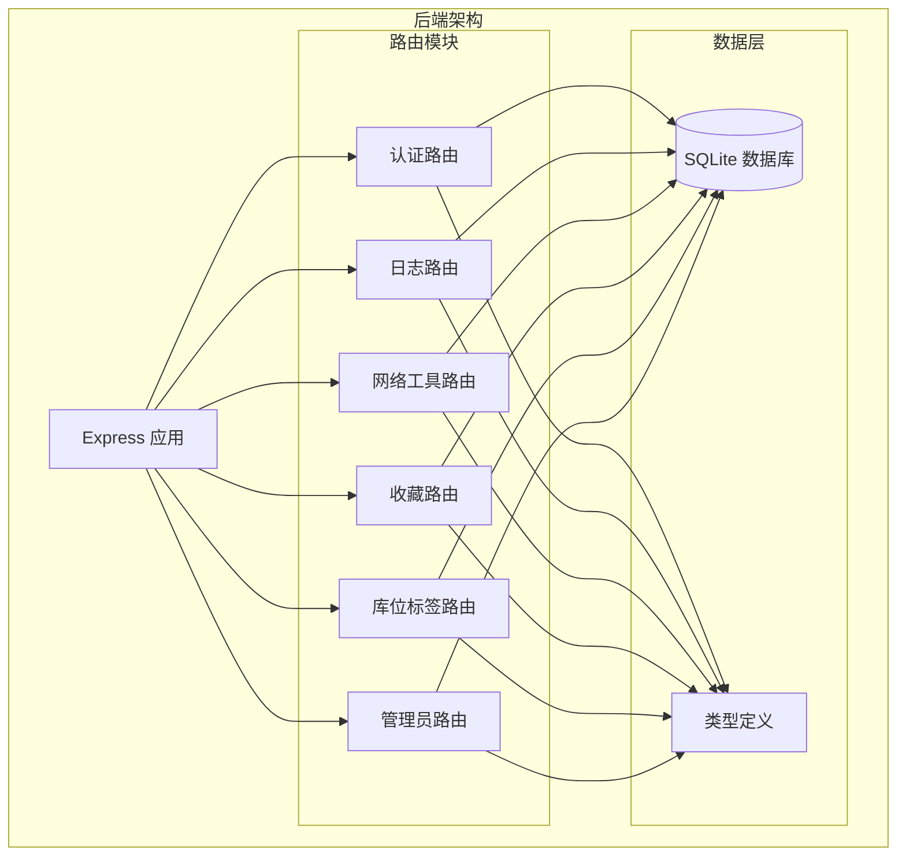
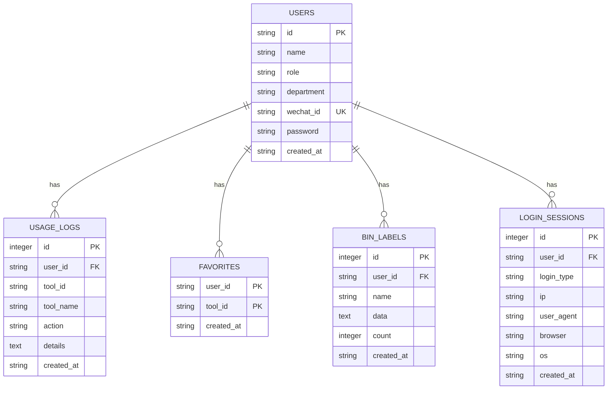
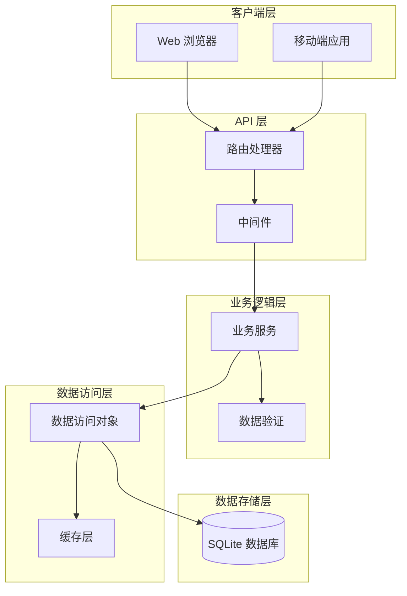
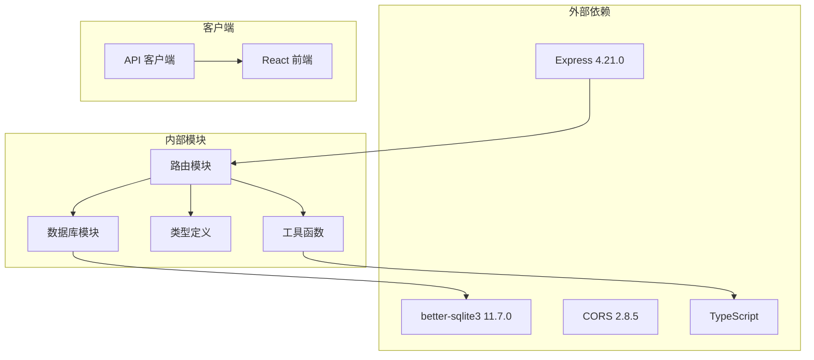
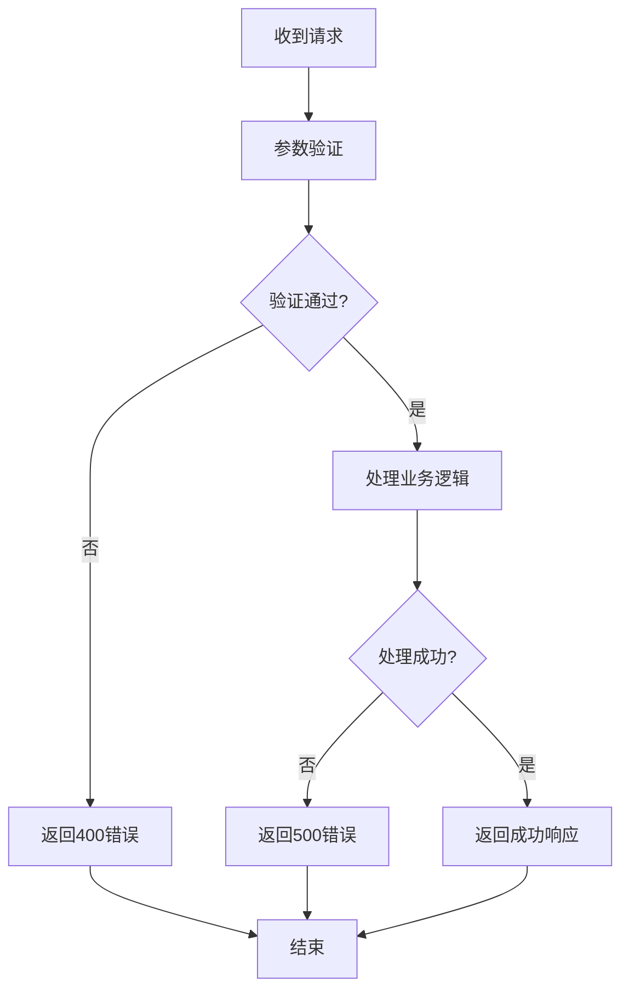

# API 接口文档

<cite>
**本文档引用的文件**
- [server/src/index.ts](file://server/src/index.ts)
- [server/src/routes/auth.ts](file://server/src/routes/auth.ts)
- [server/src/routes/admin.ts](file://server/src/routes/admin.ts)
- [server/src/routes/favorites.ts](file://server/src/routes/favorites.ts)
- [server/src/routes/logs.ts](file://server/src/routes/logs.ts)
- [server/src/routes/network.ts](file://server/src/routes/network.ts)
- [server/src/routes/binLabels.ts](file://server/src/routes/binLabels.ts)
- [server/src/db.ts](file://server/src/db.ts)
- [server/src/types.ts](file://server/src/types.ts)
- [src/lib/api.ts](file://src/lib/api.ts)
- [部署手册.md](file://部署手册.md)
</cite>

## 目录
1. [简介](#简介)
2. [项目结构](#项目结构)
3. [核心组件](#核心组件)
4. [架构概览](#架构概览)
5. [详细组件分析](#详细组件分析)
6. [依赖关系分析](#依赖关系分析)
7. [性能考虑](#性能考虑)
8. [故障排除指南](#故障排除指南)
9. [结论](#结论)

## 简介

ToolBox 开发者工具门户是一个基于 React + Express + SQLite 的全栈应用，提供了丰富的开发者工具集合。本文档详细记录了所有 API 接口的设计规范和使用说明，包括认证接口、收藏管理接口、使用日志接口、管理员功能接口、网络工具接口、库位标签接口等。

该系统采用 RESTful API 设计，支持多种认证方式（用户名密码、微信授权、访客模式），并提供了完整的权限控制机制。所有接口均遵循统一的错误处理规范和响应格式。

## 项目结构

后端采用模块化路由设计，每个功能模块对应一个独立的路由文件：



**图表来源**
- [server/src/index.ts:17-22](file://server/src/index.ts#L17-L22)
- [server/src/db.ts:13-75](file://server/src/db.ts#L13-L75)

**章节来源**
- [server/src/index.ts:1-31](file://server/src/index.ts#L1-L31)
- [server/src/db.ts:1-126](file://server/src/db.ts#L1-L126)

## 核心组件

### 数据库设计

系统使用 SQLite 作为数据存储，包含以下核心表结构：



**图表来源**
- [server/src/db.ts:14-75](file://server/src/db.ts#L14-L75)

### 类型定义

系统定义了统一的数据传输对象，确保前后端数据格式一致性：

- **DbUser**: 用户信息模型
- **DbUsageLog**: 使用日志模型  
- **DbLoginSession**: 登录会话模型
- **LogQuery**: 日志查询参数模型
- **StatsQuery**: 统计查询参数模型

**章节来源**
- [server/src/types.ts:1-46](file://server/src/types.ts#L1-L46)
- [server/src/db.ts:14-75](file://server/src/db.ts#L14-L75)

## 架构概览

系统采用分层架构设计，各层职责明确：



**图表来源**
- [server/src/index.ts:10-22](file://server/src/index.ts#L10-L22)
- [server/src/routes/auth.ts:1-109](file://server/src/routes/auth.ts#L1-L109)

## 详细组件分析

### 认证接口

#### 用户列表查询
- **方法**: GET
- **路径**: `/api/auth/users`
- **描述**: 获取所有用户的基本信息
- **认证**: 无
- **响应**: 用户数组，包含 id、name、role、department、wechat_id 字段

**请求示例**:
```bash
curl -X GET http://localhost:3001/api/auth/users
```

**响应示例**:
```json
[
  {
    "id": "user-001",
    "name": "张三",
    "role": "user",
    "department": "技术部",
    "wechat_id": "wx-zhangsan"
  },
  {
    "id": "user-002", 
    "name": "李四",
    "role": "admin",
    "department": "基础架构部",
    "wechat_id": "wx-lisi"
  }
]
```

#### 用户登录
- **方法**: POST  
- **路径**: `/api/auth/login`
- **描述**: 支持多种登录方式的统一登录接口
- **认证**: 无
- **请求参数**:

| 参数名 | 类型 | 必填 | 描述 |
|--------|------|------|------|
| type | string | 否 | 登录类型：wechat/password/guest |
| userId | string | 否 | 用户ID（兼容旧版本） |
| username | string | 否 | 用户名 |
| password | string | 否 | 密码 |
| wechatId | string | 否 | 微信OpenID |

**登录类型说明**:

1. **访客登录** (`type: "guest"`)
   - 自动创建访客账户
   - 返回临时访客信息

2. **微信登录** (`type: "wechat"`)
   - 支持绑定已有微信账号
   - 新微信账号自动创建普通用户

3. **密码登录** (`type: "password"`)
   - 支持用户名或ID登录
   - 密码可为空（回退到用户ID）

**成功响应示例**:
```json
{
  "user": {
    "id": "user-001",
    "name": "张三",
    "role": "user", 
    "department": "技术部",
    "wechat_id": "wx-zhangsan"
  }
}
```

**失败响应示例**:
```json
{
  "error": "Invalid password"
}
```

**章节来源**
- [server/src/routes/auth.ts:31-106](file://server/src/routes/auth.ts#L31-L106)

### 收藏管理接口

#### 获取用户收藏
- **方法**: GET
- **路径**: `/api/favorites/:userId`
- **描述**: 获取指定用户的收藏工具ID列表
- **认证**: 无
- **路径参数**:
  - `userId`: 用户ID

**请求示例**:
```bash
curl -X GET http://localhost:3001/api/favorites/user-001
```

**响应示例**:
```json
["json-formatter", "base64", "regex-tester"]
```

#### 添加收藏
- **方法**: POST
- **路径**: `/api/favorites/:userId`
- **描述**: 为用户添加收藏
- **认证**: 无
- **路径参数**:
  - `userId`: 用户ID
- **请求体**:
  - `toolId`: 工具ID（必填）

**请求示例**:
```bash
curl -X POST http://localhost:3001/api/favorites/user-001 \
  -H "Content-Type: application/json" \
  -d '{"toolId": "qr-generator"}'
```

**响应示例**:
```json
{"ok": true}
```

#### 删除收藏
- **方法**: DELETE
- **路径**: `/api/favorites/:userId/:toolId`
- **描述**: 删除用户的指定收藏
- **认证**: 无
- **路径参数**:
  - `userId`: 用户ID
  - `toolId`: 工具ID

**请求示例**:
```bash
curl -X DELETE http://localhost:3001/api/favorites/user-001/qr-generator
```

**响应示例**:
```json
{"ok": true}
```

**章节来源**
- [server/src/routes/favorites.ts:6-28](file://server/src/routes/favorites.ts#L6-L28)

### 使用日志接口

#### 创建使用日志
- **方法**: POST
- **路径**: `/api/logs`
- **描述**: 记录用户的工具使用行为
- **认证**: 无
- **请求体**:

| 参数名 | 类型 | 必填 | 描述 |
|--------|------|------|------|
| userId | string | 是 | 用户ID |
| toolId | string | 是 | 工具ID |
| toolName | string | 是 | 工具名称 |
| action | string | 是 | 操作类型（如 open、execute） |
| details | string | 否 | 详细信息 |

**请求示例**:
```bash
curl -X POST http://localhost:3001/api/logs \
  -H "Content-Type: application/json" \
  -d '{
    "userId": "user-001",
    "toolId": "json-formatter",
    "toolName": "JSON 格式化",
    "action": "execute",
    "details": "格式化了 100 行 JSON 数据"
  }'
```

**响应示例**:
```json
{"id": 123}
```

#### 查询使用日志
- **方法**: GET
- **路径**: `/api/logs`
- **描述**: 分页查询使用日志，支持多条件过滤
- **认证**: 无
- **查询参数**:

| 参数名 | 类型 | 必填 | 描述 |
|--------|------|------|------|
| userId | string | 否 | 用户ID |
| toolId | string | 否 | 工具ID |
| keyword | string | 否 | 关键词（模糊搜索） |
| startDate | string | 否 | 开始日期 |
| endDate | string | 否 | 结束日期 |
| page | number | 否 | 页码，默认1 |
| pageSize | number | 否 | 每页数量，默认20，最大100 |

**请求示例**:
```bash
curl -X GET "http://localhost:3001/api/logs?page=1&pageSize=20&userId=user-001&startDate=2024-01-01"
```

**响应示例**:
```json
{
  "data": [
    {
      "id": 1,
      "user_id": "user-001",
      "tool_id": "json-formatter",
      "tool_name": "JSON 格式化",
      "action": "execute",
      "details": null,
      "created_at": "2024-01-15 10:30:00",
      "user_name": "张三"
    }
  ],
  "total": 1,
  "page": 1,
  "pageSize": 20
}
```

#### 获取统计信息
- **方法**: GET
- **路径**: `/api/logs/stats`
- **描述**: 获取使用统计信息
- **认证**: 无
- **查询参数**:

| 参数名 | 类型 | 必填 | 描述 |
|--------|------|------|------|
| userId | string | 否 | 用户ID（可选，管理员可不传） |
| period | string | 否 | 时间周期：day/week/month，默认week |

**响应示例**:
```json
{
  "todayUsages": 5,
  "weekUsages": 23,
  "monthUsages": 89,
  "totalUsages": 156,
  "topTools": [
    {"tool_id": "json-formatter", "tool_name": "JSON 格式化", "count": 12},
    {"tool_id": "base64", "tool_name": "Base64 编解码", "count": 8}
  ],
  "dailyTrend": [
    {"date": "2024-01-15", "count": 5},
    {"date": "2024-01-16", "count": 8}
  ],
  "recentLogs": [...],
  "activeUsers": [...]
}
```

**章节来源**
- [server/src/routes/logs.ts:7-131](file://server/src/routes/logs.ts#L7-L131)

### 管理员功能接口

#### 用户管理

##### 获取用户列表
- **方法**: GET
- **路径**: `/api/admin/users`
- **描述**: 获取所有用户信息（管理员）
- **认证**: 需要管理员权限
- **响应**: 包含用户数组的对象

##### 创建用户
- **方法**: POST
- **路径**: `/api/admin/users`
- **描述**: 创建新用户（管理员）
- **认证**: 需要管理员权限
- **请求体**:

| 参数名 | 类型 | 必填 | 描述 |
|--------|------|------|------|
| id | string | 是 | 用户ID |
| name | string | 是 | 用户名 |
| role | string | 是 | 角色：user/admin |
| department | string | 否 | 部门 |
| wechat_id | string | 否 | 微信ID |
| password | string | 否 | 密码，未提供时回退到用户ID |

##### 更新用户
- **方法**: PUT
- **路径**: `/api/admin/users/:id`
- **描述**: 更新用户信息（管理员）
- **认证**: 需要管理员权限
- **路径参数**:
  - `id`: 用户ID
- **请求体**:
  - `name`: 用户名
  - `role`: 角色
  - `department`: 部门

##### 删除用户
- **方法**: DELETE
- **路径**: `/api/admin/users/:id`
- **描述**: 删除用户（管理员）
- **认证**: 需要管理员权限
- **路径参数**:
  - `id`: 用户ID

#### 登录会话管理

##### 获取会话列表
- **方法**: GET
- **路径**: `/api/admin/sessions`
- **描述**: 获取登录会话历史（管理员）
- **认证**: 需要管理员权限
- **查询参数**:
  - `page`: 页码，默认1
  - `pageSize`: 每页数量，默认20，最大100

**响应示例**:
```json
{
  "data": [
    {
      "id": 1,
      "user_id": "user-001",
      "login_type": "wechat",
      "ip": "192.168.1.1",
      "browser": "Chrome",
      "os": "Windows",
      "created_at": "2024-01-15 10:30:00",
      "user_name": "张三"
    }
  ],
  "total": 1,
  "page": 1,
  "pageSize": 20
}
```

#### 使用日志管理

##### 获取所有用户日志
- **方法**: GET
- **路径**: `/api/admin/logs`
- **描述**: 获取所有用户的使用日志（管理员）
- **认证**: 需要管理员权限
- **查询参数**:
  - `page`: 页码，默认1
  - `pageSize`: 每页数量，默认20，最大100
  - `keyword`: 关键词（按工具名、操作、用户名模糊搜索）

**章节来源**
- [server/src/routes/admin.ts:16-90](file://server/src/routes/admin.ts#L16-L90)

### 网络工具接口

#### IP 地址查询
- **方法**: POST
- **路径**: `/api/network/ip`
- **描述**: 查询 IP 地址地理位置信息
- **认证**: 无
- **请求体**:

| 参数名 | 类型 | 必填 | 描述 |
|--------|------|------|------|
| ip | string | 否 | 目标IP地址，为空时查询请求方IP |

**请求示例**:
```bash
curl -X POST http://localhost:3001/api/network/ip \
  -H "Content-Type: application/json" \
  -d '{"ip": "8.8.8.8"}'
```

**响应示例**:
```json
{
  "status": "success",
  "country": "United States",
  "regionName": "California",
  "city": "Mountain View",
  "isp": "Google LLC",
  "org": "Google LLC",
  "as": "AS15169 Google LLC",
  "lat": 37.4056,
  "lon": -122.0775,
  "timezone": "America/Los_Angeles"
}
```

#### DNS 查询
- **方法**: POST
- **路径**: `/api/network/dns`
- **描述**: 执行 DNS 查询
- **认证**: 无
- **请求体**:

| 参数名 | 类型 | 必填 | 描述 |
|--------|------|------|------|
| domain | string | 是 | 域名 |
| type | string | 否 | DNS 记录类型，默认A记录 |

**请求示例**:
```bash
curl -X POST http://localhost:3001/api/network/dns \
  -H "Content-Type: application/json" \
  -d '{"domain": "google.com", "type": "A"}'
```

**响应示例**:
```json
{
  "domain": "google.com",
  "type": "A",
  "records": ["142.250.191.14", "142.250.191.110"]
}
```

#### Ping 测试
- **方法**: POST
- **路径**: `/api/network/ping`
- **描述**: 执行网络连通性测试
- **认证**: 无
- **请求体**:

| 参数名 | 类型 | 必填 | 描述 |
|--------|------|------|------|
| host | string | 是 | 目标主机 |
| count | number | 否 | 发送包数量，默认4，最大10 |

**请求示例**:
```bash
curl -X POST http://localhost:3001/api/network/ping \
  -H "Content-Type: application/json" \
  -d '{"host": "8.8.8.8", "count": 4}'
```

**响应示例**:
```json
{
  "host": "8.8.8.8",
  "output": "正在 Ping 8.8.8.8 具有 32 字节的数据:...",
  "count": 4
}
```

#### HTTP 代理
- **方法**: POST
- **路径**: `/api/network/http`
- **描述**: 代理 HTTP 请求（用于跨域或网络诊断）
- **认证**: 无
- **请求体**:

| 参数名 | 类型 | 必填 | 描述 |
|--------|------|------|------|
| url | string | 是 | 目标URL |
| method | string | 否 | HTTP 方法，默认GET |
| headers | object | 否 | 请求头 |
| body | string | 否 | 请求体 |

**请求示例**:
```bash
curl -X POST http://localhost:3001/api/network/http \
  -H "Content-Type: application/json" \
  -d '{"url": "https://api.github.com/users/octocat", "method": "GET"}'
```

**响应示例**:
```json
{
  "status": 200,
  "statusText": "OK",
  "headers": {
    "content-type": "application/json; charset=utf-8"
  },
  "body": "{...}",  // 响应体内容（二进制数据会显示字节数）
  "elapsed": 1234  // 毫秒
}
```

**章节来源**
- [server/src/routes/network.ts:10-106](file://server/src/routes/network.ts#L10-L106)

### 库位标签接口

#### 查询生成记录
- **方法**: GET
- **路径**: `/api/bin-labels`
- **描述**: 查询当前用户的库位标签生成记录
- **认证**: 无
- **查询参数**:
  - `userId`: 用户ID（必填）

**请求示例**:
```bash
curl -X GET "http://localhost:3001/api/bin-labels?userId=user-001"
```

**响应示例**:
```json
{
  "records": [
    {
      "id": 1,
      "user_id": "user-001",
      "name": "仓库A-001",
      "count": 10,
      "created_at": "2024-01-15 10:30:00"
    }
  ]
}
```

#### 获取记录详情
- **方法**: GET
- **路径**: `/api/bin-labels/:id`
- **描述**: 获取单条库位标签记录的详细信息
- **认证**: 无
- **路径参数**:
  - `id`: 记录ID

**请求示例**:
```bash
curl -X GET http://localhost:3001/api/bin-labels/1
```

**响应示例**:
```json
{
  "record": {
    "id": 1,
    "user_id": "user-001",
    "name": "仓库A-001", 
    "data": "[{\"location\": \"A-001\", \"count\": 10}]",
    "count": 10,
    "created_at": "2024-01-15 10:30:00"
  }
}
```

#### 保存生成记录
- **方法**: POST
- **路径**: `/api/bin-labels`
- **描述**: 保存新的库位标签生成记录
- **认证**: 无
- **请求体**:

| 参数名 | 类型 | 必填 | 描述 |
|--------|------|------|------|
| userId | string | 是 | 用户ID |
| name | string | 是 | 记录名称 |
| data | string | 是 | 标签数据（JSON字符串） |
| count | number | 是 | 标签数量 |

**请求示例**:
```bash
curl -X POST http://localhost:3001/api/bin-labels \
  -H "Content-Type: application/json" \
  -d '{
    "userId": "user-001",
    "name": "仓库A-001",
    "data": "[{\"location\": \"A-001\", \"count\": 10}]",
    "count": 10
  }'
```

**响应示例**:
```json
{
  "id": 123,
  "message": "保存成功"
}
```

#### 删除记录
- **方法**: DELETE
- **路径**: `/api/bin-labels/:id`
- **描述**: 删除指定的库位标签记录
- **认证**: 无
- **路径参数**:
  - `id`: 记录ID
- **查询参数**:
  - `userId`: 用户ID（必填）

**请求示例**:
```bash
curl -X DELETE "http://localhost:3001/api/bin-labels/123?userId=user-001"
```

**响应示例**:
```json
{"message": "删除成功"}
```

**章节来源**
- [server/src/routes/binLabels.ts:15-62](file://server/src/routes/binLabels.ts#L15-L62)

## 依赖关系分析



**图表来源**
- [server/src/index.ts:1-31](file://server/src/index.ts#L1-L31)
- [server/src/db.ts:1-126](file://server/src/db.ts#L1-L126)

### 错误处理机制

系统实现了统一的错误处理机制：



**错误码定义**:

| 状态码 | 错误类型 | 描述 |
|--------|----------|------|
| 200 | 成功 | 请求成功处理 |
| 400 | 参数错误 | 请求参数无效或缺失 |
| 401 | 未授权 | 需要认证或认证失败 |
| 403 | 权限不足 | 当前用户无权限访问 |
| 404 | 资源不存在 | 请求的资源不存在 |
| 500 | 服务器错误 | 服务器内部错误 |

**章节来源**
- [server/src/routes/auth.ts:55-105](file://server/src/routes/auth.ts#L55-L105)
- [server/src/routes/admin.ts:8-14](file://server/src/routes/admin.ts#L8-L14)

## 性能考虑

### 数据库优化

1. **索引策略**:
   - 用户表: 按微信ID建立唯一索引
   - 使用日志表: 按用户ID、工具ID、创建时间建立复合索引
   - 库位标签表: 按用户ID、创建时间建立索引
   - 登录会话表: 按用户ID、创建时间建立索引

2. **查询优化**:
   - 使用 LIMIT 和 OFFSET 实现分页
   - 最大每页100条记录，防止过度查询
   - 使用参数化查询防止SQL注入

3. **事务处理**:
   - 种子数据插入使用事务确保原子性
   - 批量操作使用事务提高性能

### 缓存策略

1. **内存缓存**:
   - SQLite WAL 模式提高并发性能
   - 外键约束启用确保数据完整性

2. **响应缓存**:
   - 统一的响应格式减少客户端解析开销
   - 错误响应格式标准化便于调试

### 网络优化

1. **请求大小限制**:
   - JSON 请求体大小限制为5MB
   - HTTP 响应体截断避免超大响应

2. **超时控制**:
   - Ping 操作超时30秒
   - HTTP 代理请求超时控制

**章节来源**
- [server/src/db.ts:13-75](file://server/src/db.ts#L13-L75)
- [server/src/index.ts:14-15](file://server/src/index.ts#L14-L15)

## 故障排除指南

### 常见问题及解决方案

#### 1. CORS 跨域问题
**症状**: 前端请求返回跨域错误
**原因**: CORS 配置不正确
**解决方案**: 设置正确的 CORS_ORIGIN 环境变量

#### 2. 数据库连接失败
**症状**: 启动时报数据库连接错误
**原因**: data.db 文件权限问题或路径错误
**解决方案**: 检查文件权限和路径配置

#### 3. API 接口 404
**症状**: 请求特定 API 返回 404
**原因**: 路由配置错误或 Nginx 反向代理未配置
**解决方案**: 检查路由挂载和 Nginx 配置

#### 4. 权限不足
**症状**: 管理员接口返回 403
**原因**: 用户不是管理员或缺少必要的请求头
**解决方案**: 确保用户具有 admin 角色，并在请求中包含正确的用户标识

### 调试技巧

1. **启用详细日志**:
   ```bash
   export NODE_ENV=development
   ```

2. **检查数据库状态**:
   ```bash
   sqlite3 server/data.db ".tables"
   ```

3. **验证 API 健康状态**:
   ```bash
   curl http://localhost:3001/api/health
   ```

**章节来源**
- [部署手册.md:411-438](file://部署手册.md#L411-L438)

## 结论

ToolBox 开发者工具门户提供了一套完整、规范的 RESTful API 接口，涵盖了现代 Web 应用的核心功能需求。系统设计充分考虑了安全性、可扩展性和易用性，采用模块化的架构设计使得各个功能模块职责清晰、耦合度低。

主要特点包括：
- **统一的认证机制**: 支持多种登录方式，满足不同场景需求
- **完善的权限控制**: 基于角色的访问控制，确保数据安全
- **标准化的错误处理**: 统一的错误响应格式，便于前端处理
- **性能优化**: 合理的数据库设计和查询优化策略
- **易于部署**: 单文件 SQLite 数据库，简化部署流程

该 API 设计为后续的功能扩展和维护奠定了良好的基础，建议在实际使用中遵循本文档的规范，确保系统的稳定性和一致性。