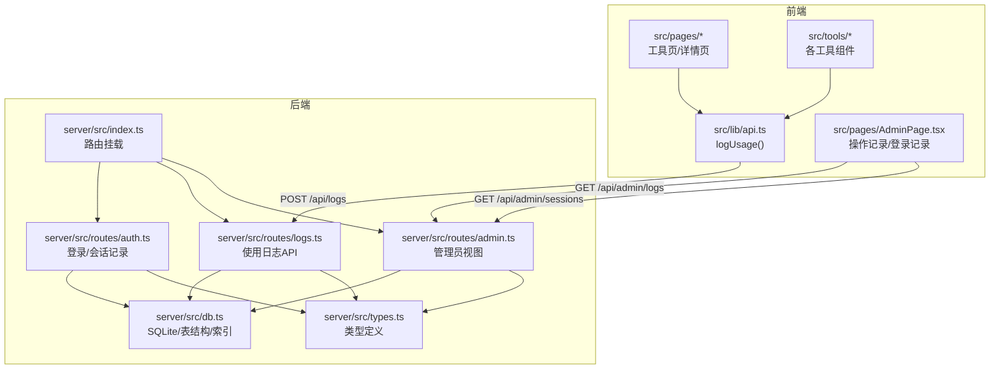
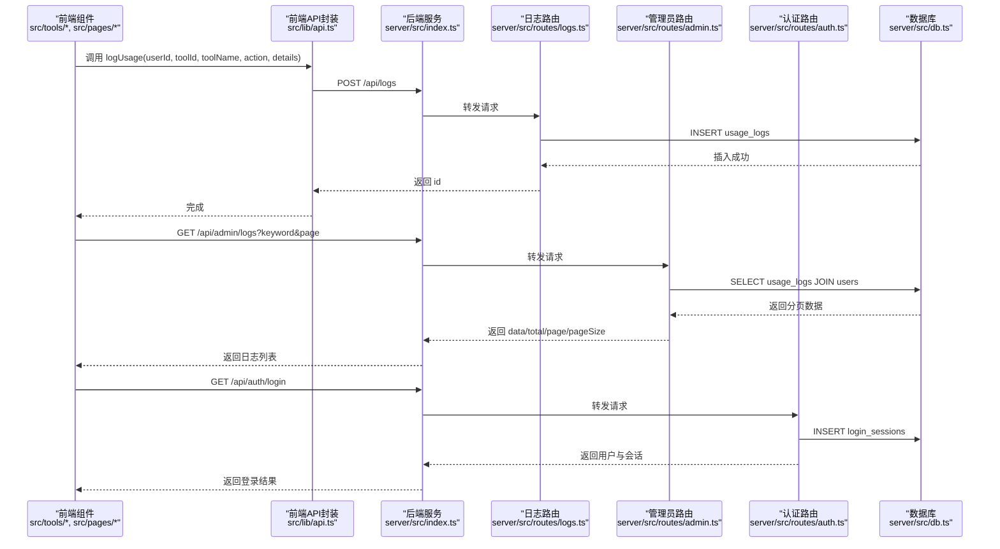
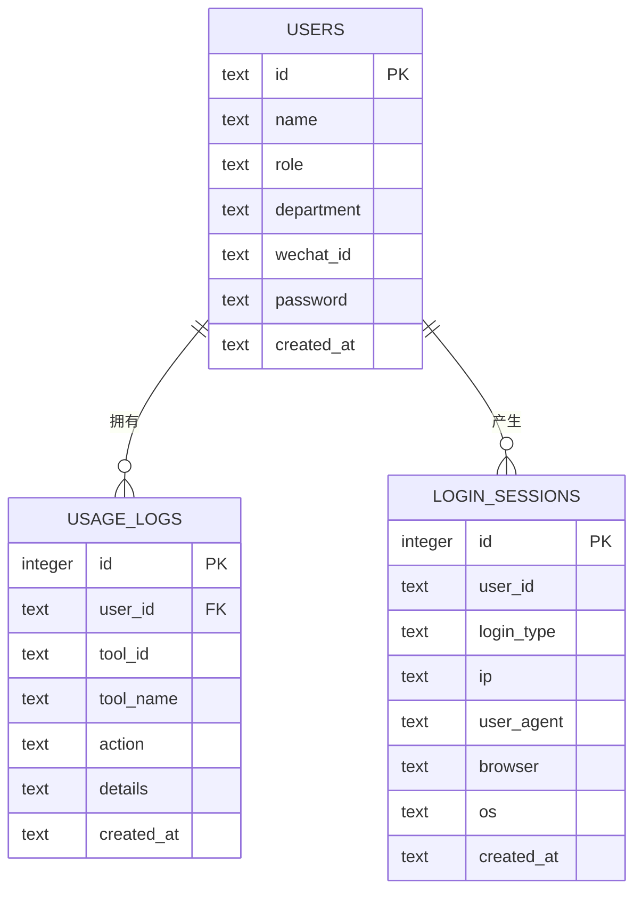
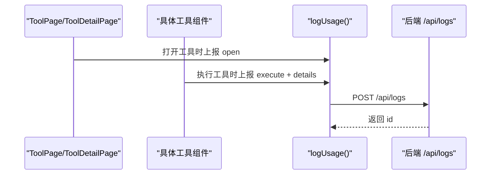
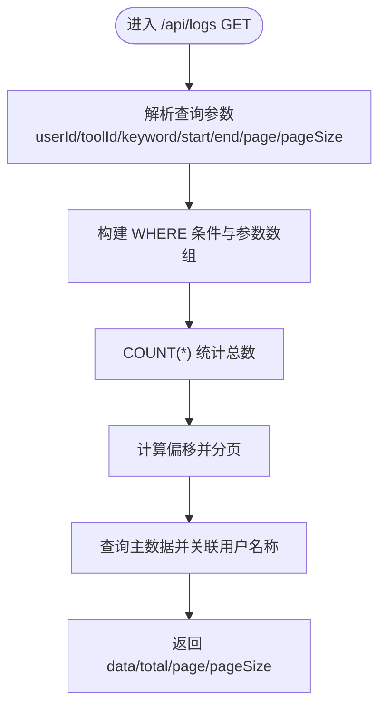
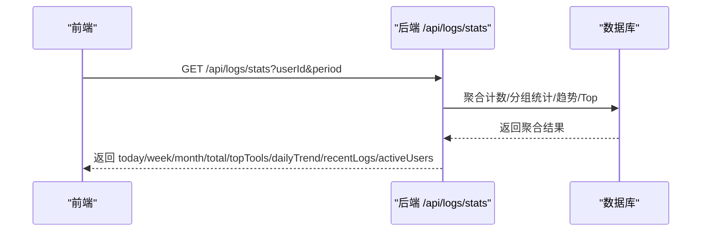
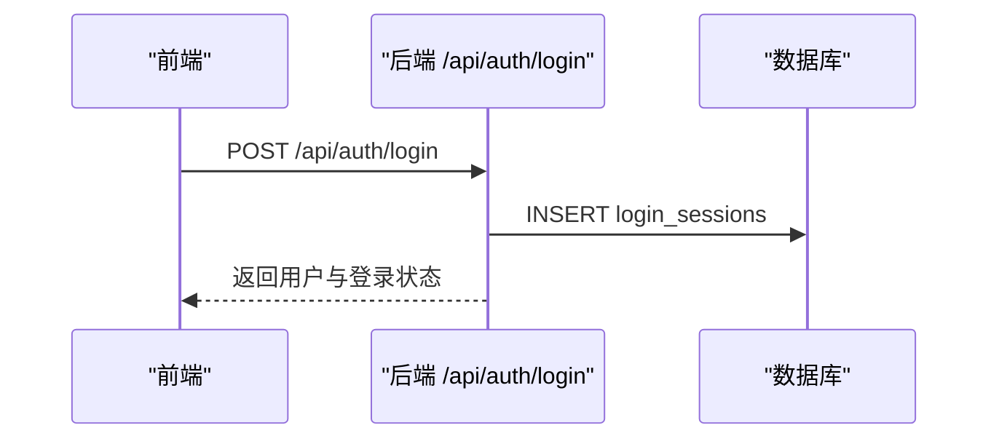
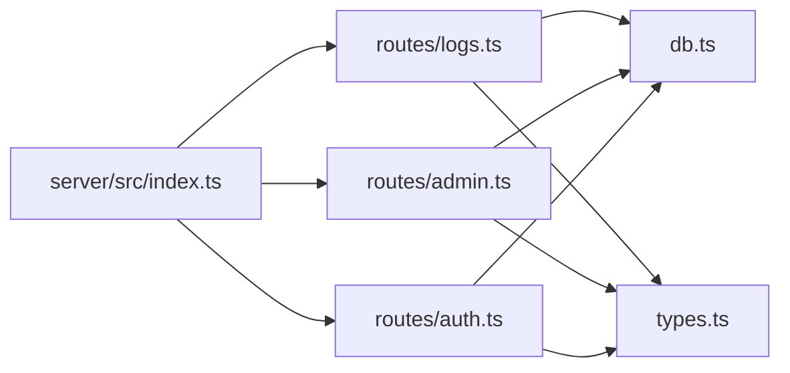

# 使用日志接口

<cite>
**本文引用的文件**
- [server/src/index.ts](file://server/src/index.ts)
- [server/src/db.ts](file://server/src/db.ts)
- [server/src/types.ts](file://server/src/types.ts)
- [server/src/routes/logs.ts](file://server/src/routes/logs.ts)
- [server/src/routes/admin.ts](file://server/src/routes/admin.ts)
- [server/src/routes/auth.ts](file://server/src/routes/auth.ts)
- [src/lib/api.ts](file://src/lib/api.ts)
- [src/pages/AdminPage.tsx](file://src/pages/AdminPage.tsx)
- [src/pages/ToolPage.tsx](file://src/pages/ToolPage.tsx)
- [src/pages/ToolDetailPage.tsx](file://src/pages/ToolDetailPage.tsx)
- [src/tools/Base64Tool.tsx](file://src/tools/Base64Tool.tsx)
</cite>

## 目录
1. [简介](#简介)
2. [项目结构](#项目结构)
3. [核心组件](#核心组件)
4. [架构总览](#架构总览)
5. [详细组件分析](#详细组件分析)
6. [依赖关系分析](#依赖关系分析)
7. [性能考虑](#性能考虑)
8. [故障排查指南](#故障排查指南)
9. [结论](#结论)
10. [附录](#附录)

## 简介
本文件为“使用日志接口”的完整 API 文档，覆盖以下能力：
- 工具使用记录：在用户打开或执行工具时上报使用日志
- 登录记录：记录用户的登录来源与客户端信息
- 操作审计：管理员可查看全站使用日志与登录记录
- 统计分析：支持今日/本周/本月使用量、热门工具排行、日趋势、近期日志、活跃用户等聚合统计
- 数据查询：支持分页、关键词过滤、时间范围过滤
- 前端埋点：在多个工具页面与页面中自动上报使用事件

## 项目结构
后端基于 Express，采用 SQLite 存储；前端通过统一的 API 封装进行调用。

图表来源
- [server/src/index.ts:1-31](file://server/src/index.ts#L1-L31)
- [server/src/routes/auth.ts:1-109](file://server/src/routes/auth.ts#L1-L109)
- [server/src/routes/logs.ts:1-134](file://server/src/routes/logs.ts#L1-L134)
- [server/src/routes/admin.ts:1-93](file://server/src/routes/admin.ts#L1-L93)
- [server/src/db.ts:1-126](file://server/src/db.ts#L1-L126)
- [server/src/types.ts:1-46](file://server/src/types.ts#L1-L46)
- [src/lib/api.ts:1-36](file://src/lib/api.ts#L1-L36)
- [src/pages/AdminPage.tsx:1-353](file://src/pages/AdminPage.tsx#L1-L353)

章节来源
- [server/src/index.ts:1-31](file://server/src/index.ts#L1-L31)
- [server/src/db.ts:12-75](file://server/src/db.ts#L12-L75)

## 核心组件
- 日志采集接口
  - 路径：/api/logs
  - 方法：POST
  - 功能：新增一条使用日志记录
  - 请求体字段：userId, toolId, toolName, action, details（可选）
  - 响应：返回新插入记录的 id
- 日志查询接口
  - 路径：/api/logs
  - 方法：GET
  - 功能：按条件分页查询使用日志，并关联用户名称
  - 查询参数：
    - userId：用户ID过滤
    - toolId：工具ID过滤
    - keyword：关键词模糊匹配（工具名/动作/详情）
    - startDate / endDate：时间范围过滤
    - page/pageSize：分页（默认 1/20，最大 100）
  - 响应：data（日志列表）、total、page、pageSize
- 日志统计接口
  - 路径：/api/logs/stats
  - 方法：GET
  - 功能：聚合统计与热门排行
  - 查询参数：
    - userId：仅统计指定用户（非管理员时可用）
    - period：统计周期 day/week/month（默认 week）
  - 响应字段：
    - todayUsages：当日使用次数
    - weekUsages：近七天使用次数
    - monthUsages：近三十天使用次数
    - totalUsages：总使用次数
    - topTools：热门工具 Top 10（含工具ID、名称、次数）
    - dailyTrend：最近 14 天每日使用趋势
    - recentLogs：近期日志（最多 10 条）
    - activeUsers：活跃用户 Top 排行（管理员专属）
- 登录会话接口（用于登录记录）
  - 路径：/api/auth/login
  - 方法：POST
  - 功能：记录登录来源与客户端信息（IP、UA、浏览器、操作系统）
  - 响应：返回用户信息与是否新账号等
- 管理员视图
  - 路径：/api/admin/logs
  - 方法：GET
  - 功能：管理员查看全站使用日志，支持关键词过滤与分页
  - 路径：/api/admin/sessions
  - 方法：GET
  - 功能：管理员查看登录记录，支持分页

章节来源
- [server/src/routes/logs.ts:7-18](file://server/src/routes/logs.ts#L7-L18)
- [server/src/routes/logs.ts:20-69](file://server/src/routes/logs.ts#L20-L69)
- [server/src/routes/logs.ts:71-131](file://server/src/routes/logs.ts#L71-L131)
- [server/src/routes/auth.ts:36-106](file://server/src/routes/auth.ts#L36-L106)
- [server/src/routes/admin.ts:67-90](file://server/src/routes/admin.ts#L67-L90)
- [server/src/routes/admin.ts:51-65](file://server/src/routes/admin.ts#L51-L65)

## 架构总览
下图展示从前端埋点到数据库落库，再到统计与查询的整体流程。

图表来源
- [src/lib/api.ts:3-19](file://src/lib/api.ts#L3-L19)
- [server/src/index.ts:17-22](file://server/src/index.ts#L17-L22)
- [server/src/routes/logs.ts:8-18](file://server/src/routes/logs.ts#L8-L18)
- [server/src/routes/admin.ts:69-90](file://server/src/routes/admin.ts#L69-L90)
- [server/src/routes/auth.ts:24-29](file://server/src/routes/auth.ts#L24-L29)
- [server/src/db.ts:26-39](file://server/src/db.ts#L26-L39)

## 详细组件分析

### 数据模型与表结构
- 用户表 users
  - 主键：id
  - 字段：name、role、department、wechat_id、password、created_at
  - 索引：wechat_id
- 使用日志表 usage_logs
  - 主键：id（自增）
  - 外键：user_id -> users(id)
  - 字段：user_id、tool_id、tool_name、action、details、created_at
  - 索引：user_id、tool_id、created_at
- 登录会话表 login_sessions
  - 主键：id（自增）
  - 字段：user_id、login_type、ip、user_agent、browser、os、created_at
  - 索引：user_id、created_at

图表来源
- [server/src/db.ts:14-75](file://server/src/db.ts#L14-L75)

章节来源
- [server/src/db.ts:14-75](file://server/src/db.ts#L14-L75)

### 前端埋点与调用链
- 埋点位置
  - 工具页与详情页：打开工具时上报 open
  - 各工具组件：执行工具时上报 execute，并附带模式/方法等细节
- 调用封装
  - logUsage(userId, toolId, toolName, action, details?)：POST /api/logs
- 管理端展示
  - 管理后台“操作记录”标签页：GET /api/admin/logs，支持关键词搜索与分页
  - 管理后台“登录记录”标签页：GET /api/admin/sessions，支持分页

图表来源
- [src/pages/ToolPage.tsx:67](file://src/pages/ToolPage.tsx#L67)
- [src/pages/ToolDetailPage.tsx:62](file://src/pages/ToolDetailPage.tsx#L62)
- [src/tools/Base64Tool.tsx:21](file://src/tools/Base64Tool.tsx#L21)
- [src/lib/api.ts:3-19](file://src/lib/api.ts#L3-L19)
- [server/src/routes/logs.ts:8-18](file://server/src/routes/logs.ts#L8-L18)

章节来源
- [src/pages/ToolPage.tsx:67](file://src/pages/ToolPage.tsx#L67)
- [src/pages/ToolDetailPage.tsx:62](file://src/pages/ToolDetailPage.tsx#L62)
- [src/tools/Base64Tool.tsx:21](file://src/tools/Base64Tool.tsx#L21)
- [src/lib/api.ts:3-19](file://src/lib/api.ts#L3-L19)
- [src/pages/AdminPage.tsx:92-100](file://src/pages/AdminPage.tsx#L92-L100)

### 日志查询与分页机制
- 支持的过滤条件
  - userId、toolId、keyword（模糊匹配工具名/动作/详情）、startDate、endDate
- 分页参数
  - page（默认 1），pageSize（默认 20，最大 100）
- 关联用户名称
  - 查询时左连接 users 表，返回 user_name
- 时间范围处理
  - endDate 自动补足为当天 23:59:59，确保包含结束日整日数据

图表来源
- [server/src/routes/logs.ts:21-69](file://server/src/routes/logs.ts#L21-L69)

章节来源
- [server/src/routes/logs.ts:21-69](file://server/src/routes/logs.ts#L21-L69)

### 统计与热门排行
- 聚合指标
  - 当日/近七天/近三十天/总使用次数
  - 近 14 天每日趋势
  - 最近 10 条日志
  - 热门工具 Top 10
  - 活跃用户 Top（管理员专用）
- 可选用户过滤
  - 当传入 userId 时，统计与热门排行仅针对该用户

图表来源
- [server/src/routes/logs.ts:71-131](file://server/src/routes/logs.ts#L71-L131)

章节来源
- [server/src/routes/logs.ts:71-131](file://server/src/routes/logs.ts#L71-L131)

### 登录记录与客户端信息
- 记录内容
  - 登录来源（微信、密码、游客）
  - IP、User-Agent、浏览器、操作系统
- 记录时机
  - 在登录成功后写入 login_sessions 表
- 管理员查看
  - 管理后台“登录记录”标签页支持分页查看

图表来源
- [server/src/routes/auth.ts:36-106](file://server/src/routes/auth.ts#L36-L106)
- [server/src/routes/auth.ts:24-29](file://server/src/routes/auth.ts#L24-L29)
- [server/src/db.ts:62-75](file://server/src/db.ts#L62-L75)

章节来源
- [server/src/routes/auth.ts:36-106](file://server/src/routes/auth.ts#L36-L106)
- [server/src/routes/auth.ts:24-29](file://server/src/routes/auth.ts#L24-L29)
- [server/src/db.ts:62-75](file://server/src/db.ts#L62-L75)

## 依赖关系分析
- 路由挂载
  - /api/auth → 认证与会话记录
  - /api/logs → 使用日志采集与统计
  - /api/admin → 管理员视图（日志与会话）
- 类型定义
  - DbUsageLog、LogQuery、StatsQuery、DbLoginSession 等
- 数据库
  - SQLite + WAL 模式 + 外键约束
  - 为高频查询建立索引（用户、工具、时间）

图表来源
- [server/src/index.ts:17-22](file://server/src/index.ts#L17-L22)
- [server/src/routes/logs.ts:1-3](file://server/src/routes/logs.ts#L1-L3)
- [server/src/routes/admin.ts:1-4](file://server/src/routes/admin.ts#L1-L4)
- [server/src/routes/auth.ts:1-4](file://server/src/routes/auth.ts#L1-L4)
- [server/src/types.ts:1-46](file://server/src/types.ts#L1-L46)
- [server/src/db.ts:1-126](file://server/src/db.ts#L1-L126)

章节来源
- [server/src/index.ts:17-22](file://server/src/index.ts#L17-L22)
- [server/src/types.ts:1-46](file://server/src/types.ts#L1-L46)
- [server/src/db.ts:1-126](file://server/src/db.ts#L1-L126)

## 性能考虑
- 数据库层
  - 已建立必要索引：usage_logs(user_id)、usage_logs(tool_id)、usage_logs(created_at)、login_sessions(user_id)、login_sessions(created_at)
  - 使用 WAL 模式提升并发读写性能
- 查询层
  - 分页参数上限控制（pageSize 最大 100），避免超大数据量一次性返回
  - 统计接口按需过滤（可选 userId），缩小扫描范围
- 前端层
  - 埋点采用异步 fetch，失败不阻塞主流程
  - 管理端分页加载，减少单次渲染压力
- 大数据量处理建议
  - 对高频工具增加缓存（如热门工具 Top 与日趋势）
  - 引入归档策略：对历史日志定期归档至离线存储
  - 使用游标分页或基于时间戳的增量拉取替代深度分页
  - 对统计口径做预聚合（如按日/周汇总表），降低实时查询成本

[本节为通用性能建议，无需特定文件引用]

## 故障排查指南
- 常见错误与定位
  - 400 缺少必填字段：确认请求体包含 userId、toolId、toolName、action
  - 401 未授权：管理员接口需携带 x-user-id 并具备 admin 角色
  - 403 非管理员访问：访问 /api/admin/* 需要管理员权限
  - 查询无结果：检查 keyword 是否过短；时间范围是否合理；userId/toolId 是否正确
- 日志采集失败
  - 前端 logUsage 调用被 try/catch 包裹，失败会打印错误但不影响主流程
  - 检查网络连通性与 CORS 配置
- 统计异常
  - 若传入 userId，统计将仅限该用户；若未传入，将返回全站统计
  - period 参数仅影响聚合周期显示，不影响实际数据

章节来源
- [server/src/routes/logs.ts:8-18](file://server/src/routes/logs.ts#L8-L18)
- [server/src/routes/admin.ts:7-14](file://server/src/routes/admin.ts#L7-L14)
- [src/lib/api.ts:10-18](file://src/lib/api.ts#L10-L18)

## 结论
本日志体系通过轻量的前端埋点与后端 API，实现了从工具使用到登录审计的全链路追踪。配合完善的分页与过滤机制，满足日常运营与管理需求。建议在生产环境中结合缓存与归档策略，持续优化查询性能与存储成本。

[本节为总结性内容，无需特定文件引用]

## 附录

### API 定义总览
- 使用日志采集
  - 方法：POST
  - 路径：/api/logs
  - 请求体字段：userId, toolId, toolName, action, details（可选）
  - 响应：id
- 使用日志查询
  - 方法：GET
  - 路径：/api/logs
  - 查询参数：userId, toolId, keyword, startDate, endDate, page, pageSize
  - 响应：data, total, page, pageSize
- 使用日志统计
  - 方法：GET
  - 路径：/api/logs/stats
  - 查询参数：userId（可选）, period（day/week/month，默认 week）
  - 响应字段：todayUsages, weekUsages, monthUsages, totalUsages, topTools, dailyTrend, recentLogs, activeUsers（管理员）
- 登录记录
  - 方法：POST
  - 路径：/api/auth/login
  - 响应：用户信息与会话记录
- 管理员视图
  - 使用日志：GET /api/admin/logs（keyword, page, pageSize）
  - 登录记录：GET /api/admin/sessions（page, pageSize）

章节来源
- [server/src/routes/logs.ts:7-18](file://server/src/routes/logs.ts#L7-L18)
- [server/src/routes/logs.ts:20-69](file://server/src/routes/logs.ts#L20-L69)
- [server/src/routes/logs.ts:71-131](file://server/src/routes/logs.ts#L71-L131)
- [server/src/routes/auth.ts:36-106](file://server/src/routes/auth.ts#L36-L106)
- [server/src/routes/admin.ts:67-90](file://server/src/routes/admin.ts#L67-L90)
- [server/src/routes/admin.ts:51-65](file://server/src/routes/admin.ts#L51-L65)

### 数据结构定义
- DbUsageLog
  - id, user_id, tool_id, tool_name, action, details, created_at
- LogQuery
  - userId?, toolId?, keyword?, startDate?, endDate?, page, pageSize
- StatsQuery
  - userId?, period
- DbLoginSession
  - id, user_id, login_type, ip, user_agent, browser, os, created_at

章节来源
- [server/src/types.ts:11-19](file://server/src/types.ts#L11-L19)
- [server/src/types.ts:21-29](file://server/src/types.ts#L21-L29)
- [server/src/types.ts:31-34](file://server/src/types.ts#L31-L34)
- [server/src/types.ts:36-45](file://server/src/types.ts#L36-L45)

### 前端埋点示例路径
- 工具页打开：[src/pages/ToolPage.tsx:67](file://src/pages/ToolPage.tsx#L67)
- 工具详情页打开：[src/pages/ToolDetailPage.tsx:62](file://src/pages/ToolDetailPage.tsx#L62)
- 工具执行（示例：Base64）：[src/tools/Base64Tool.tsx:21](file://src/tools/Base64Tool.tsx#L21)
- 统一埋点封装：[src/lib/api.ts:3-19](file://src/lib/api.ts#L3-L19)

### 管理端查询示例路径
- 管理后台“操作记录”分页与搜索：[src/pages/AdminPage.tsx:92-100](file://src/pages/AdminPage.tsx#L92-L100)
- 管理后台“登录记录”分页：[src/pages/AdminPage.tsx:83-90](file://src/pages/AdminPage.tsx#L83-L90)