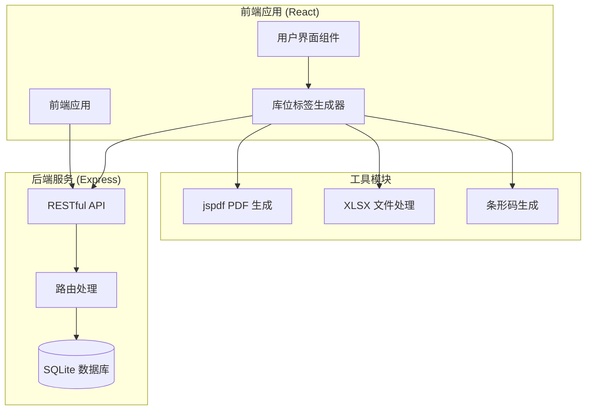
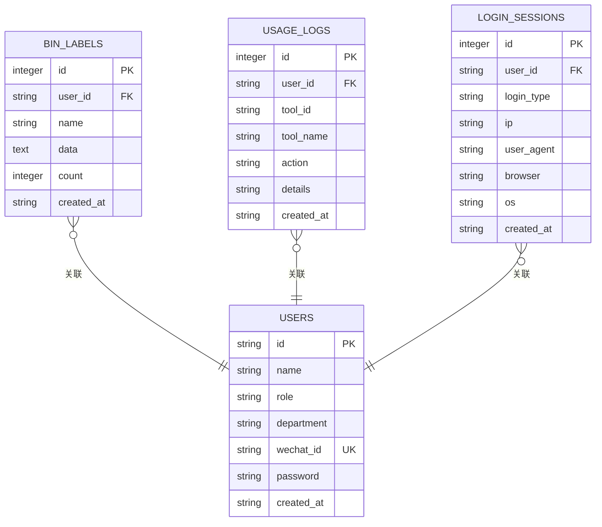
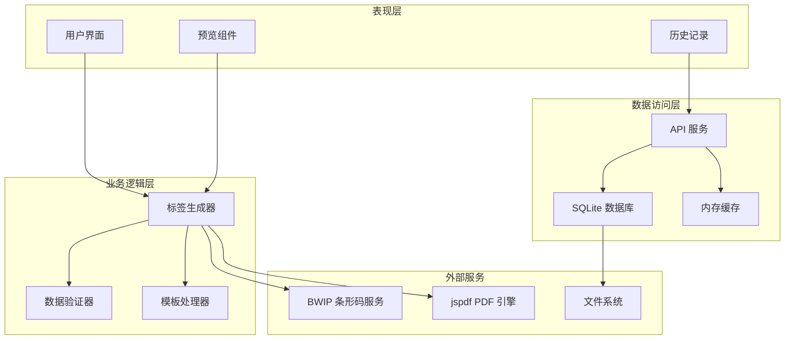
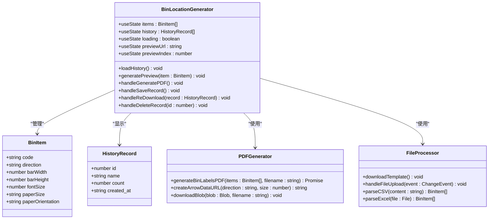
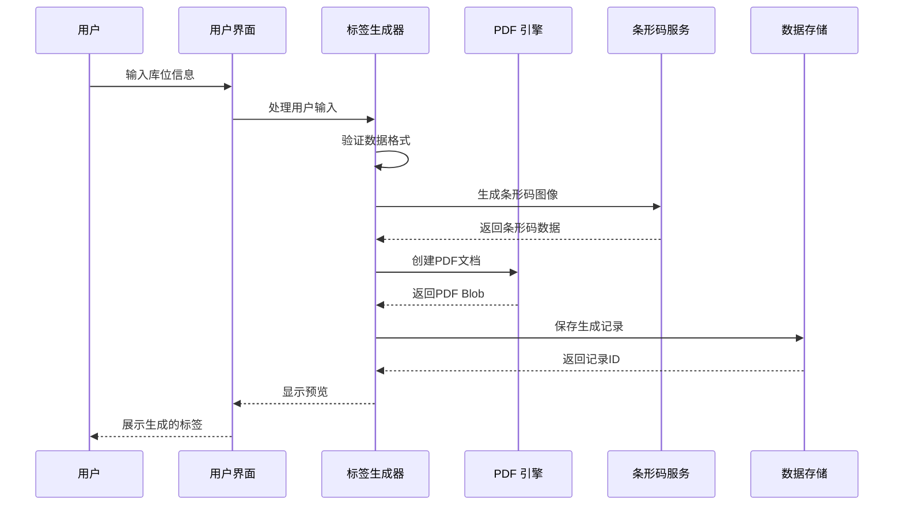
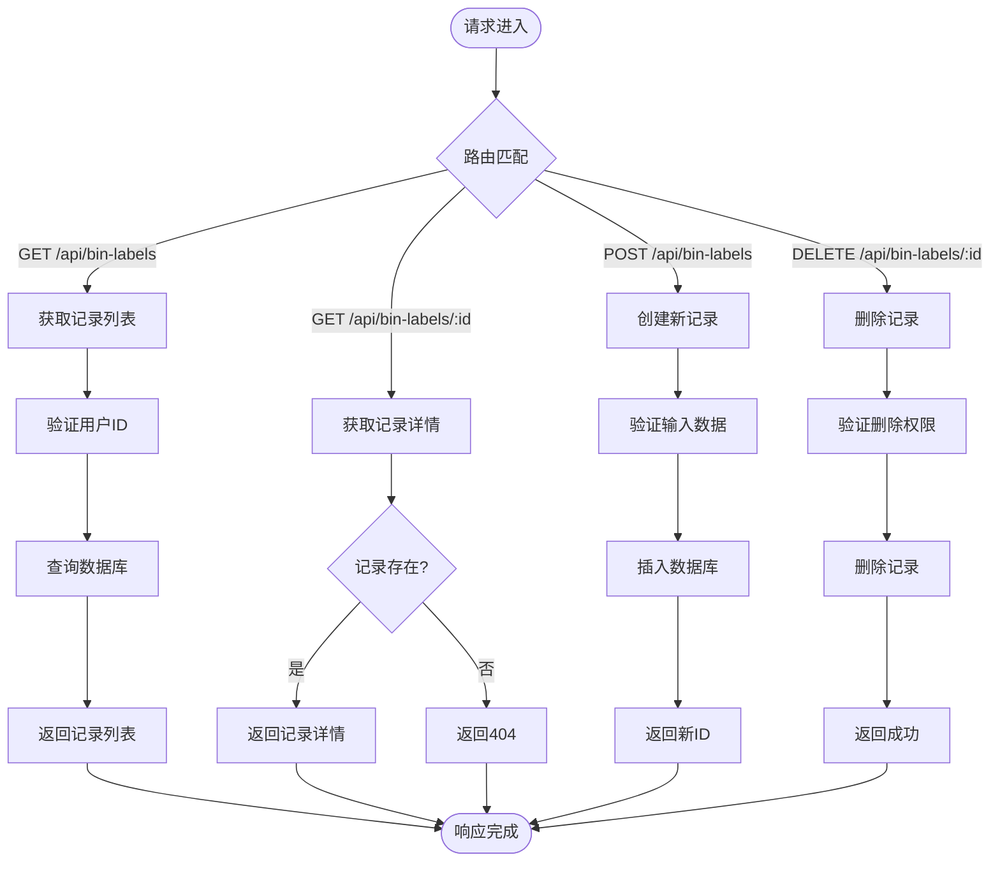
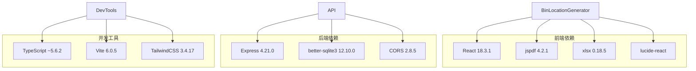
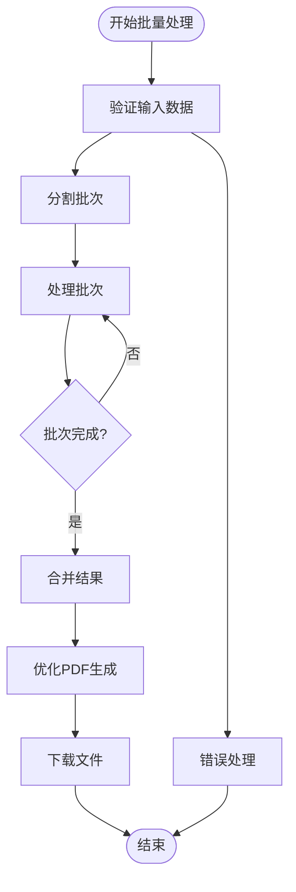

# 库位标签接口

<cite>
**本文档引用的文件**
- [server/src/routes/binLabels.ts](file://server/src/routes/binLabels.ts)
- [server/src/db.ts](file://server/src/db.ts)
- [src/tools/BinLocationGenerator.tsx](file://src/tools/BinLocationGenerator.tsx)
- [server/src/index.ts](file://server/src/index.ts)
- [src/types/index.ts](file://src/types/index.ts)
- [src/lib/api.ts](file://src/lib/api.ts)
- [server/src/routes/logs.ts](file://server/src/routes/logs.ts)
- [server/src/routes/auth.ts](file://server/src/routes/auth.ts)
- [package.json](file://package.json)
- [server/package.json](file://server/package.json)
</cite>

## 目录
1. [简介](#简介)
2. [项目结构](#项目结构)
3. [核心组件](#核心组件)
4. [架构概览](#架构概览)
5. [详细组件分析](#详细组件分析)
6. [依赖分析](#依赖分析)
7. [性能考虑](#性能考虑)
8. [故障排除指南](#故障排除指南)
9. [结论](#结论)
10. [附录](#附录)

## 简介

库位标签接口是 AnyTools 工具平台中的一个重要功能模块，专门用于生成和管理库位标签。该系统提供了完整的库位标签生命周期管理，包括标签模板配置、批量生成、打印预览、历史记录管理等功能。

系统采用前后端分离架构，前端使用 React 构建用户界面，后端基于 Express.js 提供 RESTful API，数据存储使用 SQLite 数据库。用户可以通过 CSV 或 Excel 文件批量导入库位信息，系统会生成专业的 PDF 标签文档。

## 项目结构

项目采用模块化的组织方式，主要分为以下几部分：



**图表来源**
- [server/src/index.ts:1-31](file://server/src/index.ts#L1-L31)
- [src/tools/BinLocationGenerator.tsx:1-604](file://src/tools/BinLocationGenerator.tsx#L1-L604)

**章节来源**
- [server/src/index.ts:1-31](file://server/src/index.ts#L1-L31)
- [package.json:1-34](file://package.json#L1-L34)
- [server/package.json:1-23](file://server/package.json#L1-L23)

## 核心组件

### 数据模型定义

库位标签系统的核心数据模型包括以下关键实体：



**图表来源**
- [server/src/db.ts:49-75](file://server/src/db.ts#L49-L75)

### 接口设计规范

系统提供以下主要 API 接口：

| 方法 | 路径 | 功能描述 | 请求参数 | 响应数据 |
|------|------|----------|----------|----------|
| GET | `/api/bin-labels` | 查询用户生成记录 | `userId` | 记录列表 |
| GET | `/api/bin-labels/:id` | 获取单条记录详情 | `id` | 记录详情 |
| POST | `/api/bin-labels` | 保存新的生成记录 | 用户信息、标签数据 | 新记录ID |
| DELETE | `/api/bin-labels/:id` | 删除记录 | `id`, `userId` | 操作结果 |

**章节来源**
- [server/src/routes/binLabels.ts:15-62](file://server/src/routes/binLabels.ts#L15-L62)

## 架构概览

系统采用分层架构设计，确保了良好的可维护性和扩展性：



**图表来源**
- [src/tools/BinLocationGenerator.tsx:200-604](file://src/tools/BinLocationGenerator.tsx#L200-L604)
- [server/src/routes/binLabels.ts:1-65](file://server/src/routes/binLabels.ts#L1-L65)

## 详细组件分析

### 库位标签生成器组件

库位标签生成器是整个系统的核心组件，负责处理用户输入、生成标签文档和管理历史记录。

#### 组件架构图



**图表来源**
- [src/tools/BinLocationGenerator.tsx:200-604](file://src/tools/BinLocationGenerator.tsx#L200-L604)

#### 标签生成流程



**图表来源**
- [src/tools/BinLocationGenerator.tsx:335-350](file://src/tools/BinLocationGenerator.tsx#L335-L350)
- [src/tools/BinLocationGenerator.tsx:143-198](file://src/tools/BinLocationGenerator.tsx#L143-L198)

**章节来源**
- [src/tools/BinLocationGenerator.tsx:200-604](file://src/tools/BinLocationGenerator.tsx#L200-L604)

### 后端 API 实现

后端服务提供 RESTful API 接口，处理库位标签的 CRUD 操作。

#### API 路由设计



**图表来源**
- [server/src/routes/binLabels.ts:15-62](file://server/src/routes/binLabels.ts#L15-L62)

**章节来源**
- [server/src/routes/binLabels.ts:1-65](file://server/src/routes/binLabels.ts#L1-L65)

### 数据存储结构

系统使用 SQLite 作为数据存储，采用 WAL 模式提高并发性能。

#### 数据库表结构

| 表名 | 字段 | 类型 | 约束 | 描述 |
|------|------|------|------|------|
| `bin_labels` | `id` | INTEGER | PRIMARY KEY, AUTOINCREMENT | 主键标识 |
| `bin_labels` | `user_id` | TEXT | NOT NULL, FOREIGN KEY | 用户标识 |
| `bin_labels` | `name` | TEXT | NOT NULL | 任务名称 |
| `bin_labels` | `data` | TEXT | NOT NULL | 标签数据(JSON) |
| `bin_labels` | `count` | INTEGER | NOT NULL | 标签数量 |
| `bin_labels` | `created_at` | TEXT | DEFAULT CURRENT_TIMESTAMP | 创建时间 |

**章节来源**
- [server/src/db.ts:49-60](file://server/src/db.ts#L49-L60)

## 依赖分析

系统依赖关系清晰，各模块职责明确：



**图表来源**
- [package.json:11-22](file://package.json#L11-L22)
- [server/package.json:10-14](file://server/package.json#L10-L14)

**章节来源**
- [package.json:1-34](file://package.json#L1-34)
- [server/package.json:1-23](file://server/package.json#L1-23)

## 性能考虑

### 查询优化策略

系统针对库位标签查询进行了专门的优化：

1. **索引优化**
   - `idx_bin_labels_user`: 加速按用户查询
   - `idx_bin_labels_time`: 加速按时间排序

2. **查询优化**
   - 使用参数化查询防止 SQL 注入
   - 限制查询结果集大小避免内存溢出
   - 使用事务批量操作提升性能

3. **缓存策略**
   - 内存缓存常用查询结果
   - 预加载用户信息减少重复查询

### 批量处理优化



**图表来源**
- [src/tools/BinLocationGenerator.tsx:335-350](file://src/tools/BinLocationGenerator.tsx#L335-L350)

## 故障排除指南

### 常见问题及解决方案

#### 1. 条形码生成失败

**问题描述**: 标签生成时条形码无法正常显示

**可能原因**:
- BWIP 服务不可用
- 网络连接异常
- 库位码格式不正确

**解决方案**:
- 检查 BWIP 服务状态
- 验证网络连接
- 确认库位码符合要求

#### 2. PDF 生成异常

**问题描述**: 生成的 PDF 文件损坏或无法打开

**可能原因**:
- jspdf 版本兼容性问题
- 内存不足
- 文件路径错误

**解决方案**:
- 更新 jspdf 到最新版本
- 减少同时生成的标签数量
- 检查文件系统权限

#### 3. 数据库连接问题

**问题描述**: 无法连接到 SQLite 数据库

**可能原因**:
- 数据库文件权限不足
- 路径配置错误
- 数据库被其他进程占用

**解决方案**:
- 检查数据库文件权限
- 验证数据库路径配置
- 关闭其他数据库连接

**章节来源**
- [src/tools/BinLocationGenerator.tsx:168-175](file://src/tools/BinLocationGenerator.tsx#L168-L175)

## 结论

库位标签接口是一个功能完整、架构清晰的标签管理系统。系统通过合理的分层设计、完善的错误处理机制和优化的性能策略，为用户提供了一个高效、可靠的库位标签生成解决方案。

主要优势包括：
- **易用性**: 直观的用户界面和丰富的配置选项
- **灵活性**: 支持多种纸张规格和标签布局
- **可靠性**: 完善的错误处理和数据验证机制
- **可扩展性**: 模块化的架构便于功能扩展

未来可以考虑的功能增强：
- 支持更多条形码格式
- 添加标签模板设计器
- 实现云端同步功能
- 增加批量打印功能

## 附录

### API 使用示例

#### 获取用户生成记录
```javascript
// GET /api/bin-labels?userId=USER_ID
fetch('/api/bin-labels?userId=user-001')
  .then(response => response.json())
  .then(data => console.log(data.records))
```

#### 保存标签记录
```javascript
// POST /api/bin-labels
const record = {
  userId: "user-001",
  name: "仓库A标签",
  data: JSON.stringify([
    {
      code: "HC-01-A-001",
      direction: "down",
      barWidth: 100,
      barHeight: 30,
      fontSize: 50,
      paperSize: "a5",
      paperOrientation: "landscape"
    }
  ]),
  count: 1
}

fetch('/api/bin-labels', {
  method: 'POST',
  headers: { 'Content-Type': 'application/json' },
  body: JSON.stringify(record)
})
```

#### 删除标签记录
```javascript
// DELETE /api/bin-labels/:id?userId=USER_ID
fetch('/api/bin-labels/123?userId=user-001', {
  method: 'DELETE'
})
```

### 标签设计规范

#### 尺寸规范
- **标准纸张尺寸**: A3(297×420mm), A4(210×297mm), A5(148×210mm), A6(105×148mm), Letter(216×279mm)
- **标签尺寸**: 建议保持在 50-120mm 宽度范围内
- **边距设置**: 页面边距建议 20mm

#### 字体规范
- **主标题字体**: Helvetica Bold
- **字号范围**: 16-72pt
- **颜色**: 黑色 (#000000)
- **对齐方式**: 居中对齐

#### 条形码规范
- **条形码类型**: Code128
- **尺寸比例**: 宽度:高度 = 3:1
- **最小宽度**: 50mm
- **最大宽度**: 150mm

### 打印适配指南

#### 打印机设置
1. **纸张选择**: 确保使用正确的纸张规格
2. **边距设置**: 设置为零边距或自定义边距
3. **缩放设置**: 选择"无缩放"或"100%"
4. **方向设置**: 根据标签设计选择纵向或横向

#### 打印质量
- **分辨率**: 建议使用 300 DPI 或更高
- **墨水类型**: 使用防水墨水确保长期保存
- **纸张材质**: 使用高质量标签纸

#### 常见打印问题
- **条码模糊**: 检查打印机分辨率和墨水质量
- **文字重叠**: 调整字体大小和页面布局
- **位置偏移**: 校准打印机并检查纸张对齐