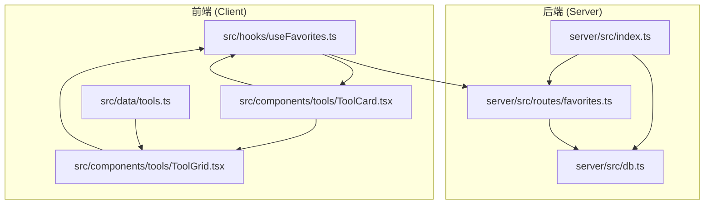
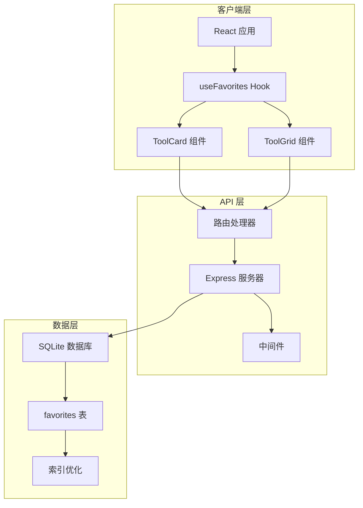
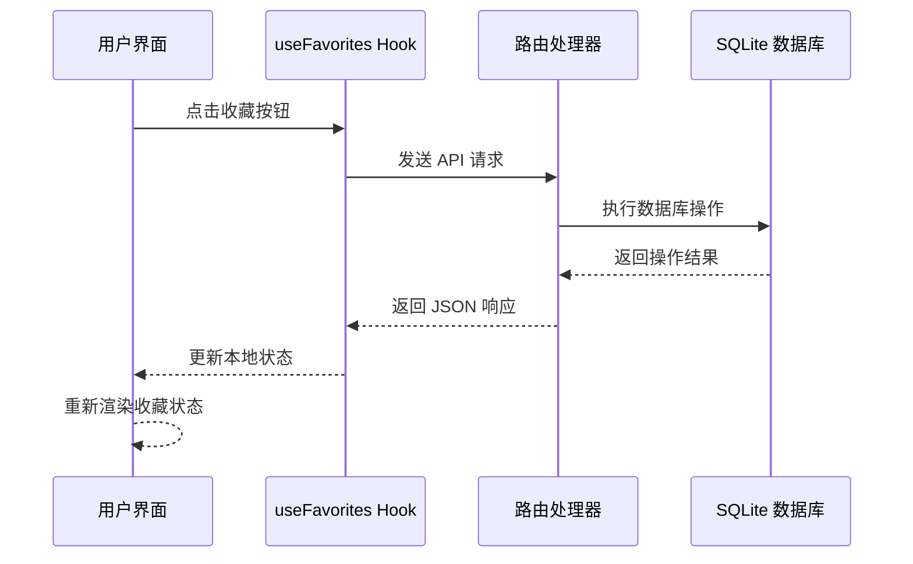
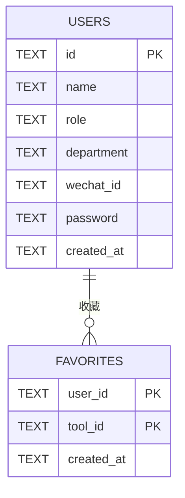
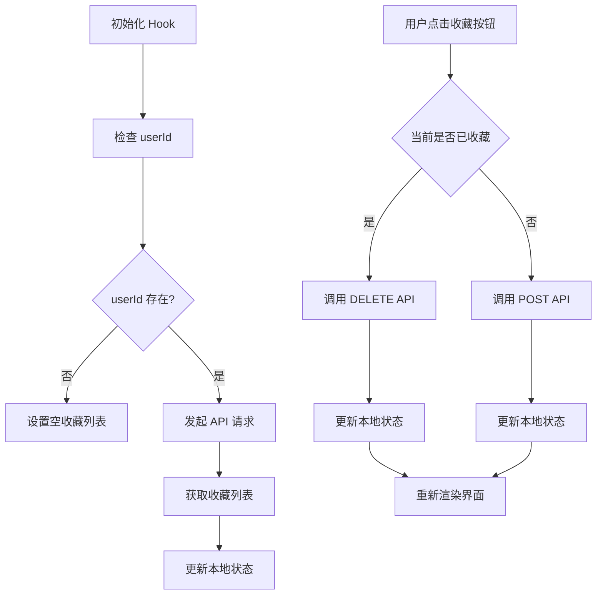
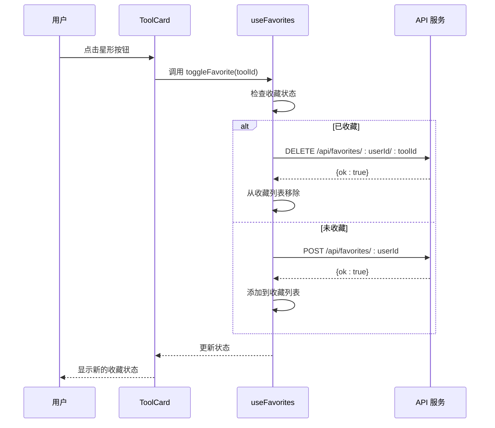
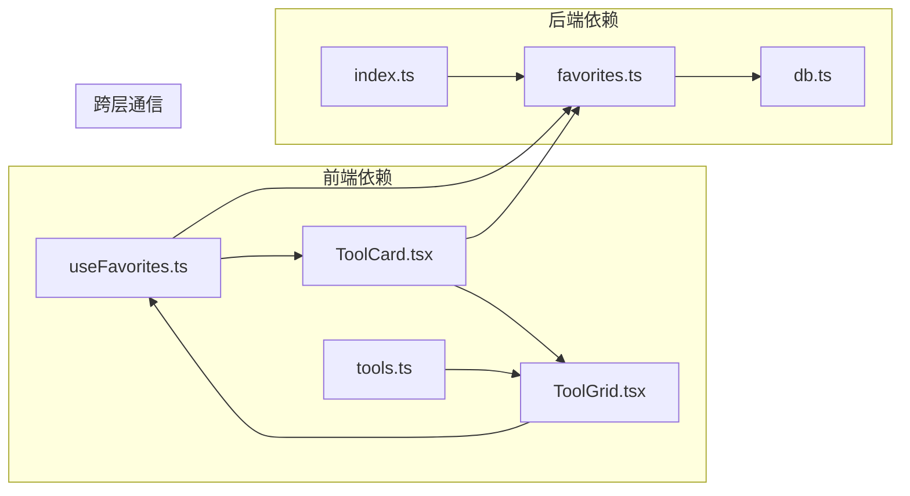

# 收藏管理接口

<cite>
**本文档引用的文件**
- [server/src/routes/favorites.ts](file://server/src/routes/favorites.ts)
- [server/src/db.ts](file://server/src/db.ts)
- [server/src/index.ts](file://server/src/index.ts)
- [src/hooks/useFavorites.ts](file://src/hooks/useFavorites.ts)
- [src/components/tools/ToolCard.tsx](file://src/components/tools/ToolCard.tsx)
- [src/components/tools/ToolGrid.tsx](file://src/components/tools/ToolGrid.tsx)
- [src/data/tools.ts](file://src/data/tools.ts)
</cite>

## 目录
1. [简介](#简介)
2. [项目结构](#项目结构)
3. [核心组件](#核心组件)
4. [架构概览](#架构概览)
5. [详细组件分析](#详细组件分析)
6. [依赖关系分析](#依赖关系分析)
7. [性能考虑](#性能考虑)
8. [故障排除指南](#故障排除指南)
9. [结论](#结论)

## 简介

收藏管理接口是 AnyTools 工具箱应用中的核心功能模块，负责管理用户的工具收藏状态。该系统采用前后端分离架构，后端使用 Express.js 提供 RESTful API，前端使用 React Hooks 实现用户界面交互。

系统的主要功能包括：
- 用户收藏列表查询
- 添加工具到收藏夹
- 从收藏夹移除工具
- 收藏状态的实时同步
- 收藏数据的一致性保证

## 项目结构

收藏管理功能涉及以下关键文件和目录：

**图表来源**
- [server/src/index.ts:1-31](file://server/src/index.ts#L1-L31)
- [server/src/routes/favorites.ts:1-31](file://server/src/routes/favorites.ts#L1-L31)
- [server/src/db.ts:1-126](file://server/src/db.ts#L1-L126)

**章节来源**
- [server/src/index.ts:1-31](file://server/src/index.ts#L1-L31)
- [server/src/routes/favorites.ts:1-31](file://server/src/routes/favorites.ts#L1-L31)
- [server/src/db.ts:1-126](file://server/src/db.ts#L1-L126)

## 核心组件

### 后端 API 接口

收藏管理后端提供了三个核心 RESTful API：

#### 1. 获取收藏列表
- **HTTP 方法**: GET
- **URL 模式**: `/api/favorites/:userId`
- **请求参数**: 
  - 路径参数: `userId` (用户ID)
- **响应格式**: 字符串数组，包含用户收藏的所有工具ID
- **响应示例**: `["json-formatter", "base64", "regex-tester"]`

#### 2. 添加收藏
- **HTTP 方法**: POST
- **URL 模式**: `/api/favorites/:userId`
- **请求参数**: 
  - 路径参数: `userId` (用户ID)
  - 请求体: `{ "toolId": "工具ID" }`
- **响应格式**: JSON 对象，包含 `ok` 字段
- **响应示例**: `{ "ok": true }`

#### 3. 删除收藏
- **HTTP 方法**: DELETE
- **URL 模式**: `/api/favorites/:userId/:toolId`
- **请求参数**: 
  - 路径参数: `userId` (用户ID), `toolId` (工具ID)
- **响应格式**: JSON 对象，包含 `ok` 字段
- **响应示例**: `{ "ok": true }`

### 前端集成组件

#### useFavorites Hook
- **功能**: 管理用户收藏状态的 React Hook
- **主要方法**:
  - `toggleFavorite(toolId)`: 切换工具收藏状态
  - `isFavorite(toolId)`: 检查工具是否已收藏
  - `favorites`: 当前用户的收藏ID数组
  - `recentIds`: 最近使用的工具ID数组

#### ToolCard 组件
- **功能**: 工具卡片组件，支持收藏按钮交互
- **特性**: 
  - 星形图标表示收藏状态
  - 点击按钮切换收藏状态
  - 收藏时显示高亮效果

#### ToolGrid 组件
- **功能**: 工具网格展示组件
- **特性**:
  - 支持多种视图模式（全部、收藏、最近）
  - 动态过滤收藏工具
  - 与 useFavorites Hook 集成

**章节来源**
- [server/src/routes/favorites.ts:6-28](file://server/src/routes/favorites.ts#L6-L28)
- [src/hooks/useFavorites.ts:16-70](file://src/hooks/useFavorites.ts#L16-L70)
- [src/components/tools/ToolCard.tsx:14-43](file://src/components/tools/ToolCard.tsx#L14-L43)
- [src/components/tools/ToolGrid.tsx:15-109](file://src/components/tools/ToolGrid.tsx#L15-L109)

## 架构概览

收藏管理系统采用分层架构设计，确保了良好的可维护性和扩展性：

**图表来源**
- [server/src/index.ts:10-22](file://server/src/index.ts#L10-L22)
- [server/src/routes/favorites.ts:1-31](file://server/src/routes/favorites.ts#L1-L31)
- [server/src/db.ts:41-47](file://server/src/db.ts#L41-L47)

### 数据流序列

**图表来源**
- [src/hooks/useFavorites.ts:34-53](file://src/hooks/useFavorites.ts#L34-L53)
- [server/src/routes/favorites.ts:13-28](file://server/src/routes/favorites.ts#L13-L28)

## 详细组件分析

### 数据库设计

收藏功能使用 SQLite 作为数据存储，采用关系型数据库设计：

**图表来源**
- [server/src/db.ts:14-22](file://server/src/db.ts#L14-L22)
- [server/src/db.ts:41-47](file://server/src/db.ts#L41-L47)

#### 数据表结构特点

1. **主键约束**: `favorites` 表使用复合主键 `(user_id, tool_id)`
2. **外键约束**: 引用 `users` 表的 `id` 字段
3. **唯一性**: 防止重复收藏同一工具
4. **时间戳**: 自动记录收藏创建时间

#### 查询优化策略

1. **索引设计**:
   - 主键索引自动创建
   - 复合主键确保查询效率
   - 外键约束保证数据完整性

2. **SQL 优化**:
   - 使用 `INSERT OR IGNORE` 避免重复插入
   - 使用 `ORDER BY created_at DESC` 实现最新收藏优先

**章节来源**
- [server/src/db.ts:41-75](file://server/src/db.ts#L41-L75)

### API 实现细节

#### GET /api/favorites/:userId
- **功能**: 获取指定用户的收藏工具ID列表
- **实现逻辑**:
  - 从路径参数提取 `userId`
  - 执行 SQL 查询获取所有收藏的 `tool_id`
  - 按创建时间降序排列
  - 返回工具ID数组

#### POST /api/favorites/:userId
- **功能**: 添加工具到用户收藏
- **实现逻辑**:
  - 验证请求体包含 `toolId`
  - 使用 `INSERT OR IGNORE` 避免重复收藏
  - 返回成功状态

#### DELETE /api/favorites/:userId/:toolId
- **功能**: 从用户收藏中移除工具
- **实现逻辑**:
  - 从路径参数提取 `userId` 和 `toolId`
  - 执行删除操作
  - 返回成功状态

**章节来源**
- [server/src/routes/favorites.ts:7-28](file://server/src/routes/favorites.ts#L7-L28)

### 前端集成实现

#### useFavorites Hook 分析

**图表来源**
- [src/hooks/useFavorites.ts:23-53](file://src/hooks/useFavorites.ts#L23-L53)

#### ToolCard 组件交互流程

**图表来源**
- [src/components/tools/ToolCard.tsx:29-43](file://src/components/tools/ToolCard.tsx#L29-L43)
- [src/hooks/useFavorites.ts:34-53](file://src/hooks/useFavorites.ts#L34-L53)

**章节来源**
- [src/hooks/useFavorites.ts:16-70](file://src/hooks/useFavorites.ts#L16-L70)
- [src/components/tools/ToolCard.tsx:14-66](file://src/components/tools/ToolCard.tsx#L14-L66)

## 依赖关系分析

### 组件间依赖关系

**图表来源**
- [server/src/index.ts:3-8](file://server/src/index.ts#L3-L8)
- [server/src/routes/favorites.ts:1-2](file://server/src/routes/favorites.ts#L1-L2)
- [server/src/db.ts:1-6](file://server/src/db.ts#L1-L6)

### 外部依赖

- **Express.js**: Web 服务器框架
- **better-sqlite3**: SQLite 数据库驱动
- **Lucide React**: 图标库
- **React**: 前端框架

**章节来源**
- [server/src/index.ts:1-31](file://server/src/index.ts#L1-L31)
- [server/src/db.ts:1-126](file://server/src/db.ts#L1-L126)

## 性能考虑

### 数据库性能优化

1. **索引策略**:
   - `favorites` 表的复合主键提供 O(log n) 的查找性能
   - 外键约束确保引用完整性但可能影响写入性能

2. **查询优化**:
   - 使用 `ORDER BY created_at DESC` 实现时间排序
   - `INSERT OR IGNORE` 避免重复键冲突

3. **内存管理**:
   - SQLite 内存数据库适合小规模应用
   - 对于大规模数据建议考虑其他数据库方案

### 前端性能优化

1. **状态缓存**:
   - 本地状态缓存避免频繁 API 调用
   - 实时状态同步确保用户体验

2. **渲染优化**:
   - React 组件按需重渲染
   - 事件委托减少事件监听器数量

3. **网络优化**:
   - 批量 API 调用减少网络开销
   - 错误处理避免不必要的重试

## 故障排除指南

### 常见问题及解决方案

#### 1. 收藏状态不同步
**症状**: 点击收藏按钮后状态不更新
**原因**: 
- API 请求失败
- 本地状态更新逻辑错误
- 网络连接问题

**解决方案**:
- 检查浏览器开发者工具的网络面板
- 验证 API 响应状态码
- 确认 `userId` 参数正确传递

#### 2. 重复收藏问题
**症状**: 同一工具可以多次收藏
**原因**: 数据库约束未生效
**解决方案**:
- 检查数据库连接配置
- 验证外键约束是否启用
- 查看数据库日志

#### 3. 性能问题
**症状**: 页面加载缓慢或响应迟缓
**原因**:
- 大量收藏数据导致查询缓慢
- 重复 API 调用
- 前端渲染性能问题

**解决方案**:
- 实施分页或懒加载
- 优化数据库查询
- 减少不必要的组件重渲染

### 错误处理机制

#### 后端错误处理
- **400 Bad Request**: 缺少必需参数（如 `toolId`）
- **500 Internal Server Error**: 数据库操作异常
- **200 OK**: 成功的状态返回

#### 前端错误处理
- **网络错误**: 自动重试机制
- **状态错误**: 友好的用户提示
- **数据不一致**: 本地状态回滚

**章节来源**
- [server/src/routes/favorites.ts:17-20](file://server/src/routes/favorites.ts#L17-L20)
- [src/hooks/useFavorites.ts:34-53](file://src/hooks/useFavorites.ts#L34-L53)

## 结论

收藏管理接口是一个设计合理、实现简洁的功能模块，具有以下特点：

### 优势
1. **架构清晰**: 分层设计便于维护和扩展
2. **数据一致**: 数据库约束确保数据完整性
3. **用户体验**: 实时状态同步提供流畅体验
4. **性能良好**: 合理的索引和查询优化

### 改进建议
1. **扩展功能**: 支持收藏分类和标签
2. **性能优化**: 考虑引入缓存层
3. **监控完善**: 添加详细的日志和监控
4. **测试覆盖**: 增加单元测试和集成测试

该系统为 AnyTools 应用提供了可靠的收藏管理能力，为用户提供了便捷的工具收藏体验。通过合理的架构设计和性能优化，能够满足当前的业务需求，并为未来的功能扩展奠定了良好的基础。