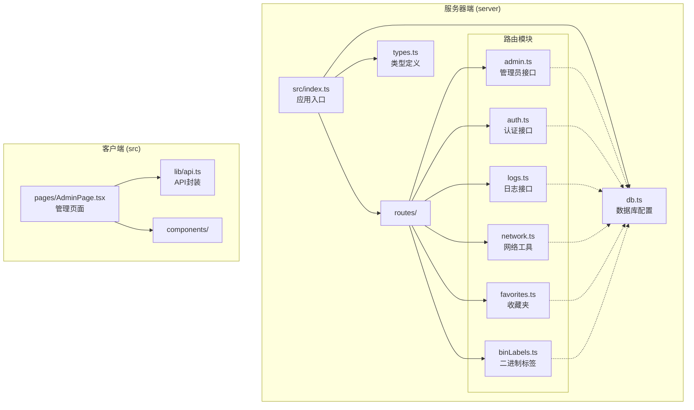
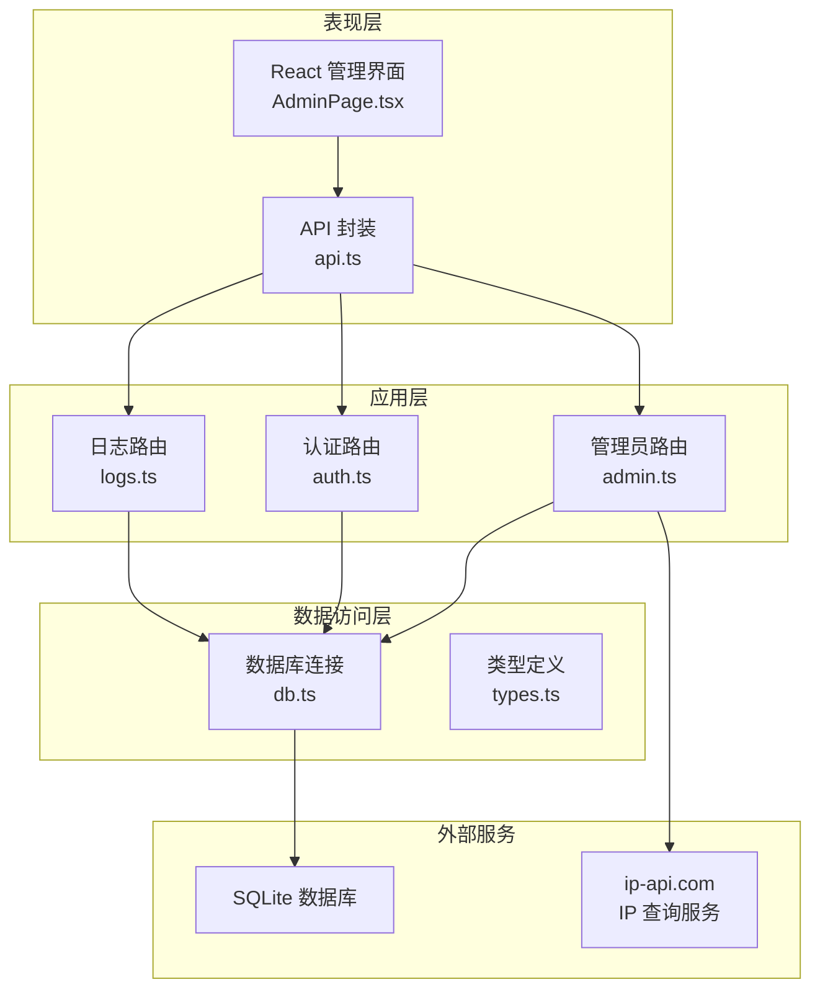
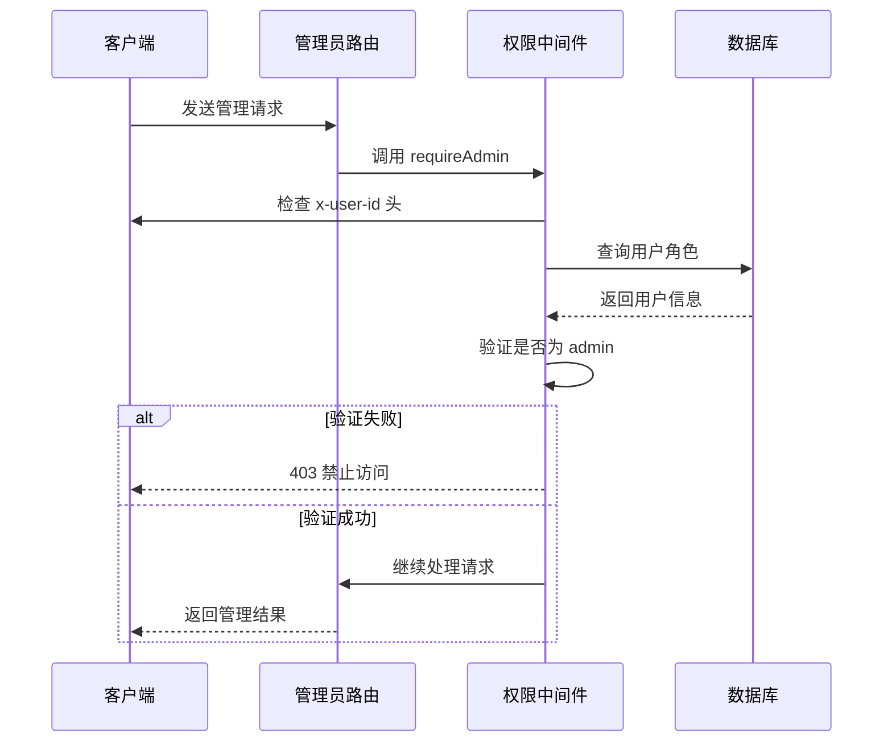
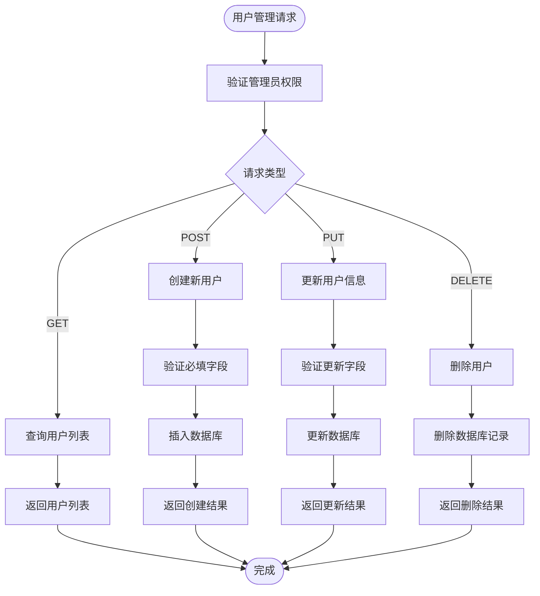
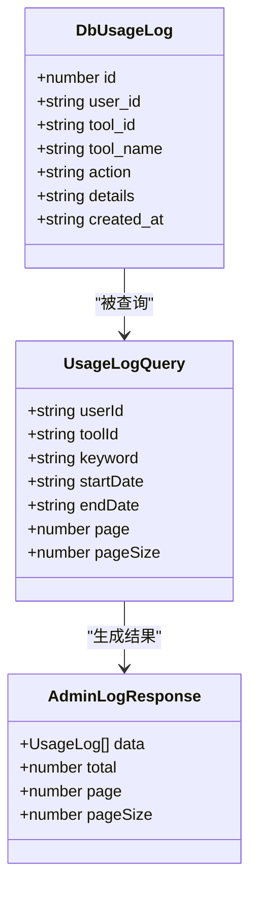
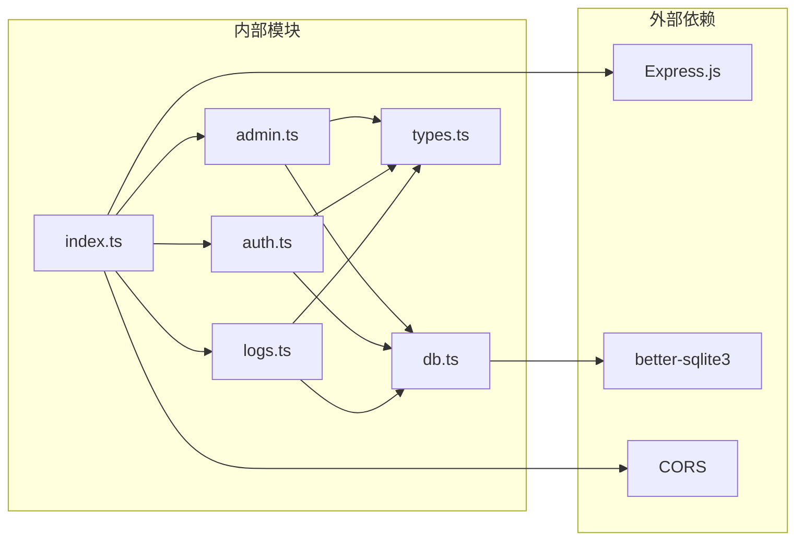

# 管理员接口

<cite>
**本文档引用的文件**
- [server/src/routes/admin.ts](file://server/src/routes/admin.ts)
- [server/src/routes/auth.ts](file://server/src/routes/auth.ts)
- [server/src/routes/logs.ts](file://server/src/routes/logs.ts)
- [server/src/db.ts](file://server/src/db.ts)
- [server/src/types.ts](file://server/src/types.ts)
- [server/src/index.ts](file://server/src/index.ts)
- [src/pages/AdminPage.tsx](file://src/pages/AdminPage.tsx)
- [src/lib/api.ts](file://src/lib/api.ts)
- [server/src/routes/network.ts](file://server/src/routes/network.ts)
- [server/src/routes/favorites.ts](file://server/src/routes/favorites.ts)
- [server/src/routes/binLabels.ts](file://server/src/routes/binLabels.ts)
</cite>

## 目录
1. [简介](#简介)
2. [项目结构](#项目结构)
3. [核心组件](#核心组件)
4. [架构概览](#架构概览)
5. [详细组件分析](#详细组件分析)
6. [依赖关系分析](#依赖关系分析)
7. [性能考虑](#性能考虑)
8. [故障排除指南](#故障排除指南)
9. [结论](#结论)
10. [附录](#附录)

## 简介

管理员接口是 AnyTools 工具平台的核心管理功能模块，为系统管理员提供全面的用户管理和系统监控能力。该模块实现了基于角色的访问控制（RBAC），通过专门的中间件确保只有具备管理员权限的用户才能访问管理功能。

本系统采用前后端分离架构，后端使用 Express.js 提供 RESTful API，前端使用 React 构建管理界面。数据库采用 SQLite，通过 better-sqlite3 进行数据持久化存储。

管理员接口主要包含以下核心功能：
- 用户管理：用户查询、新增、编辑、删除
- 系统监控：登录会话跟踪、操作日志审计
- 权限控制：基于角色的访问验证
- 安全控制：会话记录、IP 地址追踪、浏览器信息收集

## 项目结构

项目采用模块化的目录结构，将不同功能域的代码分离到独立的文件中：

**图表来源**
- [server/src/index.ts:1-31](file://server/src/index.ts#L1-L31)
- [server/src/routes/admin.ts:1-93](file://server/src/routes/admin.ts#L1-L93)
- [server/src/db.ts:1-126](file://server/src/db.ts#L1-L126)

**章节来源**
- [server/src/index.ts:1-31](file://server/src/index.ts#L1-L31)
- [server/src/db.ts:1-126](file://server/src/db.ts#L1-L126)

## 核心组件

管理员接口由多个核心组件构成，每个组件负责特定的管理功能领域：

### 1. 权限验证中间件
管理员接口的核心是 `requireAdmin` 中间件，它负责验证请求发起者的管理员身份。该中间件通过检查请求头中的 `x-user-id` 字段来获取用户标识，并在数据库中验证该用户是否具有 `admin` 角色。

### 2. 用户管理模块
提供完整的用户生命周期管理功能，包括用户查询、新增、编辑和删除操作。所有这些操作都受到管理员权限保护。

### 3. 登录会话监控
跟踪用户的登录活动，记录每次登录的详细信息，包括 IP 地址、浏览器类型、操作系统等信息。

### 4. 操作日志审计
记录用户的所有工具使用操作，支持关键词搜索、时间范围过滤和分页查询，为系统审计提供完整的数据支持。

**章节来源**
- [server/src/routes/admin.ts:7-14](file://server/src/routes/admin.ts#L7-L14)
- [server/src/routes/admin.ts:18-49](file://server/src/routes/admin.ts#L18-L49)
- [server/src/routes/admin.ts:53-90](file://server/src/routes/admin.ts#L53-L90)

## 架构概览

管理员接口采用分层架构设计，清晰分离了业务逻辑、数据访问和表示层：

**图表来源**
- [src/pages/AdminPage.tsx:1-353](file://src/pages/AdminPage.tsx#L1-L353)
- [src/lib/api.ts:1-36](file://src/lib/api.ts#L1-L36)
- [server/src/routes/admin.ts:1-93](file://server/src/routes/admin.ts#L1-L93)
- [server/src/db.ts:1-126](file://server/src/db.ts#L1-L126)

## 详细组件分析

### 权限验证机制

管理员接口的安全性建立在严格的权限验证基础上。系统采用基于角色的访问控制（RBAC）模型：

**图表来源**
- [server/src/routes/admin.ts:7-14](file://server/src/routes/admin.ts#L7-L14)
- [server/src/db.ts:14-22](file://server/src/db.ts#L14-L22)

权限验证的关键特性：
- **请求头验证**：通过 `x-user-id` 请求头获取用户标识
- **角色检查**：数据库查询确认用户角色为 `admin`
- **即时响应**：验证失败时立即返回 401 或 403 状态码
- **无状态设计**：每次请求都进行独立的权限验证

**章节来源**
- [server/src/routes/admin.ts:7-14](file://server/src/routes/admin.ts#L7-L14)
- [server/src/db.ts:14-22](file://server/src/db.ts#L14-L22)

### 用户管理功能

管理员用户管理功能提供了完整的 CRUD 操作，支持对系统用户进行全面管理：

#### 用户查询接口
- **端点**：`GET /api/admin/users`
- **功能**：获取所有用户列表，按创建时间倒序排列
- **响应**：包含用户基本信息（ID、姓名、角色、部门、微信ID、创建时间）

#### 用户创建接口
- **端点**：`POST /api/admin/users`
- **功能**：新增用户账户
- **必需参数**：用户ID、姓名、角色
- **默认值**：部门为空字符串，微信ID为空，密码默认与用户ID相同

#### 用户更新接口
- **端点**：`PUT /api/admin/users/:id`
- **功能**：修改现有用户信息
- **参数**：用户ID（路径参数）、姓名、角色、部门

#### 用户删除接口
- **端点**：`DELETE /api/admin/users/:id`
- **功能**：删除指定用户
- **注意**：删除操作不可逆，需谨慎执行

**图表来源**
- [server/src/routes/admin.ts:18-49](file://server/src/routes/admin.ts#L18-L49)

**章节来源**
- [server/src/routes/admin.ts:18-49](file://server/src/routes/admin.ts#L18-L49)

### 登录会话监控

管理员可以查看系统的登录活动历史，包括用户登录方式、设备信息和地理位置：

#### 会话查询接口
- **端点**：`GET /api/admin/sessions`
- **功能**：获取登录会话历史
- **分页支持**：默认每页 20 条，最大 100 条
- **关联查询**：同时返回用户姓名信息

会话记录包含以下关键信息：
- **用户信息**：用户ID和姓名
- **登录方式**：微信登录、密码登录或游客模式
- **技术信息**：IP地址、User-Agent、浏览器类型、操作系统
- **时间信息**：登录时间戳

**章节来源**
- [server/src/routes/admin.ts:53-65](file://server/src/routes/admin.ts#L53-L65)
- [server/src/routes/auth.ts:24-29](file://server/src/routes/auth.ts#L24-L29)

### 操作日志审计

管理员可以查看所有用户的工具使用操作，支持复杂的查询和过滤功能：

#### 日志查询接口
- **端点**：`GET /api/admin/logs`
- **功能**：获取操作日志列表
- **分页支持**：默认每页 20 条，最大 100 条
- **搜索功能**：支持工具名、操作类型、用户姓名的模糊搜索

日志记录包含以下信息：
- **用户信息**：用户ID、姓名、角色
- **工具信息**：工具ID、工具名称
- **操作信息**：操作类型、详细描述
- **时间信息**：操作时间戳

**图表来源**
- [server/src/types.ts:11-19](file://server/src/types.ts#L11-L19)
- [server/src/types.ts:21-29](file://server/src/types.ts#L21-L29)
- [server/src/routes/admin.ts:69-90](file://server/src/routes/admin.ts#L69-L90)

**章节来源**
- [server/src/routes/admin.ts:69-90](file://server/src/routes/admin.ts#L69-L90)
- [server/src/types.ts:11-29](file://server/src/types.ts#L11-L29)

### 数据库设计

系统使用 SQLite 作为数据存储，采用规范化的关系型设计：

```mermaid
erDiagram
USERS {
string id PK
string name
string role
string department
string wechat_id UK
string password
string created_at
}
LOGIN_SESSIONS {
integer id PK
string user_id FK
string login_type
string ip
string user_agent
string browser
string os
string created_at
}
USAGE_LOGS {
integer id PK
string user_id FK
string tool_id
string tool_name
string action
string details
string created_at
}
FAVORITES {
string user_id PK
string tool_id PK
string created_at
}
BIN_LABELS {
integer id PK
string user_id FK
string name
string data
integer count
string created_at
}
USERS ||--o{ LOGIN_SESSIONS : "has"
USERS ||--o{ USAGE_LOGS : "generates"
USERS ||--o{ FAVORITES : "has"
USERS ||--o{ BIN_LABELS : "creates"
```

**图表来源**
- [server/src/db.ts:14-75](file://server/src/db.ts#L14-L75)

**章节来源**
- [server/src/db.ts:14-75](file://server/src/db.ts#L14-L75)

## 依赖关系分析

管理员接口的依赖关系体现了清晰的关注点分离：

**图表来源**
- [server/src/index.ts:1-31](file://server/src/index.ts#L1-L31)
- [server/src/routes/admin.ts:1-4](file://server/src/routes/admin.ts#L1-L4)
- [server/src/db.ts:1-10](file://server/src/db.ts#L1-L10)

**章节来源**
- [server/src/index.ts:1-31](file://server/src/index.ts#L1-L31)
- [server/src/routes/admin.ts:1-4](file://server/src/routes/admin.ts#L1-L4)

## 性能考虑

管理员接口在设计时充分考虑了性能优化：

### 数据库优化
- **索引策略**：为常用查询字段建立索引（用户微信ID、日志用户ID、日志时间）
- **事务处理**：批量操作使用事务确保数据一致性
- **查询优化**：使用 LIMIT 和 OFFSET 实现高效的分页查询

### 缓存策略
- **会话缓存**：登录会话信息实时查询，确保最新状态
- **日志查询**：使用参数化查询避免 SQL 注入攻击

### 响应优化
- **分页限制**：每页最多 100 条记录，防止大数据量查询影响性能
- **字段选择**：查询时只选择必要的字段，减少数据传输量

## 故障排除指南

### 常见问题及解决方案

#### 权限验证失败
**症状**：返回 401 或 403 状态码
**原因**：
- 缺少 `x-user-id` 请求头
- 用户不是管理员角色
- 用户ID不存在

**解决方法**：
1. 确保前端正确传递 `x-user-id` 头
2. 验证用户确实具有 `admin` 角色
3. 检查用户ID的有效性

#### 数据库操作错误
**症状**：返回 400 状态码和错误信息
**常见原因**：
- 缺少必需字段
- 数据格式不正确
- 外键约束冲突

**解决方法**：
1. 检查请求体中的必需字段
2. 验证数据类型和格式
3. 确认外键引用的有效性

#### 查询性能问题
**症状**：查询响应缓慢
**可能原因**：
- 缺少适当的索引
- 查询条件过于复杂
- 分页参数过大

**优化建议**：
1. 使用合适的查询条件
2. 控制分页大小（不超过 100）
3. 考虑添加适当的数据库索引

**章节来源**
- [server/src/routes/admin.ts:25-33](file://server/src/routes/admin.ts#L25-L33)
- [server/src/db.ts:14-75](file://server/src/db.ts#L14-L75)

## 结论

管理员接口为 AnyTools 平台提供了完整的管理能力，通过严格的身份验证和权限控制确保了系统的安全性。该接口的设计体现了现代 Web 应用的最佳实践：

### 主要优势
- **安全性**：基于角色的访问控制确保只有授权用户才能访问管理功能
- **完整性**：提供用户管理、会话监控、日志审计的完整管理套件
- **可扩展性**：模块化的架构设计便于功能扩展和维护
- **用户体验**：直观的管理界面和丰富的查询功能

### 技术特点
- **前后端分离**：清晰的职责划分便于团队协作开发
- **数据持久化**：使用 SQLite 简化部署和维护
- **类型安全**：完整的 TypeScript 类型定义确保代码质量
- **性能优化**：合理的数据库设计和查询优化

管理员接口的成功实施为 AnyTools 平台的稳定运行和持续发展奠定了坚实的基础。

## 附录

### API 接口规范

#### 用户管理接口
| 方法 | 端点 | 功能 | 权限要求 |
|------|------|------|----------|
| GET | `/api/admin/users` | 查询用户列表 | 管理员 |
| POST | `/api/admin/users` | 创建新用户 | 管理员 |
| PUT | `/api/admin/users/:id` | 更新用户信息 | 管理员 |
| DELETE | `/api/admin/users/:id` | 删除用户 | 管理员 |

#### 会话监控接口
| 方法 | 端点 | 功能 | 权限要求 |
|------|------|------|----------|
| GET | `/api/admin/sessions` | 查询登录会话 | 管理员 |

#### 日志审计接口
| 方法 | 端点 | 功能 | 权限要求 |
|------|------|------|----------|
| GET | `/api/admin/logs` | 查询操作日志 | 管理员 |

### 最佳实践建议

1. **安全实践**
   - 定期审查管理员账户
   - 实施最小权限原则
   - 启用审计日志记录

2. **性能优化**
   - 合理设置分页参数
   - 使用索引优化查询
   - 定期清理历史数据

3. **运维管理**
   - 建立备份策略
   - 监控系统健康状况
   - 定期更新安全补丁