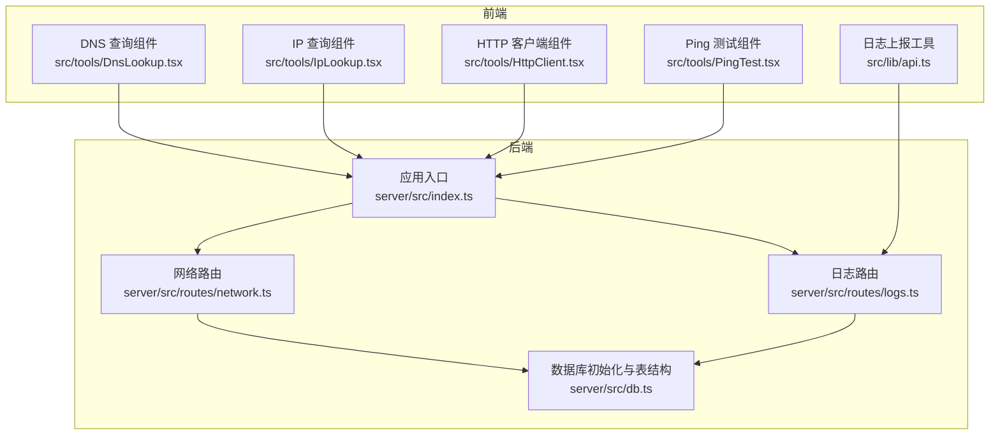
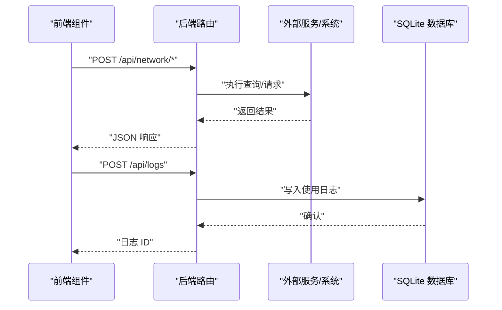
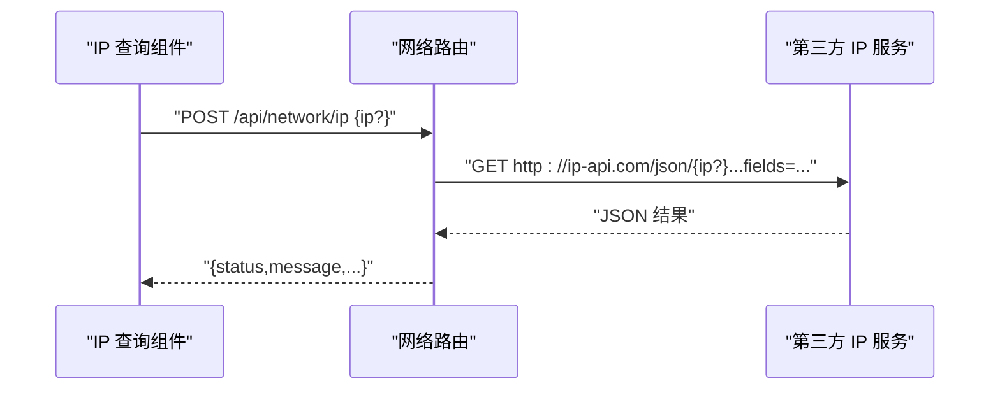
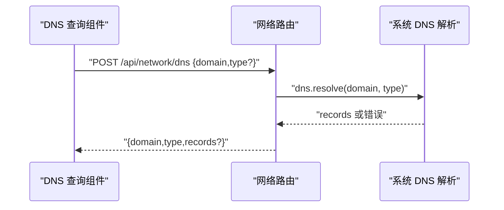
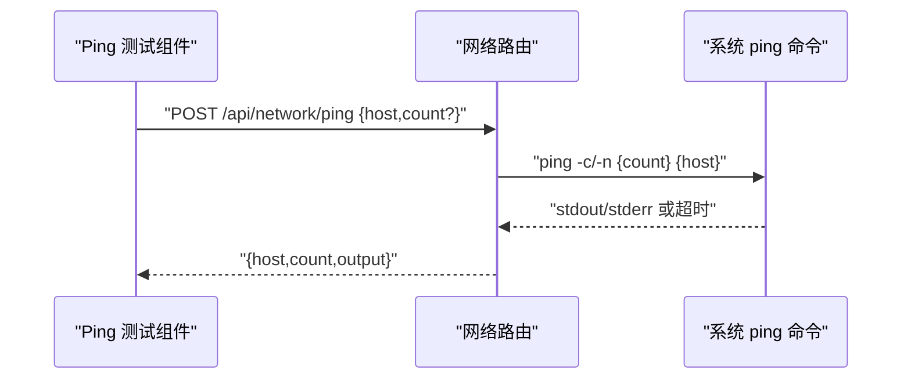
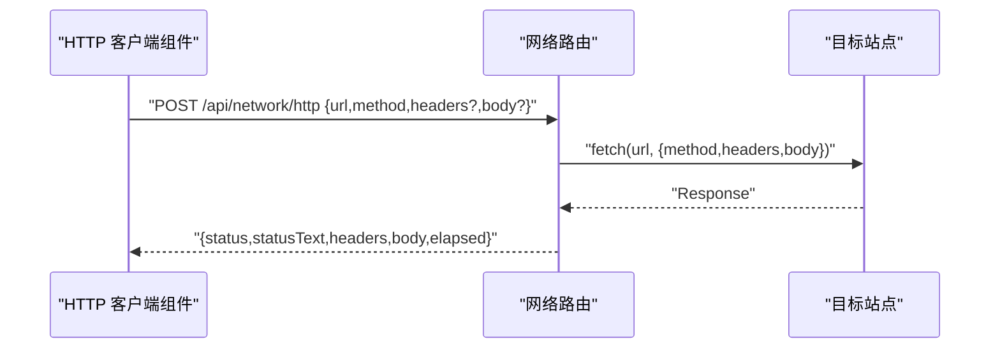
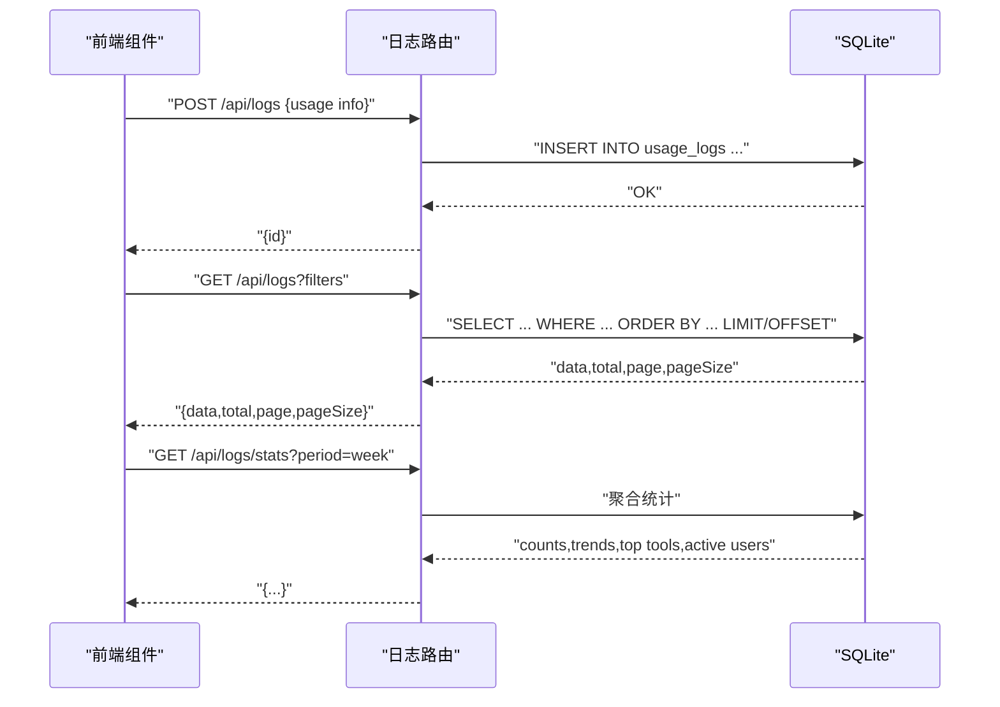
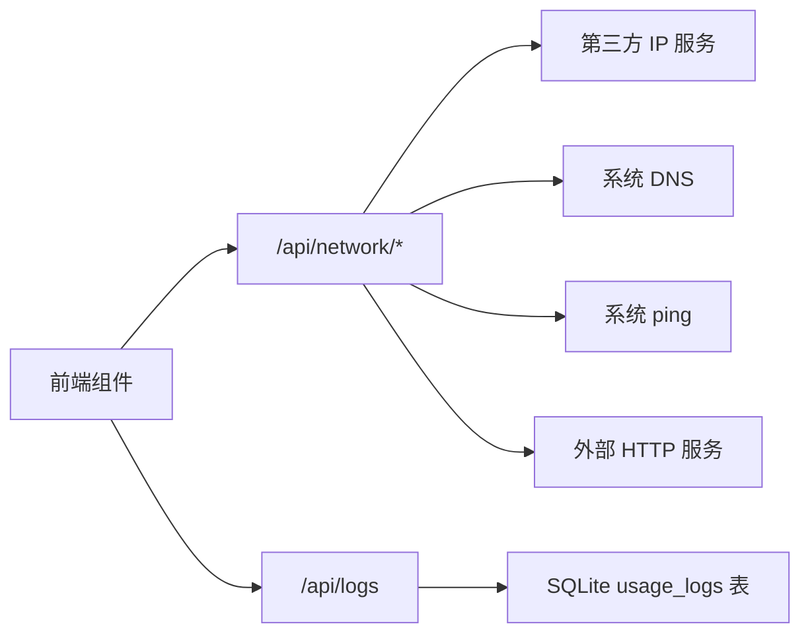

# 网络工具接口

<cite>
**本文引用的文件**
- [server/src/index.ts](file://server/src/index.ts)
- [server/src/routes/network.ts](file://server/src/routes/network.ts)
- [server/src/routes/logs.ts](file://server/src/routes/logs.ts)
- [server/src/db.ts](file://server/src/db.ts)
- [src/lib/api.ts](file://src/lib/api.ts)
- [src/tools/DnsLookup.tsx](file://src/tools/DnsLookup.tsx)
- [src/tools/IpLookup.tsx](file://src/tools/IpLookup.tsx)
- [src/tools/HttpClient.tsx](file://src/tools/HttpClient.tsx)
- [src/tools/PingTest.tsx](file://src/tools/PingTest.tsx)
- [src/types/index.ts](file://src/types/index.ts)
</cite>

## 目录
1. [简介](#简介)
2. [项目结构](#项目结构)
3. [核心组件](#核心组件)
4. [架构总览](#架构总览)
5. [详细组件分析](#详细组件分析)
6. [依赖关系分析](#依赖关系分析)
7. [性能考量](#性能考量)
8. [故障排除指南](#故障排除指南)
9. [结论](#结论)
10. [附录](#附录)

## 简介
本文件为“网络工具接口”的完整 API 文档，覆盖以下网络功能：
- IP 查询：基于第三方服务返回地理位置与网络信息
- DNS 查询：解析指定域名的各类记录类型
- Ping 检测：对目标主机进行连通性测试
- HTTP 请求：代理发起 HTTP(S) 请求并返回状态、头与响应体摘要

文档同时说明请求参数、响应格式、超时设置、错误处理、安全注意事项、性能优化建议以及使用限制与频率控制机制。

## 项目结构
后端采用 Express 提供 REST API，前端通过 React 组件调用后端接口；日志使用 SQLite 存储，支持使用统计与查询。

**图表来源**
- [server/src/index.ts:1-31](file://server/src/index.ts#L1-L31)
- [server/src/routes/network.ts:1-109](file://server/src/routes/network.ts#L1-L109)
- [server/src/routes/logs.ts:1-134](file://server/src/routes/logs.ts#L1-L134)
- [server/src/db.ts:1-126](file://server/src/db.ts#L1-L126)
- [src/lib/api.ts:1-36](file://src/lib/api.ts#L1-L36)
- [src/tools/DnsLookup.tsx:1-80](file://src/tools/DnsLookup.tsx#L1-L80)
- [src/tools/IpLookup.tsx:1-72](file://src/tools/IpLookup.tsx#L1-L72)
- [src/tools/HttpClient.tsx:1-90](file://src/tools/HttpClient.tsx#L1-L90)
- [src/tools/PingTest.tsx:1-73](file://src/tools/PingTest.tsx#L1-L73)

**章节来源**
- [server/src/index.ts:1-31](file://server/src/index.ts#L1-L31)
- [server/src/routes/network.ts:1-109](file://server/src/routes/network.ts#L1-L109)
- [server/src/routes/logs.ts:1-134](file://server/src/routes/logs.ts#L1-L134)
- [server/src/db.ts:1-126](file://server/src/db.ts#L1-L126)
- [src/lib/api.ts:1-36](file://src/lib/api.ts#L1-L36)
- [src/tools/DnsLookup.tsx:1-80](file://src/tools/DnsLookup.tsx#L1-L80)
- [src/tools/IpLookup.tsx:1-72](file://src/tools/IpLookup.tsx#L1-L72)
- [src/tools/HttpClient.tsx:1-90](file://src/tools/HttpClient.tsx#L1-L90)
- [src/tools/PingTest.tsx:1-73](file://src/tools/PingTest.tsx#L1-L73)

## 核心组件
- 网络路由模块：提供 /api/network 下的四个子接口，分别对应 IP 查询、DNS 查询、Ping 检测与 HTTP 请求代理
- 日志模块：提供使用记录上报与查询能力，支撑审计与统计
- 前端工具组件：封装各网络工具的用户交互与调用逻辑

**章节来源**
- [server/src/routes/network.ts:10-106](file://server/src/routes/network.ts#L10-L106)
- [server/src/routes/logs.ts:7-131](file://server/src/routes/logs.ts#L7-L131)
- [src/lib/api.ts:3-19](file://src/lib/api.ts#L3-L19)

## 架构总览
后端通过中间件启用跨域与 JSON 解析，统一挂载各业务路由；网络工具接口直接对接系统命令或外部服务，HTTP 请求代理使用 Node 的 fetch；日志写入 SQLite 并提供查询与统计接口。

**图表来源**
- [server/src/index.ts:14-22](file://server/src/index.ts#L14-L22)
- [server/src/routes/network.ts:11-106](file://server/src/routes/network.ts#L11-L106)
- [server/src/routes/logs.ts:8-18](file://server/src/routes/logs.ts#L8-L18)
- [server/src/db.ts:26-39](file://server/src/db.ts#L26-L39)

## 详细组件分析

### IP 查询接口
- 路径：/api/network/ip
- 方法：POST
- 请求体字段
  - ip: 字符串，可选；为空时查询本机
- 响应字段
  - status: 字符串，成功/失败
  - message: 字符串，失败时的消息
  - country/regionName/city/isp/org/as/query/lat/lon/timezone: 地理与网络信息
- 错误处理
  - 当 status=fail 时返回 400
  - 其他异常返回 500
- 超时设置
  - 未在后端显式设置超时，受默认环境影响
- 使用示例
  - 前端组件路径：[src/tools/IpLookup.tsx:21-28](file://src/tools/IpLookup.tsx#L21-L28)

**图表来源**
- [server/src/routes/network.ts:11-25](file://server/src/routes/network.ts#L11-L25)
- [src/tools/IpLookup.tsx:21-28](file://src/tools/IpLookup.tsx#L21-L28)

**章节来源**
- [server/src/routes/network.ts:11-25](file://server/src/routes/network.ts#L11-L25)
- [src/tools/IpLookup.tsx:16-35](file://src/tools/IpLookup.tsx#L16-L35)

### DNS 查询接口
- 路径：/api/network/dns
- 方法：POST
- 请求体字段
  - domain: 字符串，必填
  - type: 字符串，可选，默认“A”；支持 A/AAAA/CNAME/MX/TXT/NS
- 响应字段
  - domain: 查询域名
  - type: 记录类型
  - records: 数组，记录值列表
- 错误处理
  - 缺少 domain 返回 400
  - 解析失败返回 400，包含错误码或消息
- 超时设置
  - 未显式设置超时
- 使用示例
  - 前端组件路径：[src/tools/DnsLookup.tsx:23-29](file://src/tools/DnsLookup.tsx#L23-L29)

**图表来源**
- [server/src/routes/network.ts:28-45](file://server/src/routes/network.ts#L28-L45)
- [src/tools/DnsLookup.tsx:23-29](file://src/tools/DnsLookup.tsx#L23-L29)

**章节来源**
- [server/src/routes/network.ts:28-45](file://server/src/routes/network.ts#L28-L45)
- [src/tools/DnsLookup.tsx:17-37](file://src/tools/DnsLookup.tsx#L17-L37)

### Ping 检测接口
- 路径：/api/network/ping
- 方法：POST
- 请求体字段
  - host: 字符串，必填
  - count: 数字，可选，默认 4，最大 10
- 响应字段
  - host: 目标主机
  - count: 实际发送次数
  - output: 控制台输出文本
- 错误处理
  - 缺少 host 返回 400
  - 执行失败返回 400，包含标准输出/错误输出或通用错误
- 超时设置
  - 执行命令设置了 30 秒超时
- 使用示例
  - 前端组件路径：[src/tools/PingTest.tsx:23-29](file://src/tools/PingTest.tsx#L23-L29)

**图表来源**
- [server/src/routes/network.ts:48-63](file://server/src/routes/network.ts#L48-L63)
- [src/tools/PingTest.tsx:23-29](file://src/tools/PingTest.tsx#L23-L29)

**章节来源**
- [server/src/routes/network.ts:48-63](file://server/src/routes/network.ts#L48-L63)
- [src/tools/PingTest.tsx:17-37](file://src/tools/PingTest.tsx#L17-L37)

### HTTP 请求代理接口
- 路径：/api/network/http
- 方法：POST
- 请求体字段
  - url: 字符串，必填
  - method: 字符串，可选，默认 GET
  - headers: 对象，可选
  - body: 字符串，可选（当方法为 POST/PUT/PATCH 时有效）
- 响应字段
  - status: 数字，HTTP 状态码
  - statusText: 字符串，状态短语
  - headers: 对象，响应头
  - body: 字符串或对象，响应体（二进制内容以描述形式呈现；文本超过 50000 字符截断）
  - elapsed: 数字，毫秒级耗时
- 错误处理
  - 缺少 url 返回 400
  - 其他异常返回 400
- 超时设置
  - 未显式设置 fetch 超时
- 使用示例
  - 前端组件路径：[src/tools/HttpClient.tsx:24-32](file://src/tools/HttpClient.tsx#L24-L32)

**图表来源**
- [server/src/routes/network.ts:66-106](file://server/src/routes/network.ts#L66-L106)
- [src/tools/HttpClient.tsx:24-32](file://src/tools/HttpClient.tsx#L24-L32)

**章节来源**
- [server/src/routes/network.ts:66-106](file://server/src/routes/network.ts#L66-L106)
- [src/tools/HttpClient.tsx:19-42](file://src/tools/HttpClient.tsx#L19-L42)

### 日志记录与查询
- 上报接口：/api/logs（POST）
  - 请求体字段：userId/toolId/toolName/action/details
  - 成功返回新增记录的自增 ID
- 查询接口：/api/logs（GET）
  - 查询参数：userId/toolId/keyword/startDate/endDate/page/pageSize
  - 分页与条件过滤，支持按日期范围与关键字模糊匹配
- 统计接口：/api/logs/stats（GET）
  - 查询参数：userId/period（day/week/month）
  - 返回当日/周/月/总计使用量、热门工具、每日趋势、最近日志、活跃用户等

**图表来源**
- [server/src/routes/logs.ts:8-18](file://server/src/routes/logs.ts#L8-L18)
- [server/src/routes/logs.ts:21-69](file://server/src/routes/logs.ts#L21-L69)
- [server/src/routes/logs.ts:72-131](file://server/src/routes/logs.ts#L72-L131)
- [server/src/db.ts:26-39](file://server/src/db.ts#L26-L39)

**章节来源**
- [server/src/routes/logs.ts:8-131](file://server/src/routes/logs.ts#L8-L131)
- [server/src/db.ts:13-75](file://server/src/db.ts#L13-L75)

## 依赖关系分析
- 前端到后端：各工具组件通过 /api/network/* 发起请求；日志通过 /api/logs 上报
- 后端到外部：IP 查询依赖第三方服务；DNS 查询依赖系统 DNS；Ping 依赖系统命令；HTTP 代理依赖 fetch
- 后端到存储：日志写入 SQLite，提供查询与统计

**图表来源**
- [server/src/routes/network.ts:11-106](file://server/src/routes/network.ts#L11-L106)
- [server/src/routes/logs.ts:8-18](file://server/src/routes/logs.ts#L8-L18)
- [server/src/db.ts:26-39](file://server/src/db.ts#L26-L39)

**章节来源**
- [server/src/routes/network.ts:11-106](file://server/src/routes/network.ts#L11-L106)
- [server/src/routes/logs.ts:8-18](file://server/src/routes/logs.ts#L8-L18)
- [server/src/db.ts:26-39](file://server/src/db.ts#L26-L39)

## 性能考量
- HTTP 代理响应体截断：文本超过阈值会被截断，避免过大数据导致传输与渲染压力
- Ping 命令超时：执行阶段设置 30 秒超时，防止长时间阻塞
- DNS 查询：使用异步回调封装 Promise，减少阻塞风险
- IP 查询：依赖第三方服务，建议在前端做必要的重试与降级策略
- 日志写入：使用事务插入样本数据，生产环境建议在高并发场景下评估索引与分页参数

**章节来源**
- [server/src/routes/network.ts:89-94](file://server/src/routes/network.ts#L89-L94)
- [server/src/routes/network.ts:57](file://server/src/routes/network.ts#L57)
- [server/src/db.ts:109-122](file://server/src/db.ts#L109-L122)

## 故障排除指南
- IP 查询失败
  - 现象：返回 status=fail 或 400
  - 排查：检查 ip 参数是否合法；确认网络可达第三方服务
  - 参考：[server/src/routes/network.ts:18-21](file://server/src/routes/network.ts#L18-L21)
- DNS 查询失败
  - 现象：返回 400，包含错误码或消息
  - 排查：确认 domain 是否存在；type 是否为受支持类型；系统 DNS 配置
  - 参考：[server/src/routes/network.ts:41-44](file://server/src/routes/network.ts#L41-L44)
- Ping 失败
  - 现象：返回 400，包含输出或错误信息
  - 排查：确认 host 是否可达；count 是否在允许范围内；平台命令可用性
  - 参考：[server/src/routes/network.ts:59-62](file://server/src/routes/network.ts#L59-L62)
- HTTP 代理异常
  - 现象：返回 400
  - 排查：确认 url/method/headers/body 合法；目标站点可达；注意二进制内容被描述化
  - 参考：[server/src/routes/network.ts:103](file://server/src/routes/network.ts#L103)
- 日志上报失败
  - 现象：前端控制台打印错误
  - 排查：确认 /api/logs 可达；请求体字段齐全
  - 参考：[src/lib/api.ts:10-19](file://src/lib/api.ts#L10-L19)

**章节来源**
- [server/src/routes/network.ts:18-21](file://server/src/routes/network.ts#L18-L21)
- [server/src/routes/network.ts:41-44](file://server/src/routes/network.ts#L41-L44)
- [server/src/routes/network.ts:59-62](file://server/src/routes/network.ts#L59-L62)
- [server/src/routes/network.ts:103](file://server/src/routes/network.ts#L103)
- [src/lib/api.ts:10-19](file://src/lib/api.ts#L10-L19)

## 结论
该网络工具接口提供了 IP 查询、DNS 解析、Ping 检测与 HTTP 代理四大核心能力，前端组件通过统一的 /api/network 路由调用，日志模块支持使用统计与审计。当前实现具备基本的错误处理与超时控制，建议在生产环境中结合限流与缓存策略进一步提升稳定性与安全性。

## 附录

### API 定义汇总
- IP 查询
  - 路径：/api/network/ip
  - 方法：POST
  - 请求体：{ ip?: string }
  - 响应：包含地理与网络信息字段
  - 错误：status=fail 返回 400；其他异常返回 500
- DNS 查询
  - 路径：/api/network/dns
  - 方法：POST
  - 请求体：{ domain: string, type?: string }
  - 响应：{ domain, type, records }
  - 错误：缺少 domain 返回 400；解析失败返回 400
- Ping 检测
  - 路径：/api/network/ping
  - 方法：POST
  - 请求体：{ host: string, count?: number }
  - 响应：{ host, count, output }
  - 错误：缺少 host 返回 400；执行失败返回 400
- HTTP 请求
  - 路径：/api/network/http
  - 方法：POST
  - 请求体：{ url: string, method?: string, headers?: Record<string,string>, body?: string }
  - 响应：{ status, statusText, headers, body, elapsed }
  - 错误：缺少 url 返回 400；其他异常返回 400

**章节来源**
- [server/src/routes/network.ts:11-106](file://server/src/routes/network.ts#L11-L106)

### 使用示例与最佳实践
- IP 查询
  - 前端调用路径参考：[src/tools/IpLookup.tsx:21-28](file://src/tools/IpLookup.tsx#L21-L28)
  - 建议：对空 ip 进行校验；展示关键字段如 country/city/isp
- DNS 查询
  - 前端调用路径参考：[src/tools/DnsLookup.tsx:23-29](file://src/tools/DnsLookup.tsx#L23-L29)
  - 建议：限制 type 选择；对空结果友好提示
- Ping 测试
  - 前端调用路径参考：[src/tools/PingTest.tsx:23-29](file://src/tools/PingTest.tsx#L23-L29)
  - 建议：合理设置 count（1-10）；显示 elapsed 与输出摘要
- HTTP 请求
  - 前端调用路径参考：[src/tools/HttpClient.tsx:24-32](file://src/tools/HttpClient.tsx#L24-L32)
  - 建议：对大响应体进行截断；二进制内容以描述形式展示

**章节来源**
- [src/tools/IpLookup.tsx:21-28](file://src/tools/IpLookup.tsx#L21-L28)
- [src/tools/DnsLookup.tsx:23-29](file://src/tools/DnsLookup.tsx#L23-L29)
- [src/tools/PingTest.tsx:23-29](file://src/tools/PingTest.tsx#L23-L29)
- [src/tools/HttpClient.tsx:24-32](file://src/tools/HttpClient.tsx#L24-L32)

### 安全考虑
- 输入验证：所有接口均对必填字段进行校验，缺失时返回 400
- 跨域：后端启用 CORS，origin 可配置
- 命令注入：Ping 使用平台命令，建议仅在可信环境运行；避免用户可控参数直接拼接到命令行
- 外部请求：HTTP 代理直接转发请求，需确保目标站点可信；避免泄露敏感头与体
- 日志：使用结构化字段记录使用情况，避免敏感信息落库

**章节来源**
- [server/src/index.ts:14](file://server/src/index.ts#L14)
- [server/src/routes/network.ts:48-63](file://server/src/routes/network.ts#L48-L63)
- [server/src/routes/network.ts:66-106](file://server/src/routes/network.ts#L66-L106)

### 性能优化建议
- 限流与节流：对高频查询（如 DNS/IP）增加客户端节流与服务端限流
- 缓存：对热点 IP/DNS 结果进行短期缓存
- 超时与重试：为外部服务调用设置合理超时与指数退避重试
- 响应裁剪：保持现有响应体截断策略，避免大响应拖慢前端
- 并发控制：限制同一会话并发请求数量

[本节为通用建议，无需特定文件引用]

### 使用限制与频率控制机制
- 已实现能力
  - 前端组件对输入进行基础校验与禁用加载态
  - Ping 的执行命令设置了固定超时
  - HTTP 代理对响应体长度进行截断
- 建议增强
  - 在后端增加速率限制（如每分钟请求数）
  - 引入白名单与黑名单机制
  - 对敏感操作（如 Ping）增加权限校验
  - 提供配额与告警机制

**章节来源**
- [src/tools/PingTest.tsx:17-37](file://src/tools/PingTest.tsx#L17-L37)
- [server/src/routes/network.ts:57](file://server/src/routes/network.ts#L57)
- [server/src/routes/network.ts:89-94](file://server/src/routes/network.ts#L89-L94)