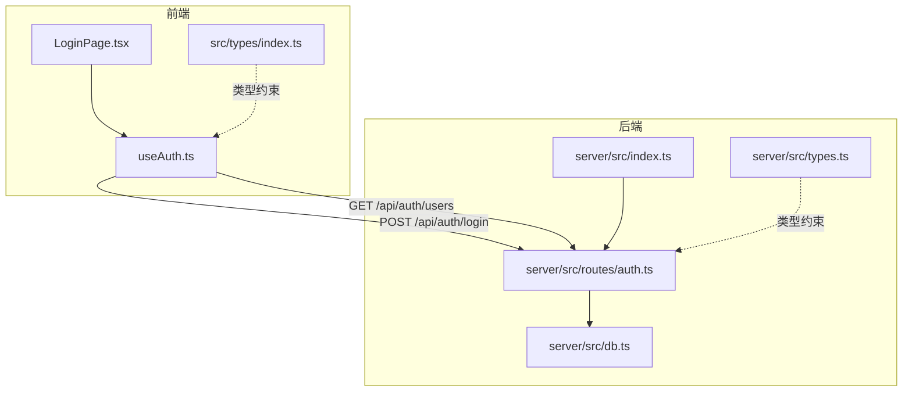
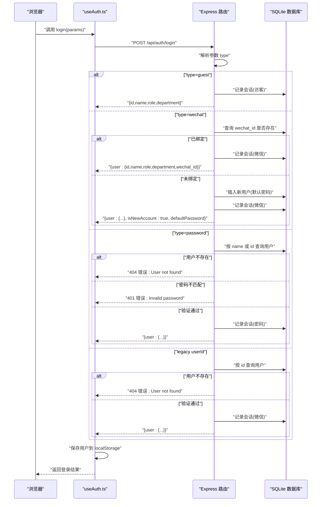
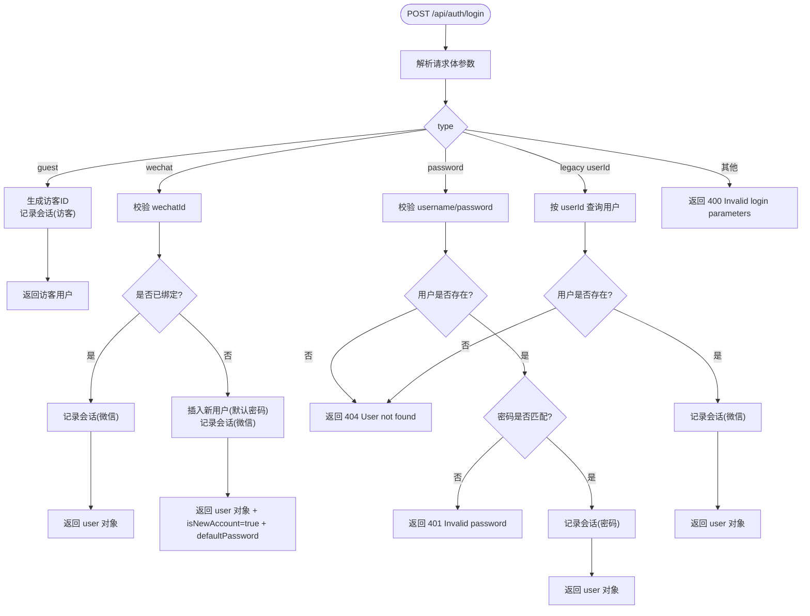
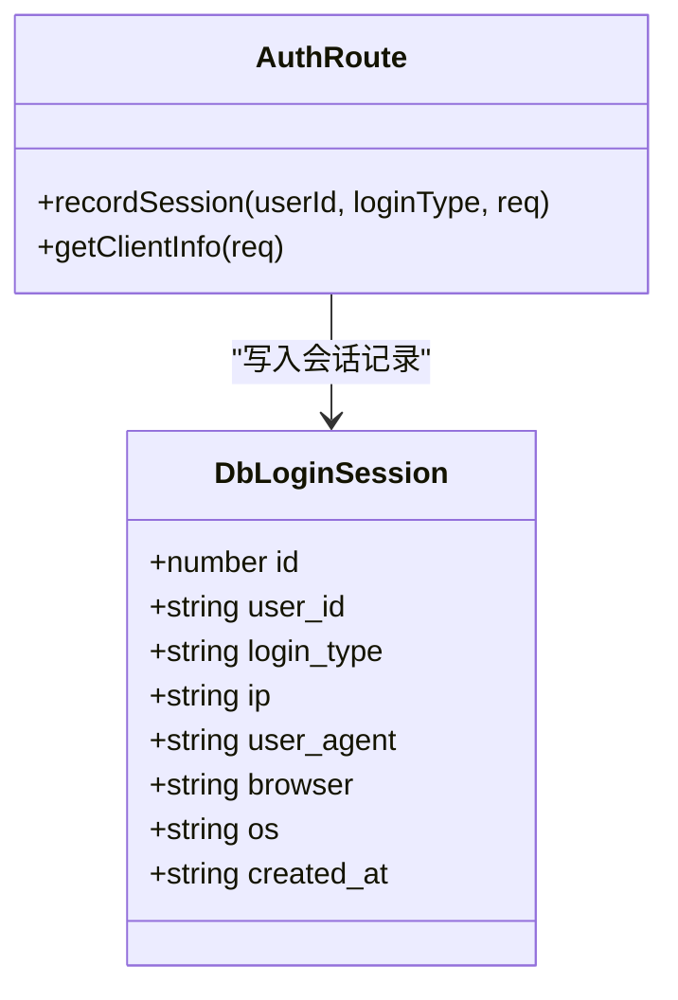
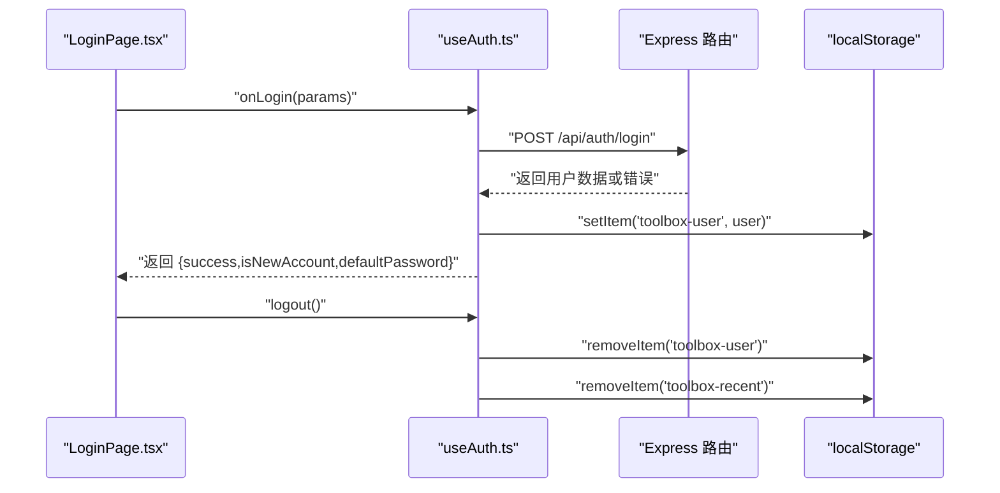
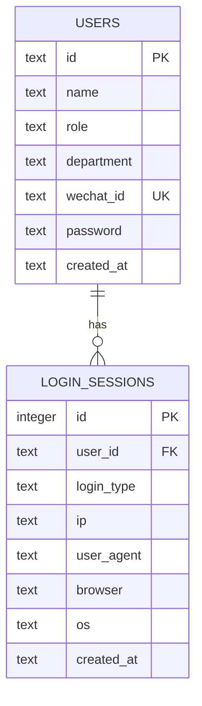
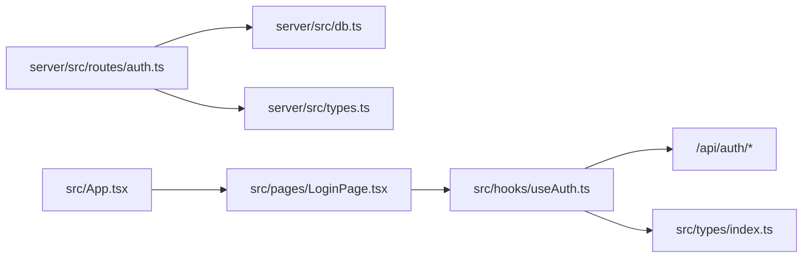

# 认证接口

<cite>
**本文引用的文件**
- [server/src/routes/auth.ts](file://server/src/routes/auth.ts)
- [server/src/db.ts](file://server/src/db.ts)
- [server/src/types.ts](file://server/src/types.ts)
- [server/src/index.ts](file://server/src/index.ts)
- [src/hooks/useAuth.ts](file://src/hooks/useAuth.ts)
- [src/lib/api.ts](file://src/lib/api.ts)
- [src/pages/LoginPage.tsx](file://src/pages/LoginPage.tsx)
- [src/types/index.ts](file://src/types/index.ts)
- [src/App.tsx](file://src/App.tsx)
</cite>

## 目录
1. [简介](#简介)
2. [项目结构](#项目结构)
3. [核心组件](#核心组件)
4. [架构总览](#架构总览)
5. [详细组件分析](#详细组件分析)
6. [依赖关系分析](#依赖关系分析)
7. [性能考量](#性能考量)
8. [故障排查指南](#故障排查指南)
9. [结论](#结论)
10. [附录](#附录)

## 简介
本文件为认证接口的完整 API 文档，覆盖用户登录、注册（自动创建）、退出等能力。重点说明 /api/auth/login 的多种登录方式：微信登录、密码登录、访客登录；并详细记录请求参数、响应格式与错误处理。同时解释客户端信息采集与会话记录机制，提供成功登录、账户不存在、密码错误等场景的请求/响应示例，并给出认证流程图与安全注意事项。

## 项目结构
后端采用 Express 路由模块化组织，认证路由位于 server/src/routes/auth.ts；数据库初始化与表结构定义在 server/src/db.ts；前端通过自定义 Hook useAuth.ts 统一管理登录状态与调用后端 API；页面 LoginPage.tsx 提供三种登录入口；类型定义位于 server/src/types.ts 与 src/types/index.ts。

图表来源
- [server/src/index.ts:1-31](file://server/src/index.ts#L1-L31)
- [server/src/routes/auth.ts:1-109](file://server/src/routes/auth.ts#L1-L109)
- [server/src/db.ts:1-126](file://server/src/db.ts#L1-L126)
- [src/hooks/useAuth.ts:1-89](file://src/hooks/useAuth.ts#L1-L89)
- [src/pages/LoginPage.tsx:1-250](file://src/pages/LoginPage.tsx#L1-L250)
- [src/types/index.ts:1-37](file://src/types/index.ts#L1-L37)
- [server/src/types.ts:1-46](file://server/src/types.ts#L1-L46)

章节来源
- [server/src/index.ts:1-31](file://server/src/index.ts#L1-L31)
- [server/src/routes/auth.ts:1-109](file://server/src/routes/auth.ts#L1-L109)
- [server/src/db.ts:1-126](file://server/src/db.ts#L1-L126)
- [src/hooks/useAuth.ts:1-89](file://src/hooks/useAuth.ts#L1-L89)
- [src/pages/LoginPage.tsx:1-250](file://src/pages/LoginPage.tsx#L1-L250)
- [src/types/index.ts:1-37](file://src/types/index.ts#L1-L37)
- [server/src/types.ts:1-46](file://server/src/types.ts#L1-L46)

## 核心组件
- 认证路由：提供 /api/auth/login 登录接口与 /api/auth/users 用户列表查询接口。
- 数据库层：users 表与 login_sessions 表，支持微信绑定、角色权限、会话记录。
- 前端 Hook：useAuth.ts 封装登录、登出、用户状态持久化与新账号提示。
- 登录页面：LoginPage.tsx 提供三种登录入口（访客、密码、企微）与错误提示。
- 类型系统：前后端类型对齐，确保请求/响应字段一致。

章节来源
- [server/src/routes/auth.ts:36-106](file://server/src/routes/auth.ts#L36-L106)
- [server/src/db.ts:12-75](file://server/src/db.ts#L12-L75)
- [src/hooks/useAuth.ts:20-89](file://src/hooks/useAuth.ts#L20-L89)
- [src/pages/LoginPage.tsx:22-250](file://src/pages/LoginPage.tsx#L22-L250)
- [server/src/types.ts:1-46](file://server/src/types.ts#L1-L46)
- [src/types/index.ts:29-36](file://src/types/index.ts#L29-L36)

## 架构总览
认证流程从浏览器发起登录请求到后端路由，根据登录类型执行不同逻辑：访客直接返回访客用户；企微登录检查是否已绑定，未绑定则自动创建普通用户；密码登录校验用户名/ID 与密码；最后统一记录会话信息。

图表来源
- [server/src/routes/auth.ts:36-106](file://server/src/routes/auth.ts#L36-L106)
- [server/src/db.ts:62-75](file://server/src/db.ts#L62-L75)
- [src/hooks/useAuth.ts:37-72](file://src/hooks/useAuth.ts#L37-L72)

## 详细组件分析

### 认证路由与登录接口
- 路由路径：/api/auth/login
- 方法：POST
- 请求体参数：
  - type: "wechat" | "password" | "guest"
  - userId: 字符串（兼容旧版）
  - username: 字符串（密码登录必填）
  - password: 字符串（密码登录必填）
  - wechatId: 字符串（微信登录必填）
- 响应：
  - 访客登录：返回访客用户对象（含 id、name、role、department）
  - 微信登录：
    - 已绑定：返回 user 对象
    - 未绑定：返回 user 对象、isNewAccount=true、defaultPassword
  - 密码登录：返回 user 对象
  - 兼容旧版：按 userId 查询用户并返回 user 对象
- 错误响应：
  - 400 参数无效：Invalid login parameters / wechatId is required / username and password are required
  - 404 用户不存在：User not found
  - 401 密码错误：Invalid password

图表来源
- [server/src/routes/auth.ts:36-106](file://server/src/routes/auth.ts#L36-L106)

章节来源
- [server/src/routes/auth.ts:36-106](file://server/src/routes/auth.ts#L36-L106)

### 客户端信息采集与会话记录
- 客户端信息采集：从请求头提取 IP 与 UA，并简单识别浏览器与操作系统。
- 会话记录：无论哪种登录方式，均在 login_sessions 表中插入一条记录，包含 user_id、login_type、ip、user_agent、browser、os。
- 表结构要点：
  - login_sessions(id, user_id, login_type, ip, user_agent, browser, os, created_at)
  - login_type 限定值：wechat、password、guest
  - 创建索引：idx_sessions_user、idx_sessions_time

图表来源
- [server/src/routes/auth.ts:7-29](file://server/src/routes/auth.ts#L7-L29)
- [server/src/db.ts:62-75](file://server/src/db.ts#L62-L75)
- [server/src/types.ts:36-45](file://server/src/types.ts#L36-L45)

章节来源
- [server/src/routes/auth.ts:7-29](file://server/src/routes/auth.ts#L7-L29)
- [server/src/db.ts:62-75](file://server/src/db.ts#L62-L75)
- [server/src/types.ts:36-45](file://server/src/types.ts#L36-L45)

### 前端登录流程与状态管理
- 登录入口：LoginPage.tsx 提供“访客访问”“账号密码”“企微登录”三个标签页。
- 登录实现：useAuth.ts 发起 POST /api/auth/login，处理错误与成功，将用户信息存入 localStorage。
- 用户列表：useAuth.ts 启动时拉取 /api/auth/users。
- 登出：移除 localStorage 中的用户信息与最近访问记录。

图表来源
- [src/pages/LoginPage.tsx:30-39](file://src/pages/LoginPage.tsx#L30-L39)
- [src/hooks/useAuth.ts:37-79](file://src/hooks/useAuth.ts#L37-L79)

章节来源
- [src/pages/LoginPage.tsx:22-250](file://src/pages/LoginPage.tsx#L22-L250)
- [src/hooks/useAuth.ts:20-89](file://src/hooks/useAuth.ts#L20-L89)

### 数据模型与类型约束
- 用户类型（前端）：包含 id、name、avatar、department、role、wechat_id。
- 用户类型（后端）：包含 id、name、role、department、wechat_id、password、created_at。
- 登录会话类型（后端）：包含 id、user_id、login_type、ip、user_agent、browser、os、created_at。
- 角色枚举：user、admin；登录类型枚举：wechat、password、guest。

图表来源
- [server/src/db.ts:14-22](file://server/src/db.ts#L14-L22)
- [server/src/db.ts:62-71](file://server/src/db.ts#L62-L71)
- [server/src/types.ts:1-9](file://server/src/types.ts#L1-L9)
- [server/src/types.ts:36-45](file://server/src/types.ts#L36-L45)
- [src/types/index.ts:29-36](file://src/types/index.ts#L29-L36)

章节来源
- [server/src/db.ts:14-22](file://server/src/db.ts#L14-L22)
- [server/src/db.ts:62-71](file://server/src/db.ts#L62-L71)
- [server/src/types.ts:1-9](file://server/src/types.ts#L1-L9)
- [server/src/types.ts:36-45](file://server/src/types.ts#L36-L45)
- [src/types/index.ts:29-36](file://src/types/index.ts#L29-L36)

## 依赖关系分析
- 路由依赖：/api/auth/* 由 auth.ts 提供；/api/auth/users 由同一路由提供。
- 数据库依赖：users 表与 login_sessions 表，外键约束与索引优化。
- 前端依赖：useAuth.ts 依赖 API 基础路径与 localStorage；LoginPage.tsx 依赖 useAuth.ts 的回调与状态。
- 类型依赖：前后端类型保持一致，避免运行时字段不匹配。

图表来源
- [server/src/routes/auth.ts:1-109](file://server/src/routes/auth.ts#L1-L109)
- [server/src/db.ts:1-126](file://server/src/db.ts#L1-L126)
- [src/hooks/useAuth.ts:1-89](file://src/hooks/useAuth.ts#L1-L89)
- [src/pages/LoginPage.tsx:1-250](file://src/pages/LoginPage.tsx#L1-L250)
- [src/types/index.ts:1-37](file://src/types/index.ts#L1-L37)
- [server/src/types.ts:1-46](file://server/src/types.ts#L1-L46)
- [src/App.tsx:1-63](file://src/App.tsx#L1-L63)

章节来源
- [server/src/routes/auth.ts:1-109](file://server/src/routes/auth.ts#L1-L109)
- [server/src/db.ts:1-126](file://server/src/db.ts#L1-L126)
- [src/hooks/useAuth.ts:1-89](file://src/hooks/useAuth.ts#L1-L89)
- [src/pages/LoginPage.tsx:1-250](file://src/pages/LoginPage.tsx#L1-L250)
- [src/types/index.ts:1-37](file://src/types/index.ts#L1-L37)
- [server/src/types.ts:1-46](file://server/src/types.ts#L1-L46)
- [src/App.tsx:1-63](file://src/App.tsx#L1-L63)

## 性能考量
- 数据库事务：种子数据插入使用事务批量写入，减少多次提交开销。
- 索引优化：users 表的 wechat_id 唯一索引与 login_sessions 的 user_id、时间索引，有助于快速查询与排序。
- 请求体大小限制：后端启用 express.json({ limit: "5mb" })，满足一般前端请求。
- 前端缓存：用户列表一次性拉取并缓存，避免重复请求。

章节来源
- [server/src/db.ts:78-123](file://server/src/db.ts#L78-L123)
- [server/src/db.ts:24](file://server/src/db.ts#L24)
- [server/src/db.ts:73](file://server/src/db.ts#L73)
- [server/src/index.ts:15](file://server/src/index.ts#L15)

## 故障排查指南
- 常见错误与原因
  - 400 参数缺失：缺少 type、wechatId、username 或 password。
  - 404 用户不存在：用户名/ID 不存在或 legacy userId 不存在。
  - 401 密码错误：password 与用户密码或用户ID不匹配。
- 建议排查步骤
  - 检查请求体字段是否正确传递。
  - 确认数据库中是否存在对应用户或 wechat_id。
  - 核对密码策略：若用户无密码则默认使用用户ID作为密码。
  - 查看 login_sessions 是否正常写入。
- 前端错误处理
  - useAuth.ts 将错误信息设置到 loginError 并返回 { success: false }。
  - LoginPage.tsx 展示错误消息并禁用登录按钮。

章节来源
- [server/src/routes/auth.ts:84-106](file://server/src/routes/auth.ts#L84-L106)
- [src/hooks/useAuth.ts:48-69](file://src/hooks/useAuth.ts#L48-L69)
- [src/pages/LoginPage.tsx:155-159](file://src/pages/LoginPage.tsx#L155-L159)

## 结论
该认证体系通过单一登录接口支持三种登录方式，结合会话记录与本地存储，实现了简洁而实用的身份验证流程。建议在生产环境中引入更完善的令牌机制与安全策略，以进一步提升安全性与可维护性。

## 附录

### API 定义与示例

- 路径：/api/auth/login
- 方法：POST
- 请求头：Content-Type: application/json
- 请求体参数
  - type: "wechat" | "password" | "guest"
  - userId: 字符串（兼容旧版）
  - username: 字符串（密码登录必填）
  - password: 字符串（密码登录必填）
  - wechatId: 字符串（微信登录必填）

- 成功响应
  - 访客登录
    - 返回字段：id、name、role、department
  - 微信登录（已绑定）
    - 返回字段：user.id、user.name、user.role、user.department、user.wechat_id
  - 微信登录（新账号）
    - 返回字段：user.id、user.name、user.role、user.department、user.wechat_id、isNewAccount=true、defaultPassword
  - 密码登录
    - 返回字段：user.id、user.name、user.role、user.department、user.wechat_id
  - 兼容旧版
    - 返回字段：user.id、user.name、user.role、user.department、user.wechat_id

- 错误响应
  - 400
    - 错误信息："wechatId is required" 或 "username and password are required" 或 "Invalid login parameters"
  - 404
    - 错误信息："User not found"
  - 401
    - 错误信息："Invalid password"

- 示例请求/响应
  - 访客登录
    - 请求体：{"type":"guest"}
    - 响应：{"id":"guest-...","name":"访客","role":"guest","department":"-"}
  - 微信登录（已绑定）
    - 请求体：{"type":"wechat","wechatId":"wx-zhangsan"}
    - 响应：{"user":{"id":"user-...","name":"张三","role":"user","department":"技术部","wechat_id":"wx-zhangsan"}}
  - 微信登录（新账号）
    - 请求体：{"type":"wechat","wechatId":"wx-newuser"}
    - 响应：{"user":{"id":"user-...","name":"企微用户...","role":"user","department":"待设置","wechat_id":"wx-newuser"},"isNewAccount":true,"defaultPassword":"user-..."}
  - 密码登录（成功）
    - 请求体：{"type":"password","username":"张三","password":"user-001"}
    - 响应：{"user":{"id":"user-001","name":"张三","role":"user","department":"技术部","wechat_id":"wx-zhangsan"}}
  - 密码登录（失败）
    - 请求体：{"type":"password","username":"张三","password":"wrong"}
    - 响应：{"error":"Invalid password"}

- 兼容旧版
  - 请求体：{"userId":"user-001"}
  - 响应：{"user":{"id":"user-001","name":"张三","role":"user","department":"技术部","wechat_id":"wx-zhangsan"}}

章节来源
- [server/src/routes/auth.ts:36-106](file://server/src/routes/auth.ts#L36-L106)

### 安全考虑
- 当前实现
  - 使用 localStorage 存储用户信息，适合单页应用但不具备强安全防护。
  - 会话记录仅保存客户端信息与登录类型，未包含令牌。
- 建议改进
  - 引入短期访问令牌与刷新令牌机制，配合 HttpOnly Cookie。
  - 对敏感操作增加二次确认或验证码。
  - 在生产环境启用 HTTPS 与安全响应头。
  - 对登录尝试进行速率限制与日志审计。