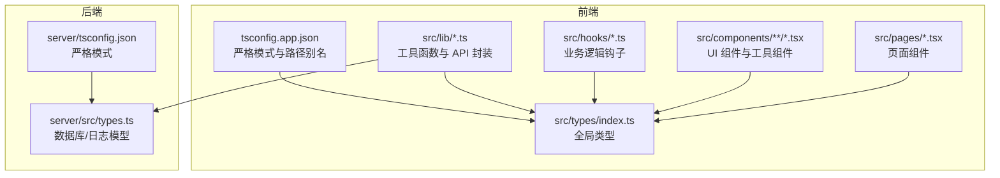
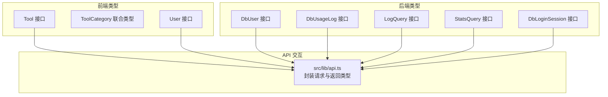
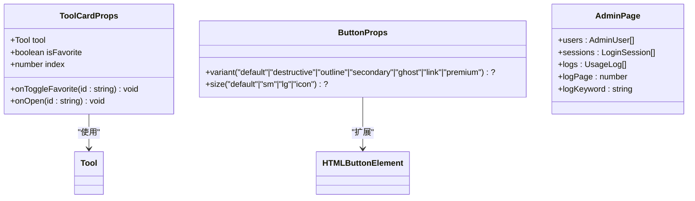
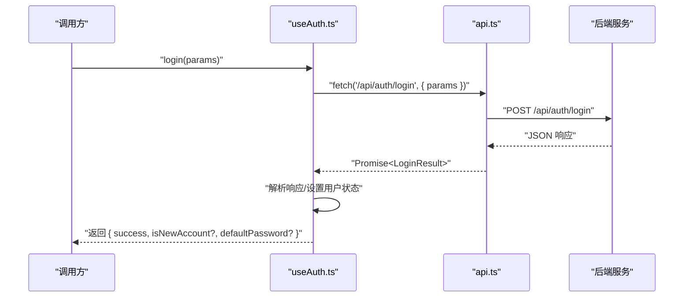
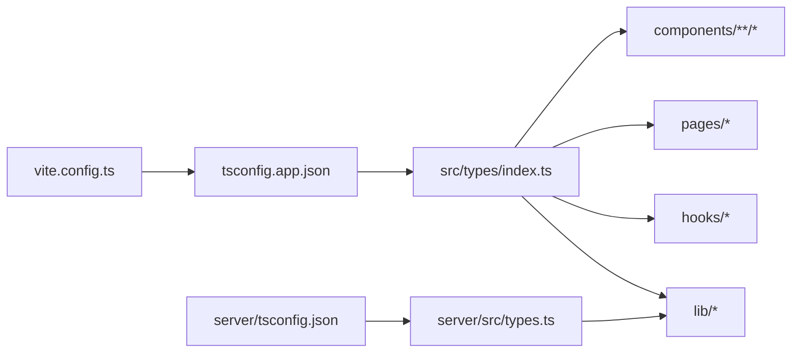

# TypeScript 集成

<cite>
**本文引用的文件**
- [src/types/index.ts](file://src/types/index.ts)
- [server/src/types.ts](file://server/src/types.ts)
- [tsconfig.json](file://tsconfig.json)
- [tsconfig.app.json](file://tsconfig.app.json)
- [server/tsconfig.json](file://server/tsconfig.json)
- [vite.config.ts](file://vite.config.ts)
- [src/vite-env.d.ts](file://src/vite-env.d.ts)
- [src/lib/api.ts](file://src/lib/api.ts)
- [src/hooks/useAuth.ts](file://src/hooks/useAuth.ts)
- [src/hooks/useFavorites.ts](file://src/hooks/useFavorites.ts)
- [src/components/tools/ToolCard.tsx](file://src/components/tools/ToolCard.tsx)
- [src/components/ui/button.tsx](file://src/components/ui/button.tsx)
- [src/pages/AdminPage.tsx](file://src/pages/AdminPage.tsx)
- [src/lib/utils.ts](file://src/lib/utils.ts)
- [src/tools/BarcodeGenerator.tsx](file://src/tools/BarcodeGenerator.tsx)
- [src/tools/HttpClient.tsx](file://src/tools/HttpClient.tsx)
</cite>

## 目录
1. [简介](#简介)
2. [项目结构](#项目结构)
3. [核心组件](#核心组件)
4. [架构总览](#架构总览)
5. [详细组件分析](#详细组件分析)
6. [依赖分析](#依赖分析)
7. [性能考虑](#性能考虑)
8. [故障排查指南](#故障排查指南)
9. [结论](#结论)
10. [附录](#附录)

## 简介
本文件系统性梳理 AnyTools 项目的 TypeScript 集成与类型体系设计，覆盖全局类型定义、工具类型、接口规范、类型安全实践（类型推断、类型断言、泛型）、组件 Props 类型与事件处理约束、API 响应数据类型与验证、第三方库类型声明与扩展方法，并提供最佳实践与可视化图示，帮助开发者在开发过程中充分发挥 TypeScript 的类型检查能力。

## 项目结构
项目采用前后端分离的多包结构，前端通过 Vite 构建，使用严格模式的 TypeScript 编译配置；后端为独立 Node 服务，同样启用严格模式。类型定义分布在前端全局类型与后端数据库/日志模型两类文件中，配合路径别名与编译器选项，形成清晰的类型边界。



图表来源
- [tsconfig.app.json:1-26](file://tsconfig.app.json#L1-L26)
- [server/tsconfig.json:1-14](file://server/tsconfig.json#L1-L14)
- [src/types/index.ts:1-37](file://src/types/index.ts#L1-L37)
- [server/src/types.ts:1-46](file://server/src/types.ts#L1-L46)

章节来源
- [tsconfig.json:1-7](file://tsconfig.json#L1-L7)
- [tsconfig.app.json:1-26](file://tsconfig.app.json#L1-L26)
- [server/tsconfig.json:1-14](file://server/tsconfig.json#L1-L14)
- [vite.config.ts:1-21](file://vite.config.ts#L1-L21)
- [src/vite-env.d.ts:1-2](file://src/vite-env.d.ts#L1-L2)

## 核心组件
- 全局类型定义：统一的工具、分类、用户等接口，确保跨模块一致的数据契约。
- 工具类型与类型守卫：通过字面量联合类型、可选属性、只读约束等提升类型安全性。
- 严格编译配置：开启严格模式与未使用检查，减少隐式 any 与潜在运行时错误。
- 路径别名与模块解析：通过 tsconfig 与 Vite alias 提升导入可读性与维护性。
- 第三方库类型声明：通过 Vite 环境声明与工具函数类型约束，保证外部集成的类型安全。

章节来源
- [src/types/index.ts:1-37](file://src/types/index.ts#L1-L37)
- [tsconfig.app.json:14-22](file://tsconfig.app.json#L14-L22)
- [vite.config.ts:7-11](file://vite.config.ts#L7-L11)
- [src/vite-env.d.ts:1-2](file://src/vite-env.d.ts#L1-L2)

## 架构总览
前端与后端类型边界清晰：前端负责 UI 与业务逻辑类型，后端负责数据库与日志模型类型；两者通过 API 接口进行交互，类型在调用点处被显式约束，避免隐式 any 与不匹配。



图表来源
- [src/types/index.ts:3-36](file://src/types/index.ts#L3-L36)
- [server/src/types.ts:1-46](file://server/src/types.ts#L1-L46)
- [src/lib/api.ts:1-36](file://src/lib/api.ts#L1-L36)

## 详细组件分析

### 全局类型与工具类型
- 工具类型：使用字面量联合类型限定分类与登录类型，避免字符串拼写错误与非法值进入运行时。
- 用户类型：对可空字段使用可选属性与 null 联合，明确空值场景。
- 分类信息：将分类枚举与图标绑定，便于 UI 层复用。

```mermaid
classDiagram
class Tool {
+string id
+string name
+string description
+LucideIcon icon
+ToolCategory category
+string[] tags
+string path
+boolean isNew?
+boolean isHot?
}
class ToolCategory {
<<union>>
"development"|"conversion"|"text"|"image"|"security"|"network"
}
class CategoryInfo {
+ToolCategory id
+string name
+LucideIcon icon
}
class User {
+string id
+string name
+string avatar?
+string department?
+("admin"|"user"|"guest") role?
+string wechat_id?|null
}
Tool --> ToolCategory : "使用"
CategoryInfo --> ToolCategory : "映射"
```

图表来源
- [src/types/index.ts:3-36](file://src/types/index.ts#L3-L36)

章节来源
- [src/types/index.ts:1-37](file://src/types/index.ts#L1-L37)

### 后端类型模型
- 数据库用户、使用日志、登录会话等模型，字段命名与可空性与数据库保持一致，便于 ORM 映射与接口一致性。
- 查询参数模型：分页与过滤参数以接口形式约束，避免字符串拼接错误。

```mermaid
erDiagram
DB_USER {
string id PK
string name
("user"|"admin") role
string department
string wechat_id
string password
string created_at
}
DB_USAGE_LOG {
number id PK
string user_id FK
string tool_id FK
string tool_name
string action
string details
string created_at
}
LOG_QUERY {
string user_id?
string tool_id?
string keyword?
string start_date?
string end_date?
number page
number page_size
}
STATS_QUERY {
string user_id?
("day"|"week"|"month") period
}
DB_LOGIN_SESSION {
number id PK
string user_id FK
("wechat"|"password"|"guest") login_type
string ip
string user_agent
string browser
string os
string created_at
}
```

图表来源
- [server/src/types.ts:1-46](file://server/src/types.ts#L1-L46)

章节来源
- [server/src/types.ts:1-46](file://server/src/types.ts#L1-L46)

### 类型安全实践：推断、断言与泛型
- 类型推断：在 hooks 中利用泛型函数加载本地存储，自动推导返回类型，避免重复声明。
- 类型断言：在 UI 与工具组件中，对第三方库返回值进行断言，确保后续操作的安全性。
- 泛型使用：在工具函数中使用泛型约束输入，提升复用性与类型安全性。

章节来源
- [src/hooks/useFavorites.ts:7-14](file://src/hooks/useFavorites.ts#L7-L14)
- [src/lib/utils.ts:4-6](file://src/lib/utils.ts#L4-L6)

### 组件 Props 类型与事件处理约束
- 工具卡片组件：明确 Props 结构，包括工具对象、收藏状态、回调函数签名与索引，确保调用方与渲染逻辑一致。
- UI 按钮组件：通过变体与尺寸的联合类型约束，结合 DOM 属性扩展，保证样式与行为的一致性。
- 页面组件：管理后台页面对用户、会话、日志等数据结构进行强类型约束，分页与查询参数以接口定义。



图表来源
- [src/components/tools/ToolCard.tsx:6-12](file://src/components/tools/ToolCard.tsx#L6-L12)
- [src/components/ui/button.tsx:32-34](file://src/components/ui/button.tsx#L32-L34)
- [src/pages/AdminPage.tsx:22-51](file://src/pages/AdminPage.tsx#L22-L51)

章节来源
- [src/components/tools/ToolCard.tsx:1-66](file://src/components/tools/ToolCard.tsx#L1-L66)
- [src/components/ui/button.tsx:1-50](file://src/components/ui/button.tsx#L1-L50)
- [src/pages/AdminPage.tsx:1-353](file://src/pages/AdminPage.tsx#L1-L353)

### API 响应数据类型与验证
- 前端 API 封装：对登录、用户列表、使用日志等接口进行统一封装，返回值以 Promise 包裹，错误通过异常抛出，调用方需处理错误分支。
- 登录流程：登录参数与结果以接口约束，兼容不同响应格式，确保后续处理逻辑稳定。
- 使用日志：调用日志接口时，参数与可选字段明确，便于审计与统计。



图表来源
- [src/hooks/useAuth.ts:37-72](file://src/hooks/useAuth.ts#L37-L72)
- [src/lib/api.ts:27-35](file://src/lib/api.ts#L27-L35)

章节来源
- [src/lib/api.ts:1-36](file://src/lib/api.ts#L1-L36)
- [src/hooks/useAuth.ts:1-89](file://src/hooks/useAuth.ts#L1-L89)

### 类型扩展与第三方库类型声明
- Vite 环境声明：通过环境声明文件引入 Vite 客户端类型，避免模块解析报错。
- 工具函数类型：对 class 变量合并与条件合并函数进行类型约束，确保传入参数符合预期。
- 路径别名：通过 tsconfig 与 Vite alias，统一模块导入路径，提升可读性与可维护性。

章节来源
- [src/vite-env.d.ts:1-2](file://src/vite-env.d.ts#L1-L2)
- [src/lib/utils.ts:4-6](file://src/lib/utils.ts#L4-L6)
- [tsconfig.app.json:20-22](file://tsconfig.app.json#L20-L22)
- [vite.config.ts:7-11](file://vite.config.ts#L7-L11)

### 实际类型定义示例与最佳实践
- 工具卡片 Props：明确回调函数签名与渲染参数，避免误用。
- UI 按钮 Props：通过变体与尺寸联合类型约束，结合 DOM 扩展，保证样式与行为一致。
- 登录参数与结果：以接口约束登录流程输入输出，兼容不同响应结构。
- 使用日志与收藏：在工具组件中对日志调用与收藏切换进行类型化封装，减少运行时风险。

章节来源
- [src/components/tools/ToolCard.tsx:6-12](file://src/components/tools/ToolCard.tsx#L6-L12)
- [src/components/ui/button.tsx:32-34](file://src/components/ui/button.tsx#L32-L34)
- [src/hooks/useAuth.ts:6-18](file://src/hooks/useAuth.ts#L6-L18)
- [src/lib/api.ts:3-19](file://src/lib/api.ts#L3-L19)

## 依赖分析
- 前端类型依赖：组件、页面、hooks、lib 均依赖全局类型定义，形成统一的数据契约。
- 后端类型依赖：API 封装与页面组件依赖后端类型模型，确保请求/响应一致性。
- 编译配置依赖：严格模式与路径别名配置影响类型检查与模块解析。



图表来源
- [src/types/index.ts:1-37](file://src/types/index.ts#L1-L37)
- [server/src/types.ts:1-46](file://server/src/types.ts#L1-L46)
- [tsconfig.app.json:1-26](file://tsconfig.app.json#L1-L26)
- [server/tsconfig.json:1-14](file://server/tsconfig.json#L1-L14)
- [vite.config.ts:1-21](file://vite.config.ts#L1-L21)

章节来源
- [src/types/index.ts:1-37](file://src/types/index.ts#L1-L37)
- [server/src/types.ts:1-46](file://server/src/types.ts#L1-L46)
- [tsconfig.app.json:1-26](file://tsconfig.app.json#L1-L26)
- [server/tsconfig.json:1-14](file://server/tsconfig.json#L1-L14)
- [vite.config.ts:1-21](file://vite.config.ts#L1-L21)

## 性能考虑
- 严格模式与未使用检查：减少冗余代码与隐式 any，降低运行时开销与调试成本。
- 路径别名与模块解析：提升构建与热更新效率，减少模块解析时间。
- 组件 Props 精细化：避免过度渲染与无效计算，提高交互流畅度。

## 故障排查指南
- 类型错误：检查接口字段是否与后端返回一致，确认可选字段与 null 值处理。
- 模块解析失败：确认 tsconfig 与 Vite alias 配置一致，避免路径冲突。
- API 返回异常：在调用方捕获异常并统一处理，避免未处理的 Promise 拒绝导致崩溃。
- 登录流程异常：核对登录参数与结果接口，确保兼容不同响应格式。

章节来源
- [src/hooks/useAuth.ts:48-69](file://src/hooks/useAuth.ts#L48-L69)
- [src/lib/api.ts:23-35](file://src/lib/api.ts#L23-L35)

## 结论
本项目通过严格的 TypeScript 配置、清晰的全局类型与后端模型、完善的组件 Props 与事件处理约束、以及 API 响应的类型化封装，构建了高可靠性的类型体系。建议在后续迭代中持续完善类型注释、补充缺失的类型定义，并在团队内推广类型安全的最佳实践，进一步提升代码质量与可维护性。

## 附录
- 最佳实践清单
  - 在新增组件或页面时，优先定义 Props 与状态接口，再实现逻辑。
  - 对外部 API 返回值进行统一的类型包装与校验。
  - 使用严格模式与未使用检查，及时发现潜在问题。
  - 通过路径别名与模块拆分，保持类型定义的集中与可维护性。
  - 对第三方库进行类型声明与约束，确保集成稳定性。