# 前端开发

<cite>
**本文引用的文件**
- [src/App.tsx](file://src/App.tsx)
- [src/main.tsx](file://src/main.tsx)
- [package.json](file://package.json)
- [vite.config.ts](file://vite.config.ts)
- [tailwind.config.ts](file://tailwind.config.ts)
- [src/hooks/useAuth.ts](file://src/hooks/useAuth.ts)
- [src/hooks/useFavorites.ts](file://src/hooks/useFavorites.ts)
- [src/hooks/useTheme.ts](file://src/hooks/useTheme.ts)
- [src/components/layout/Layout.tsx](file://src/components/layout/Layout.tsx)
- [src/components/ui/button.tsx](file://src/components/ui/button.tsx)
- [src/pages/HomePage.tsx](file://src/pages/HomePage.tsx)
- [src/pages/DashboardPage.tsx](file://src/pages/DashboardPage.tsx)
- [src/tools/BarcodeGenerator.tsx](file://src/tools/BarcodeGenerator.tsx)
- [src/types/index.ts](file://src/types/index.ts)
- [src/lib/utils.ts](file://src/lib/utils.ts)
</cite>

## 目录
1. [引言](#引言)
2. [项目结构](#项目结构)
3. [核心组件](#核心组件)
4. [架构总览](#架构总览)
5. [详细组件分析](#详细组件分析)
6. [依赖关系分析](#依赖关系分析)
7. [性能考虑](#性能考虑)
8. [故障排查指南](#故障排查指南)
9. [结论](#结论)
10. [附录](#附录)

## 引言
本文件为该 React 前端项目的综合开发指南，覆盖组件架构设计、自定义 Hook 设计与使用、路由系统与页面导航、TypeScript 类型体系、样式系统与主题定制、以及性能优化与最佳实践。目标是帮助开发者快速理解并高效扩展该工具门户前端。

## 项目结构
项目采用按功能域分层的组织方式：页面层、组件层（布局/通用 UI/工具）、数据与类型、自定义 Hook、工具函数与样式配置。入口通过 Vite 启动，使用 React Router v7 进行路由控制，并以 Tailwind CSS 作为样式基础，结合类名合并与变体系统实现一致且可维护的 UI。

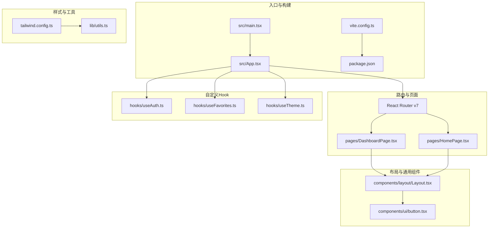

图表来源
- [src/main.tsx:1-14](file://src/main.tsx#L1-L14)
- [src/App.tsx:1-63](file://src/App.tsx#L1-L63)
- [vite.config.ts:1-21](file://vite.config.ts#L1-L21)
- [tailwind.config.ts:1-86](file://tailwind.config.ts#L1-L86)
- [src/components/layout/Layout.tsx:1-70](file://src/components/layout/Layout.tsx#L1-L70)
- [src/components/ui/button.tsx:1-50](file://src/components/ui/button.tsx#L1-L50)
- [src/hooks/useAuth.ts:1-89](file://src/hooks/useAuth.ts#L1-L89)
- [src/hooks/useFavorites.ts:1-71](file://src/hooks/useFavorites.ts#L1-L71)
- [src/hooks/useTheme.ts:1-32](file://src/hooks/useTheme.ts#L1-L32)
- [src/lib/utils.ts:1-7](file://src/lib/utils.ts#L1-L7)

章节来源
- [src/main.tsx:1-14](file://src/main.tsx#L1-L14)
- [src/App.tsx:1-63](file://src/App.tsx#L1-L63)
- [vite.config.ts:1-21](file://vite.config.ts#L1-L21)
- [tailwind.config.ts:1-86](file://tailwind.config.ts#L1-L86)

## 核心组件
- 路由与应用根：应用在根节点包裹浏览器路由容器，集中声明多页面路由与全局状态注入。
- 页面组件：首页与仪表盘页分别承担引导与工具浏览功能；仪表盘页通过布局组件提供统一的侧边栏、头部与内容区。
- 布局组件：提供主题切换、用户信息、搜索与分类筛选的上下文，向子组件传递渲染插槽。
- 通用 UI 组件：按钮组件采用变体系统，支持多种尺寸与风格，便于一致化使用。
- 自定义 Hook：认证状态、收藏与最近访问记录、主题切换，均封装为可复用的 Hook，降低页面耦合度。
- 工具组件：具体工具页面以函数组件形式呈现，内部组合通用 UI 与业务逻辑，支持日志上报与导出。

章节来源
- [src/App.tsx:1-63](file://src/App.tsx#L1-L63)
- [src/pages/HomePage.tsx:1-212](file://src/pages/HomePage.tsx#L1-L212)
- [src/pages/DashboardPage.tsx:1-50](file://src/pages/DashboardPage.tsx#L1-L50)
- [src/components/layout/Layout.tsx:1-70](file://src/components/layout/Layout.tsx#L1-L70)
- [src/components/ui/button.tsx:1-50](file://src/components/ui/button.tsx#L1-L50)
- [src/hooks/useAuth.ts:1-89](file://src/hooks/useAuth.ts#L1-L89)
- [src/hooks/useFavorites.ts:1-71](file://src/hooks/useFavorites.ts#L1-L71)
- [src/hooks/useTheme.ts:1-32](file://src/hooks/useTheme.ts#L1-L32)

## 架构总览
应用采用“页面-布局-通用组件-工具组件”的层次化结构，配合自定义 Hook 提供横切能力（认证、收藏、主题）。路由负责页面级导航，布局组件承载交互与筛选上下文，工具组件聚焦具体功能。

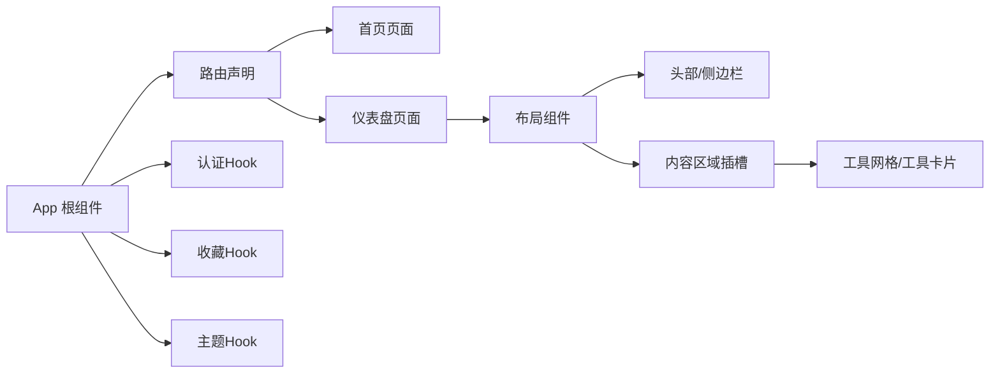

图表来源
- [src/App.tsx:1-63](file://src/App.tsx#L1-L63)
- [src/pages/DashboardPage.tsx:1-50](file://src/pages/DashboardPage.tsx#L1-L50)
- [src/components/layout/Layout.tsx:1-70](file://src/components/layout/Layout.tsx#L1-L70)
- [src/hooks/useAuth.ts:1-89](file://src/hooks/useAuth.ts#L1-L89)
- [src/hooks/useFavorites.ts:1-71](file://src/hooks/useFavorites.ts#L1-L71)
- [src/hooks/useTheme.ts:1-32](file://src/hooks/useTheme.ts#L1-L32)

## 详细组件分析

### 路由系统与页面导航
- 入口：根组件包裹路由容器，确保所有页面共享路由上下文。
- 根组件：集中声明多条路由，包含首页、仪表盘、工具详情、版本日志、管理页，并对未匹配路径进行回退跳转。
- 登录态控制：在根组件内读取认证状态，未登录或新账号提示时渲染登录页；登录成功后进入受保护路由。
- 仪表盘与工具页：仪表盘页通过布局组件提供筛选与收藏上下文；工具详情页通过动态路由参数加载对应工具。

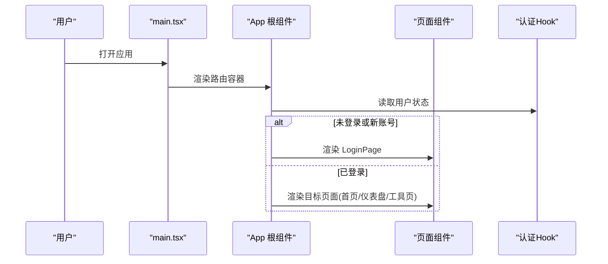

图表来源
- [src/main.tsx:1-14](file://src/main.tsx#L1-L14)
- [src/App.tsx:1-63](file://src/App.tsx#L1-L63)
- [src/hooks/useAuth.ts:1-89](file://src/hooks/useAuth.ts#L1-L89)

章节来源
- [src/main.tsx:1-14](file://src/main.tsx#L1-L14)
- [src/App.tsx:1-63](file://src/App.tsx#L1-L63)

### 认证状态管理（useAuth）
- 数据源：本地存储与服务端 API 双通道。初始化从本地恢复用户信息；拉取可用用户列表。
- 登录流程：支持微信、密码、访客三种方式；根据响应格式兼容处理；新账号场景返回默认密码并提示。
- 登出与清理：清除用户与最近访问记录，保持干净状态。
- 权限判断：基于角色字段判断管理员权限。

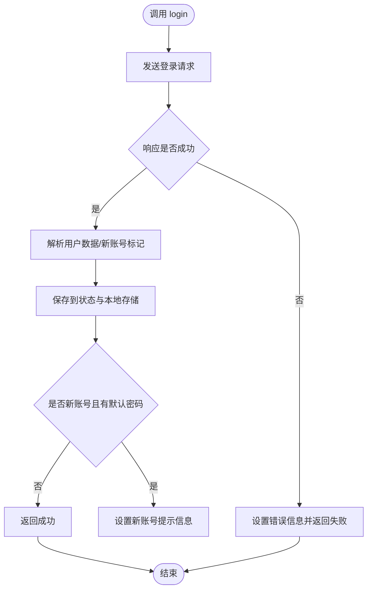

图表来源
- [src/hooks/useAuth.ts:37-72](file://src/hooks/useAuth.ts#L37-L72)

章节来源
- [src/hooks/useAuth.ts:1-89](file://src/hooks/useAuth.ts#L1-L89)

### 收藏与最近访问（useFavorites）
- 数据源：根据用户 ID 拉取收藏列表；本地存储最近访问列表，限制长度。
- 行为：切换收藏（增删）同步至服务端；添加最近访问时去重并截断至最大长度。
- 查询：提供判断是否收藏的便捷方法。

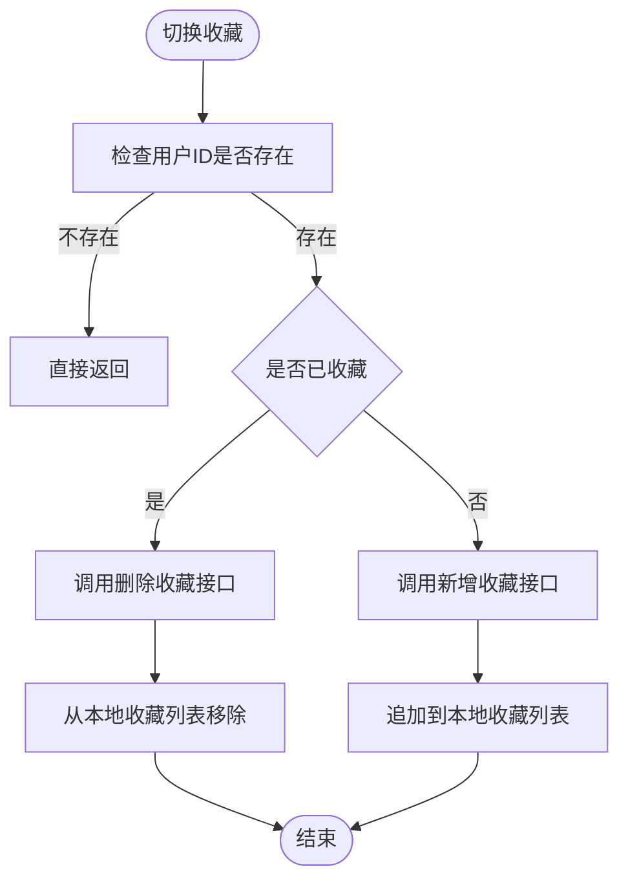

图表来源
- [src/hooks/useFavorites.ts:34-53](file://src/hooks/useFavorites.ts#L34-L53)

章节来源
- [src/hooks/useFavorites.ts:1-71](file://src/hooks/useFavorites.ts#L1-L71)

### 主题切换（useTheme）
- 初始化：优先读取本地存储，否则依据系统偏好自动选择明/暗主题。
- 切换：更新根元素类名并持久化，确保样式即时生效。
- 导出：提供切换与直接设置两种方式。

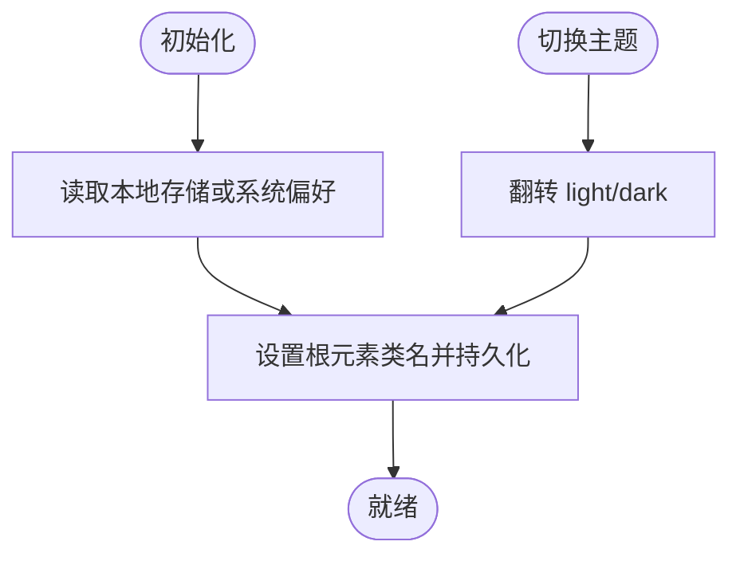

图表来源
- [src/hooks/useTheme.ts:5-31](file://src/hooks/useTheme.ts#L5-L31)

章节来源
- [src/hooks/useTheme.ts:1-32](file://src/hooks/useTheme.ts#L1-L32)

### 布局组件（Layout）
- 职责：统一头部、侧边栏、主内容区与页脚；暴露渲染插槽，向下传递筛选条件与用户信息。
- 交互：控制侧边栏开关、分类筛选、搜索查询；统计收藏与最近数量用于徽标展示。

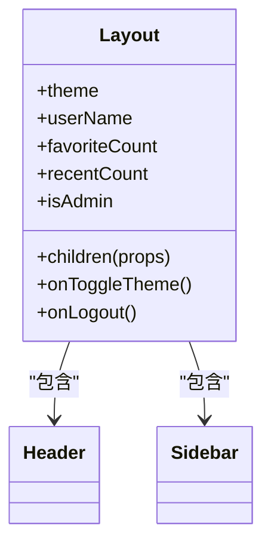

图表来源
- [src/components/layout/Layout.tsx:1-70](file://src/components/layout/Layout.tsx#L1-L70)

章节来源
- [src/components/layout/Layout.tsx:1-70](file://src/components/layout/Layout.tsx#L1-L70)

### 通用 UI 组件（Button）
- 设计：基于变体系统，支持多种风格与尺寸；通过工具函数合并类名，保证样式一致性。
- 使用：在工具组件中广泛使用，统一按钮风格与交互反馈。

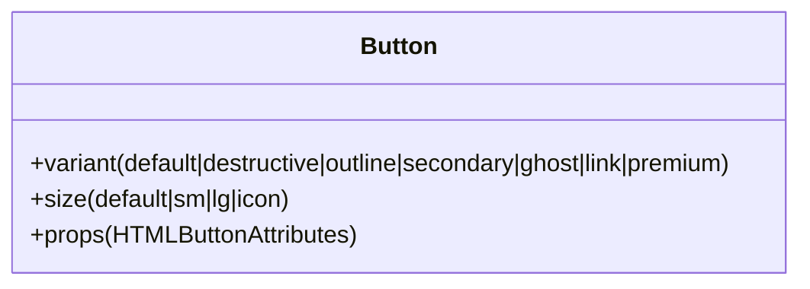

图表来源
- [src/components/ui/button.tsx:1-50](file://src/components/ui/button.tsx#L1-L50)

章节来源
- [src/components/ui/button.tsx:1-50](file://src/components/ui/button.tsx#L1-L50)

### 页面组件（首页与仪表盘）
- 首页：展示欢迎语、装饰图形、快捷入口与世界时钟；快捷入口以卡片形式展示工具类别与数量。
- 仪表盘：在布局组件内渲染工具网格，支持分类筛选与搜索；集成收藏与最近访问能力。

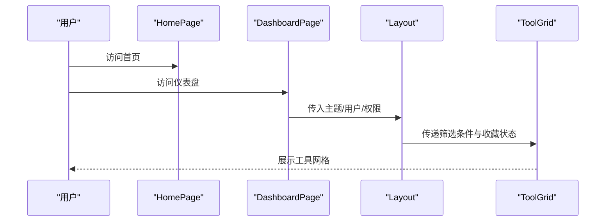

图表来源
- [src/pages/HomePage.tsx:1-212](file://src/pages/HomePage.tsx#L1-L212)
- [src/pages/DashboardPage.tsx:1-50](file://src/pages/DashboardPage.tsx#L1-L50)
- [src/components/layout/Layout.tsx:1-70](file://src/components/layout/Layout.tsx#L1-L70)

章节来源
- [src/pages/HomePage.tsx:1-212](file://src/pages/HomePage.tsx#L1-L212)
- [src/pages/DashboardPage.tsx:1-50](file://src/pages/DashboardPage.tsx#L1-L50)

### 工具组件（以条形码生成器为例）
- 功能：接收用户与工具元数据，执行生成与下载操作；支持带标题的图片导出。
- 集成：组合通用输入与按钮组件，调用外部 API 生成条形码；记录使用日志。

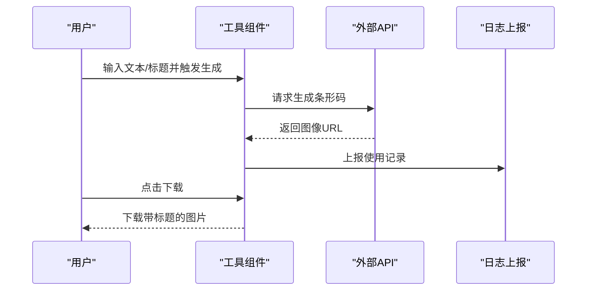

图表来源
- [src/tools/BarcodeGenerator.tsx:49-99](file://src/tools/BarcodeGenerator.tsx#L49-L99)

章节来源
- [src/tools/BarcodeGenerator.tsx:1-100](file://src/tools/BarcodeGenerator.tsx#L1-L100)

## 依赖关系分析
- 构建与运行：Vite 提供开发服务器与代理，别名指向 src 目录；依赖 React、React Router、Tailwind CSS 及其相关插件。
- 样式系统：Tailwind 配置启用暗色模式、内容扫描范围、主题变量扩展与动画插件；工具函数负责类名合并。
- 路由与页面：React Router v7 管理页面级导航；根组件集中处理登录态与页面跳转。
- 自定义 Hook：认证、收藏、主题三者独立，避免相互耦合，便于复用与测试。

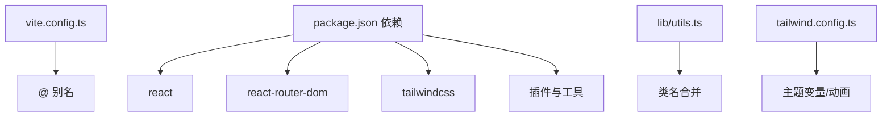

图表来源
- [vite.config.ts:1-21](file://vite.config.ts#L1-L21)
- [package.json:1-34](file://package.json#L1-L34)
- [src/lib/utils.ts:1-7](file://src/lib/utils.ts#L1-L7)
- [tailwind.config.ts:1-86](file://tailwind.config.ts#L1-L86)

章节来源
- [vite.config.ts:1-21](file://vite.config.ts#L1-L21)
- [package.json:1-34](file://package.json#L1-L34)
- [src/lib/utils.ts:1-7](file://src/lib/utils.ts#L1-L7)
- [tailwind.config.ts:1-86](file://tailwind.config.ts#L1-L86)

## 性能考虑
- 代码分割与懒加载：建议将大型工具组件按需加载，减少首屏体积；可通过路由级懒加载或组件级动态导入实现。
- 图像与外部资源：对外部 API 的调用应增加超时与重试策略，避免阻塞主线程。
- 本地存储与缓存：合理利用本地存储减少重复请求；注意存储大小与序列化开销。
- 样式与主题：Tailwind 仅打包实际使用的类名，建议保持类名简洁与复用，避免无用样式膨胀。
- 事件与渲染：在高频交互组件中，使用防抖/节流与 useMemo/useCallback 降低重渲染。

## 故障排查指南
- 登录失败：检查网络代理与后端接口连通性；确认错误信息是否来自服务端；查看认证 Hook 中的错误分支。
- 收藏异常：确认用户 ID 是否存在；核对服务端收藏接口的增删逻辑；检查本地存储读写。
- 主题不生效：确认根元素类名是否正确切换；检查本地存储键值；验证 Tailwind 暗色模式配置。
- 路由跳转异常：检查路由声明与回退规则；确认登录态变化是否导致页面重渲染。

章节来源
- [src/hooks/useAuth.ts:37-72](file://src/hooks/useAuth.ts#L37-L72)
- [src/hooks/useFavorites.ts:23-32](file://src/hooks/useFavorites.ts#L23-L32)
- [src/hooks/useTheme.ts:15-20](file://src/hooks/useTheme.ts#L15-L20)
- [src/App.tsx:17-19](file://src/App.tsx#L17-L19)

## 结论
该项目采用清晰的分层架构与自定义 Hook，实现了认证、收藏、主题等横切能力的模块化；路由系统与页面导航简洁明确；样式系统基于 Tailwind CSS 并通过工具函数实现一致的类名管理。建议后续引入按需加载与性能监控，持续优化用户体验与开发效率。

## 附录
- TypeScript 类型体系：工具与用户接口定义清晰，便于在组件间传递数据与约束行为。
- 样式与主题定制：通过 Tailwind 主题变量与暗色模式配置，实现灵活的主题切换与视觉一致性。

章节来源
- [src/types/index.ts:1-37](file://src/types/index.ts#L1-L37)
- [tailwind.config.ts:19-80](file://tailwind.config.ts#L19-L80)