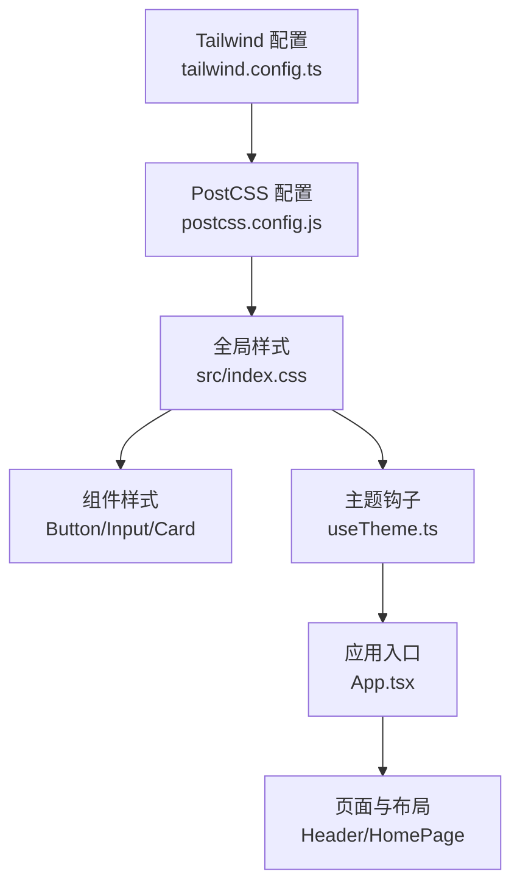
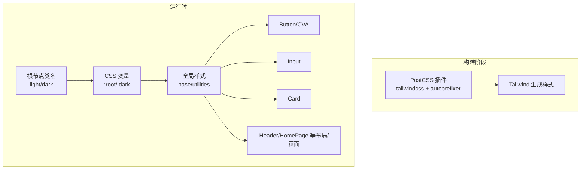
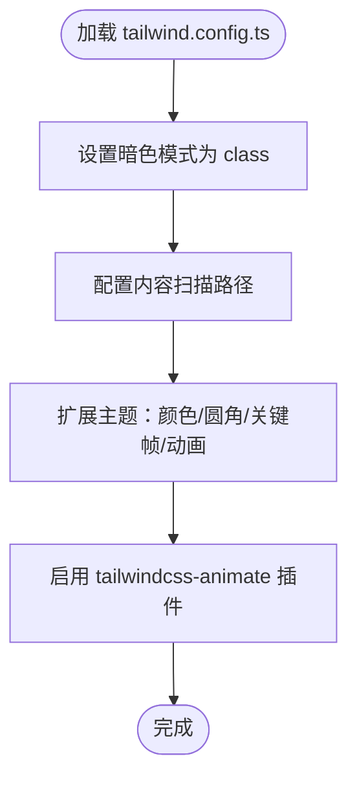
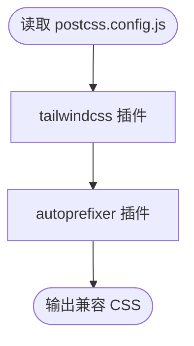
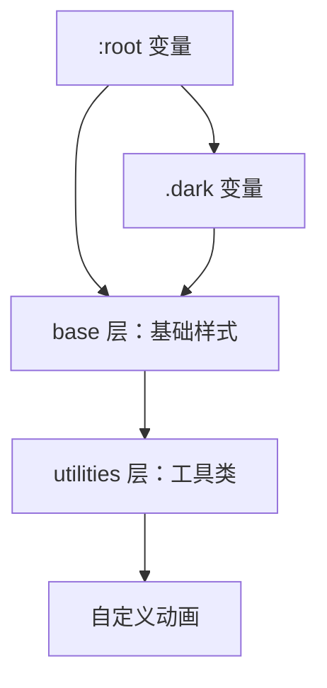
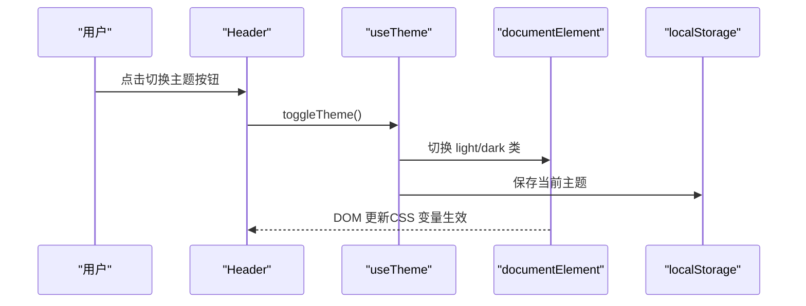
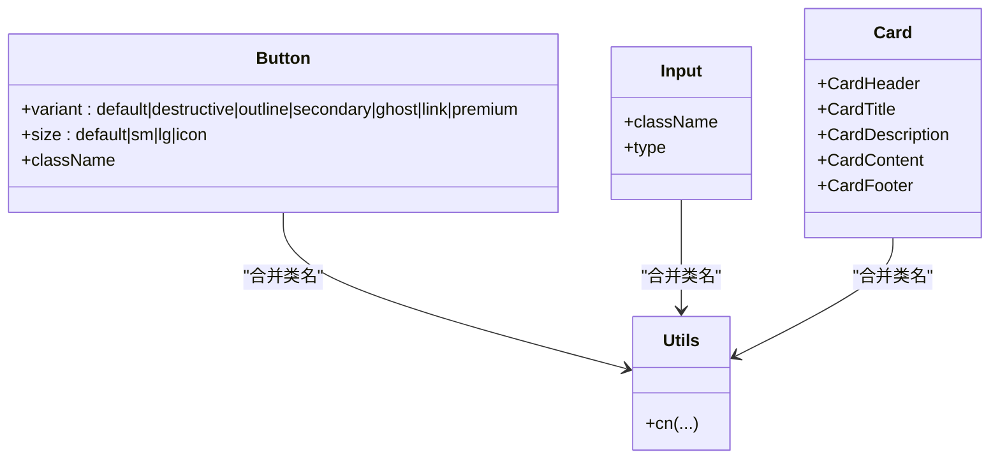
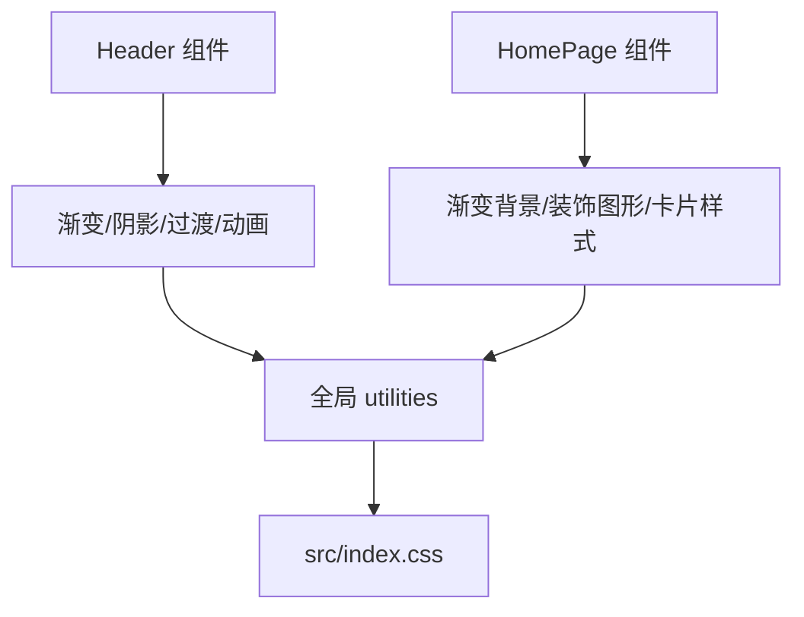
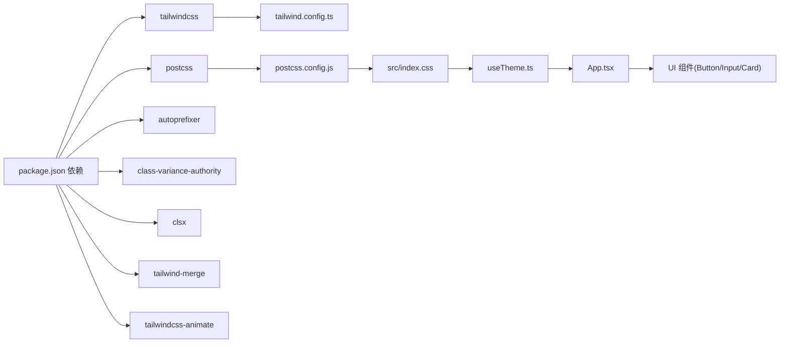

# 样式系统

<cite>
**本文引用的文件**
- [tailwind.config.ts](file://tailwind.config.ts)
- [postcss.config.js](file://postcss.config.js)
- [src/index.css](file://src/index.css)
- [src/hooks/useTheme.ts](file://src/hooks/useTheme.ts)
- [src/components/ui/button.tsx](file://src/components/ui/button.tsx)
- [src/components/ui/card.tsx](file://src/components/ui/card.tsx)
- [src/components/ui/input.tsx](file://src/components/ui/input.tsx)
- [src/components/layout/Header.tsx](file://src/components/layout/Header.tsx)
- [src/App.tsx](file://src/App.tsx)
- [package.json](file://package.json)
- [src/lib/utils.ts](file://src/lib/utils.ts)
- [src/pages/HomePage.tsx](file://src/pages/HomePage.tsx)
</cite>

## 目录
1. [简介](#简介)
2. [项目结构](#项目结构)
3. [核心组件](#核心组件)
4. [架构总览](#架构总览)
5. [详细组件分析](#详细组件分析)
6. [依赖关系分析](#依赖关系分析)
7. [性能考量](#性能考量)
8. [故障排查指南](#故障排查指南)
9. [结论](#结论)
10. [附录](#附录)

## 简介
本文件系统性梳理本项目的样式体系，涵盖 Tailwind CSS 配置与使用（含自定义主题、颜色系统、响应式设计）、PostCSS 配置与插件、组件样式组织（原子化样式、组件样式、全局样式）的最佳实践，以及深色/浅色模式的实现机制与覆盖方法。文档同时提供设计系统规范与一致性视觉建议，并通过图示展示关键流程与依赖关系，帮助开发者快速理解并维护样式架构。

## 项目结构
样式系统由以下关键部分组成：
- Tailwind 配置：定义容器、颜色、圆角、动画、内容扫描路径与插件
- PostCSS 配置：启用 Tailwind 与 Autoprefixer
- 全局样式：以 CSS 变量驱动的主题系统，分层组织基础、组件与工具类
- 组件样式：基于原子化与变体（CVA）的按钮、输入框、卡片等 UI 组件
- 主题钩子：提供主题状态管理与持久化
- 页面与布局：首页等页面通过 Tailwind 类与全局工具类构建一致视觉

图表来源
- [tailwind.config.ts:1-86](file://tailwind.config.ts#L1-L86)
- [postcss.config.js:1-7](file://postcss.config.js#L1-L7)
- [src/index.css:1-240](file://src/index.css#L1-L240)
- [src/hooks/useTheme.ts:1-32](file://src/hooks/useTheme.ts#L1-L32)
- [src/App.tsx:1-63](file://src/App.tsx#L1-L63)

章节来源
- [tailwind.config.ts:1-86](file://tailwind.config.ts#L1-L86)
- [postcss.config.js:1-7](file://postcss.config.js#L1-L7)
- [src/index.css:1-240](file://src/index.css#L1-L240)
- [src/hooks/useTheme.ts:1-32](file://src/hooks/useTheme.ts#L1-L32)
- [src/App.tsx:1-63](file://src/App.tsx#L1-L63)

## 核心组件
- Tailwind 配置：启用暗色模式为 class 模式，内容扫描范围覆盖根目录与 src 下 TS/TSX 文件；扩展颜色系统、圆角、关键帧与动画；引入动画插件
- PostCSS 配置：启用 tailwindcss 与 autoprefixer 插件
- 全局样式：以 CSS 变量定义明/暗两套主题，提供渐变、阴影、过渡、表面与侧边栏尺寸等变量；在 base 层统一基础元素与背景文字色；在 utilities 层提供文本渐变、背景渐变、表面、阴影、过渡、滚动条、玻璃效果、点阵背景等工具类；定义若干自定义动画
- 主题钩子：读取本地存储或系统偏好，切换 light/dark 类到根节点，持久化当前主题
- 组件样式：Button 使用 CVA 定义变体与尺寸；Input 提供通用输入样式；Card 提供卡片容器与标题/描述/内容/页脚组合
- 工具函数：cn 合并类名，避免重复与冲突
- 页面与布局：Header 使用渐变、阴影、过渡与动画；HomePage 使用渐变背景与装饰图形

章节来源
- [tailwind.config.ts:1-86](file://tailwind.config.ts#L1-L86)
- [postcss.config.js:1-7](file://postcss.config.js#L1-L7)
- [src/index.css:1-240](file://src/index.css#L1-L240)
- [src/hooks/useTheme.ts:1-32](file://src/hooks/useTheme.ts#L1-L32)
- [src/components/ui/button.tsx:1-50](file://src/components/ui/button.tsx#L1-L50)
- [src/components/ui/input.tsx:1-25](file://src/components/ui/input.tsx#L1-L25)
- [src/components/ui/card.tsx:1-76](file://src/components/ui/card.tsx#L1-L76)
- [src/lib/utils.ts:1-7](file://src/lib/utils.ts#L1-L7)
- [src/components/layout/Header.tsx:1-159](file://src/components/layout/Header.tsx#L1-L159)
- [src/pages/HomePage.tsx:1-212](file://src/pages/HomePage.tsx#L1-L212)

## 架构总览
样式系统采用“配置驱动 + 变量驱动 + 原子化”的架构：
- 配置驱动：Tailwind 与 PostCSS 负责生成与前缀处理
- 变量驱动：CSS 变量承载主题与设计令牌，实现明/暗两套风格
- 原子化：组件通过 Tailwind 类与 CVA 变体组合，保证一致性与可维护性

图表来源
- [postcss.config.js:1-7](file://postcss.config.js#L1-L7)
- [tailwind.config.ts:1-86](file://tailwind.config.ts#L1-L86)
- [src/index.css:1-240](file://src/index.css#L1-L240)
- [src/hooks/useTheme.ts:1-32](file://src/hooks/useTheme.ts#L1-L32)

## 详细组件分析

### Tailwind 配置与主题系统
- 内容扫描：确保 HTML 与 TS/TSX 中的类名被正确提取
- 暗色模式：class 模式，根节点添加 light/dark 类
- 主题扩展：
  - 颜色：基于 CSS 变量映射，支持 primary/secondary/muted/accent/popover/card 等语义色
  - 圆角：基于 CSS 变量，提供 lg/md/sm 三档
  - 动画：扩展 accordion 与 marquee 动画，配合插件增强
- 插件：tailwindcss-animate 提供更丰富的动画能力

图表来源
- [tailwind.config.ts:1-86](file://tailwind.config.ts#L1-L86)

章节来源
- [tailwind.config.ts:1-86](file://tailwind.config.ts#L1-L86)

### PostCSS 配置与插件
- 插件：tailwindcss 用于生成样式；autoprefixer 自动补全浏览器前缀
- 作用：在构建阶段将 Tailwind 类转换为最终 CSS，并补齐兼容性前缀

图表来源
- [postcss.config.js:1-7](file://postcss.config.js#L1-L7)

章节来源
- [postcss.config.js:1-7](file://postcss.config.js#L1-L7)

### 全局样式与设计令牌
- CSS 变量：在 :root 与 .dark 中分别定义明/暗两套主题变量，包括背景、前景、主色、次色、破坏性、边框、输入、环形光晕、半径、渐变、阴影、过渡、表面与侧边栏尺寸
- 分层组织：
  - base：统一 border、body 背景与文字色、抗锯齿
  - utilities：提供文本渐变、背景渐变、表面、阴影、过渡、滚动条、玻璃效果、点阵背景等工具类
  - 自定义动画：fade-in/slide-in-left/scale-in/float/pulse-glow 等
- 设计令牌：通过变量集中管理，便于主题定制与一致性

图表来源
- [src/index.css:1-240](file://src/index.css#L1-L240)

章节来源
- [src/index.css:1-240](file://src/index.css#L1-L240)

### 深色/浅色模式实现机制
- 主题钩子：
  - 初始化：优先读取本地存储，否则根据系统偏好选择 light 或 dark
  - 切换：向 document.documentElement 添加对应类名，并持久化
- 应用入口：App 将主题状态与切换函数传递给页面与布局组件
- Header：根据当前主题显示太阳/月亮图标，并触发切换

图表来源
- [src/hooks/useTheme.ts:1-32](file://src/hooks/useTheme.ts#L1-L32)
- [src/components/layout/Header.tsx:1-159](file://src/components/layout/Header.tsx#L1-L159)
- [src/App.tsx:1-63](file://src/App.tsx#L1-L63)

章节来源
- [src/hooks/useTheme.ts:1-32](file://src/hooks/useTheme.ts#L1-L32)
- [src/components/layout/Header.tsx:1-159](file://src/components/layout/Header.tsx#L1-L159)
- [src/App.tsx:1-63](file://src/App.tsx#L1-L63)

### 组件样式组织：原子化、组件样式与全局样式
- 原子化样式：通过 Tailwind 类直接组合，如 Button 的 variant/size、Input 的边框与聚焦态、Card 的边框与阴影
- 组件样式：Button 使用 CVA 定义变体与尺寸，统一交互与视觉；Input 提供通用输入样式；Card 提供卡片容器与标题/描述/内容/页脚组合
- 全局样式：通过 utilities 层的工具类（如 text-gradient、bg-gradient、shadow-elegant、transition-fast 等）在组件中复用
- 工具函数：cn 合并类名，避免重复与冲突

图表来源
- [src/components/ui/button.tsx:1-50](file://src/components/ui/button.tsx#L1-L50)
- [src/components/ui/input.tsx:1-25](file://src/components/ui/input.tsx#L1-L25)
- [src/components/ui/card.tsx:1-76](file://src/components/ui/card.tsx#L1-L76)
- [src/lib/utils.ts:1-7](file://src/lib/utils.ts#L1-L7)

章节来源
- [src/components/ui/button.tsx:1-50](file://src/components/ui/button.tsx#L1-L50)
- [src/components/ui/input.tsx:1-25](file://src/components/ui/input.tsx#L1-L25)
- [src/components/ui/card.tsx:1-76](file://src/components/ui/card.tsx#L1-L76)
- [src/lib/utils.ts:1-7](file://src/lib/utils.ts#L1-L7)

### 页面与布局中的样式使用
- Header：使用渐变、阴影、过渡与动画；集成搜索输入、版本日志、主题切换、用户菜单等
- HomePage：使用渐变背景与装饰图形；通过工具类实现标题渐变、分隔线渐变、卡片悬停阴影等

图表来源
- [src/components/layout/Header.tsx:1-159](file://src/components/layout/Header.tsx#L1-L159)
- [src/pages/HomePage.tsx:1-212](file://src/pages/HomePage.tsx#L1-L212)
- [src/index.css:1-240](file://src/index.css#L1-L240)

章节来源
- [src/components/layout/Header.tsx:1-159](file://src/components/layout/Header.tsx#L1-L159)
- [src/pages/HomePage.tsx:1-212](file://src/pages/HomePage.tsx#L1-L212)
- [src/index.css:1-240](file://src/index.css#L1-L240)

## 依赖关系分析
- 构建期依赖：Tailwind 与 PostCSS 插件负责生成与前缀处理
- 运行时依赖：useTheme 控制主题切换；组件通过 Tailwind 类与 CSS 变量渲染
- 第三方库：class-variance-authority、clsx、tailwind-merge、tailwindcss-animate 等

图表来源
- [package.json:1-34](file://package.json#L1-L34)
- [tailwind.config.ts:1-86](file://tailwind.config.ts#L1-L86)
- [postcss.config.js:1-7](file://postcss.config.js#L1-L7)
- [src/index.css:1-240](file://src/index.css#L1-L240)
- [src/hooks/useTheme.ts:1-32](file://src/hooks/useTheme.ts#L1-L32)
- [src/App.tsx:1-63](file://src/App.tsx#L1-L63)
- [src/components/ui/button.tsx:1-50](file://src/components/ui/button.tsx#L1-L50)
- [src/components/ui/input.tsx:1-25](file://src/components/ui/input.tsx#L1-L25)
- [src/components/ui/card.tsx:1-76](file://src/components/ui/card.tsx#L1-L76)

章节来源
- [package.json:1-34](file://package.json#L1-L34)
- [tailwind.config.ts:1-86](file://tailwind.config.ts#L1-L86)
- [postcss.config.js:1-7](file://postcss.config.js#L1-L7)
- [src/index.css:1-240](file://src/index.css#L1-L240)
- [src/hooks/useTheme.ts:1-32](file://src/hooks/useTheme.ts#L1-L32)
- [src/App.tsx:1-63](file://src/App.tsx#L1-L63)
- [src/components/ui/button.tsx:1-50](file://src/components/ui/button.tsx#L1-L50)
- [src/components/ui/input.tsx:1-25](file://src/components/ui/input.tsx#L1-L25)
- [src/components/ui/card.tsx:1-76](file://src/components/ui/card.tsx#L1-L76)

## 性能考量
- 原子化类名：减少重复样式，降低 CSS 体积
- CSS 变量：集中管理主题，避免多处硬编码
- 动画与阴影：合理使用变量与过渡，避免过度复杂动画导致性能下降
- 构建优化：PostCSS 自动前缀与 Tailwind 按需生成，减少冗余样式

## 故障排查指南
- 暗色模式不生效
  - 检查根节点是否添加了 light/dark 类
  - 确认 CSS 变量在 :root 与 .dark 中均定义
  - 章节来源
    - [src/hooks/useTheme.ts:1-32](file://src/hooks/useTheme.ts#L1-L32)
    - [src/index.css:1-240](file://src/index.css#L1-L240)
- 类名冲突或样式错乱
  - 使用 cn 合并类名，避免重复与冲突
  - 章节来源
    - [src/lib/utils.ts:1-7](file://src/lib/utils.ts#L1-L7)
- 动画或过渡异常
  - 检查 utilities 层工具类与自定义动画是否正确引入
  - 章节来源
    - [src/index.css:1-240](file://src/index.css#L1-L240)
- Tailwind 未识别新类名
  - 检查 tailwind.config.ts 的 content 扫描路径
  - 章节来源
    - [tailwind.config.ts:1-86](file://tailwind.config.ts#L1-L86)

## 结论
本项目的样式系统以 Tailwind 为核心，结合 PostCSS 与 CSS 变量，实现了可维护、可扩展且一致的视觉体验。通过 CVA 组织组件样式、以 utilities 层提供通用工具类、以 useTheme 钩子控制主题切换，整体架构清晰、职责明确。遵循本文的设计系统规范与最佳实践，可进一步提升样式的一致性与可维护性。

## 附录
- 设计系统规范建议
  - 颜色：以语义色为主（primary/secondary/muted/destructive），辅以强调色（accent），确保对比度与无障碍
  - 圆角：统一使用变量，提供 lg/md/sm 三档，避免随意硬编码
  - 阴影：使用变量统一管理，区分卡片悬浮、发光等场景
  - 渐变：仅在需要强调的元素上使用，保持整体克制
  - 动画：使用 utilities 层工具类，避免在组件内重复定义
  - 响应式：优先使用 Tailwind 断点类，必要时在组件内通过媒体查询补充
- 主题定制方法
  - 修改 :root 与 .dark 中的 CSS 变量值，即可实现整站主题替换
  - 在 tailwind.config.ts 中扩展颜色与圆角，确保与变量一致
  - 如需新增动画，可在 utilities 层与 keyframes 中同步定义
- 实际使用示例（路径）
  - 按钮变体与尺寸：[src/components/ui/button.tsx:1-50](file://src/components/ui/button.tsx#L1-L50)
  - 输入框样式：[src/components/ui/input.tsx:1-25](file://src/components/ui/input.tsx#L1-L25)
  - 卡片容器与组合：[src/components/ui/card.tsx:1-76](file://src/components/ui/card.tsx#L1-L76)
  - 主题切换逻辑：[src/hooks/useTheme.ts:1-32](file://src/hooks/useTheme.ts#L1-L32)
  - 全局工具类与动画：[src/index.css:1-240](file://src/index.css#L1-L240)
  - 构建配置：[tailwind.config.ts:1-86](file://tailwind.config.ts#L1-L86)、[postcss.config.js:1-7](file://postcss.config.js#L1-L7)
  - 应用入口与主题传递：[src/App.tsx:1-63](file://src/App.tsx#L1-L63)
  - 页面与布局使用：[src/components/layout/Header.tsx:1-159](file://src/components/layout/Header.tsx#L1-L159)、[src/pages/HomePage.tsx:1-212](file://src/pages/HomePage.tsx#L1-L212)