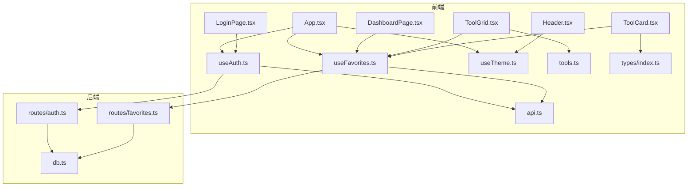
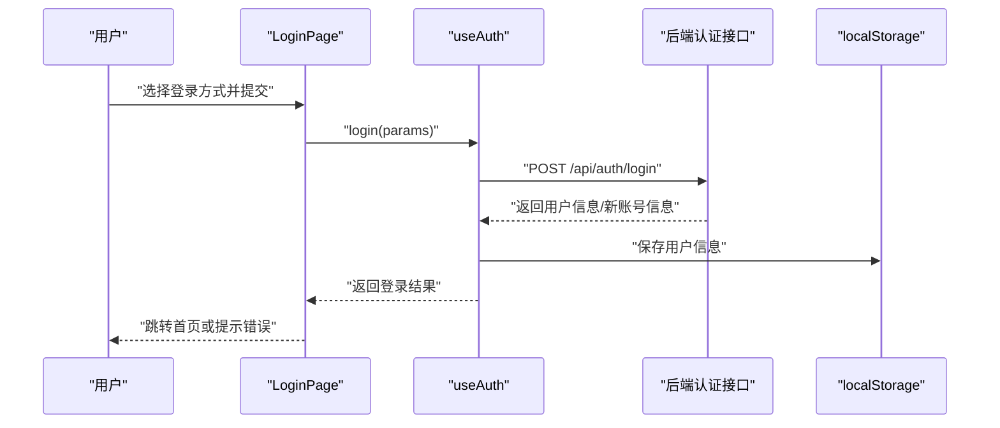
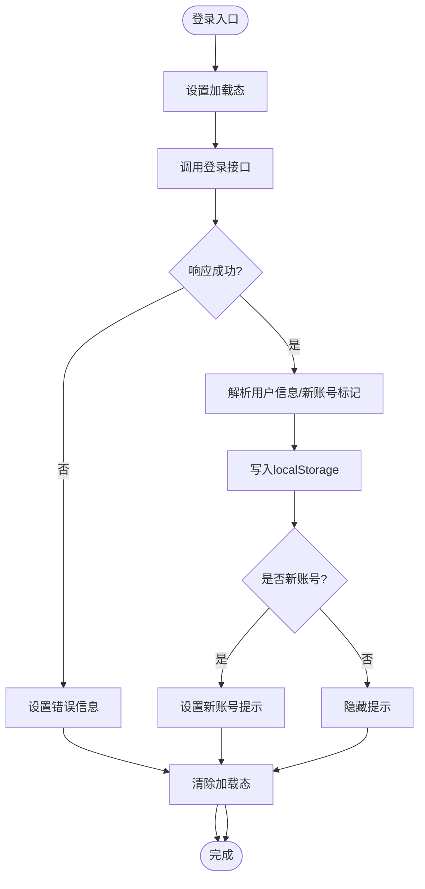
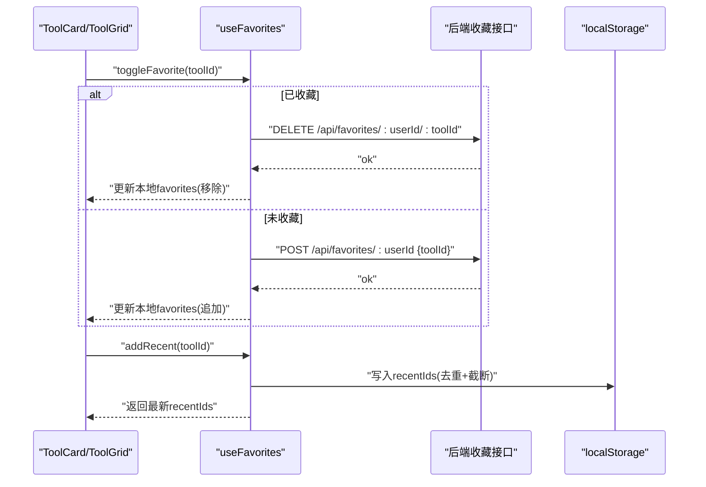
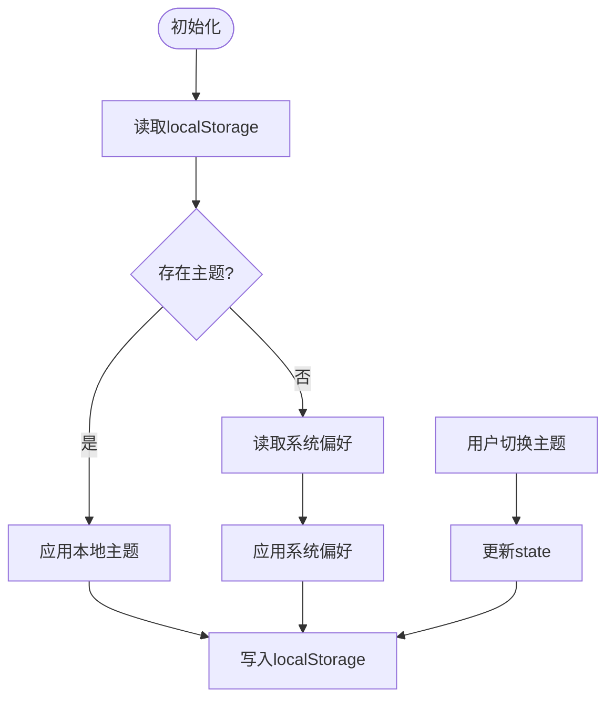
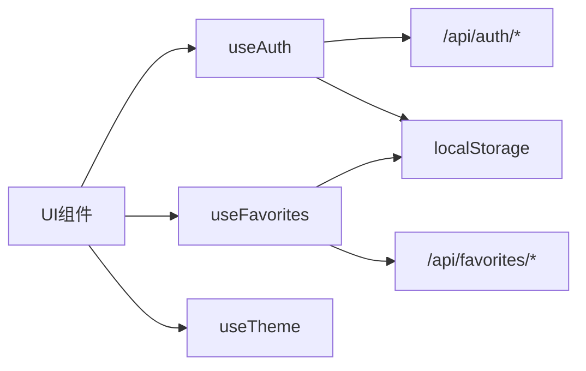

# 状态管理

<cite>
**本文引用的文件**
- [useAuth.ts](file://src/hooks/useAuth.ts)
- [useFavorites.ts](file://src/hooks/useFavorites.ts)
- [useTheme.ts](file://src/hooks/useTheme.ts)
- [App.tsx](file://src/App.tsx)
- [LoginPage.tsx](file://src/pages/LoginPage.tsx)
- [DashboardPage.tsx](file://src/pages/DashboardPage.tsx)
- [Header.tsx](file://src/components/layout/Header.tsx)
- [ToolGrid.tsx](file://src/components/tools/ToolGrid.tsx)
- [ToolCard.tsx](file://src/components/tools/ToolCard.tsx)
- [tools.ts](file://src/data/tools.ts)
- [index.ts](file://src/types/index.ts)
- [api.ts](file://src/lib/api.ts)
- [auth.ts](file://server/src/routes/auth.ts)
- [favorites.ts](file://server/src/routes/favorites.ts)
- [db.ts](file://server/src/db.ts)
</cite>

## 目录
1. [简介](#简介)
2. [项目结构](#项目结构)
3. [核心组件](#核心组件)
4. [架构总览](#架构总览)
5. [详细组件分析](#详细组件分析)
6. [依赖关系分析](#依赖关系分析)
7. [性能考量](#性能考量)
8. [故障排查指南](#故障排查指南)
9. [结论](#结论)
10. [附录](#附录)

## 简介
本文件系统性梳理前端状态管理方案，围绕三个自定义 Hook 展开：认证状态管理（useAuth）、收藏与最近使用管理（useFavorites）、主题切换管理（useTheme）。文档从架构视角解释全局状态与局部状态的划分、状态提升与下沉的原则、异步状态处理（加载与错误）、以及本地持久化策略（localStorage）。同时结合实际页面与组件，给出最佳实践与常见模式。

## 项目结构
本项目采用“按职责分层 + 组件化”的组织方式：
- hooks：封装跨组件共享的状态逻辑（useAuth、useFavorites、useTheme）
- pages：页面级容器，负责状态提升与向下传递
- components：UI 组件与业务组件，消费来自 hooks 的状态与回调
- data：静态数据与工具函数（如工具列表、分类、搜索）
- lib：通用工具与 API 封装
- server：后端路由与数据库（提供认证、收藏、日志等接口）

图表来源
- [App.tsx:12-60](file://src/App.tsx#L12-L60)
- [useAuth.ts:20-88](file://src/hooks/useAuth.ts#L20-L88)
- [useFavorites.ts:16-70](file://src/hooks/useFavorites.ts#L16-L70)
- [useTheme.ts:5-31](file://src/hooks/useTheme.ts#L5-L31)
- [LoginPage.tsx:22-250](file://src/pages/LoginPage.tsx#L22-L250)
- [DashboardPage.tsx:16-50](file://src/pages/DashboardPage.tsx#L16-L50)
- [Header.tsx:21-159](file://src/components/layout/Header.tsx#L21-L159)
- [ToolGrid.tsx:15-136](file://src/components/tools/ToolGrid.tsx#L15-L136)
- [ToolCard.tsx:14-66](file://src/components/tools/ToolCard.tsx#L14-L66)
- [tools.ts:43-316](file://src/data/tools.ts#L43-L316)
- [index.ts:29-37](file://src/types/index.ts#L29-L37)
- [api.ts:1-36](file://src/lib/api.ts#L1-L36)
- [auth.ts:36-106](file://server/src/routes/auth.ts#L36-L106)
- [favorites.ts:6-28](file://server/src/routes/favorites.ts#L6-L28)
- [db.ts:12-75](file://server/src/db.ts#L12-L75)

章节来源
- [App.tsx:12-60](file://src/App.tsx#L12-L60)
- [useAuth.ts:20-88](file://src/hooks/useAuth.ts#L20-L88)
- [useFavorites.ts:16-70](file://src/hooks/useFavorites.ts#L16-L70)
- [useTheme.ts:5-31](file://src/hooks/useTheme.ts#L5-L31)

## 核心组件
本节聚焦三大自定义 Hook 的职责边界、状态模型与对外暴露的 API。

- useAuth：负责用户认证生命周期、用户列表拉取、登录错误与新账号提示、管理员标识、以及本地持久化（用户信息与最近使用记录清理）。
- useFavorites：负责用户收藏列表与最近使用列表的同步与更新，支持收藏切换、查询是否收藏、新增最近使用。
- useTheme：负责主题状态的读取、切换与持久化，根据系统偏好初始化主题。

章节来源
- [useAuth.ts:20-88](file://src/hooks/useAuth.ts#L20-L88)
- [useFavorites.ts:16-70](file://src/hooks/useFavorites.ts#L16-L70)
- [useTheme.ts:5-31](file://src/hooks/useTheme.ts#L5-L31)

## 架构总览
整体采用“容器组件 + 自定义 Hook + UI 组件”的分层：
- 容器组件（App、各页面）进行状态提升，将状态与回调通过 props 下沉到子组件
- 自定义 Hook 抽象状态逻辑，统一处理副作用、异步调用与本地存储
- UI 组件专注渲染与交互，不直接操作副作用

图表来源
- [LoginPage.tsx:30-40](file://src/pages/LoginPage.tsx#L30-L40)
- [useAuth.ts:37-72](file://src/hooks/useAuth.ts#L37-L72)
- [auth.ts:36-106](file://server/src/routes/auth.ts#L36-L106)

## 详细组件分析

### useAuth：认证状态管理
- 状态模型
  - user：当前登录用户，来源于后端与本地存储
  - users：系统用户列表（用于展示）
  - isLoading：登录过程中的加载态
  - loginError：登录错误信息
  - newAccountInfo：新账号创建后的临时提示信息
- 关键行为
  - 初始化：从 localStorage 恢复 user
  - 登录：根据参数类型调用后端登录接口，处理成功/失败分支，持久化 user
  - 退出：清空 user 并清理相关本地缓存
  - 新账号提示：当后端返回新账号信息时，提供默认密码与用户 ID
- 异步与错误处理
  - 登录流程中设置 isLoading，捕获异常并设置 loginError
  - 对后端非 2xx 响应进行错误提示
- 本地持久化
  - 使用 localStorage 存储 user，确保刷新后仍保持登录态

图表来源
- [useAuth.ts:37-72](file://src/hooks/useAuth.ts#L37-L72)
- [useAuth.ts:20-28](file://src/hooks/useAuth.ts#L20-L28)

章节来源
- [useAuth.ts:20-88](file://src/hooks/useAuth.ts#L20-L88)
- [LoginPage.tsx:22-250](file://src/pages/LoginPage.tsx#L22-L250)
- [auth.ts:36-106](file://server/src/routes/auth.ts#L36-L106)

### useFavorites：收藏与最近使用管理
- 状态模型
  - favorites：当前用户的收藏工具 ID 列表
  - recentIds：最近使用的工具 ID 列表（本地持久化）
- 关键行为
  - 初始化：从 localStorage 恢复 recentIds
  - 拉取收藏：当 userId 变化时，向后端拉取收藏列表
  - 切换收藏：根据是否存在决定 POST 或 DELETE，同时更新本地 favorites
  - 查询收藏：判断某工具是否在 favorites 中
  - 添加最近使用：去重、限制长度、写回 localStorage
- 异步与错误处理
  - 拉取收藏与切换收藏均通过 fetch 发起请求，异常时打印日志
- 本地持久化
  - 使用 localStorage 存储 recentIds，避免每次刷新丢失

图表来源
- [useFavorites.ts:34-67](file://src/hooks/useFavorites.ts#L34-L67)
- [favorites.ts:6-28](file://server/src/routes/favorites.ts#L6-L28)
- [ToolCard.tsx:29-43](file://src/components/tools/ToolCard.tsx#L29-L43)
- [ToolGrid.tsx:39-44](file://src/components/tools/ToolGrid.tsx#L39-L44)

章节来源
- [useFavorites.ts:16-70](file://src/hooks/useFavorites.ts#L16-L70)
- [ToolGrid.tsx:15-136](file://src/components/tools/ToolGrid.tsx#L15-L136)
- [ToolCard.tsx:14-66](file://src/components/tools/ToolCard.tsx#L14-L66)
- [favorites.ts:6-28](file://server/src/routes/favorites.ts#L6-L28)

### useTheme：主题切换管理
- 状态模型
  - theme：当前主题（light/dark）
- 关键行为
  - 初始化：优先读取 localStorage；若不存在则根据系统偏好设置初始值
  - 切换：在 light/dark 间切换
  - 应用：将主题类名写入 documentElement，同时持久化
- 本地持久化
  - 使用 localStorage 存储 theme

图表来源
- [useTheme.ts:6-20](file://src/hooks/useTheme.ts#L6-L20)
- [Header.tsx:99-111](file://src/components/layout/Header.tsx#L99-L111)

章节来源
- [useTheme.ts:5-31](file://src/hooks/useTheme.ts#L5-L31)
- [Header.tsx:21-159](file://src/components/layout/Header.tsx#L21-L159)

### 页面与组件中的状态使用
- App：作为根容器，同时持有 useAuth、useFavorites、useTheme 的状态与回调，向下传递给各页面与布局组件
- LoginPage：接收 useAuth 的 login、isLoading、loginError、newAccountInfo，并在登录成功后跳转首页
- DashboardPage：接收 favorites、recentIds、toggleFavorite、openTool 等，交由 Layout 与 ToolGrid 渲染
- Header：接收 theme 与 toggleTheme，用于主题切换按钮
- ToolGrid/ToolCard：消费 favorites、recentIds，触发 toggleFavorite 与 openTool

章节来源
- [App.tsx:12-60](file://src/App.tsx#L12-L60)
- [LoginPage.tsx:22-250](file://src/pages/LoginPage.tsx#L22-L250)
- [DashboardPage.tsx:16-50](file://src/pages/DashboardPage.tsx#L16-L50)
- [Header.tsx:21-159](file://src/components/layout/Header.tsx#L21-L159)
- [ToolGrid.tsx:15-136](file://src/components/tools/ToolGrid.tsx#L15-L136)
- [ToolCard.tsx:14-66](file://src/components/tools/ToolCard.tsx#L14-L66)

## 依赖关系分析
- 组件耦合
  - App 作为状态中心，耦合 useAuth/useFavorites/useTheme
  - 页面与组件通过 props 接口耦合，降低直接依赖
- 外部依赖
  - useAuth/useFavorites 依赖后端接口（/api/auth/login、/api/favorites）
  - localStorage 作为轻量持久化介质
- 数据一致性
  - useFavorites 在本地维护 recentIds，避免频繁请求后端
  - useAuth 在登录成功后写入 localStorage，保证刷新后状态一致

图表来源
- [useAuth.ts:42-59](file://src/hooks/useAuth.ts#L42-L59)
- [useFavorites.ts:39-49](file://src/hooks/useFavorites.ts#L39-L49)
- [auth.ts:36-106](file://server/src/routes/auth.ts#L36-L106)
- [favorites.ts:6-28](file://server/src/routes/favorites.ts#L6-L28)

章节来源
- [useAuth.ts:20-88](file://src/hooks/useAuth.ts#L20-L88)
- [useFavorites.ts:16-70](file://src/hooks/useFavorites.ts#L16-L70)

## 性能考量
- 减少不必要的重渲染
  - 使用 useCallback 包裹回调，避免子组件因引用变化而重渲染
  - 合理拆分状态，将高频变化与低频变化分离
- 异步状态优化
  - 登录与收藏切换使用 isLoading 控制 UI，避免并发冲突
  - 对错误进行短时提示，避免阻塞用户操作
- 本地缓存策略
  - useFavorites 的 recentIds 本地持久化，减少后端压力
  - useAuth 的用户信息本地持久化，提升首屏体验
- 数据规模控制
  - recentIds 设置最大长度，避免无限增长
  - 收藏列表仅存储 toolId，避免携带冗余数据

## 故障排查指南
- 登录失败
  - 检查后端返回的错误字段，确认参数是否完整（用户名/密码/企微 ID）
  - 查看浏览器网络面板，确认 /api/auth/login 是否返回 2xx
- 收藏无效
  - 确认 userId 是否为空，useFavorites 会在 userId 为空时清空 favorites
  - 检查 /api/favorites 接口是否返回 2xx，观察本地 localStorage 是否更新
- 主题不生效
  - 检查 documentElement 是否正确添加/移除 light/dark 类名
  - 清除 localStorage 中的主题键后刷新页面，确认系统偏好是否被正确读取
- 刷新后未保持登录
  - 检查 localStorage 中的用户键是否存在且可 JSON 解析
  - 确认后端登录接口返回的用户信息结构与前端预期一致

章节来源
- [useAuth.ts:48-71](file://src/hooks/useAuth.ts#L48-L71)
- [useFavorites.ts:23-32](file://src/hooks/useFavorites.ts#L23-L32)
- [useTheme.ts:15-20](file://src/hooks/useTheme.ts#L15-L20)

## 结论
本项目通过自定义 Hook 将认证、收藏、主题等跨组件状态抽象出来，配合页面级容器进行状态提升与下沉，形成清晰的职责边界与良好的可维护性。异步状态处理与本地持久化策略有效提升了用户体验与性能。建议在后续迭代中引入更完善的错误边界与状态回滚机制，进一步增强健壮性。

## 附录
- 最佳实践清单
  - 将“状态逻辑”与“UI 渲染”解耦，优先使用自定义 Hook
  - 对外暴露稳定的 props 接口，避免深层嵌套
  - 使用 useCallback 与 useMemo 降低重渲染
  - 对异步操作统一处理 loading/error，提供明确的用户反馈
  - 本地持久化仅用于轻量数据，复杂状态仍需后端同步
- 常见模式
  - 登录流程：设置 loading → 调用接口 → 成功写入本地 → 失败设置错误 → 清除 loading
  - 收藏切换：根据本地状态判断 → 调用接口 → 更新本地状态
  - 主题切换：更新 state → 写入 DOM 类名 → 写入 localStorage