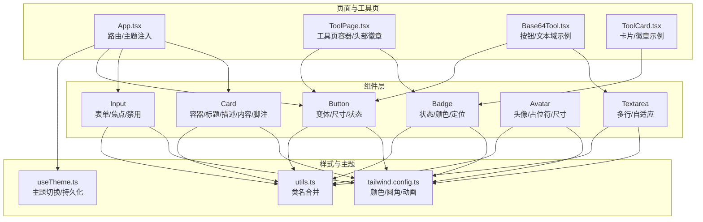
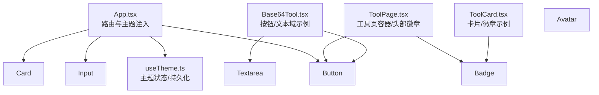
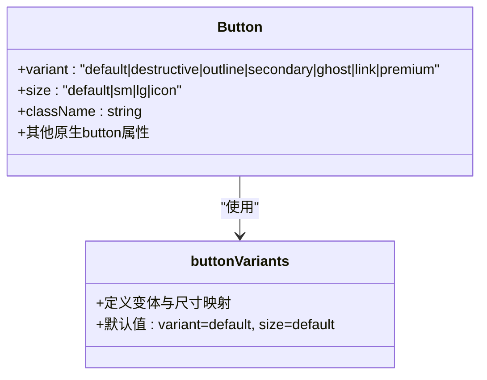
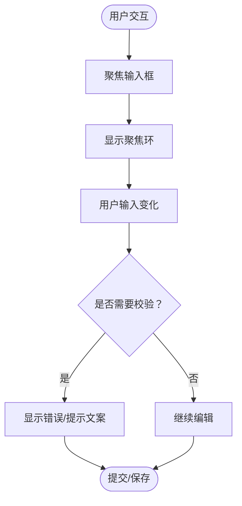
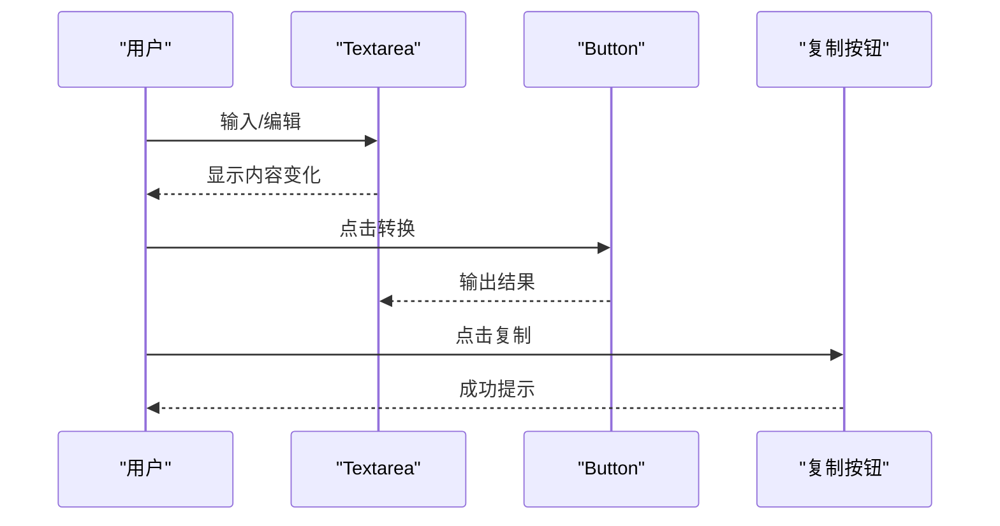
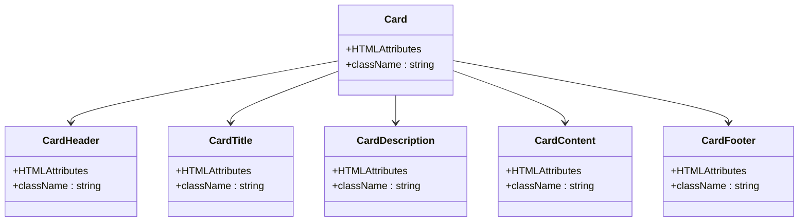
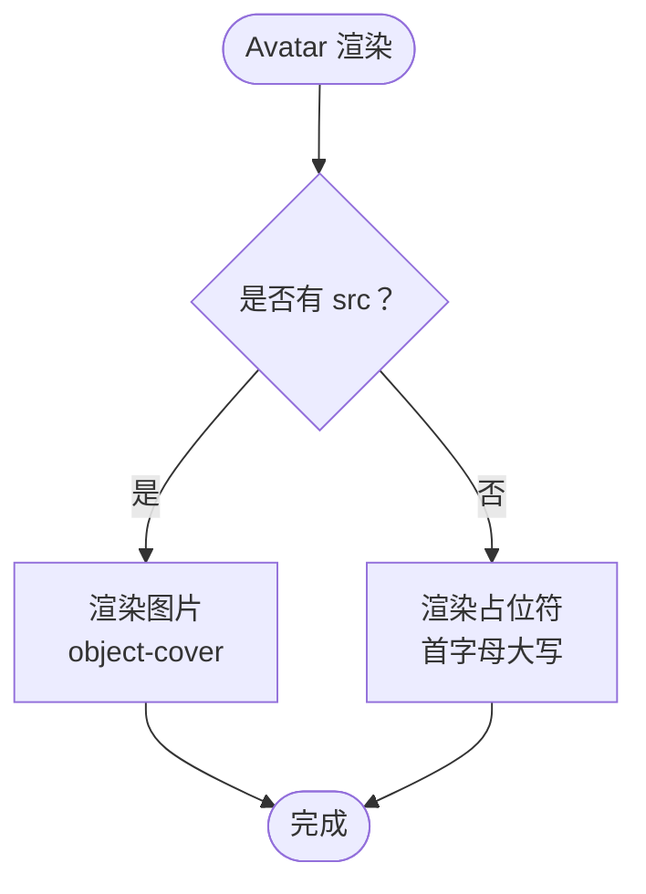
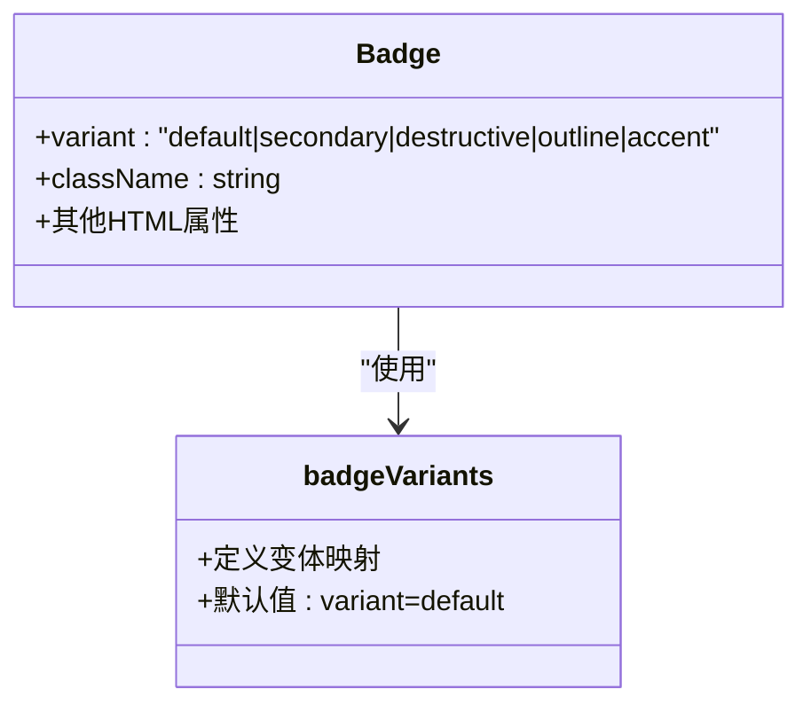
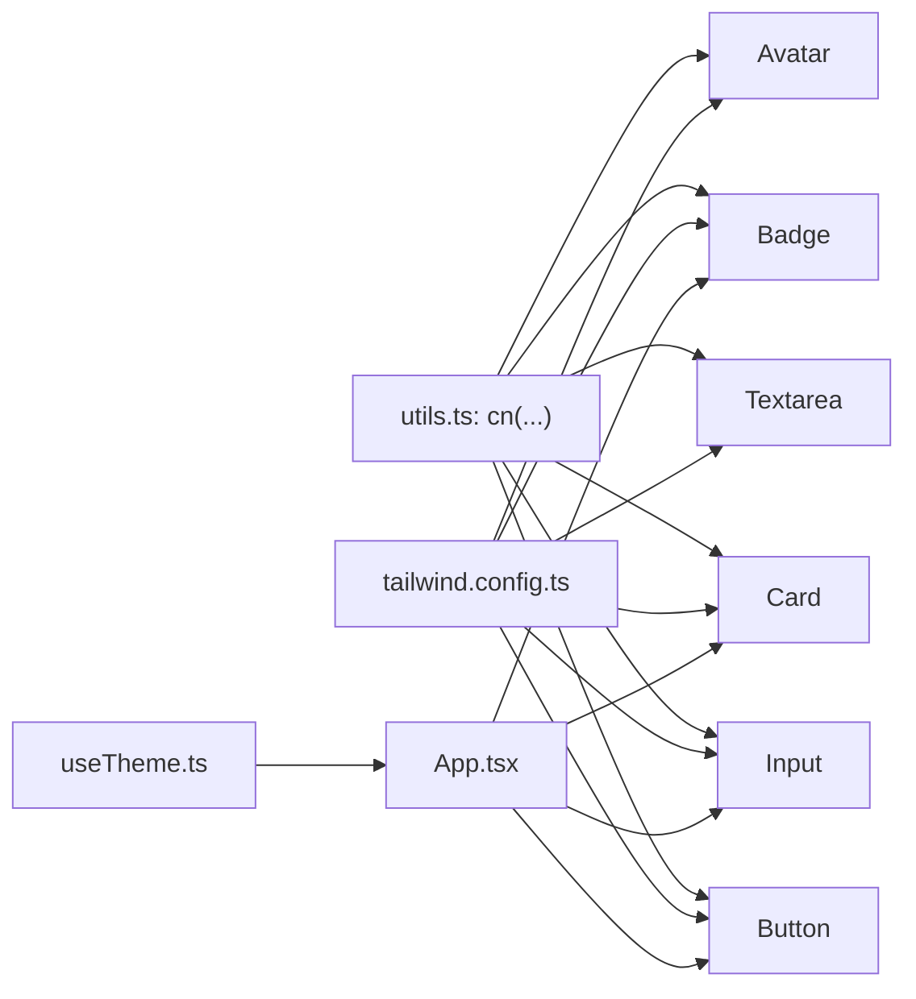

# UI 组件库

<cite>
**本文引用的文件**
- [button.tsx](file://src/components/ui/button.tsx)
- [input.tsx](file://src/components/ui/input.tsx)
- [card.tsx](file://src/components/ui/card.tsx)
- [avatar.tsx](file://src/components/ui/avatar.tsx)
- [badge.tsx](file://src/components/ui/badge.tsx)
- [textarea.tsx](file://src/components/ui/textarea.tsx)
- [utils.ts](file://src/lib/utils.ts)
- [tailwind.config.ts](file://tailwind.config.ts)
- [useTheme.ts](file://src/hooks/useTheme.ts)
- [App.tsx](file://src/App.tsx)
- [ToolPage.tsx](file://src/pages/ToolPage.tsx)
- [Base64Tool.tsx](file://src/tools/Base64Tool.tsx)
- [ToolCard.tsx](file://src/components/tools/ToolCard.tsx)
</cite>

## 目录
1. [引言](#引言)
2. [项目结构](#项目结构)
3. [核心组件](#核心组件)
4. [架构总览](#架构总览)
5. [详细组件分析](#详细组件分析)
6. [依赖分析](#依赖分析)
7. [性能考虑](#性能考虑)
8. [故障排查指南](#故障排查指南)
9. [结论](#结论)
10. [附录：样式定制与最佳实践](#附录样式定制与最佳实践)

## 引言
本文件面向 UI 组件库的使用者与维护者，系统化梳理基础 UI 组件的设计理念、实现标准与使用方式。重点覆盖以下组件：
- Button：多种变体、尺寸与状态管理
- Input：表单集成、验证反馈与无障碍访问
- Card：内容组织、阴影效果与响应式布局
- Avatar：头像显示、占位符与加载状态
- Badge：状态标记、颜色系统与定位策略
- Textarea：多行文本处理与自动调整高度

同时提供样式定制指南、主题适配方案与最佳实践，并通过真实页面与工具页示例展示如何组合使用这些组件。

## 项目结构
UI 组件集中于 src/components/ui 目录，采用“原子化 + 组合”的设计思路：以最小可复用元素（如 Button、Input）为基础，通过 Card、Avatar、Badge 等复合组件进行内容组织与状态标记；通过 Tailwind CSS 与主题钩子实现一致的视觉语言与暗色模式支持。

图表来源
- [button.tsx:1-50](file://src/components/ui/button.tsx#L1-L50)
- [input.tsx:1-25](file://src/components/ui/input.tsx#L1-L25)
- [textarea.tsx:1-23](file://src/components/ui/textarea.tsx#L1-L23)
- [card.tsx:1-76](file://src/components/ui/card.tsx#L1-L76)
- [avatar.tsx:1-40](file://src/components/ui/avatar.tsx#L1-L40)
- [badge.tsx:1-34](file://src/components/ui/badge.tsx#L1-L34)
- [utils.ts:1-7](file://src/lib/utils.ts#L1-L7)
- [tailwind.config.ts:1-86](file://tailwind.config.ts#L1-L86)
- [useTheme.ts:1-32](file://src/hooks/useTheme.ts#L1-L32)
- [App.tsx:1-63](file://src/App.tsx#L1-L63)
- [ToolPage.tsx:1-113](file://src/pages/ToolPage.tsx#L1-L113)
- [Base64Tool.tsx:1-64](file://src/tools/Base64Tool.tsx#L1-L64)
- [ToolCard.tsx:1-66](file://src/components/tools/ToolCard.tsx#L1-L66)

章节来源
- [button.tsx:1-50](file://src/components/ui/button.tsx#L1-L50)
- [input.tsx:1-25](file://src/components/ui/input.tsx#L1-L25)
- [textarea.tsx:1-23](file://src/components/ui/textarea.tsx#L1-L23)
- [card.tsx:1-76](file://src/components/ui/card.tsx#L1-L76)
- [avatar.tsx:1-40](file://src/components/ui/avatar.tsx#L1-L40)
- [badge.tsx:1-34](file://src/components/ui/badge.tsx#L1-L34)
- [utils.ts:1-7](file://src/lib/utils.ts#L1-L7)
- [tailwind.config.ts:1-86](file://tailwind.config.ts#L1-L86)
- [useTheme.ts:1-32](file://src/hooks/useTheme.ts#L1-L32)
- [App.tsx:1-63](file://src/App.tsx#L1-L63)
- [ToolPage.tsx:1-113](file://src/pages/ToolPage.tsx#L1-L113)
- [Base64Tool.tsx:1-64](file://src/tools/Base64Tool.tsx#L1-L64)
- [ToolCard.tsx:1-66](file://src/components/tools/ToolCard.tsx#L1-L66)

## 核心组件
本节对各组件的关键能力与使用要点进行概览，便于快速查阅与集成。

- Button
  - 变体：default、destructive、outline、secondary、ghost、link、premium
  - 尺寸：default、sm、lg、icon
  - 状态：聚焦环、禁用态、悬停/激活过渡
  - 适用场景：主操作、次级操作、危险操作、链接式触发、强调按钮
- Input
  - 表单集成：继承原生 input 属性，支持类型、占位符、禁用等
  - 焦点反馈：聚焦时显示环形高亮
  - 无障碍：保持原生语义与键盘可达性
- Textarea
  - 多行文本：默认最小高度与自适应内容
  - 焦点反馈：聚焦时显示环形高亮
- Card
  - 结构化内容：Card、CardHeader、CardTitle、CardDescription、CardContent、CardFooter
  - 视觉：边框、背景、阴影与过渡
- Avatar
  - 头像显示：支持图片与占位符（取首字母）
  - 尺寸：sm、md、lg
- Badge
  - 状态标记：default、secondary、destructive、outline、accent
  - 定位策略：通过外层容器相对定位或绝对定位实现徽章叠加

章节来源
- [button.tsx:5-30](file://src/components/ui/button.tsx#L5-L30)
- [input.tsx:7-21](file://src/components/ui/input.tsx#L7-L21)
- [textarea.tsx:6-19](file://src/components/ui/textarea.tsx#L6-L19)
- [card.tsx:4-73](file://src/components/ui/card.tsx#L4-L73)
- [avatar.tsx:11-37](file://src/components/ui/avatar.tsx#L11-L37)
- [badge.tsx:5-21](file://src/components/ui/badge.tsx#L5-L21)

## 架构总览
组件库与主题系统、页面路由的关系如下：

图表来源
- [App.tsx:12-60](file://src/App.tsx#L12-L60)
- [useTheme.ts:5-30](file://src/hooks/useTheme.ts#L5-L30)
- [ToolPage.tsx:6-94](file://src/pages/ToolPage.tsx#L6-L94)
- [Base64Tool.tsx:2-51](file://src/tools/Base64Tool.tsx#L2-L51)
- [ToolCard.tsx:3-62](file://src/components/tools/ToolCard.tsx#L3-L62)

## 详细组件分析

### Button 组件
- 设计理念
  - 使用变体与尺寸的组合，统一视觉层级与交互反馈
  - 通过 class-variance-authority(cva) 定义变体规则，cn 合并类名，确保可维护性
- 关键实现
  - 变体与尺寸：定义在 cva 中，支持 default、destructive、outline、secondary、ghost、link、premium；尺寸 default、sm、lg、icon
  - 状态管理：聚焦环、禁用态、悬停/激活过渡由 Tailwind 类控制
  - 扩展：可通过传入 className 覆盖默认样式，或在外部容器中添加定位/间距
- 使用示例路径
  - 工具页头部切换与返回按钮：[ToolPage.tsx:79-82](file://src/pages/ToolPage.tsx#L79-L82)
  - 工具页徽章与按钮组合：[ToolPage.tsx:89-90](file://src/pages/ToolPage.tsx#L89-L90)
  - Base64 工具页编码/解码按钮：[Base64Tool.tsx:36-41](file://src/tools/Base64Tool.tsx#L36-L41)

图表来源
- [button.tsx:5-30](file://src/components/ui/button.tsx#L5-L30)

章节来源
- [button.tsx:1-50](file://src/components/ui/button.tsx#L1-L50)
- [ToolPage.tsx:79-82](file://src/pages/ToolPage.tsx#L79-L82)
- [Base64Tool.tsx:36-41](file://src/tools/Base64Tool.tsx#L36-L41)

### Input 组件
- 设计理念
  - 保持原生 input 的可访问性与行为一致性，同时提供统一的聚焦反馈与禁用态
- 关键实现
  - 继承原生属性，支持 type、placeholder、禁用等
  - 聚焦态：通过 ring-offset、ring-ring、focus-visible 实现
  - 过渡：transition-smooth 提供平滑过渡
- 表单集成与无障碍
  - 建议配合 label 使用，设置 htmlFor 与 id，保证屏幕阅读器可读
  - 在表单中使用时，结合外部状态（如错误提示）与 aria-* 属性
- 使用示例路径
  - 工具页头部搜索输入：[ToolPage.tsx:1-113](file://src/pages/ToolPage.tsx#L1-L113)
  - 登录页输入框：[ToolPage.tsx:1-113](file://src/pages/ToolPage.tsx#L1-L113)

图表来源
- [input.tsx:7-21](file://src/components/ui/input.tsx#L7-L21)

章节来源
- [input.tsx:1-25](file://src/components/ui/input.tsx#L1-L25)
- [ToolPage.tsx:1-113](file://src/pages/ToolPage.tsx#L1-L113)

### Textarea 组件
- 设计理念
  - 支持多行文本输入，默认最小高度，聚焦时提供统一反馈
- 关键实现
  - 默认最小高度与自适应内容，适合日志、代码、长文本编辑
  - 聚焦态与禁用态样式一致，便于表单一致性
- 使用建议
  - 对于超长文本，建议配合滚动容器与分页/懒加载
  - 与 Button 组合时，注意按钮宽度与容器留白
- 使用示例路径
  - Base64 工具页输入/输出区域：[Base64Tool.tsx:43-58](file://src/tools/Base64Tool.tsx#L43-L58)

图表来源
- [textarea.tsx:6-19](file://src/components/ui/textarea.tsx#L6-L19)
- [Base64Tool.tsx:14-31](file://src/tools/Base64Tool.tsx#L14-L31)

章节来源
- [textarea.tsx:1-23](file://src/components/ui/textarea.tsx#L1-L23)
- [Base64Tool.tsx:1-64](file://src/tools/Base64Tool.tsx#L1-L64)

### Card 组件
- 设计理念
  - 以卡片容器承载复杂内容，提供清晰的标题、描述、内容区与脚注
- 关键实现
  - Card、CardHeader、CardTitle、CardDescription、CardContent、CardFooter 分层组织
  - 统一的边框、背景、阴影与过渡，适配不同页面背景
- 响应式设计
  - 内容区与脚注区通过 Flex 与间距类实现自适应
- 使用示例路径
  - 工具页工作区容器：[ToolPage.tsx:97-108](file://src/pages/ToolPage.tsx#L97-L108)

图表来源
- [card.tsx:4-73](file://src/components/ui/card.tsx#L4-L73)

章节来源
- [card.tsx:1-76](file://src/components/ui/card.tsx#L1-L76)
- [ToolPage.tsx:97-108](file://src/pages/ToolPage.tsx#L97-L108)

### Avatar 组件
- 设计理念
  - 提供头像占位符与加载状态，支持多种尺寸
- 关键实现
  - 支持 src 图片与 fallback 文本（取首字母大写）
  - 尺寸映射：sm、md、lg 对应不同的宽高与字号
- 使用建议
  - 优先提供 src；当图片加载失败时，回退到 fallback 占位
  - 与 Button/Menu 等组件组合时，注意对齐与间距
- 使用示例路径
  - 页面头部用户头像占位：[ToolPage.tsx:1-113](file://src/pages/ToolPage.tsx#L1-L113)

图表来源
- [avatar.tsx:17-37](file://src/components/ui/avatar.tsx#L17-L37)

章节来源
- [avatar.tsx:1-40](file://src/components/ui/avatar.tsx#L1-L40)
- [ToolPage.tsx:1-113](file://src/pages/ToolPage.tsx#L1-L113)

### Badge 组件
- 设计理念
  - 用于状态标记与标签展示，支持多种颜色与边框风格
- 关键实现
  - 变体：default、secondary、destructive、outline、accent
  - 通过定位策略（相对/绝对）叠加在卡片、按钮等元素上
- 使用示例路径
  - 工具页头部徽章：[ToolPage.tsx:89-90](file://src/pages/ToolPage.tsx#L89-L90)
  - 工具卡片徽章：[ToolCard.tsx:60-61](file://src/components/tools/ToolCard.tsx#L60-L61)

图表来源
- [badge.tsx:5-21](file://src/components/ui/badge.tsx#L5-L21)

章节来源
- [badge.tsx:1-34](file://src/components/ui/badge.tsx#L1-L34)
- [ToolPage.tsx:89-90](file://src/pages/ToolPage.tsx#L89-L90)
- [ToolCard.tsx:60-61](file://src/components/tools/ToolCard.tsx#L60-L61)

## 依赖分析
- 组件与工具函数
  - 所有组件均通过 utils.ts 的 cn 函数合并类名，确保 Tailwind 与自定义样式的兼容
- 主题与样式
  - tailwind.config.ts 定义颜色、圆角、动画等主题变量，useTheme.ts 提供主题状态与持久化
- 页面与组件关系
  - App.tsx 注入主题状态，ToolPage.tsx 作为工具页容器，Base64Tool.tsx 与 ToolCard.tsx 展示具体使用场景

图表来源
- [utils.ts:4-6](file://src/lib/utils.ts#L4-L6)
- [tailwind.config.ts:20-55](file://tailwind.config.ts#L20-L55)
- [useTheme.ts:5-30](file://src/hooks/useTheme.ts#L5-L30)
- [App.tsx:12-22](file://src/App.tsx#L12-L22)

章节来源
- [utils.ts:1-7](file://src/lib/utils.ts#L1-L7)
- [tailwind.config.ts:1-86](file://tailwind.config.ts#L1-L86)
- [useTheme.ts:1-32](file://src/hooks/useTheme.ts#L1-L32)
- [App.tsx:1-63](file://src/App.tsx#L1-L63)

## 性能考虑
- 组件渲染
  - 使用 forwardRef 与 className 合并，避免多余包装元素
  - 变体与尺寸通过 cva 预编译，减少运行时判断开销
- 样式体积
  - Tailwind 按需扫描源文件，仅生成实际使用的类
  - 动画与过渡类按需启用，避免全局动画影响
- 交互反馈
  - 聚焦环与过渡类提供即时反馈，但应避免过度使用导致闪烁
- 页面与工具页
  - 工具页采用动态导入与 Suspense，降低首屏包体与等待时间

## 故障排查指南
- Button 无聚焦环或样式异常
  - 检查是否正确引入 Tailwind 样式与 ring-offset、ring-ring 类
  - 确认未被外部样式覆盖
- Input/Textarea 无法聚焦或聚焦环不显示
  - 确保未禁用或覆盖 focus-visible 样式
  - 检查父容器是否设置了 pointer-events 或 overflow 导致事件丢失
- Avatar 图片不显示
  - 确认 src 可访问且未被 CSP 策略拦截
  - 当图片加载失败时，fallback 应正常显示
- Badge 定位错位
  - 确认父容器已设置相对定位，徽章使用绝对定位叠加
- 主题切换无效
  - 检查 useTheme.ts 是否正确写入/读取本地存储
  - 确认根节点类名更新逻辑生效

章节来源
- [button.tsx:6-7](file://src/components/ui/button.tsx#L6-L7)
- [input.tsx:12-13](file://src/components/ui/input.tsx#L12-L13)
- [textarea.tsx:10-11](file://src/components/ui/textarea.tsx#L10-L11)
- [avatar.tsx:26-36](file://src/components/ui/avatar.tsx#L26-L36)
- [badge.tsx:28-30](file://src/components/ui/badge.tsx#L28-L30)
- [useTheme.ts:15-20](file://src/hooks/useTheme.ts#L15-L20)

## 结论
该 UI 组件库以简洁、一致与可扩展为核心目标：通过 cva 与 Tailwind 实现统一的视觉与交互语言，通过组合组件实现复杂页面的模块化构建。Button、Input、Textarea、Card、Avatar、Badge 共同构成基础能力矩阵，适用于多样化的业务场景。配合主题钩子与样式配置，可快速适配深浅主题与品牌风格。

## 附录：样式定制与最佳实践
- 自定义变体与尺寸
  - 在 Button 与 Badge 中通过 cva 扩展新的变体或尺寸，保持命名规范与语义一致
- 颜色系统
  - 通过 tailwind.config.ts 的 extend.colors 定义品牌色与状态色，确保与主题一致
- 圆角与阴影
  - 使用 theme.borderRadius 与 shadow 类统一圆角与阴影，避免硬编码
- 动画与过渡
  - 使用 transition-smooth 与动画类提供流畅体验，避免过度动画影响性能
- 无障碍访问
  - Input/Textarea 建议配合 label；Button 支持键盘触发；Avatar 提供 alt 或 fallback 文本
- 组合使用
  - Card 作为容器承载内容，Badge 用于状态标记，Button 与 Input/Textarea 组合实现表单交互
- 示例参考
  - 工具页头部徽章与按钮：[ToolPage.tsx:79-94](file://src/pages/ToolPage.tsx#L79-L94)
  - 工具卡片徽章与按钮：[ToolCard.tsx:59-62](file://src/components/tools/ToolCard.tsx#L59-L62)
  - Base64 工具页按钮与文本域：[Base64Tool.tsx:35-60](file://src/tools/Base64Tool.tsx#L35-L60)

章节来源
- [tailwind.config.ts:19-80](file://tailwind.config.ts#L19-L80)
- [ToolPage.tsx:79-94](file://src/pages/ToolPage.tsx#L79-L94)
- [ToolCard.tsx:59-62](file://src/components/tools/ToolCard.tsx#L59-L62)
- [Base64Tool.tsx:35-60](file://src/tools/Base64Tool.tsx#L35-L60)