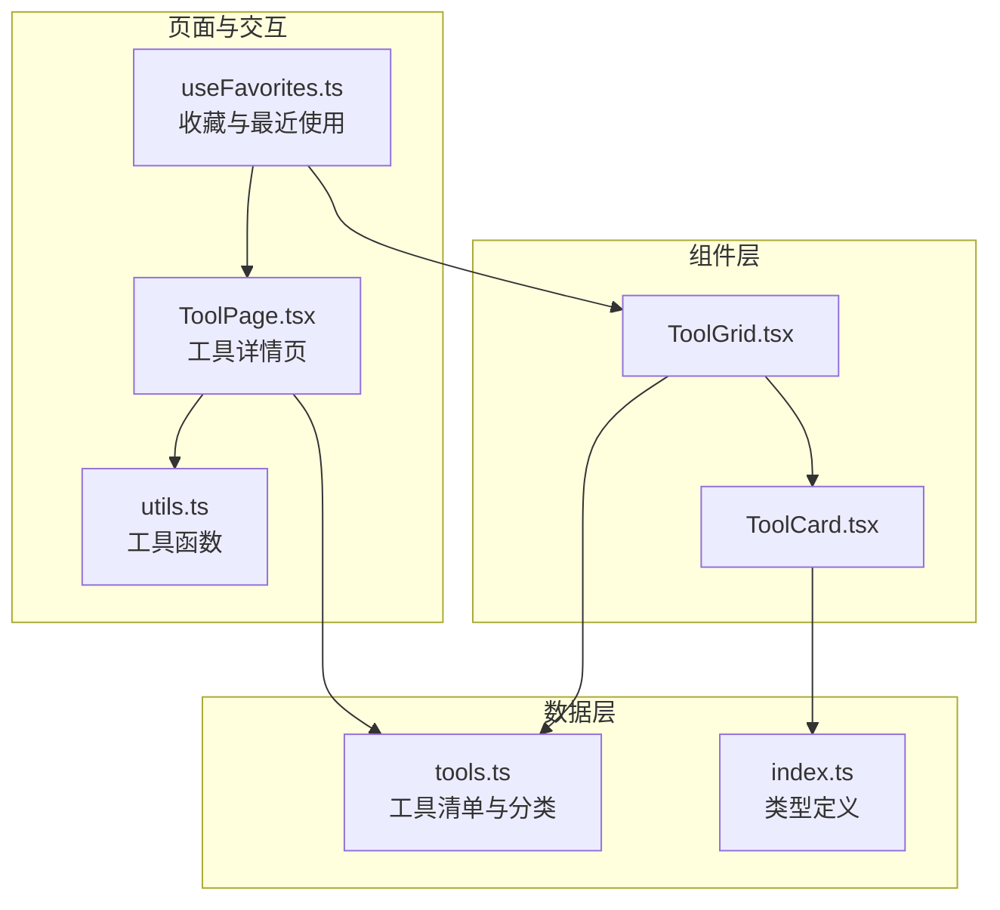
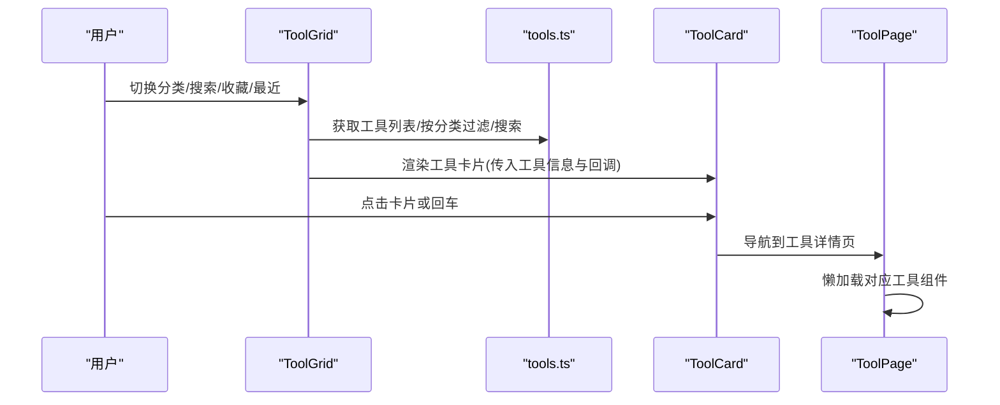
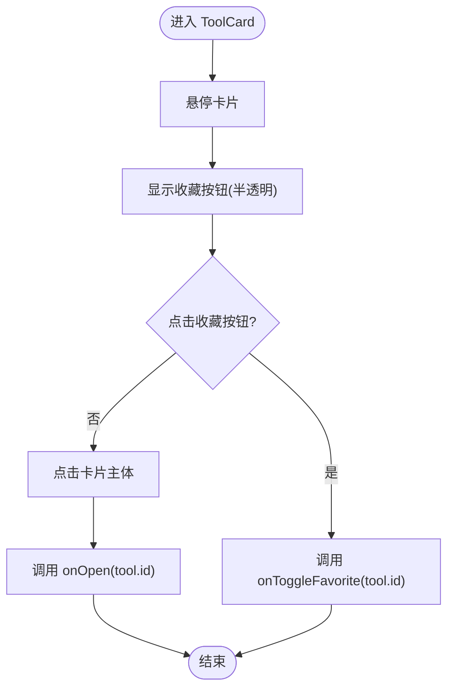
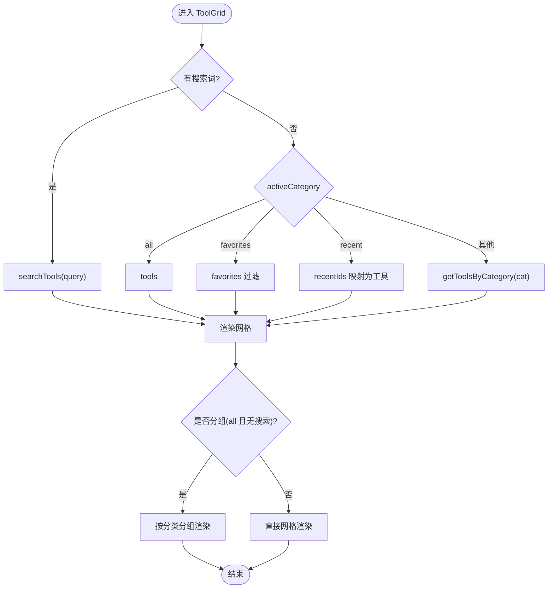
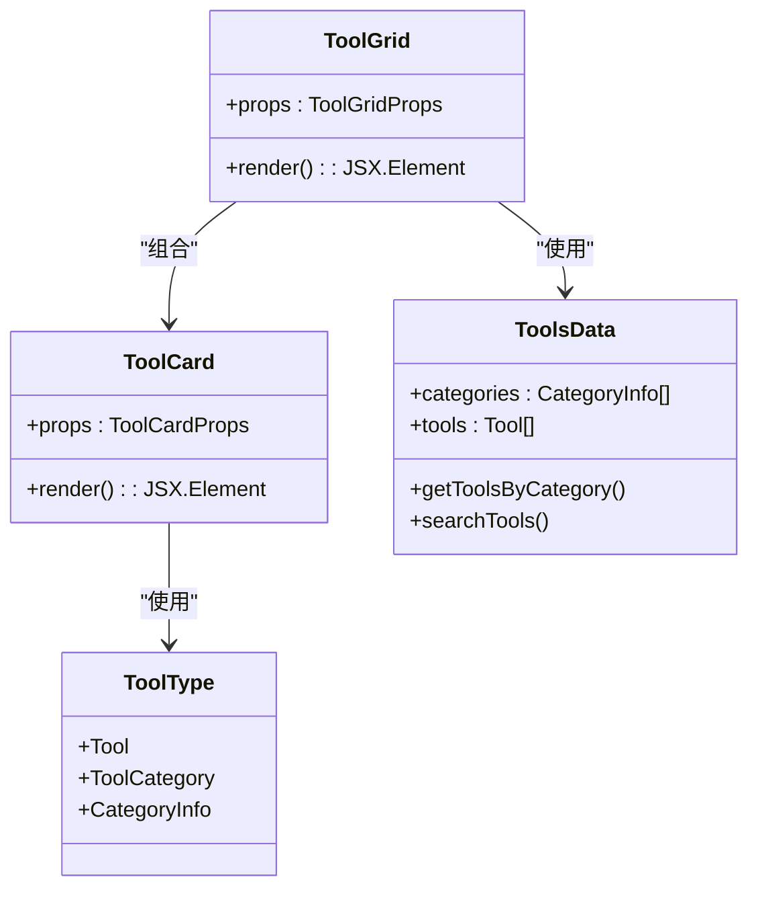

# 工具组件

<cite>
**本文引用的文件**
- [ToolCard.tsx](file://src/components/tools/ToolCard.tsx)
- [ToolGrid.tsx](file://src/components/tools/ToolGrid.tsx)
- [tools.ts](file://src/data/tools.ts)
- [index.ts](file://src/types/index.ts)
- [ToolPage.tsx](file://src/pages/ToolPage.tsx)
- [useFavorites.ts](file://src/hooks/useFavorites.ts)
- [utils.ts](file://src/lib/utils.ts)
- [JsonFormatter.tsx](file://src/tools/JsonFormatter.tsx)
- [BarcodeGenerator.tsx](file://src/tools/BarcodeGenerator.tsx)
</cite>

## 目录
1. [简介](#简介)
2. [项目结构](#项目结构)
3. [核心组件](#核心组件)
4. [架构总览](#架构总览)
5. [详细组件分析](#详细组件分析)
6. [依赖关系分析](#依赖关系分析)
7. [性能考量](#性能考量)
8. [故障排查指南](#故障排查指南)
9. [结论](#结论)
10. [附录：创建新工具卡片与网格布局示例](#附录创建新工具卡片与网格布局示例)

## 简介
本文件系统性梳理工具组件的设计理念与实现机制，重点覆盖：
- ToolCard 单个工具卡片的展示逻辑：图标、名称、描述、标签与跳转行为
- ToolGrid 网格布局与筛选：分类、收藏、最近使用、搜索与分组展示
- 数据绑定模式：工具信息来源、格式化与渲染
- 交互设计：悬停、点击、键盘访问、收藏切换与空状态
- 性能优化：响应式网格、动画延迟、懒加载与本地存储

## 项目结构
工具组件位于前端 src/components/tools 目录，配合数据源 src/data/tools.ts、类型定义 src/types/index.ts、页面路由 src/pages/ToolPage.tsx 以及收藏钩子 src/hooks/useFavorites.ts 使用。

图表来源
- [ToolCard.tsx:1-66](file://src/components/tools/ToolCard.tsx#L1-L66)
- [ToolGrid.tsx:1-136](file://src/components/tools/ToolGrid.tsx#L1-L136)
- [tools.ts:1-316](file://src/data/tools.ts#L1-L316)
- [index.ts:1-37](file://src/types/index.ts#L1-L37)
- [ToolPage.tsx:1-113](file://src/pages/ToolPage.tsx#L1-L113)
- [useFavorites.ts:1-71](file://src/hooks/useFavorites.ts#L1-L71)
- [utils.ts:1-7](file://src/lib/utils.ts#L1-L7)

章节来源
- [ToolCard.tsx:1-66](file://src/components/tools/ToolCard.tsx#L1-L66)
- [ToolGrid.tsx:1-136](file://src/components/tools/ToolGrid.tsx#L1-L136)
- [tools.ts:1-316](file://src/data/tools.ts#L1-L316)
- [index.ts:1-37](file://src/types/index.ts#L1-L37)
- [ToolPage.tsx:1-113](file://src/pages/ToolPage.tsx#L1-L113)
- [useFavorites.ts:1-71](file://src/hooks/useFavorites.ts#L1-L71)
- [utils.ts:1-7](file://src/lib/utils.ts#L1-L7)

## 核心组件
- ToolCard：单个工具卡片，负责渲染图标、名称、描述、标签与收藏按钮，并处理点击打开与键盘回车打开
- ToolGrid：网格容器，根据当前分类/搜索/收藏/最近状态动态选择数据源，支持分组展示与空状态提示

章节来源
- [ToolCard.tsx:6-12](file://src/components/tools/ToolCard.tsx#L6-L12)
- [ToolGrid.tsx:6-13](file://src/components/tools/ToolGrid.tsx#L6-L13)

## 架构总览
工具组件通过数据层提供工具清单与分类，类型层约束字段结构；页面层负责导航与懒加载具体工具；交互层通过收藏钩子管理用户偏好与最近使用历史。

图表来源
- [ToolGrid.tsx:15-109](file://src/components/tools/ToolGrid.tsx#L15-L109)
- [tools.ts:303-315](file://src/data/tools.ts#L303-L315)
- [ToolCard.tsx:14-26](file://src/components/tools/ToolCard.tsx#L14-L26)
- [ToolPage.tsx:40-112](file://src/pages/ToolPage.tsx#L40-L112)

## 详细组件分析

### ToolCard 组件分析
- 设计要点
  - 图标渲染：通过工具对象的 icon 字段动态渲染 Lucide 图标
  - 收藏按钮：支持切换收藏状态，悬停时显示，收藏态高亮
  - 内容展示：名称、描述、标签（NEW/HOT）
  - 交互行为：点击卡片或按回车触发打开动作；支持无障碍键盘访问
  - 动画与延迟：逐项动画延迟，提升视觉层次感

- 关键实现点
  - 属性接口：接收工具对象、收藏状态、切换收藏回调、打开回调与索引
  - 点击与键盘事件：阻止事件冒泡以避免误触卡片打开，仅在收藏按钮上阻止
  - 样式与主题：hover 效果、阴影、发光与颜色过渡
  - 标签徽章：根据 isNew/isHot 展示不同样式

- 交互流程图

图表来源
- [ToolCard.tsx:14-43](file://src/components/tools/ToolCard.tsx#L14-L43)
- [ToolCard.tsx:21-26](file://src/components/tools/ToolCard.tsx#L21-L26)

章节来源
- [ToolCard.tsx:6-12](file://src/components/tools/ToolCard.tsx#L6-L12)
- [ToolCard.tsx:14-66](file://src/components/tools/ToolCard.tsx#L14-L66)

### ToolGrid 组件分析
- 设计要点
  - 多种数据源：全部工具、分类工具、收藏工具、最近使用、搜索结果
  - 分组展示：当显示全部工具且无搜索时，按分类分组渲染
  - 响应式网格：基于 Tailwind 的 grid-cols-* 在不同断点下自适应列数
  - 空状态：根据当前状态显示“未找到”或“暂无工具”的提示

- 关键实现点
  - props 接口：接收活动分类、搜索词、收藏 ID 列表、最近 ID 列表与回调
  - 数据选择逻辑：优先级为搜索 > 全部 > 收藏 > 最近 > 分类
  - 分组渲染：遍历分类，对每个分类内的工具再次使用 ToolCard 渲染
  - 空状态组件：统一的提示文案与引导

- 流程图

图表来源
- [ToolGrid.tsx:15-50](file://src/components/tools/ToolGrid.tsx#L15-L50)
- [ToolGrid.tsx:53-109](file://src/components/tools/ToolGrid.tsx#L53-L109)

章节来源
- [ToolGrid.tsx:6-13](file://src/components/tools/ToolGrid.tsx#L6-L13)
- [ToolGrid.tsx:15-136](file://src/components/tools/ToolGrid.tsx#L15-L136)

### 数据绑定模式
- 类型定义
  - Tool：包含 id、name、description、icon、category、tags、path、isNew、isHot 等字段
  - CategoryInfo：分类信息，包含 id、name、icon
  - ToolCategory：分类枚举

- 数据来源
  - 工具清单与分类：集中定义于 tools.ts，提供 getToolsByCategory 与 searchTools 辅助方法
  - 页面导航：ToolPage 根据路由参数查找工具并懒加载对应工具组件

- 绑定与渲染
  - ToolGrid 将工具数组传递给 ToolCard，ToolCard 读取 Tool 字段进行展示
  - 标签与徽章：根据 isNew/isHot 控制显示
  - 路由跳转：ToolCard 的 onOpen 回调触发导航至工具详情页

章节来源
- [index.ts:3-27](file://src/types/index.ts#L3-L27)
- [tools.ts:34-315](file://src/data/tools.ts#L34-L315)
- [ToolGrid.tsx:77-104](file://src/components/tools/ToolGrid.tsx#L77-L104)
- [ToolCard.tsx:51-62](file://src/components/tools/ToolCard.tsx#L51-L62)
- [ToolPage.tsx:40-112](file://src/pages/ToolPage.tsx#L40-L112)

### 交互设计
- 悬停与焦点
  - ToolCard：hover 显示阴影与边框高亮，图标区域发光与颜色过渡
  - 收藏按钮：默认半透明，hover 显示并高亮

- 点击行为
  - 打开工具：点击卡片主体或按回车触发 onOpen(tool.id)
  - 切换收藏：点击收藏按钮，阻止事件冒泡，调用 onToggleFavorite(tool.id)

- 加载状态
  - ToolPage：使用 Suspense 提供加载占位，避免白屏
  - ToolGrid：空状态统一提示，引导用户操作

- 键盘访问
  - ToolCard：支持 Enter 键触发打开，具备 role 与 tabIndex

章节来源
- [ToolCard.tsx:18-26](file://src/components/tools/ToolCard.tsx#L18-L26)
- [ToolCard.tsx:29-43](file://src/components/tools/ToolCard.tsx#L29-L43)
- [ToolPage.tsx:98-107](file://src/pages/ToolPage.tsx#L98-L107)
- [ToolGrid.tsx:118-135](file://src/components/tools/ToolGrid.tsx#L118-L135)

## 依赖关系分析
- 组件间依赖
  - ToolGrid 依赖 ToolCard 进行单个工具渲染
  - ToolGrid 依赖 tools.ts 提供工具数据与分类信息
  - ToolCard 依赖类型定义 Tool 与工具函数 cn
  - ToolPage 依赖 tools.ts 与懒加载工具组件映射

- 外部依赖
  - Lucide 图标库用于图标渲染
  - Tailwind CSS 用于样式与响应式网格
  - React Router 用于页面导航

图表来源
- [ToolCard.tsx:6-12](file://src/components/tools/ToolCard.tsx#L6-L12)
- [ToolGrid.tsx:1-3](file://src/components/tools/ToolGrid.tsx#L1-L3)
- [tools.ts:34-315](file://src/data/tools.ts#L34-L315)
- [index.ts:3-27](file://src/types/index.ts#L3-L27)

章节来源
- [ToolCard.tsx:1-66](file://src/components/tools/ToolCard.tsx#L1-L66)
- [ToolGrid.tsx:1-136](file://src/components/tools/ToolGrid.tsx#L1-L136)
- [tools.ts:1-316](file://src/data/tools.ts#L1-L316)
- [index.ts:1-37](file://src/types/index.ts#L1-L37)

## 性能考量
- 响应式网格
  - 使用 Tailwind 的 grid-cols-* 在不同断点下自动调整列数，减少媒体查询复杂度
- 动画延迟
  - ToolCard 通过索引设置动画延迟，形成有序入场，避免同时大量动画造成卡顿
- 懒加载
  - ToolPage 对工具组件使用 React.lazy 与 Suspense，按需加载，降低首屏负担
- 本地存储
  - useFavorites 使用 localStorage 存储最近使用列表，减少重复计算与网络请求
- 过滤与搜索
  - searchTools 与 getToolsByCategory 基于内存过滤，适合中等规模数据集；若数据量增大可考虑服务端分页或缓存策略

章节来源
- [ToolGrid.tsx:77-105](file://src/components/tools/ToolGrid.tsx#L77-L105)
- [ToolCard.tsx:19-21](file://src/components/tools/ToolCard.tsx#L19-L21)
- [ToolPage.tsx:98-107](file://src/pages/ToolPage.tsx#L98-L107)
- [useFavorites.ts:19-21](file://src/hooks/useFavorites.ts#L19-L21)

## 故障排查指南
- 工具卡片不显示
  - 检查工具数据是否正确导入与导出，确认 Tool 接口字段完整
  - 确认 ToolCard 的 icon 字段有效，且为 Lucide 图标类型
- 收藏按钮无效
  - 确认 onToggleFavorite 回调已传入，且用户已登录（userId 存在）
  - 检查 useFavorites 中的 API 调用与本地存储写入
- 搜索无结果
  - 确认 searchTools 的关键词大小写处理与 tags 匹配逻辑
  - 检查 ToolGrid 的搜索分支是否被正确触发
- 空状态文案不符
  - 检查 ToolGrid 的 EmptyState 组件参数与条件分支
- 网格布局异常
  - 检查 Tailwind 断点类名是否正确，确保 grid-cols-* 在目标断点生效

章节来源
- [tools.ts:303-315](file://src/data/tools.ts#L303-L315)
- [ToolGrid.tsx:111-135](file://src/components/tools/ToolGrid.tsx#L111-L135)
- [useFavorites.ts:34-53](file://src/hooks/useFavorites.ts#L34-L53)

## 结论
ToolCard 与 ToolGrid 通过清晰的职责分离与类型约束，实现了从数据到视图的高效映射。借助响应式网格、动画延迟与懒加载等手段，在保证交互体验的同时兼顾性能。结合收藏与最近使用机制，进一步提升了用户的使用效率与粘性。

## 附录：创建新工具卡片与网格布局示例
以下示例展示如何新增一个工具卡片与将其纳入网格布局：

- 新增工具卡片
  - 在工具数据中添加一条新的 Tool 记录，包含 id、name、description、icon、category、tags、path 等字段
  - 在工具页面映射中注册该工具对应的组件
  - 在 ToolGrid 中无需额外改动即可自动渲染

- 示例路径参考
  - 添加工具数据：[tools.ts:43-301](file://src/data/tools.ts#L43-L301)
  - 注册工具组件映射：[ToolPage.tsx:11-38](file://src/pages/ToolPage.tsx#L11-L38)
  - 渲染工具卡片：[ToolGrid.tsx:77-104](file://src/components/tools/ToolGrid.tsx#L77-L104)

- 实现要点
  - ToolCard 会自动读取 Tool 的 icon、name、description、isNew/isHot 等字段
  - ToolGrid 会根据当前状态（全部/分类/收藏/最近/搜索）选择数据源并渲染
  - 点击卡片将触发 onOpen 回调，通常用于导航到工具详情页

章节来源
- [tools.ts:43-301](file://src/data/tools.ts#L43-L301)
- [ToolPage.tsx:11-38](file://src/pages/ToolPage.tsx#L11-L38)
- [ToolGrid.tsx:77-104](file://src/components/tools/ToolGrid.tsx#L77-L104)
- [ToolCard.tsx:51-62](file://src/components/tools/ToolCard.tsx#L51-L62)