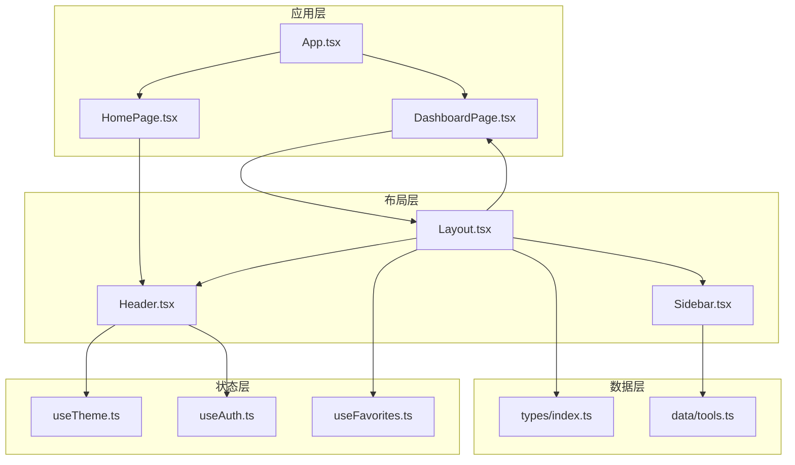
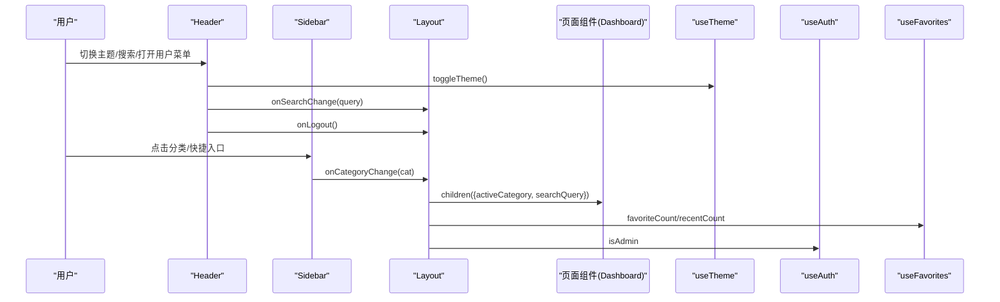
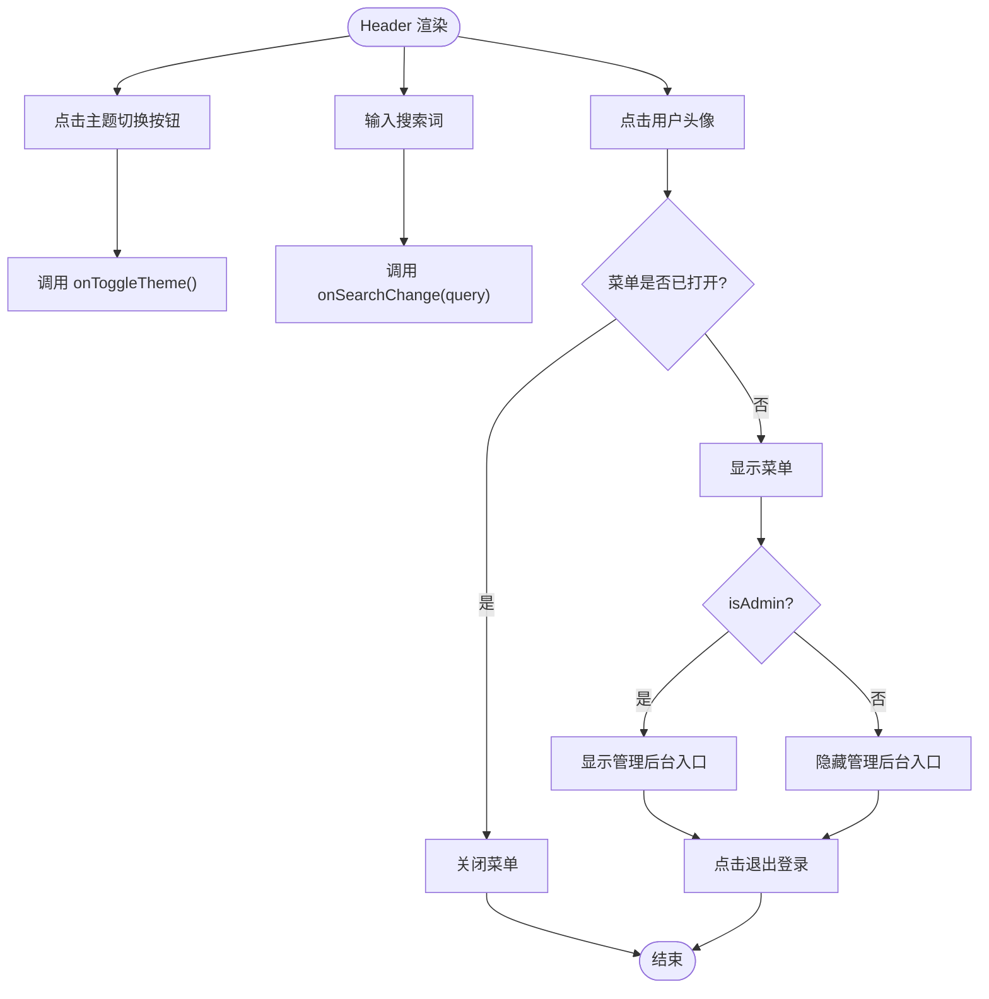
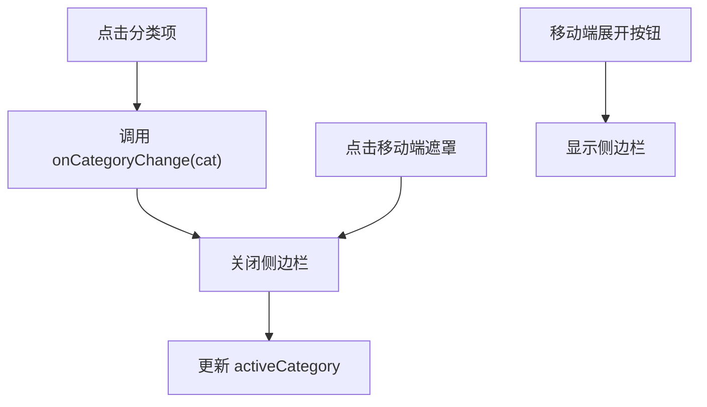
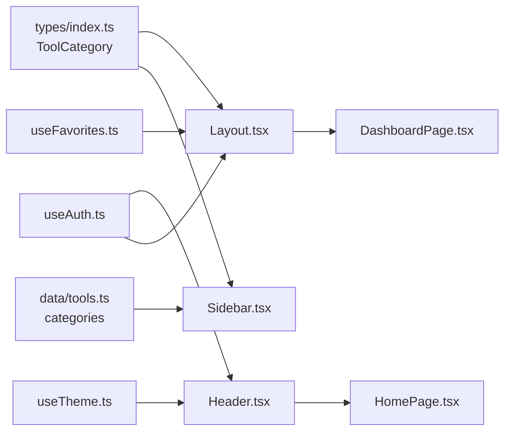

# 布局组件

<cite>
**本文引用的文件**
- [Layout.tsx](file://src/components/layout/Layout.tsx)
- [Header.tsx](file://src/components/layout/Header.tsx)
- [Sidebar.tsx](file://src/components/layout/Sidebar.tsx)
- [useTheme.ts](file://src/hooks/useTheme.ts)
- [useAuth.ts](file://src/hooks/useAuth.ts)
- [useFavorites.ts](file://src/hooks/useFavorites.ts)
- [index.ts](file://src/types/index.ts)
- [tools.ts](file://src/data/tools.ts)
- [App.tsx](file://src/App.tsx)
- [DashboardPage.tsx](file://src/pages/DashboardPage.tsx)
- [HomePage.tsx](file://src/pages/HomePage.tsx)
</cite>

## 目录
1. [简介](#简介)
2. [项目结构](#项目结构)
3. [核心组件](#核心组件)
4. [架构总览](#架构总览)
5. [详细组件分析](#详细组件分析)
6. [依赖关系分析](#依赖关系分析)
7. [性能考虑](#性能考虑)
8. [故障排除指南](#故障排除指南)
9. [结论](#结论)
10. [附录](#附录)

## 简介
本文件系统性梳理并深入解读布局组件体系，重点覆盖以下三部分：
- Layout 容器组件：统一承载 Header、Sidebar 与主内容区，负责状态管理与子组件协调
- Header 导航组件：提供主题切换、用户菜单、搜索框与管理员入口
- Sidebar 分类导航组件：提供工具分类筛选、收藏与最近使用计数、响应式交互

同时，文档将阐明组件间通信机制（props 传递、事件回调、状态提升），并给出可直接参考的代码片段路径，帮助读者快速上手与扩展。

## 项目结构
布局组件位于 src/components/layout 目录，配合 hooks 与数据源共同工作：
- 布局层：Layout、Header、Sidebar
- 状态层：useTheme、useAuth、useFavorites
- 类型与数据：types/index.ts、data/tools.ts
- 页面层：App、DashboardPage、HomePage



图表来源
- [App.tsx:12-60](file://src/App.tsx#L12-L60)
- [DashboardPage.tsx:26-48](file://src/pages/DashboardPage.tsx#L26-L48)
- [Layout.tsx:20-69](file://src/components/layout/Layout.tsx#L20-L69)
- [Header.tsx:21-158](file://src/components/layout/Header.tsx#L21-L158)
- [Sidebar.tsx:17-144](file://src/components/layout/Sidebar.tsx#L17-L144)
- [useTheme.ts:5-31](file://src/hooks/useTheme.ts#L5-L31)
- [useAuth.ts:20-88](file://src/hooks/useAuth.ts#L20-L88)
- [useFavorites.ts:16-69](file://src/hooks/useFavorites.ts#L16-L69)
- [index.ts:15-27](file://src/types/index.ts#L15-L27)
- [tools.ts:34-41](file://src/data/tools.ts#L34-L41)

章节来源
- [App.tsx:12-60](file://src/App.tsx#L12-L60)
- [DashboardPage.tsx:26-48](file://src/pages/DashboardPage.tsx#L26-L48)
- [Layout.tsx:20-69](file://src/components/layout/Layout.tsx#L20-L69)
- [Header.tsx:21-158](file://src/components/layout/Header.tsx#L21-L158)
- [Sidebar.tsx:17-144](file://src/components/layout/Sidebar.tsx#L17-L144)
- [useTheme.ts:5-31](file://src/hooks/useTheme.ts#L5-L31)
- [useAuth.ts:20-88](file://src/hooks/useAuth.ts#L20-L88)
- [useFavorites.ts:16-69](file://src/hooks/useFavorites.ts#L16-L69)
- [index.ts:15-27](file://src/types/index.ts#L15-L27)
- [tools.ts:34-41](file://src/data/tools.ts#L34-L41)

## 核心组件
- Layout：容器组件，集中管理侧边栏开关、当前分类、搜索关键词，并通过 render props 将状态传递给子页面组件；同时注入主题切换、用户登出、管理员入口等能力
- Header：顶部导航栏，包含 Logo、搜索框、主题切换按钮、用户菜单（含管理员入口）、版本日志入口
- Sidebar：左侧分类导航，包含“全部工具”“我的收藏”“最近使用”快捷入口、工具分类列表、管理员入口、移动端遮罩与响应式定位

章节来源
- [Layout.tsx:6-18](file://src/components/layout/Layout.tsx#L6-L18)
- [Header.tsx:10-19](file://src/components/layout/Header.tsx#L10-L19)
- [Sidebar.tsx:7-15](file://src/components/layout/Sidebar.tsx#L7-L15)

## 架构总览
布局组件采用“容器 + 展示”的分层设计：
- 容器层（Layout）负责状态与路由协调，向子组件以 props 和 render props 的形式注入能力
- 展示层（Header、Sidebar）专注 UI 行为与交互，通过回调向上游传递状态变更
- 状态钩子（useTheme、useAuth、useFavorites）提供跨组件共享的状态与副作用



图表来源
- [Layout.tsx:30-60](file://src/components/layout/Layout.tsx#L30-L60)
- [Header.tsx:31-44](file://src/components/layout/Header.tsx#L31-L44)
- [Sidebar.tsx:27-30](file://src/components/layout/Sidebar.tsx#L27-L30)
- [DashboardPage.tsx:37-46](file://src/pages/DashboardPage.tsx#L37-L46)
- [useTheme.ts:22-24](file://src/hooks/useTheme.ts#L22-L24)
- [useAuth.ts:85](file://src/hooks/useAuth.ts#L85)
- [useFavorites.ts:16-21](file://src/hooks/useFavorites.ts#L16-L21)

## 详细组件分析

### Layout 容器组件
- 职责与设计模式
  - 状态集中管理：侧边栏开关、活动分类、搜索关键词
  - 子组件协调：通过 render props 将状态传递给页面组件，实现“容器-展示”解耦
  - 能力注入：主题切换、用户登出、管理员入口、收藏/最近计数
- 关键实现要点
  - 使用 useState 维护 sidebarOpen、activeCategory、searchQuery
  - 将 Header 与 Sidebar 的回调函数绑定到本地状态
  - children(props) 形式的 render props 将 activeCategory 与 searchQuery 传入页面
- 扩展建议
  - 可增加“最近使用”计数的本地缓存与服务端同步
  - 可引入节流/防抖处理搜索输入

```mermaid
classDiagram
class Layout {
+props : theme, onToggleTheme, userName, onLogout, favoriteCount, recentCount, isAdmin
+state : sidebarOpen, activeCategory, searchQuery
+render() : JSX.Element
}
class Header {
+props : theme, onToggleTheme, onToggleSidebar, userName, onLogout, searchQuery, onSearchChange, isAdmin
+render() : JSX.Element
}
class Sidebar {
+props : isOpen, onClose, activeCategory, onCategoryChange, favoriteCount, recentCount, isAdmin
+render() : JSX.Element
}
Layout --> Header : "组合"
Layout --> Sidebar : "组合"
Layout --> "children(render props)" : "传递状态"
```

图表来源
- [Layout.tsx:20-69](file://src/components/layout/Layout.tsx#L20-L69)
- [Header.tsx:21-158](file://src/components/layout/Header.tsx#L21-L158)
- [Sidebar.tsx:17-144](file://src/components/layout/Sidebar.tsx#L17-L144)

章节来源
- [Layout.tsx:20-69](file://src/components/layout/Layout.tsx#L20-L69)

### Header 导航组件
- 功能清单
  - 主题切换：根据当前主题显示太阳/月亮图标，调用 onToggleTheme
  - 用户菜单：显示用户名与部门，支持“个人设置”“退出登录”，管理员入口
  - 搜索功能：受控输入框，支持 ESC 清空
  - 版本日志入口：集成版本更新提示
  - 移动端适配：在小屏下显示“展开侧边栏”按钮
- 交互细节
  - 点击外部区域自动关闭用户菜单
  - 管理员入口仅在 isAdmin 为真时显示
  - 搜索框右侧 ESC 按钮用于一键清空



图表来源
- [Header.tsx:31-44](file://src/components/layout/Header.tsx#L31-L44)
- [Header.tsx:113-152](file://src/components/layout/Header.tsx#L113-L152)
- [Header.tsx:106-111](file://src/components/layout/Header.tsx#L106-L111)
- [Header.tsx:77-93](file://src/components/layout/Header.tsx#L77-L93)

章节来源
- [Header.tsx:21-158](file://src/components/layout/Header.tsx#L21-L158)

### Sidebar 分类导航组件
- 功能清单
  - 快捷入口：全部工具、我的收藏、最近使用；收藏/最近计数通过 badge 显示
  - 工具分类：遍历 categories 渲染分类项，支持激活态样式
  - 管理员入口：仅在 isAdmin 为真时显示
  - 响应式设计：移动端遮罩层、抽屉式滑入/滑出、lg 断点后固定定位
- 交互细节
  - 点击分类项触发 onCategoryChange 并自动关闭侧边栏
  - 使用 useLocation 判断当前路由，高亮对应入口
  - 支持移动端点击遮罩关闭



图表来源
- [Sidebar.tsx:27-30](file://src/components/layout/Sidebar.tsx#L27-L30)
- [Sidebar.tsx:35-40](file://src/components/layout/Sidebar.tsx#L35-L40)
- [Sidebar.tsx:42-46](file://src/components/layout/Sidebar.tsx#L42-L46)
- [tools.ts:34-41](file://src/data/tools.ts#L34-L41)

章节来源
- [Sidebar.tsx:17-144](file://src/components/layout/Sidebar.tsx#L17-L144)
- [tools.ts:34-41](file://src/data/tools.ts#L34-L41)

### 组件间通信机制
- Props 传递
  - Layout 向 Header 注入 theme、onToggleTheme、userName、onLogout、searchQuery、onSearchChange、isAdmin
  - Layout 向 Sidebar 注入 isOpen、onClose、activeCategory、onCategoryChange、favoriteCount、recentCount、isAdmin
  - Layout 通过 children(render props) 向页面组件注入 activeCategory 与 searchQuery
- 事件回调
  - Header.onSearchChange 更新 Layout 的 searchQuery
  - Sidebar.onCategoryChange 更新 Layout 的 activeCategory
  - Header.onLogout 触发登出流程
  - Header.onToggleSidebar 控制侧边栏开关
- 状态提升
  - 主题状态由 useTheme 提供，Layout 仅消费与切换
  - 收藏/最近使用计数由 useFavorites 提供，Layout 注入到 Header/Sidebar
  - 用户信息与管理员权限由 useAuth 提供，贯穿 Header/Sidebar/Layout

章节来源
- [Layout.tsx:38-57](file://src/components/layout/Layout.tsx#L38-L57)
- [Header.tsx:21-29](file://src/components/layout/Header.tsx#L21-L29)
- [Sidebar.tsx:17-25](file://src/components/layout/Sidebar.tsx#L17-L25)
- [DashboardPage.tsx:37-46](file://src/pages/DashboardPage.tsx#L37-L46)

### 实际使用与扩展示例（代码片段路径）
- 在页面中使用 Layout 包裹内容
  - [DashboardPage.tsx:28-47](file://src/pages/DashboardPage.tsx#L28-L47)
- 在 HomePage 中直接使用 Header（无 Sidebar）
  - [HomePage.tsx:42-51](file://src/pages/HomePage.tsx#L42-L51)
- 在 App 中进行主题、认证、收藏状态的初始化与注入
  - [App.tsx:12-33](file://src/App.tsx#L12-L33)
- 扩展 Header：添加新的用户菜单项
  - [Header.tsx:121-152](file://src/components/layout/Header.tsx#L121-L152)
- 扩展 Sidebar：新增快捷入口或分类项
  - [Sidebar.tsx:78-129](file://src/components/layout/Sidebar.tsx#L78-L129)
- 自定义主题切换逻辑
  - [useTheme.ts:22-28](file://src/hooks/useTheme.ts#L22-L28)
- 管理员入口控制
  - [Header.tsx:127-136](file://src/components/layout/Header.tsx#L127-L136)
  - [Sidebar.tsx:98-112](file://src/components/layout/Sidebar.tsx#L98-L112)

## 依赖关系分析
- 类型与数据
  - ToolCategory 定义于 types/index.ts，被 Layout、Sidebar、tools.ts 共同使用
  - categories 来源于 data/tools.ts，用于 Sidebar 的分类渲染
- 状态钩子
  - useTheme：提供 theme 与 toggleTheme
  - useAuth：提供 user、isAdmin、login、logout
  - useFavorites：提供 favorites、recentIds、toggleFavorite、addRecent
- 页面与布局
  - DashboardPage 通过 Layout 将状态传递给 ToolGrid
  - HomePage 直接使用 Header，不使用 Layout



图表来源
- [index.ts:15-27](file://src/types/index.ts#L15-L27)
- [tools.ts:34-41](file://src/data/tools.ts#L34-L41)
- [useTheme.ts:5-31](file://src/hooks/useTheme.ts#L5-L31)
- [useAuth.ts:20-88](file://src/hooks/useAuth.ts#L20-L88)
- [useFavorites.ts:16-69](file://src/hooks/useFavorites.ts#L16-L69)
- [Layout.tsx:20-69](file://src/components/layout/Layout.tsx#L20-L69)
- [DashboardPage.tsx:26-48](file://src/pages/DashboardPage.tsx#L26-L48)
- [HomePage.tsx:42-51](file://src/pages/HomePage.tsx#L42-L51)

章节来源
- [index.ts:15-27](file://src/types/index.ts#L15-L27)
- [tools.ts:34-41](file://src/data/tools.ts#L34-L41)
- [useTheme.ts:5-31](file://src/hooks/useTheme.ts#L5-L31)
- [useAuth.ts:20-88](file://src/hooks/useAuth.ts#L20-L88)
- [useFavorites.ts:16-69](file://src/hooks/useFavorites.ts#L16-L69)
- [Layout.tsx:20-69](file://src/components/layout/Layout.tsx#L20-L69)
- [DashboardPage.tsx:26-48](file://src/pages/DashboardPage.tsx#L26-L48)
- [HomePage.tsx:42-51](file://src/pages/HomePage.tsx#L42-L51)

## 性能考虑
- 渲染优化
  - Header 中的笑话列表通过 useMemo 缓存，避免重复计算
  - Sidebar 使用 cn 组合条件样式，减少不必要的 DOM 变更
- 交互优化
  - Layout 对搜索输入采用受控组件，避免频繁重渲染
  - 移动端侧边栏使用 translateX 进行动画，利用 GPU 加速
- 状态管理
  - useTheme、useAuth、useFavorites 将状态提升至顶层，减少重复订阅
  - Layout 的 render props 仅在必要时重新渲染子组件

章节来源
- [Header.tsx:34](file://src/components/layout/Header.tsx#L34)
- [Sidebar.tsx:42-46](file://src/components/layout/Sidebar.tsx#L42-L46)
- [Layout.tsx:30-34](file://src/components/layout/Layout.tsx#L30-L34)

## 故障排除指南
- 主题切换无效
  - 检查 useTheme 的 toggleTheme 是否被正确传递到 Header
  - 确认根节点 HTML 上的 light/dark 类名是否正确切换
  - 参考路径：[useTheme.ts:22-24](file://src/hooks/useTheme.ts#L22-L24)、[Header.tsx:106-111](file://src/components/layout/Header.tsx#L106-L111)
- 登录后无法进入 Dashboard
  - 确认 App 中 useAuth 的 user 状态是否正确写入 localStorage
  - 检查 useAuth 的 login/logout 流程是否成功
  - 参考路径：[App.tsx:17-19](file://src/App.tsx#L17-L19)、[useAuth.ts:58-79](file://src/hooks/useAuth.ts#L58-L79)
- 收藏/最近使用计数不更新
  - 确认 useFavorites 的 favorites 与 recentIds 是否从服务端正确拉取
  - 检查 toggleFavorite 与 addRecent 的调用链路
  - 参考路径：[useFavorites.ts:23-32](file://src/hooks/useFavorites.ts#L23-L32)、[useFavorites.ts:34-53](file://src/hooks/useFavorites.ts#L34-L53)
- 侧边栏无法关闭
  - 检查移动端遮罩点击事件与 onClose 回调
  - 确认 Sidebar 的 isOpen 状态与 Layout 的 sidebarOpen 同步
  - 参考路径：[Sidebar.tsx:35-40](file://src/components/layout/Sidebar.tsx#L35-L40)、[Layout.tsx:30](file://src/components/layout/Layout.tsx#L30)

章节来源
- [useTheme.ts:22-24](file://src/hooks/useTheme.ts#L22-L24)
- [Header.tsx:106-111](file://src/components/layout/Header.tsx#L106-L111)
- [App.tsx:17-19](file://src/App.tsx#L17-L19)
- [useAuth.ts:58-79](file://src/hooks/useAuth.ts#L58-L79)
- [useFavorites.ts:23-32](file://src/hooks/useFavorites.ts#L23-L32)
- [useFavorites.ts:34-53](file://src/hooks/useFavorites.ts#L34-L53)
- [Sidebar.tsx:35-40](file://src/components/layout/Sidebar.tsx#L35-L40)
- [Layout.tsx:30](file://src/components/layout/Layout.tsx#L30)

## 结论
本布局组件体系通过清晰的职责划分与稳定的通信机制，实现了主题、用户、分类与搜索等核心功能的统一管理。Layout 作为容器承担状态与协调，Header 与 Sidebar 专注于各自领域的交互体验，配合 hooks 提供的状态共享，形成高内聚、低耦合的前端架构。按本文提供的扩展路径与最佳实践，可安全地对组件进行二次开发与功能增强。

## 附录
- 类型定义参考
  - [index.ts:15-27](file://src/types/index.ts#L15-L27)
- 工具分类数据参考
  - [tools.ts:34-41](file://src/data/tools.ts#L34-L41)
- 页面使用示例
  - [DashboardPage.tsx:28-47](file://src/pages/DashboardPage.tsx#L28-L47)
  - [HomePage.tsx:42-51](file://src/pages/HomePage.tsx#L42-L51)