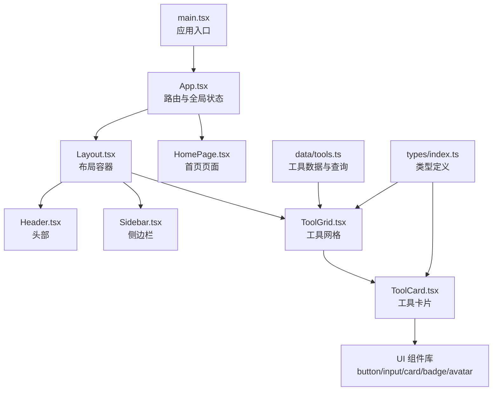
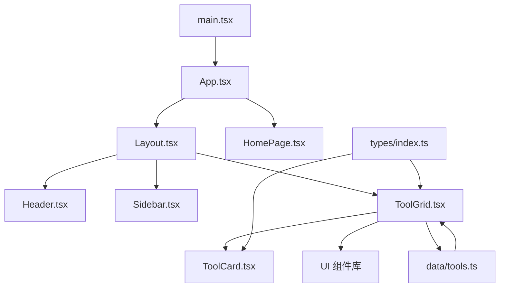
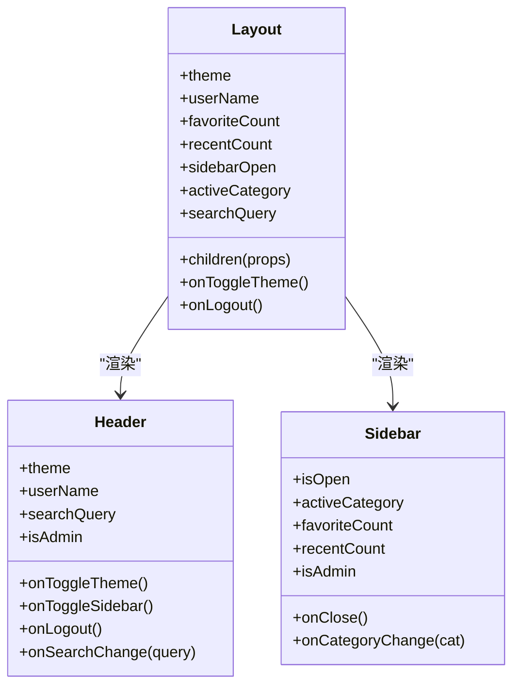
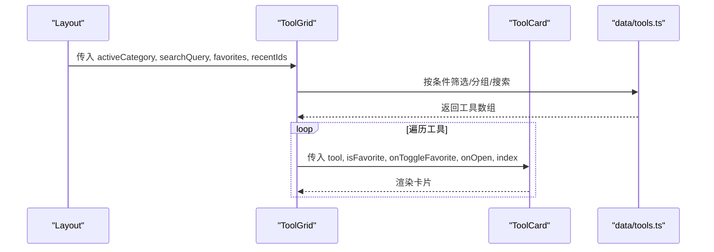
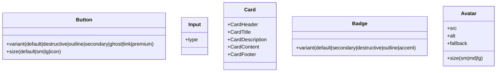
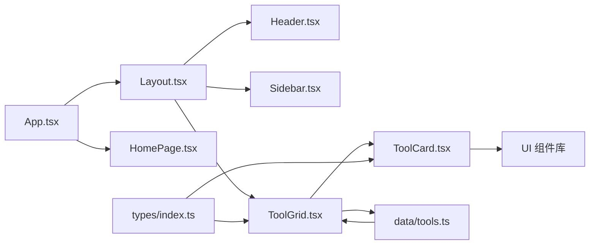

# 组件架构设计

<cite>
**本文引用的文件**
- [src/App.tsx](file://src/App.tsx)
- [src/main.tsx](file://src/main.tsx)
- [src/components/layout/Layout.tsx](file://src/components/layout/Layout.tsx)
- [src/components/layout/Header.tsx](file://src/components/layout/Header.tsx)
- [src/components/layout/Sidebar.tsx](file://src/components/layout/Sidebar.tsx)
- [src/components/tools/ToolCard.tsx](file://src/components/tools/ToolCard.tsx)
- [src/components/tools/ToolGrid.tsx](file://src/components/tools/ToolGrid.tsx)
- [src/components/ui/button.tsx](file://src/components/ui/button.tsx)
- [src/components/ui/card.tsx](file://src/components/ui/card.tsx)
- [src/components/ui/input.tsx](file://src/components/ui/input.tsx)
- [src/components/ui/badge.tsx](file://src/components/ui/badge.tsx)
- [src/components/ui/avatar.tsx](file://src/components/ui/avatar.tsx)
- [src/pages/HomePage.tsx](file://src/pages/HomePage.tsx)
- [src/data/tools.ts](file://src/data/tools.ts)
- [src/types/index.ts](file://src/types/index.ts)
</cite>

## 目录
1. [简介](#简介)
2. [项目结构](#项目结构)
3. [核心组件](#核心组件)
4. [架构总览](#架构总览)
5. [详细组件分析](#详细组件分析)
6. [依赖关系分析](#依赖关系分析)
7. [性能考量](#性能考量)
8. [故障排查指南](#故障排查指南)
9. [结论](#结论)
10. [附录](#附录)

## 简介
本文件系统性梳理了项目的组件架构设计，重点覆盖以下方面：
- 布局组件（Layout、Header、Sidebar）的分层职责与协作方式
- 工具组件（ToolCard、ToolGrid）的数据流与复用机制
- UI 组件库（按钮、输入框、卡片、徽章、头像）的设计理念与扩展路径
- 组件间通信模式（props 传递、事件处理、状态提升）
- 组件开发最佳实践（命名规范、属性设计、事件处理）
- 可复用组件结构的代码示例路径

## 项目结构
项目采用“按功能域分层”的组织方式，前端代码主要位于 src 目录，核心层次如下：
- 入口与路由：main.tsx 引导应用，App.tsx 统一注入全局状态并配置路由
- 页面层：各业务页面（如 HomePage、ToolPage 等）负责场景化展示
- 布局层：Layout 提供容器与骨架，Header/Sidebar 提供头部与侧边导航
- 工具层：ToolGrid 负责工具列表渲染与筛选，ToolCard 负责单个工具项
- UI 组件库：button、input、card、badge、avatar 等通用基础组件
- 数据与类型：data/tools.ts 提供工具数据与查询方法，types/index.ts 定义类型

图表来源
- [src/main.tsx:1-14](file://src/main.tsx#L1-L14)
- [src/App.tsx:1-63](file://src/App.tsx#L1-L63)
- [src/components/layout/Layout.tsx:1-70](file://src/components/layout/Layout.tsx#L1-L70)
- [src/components/layout/Header.tsx:1-159](file://src/components/layout/Header.tsx#L1-L159)
- [src/components/layout/Sidebar.tsx:1-181](file://src/components/layout/Sidebar.tsx#L1-L181)
- [src/components/tools/ToolGrid.tsx:1-136](file://src/components/tools/ToolGrid.tsx#L1-L136)
- [src/components/tools/ToolCard.tsx:1-66](file://src/components/tools/ToolCard.tsx#L1-L66)
- [src/components/ui/button.tsx:1-50](file://src/components/ui/button.tsx#L1-L50)
- [src/components/ui/input.tsx:1-25](file://src/components/ui/input.tsx#L1-L25)
- [src/components/ui/card.tsx:1-76](file://src/components/ui/card.tsx#L1-L76)
- [src/components/ui/badge.tsx:1-34](file://src/components/ui/badge.tsx#L1-L34)
- [src/components/ui/avatar.tsx:1-40](file://src/components/ui/avatar.tsx#L1-L40)
- [src/pages/HomePage.tsx:1-212](file://src/pages/HomePage.tsx#L1-L212)
- [src/data/tools.ts:1-316](file://src/data/tools.ts#L1-L316)
- [src/types/index.ts:1-37](file://src/types/index.ts#L1-L37)

章节来源
- [src/main.tsx:1-14](file://src/main.tsx#L1-L14)
- [src/App.tsx:1-63](file://src/App.tsx#L1-L63)

## 核心组件
本节聚焦布局、工具与 UI 组件的核心职责与交互。

- 布局容器 Layout
  - 职责：统一承载 Header、Sidebar 与主内容区；维护侧边栏开关、活动分类、搜索词等状态；通过 children 渲染插槽内容
  - 关键点：使用函数子组件（render props）向子组件暴露 activeCategory 与 searchQuery，实现状态提升与解耦
- 头部 Header
  - 职责：主题切换、搜索输入、用户菜单、版本日志入口；内部维护菜单展开状态与外部点击关闭逻辑
  - 关键点：使用 memo 化缓存笑话列表，减少重复计算；与 Layout 协作完成搜索状态回传
- 侧边栏 Sidebar
  - 职责：导航快速入口（全部工具、收藏、最近）、分类导航、管理入口；根据当前路径高亮选中项
  - 关键点：移动端覆盖层与抽屉式动画；支持管理员入口；通过 badge 展示收藏与最近数量
- 工具网格 ToolGrid
  - 职责：根据活动分类与搜索词过滤工具集；支持分组展示与空态提示；调用 ToolCard 渲染单个工具
  - 关键点：集中处理“全部/收藏/最近/分类/搜索”五种视图分支；空态组件化
- 工具卡片 ToolCard
  - 职责：展示工具图标、名称、描述、徽章；支持收藏切换与打开操作；提供键盘可访问性
  - 关键点：收藏态样式与悬停态联动；动画延迟实现入场序列
- UI 组件库
  - Button：基于变体与尺寸的 CVA 架构，支持多种风格与尺寸
  - Input：统一输入样式与焦点态，透传原生属性
  - Card：卡片容器与语义化子组件（Header/Title/Description/Content/Footer）
  - Badge：多变体徽章，用于标识“热门/新增”等状态
  - Avatar：支持 src/fallback 与多尺寸映射

章节来源
- [src/components/layout/Layout.tsx:1-70](file://src/components/layout/Layout.tsx#L1-L70)
- [src/components/layout/Header.tsx:1-159](file://src/components/layout/Header.tsx#L1-L159)
- [src/components/layout/Sidebar.tsx:1-181](file://src/components/layout/Sidebar.tsx#L1-L181)
- [src/components/tools/ToolGrid.tsx:1-136](file://src/components/tools/ToolGrid.tsx#L1-L136)
- [src/components/tools/ToolCard.tsx:1-66](file://src/components/tools/ToolCard.tsx#L1-L66)
- [src/components/ui/button.tsx:1-50](file://src/components/ui/button.tsx#L1-L50)
- [src/components/ui/input.tsx:1-25](file://src/components/ui/input.tsx#L1-L25)
- [src/components/ui/card.tsx:1-76](file://src/components/ui/card.tsx#L1-L76)
- [src/components/ui/badge.tsx:1-34](file://src/components/ui/badge.tsx#L1-L34)
- [src/components/ui/avatar.tsx:1-40](file://src/components/ui/avatar.tsx#L1-L40)

## 架构总览
下图展示了从入口到页面再到布局与工具组件的整体流程，以及数据与类型的支撑关系。

图表来源
- [src/main.tsx:1-14](file://src/main.tsx#L1-L14)
- [src/App.tsx:1-63](file://src/App.tsx#L1-L63)
- [src/components/layout/Layout.tsx:1-70](file://src/components/layout/Layout.tsx#L1-L70)
- [src/components/layout/Header.tsx:1-159](file://src/components/layout/Header.tsx#L1-L159)
- [src/components/layout/Sidebar.tsx:1-181](file://src/components/layout/Sidebar.tsx#L1-L181)
- [src/components/tools/ToolGrid.tsx:1-136](file://src/components/tools/ToolGrid.tsx#L1-L136)
- [src/components/tools/ToolCard.tsx:1-66](file://src/components/tools/ToolCard.tsx#L1-L66)
- [src/pages/HomePage.tsx:1-212](file://src/pages/HomePage.tsx#L1-L212)
- [src/data/tools.ts:1-316](file://src/data/tools.ts#L1-L316)
- [src/types/index.ts:1-37](file://src/types/index.ts#L1-L37)

## 详细组件分析

### 布局组件：Layout、Header、Sidebar
- 设计模式
  - 容器-展示分离：Layout 作为容器，负责状态与布局；Header/Sidebar 专注各自 UI 与交互
  - 函数子组件（Render Props）：Layout 将 activeCategory 与 searchQuery 以参数形式传递给 children，便于子组件直接消费
  - 状态提升：搜索词与分类选择由 Layout 维护，再通过 props 下发，避免多处状态分散
- 职责分工
  - Layout：侧边栏开关、分类与搜索状态、主内容区包裹
  - Header：主题切换、搜索输入、用户菜单、版本日志
  - Sidebar：导航项高亮、快速入口、分类列表、管理员入口
- 通信机制
  - Header -> Layout：onSearchChange、onToggleSidebar、onLogout
  - Sidebar -> Layout：onCategoryChange、onClose
  - Layout -> 子组件：activeCategory、searchQuery、theme、onToggleTheme 等

图表来源
- [src/components/layout/Layout.tsx:1-70](file://src/components/layout/Layout.tsx#L1-L70)
- [src/components/layout/Header.tsx:1-159](file://src/components/layout/Header.tsx#L1-L159)
- [src/components/layout/Sidebar.tsx:1-181](file://src/components/layout/Sidebar.tsx#L1-L181)

章节来源
- [src/components/layout/Layout.tsx:1-70](file://src/components/layout/Layout.tsx#L1-L70)
- [src/components/layout/Header.tsx:1-159](file://src/components/layout/Header.tsx#L1-L159)
- [src/components/layout/Sidebar.tsx:1-181](file://src/components/layout/Sidebar.tsx#L1-L181)

### 工具组件：ToolCard、ToolGrid
- 设计模式
  - 组合优先：ToolGrid 负责数据筛选与分组，ToolCard 负责单个项渲染，二者通过 props 解耦
  - 空态组件化：EmptyState 抽象“无数据”场景，提升可读性与可维护性
  - 动画与可访问性：ToolCard 使用动画延迟与键盘事件增强体验
- 数据流
  - ToolGrid 根据 activeCategory 与 searchQuery 决定展示列表；对 favorites/recentIds 进行过滤与排序
  - ToolCard 接收 isFavorite/onToggleFavorite/onOpen/index，分别控制收藏态、收藏切换与打开行为
- 复用机制
  - ToolGrid 支持“全部/收藏/最近/分类/搜索”五种视图，通过统一接口适配不同场景
  - ToolCard 仅关注单个工具项，便于在不同上下文复用

图表来源
- [src/components/layout/Layout.tsx:1-70](file://src/components/layout/Layout.tsx#L1-L70)
- [src/components/tools/ToolGrid.tsx:1-136](file://src/components/tools/ToolGrid.tsx#L1-L136)
- [src/components/tools/ToolCard.tsx:1-66](file://src/components/tools/ToolCard.tsx#L1-L66)
- [src/data/tools.ts:1-316](file://src/data/tools.ts#L1-L316)

章节来源
- [src/components/tools/ToolGrid.tsx:1-136](file://src/components/tools/ToolGrid.tsx#L1-L136)
- [src/components/tools/ToolCard.tsx:1-66](file://src/components/tools/ToolCard.tsx#L1-L66)
- [src/data/tools.ts:1-316](file://src/data/tools.ts#L1-L316)

### UI 组件库：Button、Input、Card、Badge、Avatar
- 设计理念
  - Button：基于 CVA 的变体与尺寸体系，统一过渡与聚焦态，支持渐变风格与尺寸扩展
  - Input：最小必要封装，透传原生属性，统一边框、内边距与聚焦态
  - Card：语义化子组件组合，便于在不同页面复用卡片结构
  - Badge：多变体徽章，用于状态标识与视觉强调
  - Avatar：支持 src/fallback 与多尺寸映射，保证无图时的可用性
- 扩展建议
  - 为 Button 增加 loading 态与禁用态的统一处理
  - 为 Input 增加前缀/后缀图标与错误态样式
  - 为 Card 增加 actions 区域与 footer 对齐

图表来源
- [src/components/ui/button.tsx:1-50](file://src/components/ui/button.tsx#L1-L50)
- [src/components/ui/input.tsx:1-25](file://src/components/ui/input.tsx#L1-L25)
- [src/components/ui/card.tsx:1-76](file://src/components/ui/card.tsx#L1-L76)
- [src/components/ui/badge.tsx:1-34](file://src/components/ui/badge.tsx#L1-L34)
- [src/components/ui/avatar.tsx:1-40](file://src/components/ui/avatar.tsx#L1-L40)

章节来源
- [src/components/ui/button.tsx:1-50](file://src/components/ui/button.tsx#L1-L50)
- [src/components/ui/input.tsx:1-25](file://src/components/ui/input.tsx#L1-L25)
- [src/components/ui/card.tsx:1-76](file://src/components/ui/card.tsx#L1-L76)
- [src/components/ui/badge.tsx:1-34](file://src/components/ui/badge.tsx#L1-L34)
- [src/components/ui/avatar.tsx:1-40](file://src/components/ui/avatar.tsx#L1-L40)

### 页面组件：HomePage
- 设计要点
  - 作为首页场景，集成 Header、装饰元素与快捷入口
  - 使用 ToolShortcutCard 展示分类下的工具快捷入口，体现“首页直达”的体验
  - 与 Layout 的协作：Header 在此处被直接渲染，不参与侧边栏状态管理

章节来源
- [src/pages/HomePage.tsx:1-212](file://src/pages/HomePage.tsx#L1-L212)

## 依赖关系分析
- 组件依赖
  - Layout 依赖 Header、Sidebar 与其子组件
  - ToolGrid 依赖 ToolCard、data/tools.ts 与 types/index.ts
  - UI 组件库被广泛复用于 Header、Sidebar、ToolCard、ToolGrid 等
- 数据与类型
  - data/tools.ts 提供 categories、tools、getToolsByCategory、searchTools
  - types/index.ts 定义 Tool、ToolCategory、CategoryInfo、User 等核心类型
- 路由与入口
  - main.tsx 引导 BrowserRouter 与 StrictMode
  - App.tsx 注入全局状态并配置路由，将 Layout 作为页面容器

图表来源
- [src/App.tsx:1-63](file://src/App.tsx#L1-L63)
- [src/components/layout/Layout.tsx:1-70](file://src/components/layout/Layout.tsx#L1-L70)
- [src/components/layout/Header.tsx:1-159](file://src/components/layout/Header.tsx#L1-L159)
- [src/components/layout/Sidebar.tsx:1-181](file://src/components/layout/Sidebar.tsx#L1-L181)
- [src/components/tools/ToolGrid.tsx:1-136](file://src/components/tools/ToolGrid.tsx#L1-L136)
- [src/components/tools/ToolCard.tsx:1-66](file://src/components/tools/ToolCard.tsx#L1-L66)
- [src/components/ui/button.tsx:1-50](file://src/components/ui/button.tsx#L1-L50)
- [src/components/ui/input.tsx:1-25](file://src/components/ui/input.tsx#L1-L25)
- [src/components/ui/card.tsx:1-76](file://src/components/ui/card.tsx#L1-L76)
- [src/components/ui/badge.tsx:1-34](file://src/components/ui/badge.tsx#L1-L34)
- [src/components/ui/avatar.tsx:1-40](file://src/components/ui/avatar.tsx#L1-L40)
- [src/pages/HomePage.tsx:1-212](file://src/pages/HomePage.tsx#L1-L212)
- [src/data/tools.ts:1-316](file://src/data/tools.ts#L1-L316)
- [src/types/index.ts:1-37](file://src/types/index.ts#L1-L37)

章节来源
- [src/App.tsx:1-63](file://src/App.tsx#L1-L63)
- [src/data/tools.ts:1-316](file://src/data/tools.ts#L1-L316)
- [src/types/index.ts:1-37](file://src/types/index.ts#L1-L37)

## 性能考量
- 渲染优化
  - ToolGrid 中对“全部工具”进行分组渲染，避免单次渲染超大列表导致卡顿
  - ToolCard 使用动画延迟（index * 40ms）实现有序入场，提升感知性能
- 计算优化
  - Header 中对笑话列表使用 useMemo 缓存，降低重复计算
- 事件处理
  - ToolCard 中收藏按钮阻止事件冒泡，避免误触发卡片点击
- 建议
  - 对 ToolGrid 的筛选逻辑可引入防抖（debounce）处理高频搜索
  - 对 ToolCard 的动画延迟可根据设备性能动态调整

## 故障排查指南
- 问题：Header 用户菜单无法关闭
  - 排查：确认外部点击监听是否正确绑定与解绑；检查 menuOpen 状态切换逻辑
  - 参考路径：[src/components/layout/Header.tsx:36-44](file://src/components/layout/Header.tsx#L36-L44)
- 问题：ToolGrid 未显示任何工具
  - 排查：确认 activeCategory 与 searchQuery 是否正确传入；检查 favorites/recentIds 是否为空
  - 参考路径：[src/components/tools/ToolGrid.tsx:23-50](file://src/components/tools/ToolGrid.tsx#L23-L50)
- 问题：ToolCard 收藏按钮无效
  - 排查：确认 onToggleFavorite 回调是否正确传递；检查事件冒泡是否被阻止
  - 参考路径：[src/components/tools/ToolCard.tsx:29-43](file://src/components/tools/ToolCard.tsx#L29-L43)
- 问题：UI 组件样式异常
  - 排查：确认 variants 与 sizes 是否匹配；检查 className 合并顺序
  - 参考路径：[src/components/ui/button.tsx:5-30](file://src/components/ui/button.tsx#L5-L30)

章节来源
- [src/components/layout/Header.tsx:36-44](file://src/components/layout/Header.tsx#L36-L44)
- [src/components/tools/ToolGrid.tsx:23-50](file://src/components/tools/ToolGrid.tsx#L23-L50)
- [src/components/tools/ToolCard.tsx:29-43](file://src/components/tools/ToolCard.tsx#L29-L43)
- [src/components/ui/button.tsx:5-30](file://src/components/ui/button.tsx#L5-L30)

## 结论
本项目采用清晰的分层架构：入口与路由负责全局状态与导航，布局组件提供统一骨架，工具组件与 UI 组件库实现高内聚低耦合的复用。通过函数子组件与状态提升，实现了布局与内容的解耦；通过 CVA 与语义化组件，提升了 UI 的一致性与可扩展性。建议在高频交互场景引入防抖与性能监控，持续优化用户体验。

## 附录
- 组件开发最佳实践
  - 命名规范：组件首字母大写，文件名与组件名一致；私有辅助组件以下划线前缀
  - 属性设计：优先使用明确的类型定义；提供默认值与受控/非受控两种模式
  - 事件处理：统一回调命名（onXxx），避免在子组件中直接修改父组件状态
  - 可访问性：为交互元素提供 aria-label 或等价语义；支持键盘操作
  - 复用策略：将通用逻辑抽象为自定义 Hook 或 Render Props；保持单一职责

- 示例路径（展示如何创建可复用的组件结构）
  - 布局容器与函数子组件：[src/components/layout/Layout.tsx:6-18](file://src/components/layout/Layout.tsx#L6-L18)
  - 工具网格与空态组件：[src/components/tools/ToolGrid.tsx:15-136](file://src/components/tools/ToolGrid.tsx#L15-L136)
  - UI 组件变体与尺寸：[src/components/ui/button.tsx:5-30](file://src/components/ui/button.tsx#L5-L30)
  - 类型定义与数据查询：[src/types/index.ts:3-27](file://src/types/index.ts#L3-L27)，[src/data/tools.ts:303-316](file://src/data/tools.ts#L303-L316)