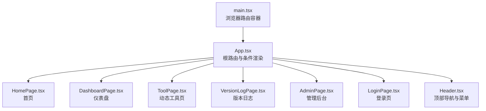
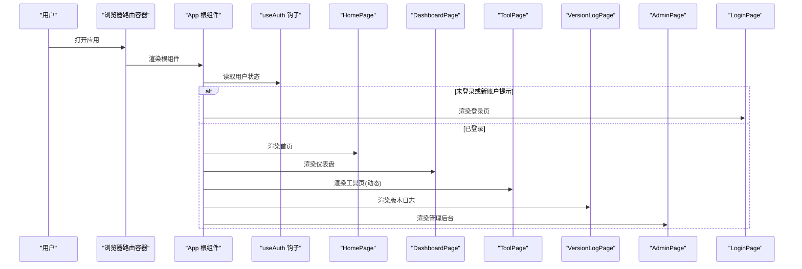
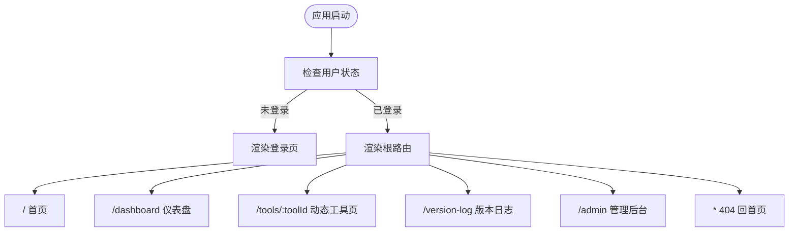
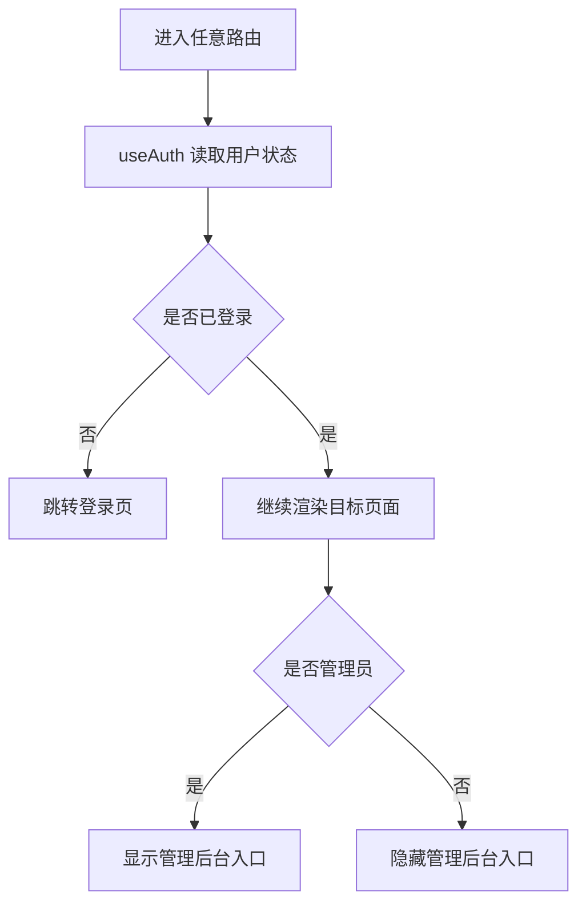
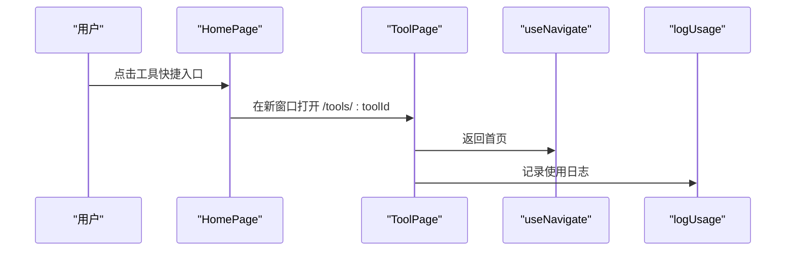
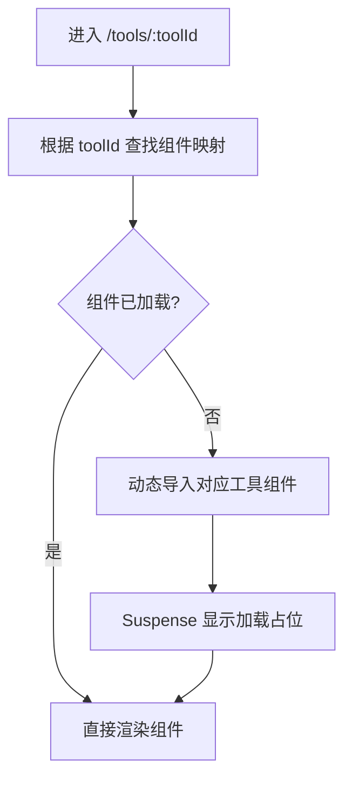
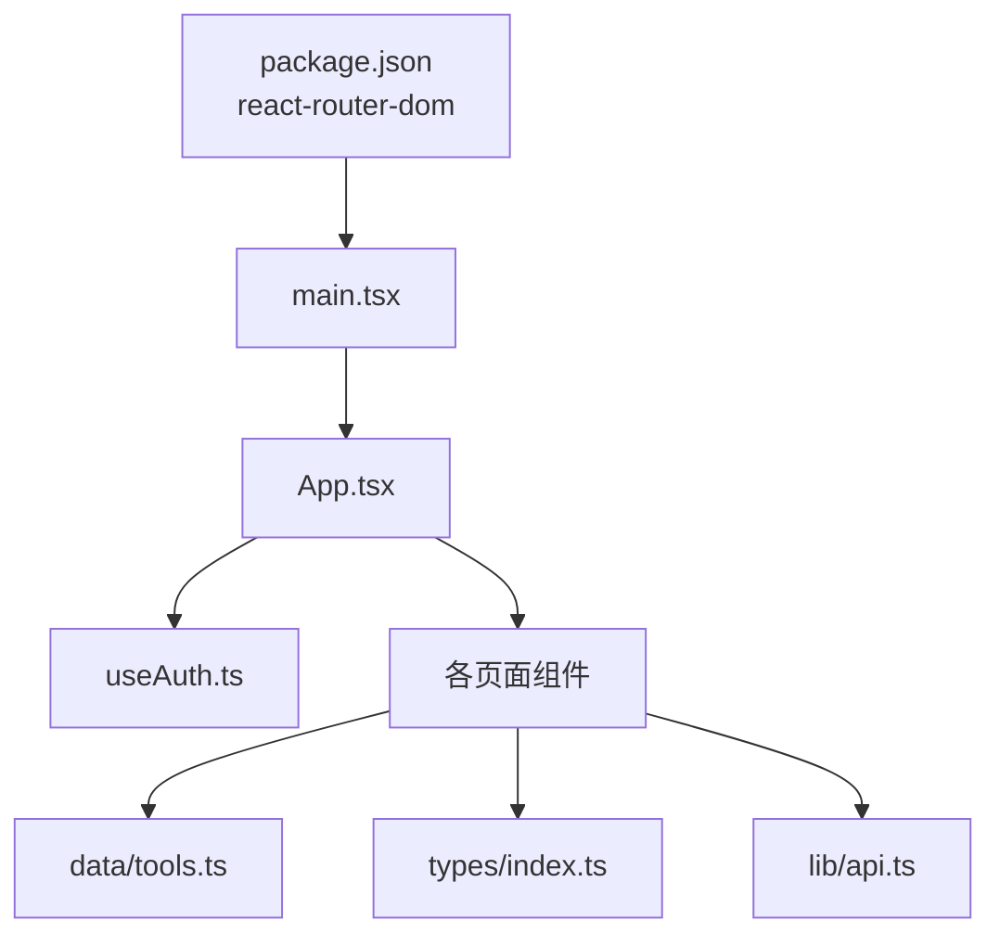

# 路由系统

<cite>
**本文引用的文件**
- [src/main.tsx](file://src/main.tsx)
- [src/App.tsx](file://src/App.tsx)
- [src/pages/HomePage.tsx](file://src/pages/HomePage.tsx)
- [src/pages/DashboardPage.tsx](file://src/pages/DashboardPage.tsx)
- [src/pages/ToolPage.tsx](file://src/pages/ToolPage.tsx)
- [src/pages/AdminPage.tsx](file://src/pages/AdminPage.tsx)
- [src/pages/LoginPage.tsx](file://src/pages/LoginPage.tsx)
- [src/pages/VersionLogPage.tsx](file://src/pages/VersionLogPage.tsx)
- [src/components/layout/Header.tsx](file://src/components/layout/Header.tsx)
- [src/hooks/useAuth.ts](file://src/hooks/useAuth.ts)
- [src/data/tools.ts](file://src/data/tools.ts)
- [src/lib/api.ts](file://src/lib/api.ts)
- [src/types/index.ts](file://src/types/index.ts)
- [package.json](file://package.json)
</cite>

## 目录
1. [简介](#简介)
2. [项目结构](#项目结构)
3. [核心组件](#核心组件)
4. [架构总览](#架构总览)
5. [详细组件分析](#详细组件分析)
6. [依赖关系分析](#依赖关系分析)
7. [性能考虑](#性能考虑)
8. [故障排查指南](#故障排查指南)
9. [结论](#结论)
10. [附录](#附录)

## 简介
本文件系统性梳理了前端路由体系，涵盖 React Router 的配置与使用、路由定义、嵌套路由、动态路由、页面组件组织、路由守卫、程序化与声明式导航、参数传递与查询字符串处理、懒加载与性能优化，以及实际路由配置与导航实现示例。读者无需深入源码即可理解整体设计与最佳实践。

## 项目结构
- 路由根节点位于应用入口，通过浏览器路由容器包裹整个应用树。
- 应用根据用户登录状态决定渲染内容：未登录时渲染登录页；已登录时渲染多级路由。
- 页面组件按功能划分：首页、仪表盘、工具页、版本日志、管理后台等。
- 路由守卫通过全局状态钩子实现认证与权限控制。

图表来源
- [src/main.tsx:1-14](file://src/main.tsx#L1-L14)
- [src/App.tsx:12-60](file://src/App.tsx#L12-L60)
- [src/pages/HomePage.tsx:18-138](file://src/pages/HomePage.tsx#L18-L138)
- [src/pages/DashboardPage.tsx:16-49](file://src/pages/DashboardPage.tsx#L16-L49)
- [src/pages/ToolPage.tsx:40-112](file://src/pages/ToolPage.tsx#L40-L112)
- [src/pages/VersionLogPage.tsx:70-127](file://src/pages/VersionLogPage.tsx#L70-L127)
- [src/pages/AdminPage.tsx:55-352](file://src/pages/AdminPage.tsx#L55-L352)
- [src/pages/LoginPage.tsx:22-249](file://src/pages/LoginPage.tsx#L22-L249)
- [src/components/layout/Header.tsx:21-158](file://src/components/layout/Header.tsx#L21-L158)

章节来源
- [src/main.tsx:1-14](file://src/main.tsx#L1-L14)
- [src/App.tsx:12-60](file://src/App.tsx#L12-L60)

## 核心组件
- 浏览器路由容器：在应用入口包裹整个应用树，启用浏览器历史模式。
- 根路由与条件渲染：根据用户登录状态决定渲染首页、仪表盘或登录页。
- 动态路由：工具页通过路径参数动态匹配具体工具。
- 嵌套路由：仪表盘页内部通过布局组件承载工具网格等子视图。
- 路由守卫：基于认证状态与管理员权限进行访问控制。
- 导航：声明式导航用于静态跳转，程序化导航用于动态跳转与回退。

章节来源
- [src/main.tsx:7-13](file://src/main.tsx#L7-L13)
- [src/App.tsx:17-19](file://src/App.tsx#L17-L19)
- [src/App.tsx:22-58](file://src/App.tsx#L22-L58)
- [src/pages/ToolPage.tsx:40-61](file://src/pages/ToolPage.tsx#L40-L61)
- [src/pages/DashboardPage.tsx:16-49](file://src/pages/DashboardPage.tsx#L16-L49)
- [src/hooks/useAuth.ts:20-88](file://src/hooks/useAuth.ts#L20-L88)

## 架构总览
路由系统采用“入口容器 + 根路由 + 条件渲染 + 动态路由”的组合模式。登录状态作为唯一守卫条件，管理员权限在界面层体现为菜单项与后台入口。

图表来源
- [src/main.tsx:7-13](file://src/main.tsx#L7-L13)
- [src/App.tsx:12-60](file://src/App.tsx#L12-L60)
- [src/hooks/useAuth.ts:20-88](file://src/hooks/useAuth.ts#L20-L88)

## 详细组件分析

### 路由定义与嵌套路由
- 入口容器：在应用根节点包裹浏览器路由容器，启用浏览器历史模式。
- 根路由：在根组件内定义多条静态路由，并根据登录状态进行条件渲染。
- 嵌套路由：仪表盘页通过布局组件承载子视图，形成页面级嵌套。
- 动态路由：工具页通过路径参数匹配具体工具 ID，实现动态渲染。

图表来源
- [src/main.tsx:7-13](file://src/main.tsx#L7-L13)
- [src/App.tsx:22-58](file://src/App.tsx#L22-L58)

章节来源
- [src/main.tsx:7-13](file://src/main.tsx#L7-L13)
- [src/App.tsx:22-58](file://src/App.tsx#L22-L58)
- [src/pages/DashboardPage.tsx:16-49](file://src/pages/DashboardPage.tsx#L16-L49)

### 页面组件组织
- 首页：展示欢迎信息、世界时钟、工具快捷入口等。
- 仪表盘：提供分类筛选、搜索、收藏与最近使用记录的工具网格视图。
- 工具页：根据工具 ID 动态加载对应工具组件，支持懒加载与错误处理。
- 版本日志：以时间线形式展示版本更新记录。
- 管理后台：用户管理、登录记录、操作审计三大模块，分页与搜索。
- 登录页：支持游客、账号密码、企业微信三种登录方式。

章节来源
- [src/pages/HomePage.tsx:18-138](file://src/pages/HomePage.tsx#L18-L138)
- [src/pages/DashboardPage.tsx:16-49](file://src/pages/DashboardPage.tsx#L16-L49)
- [src/pages/ToolPage.tsx:40-112](file://src/pages/ToolPage.tsx#L40-L112)
- [src/pages/VersionLogPage.tsx:70-127](file://src/pages/VersionLogPage.tsx#L70-L127)
- [src/pages/AdminPage.tsx:55-352](file://src/pages/AdminPage.tsx#L55-L352)
- [src/pages/LoginPage.tsx:22-249](file://src/pages/LoginPage.tsx#L22-L249)

### 路由守卫实现
- 认证检查：通过全局认证钩子读取本地存储中的用户信息，未登录时强制跳转至登录页。
- 权限验证：管理员标识在界面层体现为管理后台入口与菜单项，不涉及深层路由拦截。
- 新账户提示：首次登录创建账户后，登录页显示临时提示并允许清除。

图表来源
- [src/hooks/useAuth.ts:20-88](file://src/hooks/useAuth.ts#L20-L88)
- [src/components/layout/Header.tsx:127-136](file://src/components/layout/Header.tsx#L127-L136)
- [src/pages/LoginPage.tsx:94-133](file://src/pages/LoginPage.tsx#L94-L133)

章节来源
- [src/hooks/useAuth.ts:20-88](file://src/hooks/useAuth.ts#L20-L88)
- [src/components/layout/Header.tsx:127-136](file://src/components/layout/Header.tsx#L127-L136)
- [src/pages/LoginPage.tsx:94-133](file://src/pages/LoginPage.tsx#L94-L133)

### 程序化导航与声明式导航
- 声明式导航：使用链接组件进行静态跳转，例如返回首页、打开管理后台等。
- 程序化导航：使用导航钩子进行动态跳转与回退，例如工具页返回首页、仪表盘打开工具等。
- 参数传递：通过路径参数传递工具 ID，通过查询参数传递搜索关键词（在管理后台日志模块中体现）。

图表来源
- [src/pages/HomePage.tsx:158](file://src/pages/HomePage.tsx#L158)
- [src/pages/ToolPage.tsx:40-112](file://src/pages/ToolPage.tsx#L40-L112)
- [src/lib/api.ts:3-19](file://src/lib/api.ts#L3-L19)

章节来源
- [src/pages/HomePage.tsx:158](file://src/pages/HomePage.tsx#L158)
- [src/pages/ToolPage.tsx:40-112](file://src/pages/ToolPage.tsx#L40-L112)
- [src/lib/api.ts:3-19](file://src/lib/api.ts#L3-L19)

### 路由参数传递与查询字符串处理
- 动态路由参数：工具页通过路径参数接收工具 ID，用于定位具体工具与加载对应组件。
- 查询字符串：管理后台日志模块支持通过查询参数进行关键词搜索与分页控制。
- 本地状态：登录页通过本地状态管理新账户提示，避免跨路由持久化。

章节来源
- [src/pages/ToolPage.tsx:40-61](file://src/pages/ToolPage.tsx#L40-L61)
- [src/pages/AdminPage.tsx:92-100](file://src/pages/AdminPage.tsx#L92-L100)
- [src/pages/LoginPage.tsx:94-133](file://src/pages/LoginPage.tsx#L94-L133)

### 路由懒加载与性能优化
- 懒加载实现：工具页对所有工具组件进行按需加载，减少初始包体积。
- 懒加载策略：通过映射表集中管理工具组件的懒加载入口，便于扩展与维护。
- 性能优化建议：对热门工具可考虑预加载；对冷门工具保持懒加载；结合骨架屏与错误边界提升体验。

图表来源
- [src/pages/ToolPage.tsx:11-38](file://src/pages/ToolPage.tsx#L11-L38)
- [src/pages/ToolPage.tsx:98-107](file://src/pages/ToolPage.tsx#L98-L107)

章节来源
- [src/pages/ToolPage.tsx:11-38](file://src/pages/ToolPage.tsx#L11-L38)
- [src/pages/ToolPage.tsx:98-107](file://src/pages/ToolPage.tsx#L98-L107)

### 实际路由配置示例与导航实现
- 根路由配置：在根组件中定义首页、仪表盘、工具页、版本日志、管理后台与 404 回首页。
- 登录页渲染：未登录时直接渲染登录页，避免无意义的路由切换。
- 工具页导航：首页与仪表盘通过按钮或链接打开工具页，支持新窗口打开与回退。
- 管理后台导航：顶部菜单提供管理后台入口，仅管理员可见。

章节来源
- [src/App.tsx:22-58](file://src/App.tsx#L22-L58)
- [src/pages/HomePage.tsx:158](file://src/pages/HomePage.tsx#L158)
- [src/components/layout/Header.tsx:127-136](file://src/components/layout/Header.tsx#L127-L136)

## 依赖关系分析
- 路由依赖：应用依赖浏览器路由容器与路由核心库。
- 认证依赖：路由守卫依赖认证钩子提供的用户状态。
- 工具数据依赖：工具页依赖工具清单与类型定义。
- API 依赖：工具页与管理后台依赖后端接口。

图表来源
- [package.json:18](file://package.json#L18)
- [src/main.tsx:3](file://src/main.tsx#L3)
- [src/App.tsx:12-60](file://src/App.tsx#L12-L60)
- [src/hooks/useAuth.ts:20-88](file://src/hooks/useAuth.ts#L20-L88)
- [src/data/tools.ts:1-316](file://src/data/tools.ts#L1-L316)
- [src/types/index.ts:1-37](file://src/types/index.ts#L1-L37)
- [src/lib/api.ts:1-36](file://src/lib/api.ts#L1-L36)

章节来源
- [package.json:18](file://package.json#L18)
- [src/main.tsx:3](file://src/main.tsx#L3)
- [src/App.tsx:12-60](file://src/App.tsx#L12-L60)
- [src/hooks/useAuth.ts:20-88](file://src/hooks/useAuth.ts#L20-L88)
- [src/data/tools.ts:1-316](file://src/data/tools.ts#L1-L316)
- [src/types/index.ts:1-37](file://src/types/index.ts#L1-L37)
- [src/lib/api.ts:1-36](file://src/lib/api.ts#L1-L36)

## 性能考虑
- 代码分割：工具页采用按需加载，显著降低首屏体积。
- 组件缓存：热门工具可考虑缓存策略，减少重复导入。
- 加载体验：使用骨架屏与错误边界提升用户体验。
- 网络请求：管理后台分页与搜索减少一次性数据传输量。

## 故障排查指南
- 登录失败：检查认证钩子返回的错误信息与网络状态。
- 工具未找到：确认工具 ID 是否存在于工具清单，检查路径参数。
- 管理后台无数据：确认用户权限与请求头中的用户标识。
- 路由循环：检查 404 回首页逻辑与条件渲染分支。

章节来源
- [src/hooks/useAuth.ts:48-51](file://src/hooks/useAuth.ts#L48-L51)
- [src/pages/ToolPage.tsx:50-61](file://src/pages/ToolPage.tsx#L50-L61)
- [src/pages/AdminPage.tsx:75-81](file://src/pages/AdminPage.tsx#L75-L81)

## 结论
该路由系统以简洁清晰的方式实现了认证驱动的页面渲染、动态路由与懒加载，配合声明式与程序化导航满足了多样化的交互需求。通过将权限控制置于界面层并在根组件进行统一守卫，既保证了安全性又提升了可维护性。建议在后续迭代中进一步完善权限拦截与性能监控，持续优化用户体验。

## 附录
- 技术栈：React Router v7、React Hooks、TypeScript。
- 关键实现参考：根路由配置、动态路由参数、懒加载映射、认证钩子与导航钩子。