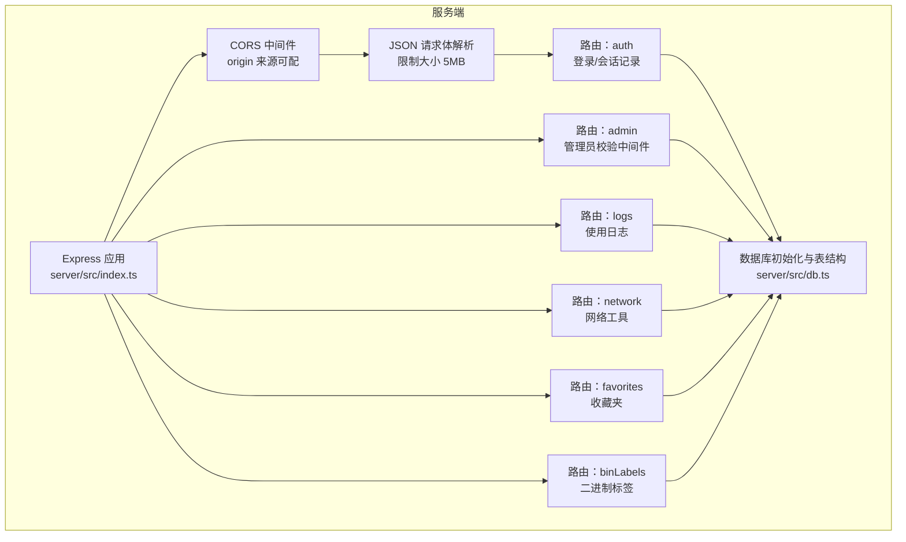
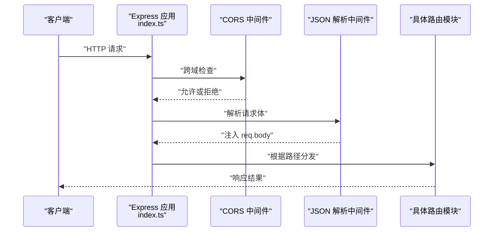
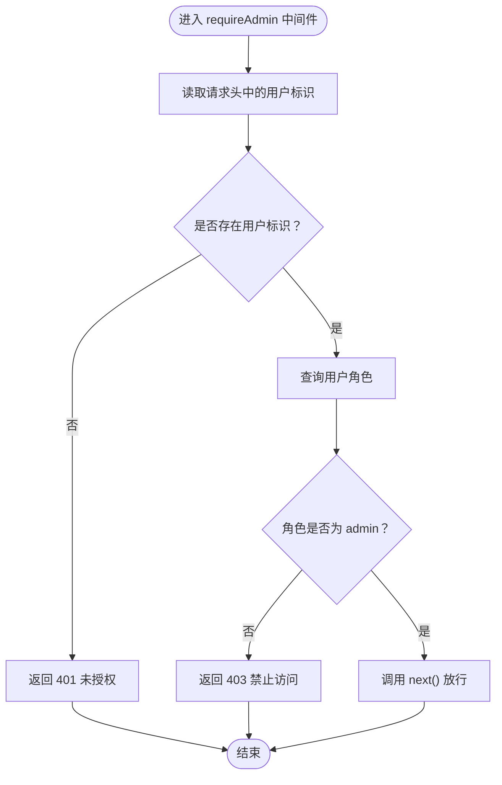
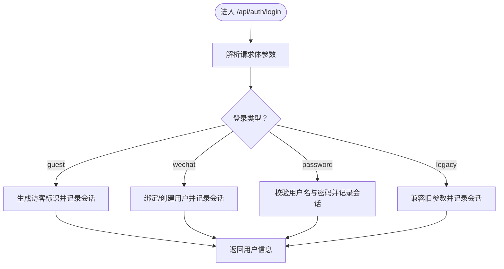
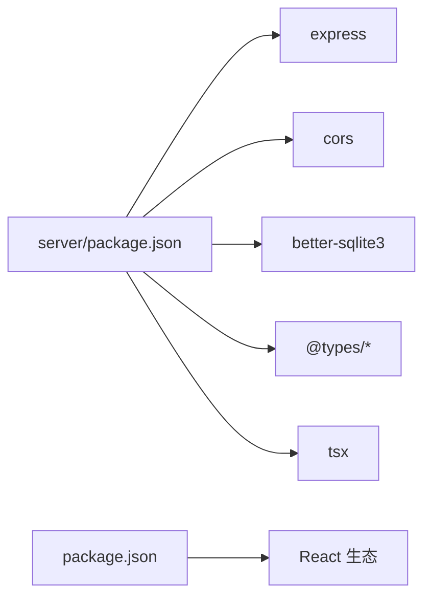
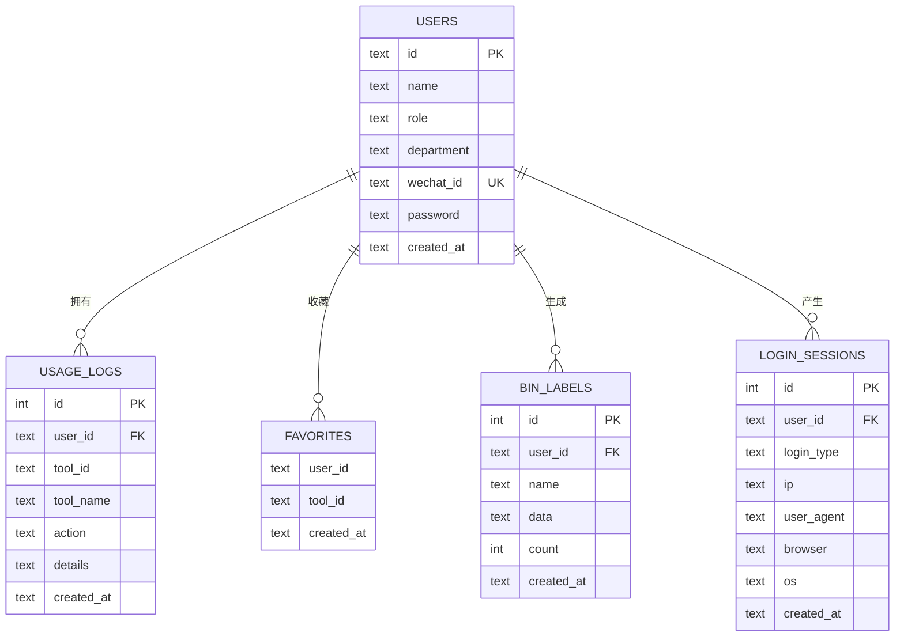

# 中间件系统

<cite>
**本文引用的文件**
- [server/src/index.ts](file://server/src/index.ts)
- [server/src/routes/auth.ts](file://server/src/routes/auth.ts)
- [server/src/routes/admin.ts](file://server/src/routes/admin.ts)
- [server/src/routes/logs.ts](file://server/src/routes/logs.ts)
- [server/src/routes/network.ts](file://server/src/routes/network.ts)
- [server/src/routes/favorites.ts](file://server/src/routes/favorites.ts)
- [server/src/routes/binLabels.ts](file://server/src/routes/binLabels.ts)
- [server/src/db.ts](file://server/src/db.ts)
- [server/src/types.ts](file://server/src/types.ts)
- [server/package.json](file://server/package.json)
- [package.json](file://package.json)
</cite>

## 目录
1. [简介](#简介)
2. [项目结构](#项目结构)
3. [核心组件](#核心组件)
4. [架构总览](#架构总览)
5. [详细组件分析](#详细组件分析)
6. [依赖分析](#依赖分析)
7. [性能考虑](#性能考虑)
8. [故障排查指南](#故障排查指南)
9. [结论](#结论)
10. [附录](#附录)

## 简介
本文件面向中间件系统，围绕 Express.js 的中间件工作原理与执行顺序展开，结合项目中已实现的 CORS 跨域、JSON 请求体解析、自定义中间件（认证）以及路由模块的应用模式，提供从架构到实践的完整说明。文档同时覆盖中间件链式调用、异常捕获与响应拦截机制，并给出性能优化建议与调试技巧。

## 项目结构
后端采用 Express 应用，入口文件集中注册全局中间件与路由模块；各业务模块以独立路由文件组织，部分路由内嵌自定义中间件进行权限控制。数据库通过 better-sqlite3 初始化并创建表结构，配合类型定义保证数据模型一致性。

图表来源
- [server/src/index.ts:10-26](file://server/src/index.ts#L10-L26)
- [server/src/routes/auth.ts:1-109](file://server/src/routes/auth.ts#L1-L109)
- [server/src/routes/admin.ts:1-93](file://server/src/routes/admin.ts#L1-L93)
- [server/src/routes/logs.ts:1-134](file://server/src/routes/logs.ts#L1-L134)
- [server/src/routes/network.ts:1-109](file://server/src/routes/network.ts#L1-L109)
- [server/src/routes/favorites.ts:1-31](file://server/src/routes/favorites.ts#L1-L31)
- [server/src/routes/binLabels.ts:1-65](file://server/src/routes/binLabels.ts#L1-L65)
- [server/src/db.ts:1-126](file://server/src/db.ts#L1-L126)

章节来源
- [server/src/index.ts:10-26](file://server/src/index.ts#L10-L26)
- [server/src/db.ts:12-75](file://server/src/db.ts#L12-L75)

## 核心组件
- 全局中间件
  - CORS：允许指定 origin 或通配符，用于前端跨域访问。
  - JSON 解析：限制请求体大小为 5MB，确保安全与性能平衡。
- 路由模块
  - 认证路由：支持游客、微信与密码三种登录方式，登录后记录会话信息。
  - 管理员路由：内置“管理员必需”中间件，基于请求头中的用户标识进行角色校验。
  - 日志路由：提供使用日志的增删查与聚合统计。
  - 网络工具路由：提供 IP 查询、DNS 解析、Ping 与 HTTP 代理等能力。
  - 收藏夹路由：按用户维度管理收藏工具。
  - 二进制标签路由：按用户维度管理标签生成记录。
- 数据层
  - better-sqlite3 初始化数据库与索引，创建 users、usage_logs、favorites、bin_labels、login_sessions 等表，并在空库时进行种子数据填充。

章节来源
- [server/src/index.ts:14-15](file://server/src/index.ts#L14-L15)
- [server/src/routes/auth.ts:24-29](file://server/src/routes/auth.ts#L24-L29)
- [server/src/routes/admin.ts:7-14](file://server/src/routes/admin.ts#L7-L14)
- [server/src/routes/logs.ts:7-18](file://server/src/routes/logs.ts#L7-L18)
- [server/src/routes/network.ts:11-25](file://server/src/routes/network.ts#L11-L25)
- [server/src/routes/favorites.ts:6-11](file://server/src/routes/favorites.ts#L6-L11)
- [server/src/routes/binLabels.ts:15-26](file://server/src/routes/binLabels.ts#L15-L26)
- [server/src/db.ts:12-75](file://server/src/db.ts#L12-L75)

## 架构总览
下图展示请求从进入 Express 到路由处理的整体流程，以及中间件与路由的组合关系。

图表来源
- [server/src/index.ts:14-22](file://server/src/index.ts#L14-L22)
- [server/src/index.ts:24-26](file://server/src/index.ts#L24-L26)

## 详细组件分析

### CORS 中间件与跨域处理
- 配置项
  - 允许的来源由环境变量控制，默认通配符，生产环境建议限定具体域名。
- 执行位置
  - 在 JSON 解析之前注册，确保预检请求与正式请求均受控。
- 影响范围
  - 对所有路由生效，包括 /api/auth、/api/admin、/api/logs 等。

章节来源
- [server/src/index.ts:12-14](file://server/src/index.ts#L12-L14)

### JSON 请求体解析与大小限制
- 配置项
  - 限制请求体最大为 5MB，避免过大负载导致内存压力。
- 执行位置
  - 在路由挂载前注册，使后续路由能直接读取 req.body。
- 影响范围
  - 对所有需要解析 JSON 的路由有效，如 auth 登录、logs 写入、network 工具调用等。

章节来源
- [server/src/index.ts:15](file://server/src/index.ts#L15)
- [server/src/routes/auth.ts:36-106](file://server/src/routes/auth.ts#L36-L106)
- [server/src/routes/logs.ts:7-18](file://server/src/routes/logs.ts#L7-L18)
- [server/src/routes/network.ts:66-106](file://server/src/routes/network.ts#L66-L106)

### 自定义中间件：管理员权限校验
- 实现要点
  - 从请求头读取用户标识，查询数据库确认角色是否为管理员，否则返回未授权或禁止访问。
  - 该中间件在特定管理接口上作为前置守卫使用。
- 使用模式
  - 仅对需要管理员权限的路由启用，保持最小暴露面。

图表来源
- [server/src/routes/admin.ts:7-14](file://server/src/routes/admin.ts#L7-L14)
- [server/src/routes/admin.ts:18-22](file://server/src/routes/admin.ts#L18-L22)

章节来源
- [server/src/routes/admin.ts:7-14](file://server/src/routes/admin.ts#L7-L14)

### 认证中间件：登录与会话记录
- 功能概述
  - 支持游客、微信与密码三种登录方式，兼容历史参数回退。
  - 登录成功后记录会话来源（IP、UA、浏览器、操作系统）。
- 关键流程
  - 参数校验 → 选择登录路径 → 数据库查询/插入 → 记录会话 → 返回用户信息。

图表来源
- [server/src/routes/auth.ts:36-106](file://server/src/routes/auth.ts#L36-L106)
- [server/src/routes/auth.ts:24-29](file://server/src/routes/auth.ts#L24-L29)

章节来源
- [server/src/routes/auth.ts:36-106](file://server/src/routes/auth.ts#L36-L106)
- [server/src/routes/auth.ts:24-29](file://server/src/routes/auth.ts#L24-L29)

### 日志中间件与错误处理模式
- 日志写入
  - 接收用户标识、工具标识、动作等字段，写入数据库并返回新增记录 ID。
- 错误处理
  - 路由内部普遍采用 try/catch 或显式状态码返回，避免未捕获异常导致进程崩溃。
- 建议
  - 可引入统一错误处理中间件捕获未处理异常，标准化错误响应格式。

章节来源
- [server/src/routes/logs.ts:7-18](file://server/src/routes/logs.ts#L7-L18)
- [server/src/routes/network.ts:22-24](file://server/src/routes/network.ts#L22-L24)
- [server/src/routes/network.ts:41-44](file://server/src/routes/network.ts#L41-L44)
- [server/src/routes/network.ts:59-62](file://server/src/routes/network.ts#L59-L62)
- [server/src/routes/network.ts:103-105](file://server/src/routes/network.ts#L103-L105)

### 路由模块中的中间件应用模式
- 全局中间件优先于路由注册，确保所有路由共享 CORS 与 JSON 解析能力。
- 局部中间件（如 requireAdmin）仅作用于特定路由，形成“按需守卫”的清晰边界。
- 健康检查路由不依赖局部中间件，直接返回状态信息。

章节来源
- [server/src/index.ts:14-26](file://server/src/index.ts#L14-L26)
- [server/src/routes/admin.ts:18-22](file://server/src/routes/admin.ts#L18-L22)
- [server/src/index.ts:24-26](file://server/src/index.ts#L24-L26)

## 依赖分析
- 运行时依赖
  - express：Web 框架与中间件生态核心。
  - cors：跨域资源共享中间件。
  - better-sqlite3：高性能 SQLite 客户端，配合 WAL 模式与外键约束提升可靠性。
- 开发依赖
  - @types/*：类型声明，提升开发体验与安全性。
  - tsx：TypeScript 运行与热重载。
- 前端依赖（与后端中间件无直接耦合）
  - React 生态与构建工具，用于前端页面与 API 调用。

图表来源
- [server/package.json:10-21](file://server/package.json#L10-L21)
- [package.json:11-32](file://package.json#L11-L32)

章节来源
- [server/package.json:10-21](file://server/package.json#L10-L21)
- [package.json:11-32](file://package.json#L11-L32)

## 性能考虑
- 中间件顺序
  - 将轻量且快速的中间件置于前部，如 CORS 与 JSON 解析，减少后续路由处理成本。
- 请求体大小限制
  - 合理限制请求体大小，避免大体积上传导致内存峰值过高。
- 数据库优化
  - 使用 WAL 模式与外键约束提升并发与一致性；为高频查询列建立索引（如 users.wechat_id、usage_logs.user_id 等）。
- 路由粒度
  - 将复杂逻辑拆分为多个小路由，便于缓存与限流策略落地。
- 异常处理
  - 统一错误处理中间件可减少重复 try/catch，降低分支开销并提升可观测性。

## 故障排查指南
- CORS 失败
  - 检查 CORS_ORIGIN 环境变量是否与前端域名一致；确认预检请求是否被正确放行。
- JSON 解析失败
  - 确认 Content-Type 正确；检查请求体是否超过 5MB；查看路由是否正确读取 req.body。
- 权限不足
  - 管理员接口返回 403 通常表示用户标识缺失或角色非 admin；核对请求头与数据库用户记录。
- 数据库异常
  - 表结构或索引缺失会导致查询失败；确认 db 初始化脚本已执行，种子数据是否正常。
- 网络工具调用
  - DNS/Ping/HTTP 代理可能因外部服务不可达或超时失败；检查网络连通性与超时设置。

章节来源
- [server/src/index.ts:12-14](file://server/src/index.ts#L12-L14)
- [server/src/index.ts:15](file://server/src/index.ts#L15)
- [server/src/routes/admin.ts:7-14](file://server/src/routes/admin.ts#L7-L14)
- [server/src/db.ts:12-75](file://server/src/db.ts#L12-L75)
- [server/src/routes/network.ts:11-25](file://server/src/routes/network.ts#L11-L25)
- [server/src/routes/network.ts:27-45](file://server/src/routes/network.ts#L27-L45)
- [server/src/routes/network.ts:47-63](file://server/src/routes/network.ts#L47-L63)
- [server/src/routes/network.ts:65-106](file://server/src/routes/network.ts#L65-L106)

## 结论
本项目以简洁明确的方式实现了中间件体系：全局 CORS 与 JSON 解析保障跨域与请求体安全，局部中间件（如管理员校验）提供细粒度权限控制。通过合理的路由模块划分与数据库索引设计，系统在可维护性与性能之间取得良好平衡。建议进一步引入统一错误处理中间件与日志中间件，以增强可观测性与稳定性。

## 附录
- 数据模型概览（简化）

图表来源
- [server/src/db.ts:14-75](file://server/src/db.ts#L14-L75)
- [server/src/types.ts:1-46](file://server/src/types.ts#L1-L46)