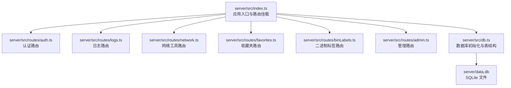
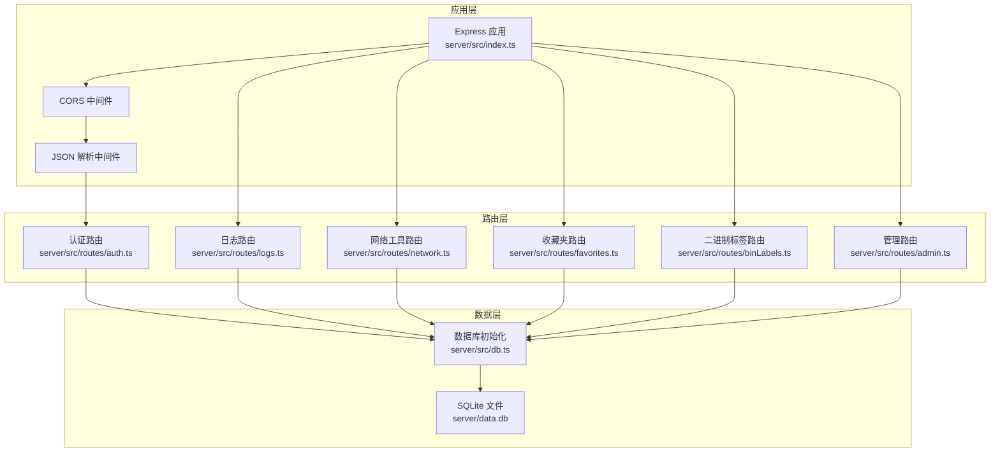
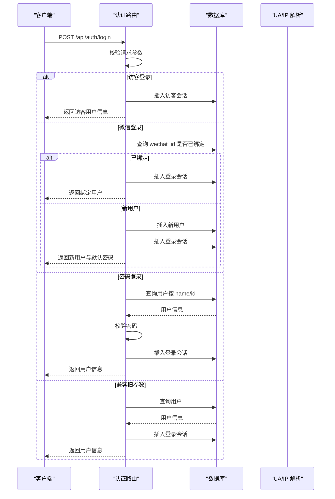
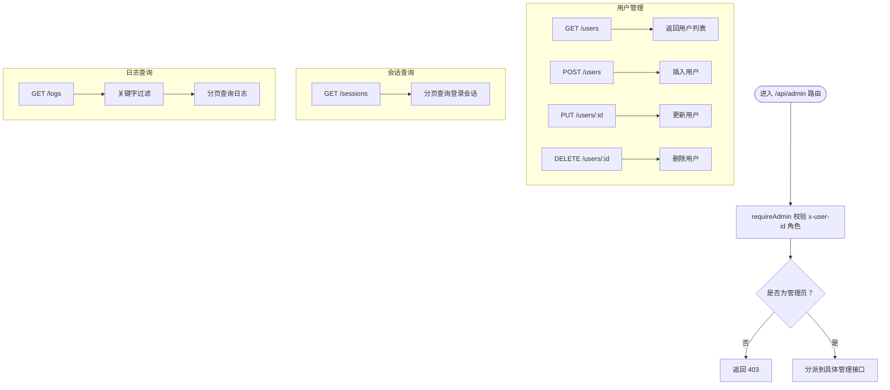
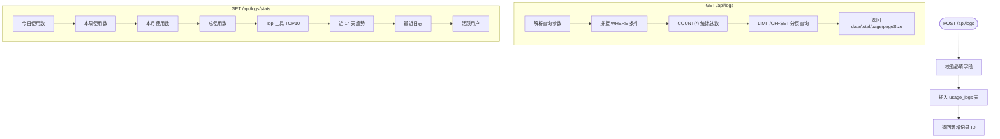
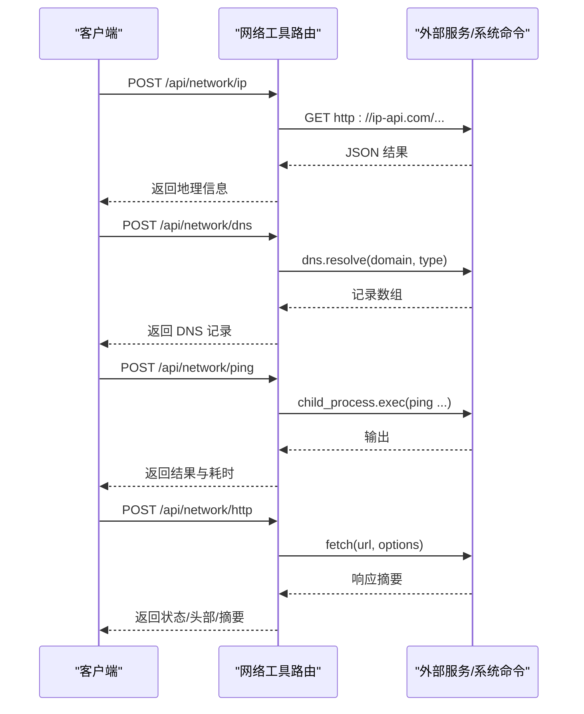
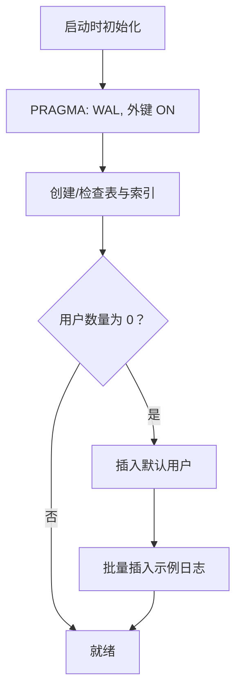
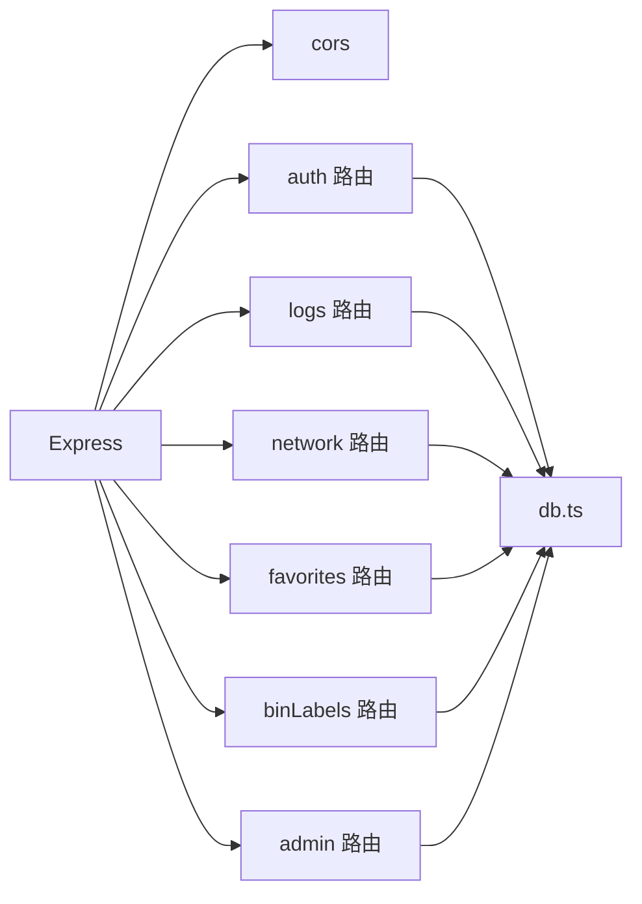

# 后端服务

<cite>
**本文引用的文件**
- [server/src/index.ts](file://server/src/index.ts)
- [server/src/db.ts](file://server/src/db.ts)
- [server/src/types.ts](file://server/src/types.ts)
- [server/src/routes/auth.ts](file://server/src/routes/auth.ts)
- [server/src/routes/admin.ts](file://server/src/routes/admin.ts)
- [server/src/routes/logs.ts](file://server/src/routes/logs.ts)
- [server/src/routes/network.ts](file://server/src/routes/network.ts)
- [server/src/routes/favorites.ts](file://server/src/routes/favorites.ts)
- [server/src/routes/binLabels.ts](file://server/src/routes/binLabels.ts)
- [server/package.json](file://server/package.json)
- [server/tsconfig.json](file://server/tsconfig.json)
- [部署手册.md](file://部署手册.md)
</cite>

## 目录
1. [简介](#简介)
2. [项目结构](#项目结构)
3. [核心组件](#核心组件)
4. [架构总览](#架构总览)
5. [详细组件分析](#详细组件分析)
6. [依赖关系分析](#依赖关系分析)
7. [性能考虑](#性能考虑)
8. [故障排查指南](#故障排查指南)
9. [结论](#结论)
10. [附录](#附录)

## 简介
本项目是一个基于 Express.js 的后端服务，采用 TypeScript 开发，使用 better-sqlite3 作为数据库驱动，SQLite 文件存储于 server/data.db。服务提供认证、日志统计、网络工具、收藏夹、二进制标签等接口，并通过 Nginx 反向代理对外提供 API。部署手册提供了完整的生产环境部署、反向代理、进程守护、日志与备份策略。

## 项目结构
后端代码位于 server/src 目录，主要由入口文件、数据库初始化、类型定义以及按功能划分的路由模块组成。路由模块按业务域拆分，便于维护与扩展。

图表来源
- [server/src/index.ts:1-31](file://server/src/index.ts#L1-L31)
- [server/src/db.ts:1-126](file://server/src/db.ts#L1-L126)
- [server/src/routes/auth.ts:1-109](file://server/src/routes/auth.ts#L1-L109)
- [server/src/routes/logs.ts:1-134](file://server/src/routes/logs.ts#L1-L134)
- [server/src/routes/network.ts:1-109](file://server/src/routes/network.ts#L1-L109)
- [server/src/routes/favorites.ts:1-31](file://server/src/routes/favorites.ts#L1-L31)
- [server/src/routes/binLabels.ts:1-65](file://server/src/routes/binLabels.ts#L1-L65)
- [server/src/routes/admin.ts:1-93](file://server/src/routes/admin.ts#L1-L93)

章节来源
- [server/src/index.ts:1-31](file://server/src/index.ts#L1-L31)
- [server/src/db.ts:1-126](file://server/src/db.ts#L1-L126)

## 核心组件
- 应用入口与中间件
  - 使用 CORS 中间件配置跨域来源，支持从环境变量读取。
  - 使用 express.json 中间件解析请求体，限制大小为 5MB。
  - 挂载各业务路由模块，统一前缀为 /api/{模块名}。
  - 提供 /api/health 健康检查端点。
- 数据库层
  - 初始化 SQLite 数据库文件，开启 WAL 模式与外键约束。
  - 自动创建用户、使用日志、收藏夹、二进制标签、登录会话等表及索引。
  - 首次启动时插入默认用户与示例日志数据。
- 类型定义
  - 统一导出数据库实体类型，用于路由层类型约束与返回结构。

章节来源
- [server/src/index.ts:10-30](file://server/src/index.ts#L10-L30)
- [server/src/db.ts:8-75](file://server/src/db.ts#L8-L75)
- [server/src/db.ts:77-123](file://server/src/db.ts#L77-L123)
- [server/src/types.ts:1-46](file://server/src/types.ts#L1-L46)

## 架构总览
后端采用“入口文件 + 路由模块 + 数据库”的分层架构：
- 入口文件负责中间件装配、路由挂载与服务启动。
- 路由模块按领域拆分，每个模块内部封装 CRUD 与查询逻辑。
- 数据库层集中初始化与事务处理，提供统一的数据访问能力。

图表来源
- [server/src/index.ts:10-30](file://server/src/index.ts#L10-L30)
- [server/src/routes/auth.ts:1-109](file://server/src/routes/auth.ts#L1-L109)
- [server/src/routes/logs.ts:1-134](file://server/src/routes/logs.ts#L1-L134)
- [server/src/routes/network.ts:1-109](file://server/src/routes/network.ts#L1-L109)
- [server/src/routes/favorites.ts:1-31](file://server/src/routes/favorites.ts#L1-L31)
- [server/src/routes/binLabels.ts:1-65](file://server/src/routes/binLabels.ts#L1-L65)
- [server/src/routes/admin.ts:1-93](file://server/src/routes/admin.ts#L1-L93)
- [server/src/db.ts:8-75](file://server/src/db.ts#L8-L75)

## 详细组件分析

### 认证路由（/api/auth）
- 功能职责
  - 获取用户列表。
  - 支持访客登录、微信登录、密码登录三种登录方式。
  - 登录成功后记录登录会话（IP、UA、浏览器、操作系统）。
- 关键流程
  - 访客登录：生成临时访客 ID 并记录会话。
  - 微信登录：若 wechatId 已绑定用户则直接登录；否则自动创建普通用户并记录会话。
  - 密码登录：按用户名或 ID 查询用户，校验密码（优先使用数据库中的密码，否则回退到用户 ID）。
  - 兼容旧参数：支持仅传 userId 的登录方式。
- 安全与验证
  - 参数校验：必填字段缺失时返回 400。
  - 用户存在性与权限：密码登录时对用户存在性与密码进行校验。
  - 登录会话记录：记录客户端信息以便审计。

图表来源
- [server/src/routes/auth.ts:36-106](file://server/src/routes/auth.ts#L36-L106)
- [server/src/db.ts:12-75](file://server/src/db.ts#L12-L75)

章节来源
- [server/src/routes/auth.ts:1-109](file://server/src/routes/auth.ts#L1-L109)

### 管理路由（/api/admin）
- 功能职责
  - 用户管理：查询、创建、更新、删除用户。
  - 登录会话查询：分页查询登录会话，支持关键字过滤。
  - 使用日志查询：分页查询使用日志，支持关键字过滤。
- 安全中间件
  - requireAdmin：通过请求头 x-user-id 获取用户 ID，查询用户角色，非管理员返回 403。
- 查询与分页
  - 分页参数 page/pageSize 限制最大每页 100 条。
  - 关键字搜索支持工具名、动作、用户名称模糊匹配。

图表来源
- [server/src/routes/admin.ts:7-14](file://server/src/routes/admin.ts#L7-L14)
- [server/src/routes/admin.ts:18-49](file://server/src/routes/admin.ts#L18-L49)
- [server/src/routes/admin.ts:53-65](file://server/src/routes/admin.ts#L53-L65)
- [server/src/routes/admin.ts:69-90](file://server/src/routes/admin.ts#L69-L90)

章节来源
- [server/src/routes/admin.ts:1-93](file://server/src/routes/admin.ts#L1-L93)

### 日志路由（/api/logs）
- 功能职责
  - 新增日志：记录用户使用工具的行为。
  - 查询日志：支持按用户、工具、关键词、时间范围过滤，分页返回。
  - 统计接口：提供今日/本周/本月使用次数、Top 工具、近 14 天趋势、最近日志、活跃用户等聚合数据。
- 查询优化
  - 使用条件拼接与参数化查询，避免 SQL 注入。
  - 对用户 ID、工具 ID、时间范围建立索引以提升查询性能。
  - 分页限制每页最大 100 条，防止大页导致内存压力。

图表来源
- [server/src/routes/logs.ts:7-18](file://server/src/routes/logs.ts#L7-L18)
- [server/src/routes/logs.ts:20-69](file://server/src/routes/logs.ts#L20-L69)
- [server/src/routes/logs.ts:71-131](file://server/src/routes/logs.ts#L71-L131)

章节来源
- [server/src/routes/logs.ts:1-134](file://server/src/routes/logs.ts#L1-L134)

### 网络工具路由（/api/network）
- 功能职责
  - IP 查询：调用 ip-api.com 获取地理信息。
  - DNS 查询：支持 A/AAAA/MX 等记录类型。
  - Ping 测试：跨平台执行 ping 命令，限制最大 10 次。
  - HTTP 代理：转发请求到目标地址，返回状态、头部与响应体摘要。
- 错误处理
  - 对外部服务调用异常、DNS 解析失败、ping 执行超时等情况进行捕获与返回。

图表来源
- [server/src/routes/network.ts:10-25](file://server/src/routes/network.ts#L10-L25)
- [server/src/routes/network.ts:27-45](file://server/src/routes/network.ts#L27-L45)
- [server/src/routes/network.ts:47-63](file://server/src/routes/network.ts#L47-L63)
- [server/src/routes/network.ts:65-106](file://server/src/routes/network.ts#L65-L106)

章节来源
- [server/src/routes/network.ts:1-109](file://server/src/routes/network.ts#L1-L109)

### 收藏夹路由（/api/favorites）
- 功能职责
  - 获取某用户的收藏工具 ID 列表。
  - 添加收藏：去重插入。
  - 移除收藏。
- 性能与一致性
  - 使用 INSERT OR IGNORE 避免重复插入。
  - 主键为 (user_id, tool_id)，天然保证唯一性。

章节来源
- [server/src/routes/favorites.ts:1-31](file://server/src/routes/favorites.ts#L1-L31)

### 二进制标签路由（/api/bin-labels）
- 功能职责
  - 查询某用户的标签生成记录。
  - 获取单条记录详情。
  - 保存新的生成记录。
  - 删除记录（需携带 userId 参数）。
- 参数校验
  - 必要字段缺失时返回 400。
  - 删除操作强制校验 userId，防止越权删除。

章节来源
- [server/src/routes/binLabels.ts:1-65](file://server/src/routes/binLabels.ts#L1-L65)

### 数据库层（server/src/db.ts）
- 初始化策略
  - 使用 WAL 模式提升并发读写性能。
  - 开启外键约束，保证参照完整性。
  - 创建用户、使用日志、收藏夹、二进制标签、登录会话等表及必要索引。
  - 首次启动时插入默认用户与示例日志数据。
- 事务处理
  - 使用 db.transaction 包裹批量插入，确保原子性与一致性。

图表来源
- [server/src/db.ts:8-75](file://server/src/db.ts#L8-L75)
- [server/src/db.ts:77-123](file://server/src/db.ts#L77-L123)

章节来源
- [server/src/db.ts:1-126](file://server/src/db.ts#L1-L126)

## 依赖关系分析
- 依赖清单
  - Express：Web 框架。
  - better-sqlite3：SQLite 驱动。
  - cors：跨域中间件。
  - TypeScript 与 TSX：开发与运行时编译。
- 模块耦合
  - 路由模块均依赖 db.ts 提供的数据库实例，形成统一数据访问层。
  - 管理路由依赖 requireAdmin 中间件进行权限控制。
- 外部集成
  - 网络工具路由依赖系统命令与外部 HTTP 服务（ip-api.com）。

图表来源
- [server/src/index.ts:10-22](file://server/src/index.ts#L10-L22)
- [server/src/routes/auth.ts:1-3](file://server/src/routes/auth.ts#L1-L3)
- [server/src/routes/logs.ts:1-3](file://server/src/routes/logs.ts#L1-L3)
- [server/src/routes/network.ts:1-4](file://server/src/routes/network.ts#L1-L4)
- [server/src/routes/favorites.ts:1-2](file://server/src/routes/favorites.ts#L1-L2)
- [server/src/routes/binLabels.ts:1-2](file://server/src/routes/binLabels.ts#L1-L2)
- [server/src/routes/admin.ts:1-3](file://server/src/routes/admin.ts#L1-L3)
- [server/src/db.ts:1-1](file://server/src/db.ts#L1-L1)

章节来源
- [server/package.json:10-21](file://server/package.json#L10-L21)

## 性能考虑
- 数据库层面
  - WAL 模式与外键约束已在初始化阶段启用，有助于并发与一致性。
  - 建议在高频查询字段上增加索引（如 usage_logs.user_id、usage_logs.tool_id、usage_logs.created_at）。
  - 对于大量日志场景，可考虑分表或归档策略，减少主表膨胀。
- 查询与分页
  - 日志查询与管理路由已限制每页最大 100 条，避免大页导致内存压力。
  - 建议对时间范围查询使用索引覆盖，减少全表扫描。
- 中间件与请求体
  - express.json 限制为 5MB，避免过大请求导致内存压力。
- 外部依赖
  - 网络工具路由调用外部服务与系统命令，建议设置超时与重试策略，避免阻塞。
- 运维与监控
  - 建议结合 PM2 日志与 Nginx 访问日志进行性能分析与告警。
  - 生产环境建议开启 NODE_ENV=production 以获得更好的性能。

[本节为通用性能建议，不直接分析特定文件]

## 故障排查指南
- CORS 跨域问题
  - 确认 CORS_ORIGIN 环境变量设置为允许的域名，生产环境建议固定为具体域名。
- 健康检查
  - 访问 /api/health 验证服务可用性。
- 数据库文件
  - 确保 server/data.db 存在且可读写；生产环境定期备份。
- PM2 进程
  - 使用 pm2 status 查看状态，pm2 logs 查看错误日志。
- Nginx 反向代理
  - 确认 /api/ 路由指向后端 3001 端口，X-Forwarded-* 头正确传递。
- 常见错误
  - 参数缺失：400 错误，检查必填字段。
  - 用户不存在或密码错误：404/401，检查用户是否存在与密码是否正确。
  - 权限不足：403，确认 x-user-id 对应用户角色为 admin。

章节来源
- [部署手册.md:231-249](file://部署手册.md#L231-L249)
- [server/src/index.ts:24-26](file://server/src/index.ts#L24-L26)
- [server/src/routes/admin.ts:7-14](file://server/src/routes/admin.ts#L7-L14)

## 结论
该后端服务采用清晰的模块化设计，路由按业务域拆分，数据库初始化与事务处理集中在 db.ts，具备良好的可维护性与扩展性。结合部署手册提供的生产环境最佳实践，可在 Nginx + Node.js + SQLite 的架构下稳定运行。建议后续在日志查询、网络工具与数据库层面进一步完善索引、分页与超时控制，以提升大规模场景下的性能与稳定性。

[本节为总结性内容，不直接分析特定文件]

## 附录
- 环境变量
  - PORT：服务监听端口，默认 3001。
  - CORS_ORIGIN：允许的跨域来源，默认 “*”，生产建议设为具体域名。
  - NODE_ENV：设为 production 以提升性能。
- 运行脚本
  - dev：使用 tsx watch 监听热更新。
  - start：使用 tsx 启动服务。
- TypeScript 配置
  - ESNext 模块解析，严格模式，输出目录 dist，根目录 src。

章节来源
- [server/package.json:6-8](file://server/package.json#L6-L8)
- [server/tsconfig.json:2-11](file://server/tsconfig.json#L2-L11)
- [部署手册.md:235-249](file://部署手册.md#L235-L249)