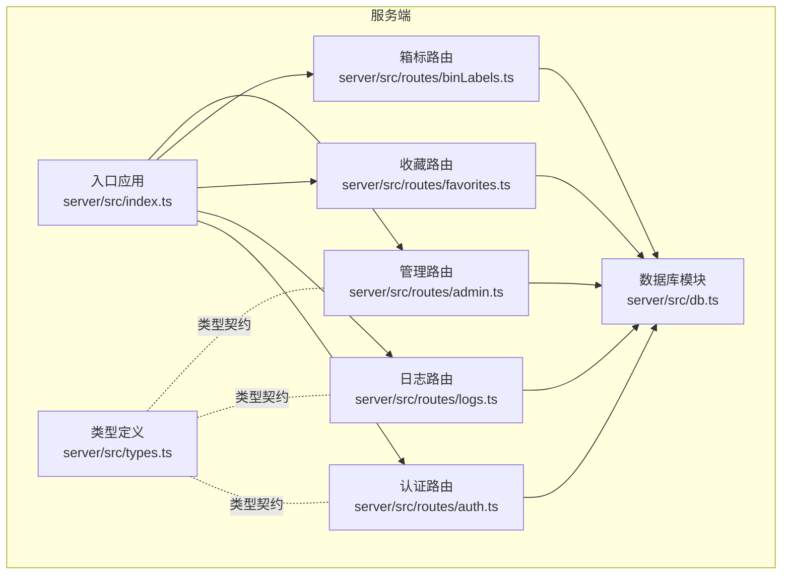
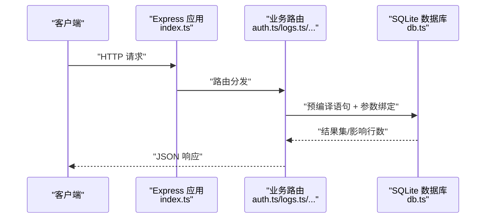
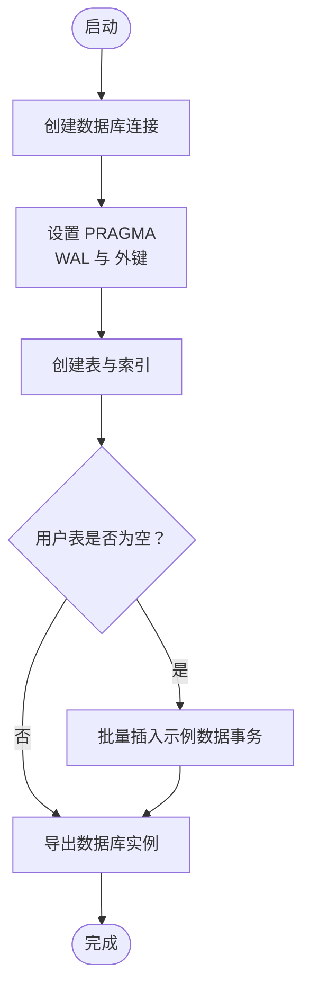
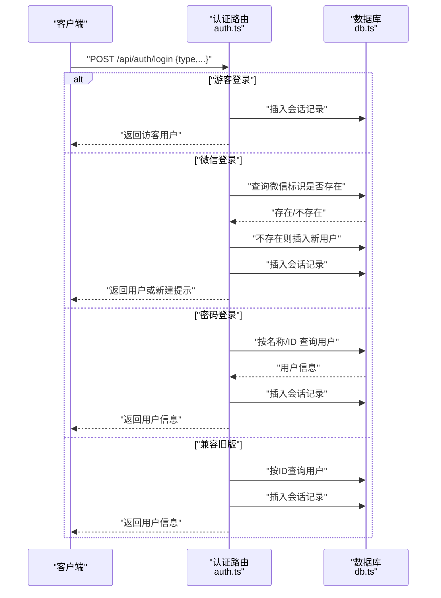
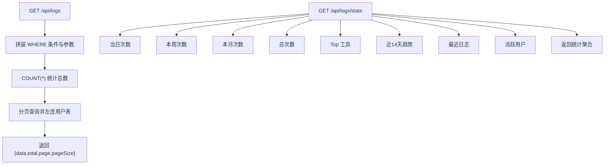
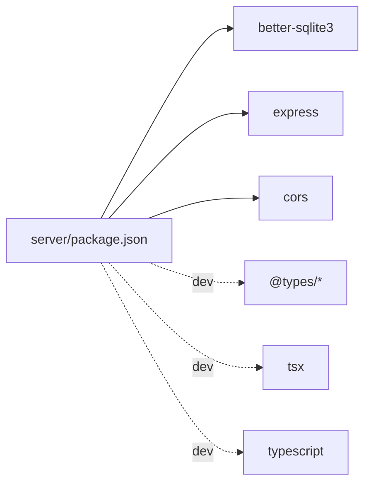

# 数据库操作

<cite>
**本文引用的文件**
- [server/src/db.ts](file://server/src/db.ts)
- [server/src/index.ts](file://server/src/index.ts)
- [server/src/types.ts](file://server/src/types.ts)
- [server/src/routes/auth.ts](file://server/src/routes/auth.ts)
- [server/src/routes/logs.ts](file://server/src/routes/logs.ts)
- [server/src/routes/favorites.ts](file://server/src/routes/favorites.ts)
- [server/src/routes/binLabels.ts](file://server/src/routes/binLabels.ts)
- [server/src/routes/admin.ts](file://server/src/routes/admin.ts)
- [server/package.json](file://server/package.json)
</cite>

## 目录
1. [简介](#简介)
2. [项目结构](#项目结构)
3. [核心组件](#核心组件)
4. [架构总览](#架构总览)
5. [详细组件分析](#详细组件分析)
6. [依赖分析](#依赖分析)
7. [性能考虑](#性能考虑)
8. [故障排查指南](#故障排查指南)
9. [结论](#结论)
10. [附录](#附录)

## 简介
本文件面向后端与全栈开发者，系统性梳理本项目的数据库层设计与实现，涵盖 SQLite 连接配置、初始化流程、表结构与索引、CRUD 实现模式、事务处理、数据校验与约束、错误处理、迁移与备份恢复思路、性能优化与扩展建议等。项目采用 better-sqlite3 作为本地嵌入式数据库，Express 提供 API 路由，所有数据库访问集中在统一的数据库模块中。

## 项目结构
后端服务位于 server 目录，数据库初始化与表结构定义集中在数据库模块；各业务路由通过统一的数据库实例执行查询与写入；类型定义集中于 types 文件，确保前后端交互的数据契约一致。

图表来源
- [server/src/index.ts:1-31](file://server/src/index.ts#L1-L31)
- [server/src/db.ts:1-126](file://server/src/db.ts#L1-L126)
- [server/src/types.ts:1-46](file://server/src/types.ts#L1-L46)
- [server/src/routes/auth.ts:1-109](file://server/src/routes/auth.ts#L1-L109)
- [server/src/routes/logs.ts:1-134](file://server/src/routes/logs.ts#L1-L134)
- [server/src/routes/favorites.ts:1-31](file://server/src/routes/favorites.ts#L1-L31)
- [server/src/routes/binLabels.ts:1-65](file://server/src/routes/binLabels.ts#L1-L65)
- [server/src/routes/admin.ts:1-93](file://server/src/routes/admin.ts#L1-L93)

章节来源
- [server/src/index.ts:1-31](file://server/src/index.ts#L1-L31)
- [server/src/db.ts:1-126](file://server/src/db.ts#L1-L126)
- [server/src/types.ts:1-46](file://server/src/types.ts#L1-L46)

## 核心组件
- 数据库连接与初始化：在数据库模块中创建 SQLite 连接，启用 WAL 日志模式与外键约束，并一次性创建全部业务表与索引。若用户表为空，则批量插入示例数据与使用日志。
- 路由层：每个业务路由负责接收请求、进行输入校验、调用数据库模块执行 SQL、返回标准化响应。
- 类型系统：通过 TypeScript 接口定义数据库实体与查询参数，保证前后端契约一致。
- 事务：在批量写入场景（如初始化日志）使用事务以提升一致性与性能。

章节来源
- [server/src/db.ts:1-126](file://server/src/db.ts#L1-L126)
- [server/src/routes/auth.ts:1-109](file://server/src/routes/auth.ts#L1-L109)
- [server/src/routes/logs.ts:1-134](file://server/src/routes/logs.ts#L1-L134)
- [server/src/routes/favorites.ts:1-31](file://server/src/routes/favorites.ts#L1-L31)
- [server/src/routes/binLabels.ts:1-65](file://server/src/routes/binLabels.ts#L1-L65)
- [server/src/routes/admin.ts:1-93](file://server/src/routes/admin.ts#L1-L93)
- [server/src/types.ts:1-46](file://server/src/types.ts#L1-L46)

## 架构总览
下图展示从客户端到数据库的典型调用链路，以及数据库初始化与索引策略对查询性能的影响。

图表来源
- [server/src/index.ts:17-22](file://server/src/index.ts#L17-L22)
- [server/src/routes/auth.ts:36-106](file://server/src/routes/auth.ts#L36-L106)
- [server/src/routes/logs.ts:8-69](file://server/src/routes/logs.ts#L8-L69)
- [server/src/db.ts:13-75](file://server/src/db.ts#L13-L75)

## 详细组件分析

### 数据库连接与初始化
- 连接配置
  - 使用 better-sqlite3 创建本地数据库文件，路径为相对服务器源码目录的 data.db。
  - 启用 WAL 日志模式与外键约束，提升并发读取能力与参照完整性。
- 表结构与索引
  - 用户表：主键、唯一索引（微信标识）、角色枚举约束、默认时间戳。
  - 使用日志表：自增主键、外键关联用户、多列索引覆盖常用过滤条件。
  - 收藏表：复合主键（用户+工具），外键关联用户。
  - 箱标记录表：自增主键、外键关联用户、用户与时间索引。
  - 登录会话表：自增主键、登录类型枚举、用户与时间索引。
- 初始化种子
  - 若用户表为空，批量插入示例用户与使用日志，使用事务包裹以保证原子性与性能。

图表来源
- [server/src/db.ts:8-126](file://server/src/db.ts#L8-L126)

章节来源
- [server/src/db.ts:8-126](file://server/src/db.ts#L8-L126)

### 类型系统与数据契约
- 用户、使用日志、登录会话的接口定义，明确字段类型与可空性，便于路由层进行参数校验与响应序列化。
- 查询参数（如日志查询、统计查询）通过接口约束，避免运行时类型错误。

章节来源
- [server/src/types.ts:1-46](file://server/src/types.ts#L1-L46)

### 认证与会话记录
- 客户端信息提取：从请求头解析 IP 与 UA，并简单识别浏览器与操作系统。
- 会话记录：登录成功后向会话表插入一条记录，包含登录类型与设备信息。
- 登录方式：
  - 游客登录：生成临时访客 ID 并记录会话。
  - 微信登录：若微信标识已绑定用户则直接登录；否则自动创建普通用户并记录会话。
  - 密码登录：按名称或 ID 查找用户，密码校验优先使用存储值，否则回退到用户 ID。
  - 兼容旧版：支持仅传入用户 ID 的登录方式。

图表来源
- [server/src/routes/auth.ts:24-106](file://server/src/routes/auth.ts#L24-L106)
- [server/src/db.ts:13-75](file://server/src/db.ts#L13-L75)

章节来源
- [server/src/routes/auth.ts:1-109](file://server/src/routes/auth.ts#L1-L109)

### 使用日志与统计
- 写入：校验必填字段，插入一条日志记录并返回自增 ID。
- 查询：支持用户 ID、工具 ID、关键词、起止时间过滤，分页查询并返回总数；同时左连用户表补充用户名。
- 统计：提供当日、本周、本月、总计次数；热门工具排行；最近 14 天趋势；最近日志；活跃用户排行（管理员视角）。

图表来源
- [server/src/routes/logs.ts:20-131](file://server/src/routes/logs.ts#L20-L131)
- [server/src/db.ts:13-75](file://server/src/db.ts#L13-L75)

章节来源
- [server/src/routes/logs.ts:1-134](file://server/src/routes/logs.ts#L1-L134)

### 收藏管理
- 查询：按用户 ID 返回收藏的工具 ID 列表。
- 新增：使用 INSERT OR IGNORE 避免重复主键冲突。
- 删除：按用户 ID 与工具 ID 删除记录。

章节来源
- [server/src/routes/favorites.ts:1-31](file://server/src/routes/favorites.ts#L1-L31)

### 箱标记录
- 查询：按用户 ID 分页查询生成记录列表。
- 详情：按记录 ID 查询单条记录，不存在则返回 404。
- 新增：校验必填字段后插入记录并返回自增 ID。
- 删除：校验用户 ID 后删除指定记录。

章节来源
- [server/src/routes/binLabels.ts:1-65](file://server/src/routes/binLabels.ts#L1-L65)

### 管理后台
- 角色中间件：通过请求头中的用户 ID 查询用户角色，非管理员拒绝访问。
- 用户管理：列出、创建、更新、删除用户（管理员）。
- 登录会话：分页查询会话列表，左连用户表显示用户名。
- 使用日志：管理员视角的全量日志查询，支持关键词过滤与分页。

章节来源
- [server/src/routes/admin.ts:1-93](file://server/src/routes/admin.ts#L1-L93)

## 依赖分析
- 运行时依赖
  - better-sqlite3：SQLite 客户端，提供原生高性能访问。
  - express：Web 框架，提供路由与中间件能力。
  - cors：跨域支持。
- 开发依赖
  - @types/*：类型声明，提升开发体验与类型安全。
  - tsx：TypeScript 执行与热重载。
  - typescript：类型系统与编译。

图表来源
- [server/package.json:10-21](file://server/package.json#L10-L21)

章节来源
- [server/package.json:1-23](file://server/package.json#L1-L23)

## 性能考虑
- WAL 模式与外键
  - WAL 提升并发读取性能，适合高并发读取场景。
  - 外键开启保障参照完整性，配合索引可减少不一致风险。
- 索引策略
  - 用户表：微信标识唯一索引，加速微信登录与去重。
  - 使用日志表：用户、工具、时间多维索引，覆盖常见过滤与排序。
  - 箱标与会话表：用户与时间索引，满足按用户与时间检索需求。
- 预编译语句与参数绑定
  - 所有写入与查询均使用预编译语句与参数绑定，降低 SQL 注入风险并提升执行效率。
- 事务批处理
  - 初始化日志使用事务，减少多次提交开销，提升批量写入性能。
- 分页与限制
  - 查询接口对分页大小进行上限控制，避免大页导致内存压力。
- 时间函数
  - 使用数据库内置时间函数与本地时间，减少应用层时间计算成本。

章节来源
- [server/src/db.ts:8-126](file://server/src/db.ts#L8-L126)
- [server/src/routes/logs.ts:28-29](file://server/src/routes/logs.ts#L28-L29)
- [server/src/routes/admin.ts:56-57](file://server/src/routes/admin.ts#L56-L57)

## 故障排查指南
- 常见错误与处理
  - 参数缺失：登录、日志写入、箱标新增等接口对必填字段进行校验，缺失时返回 400。
  - 用户不存在：按 ID 或名称查找用户失败时返回 404。
  - 密码错误：密码登录时校验失败返回 401。
  - 权限不足：管理接口需管理员角色，否则返回 403。
  - 数据库异常：管理员创建用户时捕获异常并返回错误信息。
- 日志与监控
  - 使用日志表记录工具使用情况，结合统计接口定位问题与分析趋势。
  - 会话表记录登录来源与设备信息，辅助排查异常登录。
- 事务回滚
  - 在需要一致性的批量写入场景使用事务，出现异常可回滚，避免部分写入导致脏数据。

章节来源
- [server/src/routes/auth.ts:55-106](file://server/src/routes/auth.ts#L55-L106)
- [server/src/routes/logs.ts:10-18](file://server/src/routes/logs.ts#L10-L18)
- [server/src/routes/binLabels.ts:42-49](file://server/src/routes/binLabels.ts#L42-L49)
- [server/src/routes/admin.ts:28-34](file://server/src/routes/admin.ts#L28-L34)

## 结论
本项目以 better-sqlite3 为核心，实现了简洁高效的本地数据库方案。通过合理的表结构设计、索引策略与事务批处理，在保证数据一致性的同时兼顾了查询与写入性能。路由层严格遵循参数校验与错误处理规范，类型系统确保前后端契约清晰。整体架构易于扩展与维护，适合中小规模应用的数据库需求。

## 附录

### CRUD 实现模式
- 查询
  - 单条：prepare + get，返回对象或 undefined。
  - 多条：prepare + all，返回数组。
  - 聚合：COUNT/GROUP BY/HAVING 等组合，配合 LIMIT/OFFSET 实现分页。
- 写入
  - INSERT：prepare + run，返回 lastInsertRowid 与影响行数。
  - UPDATE/DELETE：prepare + run，返回影响行数。
- 批量
  - 使用事务包裹多个 run，确保原子性与性能。

章节来源
- [server/src/routes/auth.ts:58-73](file://server/src/routes/auth.ts#L58-L73)
- [server/src/routes/logs.ts:13-18](file://server/src/routes/logs.ts#L13-L18)
- [server/src/routes/binLabels.ts:46-49](file://server/src/routes/binLabels.ts#L46-L49)
- [server/src/db.ts:109-122](file://server/src/db.ts#L109-L122)

### 数据验证与约束
- 输入校验：路由层对必填字段进行校验，非法参数返回 400。
- 枚举约束：角色与登录类型使用枚举约束，违反时由数据库层报错。
- 唯一约束：微信标识唯一，避免重复绑定。
- 外键约束：日志与收藏表引用用户表，保证数据一致性。

章节来源
- [server/src/db.ts:14-75](file://server/src/db.ts#L14-L75)
- [server/src/routes/auth.ts:55-106](file://server/src/routes/auth.ts#L55-L106)
- [server/src/routes/logs.ts:10-12](file://server/src/routes/logs.ts#L10-L12)

### 事务处理机制
- 场景：初始化日志的批量插入。
- 方式：使用事务包装循环写入，减少提交次数，提升性能并保证原子性。
- 注意：在事务内避免长时间持有锁，尽量缩短事务持续时间。

章节来源
- [server/src/db.ts:109-122](file://server/src/db.ts#L109-L122)

### 数据迁移与备份恢复
- 迁移策略
  - 新增表：在数据库模块中追加 CREATE TABLE 与索引，确保 IF NOT EXISTS。
  - 字段变更：谨慎评估兼容性，必要时通过版本号与迁移脚本逐步演进。
  - 索引优化：根据查询模式新增索引，定期审查慢查询。
- 备份恢复
  - 备份：定期复制 data.db 文件至安全位置。
  - 恢复：停止服务后替换 data.db，重启服务验证可用性。
- 版本控制
  - 将数据库初始化脚本纳入版本控制，确保团队协作一致性。

章节来源
- [server/src/db.ts:13-75](file://server/src/db.ts#L13-L75)

### 性能优化技巧
- 使用预编译语句与参数绑定，避免字符串拼接。
- 合理建立索引，覆盖高频过滤与排序字段。
- 控制分页大小，避免一次性加载过多数据。
- 使用事务批处理大批量写入。
- 利用数据库内置时间函数，减少应用层计算。

章节来源
- [server/src/routes/logs.ts:28-29](file://server/src/routes/logs.ts#L28-L29)
- [server/src/db.ts:8-126](file://server/src/db.ts#L8-L126)

### 扩展指南
- 新增业务表
  - 在数据库模块中添加 CREATE TABLE 与必要索引。
  - 在类型文件中新增对应接口，完善路由层的 CRUD。
- 新增路由
  - 在 routes 目录下创建新路由文件，导入数据库实例。
  - 在入口文件中注册新路由前缀。
- 安全最佳实践
  - 始终使用参数绑定，禁止字符串拼接。
  - 对外部输入进行白名单校验与长度限制。
  - 管理接口增加鉴权与审计日志。

章节来源
- [server/src/db.ts:13-75](file://server/src/db.ts#L13-L75)
- [server/src/index.ts:17-22](file://server/src/index.ts#L17-L22)
- [server/src/types.ts:1-46](file://server/src/types.ts#L1-L46)