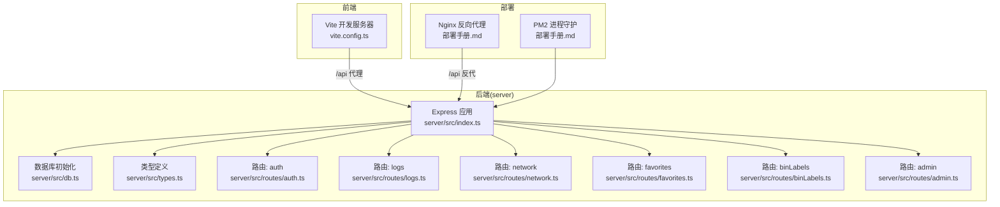
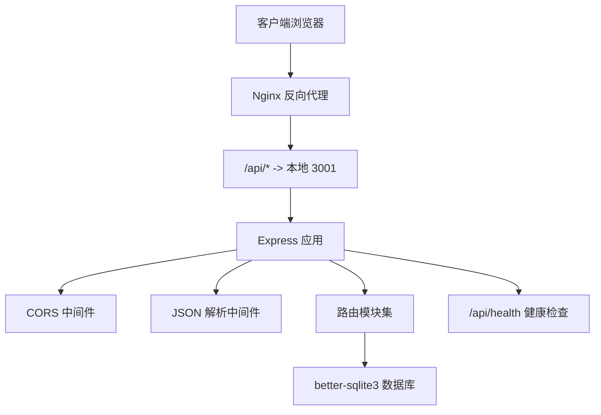
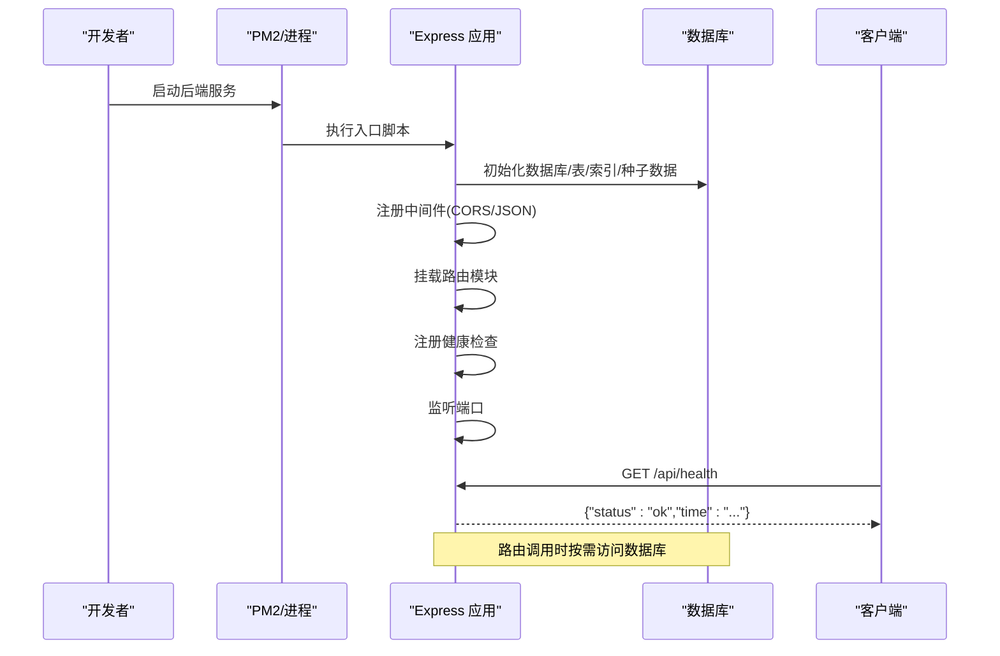
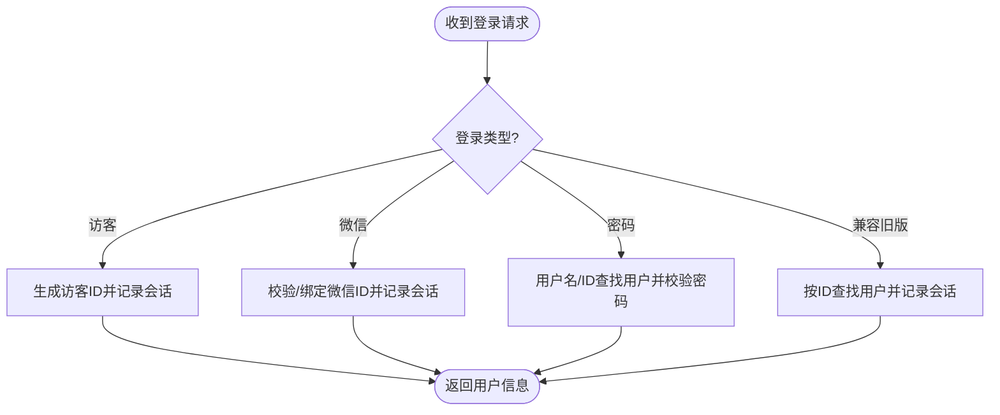
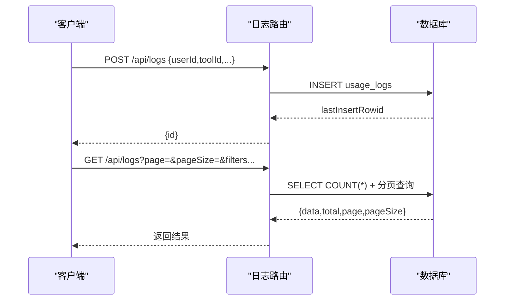
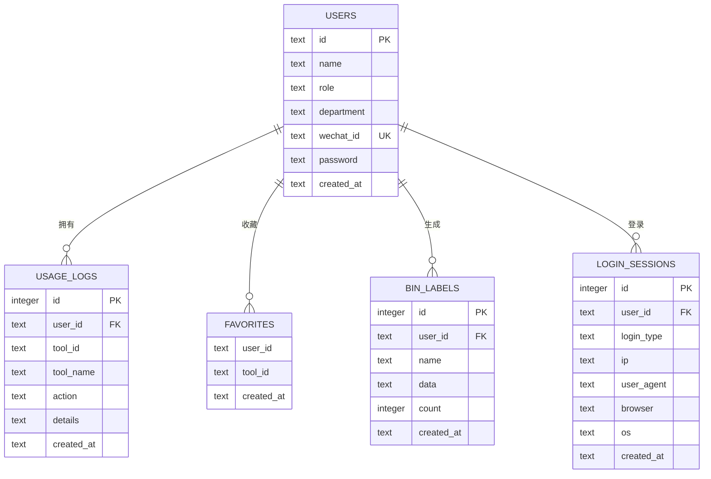
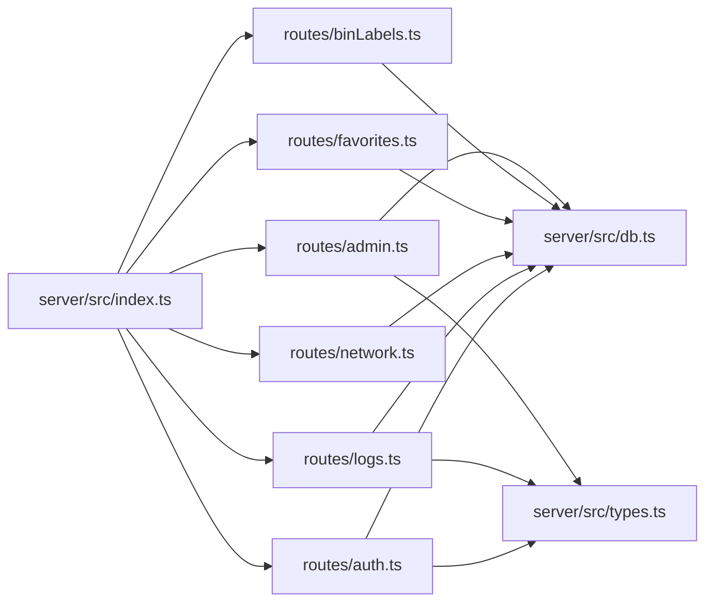

# 服务器架构

<cite>
**本文引用的文件**
- [server/src/index.ts](file://server/src/index.ts)
- [server/package.json](file://server/package.json)
- [server/src/db.ts](file://server/src/db.ts)
- [server/src/types.ts](file://server/src/types.ts)
- [server/src/routes/auth.ts](file://server/src/routes/auth.ts)
- [server/src/routes/logs.ts](file://server/src/routes/logs.ts)
- [server/src/routes/network.ts](file://server/src/routes/network.ts)
- [server/src/routes/favorites.ts](file://server/src/routes/favorites.ts)
- [server/src/routes/binLabels.ts](file://server/src/routes/binLabels.ts)
- [server/src/routes/admin.ts](file://server/src/routes/admin.ts)
- [server/tsconfig.json](file://server/tsconfig.json)
- [部署手册.md](file://部署手册.md)
- [vite.config.ts](file://vite.config.ts)
</cite>

## 目录
1. [引言](#引言)
2. [项目结构](#项目结构)
3. [核心组件](#核心组件)
4. [架构总览](#架构总览)
5. [详细组件分析](#详细组件分析)
6. [依赖关系分析](#依赖关系分析)
7. [性能考量](#性能考量)
8. [故障排查指南](#故障排查指南)
9. [结论](#结论)
10. [附录](#附录)

## 引言
本文件面向服务器架构的技术文档，围绕基于 Express.js 的后端应用进行系统化梳理，涵盖服务器启动流程、端口与环境变量管理、CORS 配置策略、请求解析中间件、健康检查机制、模块加载与依赖注入顺序、错误处理策略、日志记录与性能监控方案，以及部署最佳实践与扩展性建议。文档同时结合生产部署手册与前端代理配置，帮助读者从开发到上线形成完整的工程化认知。

## 项目结构
后端采用 Express + TypeScript + better-sqlite3 的轻量架构，核心入口位于 server/src/index.ts，路由按功能拆分在 server/src/routes 下，数据库初始化与表结构定义在 server/src/db.ts，类型定义集中在 server/src/types.ts。前端通过 Vite 在开发时以代理方式访问后端接口，生产环境由 Nginx 提供反向代理与静态资源服务。

图表来源
- [server/src/index.ts:1-31](file://server/src/index.ts#L1-L31)
- [server/src/db.ts:1-126](file://server/src/db.ts#L1-L126)
- [server/src/types.ts:1-46](file://server/src/types.ts#L1-L46)
- [server/src/routes/auth.ts:1-109](file://server/src/routes/auth.ts#L1-L109)
- [server/src/routes/logs.ts:1-134](file://server/src/routes/logs.ts#L1-L134)
- [server/src/routes/network.ts:1-109](file://server/src/routes/network.ts#L1-L109)
- [server/src/routes/favorites.ts:1-31](file://server/src/routes/favorites.ts#L1-L31)
- [server/src/routes/binLabels.ts:1-65](file://server/src/routes/binLabels.ts#L1-L65)
- [server/src/routes/admin.ts:1-93](file://server/src/routes/admin.ts#L1-L93)
- [部署手册.md:117-167](file://部署手册.md#L117-L167)
- [部署手册.md:170-227](file://部署手册.md#L170-L227)
- [vite.config.ts:12-19](file://vite.config.ts#L12-L19)

章节来源
- [server/src/index.ts:1-31](file://server/src/index.ts#L1-L31)
- [server/src/db.ts:1-126](file://server/src/db.ts#L1-L126)
- [server/src/types.ts:1-46](file://server/src/types.ts#L1-L46)
- [server/src/routes/auth.ts:1-109](file://server/src/routes/auth.ts#L1-L109)
- [server/src/routes/logs.ts:1-134](file://server/src/routes/logs.ts#L1-L134)
- [server/src/routes/network.ts:1-109](file://server/src/routes/network.ts#L1-L109)
- [server/src/routes/favorites.ts:1-31](file://server/src/routes/favorites.ts#L1-L31)
- [server/src/routes/binLabels.ts:1-65](file://server/src/routes/binLabels.ts#L1-L65)
- [server/src/routes/admin.ts:1-93](file://server/src/routes/admin.ts#L1-L93)
- [vite.config.ts:1-21](file://vite.config.ts#L1-L21)
- [部署手册.md:1-467](file://部署手册.md#L1-L467)

## 核心组件
- 应用入口与中间件
  - Express 实例创建、CORS 中间件、JSON 请求体解析、路由挂载、健康检查端点、端口监听。
- 数据库层
  - better-sqlite3 初始化、WAL 模式、外键约束、表结构与索引、种子数据插入。
- 类型系统
  - 用户、登录会话、使用日志、查询参数等接口定义。
- 路由模块
  - 认证登录、日志采集与统计、网络工具（DNS/IP/Ping/HTTP）、收藏夹、二进制标签记录、管理员后台。
- 部署与运行
  - Nginx 反向代理、PM2 进程守护、环境变量（端口、CORS、Node 环境）、健康检查验证。

章节来源
- [server/src/index.ts:10-31](file://server/src/index.ts#L10-L31)
- [server/src/db.ts:8-75](file://server/src/db.ts#L8-L75)
- [server/src/types.ts:1-46](file://server/src/types.ts#L1-L46)
- [server/src/routes/auth.ts:36-106](file://server/src/routes/auth.ts#L36-L106)
- [server/src/routes/logs.ts:7-131](file://server/src/routes/logs.ts#L7-L131)
- [server/src/routes/network.ts:10-106](file://server/src/routes/network.ts#L10-L106)
- [server/src/routes/favorites.ts:6-28](file://server/src/routes/favorites.ts#L6-L28)
- [server/src/routes/binLabels.ts:15-62](file://server/src/routes/binLabels.ts#L15-L62)
- [server/src/routes/admin.ts:7-90](file://server/src/routes/admin.ts#L7-L90)
- [部署手册.md:117-167](file://部署手册.md#L117-L167)
- [部署手册.md:170-227](file://部署手册.md#L170-L227)

## 架构总览
后端采用“入口应用 + 路由模块 + 数据库”的分层结构。Express 应用负责中间件与路由注册，路由模块封装业务逻辑并通过数据库层持久化数据。生产环境通过 Nginx 将静态资源与 API 请求分发至后端服务，PM2 负责进程守护与日志管理。

图表来源
- [server/src/index.ts:14-26](file://server/src/index.ts#L14-L26)
- [server/src/index.ts:17-22](file://server/src/index.ts#L17-L22)
- [server/src/index.ts:28-30](file://server/src/index.ts#L28-L30)
- [server/src/db.ts:8-10](file://server/src/db.ts#L8-L10)
- [部署手册.md:117-167](file://部署手册.md#L117-L167)

## 详细组件分析

### 应用入口与启动流程
- 初始化
  - 创建 Express 实例，读取环境变量 PORT 与 CORS_ORIGIN，设置 CORS 与 JSON 解析中间件。
  - 注册各路由模块于 /api/{prefix}。
  - 提供 /api/health 健康检查端点。
  - 监听端口并输出启动日志。
- 依赖注入与模块加载顺序
  - db.ts 在路由模块导入时被初始化，确保路由中对数据库的操作可用。
  - types.ts 作为共享类型定义，被路由与数据库模块共同引用。
- 错误处理
  - 当前入口未显式注册全局错误处理器，建议在路由之后追加统一错误处理中间件，避免未捕获异常导致进程退出。
- 性能与监控
  - 建议引入请求耗时指标与响应大小统计，结合 PM2 的内存监控与日志聚合实现基础性能观测。

图表来源
- [server/src/index.ts:10-31](file://server/src/index.ts#L10-L31)
- [server/src/db.ts:77-123](file://server/src/db.ts#L77-L123)
- [部署手册.md:170-227](file://部署手册.md#L170-L227)

章节来源
- [server/src/index.ts:10-31](file://server/src/index.ts#L10-L31)
- [server/src/db.ts:77-123](file://server/src/db.ts#L77-L123)
- [部署手册.md:170-227](file://部署手册.md#L170-L227)

### CORS 配置策略
- 配置来源：入口文件读取 CORS_ORIGIN 环境变量，传递给 cors 中间件。
- 策略建议：
  - 开发环境可设为通配符以支持多前端地址。
  - 生产环境建议限定为具体域名，降低跨站风险。
  - 若存在子域或多端口场景，可在部署手册的 ecosystem 配置中统一管理。

章节来源
- [server/src/index.ts:12-14](file://server/src/index.ts#L12-L14)
- [部署手册.md:231-249](file://部署手册.md#L231-L249)

### 请求解析中间件设置
- JSON 解析：限制最大 5MB，避免过大请求导致内存压力。
- 建议：
  - 对外部可信任网关可放宽限制，但需配合速率限制与超时控制。
  - 对上传类接口建议使用专用中间件或文件存储策略。

章节来源
- [server/src/index.ts:15](file://server/src/index.ts#L15)

### 健康检查机制
- 端点：GET /api/health 返回状态与时间戳。
- 部署验证：部署手册提供了 curl 验证示例，便于快速确认服务可用性。

章节来源
- [server/src/index.ts:24-26](file://server/src/index.ts#L24-L26)
- [部署手册.md:391-407](file://部署手册.md#L391-L407)

### 认证与会话记录
- 登录类型：访客、微信、密码、兼容旧版 userId。
- 会话记录：登录时记录 IP、UA、浏览器、操作系统信息到 login_sessions 表。
- 安全要点：
  - 密码校验策略兼容用户 id 作为默认密码，生产环境建议强制设置强口令。
  - 建议引入令牌签发与鉴权中间件，配合管理员路由的权限校验。

图表来源
- [server/src/routes/auth.ts:36-106](file://server/src/routes/auth.ts#L36-L106)

章节来源
- [server/src/routes/auth.ts:1-109](file://server/src/routes/auth.ts#L1-L109)

### 日志采集与统计
- 写入：POST /api/logs 创建使用日志。
- 查询：GET /api/logs 支持用户、工具、关键词、时间范围、分页。
- 统计：GET /api/logs/stats 提供当日/周/月用量、热门工具、趋势、最近日志、活跃用户。
- 索引：对用户、工具、时间建立索引，优化查询性能。

图表来源
- [server/src/routes/logs.ts:7-69](file://server/src/routes/logs.ts#L7-L69)
- [server/src/db.ts:26-39](file://server/src/db.ts#L26-L39)

章节来源
- [server/src/routes/logs.ts:1-134](file://server/src/routes/logs.ts#L1-L134)
- [server/src/db.ts:26-39](file://server/src/db.ts#L26-L39)

### 网络工具
- IP 查询：调用第三方免费接口返回地理信息。
- DNS 查询：支持指定 RR 类型解析。
- Ping：跨平台执行 ping 并返回输出。
- HTTP 代理：转发请求并返回状态、头与截断后的响应体，带耗时统计。
- 错误处理：对网络异常与超时进行捕获并返回标准错误格式。

章节来源
- [server/src/routes/network.ts:1-109](file://server/src/routes/network.ts#L1-L109)

### 收藏夹
- 获取：按用户 ID 返回收藏工具 ID 列表。
- 添加/删除：幂等插入与条件删除。

章节来源
- [server/src/routes/favorites.ts:1-31](file://server/src/routes/favorites.ts#L1-L31)

### 二进制标签记录
- 查询、详情、保存、删除，均基于用户维度与必要字段校验。

章节来源
- [server/src/routes/binLabels.ts:1-65](file://server/src/routes/binLabels.ts#L1-L65)

### 管理员后台
- 权限：通过自定义中间件校验 x-user-id 对应用户是否为 admin。
- 用户管理：增删改查。
- 登录会话与使用日志：分页查询与关键字过滤。

章节来源
- [server/src/routes/admin.ts:1-93](file://server/src/routes/admin.ts#L1-L93)

### 数据库模型
- 用户、使用日志、收藏夹、二进制标签、登录会话。
- 索引：针对高频查询字段建立索引。
- 种子数据：首次启动自动插入默认用户与示例日志。

图表来源
- [server/src/db.ts:13-75](file://server/src/db.ts#L13-L75)
- [server/src/types.ts:1-46](file://server/src/types.ts#L1-L46)

章节来源
- [server/src/db.ts:1-126](file://server/src/db.ts#L1-L126)
- [server/src/types.ts:1-46](file://server/src/types.ts#L1-L46)

## 依赖关系分析
- 入口对路由的依赖：通过 app.use 挂载各模块。
- 路由对数据库与类型的依赖：路由内部导入 db.ts 与 types.ts。
- 数据库对 better-sqlite3 的依赖：在 db.ts 中直接实例化并初始化。
- 前端代理：开发时通过 vite.config.ts 将 /api 代理到本地 3001，生产由 Nginx 反向代理。

图表来源
- [server/src/index.ts:17-22](file://server/src/index.ts#L17-L22)
- [server/src/routes/auth.ts:1-4](file://server/src/routes/auth.ts#L1-L4)
- [server/src/routes/logs.ts:1-4](file://server/src/routes/logs.ts#L1-L4)
- [server/src/routes/network.ts:1-2](file://server/src/routes/network.ts#L1-L2)
- [server/src/routes/favorites.ts:1-3](file://server/src/routes/favorites.ts#L1-L3)
- [server/src/routes/binLabels.ts:1-3](file://server/src/routes/binLabels.ts#L1-L3)
- [server/src/routes/admin.ts:1-4](file://server/src/routes/admin.ts#L1-L4)
- [server/src/db.ts:1](file://server/src/db.ts#L1)
- [server/src/types.ts:1](file://server/src/types.ts#L1)

章节来源
- [server/src/index.ts:17-22](file://server/src/index.ts#L17-L22)
- [server/src/routes/auth.ts:1-4](file://server/src/routes/auth.ts#L1-L4)
- [server/src/routes/logs.ts:1-4](file://server/src/routes/logs.ts#L1-L4)
- [server/src/routes/network.ts:1-2](file://server/src/routes/network.ts#L1-L2)
- [server/src/routes/favorites.ts:1-3](file://server/src/routes/favorites.ts#L1-L3)
- [server/src/routes/binLabels.ts:1-3](file://server/src/routes/binLabels.ts#L1-L3)
- [server/src/routes/admin.ts:1-4](file://server/src/routes/admin.ts#L1-L4)
- [server/src/db.ts:1](file://server/src/db.ts#L1)
- [server/src/types.ts:1](file://server/src/types.ts#L1)

## 性能考量
- 数据库
  - WAL 模式与外键开启有助于并发与一致性；建议定期分析慢查询与索引使用情况。
  - 对大字段（如日志详情）建议分表或归档策略，减少主表膨胀。
- 接口
  - 日志查询支持分页与上限控制，避免一次性返回过多数据。
  - HTTP 代理对非文本响应体进行截断，防止超大数据回传。
- 运行时
  - PM2 提供内存监控与日志聚合，建议设置 max_memory_restart 与日志轮转。
  - 生产环境启用 NODE_ENV=production 以获得更佳性能。

章节来源
- [server/src/db.ts:9-10](file://server/src/db.ts#L9-L10)
- [server/src/routes/logs.ts:28-29](file://server/src/routes/logs.ts#L28-L29)
- [server/src/routes/network.ts:89-94](file://server/src/routes/network.ts#L89-L94)
- [部署手册.md:170-227](file://部署手册.md#L170-L227)
- [部署手册.md:231-249](file://部署手册.md#L231-L249)

## 故障排查指南
- 健康检查失败
  - 使用部署手册提供的 curl 命令验证 /api/health。
- CORS 报错
  - 确认 CORS_ORIGIN 设置为允许的域名或通配符。
- 端口冲突
  - 使用 lsof 检查 3001 占用并释放后重试。
- 前端 404 或无法连接 API
  - 确认 Nginx 的 try_files 配置与 /api 反代规则。
  - 确认前端代理或反代指向正确的后端地址。
- 数据库文件丢失
  - 升级前务必备份 data.db，并在恢复后重启服务。

章节来源
- [部署手册.md:391-407](file://部署手册.md#L391-L407)
- [部署手册.md:425-438](file://部署手册.md#L425-L438)
- [部署手册.md:411-424](file://部署手册.md#L411-L424)
- [部署手册.md:291-315](file://部署手册.md#L291-L315)

## 结论
该服务器架构以 Express 为核心，结合 better-sqlite3 实现轻量级持久化，路由清晰分层，具备基本的认证、日志、网络工具与管理员能力。生产部署通过 Nginx 与 PM2 形成稳定的服务边界，配合环境变量与健康检查保障可运维性。建议后续补充统一错误处理、鉴权中间件、指标监控与告警，以进一步提升稳定性与可观测性。

## 附录
- 环境变量
  - PORT：后端监听端口，默认 3001。
  - CORS_ORIGIN：允许的跨域来源，默认通配符。
  - NODE_ENV：设为 production 以提升性能。
- 前端代理
  - 开发时通过 Vite 将 /api 代理到本地 3001，确保与生产反代一致。
- 构建与类型配置
  - server/tsconfig.json 指定 ESNext 模块与 bundler 解析，便于打包与运行。

章节来源
- [server/src/index.ts:11-12](file://server/src/index.ts#L11-L12)
- [server/package.json:6-9](file://server/package.json#L6-L9)
- [vite.config.ts:12-19](file://vite.config.ts#L12-L19)
- [server/tsconfig.json:1-14](file://server/tsconfig.json#L1-L14)
- [部署手册.md:231-249](file://部署手册.md#L231-L249)