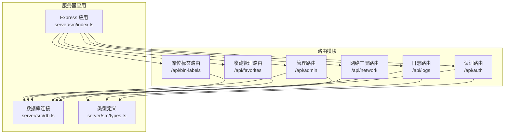
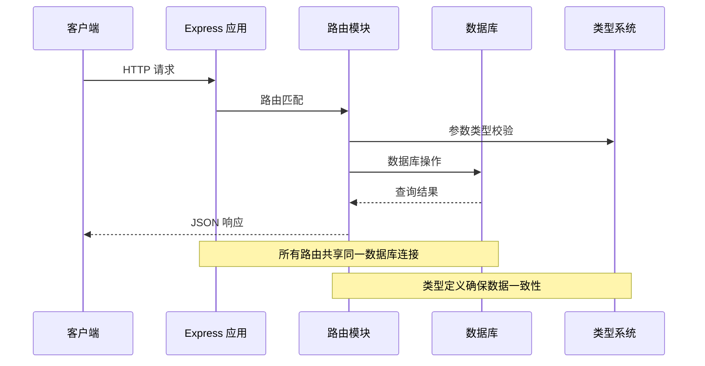
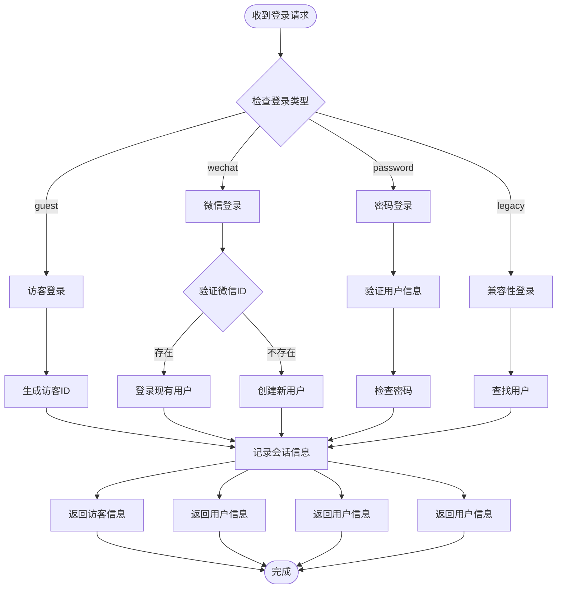
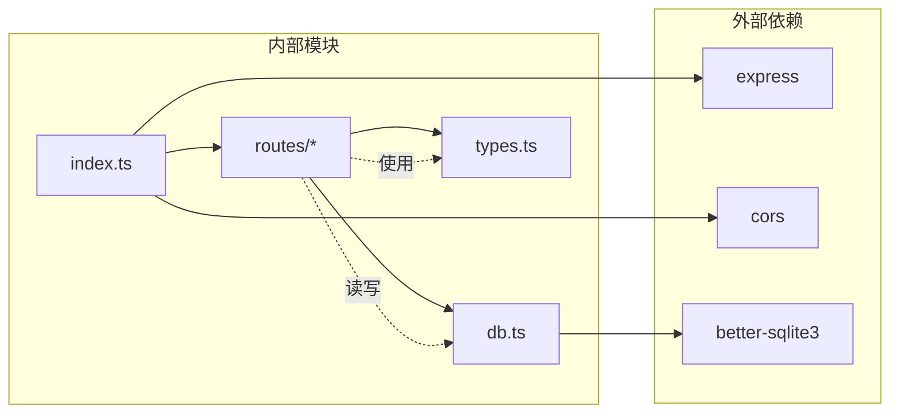
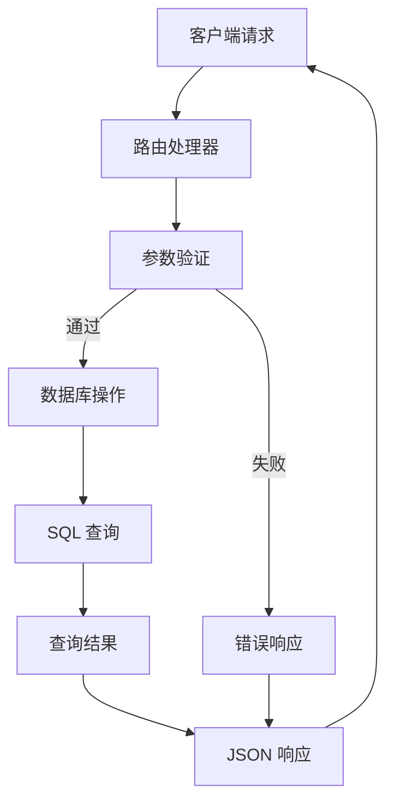

# 路由系统

<cite>
**本文档引用的文件**
- [server/src/index.ts](file://server/src/index.ts)
- [server/src/db.ts](file://server/src/db.ts)
- [server/src/types.ts](file://server/src/types.ts)
- [server/src/routes/auth.ts](file://server/src/routes/auth.ts)
- [server/src/routes/logs.ts](file://server/src/routes/logs.ts)
- [server/src/routes/network.ts](file://server/src/routes/network.ts)
- [server/src/routes/favorites.ts](file://server/src/routes/favorites.ts)
- [server/src/routes/binLabels.ts](file://server/src/routes/binLabels.ts)
- [server/src/routes/admin.ts](file://server/src/routes/admin.ts)
</cite>

## 目录
1. [简介](#简介)
2. [项目结构](#项目结构)
3. [核心组件](#核心组件)
4. [架构总览](#架构总览)
5. [详细组件分析](#详细组件分析)
6. [依赖分析](#依赖分析)
7. [性能考虑](#性能考虑)
8. [故障排除指南](#故障排除指南)
9. [结论](#结论)
10. [附录](#附录)

## 简介
本项目为一个基于 Node.js + Express 的工具箱后端服务，采用模块化路由设计，提供 RESTful API 接口。系统通过统一入口注册多个功能路由模块，每个模块负责特定业务领域的接口实现，并通过内置的 SQLite 数据库存储业务数据。路由系统遵循清晰的命名约定和分层架构，支持认证、日志统计、网络工具、收藏管理、库位标签管理和后台管理等核心功能。

## 项目结构
后端服务采用分层架构设计，主要目录结构如下：
- server/src：核心源代码目录
  - routes：路由模块目录，按功能划分
  - db.ts：数据库初始化和表结构定义
  - types.ts：TypeScript 类型定义
  - index.ts：应用入口和路由注册
- server/data.db：SQLite 数据库文件（自动生成）



**图表来源**
- [server/src/index.ts:1-31](file://server/src/index.ts#L1-L31)
- [server/src/db.ts:1-126](file://server/src/db.ts#L1-L126)
- [server/src/types.ts:1-46](file://server/src/types.ts#L1-L46)

**章节来源**
- [server/src/index.ts:1-31](file://server/src/index.ts#L1-L31)
- [server/src/db.ts:1-126](file://server/src/db.ts#L1-L126)

## 核心组件
路由系统的核心组件包括应用入口、数据库连接、类型定义和六个功能路由模块。每个组件都有明确的职责分工和接口规范。

### 应用入口组件
应用入口负责初始化 Express 应用、配置中间件和注册路由模块。主要特性包括：
- CORS 跨域资源共享配置
- JSON 请求体解析（限制 5MB）
- 健康检查端点
- 统一路由前缀注册

### 数据库组件
数据库组件负责 SQLite 连接管理和表结构初始化，包含以下核心表：
- users：用户信息表
- usage_logs：使用日志表  
- favorites：用户收藏表
- bin_labels：库位标签记录表
- login_sessions：登录会话表

### 类型定义组件
类型定义组件提供 TypeScript 接口定义，确保路由层与数据库层的数据一致性，包括用户、日志、查询参数等接口。

**章节来源**
- [server/src/index.ts:10-26](file://server/src/index.ts#L10-L26)
- [server/src/db.ts:12-75](file://server/src/db.ts#L12-L75)
- [server/src/types.ts:1-46](file://server/src/types.ts#L1-L46)

## 架构总览
路由系统采用模块化设计，通过统一的应用入口集中管理各个功能模块。系统架构遵循 RESTful 设计原则，每个路由模块独立处理特定业务领域的请求。



**图表来源**
- [server/src/index.ts:17-22](file://server/src/index.ts#L17-L22)
- [server/src/db.ts:8](file://server/src/db.ts#L8)
- [server/src/types.ts:1-46](file://server/src/types.ts#L1-L46)

## 详细组件分析

### 认证路由模块 (/api/auth)
认证路由模块提供多种登录方式和用户管理功能，支持访客模式、微信登录和密码登录三种认证方式。

#### 功能特性
- 多种登录方式支持
- 客户端信息记录（IP、浏览器、操作系统）
- 用户会话跟踪
- 用户信息查询

#### 登录流程图


**图表来源**
- [server/src/routes/auth.ts:36-106](file://server/src/routes/auth.ts#L36-L106)

#### 客户端信息收集
系统能够自动识别客户端的基本信息：
- IP 地址提取（支持代理头）
- User-Agent 解析
- 浏览器类型识别（Chrome、Firefox、Safari、Edge）
- 操作系统识别（Windows、macOS、Linux）

**章节来源**
- [server/src/routes/auth.ts:7-29](file://server/src/routes/auth.ts#L7-L29)
- [server/src/routes/auth.ts:36-106](file://server/src/routes/auth.ts#L36-L106)

### 日志路由模块 (/api/logs)
日志路由模块负责用户工具使用行为的记录、查询和统计分析，提供完整的日志生命周期管理。

#### 功能特性
- 使用日志记录
- 分页查询和多条件过滤
- 统计数据分析
- 最近使用记录展示

#### 查询参数设计
日志查询支持以下参数：
- userId：用户ID过滤
- toolId：工具ID过滤  
- keyword：关键词搜索（工具名、动作、详情）
- startDate/endDate：时间范围过滤
- page/pageSize：分页控制（默认第1页，每页20条，最大100条）

#### 统计分析接口
系统提供多维度的统计分析：
- 当日使用次数
- 本周使用次数  
- 本月使用次数
- 总使用次数
- 热门工具排行（Top 10）
- 近14天使用趋势
- 最近10条使用记录
- 活跃用户统计（管理员专用）

**章节来源**
- [server/src/routes/logs.ts:7-18](file://server/src/routes/logs.ts#L7-L18)
- [server/src/routes/logs.ts:20-69](file://server/src/routes/logs.ts#L20-L69)
- [server/src/routes/logs.ts:71-131](file://server/src/routes/logs.ts#L71-L131)

### 网络工具路由模块 (/api/network)
网络工具路由模块提供网络诊断和测试功能，集成多个常用的网络工具。

#### 支持的网络工具
- **IP 查询**：基于 ip-api.com 提供免费的 IP 地理位置查询
- **DNS 查询**：支持多种 DNS 记录类型的查询（A、AAAA、MX、TXT 等）
- **Ping 测试**：跨平台的网络连通性测试
- **HTTP 代理**：通用的 HTTP 请求代理工具

#### 错误处理机制
每个网络工具都实现了完善的错误处理：
- 输入参数验证
- 异步操作超时控制（30秒）
- 平台差异适配（Windows/Linux）
- 友好的错误信息反馈

**章节来源**
- [server/src/routes/network.ts:10-25](file://server/src/routes/network.ts#L10-L25)
- [server/src/routes/network.ts:27-45](file://server/src/routes/network.ts#L27-L45)
- [server/src/routes/network.ts:47-63](file://server/src/routes/network.ts#L47-L63)
- [server/src/routes/network.ts:65-106](file://server/src/routes/network.ts#L65-L106)

### 收藏管理路由模块 (/api/favorites)
收藏管理路由模块提供用户工具收藏功能，支持收藏的增删查操作。

#### 数据模型
收藏数据采用复合主键设计，确保每个用户对同一工具只能收藏一次。

#### API 设计
- GET /api/favorites/:userId - 获取用户收藏列表
- POST /api/favorites/:userId - 添加收藏
- DELETE /api/favorites/:userId/:toolId - 删除收藏

#### 业务逻辑
- 收藏去重机制（INSERT OR IGNORE）
- 实时同步用户收藏状态
- 支持批量操作优化

**章节来源**
- [server/src/routes/favorites.ts:6-11](file://server/src/routes/favorites.ts#L6-L11)
- [server/src/routes/favorites.ts:13-21](file://server/src/routes/favorites.ts#L13-L21)
- [server/src/routes/favorites.ts:23-28](file://server/src/routes/favorites.ts#L23-L28)

### 库位标签路由模块 (/api/bin-labels)
库位标签路由模块专门处理库位标签生成记录的管理功能。

#### 核心功能
- 标签记录查询（按用户过滤）
- 单条记录详情获取
- 新记录保存
- 记录删除（带权限验证）

#### 数据完整性保证
- 外键约束确保用户存在性
- 时间戳自动记录
- 数字字段类型验证

**章节来源**
- [server/src/routes/binLabels.ts:15-26](file://server/src/routes/binLabels.ts#L15-L26)
- [server/src/routes/binLabels.ts:28-37](file://server/src/routes/binLabels.ts#L28-L37)
- [server/src/routes/binLabels.ts:39-50](file://server/src/routes/binLabels.ts#L39-L50)
- [server/src/routes/binLabels.ts:52-62](file://server/src/routes/binLabels.ts#L52-L62)

### 管理路由模块 (/api/admin)
管理路由模块提供后台管理功能，包含用户管理、登录会话管理和使用日志管理。

#### 安全机制
- 角色验证中间件（仅管理员可访问）
- 请求头身份验证（x-user-id）
- 权限分级控制

#### 管理功能
- **用户管理**：查询、创建、更新、删除用户
- **登录会话**：分页查询所有登录记录
- **使用日志**：管理员视角的全局日志查询

#### 中间件设计
管理员中间件在路由执行前进行权限验证，确保只有具备 admin 角色的用户才能访问管理功能。

**章节来源**
- [server/src/routes/admin.ts:7-14](file://server/src/routes/admin.ts#L7-L14)
- [server/src/routes/admin.ts:18-49](file://server/src/routes/admin.ts#L18-L49)
- [server/src/routes/admin.ts:51-90](file://server/src/routes/admin.ts#L51-L90)

## 依赖分析
路由系统的依赖关系清晰明确，遵循单一职责原则和依赖倒置原则。



**图表来源**
- [server/src/index.ts:1-8](file://server/src/index.ts#L1-L8)
- [server/src/db.ts:1-2](file://server/src/db.ts#L1-L2)
- [server/package.json:10-21](file://server/package.json#L10-L21)

### 模块耦合度分析
- **低耦合**：各路由模块相互独立，无直接依赖关系
- **向上依赖**：路由模块依赖数据库和类型定义
- **向下依赖**：数据库模块不依赖任何路由模块
- **循环依赖**：系统中不存在循环依赖

### 数据流分析


**图表来源**
- [server/src/routes/auth.ts:36-106](file://server/src/routes/auth.ts#L36-L106)
- [server/src/routes/logs.ts:20-69](file://server/src/routes/logs.ts#L20-L69)
- [server/src/routes/network.ts:10-25](file://server/src/routes/network.ts#L10-L25)

**章节来源**
- [server/src/index.ts:17-22](file://server/src/index.ts#L17-L22)
- [server/src/db.ts:12-75](file://server/src/db.ts#L12-L75)

## 性能考虑
路由系统在设计时充分考虑了性能优化和资源管理。

### 数据库优化
- **WAL 模式**：启用写前日志模式提升并发性能
- **外键约束**：确保数据一致性的同时保持查询效率
- **索引策略**：为常用查询字段建立索引
- **事务处理**：批量操作使用事务确保原子性

### 内存管理
- **请求体大小限制**：JSON 解析限制为 5MB，防止内存溢出
- **查询结果限制**：分页查询默认每页20条，最大100条
- **字符串截断**：长响应体自动截断避免内存占用过高

### 缓存策略
- **会话缓存**：登录会话信息实时记录
- **查询缓存**：热门查询结果可利用索引快速返回

## 故障排除指南
路由系统提供了完善的错误处理机制和调试支持。

### 常见错误类型
- **400 错误**：请求参数无效或缺失
- **401 错误**：未授权访问（缺少身份验证）
- **403 错误**：权限不足（非管理员访问管理功能）
- **404 错误**：资源不存在
- **500 错误**：服务器内部错误

### 调试方法
1. **健康检查**：访问 `/api/health` 确认服务正常运行
2. **日志记录**：检查服务器控制台输出
3. **数据库状态**：验证表结构和数据完整性
4. **网络工具测试**：使用网络工具模块测试外部连接

### 性能监控
- **响应时间**：HTTP 代理工具返回耗时信息
- **数据库查询**：索引使用情况监控
- **内存使用**：请求体大小限制防止内存泄漏

**章节来源**
- [server/src/index.ts:24-26](file://server/src/index.ts#L24-L26)
- [server/src/routes/network.ts:65-106](file://server/src/routes/network.ts#L65-L106)

## 结论
该路由系统采用模块化设计，功能清晰、结构合理，完全满足工具箱应用的后端需求。系统具有以下优势：

1. **架构清晰**：模块化路由设计便于维护和扩展
2. **功能完整**：覆盖认证、日志、网络工具、收藏管理等核心功能
3. **安全可靠**：完善的权限控制和错误处理机制
4. **性能优化**：合理的数据库设计和资源管理策略
5. **易于扩展**：标准化的路由模式为后续功能扩展奠定基础

建议在未来版本中进一步完善：
- 添加统一的请求验证中间件
- 增加 API 文档自动生成
- 实现更细粒度的权限控制
- 添加缓存层提升性能

## 附录

### API 接口规范
所有路由均遵循 RESTful 设计原则，使用标准 HTTP 方法和状态码。

#### 常用状态码
- 200：请求成功
- 201：资源创建成功
- 400：请求参数错误
- 401：未授权
- 403：禁止访问
- 404：资源不存在
- 500：服务器内部错误

#### 错误响应格式
```json
{
  "error": "错误描述信息"
}
```

### 开发环境配置
- Node.js 版本：16+
- 数据库：SQLite 3.x
- 开发工具：TypeScript + TSX

### 部署建议
- 生产环境使用 PM2 或类似进程管理器
- 配置适当的 CORS 策略
- 设置环境变量控制端口和跨域
- 定期备份数据库文件