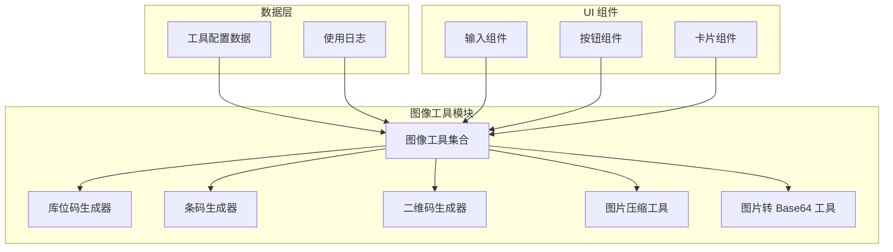
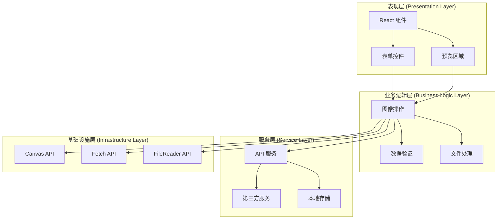
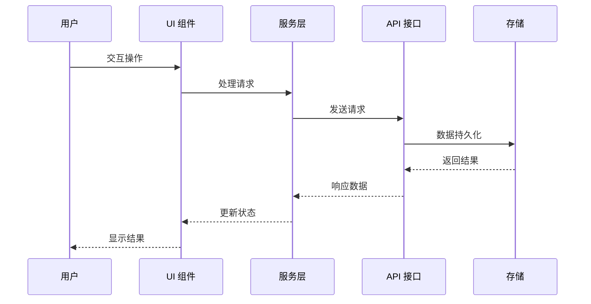
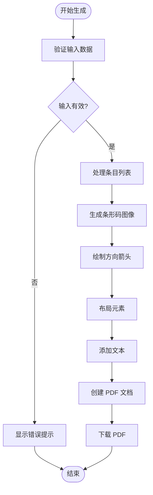
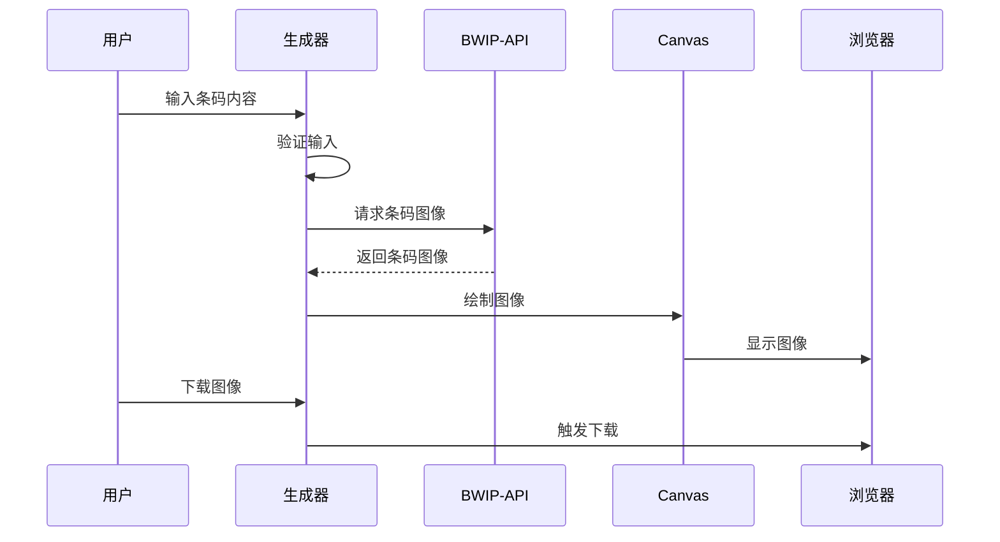
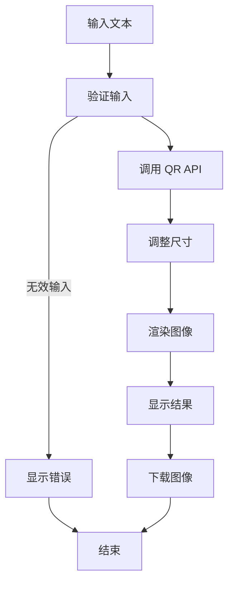
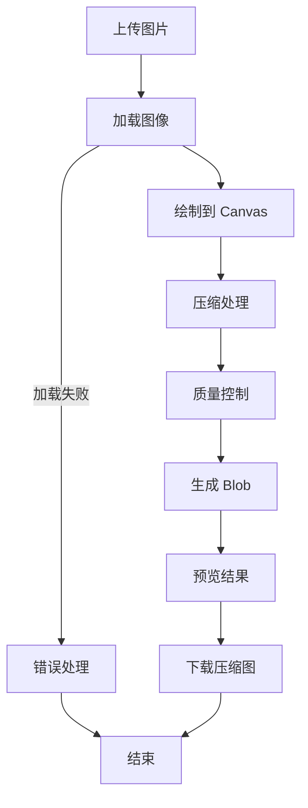
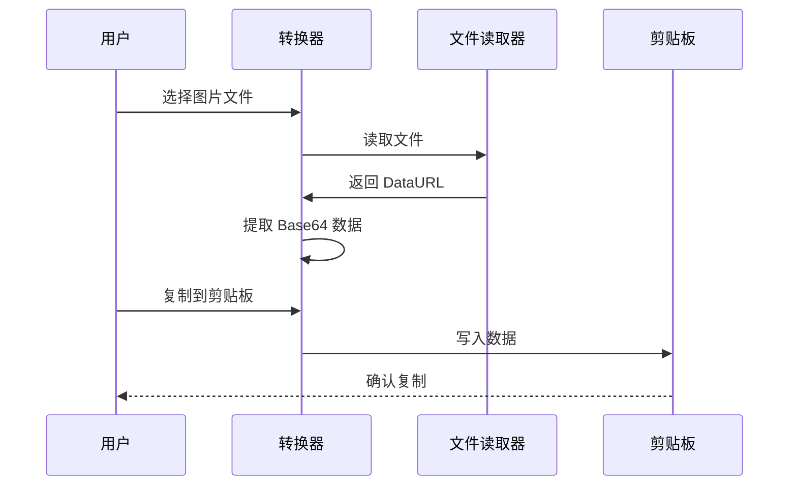
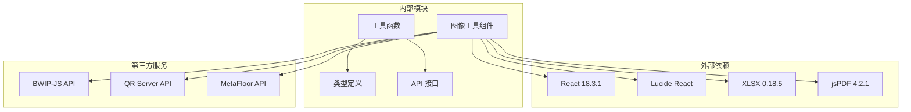

# 图像工具

<cite>
**本文引用的文件**
- [BinLocationGenerator.tsx](file://src/tools/BinLocationGenerator.tsx)
- [BarcodeGenerator.tsx](file://src/tools/BarcodeGenerator.tsx)
- [QrGenerator.tsx](file://src/tools/QrGenerator.tsx)
- [ImageCompress.tsx](file://src/tools/ImageCompress.tsx)
- [ImageToBase64.tsx](file://src/tools/ImageToBase64.tsx)
- [tools.ts](file://src/data/tools.ts)
- [api.ts](file://src/lib/api.ts)
- [types.ts](file://src/types/index.ts)
- [package.json](file://package.json)
</cite>

## 目录
1. [简介](#简介)
2. [项目结构](#项目结构)
3. [核心组件](#核心组件)
4. [架构概览](#架构概览)
5. [详细组件分析](#详细组件分析)
6. [依赖关系分析](#依赖关系分析)
7. [性能考虑](#性能考虑)
8. [故障排除指南](#故障排除指南)
9. [结论](#结论)

## 简介

图像工具模块是 AnyTools 应用程序中的一个重要功能集合，专门提供各种图像处理和生成服务。该模块包含五个核心工具：库位码生成器、条码生成器、二维码生成器、图片压缩工具和图片转 Base64 工具。这些工具基于现代 Web 技术构建，利用 Canvas API、Web Workers 和第三方服务来实现高效的图像处理功能。

本模块采用 React Hooks 架构，提供了直观的用户界面和强大的图像处理能力。所有工具都集成了使用日志记录功能，便于追踪用户行为和优化用户体验。

## 项目结构

图像工具模块位于应用程序的前端代码结构中，采用按功能组织的目录布局：

**图表来源**
- [tools.ts:163-211](file://src/data/tools.ts#L163-L211)
- [BinLocationGenerator.tsx:1-604](file://src/tools/BinLocationGenerator.tsx#L1-L604)

**章节来源**
- [tools.ts:163-211](file://src/data/tools.ts#L163-L211)
- [package.json:11-22](file://package.json#L11-L22)

## 核心组件

图像工具模块包含以下五个核心组件，每个都针对特定的图像处理需求：

### 1. 库位码生成器 (BinLocationGenerator)
- **功能**: 批量生成包含条码和方向箭头的库位码标签
- **特点**: 支持 CSV/XLSX 文件导入，自定义纸张尺寸和方向
- **输出**: PDF 格式的标签文档

### 2. 条码生成器 (BarcodeGenerator)
- **功能**: 生成 Code128 条形码
- **特点**: 实时预览，支持配文字显示
- **集成**: 使用 bwip-js API 服务

### 3. 二维码生成器 (QrGenerator)
- **功能**: 生成 QR 二维码
- **特点**: 可调节尺寸，支持配文字显示
- **集成**: 使用 qrserver.com API 服务

### 4. 图片压缩工具 (ImageCompress)
- **功能**: 在线压缩 PNG/JPG 图片
- **特点**: 实时质量控制，原图与压缩图对比
- **技术**: 使用 Canvas API 进行图像处理

### 5. 图片转 Base64 工具 (ImageToBase64)
- **功能**: 将图片文件转换为 Base64 编码
- **特点**: 支持复制到剪贴板，实时预览
- **用途**: 便于在 HTML/CSS 中直接嵌入图片

**章节来源**
- [tools.ts:163-211](file://src/data/tools.ts#L163-L211)
- [BinLocationGenerator.tsx:200-604](file://src/tools/BinLocationGenerator.tsx#L200-L604)
- [BarcodeGenerator.tsx:49-100](file://src/tools/BarcodeGenerator.tsx#L49-L100)
- [QrGenerator.tsx:49-92](file://src/tools/QrGenerator.tsx#L49-L92)
- [ImageCompress.tsx:7-101](file://src/tools/ImageCompress.tsx#L7-L101)
- [ImageToBase64.tsx:8-54](file://src/tools/ImageToBase64.tsx#L8-L54)

## 架构概览

图像工具模块采用分层架构设计，确保了良好的可维护性和扩展性：

**图表来源**
- [BinLocationGenerator.tsx:143-198](file://src/tools/BinLocationGenerator.tsx#L143-L198)
- [ImageCompress.tsx:27-49](file://src/tools/ImageCompress.tsx#L27-L49)
- [api.ts:3-19](file://src/lib/api.ts#L3-L19)

### 数据流架构

**图表来源**
- [api.ts:3-19](file://src/lib/api.ts#L3-L19)
- [types.ts:29-36](file://src/types/index.ts#L29-L36)

## 详细组件分析

### 库位码生成器 (BinLocationGenerator)

库位码生成器是最复杂的图像工具，提供了完整的标签生成功能：

#### 核心算法分析

**图表来源**
- [BinLocationGenerator.tsx:143-198](file://src/tools/BinLocationGenerator.tsx#L143-L198)
- [BinLocationGenerator.tsx:68-122](file://src/tools/BinLocationGenerator.tsx#L68-L122)

#### 关键特性

1. **多格式文件支持**: 支持 CSV 和 Excel 文件导入
2. **动态布局**: 根据纸张尺寸自动调整布局
3. **实时预览**: 生成 PDF 预览并支持分页浏览
4. **历史记录**: 保存和管理生成记录

#### 技术实现要点

- 使用 `jsPDF` 库进行 PDF 生成
- 通过 `bwip-js` API 生成条形码
- Canvas API 绘制方向箭头
- 文件读取和下载功能

**章节来源**
- [BinLocationGenerator.tsx:143-198](file://src/tools/BinLocationGenerator.tsx#L143-L198)
- [BinLocationGenerator.tsx:68-122](file://src/tools/BinLocationGenerator.tsx#L68-L122)
- [BinLocationGenerator.tsx:268-313](file://src/tools/BinLocationGenerator.tsx#L268-L313)

### 条码生成器 (BarcodeGenerator)

条码生成器专注于 Code128 条形码的生成：

#### 生成流程

**图表来源**
- [BarcodeGenerator.tsx:54-60](file://src/tools/BarcodeGenerator.tsx#L54-L60)
- [BarcodeGenerator.tsx:8-47](file://src/tools/BarcodeGenerator.tsx#L8-L47)

#### 算法特点

- **实时生成**: 使用第三方 API 实时生成条码
- **灵活配置**: 支持自定义尺寸和样式
- **配文字显示**: 可选的文本标注功能

**章节来源**
- [BarcodeGenerator.tsx:49-100](file://src/tools/BarcodeGenerator.tsx#L49-L100)
- [BarcodeGenerator.tsx:8-47](file://src/tools/BarcodeGenerator.tsx#L8-L47)

### 二维码生成器 (QrGenerator)

二维码生成器提供了完整的 QR 码生成功能：

#### 生成算法

**图表来源**
- [QrGenerator.tsx:55-60](file://src/tools/QrGenerator.tsx#L55-L60)
- [QrGenerator.tsx:8-47](file://src/tools/QrGenerator.tsx#L8-L47)

#### 核心功能

- **尺寸控制**: 100px 到 400px 的可调节尺寸
- **配文字显示**: 支持在二维码下方显示文本
- **高质量输出**: 使用专用 QR 服务器 API

**章节来源**
- [QrGenerator.tsx:49-92](file://src/tools/QrGenerator.tsx#L49-L92)
- [QrGenerator.tsx:8-47](file://src/tools/QrGenerator.tsx#L8-L47)

### 图片压缩工具 (ImageCompress)

图片压缩工具实现了高效的图像压缩算法：

#### 压缩算法流程

**图表来源**
- [ImageCompress.tsx:27-49](file://src/tools/ImageCompress.tsx#L27-L49)
- [ImageCompress.tsx:16-25](file://src/tools/ImageCompress.tsx#L16-L25)

#### 压缩技术分析

- **Canvas API 压缩**: 使用 `canvas.toBlob()` 方法进行压缩
- **质量参数控制**: 0.1 到 1.0 的质量范围
- **实时预览**: 原图与压缩图的对比显示
- **内存管理**: 自动清理 URL 对象避免内存泄漏

**章节来源**
- [ImageCompress.tsx:7-101](file://src/tools/ImageCompress.tsx#L7-L101)
- [ImageCompress.tsx:27-49](file://src/tools/ImageCompress.tsx#L27-L49)

### 图片转 Base64 工具 (ImageToBase64)

Base64 编码工具提供了便捷的图片编码功能：

#### 编码流程

**图表来源**
- [ImageToBase64.tsx:13-24](file://src/tools/ImageToBase64.tsx#L13-L24)
- [ImageToBase64.tsx:26-30](file://src/tools/ImageToBase64.tsx#L26-L30)

#### 编码实现特点

- **即时转换**: 文件读取完成后立即转换
- **剪贴板集成**: 支持一键复制到系统剪贴板
- **格式识别**: 自动识别图片 MIME 类型

**章节来源**
- [ImageToBase64.tsx:8-54](file://src/tools/ImageToBase64.tsx#L8-L54)
- [ImageToBase64.tsx:13-24](file://src/tools/ImageToBase64.tsx#L13-L24)

## 依赖关系分析

图像工具模块的依赖关系体现了清晰的分层架构：

**图表来源**
- [package.json:11-22](file://package.json#L11-L22)
- [BinLocationGenerator.tsx:21](file://src/tools/BinLocationGenerator.tsx#L21)
- [QrGenerator.tsx:57](file://src/tools/QrGenerator.tsx#L57)
- [BarcodeGenerator.tsx:57](file://src/tools/BarcodeGenerator.tsx#L57)

### 核心依赖说明

1. **React 生态系统**: 使用最新的 React 版本和相关生态组件
2. **图像处理库**: 
   - `jsPDF`: PDF 生成和处理
   - `xlsx`: Excel 文件解析
3. **第三方 API**: 
   - `bwip-js`: 条形码生成服务
   - `qrserver.com`: 二维码生成服务
   - `metafloor.com`: 库位码生成服务

**章节来源**
- [package.json:11-22](file://package.json#L11-L22)
- [BinLocationGenerator.tsx:144](file://src/tools/BinLocationGenerator.tsx#L144)
- [QrGenerator.tsx:57](file://src/tools/QrGenerator.tsx#L57)
- [BarcodeGenerator.tsx:57](file://src/tools/BarcodeGenerator.tsx#L57)

## 性能考虑

图像工具模块在性能优化方面采用了多种策略：

### 1. 异步处理策略

- **文件上传**: 使用异步 FileReader API 避免阻塞主线程
- **图像生成**: 通过第三方 API 异步生成图像
- **PDF 生成**: 在后台线程中处理大型 PDF 文档

### 2. 内存管理优化

- **URL 对象清理**: 及时撤销 `URL.createObjectURL()` 创建的对象
- **Canvas 复用**: 复用 Canvas 元素避免重复创建
- **事件监听器清理**: 组件卸载时清理定时器和事件监听器

### 3. 缓存机制

- **预览缓存**: 缓存图像预览 URL 避免重复计算
- **API 响应缓存**: 利用浏览器缓存机制减少网络请求
- **状态持久化**: 使用 React 状态管理避免不必要的重渲染

### 4. 性能监控

- **使用日志**: 记录工具使用情况便于性能分析
- **错误边界**: 实现错误边界捕获和处理异常
- **加载状态**: 提供清晰的加载状态反馈

**章节来源**
- [BinLocationGenerator.tsx:230-242](file://src/tools/BinLocationGenerator.tsx#L230-L242)
- [ImageCompress.tsx:36-45](file://src/tools/ImageCompress.tsx#L36-L45)
- [api.ts:3-19](file://src/lib/api.ts#L3-L19)

## 故障排除指南

### 常见问题及解决方案

#### 1. 图像生成失败

**症状**: 条码或二维码无法生成
**原因**: 第三方 API 服务不可用或网络连接问题
**解决方案**: 
- 检查网络连接状态
- 验证 API 服务可用性
- 查看浏览器开发者工具中的网络请求

#### 2. PDF 生成异常

**症状**: 库位码 PDF 生成失败或显示不完整
**原因**: jsPDF 库版本兼容性问题或内存不足
**解决方案**:
- 确保 jsPDF 版本兼容性
- 减少一次性生成的标签数量
- 检查浏览器内存使用情况

#### 3. 图像压缩质量不佳

**症状**: 压缩后的图片质量明显下降
**原因**: 质量参数设置过低或图像格式限制
**解决方案**:
- 调整质量参数到合理范围 (0.6-0.9)
- 优先使用 JPEG 格式进行压缩
- 避免对已经压缩过的图片进行二次压缩

#### 4. Base64 转换错误

**症状**: 图片无法转换为 Base64 编码
**原因**: 文件格式不支持或浏览器兼容性问题
**解决方案**:
- 确保上传的是支持的图片格式 (PNG, JPG, GIF)
- 检查浏览器对 FileReader API 的支持
- 验证文件大小是否超出限制

### 调试技巧

1. **开发者工具**: 使用浏览器开发者工具监控网络请求和错误日志
2. **控制台日志**: 启用详细的日志输出便于问题定位
3. **性能分析**: 使用性能面板分析内存使用和渲染性能
4. **错误边界**: 实现错误边界组件捕获和显示错误信息

**章节来源**
- [BinLocationGenerator.tsx:168-175](file://src/tools/BinLocationGenerator.tsx#L168-L175)
- [ImageCompress.tsx:36-45](file://src/tools/ImageCompress.tsx#L36-L45)
- [ImageToBase64.tsx:13-24](file://src/tools/ImageToBase64.tsx#L13-L24)

## 结论

图像工具模块展现了现代 Web 应用程序的最佳实践，通过精心设计的架构和高效的算法实现了强大的图像处理功能。该模块不仅提供了丰富的功能特性，还注重用户体验和性能优化。

### 主要优势

1. **功能完整性**: 覆盖了从基础图像处理到高级生成工具的完整需求
2. **用户体验**: 提供直观的界面和实时反馈机制
3. **技术先进性**: 采用最新的 Web API 和最佳实践
4. **可扩展性**: 清晰的架构设计便于功能扩展和维护

### 技术亮点

- **Canvas API 的高效应用**: 实现了高质量的图像处理和转换
- **第三方服务集成**: 通过 API 服务扩展了工具的功能边界
- **响应式设计**: 适配不同设备和屏幕尺寸
- **性能优化**: 多层次的性能优化策略确保流畅的用户体验

该模块为用户提供了专业级的图像处理工具，满足了从个人使用到企业应用的各种需求。通过持续的优化和功能扩展，这些工具将继续为用户提供更好的服务体验。