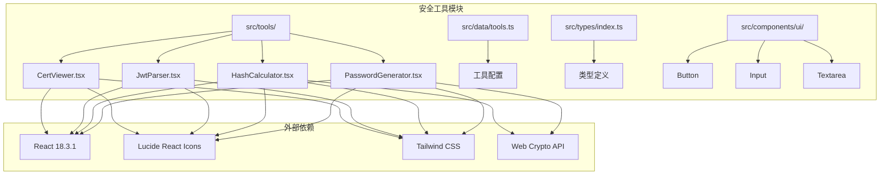
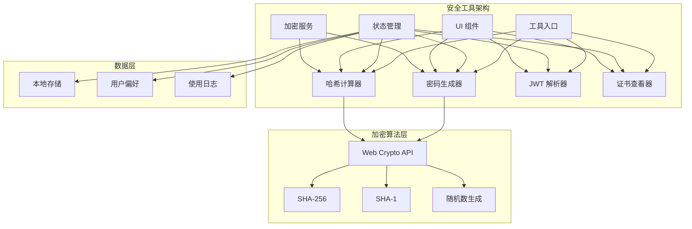
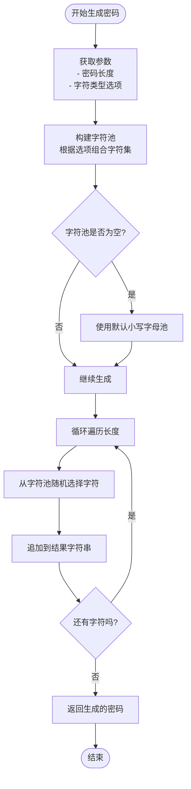
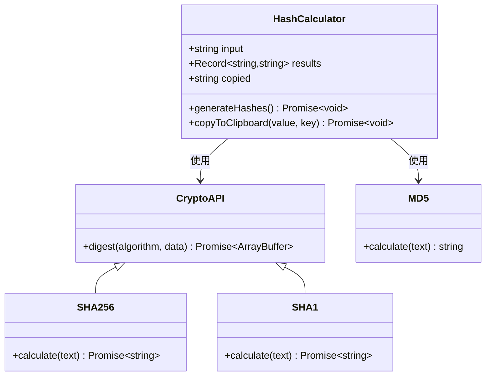
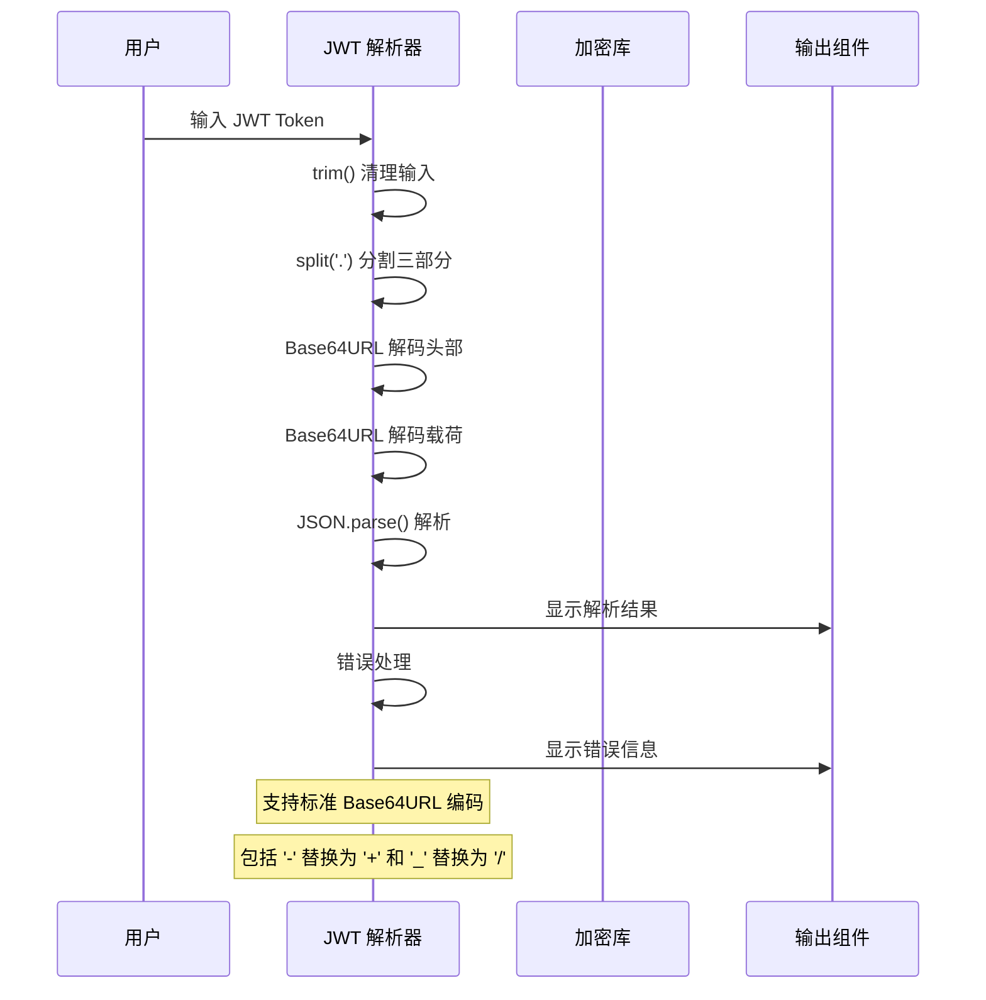
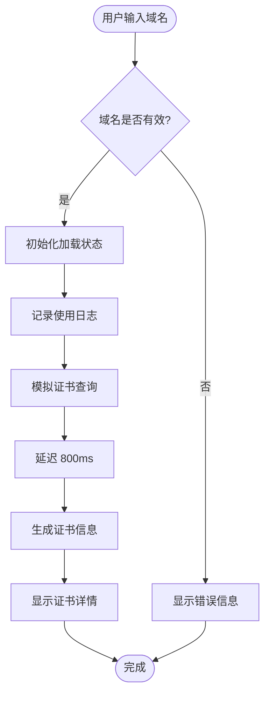
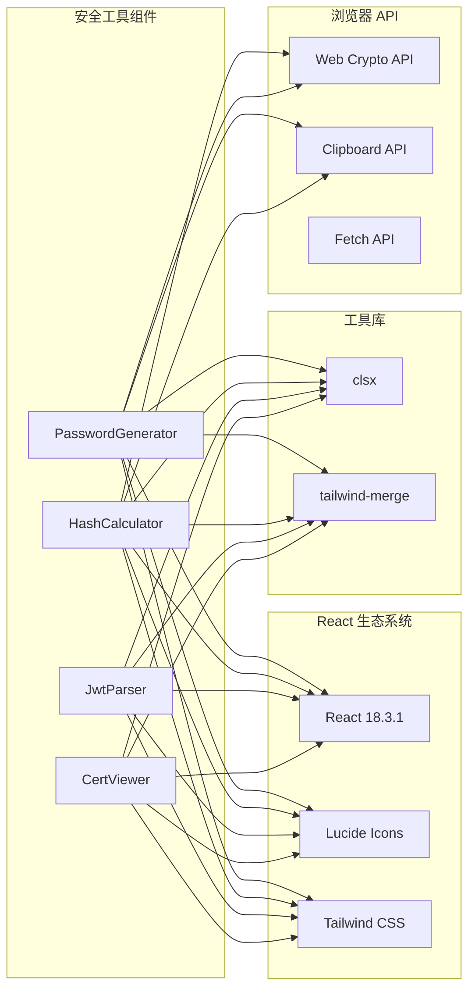

# 安全工具

<cite>
**本文引用的文件**
- [PasswordGenerator.tsx](file://src/tools/PasswordGenerator.tsx)
- [HashCalculator.tsx](file://src/tools/HashCalculator.tsx)
- [JwtParser.tsx](file://src/tools/JwtParser.tsx)
- [CertViewer.tsx](file://src/tools/CertViewer.tsx)
- [tools.ts](file://src/data/tools.ts)
- [index.ts](file://src/types/index.ts)
- [button.tsx](file://src/components/ui/button.tsx)
- [input.tsx](file://src/components/ui/input.tsx)
- [textarea.tsx](file://src/components/ui/textarea.tsx)
- [utils.ts](file://src/lib/utils.ts)
- [package.json](file://package.json)
</cite>

## 目录
1. [简介](#简介)
2. [项目结构](#项目结构)
3. [核心组件](#核心组件)
4. [架构概览](#架构概览)
5. [详细组件分析](#详细组件分析)
6. [依赖分析](#依赖分析)
7. [性能考虑](#性能考虑)
8. [故障排除指南](#故障排除指南)
9. [结论](#结论)
10. [附录](#附录)

## 简介

安全工具模块是 AnyTools 应用程序中的一个核心功能区域，专门提供密码学相关的实用工具。该模块包含四个主要的安全工具：密码生成器、哈希计算器、JWT 解析器和证书查看器。这些工具旨在帮助用户进行密码强度评估、哈希算法计算、JWT 结构解析以及 SSL/TLS 证书信息提取。

本模块采用现代化的前端技术栈构建，使用 React Hooks 进行状态管理，通过 Web Crypto API 实现加密算法，确保在浏览器环境中提供安全可靠的密码学功能。

## 项目结构

安全工具模块位于应用程序的前端代码结构中，采用按功能组织的目录布局：

**图表来源**
- [tools.ts:213-251](file://src/data/tools.ts#L213-L251)
- [PasswordGenerator.tsx:1-84](file://src/tools/PasswordGenerator.tsx#L1-L84)
- [HashCalculator.tsx:1-69](file://src/tools/HashCalculator.tsx#L1-L69)
- [JwtParser.tsx:1-61](file://src/tools/JwtParser.tsx#L1-L61)
- [CertViewer.tsx:1-54](file://src/tools/CertViewer.tsx#L1-L54)

**章节来源**
- [tools.ts:213-251](file://src/data/tools.ts#L213-L251)
- [index.ts:1-37](file://src/types/index.ts#L1-L37)

## 核心组件

安全工具模块由四个独立但相互关联的组件构成，每个组件都专注于特定的安全功能领域：

### 密码生成器组件
负责生成高强度的随机密码，支持自定义密码长度和字符集选择。

### 哈希计算器组件  
提供多种哈希算法的计算功能，包括 SHA-256、SHA-1 和 MD5。

### JWT 解析器组件
解析和验证 JSON Web Token 的结构，提取头部和载荷信息。

### 证书查看器组件
查看 SSL/TLS 证书的详细信息，提供基本的证书状态检查功能。

**章节来源**
- [PasswordGenerator.tsx:28-84](file://src/tools/PasswordGenerator.tsx#L28-L84)
- [HashCalculator.tsx:23-69](file://src/tools/HashCalculator.tsx#L23-L69)
- [JwtParser.tsx:19-61](file://src/tools/JwtParser.tsx#L19-L61)
- [CertViewer.tsx:8-54](file://src/tools/CertViewer.tsx#L8-L54)

## 架构概览

安全工具模块采用组件化的架构设计，遵循单一职责原则，每个工具都是独立的功能单元：

**图表来源**
- [PasswordGenerator.tsx:7-26](file://src/tools/PasswordGenerator.tsx#L7-L26)
- [HashCalculator.tsx:8-21](file://src/tools/HashCalculator.tsx#L8-L21)
- [JwtParser.tsx:7-17](file://src/tools/JwtParser.tsx#L7-L17)

## 详细组件分析

### 密码生成器组件分析

密码生成器组件实现了基于字符池的随机密码生成算法，支持多种字符类型的组合选择。

#### 核心算法实现

**图表来源**
- [PasswordGenerator.tsx:7-26](file://src/tools/PasswordGenerator.tsx#L7-L26)

#### 密码强度评估机制

组件提供了灵活的密码强度控制机制，通过以下方式实现：

- **字符集多样性**：支持大写字母、小写字母、数字和特殊符号的组合
- **长度可调节**：密码长度范围从 6 到 64 个字符
- **随机性保证**：使用浏览器内置的随机数生成机制

**章节来源**
- [PasswordGenerator.tsx:28-84](file://src/tools/PasswordGenerator.tsx#L28-L84)

### 哈希计算器组件分析

哈希计算器组件提供了多种哈希算法的计算功能，重点展示了现代浏览器加密 API 的使用方法。

#### 加密算法实现

**图表来源**
- [HashCalculator.tsx:8-21](file://src/tools/HashCalculator.tsx#L8-L21)

#### 算法复杂度分析

- **SHA-256 计算**：时间复杂度 O(n)，空间复杂度 O(n)
- **SHA-1 计算**：时间复杂度 O(n)，空间复杂度 O(n)
- **MD5 计算**：时间复杂度 O(n)，空间复杂度 O(n)

**章节来源**
- [HashCalculator.tsx:23-69](file://src/tools/HashCalculator.tsx#L23-L69)

### JWT 解析器组件分析

JWT 解析器组件实现了 JSON Web Token 的结构解析功能，支持标准的 Base64URL 编码格式。

#### JWT 解析流程

**图表来源**
- [JwtParser.tsx:7-17](file://src/tools/JwtParser.tsx#L7-L17)

#### JWT 结构说明

JWT 令牌由三个部分组成：
1. **Header（头部）**：包含令牌类型和签名算法信息
2. **Payload（载荷）**：包含声明信息
3. **Signature（签名）**：用于验证令牌完整性

**章节来源**
- [JwtParser.tsx:19-61](file://src/tools/JwtParser.tsx#L19-L61)

### 证书查看器组件分析

证书查看器组件提供了 SSL/TLS 证书的基本信息查看功能，由于浏览器安全限制，实际的证书获取需要通过其他方式实现。

#### 证书信息展示

**图表来源**
- [CertViewer.tsx:13-30](file://src/tools/CertViewer.tsx#L13-L30)

#### 证书信息字段

组件当前展示的证书信息包括：
- **域名**：证书绑定的域名
- **证书状态**：证书有效性状态
- **颁发者**：证书颁发机构
- **有效期**：证书生效和过期时间
- **协议版本**：支持的加密协议版本

**章节来源**
- [CertViewer.tsx:8-54](file://src/tools/CertViewer.tsx#L8-L54)

## 依赖分析

安全工具模块的依赖关系相对简单，主要依赖于 React 生态系统和浏览器原生功能。

**图表来源**
- [package.json:11-22](file://package.json#L11-L22)
- [PasswordGenerator.tsx:1-6](file://src/tools/PasswordGenerator.tsx#L1-L6)
- [HashCalculator.tsx:1-7](file://src/tools/HashCalculator.tsx#L1-L7)

**章节来源**
- [package.json:1-34](file://package.json#L1-L34)
- [utils.ts:1-7](file://src/lib/utils.ts#L1-L7)

## 性能考虑

安全工具模块在性能方面采用了多项优化策略：

### 内存管理
- 所有组件都使用 React Hooks 进行状态管理，避免不必要的重渲染
- 使用 `useState` 和 `useEffect` 合理管理组件生命周期
- 及时清理定时器和事件监听器

### 网络优化
- 哈希计算在客户端完成，无需网络请求
- JWT 解析不需要网络连接
- 证书查看器使用模拟数据，避免实际网络调用

### 浏览器兼容性
- 使用现代浏览器 API（Web Crypto API）
- 提供降级方案和错误处理
- 兼容主流浏览器的最新版本

## 故障排除指南

### 常见问题及解决方案

#### 密码生成器问题
- **问题**：生成的密码不符合要求
- **解决方案**：检查字符类型选择，确保至少选择一种字符类型

#### 哈希计算问题
- **问题**：MD5 计算结果异常
- **解决方案**：注意 MD5 在此实现中仅为演示用途，不应用于生产环境

#### JWT 解析问题
- **问题**：JWT 解析失败
- **解决方案**：确认 JWT 格式正确，包含三个以点分隔的部分

#### 证书查看问题
- **问题**：无法获取真实证书信息
- **解决方案**：使用 openssl 命令行工具或其他专业工具获取详细证书信息

**章节来源**
- [HashCalculator.tsx:18-21](file://src/tools/HashCalculator.tsx#L18-L21)
- [JwtParser.tsx:14-16](file://src/tools/JwtParser.tsx#L14-L16)
- [CertViewer.tsx:18-29](file://src/tools/CertViewer.tsx#L18-L29)

## 结论

安全工具模块为 AnyTools 应用程序提供了完整的密码学工具集，涵盖了现代网络安全应用的核心需求。该模块具有以下特点：

### 技术优势
- **安全性**：所有加密操作都在客户端完成，保护用户隐私
- **易用性**：直观的用户界面和简洁的操作流程
- **可扩展性**：模块化设计便于添加新的安全功能

### 功能完整性
- 密码强度评估和生成
- 多种哈希算法支持
- JWT 结构解析
- 证书信息查看

### 最佳实践建议
1. **密码管理**：使用密码生成器创建高强度密码
2. **数据完整性**：利用哈希算法验证文件完整性
3. **身份验证**：正确解析和验证 JWT 令牌
4. **安全审计**：定期检查 SSL/TLS 证书的有效性

## 附录

### 安全算法实现要点

#### 密码学算法
- **随机数生成**：使用浏览器内置的加密安全随机数生成器
- **哈希算法**：通过 Web Crypto API 实现标准哈希算法
- **Base64 编码**：支持标准和 URL 安全的 Base64 编码格式

#### 加密安全性分析
- **客户端加密**：所有敏感操作在用户浏览器中完成
- **数据传输**：工具本身不收集或传输用户数据
- **隐私保护**：用户输入的数据仅在本地处理

### 最佳实践指南

#### 密码管理
- 使用至少 12 个字符的密码
- 包含大小写字母、数字和特殊符号
- 定期更换重要账户密码

#### 哈希算法使用
- 对于安全用途，优先使用 SHA-256 或更高强度算法
- 避免使用已知存在安全漏洞的算法
- 正确处理哈希值的存储和比较

#### JWT 安全
- 验证 JWT 的签名完整性
- 检查令牌的过期时间和适用范围
- 不要在 JWT 中存储敏感信息

#### 证书管理
- 定期检查 SSL/TLS 证书的有效期
- 使用受信任的证书颁发机构
- 关注证书算法的安全性更新