# 工具功能详解

<cite>
**本文引用的文件**
- [src/data/tools.ts](file://src/data/tools.ts)
- [src/lib/api.ts](file://src/lib/api.ts)
- [src/lib/utils.ts](file://src/lib/utils.ts)
- [server/src/index.ts](file://server/src/index.ts)
- [package.json](file://package.json)
- [src/tools/JsonFormatter.tsx](file://src/tools/JsonFormatter.tsx)
- [src/tools/Base64Tool.tsx](file://src/tools/Base64Tool.tsx)
- [src/tools/RegexTester.tsx](file://src/tools/RegexTester.tsx)
- [src/tools/UrlCodec.tsx](file://src/tools/UrlCodec.tsx)
- [src/tools/TimestampConverter.tsx](file://src/tools/TimestampConverter.tsx)
- [src/tools/NumberBaseConverter.tsx](file://src/tools/NumberBaseConverter.tsx)
- [src/tools/ColorConverter.tsx](file://src/tools/ColorConverter.tsx)
- [src/tools/UnitConverter.tsx](file://src/tools/UnitConverter.tsx)
- [src/tools/TextDiff.tsx](file://src/tools/TextDiff.tsx)
- [src/tools/MarkdownPreview.tsx](file://src/tools/MarkdownPreview.tsx)
</cite>

## 目录
1. [简介](#简介)
2. [项目结构](#项目结构)
3. [核心组件](#核心组件)
4. [架构总览](#架构总览)
5. [详细组件分析](#详细组件分析)
6. [依赖关系分析](#依赖关系分析)
7. [性能考虑](#性能考虑)
8. [故障排除指南](#故障排除指南)
9. [结论](#结论)
10. [附录](#附录)

## 简介
本文件面向开发者与使用者，系统梳理并深入解析工具门户中的各类工具功能，覆盖开发工具（JSON 格式化、Base64 编解码、正则测试、URL 编解码）、转换工具（时间戳转换、进制转换、颜色转换、单位转换）、文本工具（文本对比、Markdown 预览、文本加密、字数统计）、图像工具（库位码生成、条码生成、二维码生成、图片压缩、图片转 Base64）、安全工具（密码生成、Hash 计算、JWT 解析、证书查看）、网络工具（网速测试、IP 查询、HTTP 客户端、DNS 查询、Ping 检测）。每个工具均包含功能说明、算法实现要点、使用示例与注意事项，帮助快速上手与排查问题。

## 项目结构
前端采用 React + Vite 构建，工具清单与分类在数据层集中管理；后端基于 Express 提供日志与鉴权等 API；TailwindCSS 与 Tailwind Merge 统一样式；部分工具依赖 jspdf、xlsx 等第三方库。

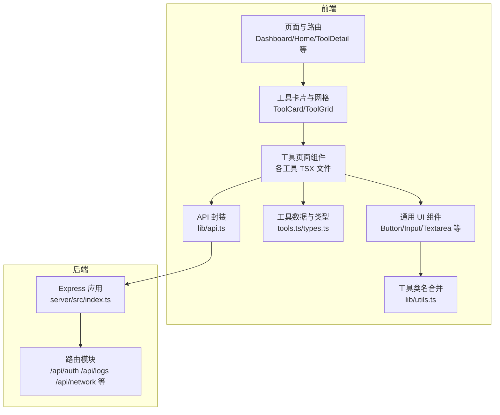

图表来源
- [src/data/tools.ts:1-316](file://src/data/tools.ts#L1-L316)
- [src/lib/api.ts:1-36](file://src/lib/api.ts#L1-L36)
- [server/src/index.ts:1-31](file://server/src/index.ts#L1-L31)

章节来源
- [src/data/tools.ts:1-316](file://src/data/tools.ts#L1-L316)
- [server/src/index.ts:1-31](file://server/src/index.ts#L1-L31)
- [package.json:1-34](file://package.json#L1-L34)

## 核心组件
- 工具清单与分类：集中定义工具元数据（名称、描述、图标、标签、路径、分类），并提供按分类筛选与搜索函数。
- API 日志上报：封装统一的日志上报接口，记录用户使用行为（如执行动作、参数详情）。
- 工具页面组件：每个工具以独立 TSX 组件实现，包含输入、处理逻辑、输出展示与复制能力。
- UI 组件与样式：复用 Button、Input、Textarea 等通用组件，使用 cn 合并工具类名，保证一致风格。

章节来源
- [src/data/tools.ts:34-41](file://src/data/tools.ts#L34-L41)
- [src/data/tools.ts:43-301](file://src/data/tools.ts#L43-L301)
- [src/lib/api.ts:3-19](file://src/lib/api.ts#L3-L19)
- [src/lib/utils.ts:4-7](file://src/lib/utils.ts#L4-L7)

## 架构总览
前端通过 fetch 调用后端 /api 路由，完成登录、日志记录、网络相关工具等功能。工具页面组件负责数据采集与展示，部分工具会调用浏览器原生 API 或第三方库进行处理。

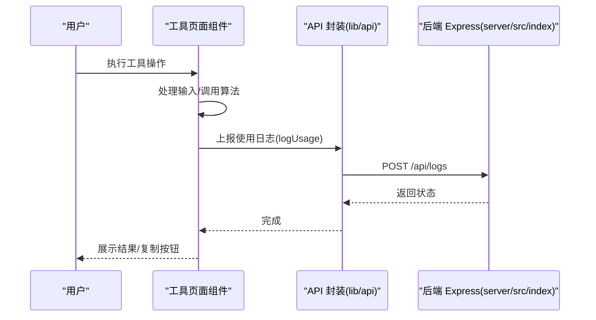

图表来源
- [src/lib/api.ts:3-19](file://src/lib/api.ts#L3-L19)
- [server/src/index.ts:17-22](file://server/src/index.ts#L17-L22)

章节来源
- [src/lib/api.ts:1-36](file://src/lib/api.ts#L1-L36)
- [server/src/index.ts:1-31](file://server/src/index.ts#L1-L31)

## 详细组件分析

### 开发工具

#### JSON 格式化
- 功能说明：支持将输入的 JSON 字符串格式化为可读形式，或压缩为单行；同时具备错误提示与一键复制输出。
- 算法实现：使用浏览器内置 JSON 解析与序列化；格式化时设置缩进空格；异常捕获并提示错误。
- 使用示例：粘贴 JSON 文本 → 点击“格式化” → 复制美化后的结果。
- 注意事项：输入必须是合法 JSON，否则会显示错误；大体积 JSON 可能影响渲染性能。

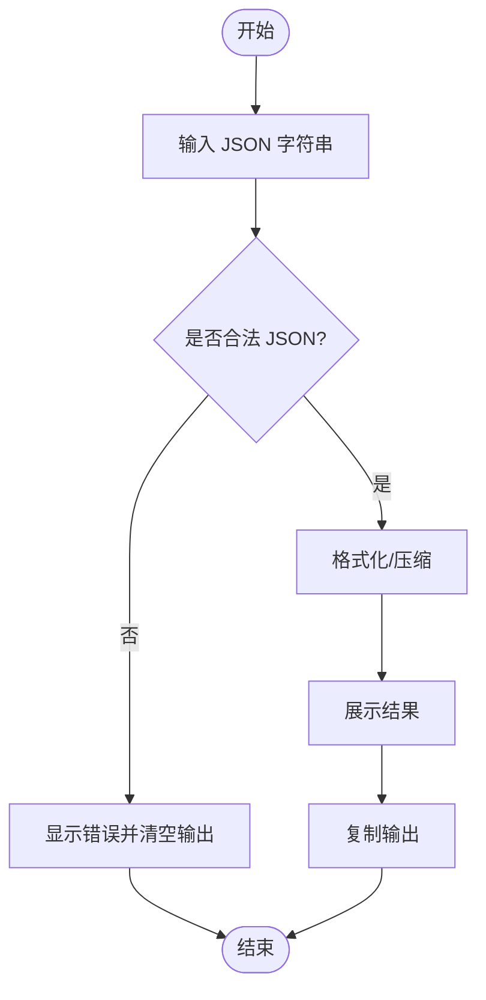

图表来源
- [src/tools/JsonFormatter.tsx:14-36](file://src/tools/JsonFormatter.tsx#L14-L36)

章节来源
- [src/tools/JsonFormatter.tsx:1-76](file://src/tools/JsonFormatter.tsx#L1-L76)

#### Base64 编解码
- 功能说明：在文本与 Base64 之间双向转换，支持编码与解码模式切换。
- 算法实现：使用浏览器内置 btoa/atob 进行编码/解码；对输入进行 UTF-8 转义处理，确保多语言字符正确转换。
- 使用示例：选择“编码”或“解码” → 输入文本或 Base64 → 点击转换 → 复制结果。
- 注意事项：解码失败会返回错误提示；注意 Base64 的填充与字符集限制。

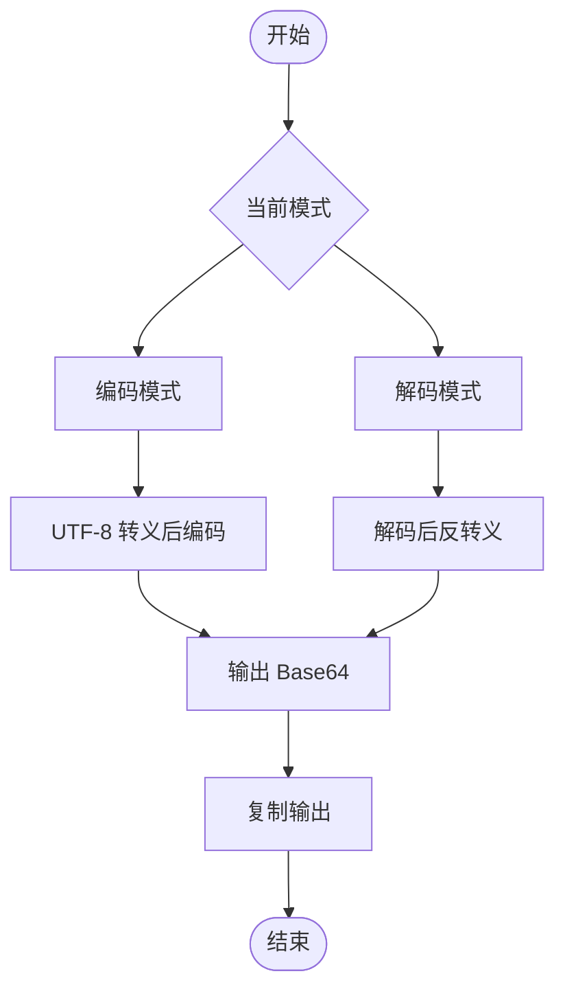

图表来源
- [src/tools/Base64Tool.tsx:14-25](file://src/tools/Base64Tool.tsx#L14-L25)

章节来源
- [src/tools/Base64Tool.tsx:1-64](file://src/tools/Base64Tool.tsx#L1-L64)

#### 正则测试
- 功能说明：在线测试正则表达式匹配，支持 flags 设置与高亮显示匹配片段。
- 算法实现：构建 RegExp 对象进行匹配；使用替换与标记包裹实现高亮；异常捕获并提示正则错误。
- 使用示例：输入正则与 flags → 输入待测文本 → 点击测试 → 查看匹配结果与高亮。
- 注意事项：不支持全局标志时的高亮需去除 g；非法正则会提示错误。

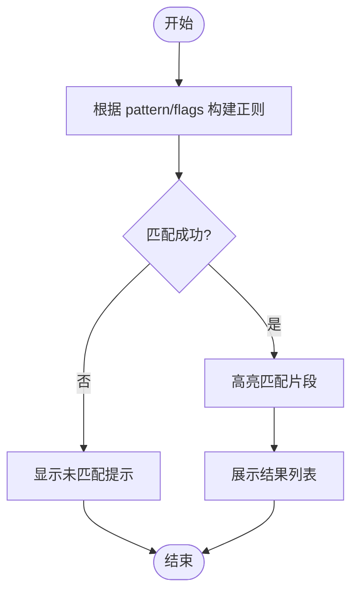

图表来源
- [src/tools/RegexTester.tsx:16-27](file://src/tools/RegexTester.tsx#L16-L27)
- [src/tools/RegexTester.tsx:29-37](file://src/tools/RegexTester.tsx#L29-L37)

章节来源
- [src/tools/RegexTester.tsx:1-80](file://src/tools/RegexTester.tsx#L1-L80)

#### URL 编解码
- 功能说明：对 URL 中的特殊字符进行编码与解码。
- 算法实现：使用 encodeURIComponent/decodeURIComponent 进行转换。
- 使用示例：选择“编码/解码” → 输入 → 点击转换 → 复制结果。
- 注意事项：解码失败会提示错误；注意区分查询参数与完整 URL 的处理场景。

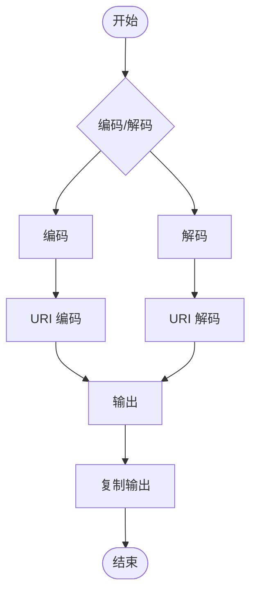

图表来源
- [src/tools/UrlCodec.tsx:14-25](file://src/tools/UrlCodec.tsx#L14-L25)

章节来源
- [src/tools/UrlCodec.tsx:1-64](file://src/tools/UrlCodec.tsx#L1-L64)

### 转换工具

#### 时间戳转换
- 功能说明：支持将时间戳与日期字符串互转，自动识别秒/毫秒时间戳与本地/ISO 时间格式。
- 算法实现：根据输入格式判断类型；对时间戳进行单位换算；日期解析后输出多种格式。
- 使用示例：输入时间戳或日期 → 点击转换 → 复制任意格式结果。
- 注意事项：输入为空直接返回；非法日期会提示错误；当前时间按钮便于快速测试。

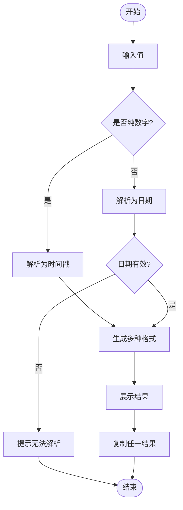

图表来源
- [src/tools/TimestampConverter.tsx:15-41](file://src/tools/TimestampConverter.tsx#L15-L41)

章节来源
- [src/tools/TimestampConverter.tsx:1-84](file://src/tools/TimestampConverter.tsx#L1-L84)

#### 进制转换
- 功能说明：在二进制、八进制、十进制、十六进制之间相互转换。
- 算法实现：先将输入解析为十进制整数，再转换为目标进制；统一转为大写输出。
- 使用示例：输入数字与来源进制 → 点击转换 → 复制任一进制结果。
- 注意事项：来源进制与输入合法性决定转换结果；非法输入会提示错误。

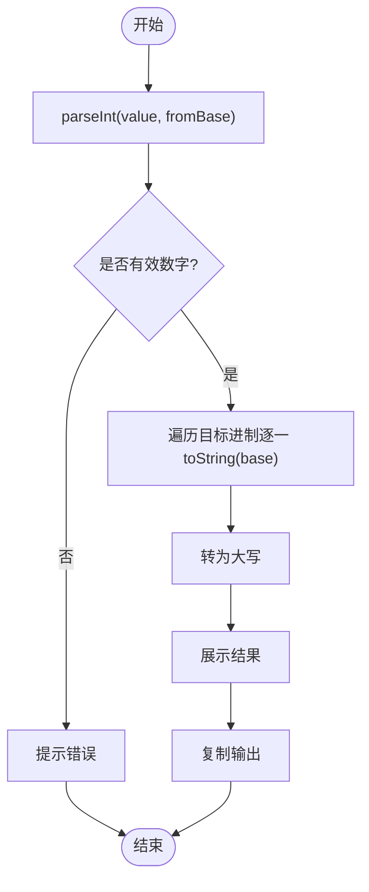

图表来源
- [src/tools/NumberBaseConverter.tsx:21-34](file://src/tools/NumberBaseConverter.tsx#L21-L34)

章节来源
- [src/tools/NumberBaseConverter.tsx:1-82](file://src/tools/NumberBaseConverter.tsx#L1-L82)

#### 颜色转换
- 功能说明：在 HEX、RGB、HSL 之间相互转换，并可视化展示颜色块。
- 算法实现：HEX → RGB 解析；RGB → HEX 与 HSL 计算；结果统一展示与复制。
- 使用示例：输入 HEX → 点击转换 → 查看 RGB/HSL 与颜色块 → 复制任一格式。
- 注意事项：非法 HEX 会清空结果；颜色块实时反映当前 HEX 值。

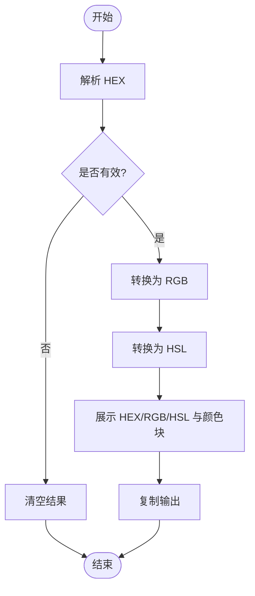

图表来源
- [src/tools/ColorConverter.tsx:40-53](file://src/tools/ColorConverter.tsx#L40-L53)

章节来源
- [src/tools/ColorConverter.tsx:1-91](file://src/tools/ColorConverter.tsx#L1-L91)

#### 单位转换
- 功能说明：支持长度、重量、温度三类单位之间的换算。
- 算法实现：长度/重量使用基准单位换算；温度采用摄氏为基准的公式转换。
- 使用示例：选择类别 → 输入数值与单位 → 点击转换 → 查看结果。
- 注意事项：温度转换遵循标准公式；非法输入不会产生结果。

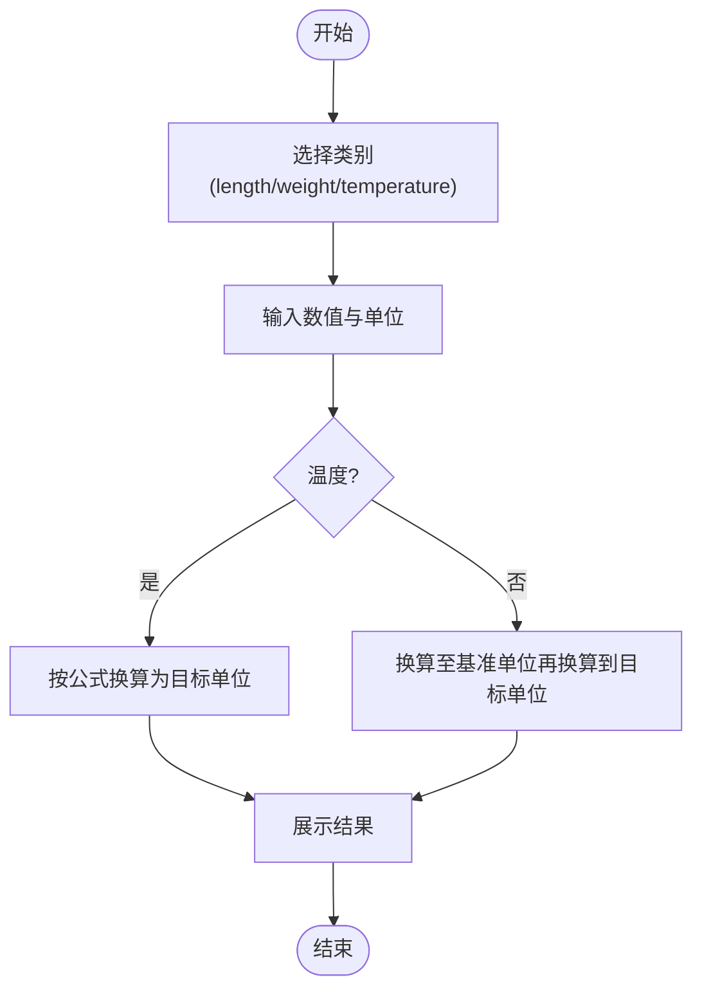

图表来源
- [src/tools/UnitConverter.tsx:39-52](file://src/tools/UnitConverter.tsx#L39-L52)
- [src/tools/UnitConverter.tsx:22-30](file://src/tools/UnitConverter.tsx#L22-L30)

章节来源
- [src/tools/UnitConverter.tsx:1-114](file://src/tools/UnitConverter.tsx#L1-L114)

### 文本工具

#### 文本对比
- 功能说明：对比两段文本的差异，按行输出新增、删除与相同行，并高亮显示。
- 算法实现：逐行比较，维护差异序列；根据类型渲染不同背景色。
- 使用示例：在左右文本框分别输入 → 点击对比 → 查看差异行。
- 注意事项：算法基于行级差异；长文本可能影响渲染性能。

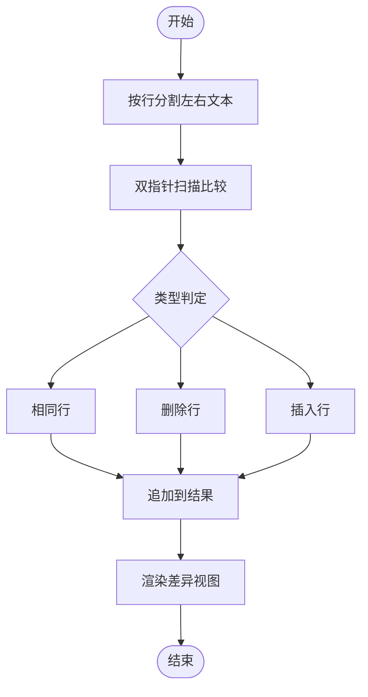

图表来源
- [src/tools/TextDiff.tsx:8-28](file://src/tools/TextDiff.tsx#L8-L28)

章节来源
- [src/tools/TextDiff.tsx:1-70](file://src/tools/TextDiff.tsx#L1-L70)

#### Markdown 预览
- 功能说明：实时将 Markdown 文本渲染为 HTML 并预览，支持标题、加粗、斜体、代码、列表、链接等基础语法。
- 算法实现：使用正则替换将 Markdown 语法映射为 HTML 片段；通过 dangerouslySetInnerHTML 渲染。
- 使用示例：在左侧输入 Markdown → 右侧实时预览 → 调整内容。
- 注意事项：仅基础语法支持；HTML 注入需谨慎；建议仅在受信任内容上使用。

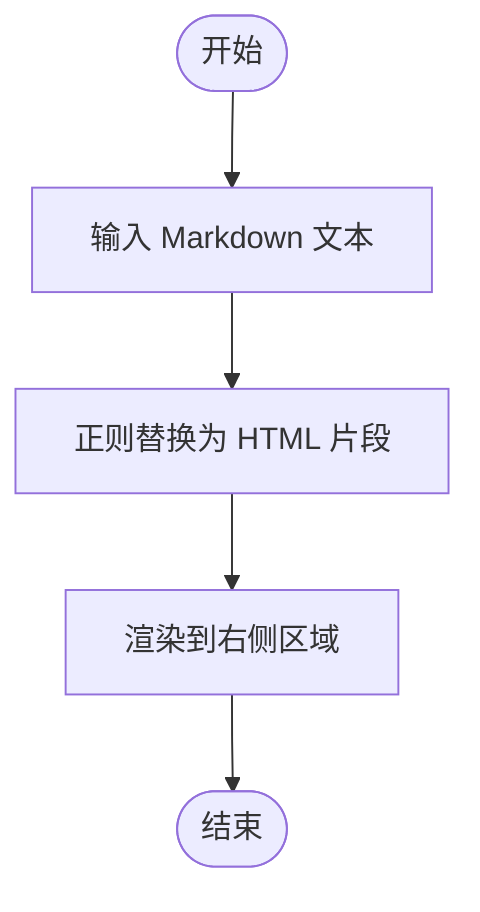

图表来源
- [src/tools/MarkdownPreview.tsx:6-18](file://src/tools/MarkdownPreview.tsx#L6-L18)
- [src/tools/MarkdownPreview.tsx:20-38](file://src/tools/MarkdownPreview.tsx#L20-L38)

章节来源
- [src/tools/MarkdownPreview.tsx:1-55](file://src/tools/MarkdownPreview.tsx#L1-L55)

#### 文本加密（说明）
- 功能说明：提供 AES/DES 文本加密/解密能力（注：当前仓库未包含具体实现文件）。
- 使用示例：输入明文/密文与密钥 → 选择加密/解密 → 获取结果。
- 注意事项：密钥长度与格式需满足算法要求；生产环境请使用安全的密钥管理与随机 IV。

章节来源
- [src/data/tools.ts:144-151](file://src/data/tools.ts#L144-L151)

#### 字数统计（说明）
- 功能说明：统计字数、字符数、段落数等（注：当前仓库未包含具体实现文件）。
- 使用示例：粘贴文本 → 自动统计 → 查看结果。
- 注意事项：不同语言与标点规则可能影响统计结果。

章节来源
- [src/data/tools.ts:154-160](file://src/data/tools.ts#L154-L160)

### 图像工具

#### 库位码生成（说明）
- 功能说明：批量导入库位码，生成含条码与方向箭头的 PDF 标签（注：当前仓库未包含具体实现文件）。
- 使用示例：准备库位码数据 → 导入 → 生成 PDF → 打印。
- 注意事项：需要 jspdf/xlsx 等依赖；确保条码字体与方向箭头配置正确。

章节来源
- [src/data/tools.ts:164-172](file://src/data/tools.ts#L164-L172)

#### 条码生成器
- 功能说明：输入文本生成 Code128 条码（注：当前仓库未包含具体实现文件）。
- 使用示例：输入文本 → 生成条码 → 下载或复制。
- 注意事项：Code128 支持字符集有限；确保内容符合条码规范。

章节来源
- [src/data/tools.ts:175-182](file://src/data/tools.ts#L175-L182)

#### 二维码生成
- 功能说明：输入文本或链接生成二维码（注：当前仓库未包含具体实现文件）。
- 使用示例：输入文本/链接 → 生成二维码 → 下载或复制。
- 注意事项：二维码尺寸与容错等级可配置；内容过长会影响识别。

章节来源
- [src/data/tools.ts:185-192](file://src/data/tools.ts#L185-L192)

#### 图片压缩
- 功能说明：在线压缩 PNG/JPG 图片体积（注：当前仓库未包含具体实现文件）。
- 使用示例：选择图片 → 调整压缩参数 → 压缩 → 下载。
- 注意事项：压缩质量与体积需平衡；多次压缩会累积损失。

章节来源
- [src/data/tools.ts:195-201](file://src/data/tools.ts#L195-L201)

#### 图片转 Base64
- 功能说明：将图片文件转换为 Base64 编码（注：当前仓库未包含具体实现文件）。
- 使用示例：选择图片 → 转换 → 复制编码。
- 注意事项：大图转换体积膨胀明显；适合小图或内联使用。

章节来源
- [src/data/tools.ts:204-210](file://src/data/tools.ts#L204-L210)

### 安全工具

#### 密码生成器
- 功能说明：生成高强度随机密码（注：当前仓库未包含具体实现文件）。
- 使用示例：选择长度与字符集 → 生成 → 复制。
- 注意事项：字符集包含大小写字母、数字与符号；避免弱密码。

章节来源
- [src/data/tools.ts:215-222](file://src/data/tools.ts#L215-L222)

#### Hash 计算
- 功能说明：支持 MD5、SHA1、SHA256 哈希计算（注：当前仓库未包含具体实现文件）。
- 使用示例：输入文本 → 选择算法 → 计算 → 复制结果。
- 注意事项：MD5/SHA1 已不推荐用于安全场景；仅用于兼容或非安全用途。

章节来源
- [src/data/tools.ts:225-231](file://src/data/tools.ts#L225-L231)

#### JWT 解析
- 功能说明：解析与验证 JWT Token 信息（注：当前仓库未包含具体实现文件）。
- 使用示例：粘贴 JWT → 解析 → 查看头部/载荷/签名。
- 注意事项：仅解析不验证签名；生产环境需服务端验证。

章节来源
- [src/data/tools.ts:234-241](file://src/data/tools.ts#L234-L241)

#### 证书查看
- 功能说明：查看 SSL 证书详细信息（注：当前仓库未包含具体实现文件）。
- 使用示例：输入域名 → 获取证书 → 查看有效期、颁发者等。
- 注意事项：需 HTTPS 站点；注意证书链完整性。

章节来源
- [src/data/tools.ts:244-250](file://src/data/tools.ts#L244-L250)

### 网络工具

#### 网速测试
- 功能说明：测试网络延迟、下载与上传速度（注：当前仓库未包含具体实现文件）。
- 使用示例：点击开始 → 观察测试过程 → 查看结果。
- 注意事项：测试准确性受网络波动影响；建议多次测试取平均。

章节来源
- [src/data/tools.ts:255-262](file://src/data/tools.ts#L255-L262)

#### IP 查询
- 功能说明：查询 IP 地址归属地与运营商（注：当前仓库未包含具体实现文件）。
- 使用示例：输入 IP → 查询 → 查看地理与运营商信息。
- 注意事项：免费接口有速率限制；结果仅供参考。

章节来源
- [src/data/tools.ts:265-271](file://src/data/tools.ts#L265-L271)

#### HTTP 客户端
- 功能说明：发送 HTTP 请求并查看响应（注：当前仓库未包含具体实现文件）。
- 使用示例：选择方法/输入 URL → 设置请求头/体 → 发送 → 查看响应。
- 注意事项：跨域需后端支持；注意敏感信息保护。

章节来源
- [src/data/tools.ts:274-281](file://src/data/tools.ts#L274-L281)

#### DNS 查询
- 功能说明：查询域名 DNS 解析记录（注：当前仓库未包含具体实现文件）。
- 使用示例：输入域名 → 查询 → 查看解析记录。
- 注意事项：不同记录类型返回不同结果；注意缓存影响。

章节来源
- [src/data/tools.ts:284-290](file://src/data/tools.ts#L284-L290)

#### Ping 检测
- 功能说明：检测目标主机连通性与延迟（注：当前仓库未包含具体实现文件）。
- 使用示例：输入主机 → 执行检测 → 查看连通性与延迟。
- 注意事项：浏览器环境限制较多；建议在服务端实现更准确。

章节来源
- [src/data/tools.ts:293-299](file://src/data/tools.ts#L293-L299)

## 依赖关系分析
- 前端依赖：React、TailwindCSS、Lucide React 图标、jspdf、xlsx 等；构建工具为 Vite。
- 后端依赖：Express、CORS、路由模块；提供 /api/auth、/api/logs、/api/network 等接口。
- 工具间耦合：各工具组件相对独立，通过统一的 API 封装与日志上报进行松耦合集成。

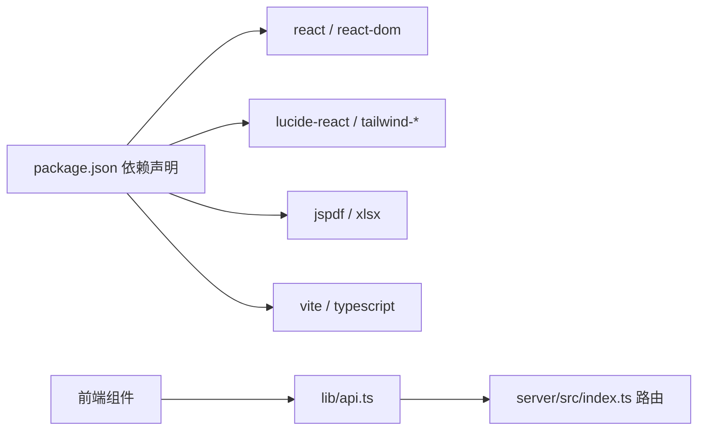

图表来源
- [package.json:11-21](file://package.json#L11-L21)
- [server/src/index.ts:14-22](file://server/src/index.ts#L14-L22)

章节来源
- [package.json:1-34](file://package.json#L1-L34)
- [server/src/index.ts:1-31](file://server/src/index.ts#L1-L31)

## 性能考虑
- 大体积 JSON/文本处理：建议分页或节流展示，避免长时间阻塞 UI。
- 正则高亮：对超长文本进行分段高亮或禁用高亮，减少 DOM 渲染压力。
- 图像处理：压缩与转 Base64 建议在服务端进行，前端仅做轻量预览。
- 网络工具：测速与 DNS 查询应限制并发与频率，避免影响用户体验。
- 样式合并：使用 cn 工具合并类名，减少重复与冲突。

## 故障排除指南
- 日志上报失败：检查后端 /api/logs 接口可用性与 CORS 配置；确认用户 ID 与工具 ID 传参正确。
- 正则错误：检查正则表达式与 flags 是否合法；避免在高亮中使用全局标志导致匹配异常。
- Base64/URL 编解码失败：确认输入字符集与编码格式；注意多语言字符的 UTF-8 转义。
- 时间戳转换异常：输入为空或非法日期会提示错误；注意秒/毫秒时间戳的识别逻辑。
- 进制转换错误：来源进制与输入合法性决定结果；非法输入会提示错误。
- 颜色转换无效：HEX 必须为合法格式；RGB/HSL 计算依赖有效数值。
- 单位转换无结果：输入必须为有效数字；温度转换遵循标准公式。

章节来源
- [src/lib/api.ts:10-18](file://src/lib/api.ts#L10-L18)
- [src/tools/RegexTester.tsx:23-26](file://src/tools/RegexTester.tsx#L23-L26)
- [src/tools/Base64Tool.tsx:22-24](file://src/tools/Base64Tool.tsx#L22-L24)
- [src/tools/UrlCodec.tsx:22-24](file://src/tools/UrlCodec.tsx#L22-L24)
- [src/tools/TimestampConverter.tsx:35-37](file://src/tools/TimestampConverter.tsx#L35-L37)
- [src/tools/NumberBaseConverter.tsx:32-33](file://src/tools/NumberBaseConverter.tsx#L32-L33)
- [src/tools/ColorConverter.tsx:42-44](file://src/tools/ColorConverter.tsx#L42-L44)
- [src/tools/UnitConverter.tsx:40-41](file://src/tools/UnitConverter.tsx#L40-L41)

## 结论
本工具门户以清晰的分类与独立的组件设计，覆盖了开发、转换、文本、图像、安全与网络六大领域的常用需求。前端通过统一的 API 封装与日志上报，实现了良好的可维护性与可观测性。后续可在各工具中补充完善缺失的实现文件，并加强错误处理与性能优化，进一步提升用户体验与稳定性。

## 附录
- 工具清单与分类：详见 [src/data/tools.ts:34-301](file://src/data/tools.ts#L34-L301)
- API 封装：详见 [src/lib/api.ts:1-36](file://src/lib/api.ts#L1-L36)
- 工具类名合并：详见 [src/lib/utils.ts:1-7](file://src/lib/utils.ts#L1-L7)
- 后端入口：详见 [server/src/index.ts:1-31](file://server/src/index.ts#L1-L31)
- 依赖声明：详见 [package.json:1-34](file://package.json#L1-L34)