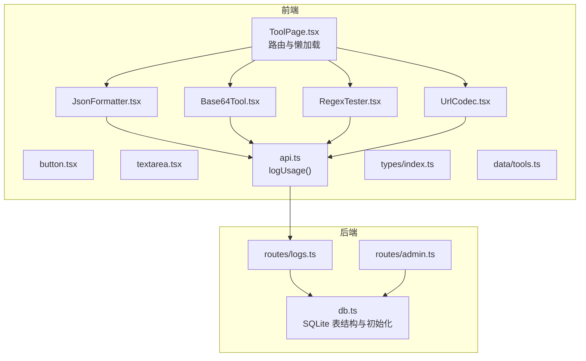
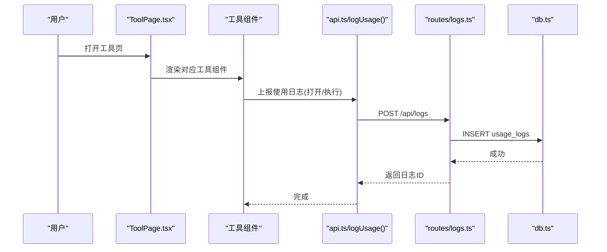
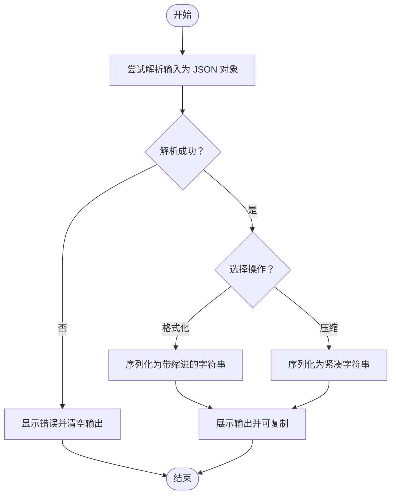
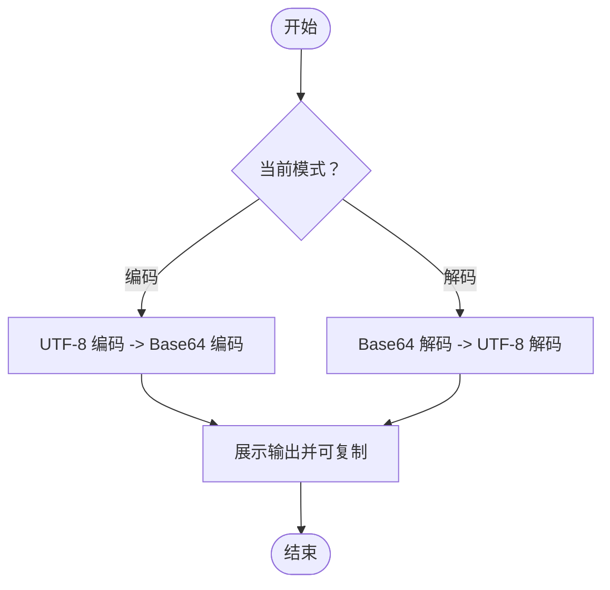
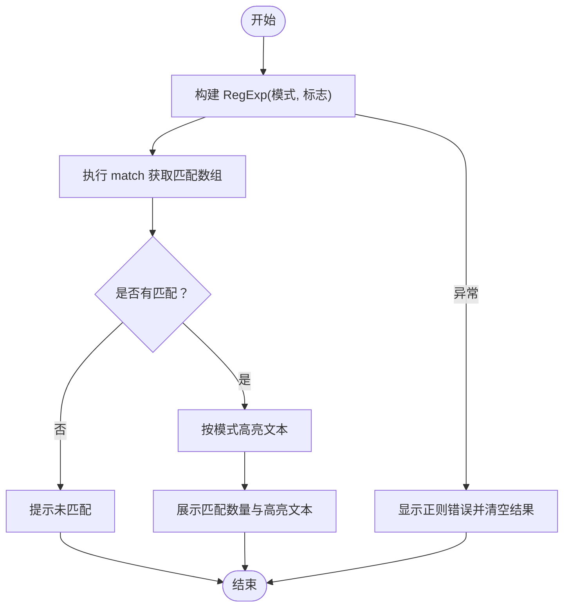
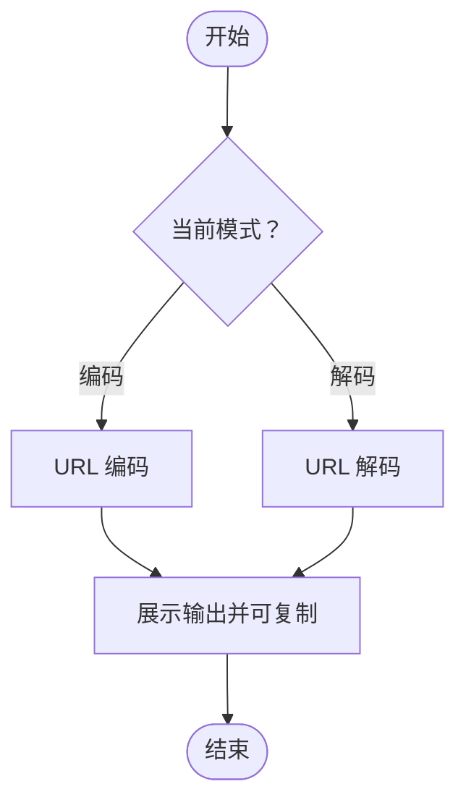
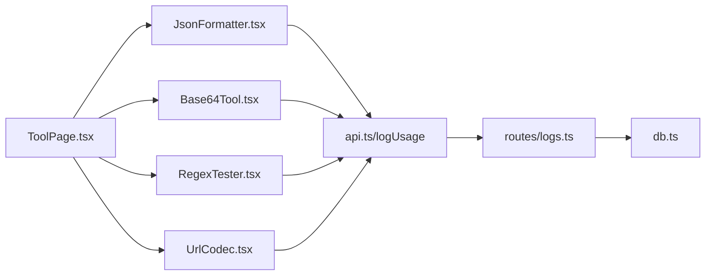

# 开发工具

<cite>
**本文引用的文件列表**
- [JsonFormatter.tsx](file://src/tools/JsonFormatter.tsx)
- [Base64Tool.tsx](file://src/tools/Base64Tool.tsx)
- [RegexTester.tsx](file://src/tools/RegexTester.tsx)
- [UrlCodec.tsx](file://src/tools/UrlCodec.tsx)
- [api.ts](file://src/lib/api.ts)
- [tools.ts](file://src/data/tools.ts)
- [ToolPage.tsx](file://src/pages/ToolPage.tsx)
- [index.ts](file://src/types/index.ts)
- [button.tsx](file://src/components/ui/button.tsx)
- [textarea.tsx](file://src/components/ui/textarea.tsx)
- [logs.ts](file://server/src/routes/logs.ts)
- [admin.ts](file://server/src/routes/admin.ts)
- [db.ts](file://server/src/db.ts)
</cite>

## 目录
1. [简介](#简介)
2. [项目结构](#项目结构)
3. [核心组件](#核心组件)
4. [架构总览](#架构总览)
5. [详细组件分析](#详细组件分析)
6. [依赖关系分析](#依赖关系分析)
7. [性能考量](#性能考量)
8. [故障排查指南](#故障排查指南)
9. [结论](#结论)
10. [附录](#附录)

## 简介
本文件面向开发工具类别中的四个常用工具：JSON 格式化、Base64 编解码、正则测试、URL 编解码。文档从系统架构、组件职责、数据流、处理逻辑、错误处理、性能优化与最佳实践等维度进行深入剖析，并提供可视化图示与可操作的使用指南，帮助开发者快速理解与高效使用这些工具。

## 项目结构
前端采用 React + Vite 架构，工具页面通过路由按需加载具体工具组件；工具组件负责输入输出与交互，调用统一的使用日志接口；后端基于 Express + better-sqlite3，提供日志写入与查询、管理员管理等能力。

图表来源
- [ToolPage.tsx:11-38](file://src/pages/ToolPage.tsx#L11-L38)
- [JsonFormatter.tsx:1-76](file://src/tools/JsonFormatter.tsx#L1-L76)
- [Base64Tool.tsx:1-64](file://src/tools/Base64Tool.tsx#L1-L64)
- [RegexTester.tsx:1-80](file://src/tools/RegexTester.tsx#L1-L80)
- [UrlCodec.tsx:1-64](file://src/tools/UrlCodec.tsx#L1-L64)
- [api.ts:3-19](file://src/lib/api.ts#L3-L19)
- [logs.ts:1-134](file://server/src/routes/logs.ts#L1-L134)
- [db.ts:12-75](file://server/src/db.ts#L12-L75)

章节来源
- [ToolPage.tsx:1-113](file://src/pages/ToolPage.tsx#L1-L113)
- [tools.ts:43-82](file://src/data/tools.ts#L43-L82)

## 核心组件
- JSON 格式化工具：支持格式化与压缩，具备错误提示与复制能力。
- Base64 编解码工具：支持文本与 Base64 的双向转换，具备错误提示与复制能力。
- 正则测试工具：支持设置正则与标志位，展示匹配结果与高亮。
- URL 编解码工具：支持文本与 URL 编码的双向转换，具备错误提示与复制能力。

章节来源
- [JsonFormatter.tsx:8-76](file://src/tools/JsonFormatter.tsx#L8-L76)
- [Base64Tool.tsx:8-64](file://src/tools/Base64Tool.tsx#L8-L64)
- [RegexTester.tsx:9-80](file://src/tools/RegexTester.tsx#L9-L80)
- [UrlCodec.tsx:8-64](file://src/tools/UrlCodec.tsx#L8-L64)

## 架构总览
前端工具组件通过统一的日志接口上报使用行为（打开/执行），后端接收并持久化到 SQLite。管理员可通过后台接口查询与统计。

图表来源
- [ToolPage.tsx:66-70](file://src/pages/ToolPage.tsx#L66-L70)
- [api.ts:3-19](file://src/lib/api.ts#L3-L19)
- [logs.ts:8-18](file://server/src/routes/logs.ts#L8-L18)
- [db.ts:13-39](file://server/src/db.ts#L13-L39)

## 详细组件分析

### JSON 格式化工具
- 功能要点
  - 输入框：接收原始 JSON 字符串。
  - 操作按钮：格式化（美化缩进）与压缩（去除空白）。
  - 输出区域：展示格式化/压缩后的 JSON，支持一键复制。
  - 错误处理：解析异常时显示错误信息并清空输出。
  - 使用日志：在“格式化”和“压缩”时分别上报执行动作。
- 处理流程
  - 格式化：解析输入为对象，再序列化为带缩进的字符串。
  - 压缩：解析输入为对象，再序列化为紧凑字符串。
  - 异常捕获：捕获解析错误，清空输出并显示错误。
- 性能与可用性
  - 使用浏览器原生 JSON API，复杂度 O(n)。
  - 对超大 JSON 文本建议先压缩再粘贴，避免 UI 卡顿。
- 最佳实践
  - 先压缩再格式化，确保输入合法。
  - 使用复制按钮快速导出结果。
  - 在团队协作中，优先使用格式化版本便于审阅。

图表来源
- [JsonFormatter.tsx:14-36](file://src/tools/JsonFormatter.tsx#L14-L36)

章节来源
- [JsonFormatter.tsx:8-76](file://src/tools/JsonFormatter.tsx#L8-L76)

### Base64 编解码工具
- 功能要点
  - 双模式切换：编码与解码。
  - 输入输出：编码时输入文本，输出 Base64；解码时相反。
  - 错误处理：转换异常时提示失败原因。
  - 使用日志：根据当前模式上报执行动作。
- 处理流程
  - 编码：对输入进行 UTF-8 编码，再进行 Base64 编码。
  - 解码：对输入进行 Base64 解码，再还原为 UTF-8 文本。
  - 异常捕获：捕获转换错误，清空输出并提示失败。
- 性能与可用性
  - 使用浏览器内置 btoa/atob/encodeURIComponent/decodeURIComponent，复杂度 O(n)。
  - 对超长文本建议分块处理，避免主线程阻塞。
- 最佳实践
  - 文本编码前确保字符集正确（UTF-8）。
  - 解码时注意填充字符（=）与非法字符。
  - 在嵌入资源时优先使用 Base64，但注意体积与缓存策略。

图表来源
- [Base64Tool.tsx:14-25](file://src/tools/Base64Tool.tsx#L14-L25)

章节来源
- [Base64Tool.tsx:8-64](file://src/tools/Base64Tool.tsx#L8-L64)

### 正则测试工具
- 功能要点
  - 模式输入：正则表达式文本。
  - 标志位输入：如 g、i、m 等。
  - 文本输入：待匹配文本。
  - 结果展示：列出所有匹配项数量与高亮。
  - 错误处理：正则语法错误时提示并清空结果。
  - 使用日志：每次测试上报执行动作。
- 处理流程
  - 构造 RegExp 实例，执行 match 获取匹配数组。
  - 高亮：对文本按模式进行替换标记，支持全局标志的去重处理。
  - 异常捕获：捕获正则错误，清空匹配并提示。
- 性能与可用性
  - match 为 O(n*m)（n 为文本长度，m 为模式复杂度）。
  - 大文本建议关闭全局标志或限制匹配范围。
- 最佳实践
  - 先在小样本上验证正则，再用于大文本。
  - 使用非贪婪量词与前瞻/后顾减少回溯。
  - 利用高亮快速定位匹配位置。

图表来源
- [RegexTester.tsx:16-37](file://src/tools/RegexTester.tsx#L16-L37)

章节来源
- [RegexTester.tsx:9-80](file://src/tools/RegexTester.tsx#L9-L80)

### URL 编解码工具
- 功能要点
  - 双模式切换：编码与解码。
  - 输入输出：编码时输入文本，输出 URL 编码；解码时相反。
  - 错误处理：转换异常时提示失败原因。
  - 使用日志：根据当前模式上报执行动作。
- 处理流程
  - 编码：对输入进行 URL 编码。
  - 解码：对输入进行 URL 解码。
  - 异常捕获：捕获转换错误，清空输出并提示失败。
- 性能与可用性
  - 使用浏览器内置 encodeURIComponent/decodeURIComponent，复杂度 O(n)。
  - 对超长文本建议分块处理，避免主线程阻塞。
- 最佳实践
  - 在拼接 URL 参数时优先使用编码，避免特殊字符导致解析错误。
  - 解码时注意百分号编码与字符集一致性。

图表来源
- [UrlCodec.tsx:14-25](file://src/tools/UrlCodec.tsx#L14-L25)

章节来源
- [UrlCodec.tsx:8-64](file://src/tools/UrlCodec.tsx#L8-L64)

## 依赖关系分析
- 组件依赖
  - 工具组件依赖统一的 UI 组件库（按钮、文本域）与类型定义。
  - 工具组件依赖日志接口，用于记录使用行为。
  - 页面层负责路由与按需加载，映射工具 ID 到具体组件。
- 后端依赖
  - 日志路由接收前端日志请求，写入 SQLite。
  - 管理员路由提供用户与日志查询、分页与统计。
  - 数据库初始化建表并注入示例数据。

图表来源
- [ToolPage.tsx:11-38](file://src/pages/ToolPage.tsx#L11-L38)
- [api.ts:3-19](file://src/lib/api.ts#L3-L19)
- [logs.ts:1-134](file://server/src/routes/logs.ts#L1-L134)
- [db.ts:12-75](file://server/src/db.ts#L12-L75)

章节来源
- [button.tsx:1-50](file://src/components/ui/button.tsx#L1-L50)
- [textarea.tsx:1-23](file://src/components/ui/textarea.tsx#L1-L23)
- [index.ts:3-37](file://src/types/index.ts#L3-L37)
- [tools.ts:43-82](file://src/data/tools.ts#L43-L82)

## 性能考量
- 前端
  - 使用浏览器原生 API 进行编解码与正则匹配，避免额外依赖。
  - 对超大文本建议：
    - 分块处理（如分段编码/解码）。
    - 延迟渲染（仅在需要时高亮）。
    - 使用虚拟滚动或分页展示结果。
  - 避免在渲染阶段进行昂贵计算，使用 useMemo/useCallback 优化。
- 后端
  - SQLite 使用 WAL 模式提升并发读写性能。
  - 为日志表建立索引（用户、工具、时间），优化查询与统计。
  - 分页查询限制每页最大条数，防止过大数据集。

[本节为通用性能建议，不直接分析特定文件，故无章节来源]

## 故障排查指南
- JSON 格式化
  - 症状：点击格式化/压缩后无输出或报错。
  - 排查：确认输入为合法 JSON；检查浏览器控制台是否有解析异常。
  - 处理：先压缩再格式化，确保输入有效。
- Base64 编解码
  - 症状：解码失败或输出乱码。
  - 排查：确认输入为合法 Base64；检查填充字符与字符集。
  - 处理：使用标准字符集编码后再解码。
- 正则测试
  - 症状：正则报错或无匹配。
  - 排查：检查正则语法与标志位；在小样本上先行验证。
  - 处理：简化正则，逐步增加复杂度。
- URL 编解码
  - 症状：编码/解码异常。
  - 排查：确认输入包含特殊字符；检查百分号编码是否完整。
  - 处理：使用标准 URL 编码规则。
- 使用日志
  - 症状：日志未记录。
  - 排查：检查前端日志接口是否被调用；后端路由是否正常；数据库连接是否可用。
  - 处理：查看后端错误日志与数据库状态。

章节来源
- [JsonFormatter.tsx:14-36](file://src/tools/JsonFormatter.tsx#L14-L36)
- [Base64Tool.tsx:14-25](file://src/tools/Base64Tool.tsx#L14-L25)
- [RegexTester.tsx:16-27](file://src/tools/RegexTester.tsx#L16-L27)
- [UrlCodec.tsx:14-25](file://src/tools/UrlCodec.tsx#L14-L25)
- [api.ts:3-19](file://src/lib/api.ts#L3-L19)
- [logs.ts:8-18](file://server/src/routes/logs.ts#L8-L18)
- [db.ts:13-39](file://server/src/db.ts#L13-L39)

## 结论
上述四个开发工具均采用轻量级实现，依赖浏览器原生 API，具备良好的跨平台兼容性与易用性。通过统一的日志上报与后端持久化，能够追踪工具使用情况并为后续优化提供依据。建议在生产环境中结合分块处理、防抖与缓存策略进一步提升性能与用户体验。

[本节为总结性内容，不直接分析特定文件，故无章节来源]

## 附录

### 输入/输出格式说明
- JSON 格式化
  - 输入：JSON 字符串
  - 输出：格式化/压缩后的 JSON 字符串
- Base64 编解码
  - 输入（编码）：任意文本
  - 输出（编码）：Base64 字符串
  - 输入（解码）：Base64 字符串
  - 输出（解码）：原始文本
- 正则测试
  - 输入：正则表达式 + 标志位 + 待匹配文本
  - 输出：匹配数组与高亮文本
- URL 编解码
  - 输入（编码）：任意文本
  - 输出（编码）：URL 编码字符串
  - 输入（解码）：URL 编码字符串
  - 输出（解码）：原始文本

章节来源
- [JsonFormatter.tsx:14-36](file://src/tools/JsonFormatter.tsx#L14-L36)
- [Base64Tool.tsx:14-25](file://src/tools/Base64Tool.tsx#L14-L25)
- [RegexTester.tsx:16-37](file://src/tools/RegexTester.tsx#L16-L37)
- [UrlCodec.tsx:14-25](file://src/tools/UrlCodec.tsx#L14-L25)

### 使用场景与最佳实践
- JSON 格式化
  - 场景：调试 API 响应、配置文件校验、代码审查。
  - 最佳实践：先压缩再格式化；复制输出用于分享或提交。
- Base64 编解码
  - 场景：嵌入图片到 HTML/CSS、传输二进制数据。
  - 最佳实践：注意字符集与填充；避免在大文件上直接使用 Base64。
- 正则测试
  - 场景：字段校验、日志提取、文本清洗。
  - 最佳实践：先小样本验证，再扩展到大文本；使用非贪婪量词。
- URL 编解码
  - 场景：参数拼接、重定向处理、URI 规范化。
  - 最佳实践：始终对参数进行编码；解码时注意字符集。

[本节为通用指导，不直接分析特定文件，故无章节来源]