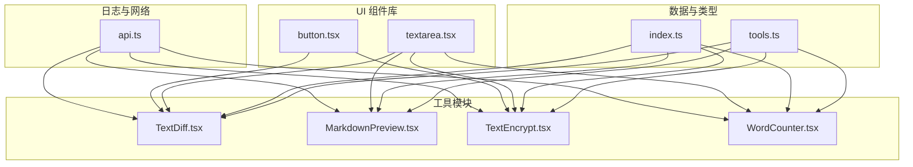
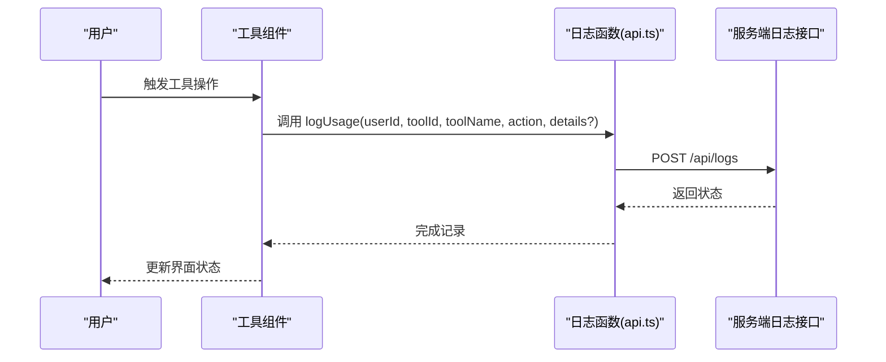
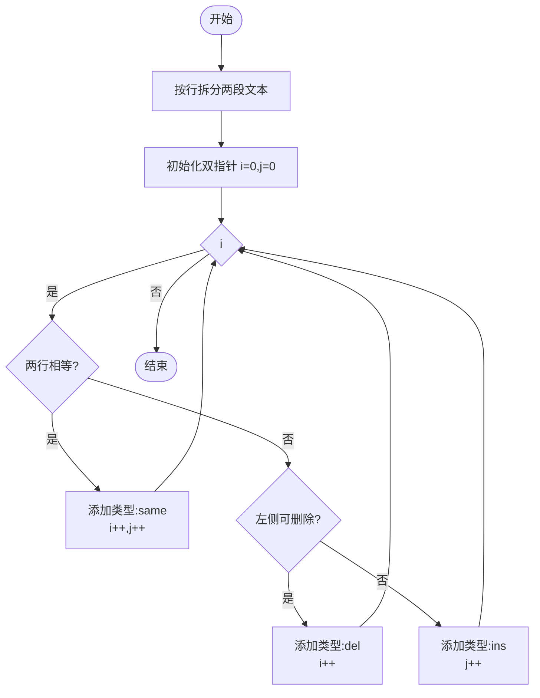
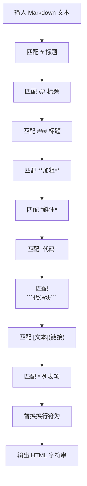
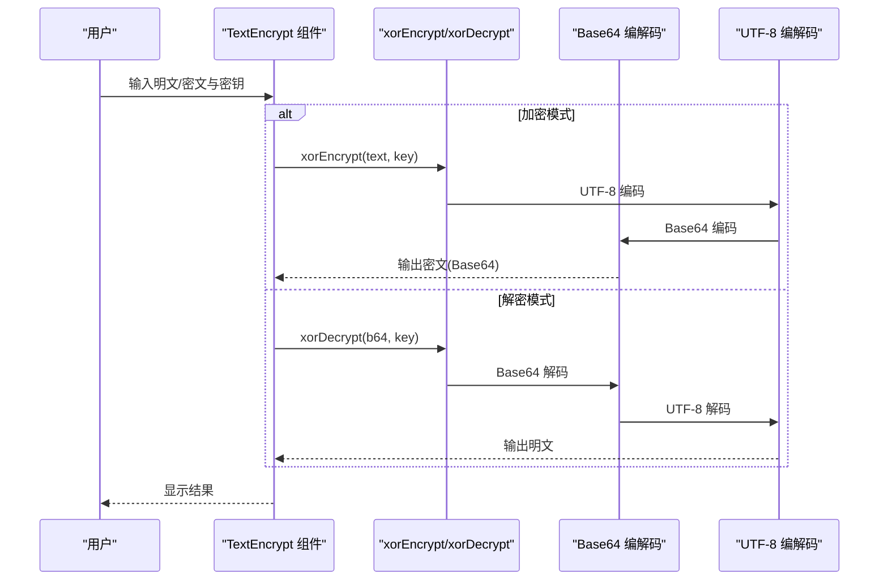
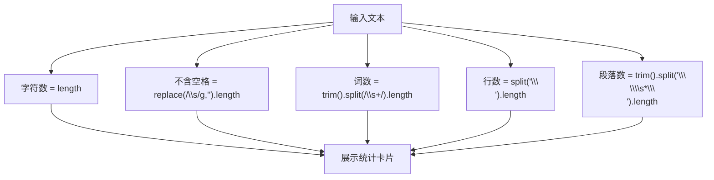
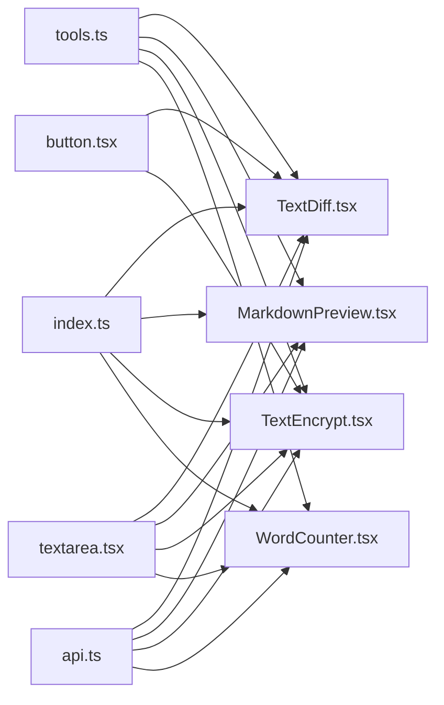

# 文本工具

<cite>
**本文引用的文件列表**
- [TextDiff.tsx](file://src/tools/TextDiff.tsx)
- [MarkdownPreview.tsx](file://src/tools/MarkdownPreview.tsx)
- [TextEncrypt.tsx](file://src/tools/TextEncrypt.tsx)
- [WordCounter.tsx](file://src/tools/WordCounter.tsx)
- [tools.ts](file://src/data/tools.ts)
- [api.ts](file://src/lib/api.ts)
- [textarea.tsx](file://src/components/ui/textarea.tsx)
- [button.tsx](file://src/components/ui/button.tsx)
- [index.ts](file://src/types/index.ts)
</cite>

## 目录
1. [简介](#简介)
2. [项目结构](#项目结构)
3. [核心组件](#核心组件)
4. [架构总览](#架构总览)
5. [详细组件分析](#详细组件分析)
6. [依赖关系分析](#依赖关系分析)
7. [性能考量](#性能考量)
8. [故障排查指南](#故障排查指南)
9. [结论](#结论)
10. [附录](#附录)

## 简介
本文件聚焦于文本工具类别，覆盖以下四个核心功能：
- 文本对比工具：对两段文本按行进行差异对比，并以不同样式高亮显示新增、删除与相同行。
- Markdown 预览工具：将 Markdown 文本即时渲染为 HTML 并在右侧区域预览，支持标题、加粗、斜体、代码块、链接与无序列表等基础语法。
- 文本加密工具：基于简单 XOR 的“演示级”加密/解密，支持可选密钥；输出采用 Base64 编码，便于传输与存储。
- 字数统计工具：统计字符数、不含空格字符数、词数、行数与段落数，提供直观的卡片式展示。

本技术文档从算法实现、编码处理、加密解密机制与统计计算方法入手，结合性能优化建议与使用场景分析，帮助用户高效使用这些文本处理工具。

## 项目结构
文本工具位于前端应用的工具模块中，每个工具均为独立的 React 组件，通过统一的数据源与 UI 组件库集成。工具注册与分类信息由数据文件集中管理，API 日志记录通过统一的工具函数完成。

图表来源
- [tools.ts:124-161](file://src/data/tools.ts#L124-L161)
- [TextDiff.tsx:1-70](file://src/tools/TextDiff.tsx#L1-L70)
- [MarkdownPreview.tsx:1-55](file://src/tools/MarkdownPreview.tsx#L1-L55)
- [TextEncrypt.tsx:1-86](file://src/tools/TextEncrypt.tsx#L1-L86)
- [WordCounter.tsx:1-47](file://src/tools/WordCounter.tsx#L1-L47)
- [api.ts:1-36](file://src/lib/api.ts#L1-L36)
- [textarea.tsx:1-23](file://src/components/ui/textarea.tsx#L1-L23)
- [button.tsx:1-50](file://src/components/ui/button.tsx#L1-L50)
- [index.ts:1-37](file://src/types/index.ts#L1-L37)

章节来源
- [tools.ts:124-161](file://src/data/tools.ts#L124-L161)
- [index.ts:15-27](file://src/types/index.ts#L15-L27)

## 核心组件
- 文本对比工具：提供两个文本框用于输入原始文本与对比文本，点击按钮后执行差异计算并以三类样式展示结果。
- Markdown 预览工具：左侧输入 Markdown，右侧实时渲染为 HTML，支持基础标题、加粗、斜体、行内代码、代码块、链接与无序列表。
- 文本加密工具：支持加密与解密两种模式，可选密钥；输出为 Base64 编码，便于复制与分享。
- 字数统计工具：实时统计字符数、不含空格字符数、词数、行数与段落数，以卡片形式展示。

章节来源
- [TextDiff.tsx:30-69](file://src/tools/TextDiff.tsx#L30-L69)
- [MarkdownPreview.tsx:20-54](file://src/tools/MarkdownPreview.tsx#L20-L54)
- [TextEncrypt.tsx:29-85](file://src/tools/TextEncrypt.tsx#L29-L85)
- [WordCounter.tsx:7-46](file://src/tools/WordCounter.tsx#L7-L46)

## 架构总览
文本工具遵循“组件-数据-类型-UI-日志”的分层设计：
- 组件层：各工具组件负责状态管理、事件处理与视图渲染。
- 数据层：工具清单与分类信息集中管理，便于路由与导航。
- 类型层：定义工具、分类与用户接口，确保类型安全。
- UI 层：复用统一的输入框与按钮组件，保证一致的交互体验。
- 日志层：统一的使用日志记录函数，上报用户行为与工具使用情况。

图表来源
- [api.ts:3-19](file://src/lib/api.ts#L3-L19)
- [TextDiff.tsx:37](file://src/tools/TextDiff.tsx#L37)
- [MarkdownPreview.tsx:37](file://src/tools/MarkdownPreview.tsx#L37)
- [TextEncrypt.tsx:43](file://src/tools/TextEncrypt.tsx#L43)

## 详细组件分析

### 文本对比工具（TextDiff）
- 功能概述：按行对比两段文本，输出三类结果：相同、删除、新增，并以不同样式高亮显示。
- 算法实现要点：
  - 将输入文本按换行符拆分为行数组。
  - 使用双指针遍历两数组，逐行比较。
  - 当当前行相等时，标记为“相同”，并同时前进。
  - 否则根据是否能在另一侧找到该行决定标记为“删除”或“新增”，并仅移动对应指针。
  - 未匹配到的剩余行按顺序追加。
- 复杂度分析：
  - 时间复杂度：O(m+n)，其中 m、n 分别为两段文本的行数。
  - 空间复杂度：O(m+n)，用于存储结果数组。
- 性能优化建议：
  - 对超长文本建议分页或分段对比，避免一次性渲染大量 DOM。
  - 可引入虚拟滚动以提升长列表渲染性能。
  - 在频繁输入场景下，增加防抖策略减少计算频率。
- 使用场景：
  - 版本对比、变更追踪、文档修订、代码审查等。

图表来源
- [TextDiff.tsx:8-28](file://src/tools/TextDiff.tsx#L8-L28)

章节来源
- [TextDiff.tsx:8-28](file://src/tools/TextDiff.tsx#L8-L28)
- [TextDiff.tsx:30-69](file://src/tools/TextDiff.tsx#L30-L69)

### Markdown 预览工具（MarkdownPreview）
- 功能概述：将 Markdown 文本转换为 HTML 并在右侧区域渲染，支持标题、加粗、斜体、行内代码、代码块、链接与无序列表。
- 渲染机制：
  - 使用正则替换将 Markdown 语法映射为对应的 HTML 标签。
  - 支持多行代码块与行内代码高亮。
  - 自动换行处理，将换行符转换为换行标签。
- 复杂度分析：
  - 时间复杂度：O(n)，n 为输入文本长度，取决于正则替换次数。
  - 空间复杂度：O(n)，用于构建输出字符串。
- 性能优化建议：
  - 对大文档建议延迟渲染或分段渲染。
  - 可引入 Web Worker 进行纯文本处理，避免阻塞主线程。
  - 对代码块内容可启用语法高亮库（如 Prism）以提升可读性。
- 使用场景：
  - 文档编写、笔记记录、快速预览、教学演示等。

图表来源
- [MarkdownPreview.tsx:6-18](file://src/tools/MarkdownPreview.tsx#L6-L18)

章节来源
- [MarkdownPreview.tsx:6-18](file://src/tools/MarkdownPreview.tsx#L6-L18)
- [MarkdownPreview.tsx:20-54](file://src/tools/MarkdownPreview.tsx#L20-L54)

### 文本加密工具（TextEncrypt）
- 功能概述：提供加密与解密两种模式，支持可选密钥；输出为 Base64 编码，便于复制与分享。
- 加密解密机制：
  - 加密流程：若无密钥，直接对明文进行 UTF-8 编码后 Base64 编码；若有密钥，先对明文逐字符与密钥循环异或，再进行 UTF-8 编码与 Base64 编码。
  - 解密流程：先 Base64 解码，再根据是否存在密钥决定是否进行循环异或还原，最后进行 UTF-8 解码。
- 复杂度分析：
  - 时间复杂度：O(n)，n 为文本长度。
  - 空间复杂度：O(n)，用于中间字符串拼接。
- 安全性说明：
  - 当前实现为演示级 XOR 加密，不适用于生产环境的敏感数据保护。
  - 建议在实际应用中使用标准加密库（如 AES），并妥善管理密钥与盐值。
- 性能优化建议：
  - 对超长文本建议分块处理，避免一次性内存占用过高。
  - 可引入异步处理与进度反馈，改善用户体验。
- 使用场景：
  - 教学演示、轻量混淆、临时传输等非敏感用途。

图表来源
- [TextEncrypt.tsx:9-27](file://src/tools/TextEncrypt.tsx#L9-L27)
- [TextEncrypt.tsx:29-85](file://src/tools/TextEncrypt.tsx#L29-L85)

章节来源
- [TextEncrypt.tsx:9-27](file://src/tools/TextEncrypt.tsx#L9-L27)
- [TextEncrypt.tsx:29-85](file://src/tools/TextEncrypt.tsx#L29-L85)

### 字数统计工具（WordCounter）
- 功能概述：实时统计字符数、不含空格字符数、词数、行数与段落数，并以卡片形式展示。
- 统计逻辑：
  - 字符数：直接返回文本长度。
  - 不含空格字符数：移除所有空白字符后统计长度。
  - 词数：去除首尾空白后按空白正则分割并统计数量。
  - 行数：按换行符分割统计数量。
  - 段落数：去除首尾空白后按空行正则分割统计数量。
- 复杂度分析：
  - 时间复杂度：O(n)，n 为文本长度。
  - 空间复杂度：O(n)，用于分割与统计。
- 性能优化建议：
  - 对超长文本建议节流更新，避免频繁重渲染。
  - 可引入缓存策略，对重复输入进行短路处理。
- 使用场景：
  - 写作辅助、内容审核、SEO 优化、学术写作等。

图表来源
- [WordCounter.tsx:10-16](file://src/tools/WordCounter.tsx#L10-L16)

章节来源
- [WordCounter.tsx:10-16](file://src/tools/WordCounter.tsx#L10-L16)
- [WordCounter.tsx:18-46](file://src/tools/WordCounter.tsx#L18-L46)

## 依赖关系分析
- 工具注册与分类：文本工具在工具清单中明确声明其分类与路径，便于路由与导航。
- 类型约束：工具、分类与用户接口定义了统一的数据结构，确保组件间传递参数的一致性。
- UI 组件复用：输入框与按钮组件提供一致的样式与交互，降低维护成本。
- 日志记录：统一的日志函数封装了网络请求细节，便于扩展与监控。

图表来源
- [tools.ts:124-161](file://src/data/tools.ts#L124-L161)
- [index.ts:3-13](file://src/types/index.ts#L3-L13)
- [textarea.tsx:1-23](file://src/components/ui/textarea.tsx#L1-L23)
- [button.tsx:1-50](file://src/components/ui/button.tsx#L1-L50)
- [api.ts:3-19](file://src/lib/api.ts#L3-L19)

章节来源
- [tools.ts:124-161](file://src/data/tools.ts#L124-L161)
- [index.ts:3-13](file://src/types/index.ts#L3-L13)

## 性能考量
- 文本对比：对于超长文本，建议分页或分段处理，配合虚拟滚动与防抖策略，避免一次性渲染造成卡顿。
- Markdown 预览：大文档可采用延迟渲染或分段渲染，必要时引入 Web Worker 与语法高亮库，提升渲染效率与可读性。
- 文本加密：演示级 XOR 加密适合小规模数据，生产环境应使用标准加密库与密钥管理方案，避免在前端暴露敏感密钥。
- 字数统计：对频繁输入场景建议节流更新，减少不必要的重渲染与计算。

## 故障排查指南
- 文本对比无结果或结果异常：
  - 检查输入文本是否包含不可见字符或特殊编码。
  - 确认双指针逻辑是否正确处理边界条件（空文本、单侧文本）。
- Markdown 预览渲染异常：
  - 检查正则替换顺序与冲突，确保代码块与行内代码优先处理。
  - 确认换行符替换逻辑是否覆盖所有平台换行符。
- 文本加密/解密失败：
  - 确认密钥是否为空，以及 Base64 编码/解码过程是否完整。
  - 检查 UTF-8 编码/解码链路是否一致。
- 日志记录失败：
  - 检查网络请求是否成功，确认服务端接口可用性与跨域配置。

章节来源
- [api.ts:10-19](file://src/lib/api.ts#L10-L19)

## 结论
文本工具类别提供了基础而实用的文本处理能力：差异对比、Markdown 渲染、演示级加密与字数统计。通过合理的算法设计与 UI 组件复用，这些工具能够满足日常文档处理与内容创作需求。对于生产环境，建议在加密与渲染方面引入更成熟的方案，并结合性能优化策略提升用户体验。

## 附录
- 工具注册与分类：文本工具在工具清单中明确声明其分类与路径，便于路由与导航。
- 类型定义：工具、分类与用户接口定义了统一的数据结构，确保组件间传递参数的一致性。
- UI 组件：输入框与按钮组件提供一致的样式与交互，降低维护成本。
- 日志记录：统一的日志函数封装了网络请求细节，便于扩展与监控。

章节来源
- [tools.ts:124-161](file://src/data/tools.ts#L124-L161)
- [index.ts:3-13](file://src/types/index.ts#L3-L13)
- [textarea.tsx:1-23](file://src/components/ui/textarea.tsx#L1-L23)
- [button.tsx:1-50](file://src/components/ui/button.tsx#L1-L50)
- [api.ts:3-19](file://src/lib/api.ts#L3-L19)