# 网络工具

<cite>
**本文引用的文件**
- [SpeedTest.tsx](file://src/tools/SpeedTest.tsx)
- [IpLookup.tsx](file://src/tools/IpLookup.tsx)
- [HttpClient.tsx](file://src/tools/HttpClient.tsx)
- [DnsLookup.tsx](file://src/tools/DnsLookup.tsx)
- [PingTest.tsx](file://src/tools/PingTest.tsx)
- [network.ts](file://server/src/routes/network.ts)
- [api.ts](file://src/lib/api.ts)
- [tools.ts](file://src/data/tools.ts)
- [ToolPage.tsx](file://src/pages/ToolPage.tsx)
- [index.ts](file://server/src/index.ts)
- [package.json](file://package.json)
- [server/package.json](file://server/package.json)
</cite>

## 目录
1. [简介](#简介)
2. [项目结构](#项目结构)
3. [核心组件](#核心组件)
4. [架构概览](#架构概览)
5. [详细组件分析](#详细组件分析)
6. [依赖关系分析](#依赖关系分析)
7. [性能考虑](#性能考虑)
8. [故障排查指南](#故障排查指南)
9. [结论](#结论)

## 简介

网络工具模块是 AnyTools 应用程序中的一个核心功能模块，提供了五种主要的网络诊断和测试工具。该模块采用前后端分离的架构设计，前端使用 React 构建用户界面，后端基于 Express.js 提供网络服务接口。

网络工具模块包含以下五个核心工具：
- **网速测试工具**：测量网络延迟、下载速度和上传速度
- **IP 查询工具**：查询 IP 地址的地理位置和运营商信息
- **HTTP 客户端工具**：发送各种 HTTP 请求并查看响应结果
- **DNS 查询工具**：查询域名的各种 DNS 记录类型
- **Ping 检测工具**：检测目标主机的连通性和延迟

这些工具通过统一的 API 接口与后端服务交互，实现了完整的网络诊断功能。

## 项目结构

网络工具模块采用模块化的项目结构，主要分为前端工具组件和后端网络服务两个部分：

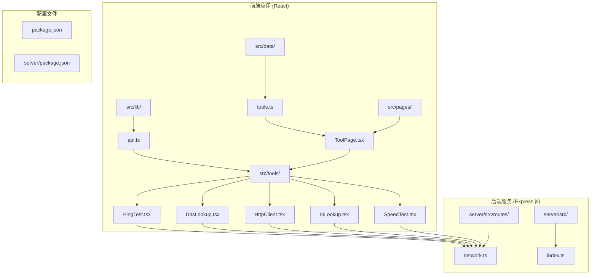

**图表来源**
- [SpeedTest.tsx:1-523](file://src/tools/SpeedTest.tsx#L1-L523)
- [IpLookup.tsx:1-72](file://src/tools/IpLookup.tsx#L1-L72)
- [HttpClient.tsx:1-90](file://src/tools/HttpClient.tsx#L1-L90)
- [DnsLookup.tsx:1-80](file://src/tools/DnsLookup.tsx#L1-L80)
- [PingTest.tsx:1-73](file://src/tools/PingTest.tsx#L1-L73)
- [network.ts:1-109](file://server/src/routes/network.ts#L1-L109)

**章节来源**
- [SpeedTest.tsx:1-523](file://src/tools/SpeedTest.tsx#L1-L523)
- [IpLookup.tsx:1-72](file://src/tools/IpLookup.tsx#L1-L72)
- [HttpClient.tsx:1-90](file://src/tools/HttpClient.tsx#L1-L90)
- [DnsLookup.tsx:1-80](file://src/tools/DnsLookup.tsx#L1-L80)
- [PingTest.tsx:1-73](file://src/tools/PingTest.tsx#L1-L73)

## 核心组件

网络工具模块的核心组件由五个独立的 React 组件构成，每个组件都封装了特定的网络功能：

### 组件架构图

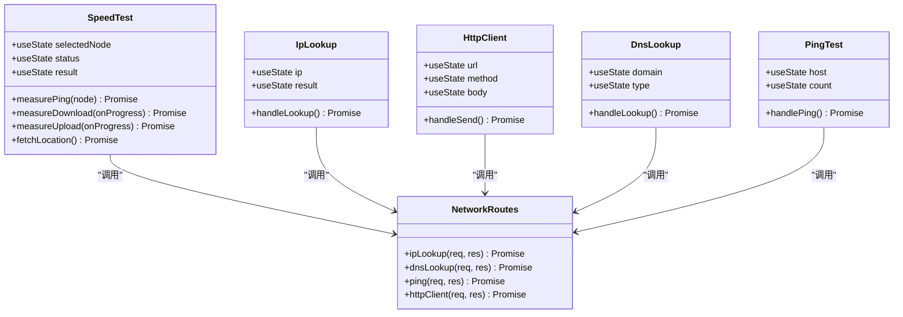

**图表来源**
- [SpeedTest.tsx:185-308](file://src/tools/SpeedTest.tsx#L185-L308)
- [IpLookup.tsx:10-35](file://src/tools/IpLookup.tsx#L10-L35)
- [HttpClient.tsx:11-42](file://src/tools/HttpClient.tsx#L11-L42)
- [DnsLookup.tsx:10-37](file://src/tools/DnsLookup.tsx#L10-L37)
- [PingTest.tsx:10-37](file://src/tools/PingTest.tsx#L10-L37)
- [network.ts:10-106](file://server/src/routes/network.ts#L10-L106)

### 工具分类和标识

网络工具在系统中被归类为 "network" 类别，每个工具都有独特的标识符和图标：

| 工具名称 | 标识符 | 图标 | 功能描述 |
|---------|--------|------|----------|
| 网速测试 | speed-test | Gauge | 测试网络延迟、下载和上传速度 |
| IP 查询 | ip-lookup | Globe | 查询 IP 地址归属地和运营商 |
| HTTP 请求 | http-client | Send | 发送 HTTP 请求并查看响应 |
| DNS 查询 | dns-lookup | Radar | 查询域名 DNS 解析记录 |
| Ping 检测 | ping-test | Wifi | 检测目标主机连通性和延迟 |

**章节来源**
- [tools.ts:253-301](file://src/data/tools.ts#L253-L301)

## 架构概览

网络工具模块采用客户端-服务器架构，前端负责用户界面和交互逻辑，后端提供网络服务接口。

### 整体架构图

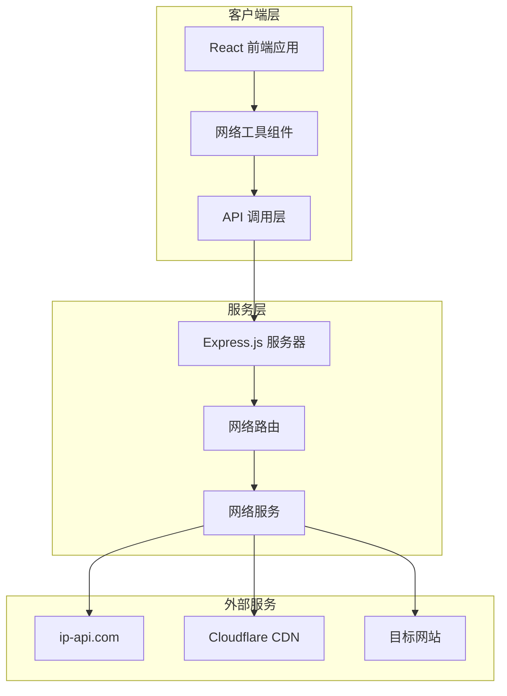

**图表来源**
- [ToolPage.tsx:40-112](file://src/pages/ToolPage.tsx#L40-L112)
- [api.ts:3-19](file://src/lib/api.ts#L3-L19)
- [network.ts:1-109](file://server/src/routes/network.ts#L1-L109)

### 数据流图

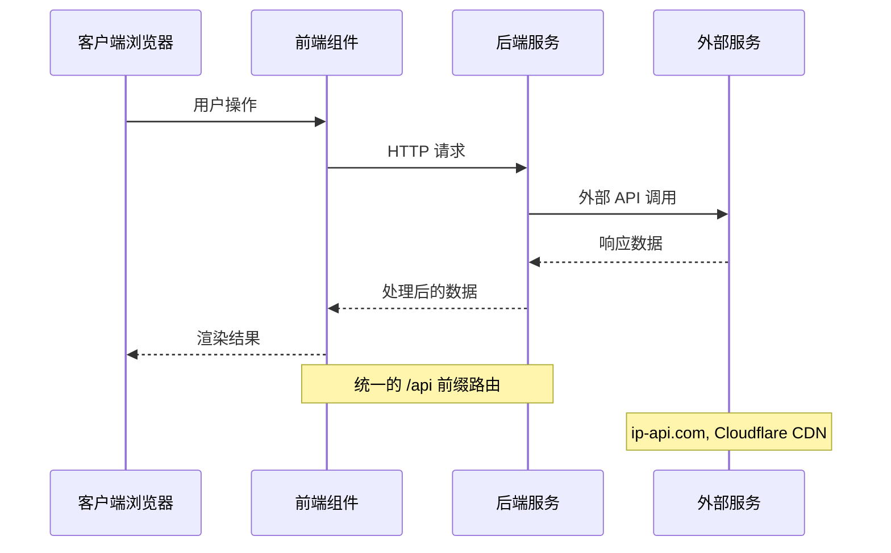

**图表来源**
- [SpeedTest.tsx:197-227](file://src/tools/SpeedTest.tsx#L197-L227)
- [IpLookup.tsx:21-28](file://src/tools/IpLookup.tsx#L21-L28)
- [HttpClient.tsx:24-35](file://src/tools/HttpClient.tsx#L24-L35)

## 详细组件分析

### 网速测试工具 (SpeedTest)

网速测试工具提供了全面的网络性能测量功能，包括延迟测试、下载速度测试和上传速度测试。

#### 核心功能流程

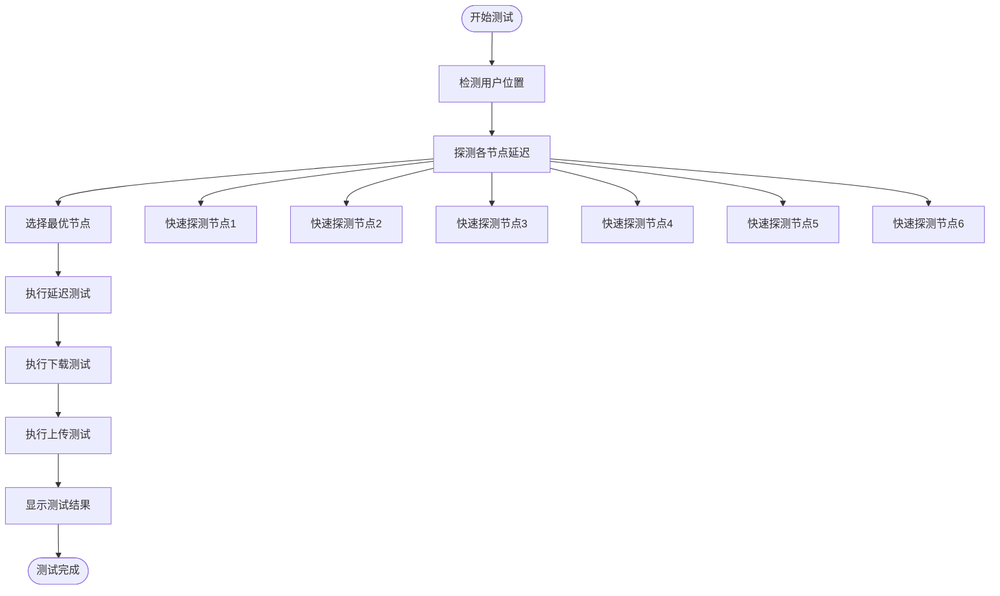

**图表来源**
- [SpeedTest.tsx:229-275](file://src/tools/SpeedTest.tsx#L229-L275)
- [SpeedTest.tsx:85-90](file://src/tools/SpeedTest.tsx#L85-L90)

#### 技术实现要点

1. **多节点测速**：支持全球多个测速节点，包括中国、美国、德国、日本、新加坡等地区
2. **智能节点选择**：根据用户地理位置自动选择最优测速节点
3. **延迟测量算法**：使用多次 ping 测量并计算中位数和抖动值
4. **带宽测试**：使用 Cloudflare CDN 进行准确的下载和上传速度测量

#### 性能测量算法

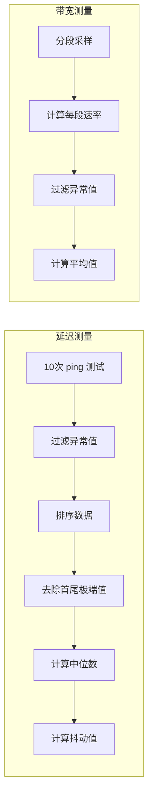

**图表来源**
- [SpeedTest.tsx:69-82](file://src/tools/SpeedTest.tsx#L69-L82)
- [SpeedTest.tsx:122-133](file://src/tools/SpeedTest.tsx#L122-L133)

**章节来源**
- [SpeedTest.tsx:1-523](file://src/tools/SpeedTest.tsx#L1-L523)

### IP 查询工具 (IpLookup)

IP 查询工具允许用户查询指定 IP 地址的地理位置、运营商和其他相关信息。

#### 查询流程

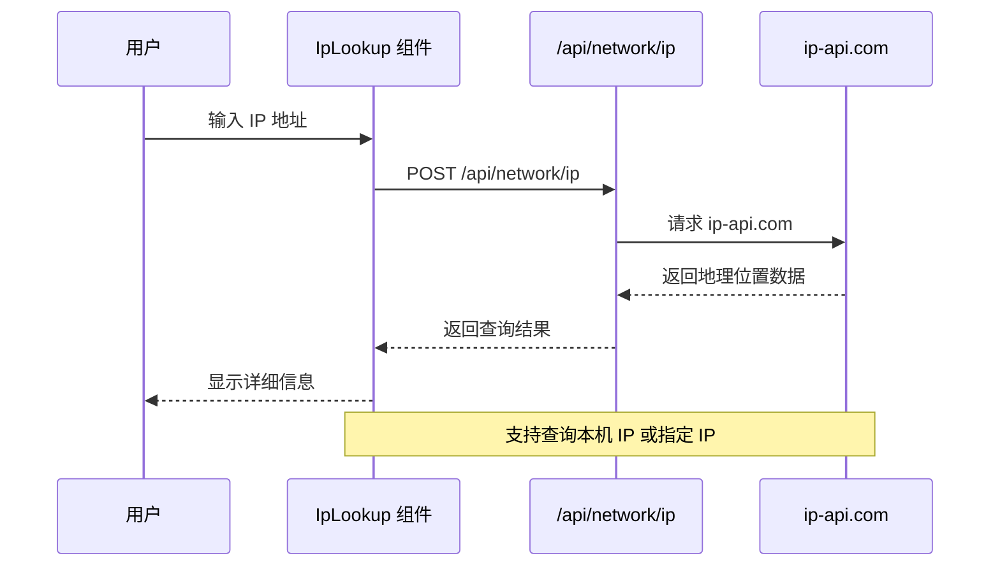

**图表来源**
- [IpLookup.tsx:16-35](file://src/tools/IpLookup.tsx#L16-L35)
- [network.ts:10-25](file://server/src/routes/network.ts#L10-L25)

#### 支持的查询字段

| 字段名 | 描述 | 示例值 |
|--------|------|--------|
| query | 查询的 IP 地址 | 8.8.8.8 |
| country | 国家 | United States |
| regionName | 地区 | California |
| city | 城市 | Mountain View |
| isp | 运营商 | Google LLC |
| timezone | 时区 | America/Los_Angeles |
| lat | 纬度 | 37.4056 |
| lon | 经度 | -122.0775 |

**章节来源**
- [IpLookup.tsx:1-72](file://src/tools/IpLookup.tsx#L1-L72)
- [network.ts:10-25](file://server/src/routes/network.ts#L10-L25)

### HTTP 客户端工具 (HttpClient)

HTTP 客户端工具提供了完整的 HTTP 请求发送功能，支持多种 HTTP 方法和请求体格式。

#### HTTP 方法支持

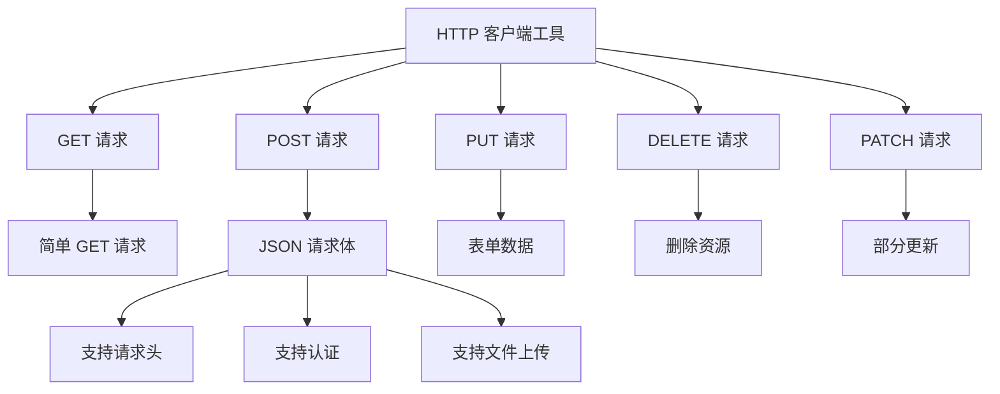

**图表来源**
- [HttpClient.tsx:51-55](file://src/tools/HttpClient.tsx#L51-L55)
- [HttpClient.tsx:24-42](file://src/tools/HttpClient.tsx#L24-L42)

#### 请求处理流程

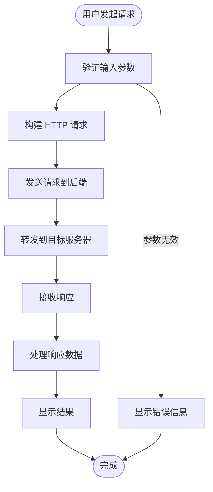

**图表来源**
- [HttpClient.tsx:19-42](file://src/tools/HttpClient.tsx#L19-L42)
- [network.ts:66-106](file://server/src/routes/network.ts#L66-L106)

**章节来源**
- [HttpClient.tsx:1-90](file://src/tools/HttpClient.tsx#L1-L90)
- [network.ts:66-106](file://server/src/routes/network.ts#L66-L106)

### DNS 查询工具 (DnsLookup)

DNS 查询工具允许用户查询域名的各种 DNS 记录类型，支持常见的 DNS 查询需求。

#### DNS 记录类型支持

| 记录类型 | 描述 | 用途 |
|----------|------|------|
| A | IPv4 地址记录 | 主机名到 IPv4 地址映射 |
| AAAA | IPv6 地址记录 | 主机名到 IPv6 地址映射 |
| CNAME | 规范主机名记录 | 别名记录 |
| MX | 邮件交换记录 | 邮件服务器设置 |
| TXT | 文本记录 | 验证和 SPF 设置 |
| NS | 名称服务器记录 | 区域权威服务器 |

#### DNS 查询流程

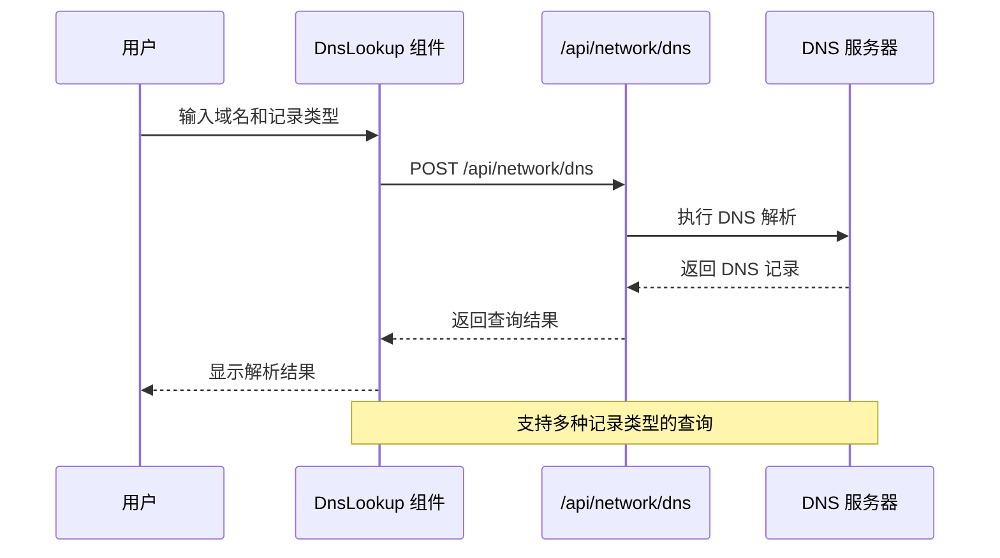

**图表来源**
- [DnsLookup.tsx:17-37](file://src/tools/DnsLookup.tsx#L17-L37)
- [network.ts:27-45](file://server/src/routes/network.ts#L27-L45)

**章节来源**
- [DnsLookup.tsx:1-80](file://src/tools/DnsLookup.tsx#L1-L80)
- [network.ts:27-45](file://server/src/routes/network.ts#L27-L45)

### Ping 检测工具 (PingTest)

Ping 检测工具用于测试目标主机的网络连通性和响应延迟，支持自定义测试次数。

#### Ping 实现机制

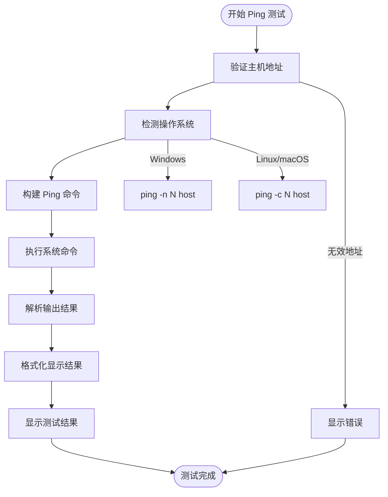

**图表来源**
- [PingTest.tsx:17-37](file://src/tools/PingTest.tsx#L17-L37)
- [network.ts:47-63](file://server/src/routes/network.ts#L47-L63)

#### 平台兼容性

| 操作系统 | Ping 命令 | 参数说明 |
|----------|-----------|----------|
| Windows | `ping -n count host` | `-n` 指定次数 |
| Linux | `ping -c count host` | `-c` 指定次数 |
| macOS | `ping -c count host` | `-c` 指定次数 |

**章节来源**
- [PingTest.tsx:1-73](file://src/tools/PingTest.tsx#L1-L73)
- [network.ts:47-63](file://server/src/routes/network.ts#L47-L63)

## 依赖关系分析

网络工具模块的依赖关系相对清晰，主要涉及前端组件、后端服务和外部 API 服务。

### 前端依赖关系

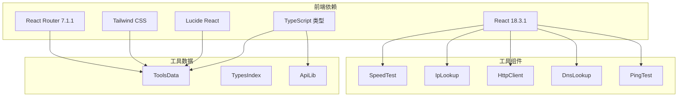

**图表来源**
- [package.json:11-32](file://package.json#L11-L32)
- [tools.ts:1-316](file://src/data/tools.ts#L1-L316)
- [index.ts](file://server/src/index.ts)

### 后端依赖关系

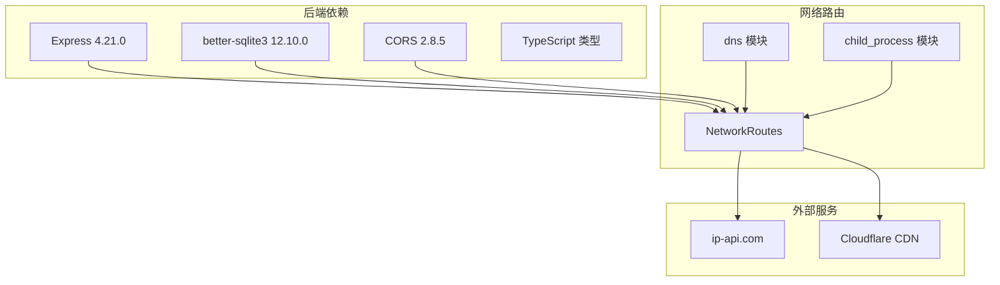

**图表来源**
- [server/package.json:10-22](file://server/package.json#L10-L22)
- [network.ts:1-109](file://server/src/routes/network.ts#L1-L109)

### API 调用流程

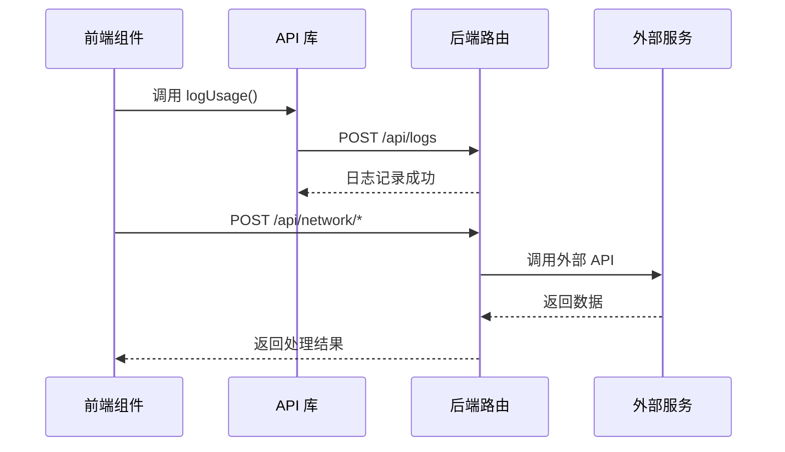

**图表来源**
- [api.ts:3-19](file://src/lib/api.ts#L3-L19)
- [network.ts:10-106](file://server/src/routes/network.ts#L10-L106)

**章节来源**
- [package.json:1-34](file://package.json#L1-L34)
- [server/package.json:1-23](file://server/package.json#L1-L23)

## 性能考虑

网络工具模块在设计时充分考虑了性能优化和用户体验。

### 前端性能优化

1. **组件懒加载**：使用 React.lazy 和 Suspense 实现组件按需加载
2. **状态管理优化**：合理使用 useState 和 useEffect 避免不必要的重渲染
3. **异步操作处理**：使用 AbortController 控制长时间运行的操作
4. **进度反馈**：提供实时进度指示改善用户体验

### 后端性能优化

1. **外部 API 缓存**：合理使用缓存减少重复请求
2. **超时控制**：设置合理的请求超时时间避免阻塞
3. **资源限制**：对大型响应进行截断处理
4. **并发控制**：避免同时发起过多的外部请求

### 网络性能测量

```mermaid
graph LR
subgraph "测速精度"
A[多次采样] --> B[数据清洗]
B --> C[统计分析]
C --> D[结果展示]
end
subgraph "性能指标"
E[延迟(ms)] --> F[抖动(ms)]
G[下载(Mbps)] --> H[上传(Mbps)]
end
subgraph "优化策略"
I[过滤异常值] --> J[分段采样]
J --> K[平均值计算]
end
```

**图表来源**
- [SpeedTest.tsx:69-82](file://src/tools/SpeedTest.tsx#L69-L82)
- [SpeedTest.tsx:122-133](file://src/tools/SpeedTest.tsx#L122-L133)

## 故障排查指南

### 常见问题及解决方案

#### 网速测试问题

| 问题现象 | 可能原因 | 解决方案 |
|----------|----------|----------|
| 测速结果异常 | 网络不稳定 | 重新测试，确保网络稳定 |
| 节点选择错误 | IP 定位失败 | 手动选择测速节点 |
| 测速超时 | 服务器不可达 | 更换测速节点或稍后重试 |
| 结果波动大 | 网络拥塞 | 在网络空闲时段测试 |

#### IP 查询问题

| 问题现象 | 可能原因 | 解决方案 |
|----------|----------|----------|
| 查询失败 | 外部 API 不可用 | 检查网络连接，稍后重试 |
| 结果为空 | IP 地址无效 | 验证 IP 地址格式 |
| 时区错误 | 时区服务问题 | 手动检查时区设置 |
| 位置不准确 | IP 定位精度限制 | 使用多个查询源交叉验证 |

#### HTTP 客户端问题

| 问题现象 | 可能原因 | 解决方案 |
|----------|----------|----------|
| CORS 错误 | 跨域限制 | 使用后端代理或调整目标服务器设置 |
| 请求超时 | 目标服务器无响应 | 检查目标服务器状态 |
| 认证失败 | 凭据错误 | 验证认证信息和权限 |
| 响应过大 | 内容过长 | 检查内容类型，必要时下载文件 |

#### DNS 查询问题

| 问题现象 | 可能原因 | 解决方案 |
|----------|----------|----------|
| 查询超时 | DNS 服务器无响应 | 更换 DNS 服务器或稍后重试 |
| 结果为空 | 域名不存在 | 验证域名拼写 |
| 权限不足 | DNS 查询受限 | 检查防火墙设置 |
| 缓存问题 | DNS 缓存过期 | 清除本地 DNS 缓存 |

#### Ping 测试问题

| 问题现象 | 可能原因 | 解决方案 |
|----------|----------|----------|
| Ping 失败 | 目标主机不可达 | 检查网络连接和防火墙设置 |
| 命令执行失败 | 权限不足 | 以管理员身份运行或使用代理 |
| 输出格式异常 | 平台差异 | 检查操作系统兼容性 |
| 超时错误 | 系统超时 | 增加超时时间或减少测试次数 |

### 调试技巧

1. **浏览器开发者工具**：使用 Network 面板监控 API 请求
2. **日志记录**：利用后端日志查看详细的错误信息
3. **网络抓包**：使用 Wireshark 分析网络流量
4. **API 测试**：直接使用 curl 或 Postman 测试 API 接口

### 最佳实践

1. **错误处理**：始终包含适当的错误处理和用户反馈
2. **超时设置**：为所有网络请求设置合理的超时时间
3. **重试机制**：对于临时性错误实现自动重试
4. **用户引导**：提供清晰的使用说明和结果解释
5. **性能监控**：监控工具的使用频率和性能表现

**章节来源**
- [SpeedTest.tsx:52-67](file://src/tools/SpeedTest.tsx#L52-L67)
- [IpLookup.tsx:20-35](file://src/tools/IpLookup.tsx#L20-L35)
- [HttpClient.tsx:34-42](file://src/tools/HttpClient.tsx#L34-L42)
- [DnsLookup.tsx:28-37](file://src/tools/DnsLookup.tsx#L28-L37)
- [PingTest.tsx:28-37](file://src/tools/PingTest.tsx#L28-L37)

## 结论

网络工具模块是一个功能完整、架构清晰的网络诊断工具集合。通过前后端分离的设计，该模块实现了良好的可维护性和扩展性。

### 主要优势

1. **功能完整性**：涵盖了网络诊断的主要需求，从基础连通性到性能测量
2. **用户体验**：提供直观的界面和实时的进度反馈
3. **技术先进**：采用现代的 React 技术栈和 Express.js 后端
4. **可扩展性**：模块化的架构便于添加新的网络工具
5. **可靠性**：完善的错误处理和超时控制机制

### 技术亮点

1. **智能节点选择**：基于地理位置的自动节点选择算法
2. **精确的性能测量**：多采样和数据清洗的测速算法
3. **跨平台兼容**：支持多种操作系统和 DNS 记录类型
4. **安全考虑**：通过后端代理避免直接的跨域访问
5. **性能优化**：懒加载和状态管理优化提升用户体验

### 发展建议

1. **增加更多测速节点**：扩大全球覆盖范围提高测速准确性
2. **支持更多 DNS 记录类型**：如 SOA、PTR、SRV 等高级记录
3. **历史数据分析**：提供网络性能的历史趋势分析
4. **批量测试功能**：支持同时测试多个目标的网络状况
5. **报告生成功能**：导出测试结果为 PDF 或 CSV 格式

网络工具模块为用户提供了一个强大而易用的网络诊断工具集，满足了日常网络管理和故障排查的需求。