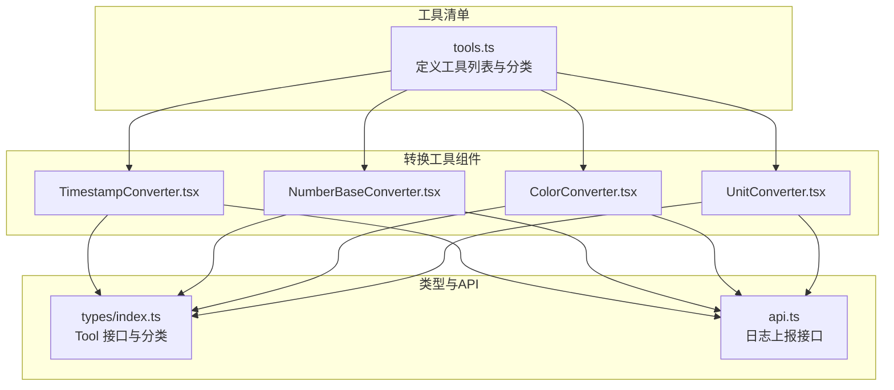
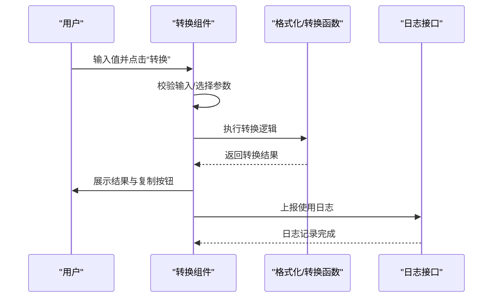
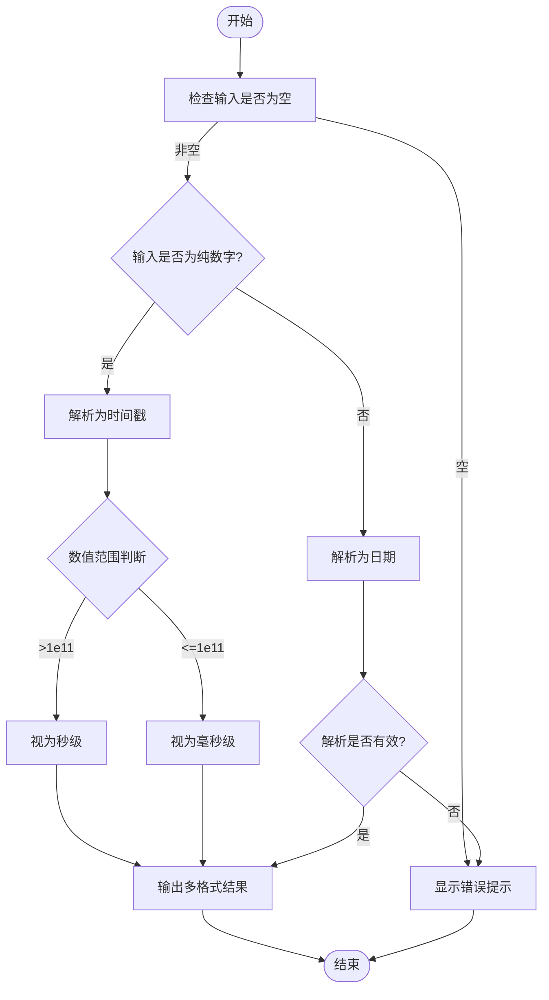
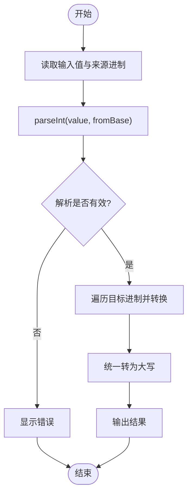
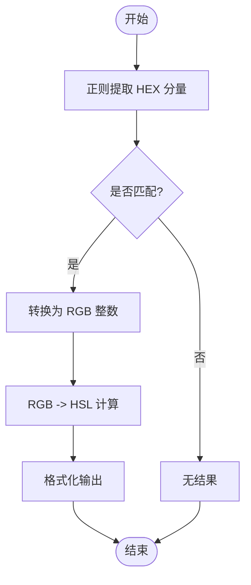
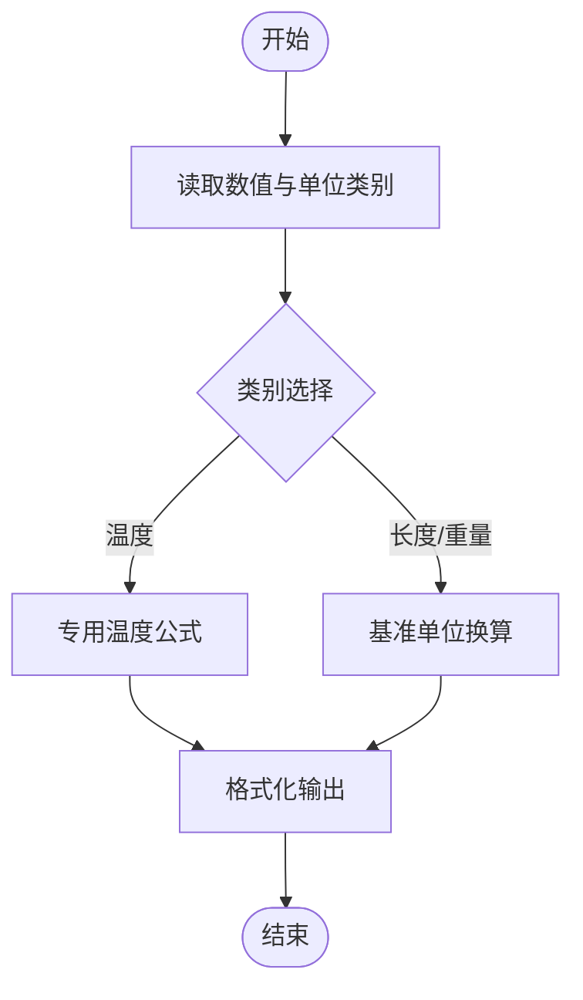
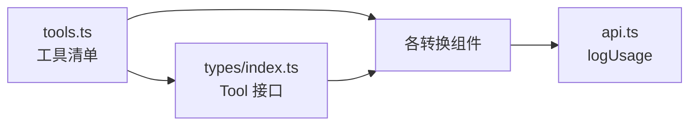

# 转换工具

<cite>
**本文引用的文件**
- [TimestampConverter.tsx](file://src/tools/TimestampConverter.tsx)
- [NumberBaseConverter.tsx](file://src/tools/NumberBaseConverter.tsx)
- [ColorConverter.tsx](file://src/tools/ColorConverter.tsx)
- [UnitConverter.tsx](file://src/tools/UnitConverter.tsx)
- [tools.ts](file://src/data/tools.ts)
- [types/index.ts](file://src/types/index.ts)
- [api.ts](file://src/lib/api.ts)
</cite>

## 目录
1. [简介](#简介)
2. [项目结构](#项目结构)
3. [核心组件](#核心组件)
4. [架构总览](#架构总览)
5. [详细组件分析](#详细组件分析)
6. [依赖关系分析](#依赖关系分析)
7. [性能考量](#性能考量)
8. [故障排查指南](#故障排查指南)
9. [结论](#结论)
10. [附录](#附录)

## 简介
本技术文档聚焦于转换工具类别，覆盖以下四类转换工具：
- 时间戳转换工具：支持 Unix 秒级/毫秒级时间戳与日期字符串之间的互转，自动识别输入类型并输出多种格式。
- 进制转换工具：支持二进制、八进制、十进制、十六进制之间的相互转换。
- 颜色转换工具：支持 HEX、RGB、HSL 三种颜色格式之间的互转，并提供可视化预览。
- 单位转换工具：支持长度、重量、温度三类度量单位的转换，其中温度采用专用转换逻辑。

文档将从系统架构、数据流、处理逻辑、精度处理、边界情况、转换规则、性能考虑与实际应用场景等方面进行深入分析，并提供转换公式说明、代码实现分析与使用示例路径，帮助用户正确理解与使用这些转换工具。

## 项目结构
转换工具位于前端源码目录中，每个工具以独立的 React 组件形式实现，统一注册在工具清单中，供页面路由与导航使用。

图表来源
- [tools.ts:84-122](file://src/data/tools.ts#L84-L122)
- [TimestampConverter.tsx:1-84](file://src/tools/TimestampConverter.tsx#L1-L84)
- [NumberBaseConverter.tsx:1-82](file://src/tools/NumberBaseConverter.tsx#L1-L82)
- [ColorConverter.tsx:1-91](file://src/tools/ColorConverter.tsx#L1-L91)
- [UnitConverter.tsx:1-114](file://src/tools/UnitConverter.tsx#L1-L114)
- [types/index.ts:3-27](file://src/types/index.ts#L3-L27)
- [api.ts:3-19](file://src/lib/api.ts#L3-L19)

章节来源
- [tools.ts:84-122](file://src/data/tools.ts#L84-L122)
- [types/index.ts:3-27](file://src/types/index.ts#L3-L27)

## 核心组件
- 时间戳转换工具：根据输入是否为纯数字判断为时间戳或日期字符串，自动区分秒级与毫秒级时间戳，输出本地时间、ISO 时间、秒级/毫秒级时间戳等多种格式。
- 进制转换工具：支持从任意给定进制读入，统一转换到二进制、八进制、十进制、十六进制，结果全部大写。
- 颜色转换工具：提供 HEX 到 RGB 的解析，再由 RGB 转换到 HSL；同时支持回显 HEX、RGB、HSL 三种格式，并提供颜色块可视化。
- 单位转换工具：按类别组织单位，长度与重量采用“以某单位为基准”的换算方式，温度采用专用公式（摄氏、华氏、开尔文）。

章节来源
- [TimestampConverter.tsx:15-41](file://src/tools/TimestampConverter.tsx#L15-L41)
- [NumberBaseConverter.tsx:21-34](file://src/tools/NumberBaseConverter.tsx#L21-L34)
- [ColorConverter.tsx:40-53](file://src/tools/ColorConverter.tsx#L40-L53)
- [UnitConverter.tsx:39-52](file://src/tools/UnitConverter.tsx#L39-L52)

## 架构总览
转换工具的运行时交互流程如下：用户在界面输入值，点击“转换”后，组件内部执行相应的转换逻辑，随后将结果展示并可复制；同时通过日志接口上报使用行为。

图表来源
- [TimestampConverter.tsx:15-41](file://src/tools/TimestampConverter.tsx#L15-L41)
- [NumberBaseConverter.tsx:21-34](file://src/tools/NumberBaseConverter.tsx#L21-L34)
- [ColorConverter.tsx:40-53](file://src/tools/ColorConverter.tsx#L40-L53)
- [UnitConverter.tsx:39-52](file://src/tools/UnitConverter.tsx#L39-L52)
- [api.ts:3-19](file://src/lib/api.ts#L3-L19)

## 详细组件分析

### 时间戳转换工具
- 数学原理与转换规则
  - 输入为纯数字时，先判定是秒级还是毫秒级时间戳：若数值大于 1e11，则视为秒级；否则乘以 1000 视为毫秒级。
  - 输入为日期字符串时，使用浏览器原生 Date 对象解析，解析成功后输出对应的秒级/毫秒级时间戳、ISO 时间与本地时间。
  - 自动识别与边界处理：当输入为空或无法解析时，返回错误提示。
- 支持的数据格式
  - 时间戳：整数字符串（秒级或毫秒级）
  - 日期字符串：符合浏览器 Date 解析规则的字符串
- 精度处理
  - 秒级时间戳取整数；毫秒级时间戳保留毫秒精度。
  - 输出本地时间与 ISO 时间时遵循浏览器默认格式。
- 性能考虑
  - 使用原生 Date 对象与字符串匹配，复杂度低；仅在输入有效时进行一次解析与多次格式化。
- 实际应用场景
  - 后端日志时间对齐、前端埋点时间戳转换、跨语言时间格式互转。
- 使用示例路径
  - [TimestampConverter.tsx:15-41](file://src/tools/TimestampConverter.tsx#L15-L41)

图表来源
- [TimestampConverter.tsx:20-38](file://src/tools/TimestampConverter.tsx#L20-L38)

章节来源
- [TimestampConverter.tsx:13-41](file://src/tools/TimestampConverter.tsx#L13-L41)

### 进制转换工具
- 数学原理与转换规则
  - 从指定进制读入字符串，使用内置 parseInt(fromBase) 解析为十进制整数。
  - 将十进制整数转换为目标进制，使用 toString(toBase) 并统一转为大写字母。
- 支持的数据格式
  - 输入：任意合法的 fromBase 进制字符串
  - 输出：二进制、八进制、十进制、十六进制字符串（大写）
- 精度处理
  - 仅支持整数转换，小数部分会被截断。
  - 大小写统一为大写，便于一致性展示。
- 性能考虑
  - 使用原生进制转换 API，时间复杂度近似 O(k)，k 为输入字符串长度。
- 实际应用场景
  - 程序调试、协议字段解析、硬件地址转换。
- 使用示例路径
  - [NumberBaseConverter.tsx:21-34](file://src/tools/NumberBaseConverter.tsx#L21-L34)

图表来源
- [NumberBaseConverter.tsx:21-34](file://src/tools/NumberBaseConverter.tsx#L21-L34)

章节来源
- [NumberBaseConverter.tsx:8-34](file://src/tools/NumberBaseConverter.tsx#L8-L34)

### 颜色转换工具
- 数学原理与转换规则
  - HEX 到 RGB：使用正则提取两位十六进制分量，分别解析为十进制。
  - RGB 到 HSL：标准化到 [0,1] 区间，计算最大/最小值与饱和度、亮度，再根据最大分量位置计算色相。
  - HSL 输出：色相角度四舍五入到整数，饱和度与亮度百分比四舍五入到整数。
- 支持的数据格式
  - 输入：HEX 字符串（如 #RRGGBB），不含其他前缀或空格
  - 输出：RGB 字符串（如 rgb(r,g,b)）、HSL 字符串（如 hsl(h,s%,l%)）
- 精度处理
  - 色相、饱和度、亮度均四舍五入到整数，保证可读性。
- 性能考虑
  - 正则匹配与三次 toString(16) 操作，整体常数时间。
- 实际应用场景
  - 设计稿与前端代码的颜色映射、主题色统一管理。
- 使用示例路径
  - [ColorConverter.tsx:40-53](file://src/tools/ColorConverter.tsx#L40-L53)

图表来源
- [ColorConverter.tsx:8-33](file://src/tools/ColorConverter.tsx#L8-L33)

章节来源
- [ColorConverter.tsx:35-53](file://src/tools/ColorConverter.tsx#L35-L53)

### 单位转换工具
- 数学原理与转换规则
  - 长度与重量：以某个基本单位为基准（如米、千克），先将输入值乘以“输入单位换算系数”，得到基准值，再除以“目标单位换算系数”得到目标值。
  - 温度：采用专用转换公式
    - 先将输入单位转换为摄氏度（C）
    - 再从摄氏度转换为目标单位（F 或 K）
- 支持的数据格式
  - 输入：数值 + 单位类别（长度、重量、温度）
  - 输出：目标单位数值（最多 6 位小数）
- 精度处理
  - 使用本地化格式化，最多保留 6 位小数，避免浮点误差放大。
- 性能考虑
  - 基础换算为常数时间操作，温度转换为常数时间分支。
- 实际应用场景
  - 工程设计尺寸换算、物流重量换算、气象数据单位统一。
- 使用示例路径
  - [UnitConverter.tsx:39-52](file://src/tools/UnitConverter.tsx#L39-L52)

图表来源
- [UnitConverter.tsx:22-30](file://src/tools/UnitConverter.tsx#L22-L30)
- [UnitConverter.tsx:44-49](file://src/tools/UnitConverter.tsx#L44-L49)

章节来源
- [UnitConverter.tsx:32-52](file://src/tools/UnitConverter.tsx#L32-L52)

## 依赖关系分析
- 工具注册与分类
  - 工具清单集中定义了转换工具的元信息（名称、描述、图标、路径、标签等），并按分类组织。
- 类型约束
  - Tool 接口与 ToolCategory 枚举确保工具对象的一致性与可扩展性。
- 日志上报
  - 每个转换工具在执行转换后调用日志接口，上报用户 ID、工具 ID、工具名、动作与详情，便于后续统计与审计。

图表来源
- [tools.ts:84-122](file://src/data/tools.ts#L84-L122)
- [types/index.ts:3-27](file://src/types/index.ts#L3-L27)
- [api.ts:3-19](file://src/lib/api.ts#L3-L19)

章节来源
- [tools.ts:84-122](file://src/data/tools.ts#L84-L122)
- [types/index.ts:3-27](file://src/types/index.ts#L3-L27)
- [api.ts:3-19](file://src/lib/api.ts#L3-L19)

## 性能考量
- 时间复杂度
  - 时间戳转换：O(1)，依赖字符串匹配与 Date 解析。
  - 进制转换：O(k)，k 为输入字符串长度，受 parseInt/toString 影响。
  - 颜色转换：O(1)，正则与三次 toString(16)。
  - 单位转换：O(1)，基础运算与条件分支。
- 内存与渲染
  - 结果集为小规模数组/对象，渲染开销极低。
- 浮点精度
  - 单位转换使用本地化格式化，限制小数位数，避免显示过多噪声。
- 用户体验
  - 提供“当前时间”快捷按钮，减少手动输入；支持一键复制结果，提升效率。

## 故障排查指南
- 输入为空或格式不正确
  - 时间戳转换：输入为空直接返回，日期解析失败时返回错误提示。
  - 进制转换：解析失败时显示错误信息。
  - 颜色转换：HEX 不匹配时无结果。
- 边界情况
  - 时间戳：秒级与毫秒级阈值判断，避免误判。
  - 温度：输入单位与目标单位均为温度时，按公式链式转换。
- 日志上报失败
  - 日志接口在异常时会捕获错误并打印到控制台，不影响转换功能。

章节来源
- [TimestampConverter.tsx:15-41](file://src/tools/TimestampConverter.tsx#L15-L41)
- [NumberBaseConverter.tsx:21-34](file://src/tools/NumberBaseConverter.tsx#L21-L34)
- [ColorConverter.tsx:40-53](file://src/tools/ColorConverter.tsx#L40-L53)
- [UnitConverter.tsx:39-52](file://src/tools/UnitConverter.tsx#L39-L52)
- [api.ts:10-19](file://src/lib/api.ts#L10-L19)

## 结论
转换工具类别提供了四类高频实用功能：时间戳、进制、颜色与单位转换。它们在实现上遵循简洁、直观与高可用的原则，具备良好的边界处理与用户体验。通过统一的日志上报机制，可以持续追踪工具使用情况，为产品迭代提供依据。建议在后续版本中增加更丰富的单位类别与颜色模式支持，并考虑引入更严格的输入校验与错误提示。

## 附录
- 工具清单与分类
  - 转换工具包含：时间戳转换、进制转换、颜色转换、单位转换。
- 类型定义
  - Tool 接口与 ToolCategory 枚举确保工具对象结构一致。
- 日志接口
  - logUsage 支持上报用户、工具、动作与详情，便于统计与审计。

章节来源
- [tools.ts:84-122](file://src/data/tools.ts#L84-L122)
- [types/index.ts:3-27](file://src/types/index.ts#L3-L27)
- [api.ts:3-19](file://src/lib/api.ts#L3-L19)