# 工具分类体系

<cite>
**本文引用的文件**
- [src/data/tools.ts](file://src/data/tools.ts)
- [src/types/index.ts](file://src/types/index.ts)
- [src/components/layout/Sidebar.tsx](file://src/components/layout/Sidebar.tsx)
- [src/components/tools/ToolGrid.tsx](file://src/components/tools/ToolGrid.tsx)
- [src/pages/ToolPage.tsx](file://src/pages/ToolPage.tsx)
- [src/hooks/useFavorites.ts](file://src/hooks/useFavorites.ts)
- [src/tools/ImageCompress.tsx](file://src/tools/ImageCompress.tsx)
- [src/tools/Base64Tool.tsx](file://src/tools/Base64Tool.tsx)
- [src/tools/JsonFormatter.tsx](file://src/tools/JsonFormatter.tsx)
- [src/tools/PasswordGenerator.tsx](file://src/tools/PasswordGenerator.tsx)
- [src/tools/SpeedTest.tsx](file://src/tools/SpeedTest.tsx)
- [src/tools/BarcodeGenerator.tsx](file://src/tools/BarcodeGenerator.tsx)
- [src/tools/TextEncrypt.tsx](file://src/tools/TextEncrypt.tsx)
- [src/tools/HashCalculator.tsx](file://src/tools/HashCalculator.tsx)
- [src/tools/ColorConverter.tsx](file://src/tools/ColorConverter.tsx)
- [package.json](file://package.json)
</cite>

## 目录
1. [简介](#简介)
2. [项目结构](#项目结构)
3. [核心组件](#核心组件)
4. [架构总览](#架构总览)
5. [详细组件分析](#详细组件分析)
6. [依赖关系分析](#依赖关系分析)
7. [性能考虑](#性能考虑)
8. [故障排查指南](#故障排查指南)
9. [结论](#结论)
10. [附录](#附录)

## 简介
本文件系统性阐述工具分类体系的设计理念、组织原则与实现细节，覆盖六大分类：图像工具、开发工具、转换工具、文本工具、安全工具、网络工具。文档同时解释分类图标系统（基于 Lucide React）、前端导航中的侧边栏菜单生成、分类筛选与搜索功能的实现机制，并提供分类扩展指南，帮助开发者持续维护与扩展工具生态。

## 项目结构
该工具门户采用前端单页应用架构，核心数据与类型定义集中在数据层，UI 组件分布在 components 与 tools 目录，页面级路由由 pages 目录承载。工具分类与工具清单集中于数据模块，导航与网格展示分别由侧边栏与工具网格组件负责。

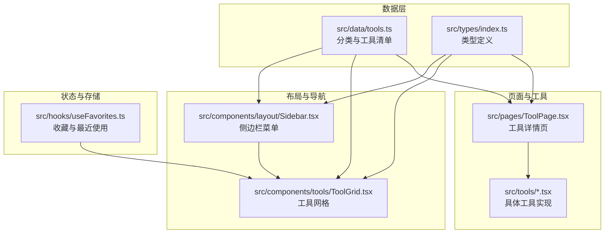

**图表来源**
- [src/data/tools.ts:1-316](file://src/data/tools.ts#L1-L316)
- [src/types/index.ts:1-37](file://src/types/index.ts#L1-L37)
- [src/components/layout/Sidebar.tsx:1-181](file://src/components/layout/Sidebar.tsx#L1-L181)
- [src/components/tools/ToolGrid.tsx:1-136](file://src/components/tools/ToolGrid.tsx#L1-L136)
- [src/pages/ToolPage.tsx:1-113](file://src/pages/ToolPage.tsx#L1-L113)
- [src/hooks/useFavorites.ts:1-71](file://src/hooks/useFavorites.ts#L1-L71)

**章节来源**
- [src/data/tools.ts:1-316](file://src/data/tools.ts#L1-L316)
- [src/types/index.ts:1-37](file://src/types/index.ts#L1-L37)
- [src/components/layout/Sidebar.tsx:1-181](file://src/components/layout/Sidebar.tsx#L1-L181)
- [src/components/tools/ToolGrid.tsx:1-136](file://src/components/tools/ToolGrid.tsx#L1-L136)
- [src/pages/ToolPage.tsx:1-113](file://src/pages/ToolPage.tsx#L1-L113)
- [src/hooks/useFavorites.ts:1-71](file://src/hooks/useFavorites.ts#L1-L71)

## 核心组件
- 分类与工具清单：集中定义六大分类及各工具的元数据（名称、描述、图标、标签、路径、分类标识等），并提供按分类过滤与全文检索函数。
- 类型系统：统一约束工具与分类的数据结构，确保分类枚举与工具分类字段一致。
- 侧边栏导航：根据分类动态生成菜单项，支持“全部工具”“我的收藏”“最近使用”快捷入口与管理员入口。
- 工具网格：根据当前激活分类或搜索条件渲染工具卡片，支持分组展示与空状态提示。
- 工具详情页：按工具 ID 动态加载对应工具组件，记录打开与执行日志。
- 收藏与最近使用：通过本地存储与后端接口维护用户偏好，支持收藏切换与最近使用列表。

**章节来源**
- [src/data/tools.ts:34-41](file://src/data/tools.ts#L34-L41)
- [src/data/tools.ts:43-301](file://src/data/tools.ts#L43-L301)
- [src/types/index.ts:3-27](file://src/types/index.ts#L3-L27)
- [src/components/layout/Sidebar.tsx:17-144](file://src/components/layout/Sidebar.tsx#L17-L144)
- [src/components/tools/ToolGrid.tsx:15-109](file://src/components/tools/ToolGrid.tsx#L15-L109)
- [src/pages/ToolPage.tsx:40-112](file://src/pages/ToolPage.tsx#L40-L112)
- [src/hooks/useFavorites.ts:16-70](file://src/hooks/useFavorites.ts#L16-L70)

## 架构总览
工具分类体系围绕“数据驱动 + 组件解耦”的设计展开：数据层提供分类与工具清单；类型层保证一致性；布局层负责导航与快捷入口；网格层负责展示与筛选；页面层负责工具加载与日志；状态层负责收藏与最近使用。

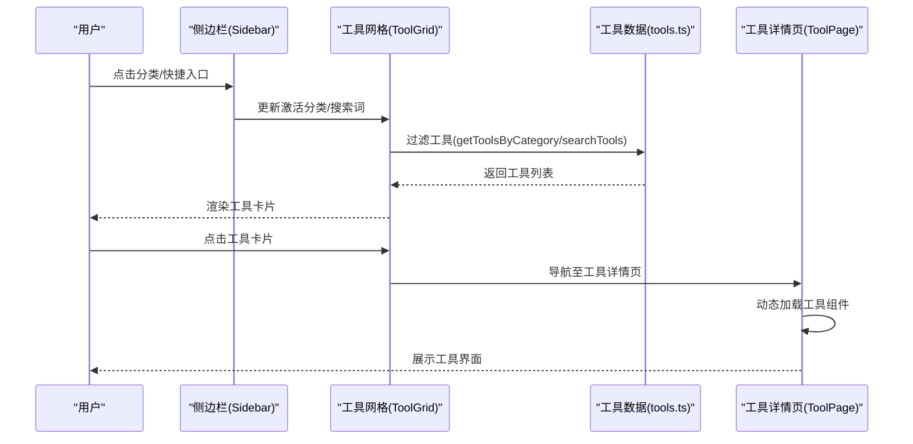

**图表来源**
- [src/components/layout/Sidebar.tsx:27-30](file://src/components/layout/Sidebar.tsx#L27-L30)
- [src/components/tools/ToolGrid.tsx:23-50](file://src/components/tools/ToolGrid.tsx#L23-L50)
- [src/data/tools.ts:303-315](file://src/data/tools.ts#L303-L315)
- [src/pages/ToolPage.tsx:40-64](file://src/pages/ToolPage.tsx#L40-L64)

## 详细组件分析

### 分类设计理念与组织原则
- 设计理念
  - 用户导向：以高频使用场景为依据划分分类，降低认知负担。
  - 语义清晰：每个分类聚焦一类工具的共同特征与用途边界。
  - 可扩展：通过统一的类型与数据结构，支持新增分类与工具。
- 组织原则
  - 分类枚举与工具分类字段强一致，避免运行时错误。
  - 工具元数据包含多维标签，便于搜索与推荐。
  - 图标与分类名成对出现，提升识别效率。

**章节来源**
- [src/types/index.ts:15-22](file://src/types/index.ts#L15-L22)
- [src/data/tools.ts:34-41](file://src/data/tools.ts#L34-L41)

### 六大工具分类详解

#### 图像工具
- 特点：以视觉与媒体处理为核心，强调直观的预览与导出能力。
- 包含工具类型：条码/二维码生成、图片压缩、图片转 Base64、库位码生成等。
- 适用场景：办公文档扫描、产品标签打印、素材优化与分享。
- 示例工具：条码生成器、二维码生成器、图片压缩、库位码生成。

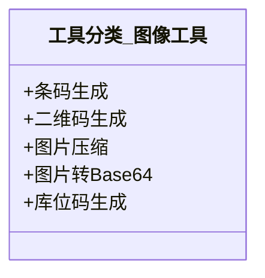

**图表来源**
- [src/data/tools.ts:163-211](file://src/data/tools.ts#L163-L211)

**章节来源**
- [src/data/tools.ts:163-211](file://src/data/tools.ts#L163-L211)
- [src/tools/BarcodeGenerator.tsx:49-99](file://src/tools/BarcodeGenerator.tsx#L49-L99)
- [src/tools/ImageCompress.tsx:7-100](file://src/tools/ImageCompress.tsx#L7-L100)

#### 开发工具
- 特点：面向开发者日常调试与辅助工作流，强调格式化、编解码与校验。
- 包含工具类型：JSON 格式化、Base64 编解码、正则测试、URL 编解码等。
- 适用场景：API 调试、配置文件处理、字符串与编码转换。
- 示例工具：JSON 格式化、Base64 编解码、正则测试、URL 编解码。

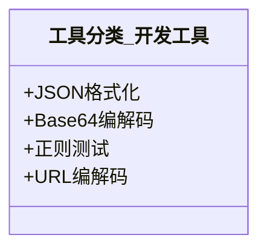

**图表来源**
- [src/data/tools.ts:43-82](file://src/data/tools.ts#L43-L82)

**章节来源**
- [src/data/tools.ts:43-82](file://src/data/tools.ts#L43-L82)
- [src/tools/JsonFormatter.tsx:8-75](file://src/tools/JsonFormatter.tsx#L8-L75)
- [src/tools/Base64Tool.tsx:8-63](file://src/tools/Base64Tool.tsx#L8-L63)

#### 转换工具
- 特点：跨格式与单位的转换，强调准确性与易用性。
- 包含工具类型：时间戳转换、进制转换、颜色转换、单位转换等。
- 适用场景：数据迁移、国际化与本地化、设计与工程协作。
- 示例工具：时间戳转换、进制转换、颜色转换、单位转换。

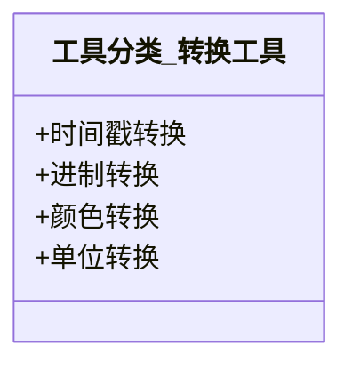

**图表来源**
- [src/data/tools.ts:84-122](file://src/data/tools.ts#L84-L122)

**章节来源**
- [src/data/tools.ts:84-122](file://src/data/tools.ts#L84-L122)
- [src/tools/ColorConverter.tsx:35-90](file://src/tools/ColorConverter.tsx#L35-L90)

#### 文本工具
- 特点：文本处理与编辑增强，强调对比、统计与安全。
- 包含工具类型：文本对比、Markdown 预览、文本加密、字数统计等。
- 适用场景：文档编写、代码审查、敏感信息保护与内容校对。
- 示例工具：文本对比、Markdown 预览、文本加密、字数统计。

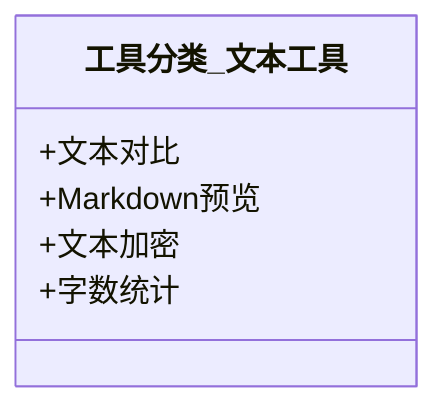

**图表来源**
- [src/data/tools.ts:124-161](file://src/data/tools.ts#L124-L161)

**章节来源**
- [src/data/tools.ts:124-161](file://src/data/tools.ts#L124-L161)
- [src/tools/TextEncrypt.tsx:29-85](file://src/tools/TextEncrypt.tsx#L29-L85)

#### 安全工具
- 特点：围绕身份、凭证与证书的安全相关能力，强调可靠性与合规。
- 包含工具类型：密码生成、Hash 计算、JWT 解析、证书查看等。
- 适用场景：账户安全、数据完整性校验、令牌调试与证书审计。
- 示例工具：密码生成、Hash 计算、JWT 解析、证书查看。

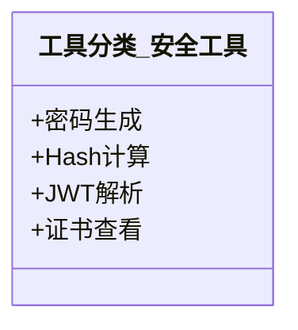

**图表来源**
- [src/data/tools.ts:213-251](file://src/data/tools.ts#L213-L251)

**章节来源**
- [src/data/tools.ts:213-251](file://src/data/tools.ts#L213-L251)
- [src/tools/HashCalculator.tsx:23-68](file://src/tools/HashCalculator.tsx#L23-L68)
- [src/tools/PasswordGenerator.tsx:28-83](file://src/tools/PasswordGenerator.tsx#L28-L83)

#### 网络工具
- 特点：网络诊断与性能评估，强调实时性与可视化。
- 包含工具类型：网速测试、IP 查询、HTTP 请求、DNS 查询、Ping 检测等。
- 适用场景：网络排障、带宽监控、服务可用性检测与地理定位。
- 示例工具：网速测试、IP 查询、HTTP 请求、DNS 查询、Ping 检测。

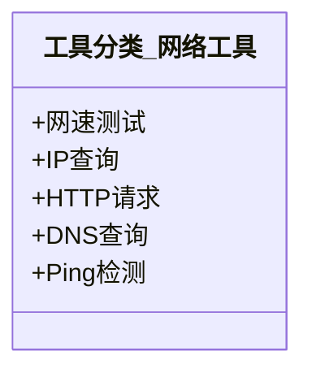

**图表来源**
- [src/data/tools.ts:253-300](file://src/data/tools.ts#L253-L300)

**章节来源**
- [src/data/tools.ts:253-300](file://src/data/tools.ts#L253-L300)
- [src/tools/SpeedTest.tsx:185-465](file://src/tools/SpeedTest.tsx#L185-L465)

### 分类图标系统设计
- 使用 Lucide React 图标库，确保风格统一与可维护性。
- 分类图标与工具图标均来自同一库，保持视觉一致性。
- 选择原则：语义明确、辨识度高、与工具功能高度相关；避免歧义与过度装饰。

**图表来源**
- [src/data/tools.ts:34-41](file://src/data/tools.ts#L34-L41)
- [src/components/layout/Sidebar.tsx:120-128](file://src/components/layout/Sidebar.tsx#L120-L128)
- [src/components/tools/ToolGrid.tsx:70-76](file://src/components/tools/ToolGrid.tsx#L70-L76)

**章节来源**
- [src/data/tools.ts:31-31](file://src/data/tools.ts#L31-L31)
- [src/data/tools.ts:34-41](file://src/data/tools.ts#L34-L41)
- [src/components/layout/Sidebar.tsx:120-128](file://src/components/layout/Sidebar.tsx#L120-L128)
- [src/components/tools/ToolGrid.tsx:70-76](file://src/components/tools/ToolGrid.tsx#L70-L76)

### 前端导航与筛选实现
- 侧边栏菜单生成：遍历分类数组，动态渲染分类项，点击切换激活分类。
- 分类筛选：工具网格根据激活分类过滤工具；“全部工具”“我的收藏”“最近使用”提供快捷入口。
- 搜索功能：全文检索工具名称、描述与标签，实时更新展示列表。
- 收藏与最近使用：通过 Hook 维护收藏集合与最近使用队列，支持本地持久化与后端同步。

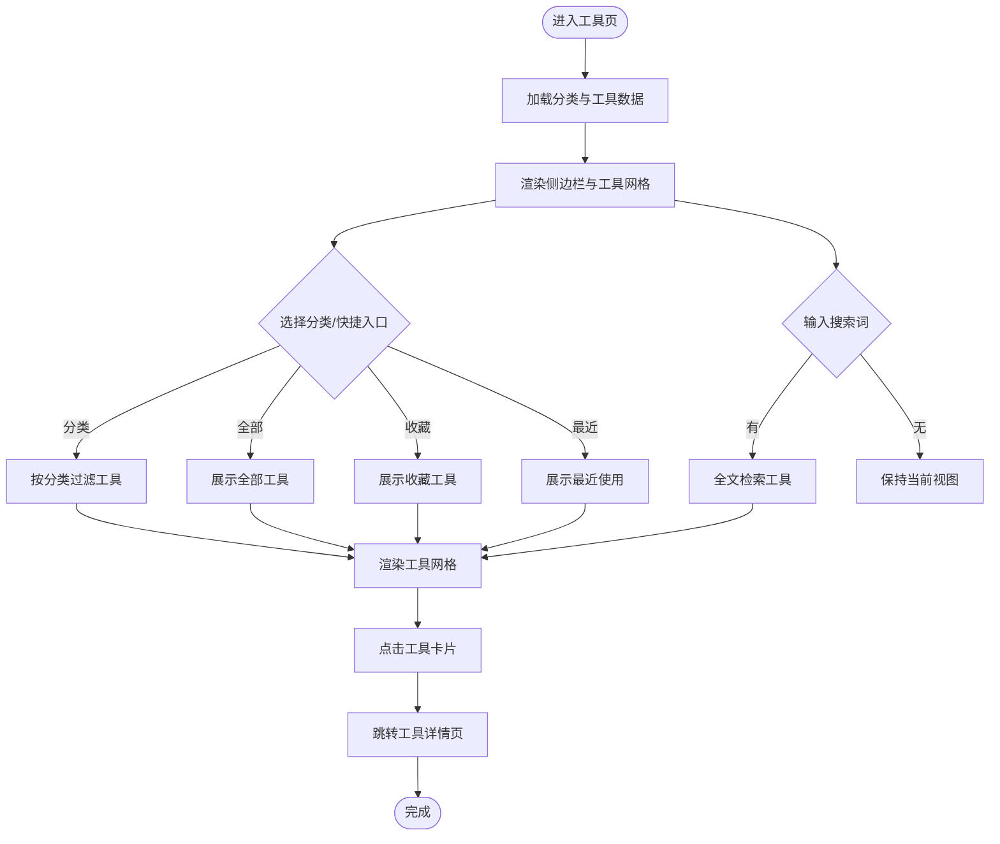

**图表来源**
- [src/components/layout/Sidebar.tsx:17-144](file://src/components/layout/Sidebar.tsx#L17-L144)
- [src/components/tools/ToolGrid.tsx:15-109](file://src/components/tools/ToolGrid.tsx#L15-L109)
- [src/data/tools.ts:303-315](file://src/data/tools.ts#L303-L315)
- [src/hooks/useFavorites.ts:16-70](file://src/hooks/useFavorites.ts#L16-L70)

**章节来源**
- [src/components/layout/Sidebar.tsx:17-144](file://src/components/layout/Sidebar.tsx#L17-L144)
- [src/components/tools/ToolGrid.tsx:15-109](file://src/components/tools/ToolGrid.tsx#L15-L109)
- [src/data/tools.ts:303-315](file://src/data/tools.ts#L303-L315)
- [src/hooks/useFavorites.ts:16-70](file://src/hooks/useFavorites.ts#L16-L70)

### 工具详情页与动态加载
- 工具详情页根据路由参数查找工具元数据，动态加载对应工具组件，实现按需加载与懒加载。
- 页面头部展示工具图标、名称、描述与徽标（如 NEW/HOT），并记录打开日志。

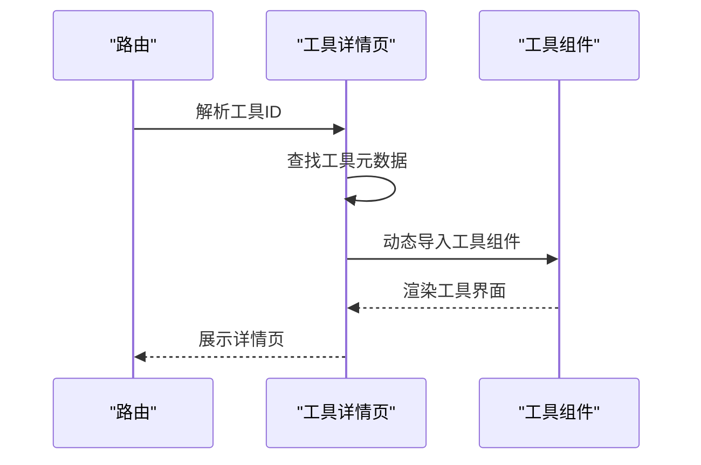

**图表来源**
- [src/pages/ToolPage.tsx:40-112](file://src/pages/ToolPage.tsx#L40-L112)

**章节来源**
- [src/pages/ToolPage.tsx:40-112](file://src/pages/ToolPage.tsx#L40-L112)

### 具体工具示例（算法与流程）
- 网速测试：包含延迟探测、下载/上传速率测量与节点选择逻辑，具备进度可视化与结果分级展示。
- 条码生成：调用第三方 API 生成 Code128 条码，支持配文字与下载。
- 颜色转换：实现 HEX/RGB/HSL 的相互转换与复制功能。
- Hash 计算：基于 Web Crypto API 计算 SHA-256/SHA-1，兼容 MD5 占位。
- 文本加密：演示性 XOR 加密/解密，支持密钥与 Base64 输出。

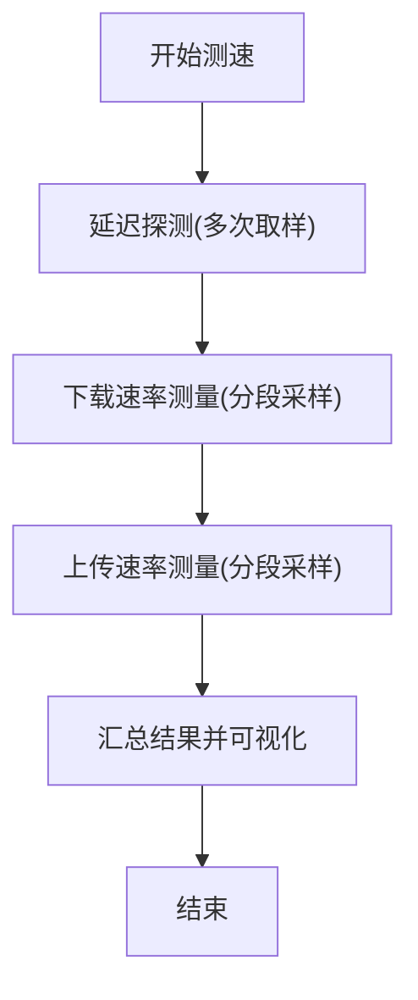

**图表来源**
- [src/tools/SpeedTest.tsx:69-183](file://src/tools/SpeedTest.tsx#L69-L183)

**章节来源**
- [src/tools/SpeedTest.tsx:185-465](file://src/tools/SpeedTest.tsx#L185-L465)
- [src/tools/BarcodeGenerator.tsx:49-99](file://src/tools/BarcodeGenerator.tsx#L49-L99)
- [src/tools/ColorConverter.tsx:35-90](file://src/tools/ColorConverter.tsx#L35-L90)
- [src/tools/HashCalculator.tsx:23-68](file://src/tools/HashCalculator.tsx#L23-L68)
- [src/tools/TextEncrypt.tsx:29-85](file://src/tools/TextEncrypt.tsx#L29-L85)

## 依赖关系分析
- 依赖 Lucide React 提供统一图标资源，确保分类与工具图标风格一致。
- 工具数据与类型定义解耦，便于扩展与维护。
- 侧边栏与工具网格共享分类与工具数据，形成清晰的数据流向。

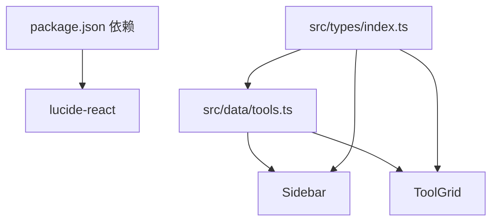

**图表来源**
- [package.json:11-22](file://package.json#L11-L22)
- [src/data/tools.ts:1-316](file://src/data/tools.ts#L1-L316)
- [src/types/index.ts:1-37](file://src/types/index.ts#L1-L37)
- [src/components/layout/Sidebar.tsx:1-181](file://src/components/layout/Sidebar.tsx#L1-L181)
- [src/components/tools/ToolGrid.tsx:1-136](file://src/components/tools/ToolGrid.tsx#L1-L136)

**章节来源**
- [package.json:11-22](file://package.json#L11-L22)
- [src/data/tools.ts:1-316](file://src/data/tools.ts#L1-L316)
- [src/types/index.ts:1-37](file://src/types/index.ts#L1-L37)

## 性能考虑
- 按需加载：工具详情页采用动态导入与懒加载，减少初始包体与首屏阻塞。
- 列表渲染：工具网格支持分组展示与空状态，避免大量 DOM 渲染造成的卡顿。
- 搜索与过滤：前端轻量过滤与全文检索，建议控制工具数量规模或引入服务端搜索以提升大体量场景下的体验。
- 图标与资源：统一使用轻量图标库，避免重复引入导致的体积膨胀。

## 故障排查指南
- 工具未找到：检查工具 ID 是否存在于工具清单，确认路由参数与工具路径一致。
- 分类不显示：确认分类枚举与工具分类字段一致，检查图标是否正确导入。
- 收藏/最近使用异常：检查本地存储键值与后端接口状态，确认用户 ID 有效。
- 网速测试失败：检查网络访问权限与第三方 API 可达性，关注超时与 CORS 配置。

**章节来源**
- [src/pages/ToolPage.tsx:50-60](file://src/pages/ToolPage.tsx#L50-L60)
- [src/hooks/useFavorites.ts:16-32](file://src/hooks/useFavorites.ts#L16-L32)

## 结论
该工具分类体系以清晰的分类边界、统一的图标系统与完善的前端导航实现为基础，结合动态加载与搜索能力，为用户提供高效、直观的工具使用体验。通过类型约束与数据驱动的设计，体系具备良好的可扩展性与可维护性，适合持续迭代与功能拓展。

## 附录

### 分类扩展指南
- 新增分类
  - 在类型定义中扩展分类枚举，确保与工具分类字段一致。
  - 在分类数据中新增分类项，指定唯一 id、中文名称与对应图标。
  - 在工具清单中为新分类工具设置 category 字段与图标。
- 新增工具
  - 在工具清单中添加新工具条目，填写元数据与分类标识。
  - 创建对应工具组件，遵循现有交互模式与图标使用规范。
  - 在工具详情页映射表中注册组件，确保动态加载生效。
- 维护完整性
  - 定期核对分类枚举与工具分类字段，避免拼写错误与遗漏。
  - 保持图标与功能语义一致，避免误导用户。
  - 对搜索关键词与标签进行规范化管理，提升检索质量。

**章节来源**
- [src/types/index.ts:15-27](file://src/types/index.ts#L15-L27)
- [src/data/tools.ts:34-41](file://src/data/tools.ts#L34-L41)
- [src/data/tools.ts:43-301](file://src/data/tools.ts#L43-L301)
- [src/pages/ToolPage.tsx:11-38](file://src/pages/ToolPage.tsx#L11-L38)