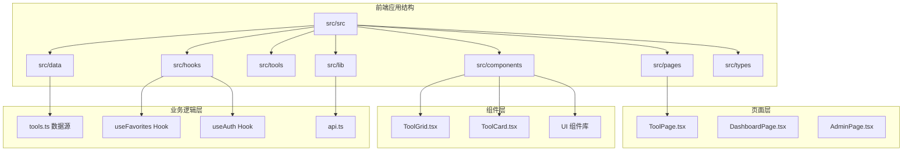
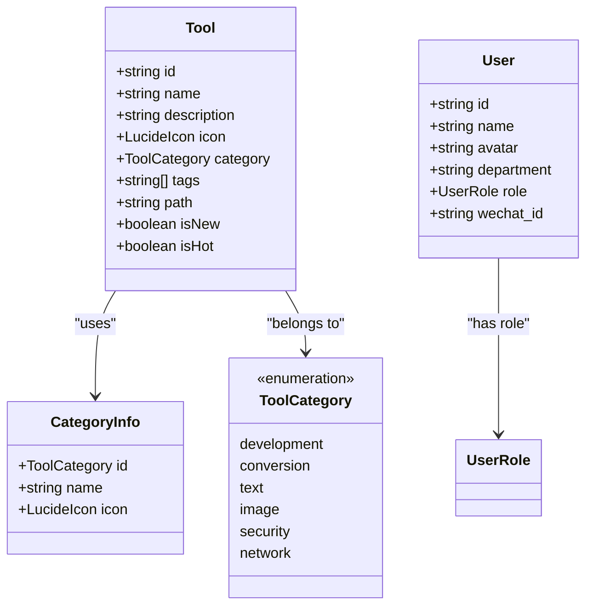
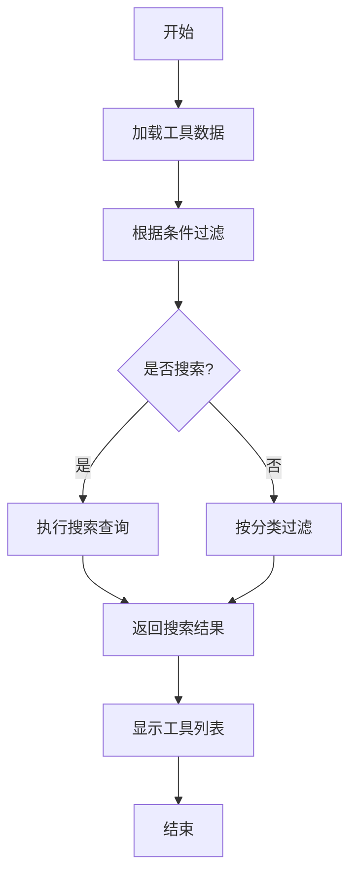
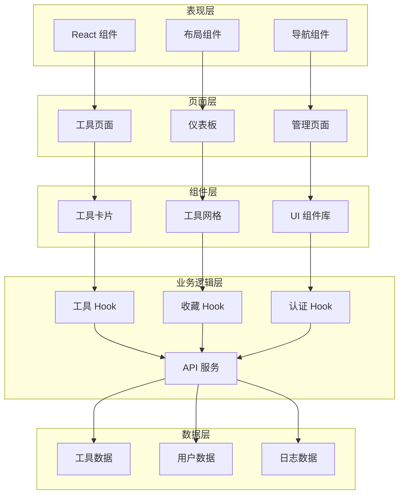
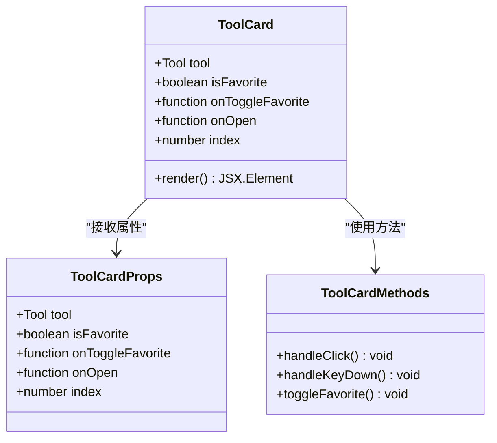
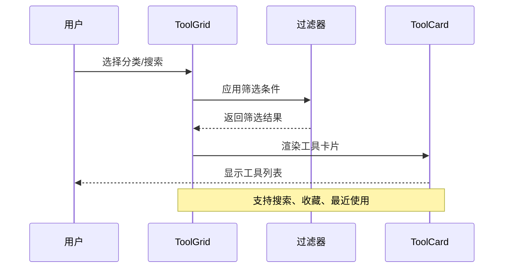
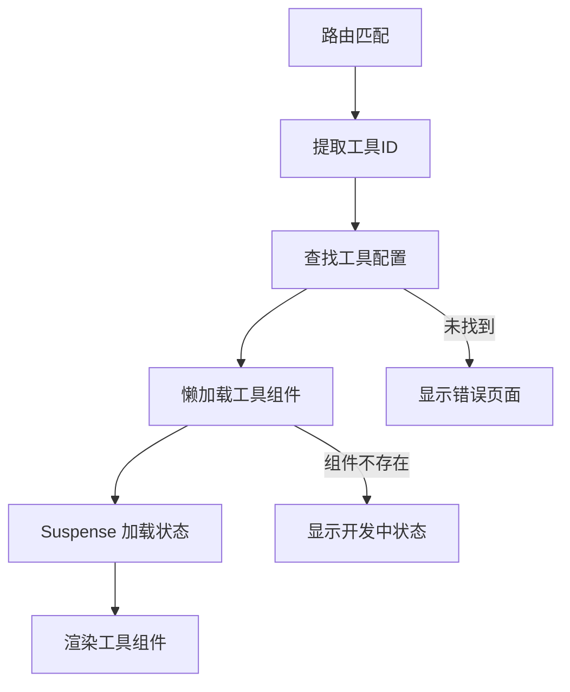
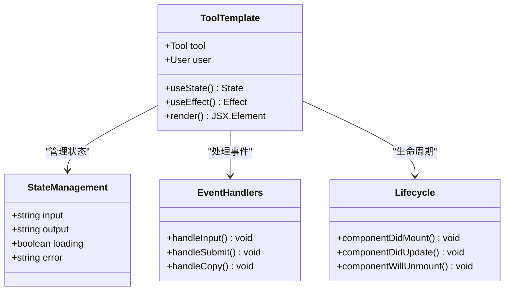
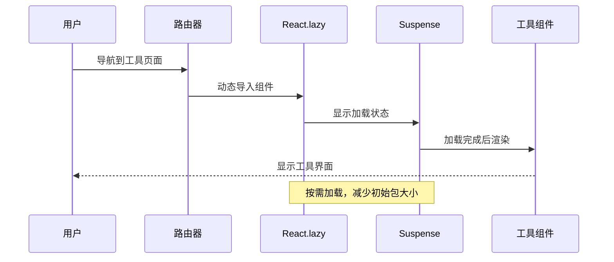
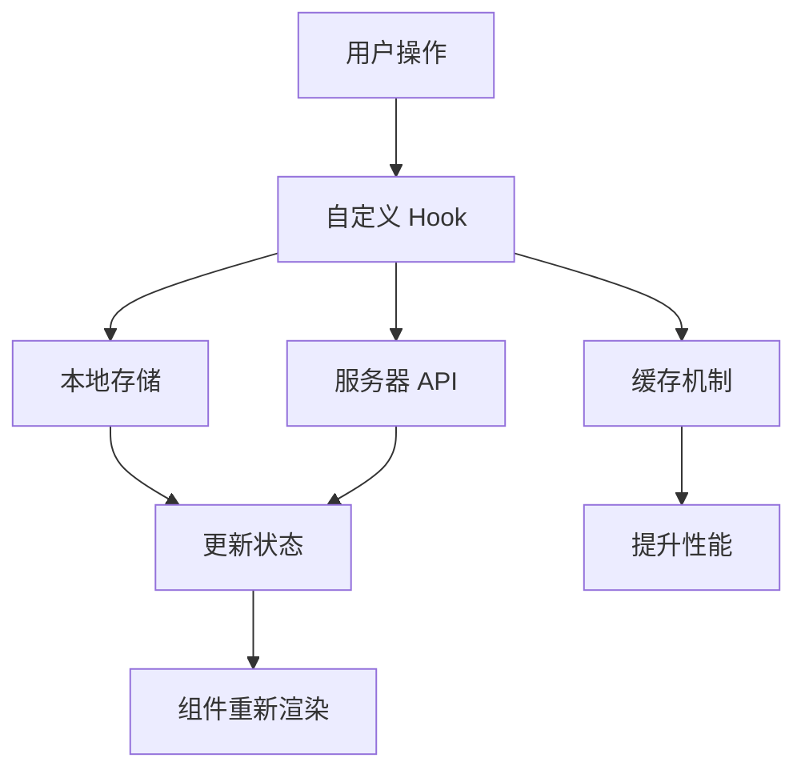

# 工具开发指南

<cite>
**本文档引用的文件**
- [src/tools/BarcodeGenerator.tsx](file://src/tools/BarcodeGenerator.tsx)
- [src/tools/Base64Tool.tsx](file://src/tools/Base64Tool.tsx)
- [src/tools/JsonFormatter.tsx](file://src/tools/JsonFormatter.tsx)
- [src/tools/PasswordGenerator.tsx](file://src/tools/PasswordGenerator.tsx)
- [src/components/tools/ToolCard.tsx](file://src/components/tools/ToolCard.tsx)
- [src/components/tools/ToolGrid.tsx](file://src/components/tools/ToolGrid.tsx)
- [src/data/tools.ts](file://src/data/tools.ts)
- [src/pages/ToolPage.tsx](file://src/pages/ToolPage.tsx)
- [src/lib/api.ts](file://src/lib/api.ts)
- [src/hooks/useFavorites.ts](file://src/hooks/useFavorites.ts)
- [src/hooks/useAuth.ts](file://src/hooks/useAuth.ts)
- [src/types/index.ts](file://src/types/index.ts)
- [vite.config.ts](file://vite.config.ts)
- [package.json](file://package.json)
</cite>

## 目录
1. [简介](#简介)
2. [项目结构](#项目结构)
3. [核心组件](#核心组件)
4. [架构概览](#架构概览)
5. [详细组件分析](#详细组件分析)
6. [依赖关系分析](#依赖关系分析)
7. [性能考虑](#性能考虑)
8. [故障排除指南](#故障排除指南)
9. [结论](#结论)
10. [附录](#附录)

## 简介

本指南面向工具开发者，提供完整的工具组件开发标准模板和最佳实践。项目采用 React + TypeScript 架构，实现了丰富的工具集合，包括开发工具、转换工具、文本工具、图像工具、安全工具和网络工具六大类别。

该系统的核心特点包括：
- **模块化设计**：每个工具都是独立的 React 组件
- **懒加载机制**：通过 React.lazy 实现按需加载
- **统一的状态管理**：使用自定义 Hook 管理收藏和用户状态
- **响应式 UI 设计**：基于 Tailwind CSS 的现代化界面
- **类型安全**：完整的 TypeScript 类型定义

## 项目结构

项目采用清晰的分层架构，主要目录结构如下：



**图表来源**
- [src/pages/ToolPage.tsx:1-113](file://src/pages/ToolPage.tsx#L1-L113)
- [src/components/tools/ToolGrid.tsx:1-136](file://src/components/tools/ToolGrid.tsx#L1-L136)
- [src/components/tools/ToolCard.tsx:1-66](file://src/components/tools/ToolCard.tsx#L1-L66)

**章节来源**
- [src/pages/ToolPage.tsx:1-113](file://src/pages/ToolPage.tsx#L1-L113)
- [src/components/tools/ToolGrid.tsx:1-136](file://src/components/tools/ToolGrid.tsx#L1-L136)
- [src/components/tools/ToolCard.tsx:1-66](file://src/components/tools/ToolCard.tsx#L1-L66)

## 核心组件

### 工具类型定义

项目定义了完整的工具类型系统，确保类型安全和开发体验：



**图表来源**
- [src/types/index.ts:3-37](file://src/types/index.ts#L3-L37)

### 工具数据管理

工具数据通过集中管理的方式维护，支持分类、搜索和标签功能：



**图表来源**
- [src/data/tools.ts:303-316](file://src/data/tools.ts#L303-L316)

**章节来源**
- [src/types/index.ts:1-37](file://src/types/index.ts#L1-L37)
- [src/data/tools.ts:1-316](file://src/data/tools.ts#L1-L316)

## 架构概览

系统采用分层架构设计，实现了清晰的关注点分离：



**图表来源**
- [src/pages/ToolPage.tsx:1-113](file://src/pages/ToolPage.tsx#L1-L113)
- [src/components/tools/ToolGrid.tsx:1-136](file://src/components/tools/ToolGrid.tsx#L1-L136)
- [src/components/tools/ToolCard.tsx:1-66](file://src/components/tools/ToolCard.tsx#L1-L66)

## 详细组件分析

### ToolCard 组件分析

ToolCard 是工具展示的核心组件，提供了完整的交互体验：



**图表来源**
- [src/components/tools/ToolCard.tsx:6-12](file://src/components/tools/ToolCard.tsx#L6-L12)

#### 组件特性

1. **动画效果**：支持淡入动画和延迟效果
2. **收藏功能**：星标按钮支持收藏切换
3. **状态指示**：NEW 和 HOT 标签显示
4. **键盘导航**：支持 Enter 键激活

**章节来源**
- [src/components/tools/ToolCard.tsx:1-66](file://src/components/tools/ToolCard.tsx#L1-L66)

### ToolGrid 组件分析

ToolGrid 提供了工具的网格展示和筛选功能：



**图表来源**
- [src/components/tools/ToolGrid.tsx:15-50](file://src/components/tools/ToolGrid.tsx#L15-L50)

#### 筛选逻辑

组件支持多种筛选模式：
- **全部工具**：显示所有可用工具
- **分类筛选**：按类别显示工具
- **搜索功能**：支持名称、描述、标签搜索
- **收藏功能**：显示用户收藏的工具
- **最近使用**：显示最近访问的工具

**章节来源**
- [src/components/tools/ToolGrid.tsx:1-136](file://src/components/tools/ToolGrid.tsx#L1-L136)

### 工具页面路由系统

工具页面采用动态路由和懒加载机制：



**图表来源**
- [src/pages/ToolPage.tsx:40-70](file://src/pages/ToolPage.tsx#L40-L70)

**章节来源**
- [src/pages/ToolPage.tsx:1-113](file://src/pages/ToolPage.tsx#L1-L113)

### 工具组件开发模板

以下是一个标准的工具组件开发模板：



**图表来源**
- [src/tools/Base64Tool.tsx:8-31](file://src/tools/Base64Tool.tsx#L8-L31)
- [src/tools/JsonFormatter.tsx:8-42](file://src/tools/JsonFormatter.tsx#L8-L42)

## 依赖关系分析

系统依赖关系清晰，遵循单一职责原则：

```mermaid
graph TB
subgraph "外部依赖"
REACT[react ^18.3.1]
ROUTER[react-router-dom ^7.1.1]
LUCIDE[lucide-react ^0.468.0]
TAILWIND[tailwindcss ^3.4.17]
end
subgraph "内部模块"
TYPES[types/index.ts]
API[lib/api.ts]
HOOKS[hooks/*]
COMPONENTS[components/*]
TOOLS[tools/*]
DATA[data/tools.ts]
end
subgraph "构建工具"
VITE[vite ^6.0.5]
TS[typescript ~5.6.2]
PLUGIN[@vitejs/plugin-react ^4.3.4]
end
TYPES --> API
API --> HOOKS
HOOKS --> COMPONENTS
COMPONENTS --> TOOLS
DATA --> COMPONENTS
DATA --> TOOLS
REACT --> TYPES
ROUTER --> COMPONENTS
LUCIDE --> COMPONENTS
TAILWIND --> COMPONENTS
VITE --> BUILD[构建产物]
TS --> BUILD
PLUGIN --> BUILD
```

**图表来源**
- [package.json:11-32](file://package.json#L11-L32)
- [vite.config.ts:1-21](file://vite.config.ts#L1-L21)

**章节来源**
- [package.json:1-34](file://package.json#L1-L34)
- [vite.config.ts:1-21](file://vite.config.ts#L1-L21)

## 性能考虑

### 懒加载机制实现

项目采用 React.lazy 和 Suspense 实现高效的懒加载：



**图表来源**
- [src/pages/ToolPage.tsx:3-38](file://src/pages/ToolPage.tsx#L3-L38)

### 状态管理优化

使用自定义 Hook 优化状态管理：



**图表来源**
- [src/hooks/useFavorites.ts:16-70](file://src/hooks/useFavorites.ts#L16-L70)
- [src/hooks/useAuth.ts:20-89](file://src/hooks/useAuth.ts#L20-L89)

### 性能优化策略

1. **代码分割**：按路由进行代码分割
2. **懒加载**：工具组件按需加载
3. **状态缓存**：本地存储常用数据
4. **虚拟滚动**：大量数据时使用虚拟滚动
5. **防抖节流**：搜索和输入事件优化

**章节来源**
- [src/pages/ToolPage.tsx:3-38](file://src/pages/ToolPage.tsx#L3-L38)
- [src/hooks/useFavorites.ts:1-71](file://src/hooks/useFavorites.ts#L1-L71)
- [src/hooks/useAuth.ts:1-89](file://src/hooks/useAuth.ts#L1-L89)

## 故障排除指南

### 常见问题及解决方案

#### 工具组件加载失败

**问题症状**：工具页面显示"工具功能正在开发中"

**可能原因**：
1. 工具组件未正确注册到路由映射
2. 组件文件路径错误
3. 组件导出格式不正确

**解决步骤**：
1. 检查 `toolComponents` 映射表中的组件注册
2. 验证组件文件路径是否正确
3. 确认组件默认导出格式

#### 收藏功能异常

**问题症状**：收藏按钮无法正常切换

**可能原因**：
1. 用户未登录
2. API 请求失败
3. 本地存储权限问题

**解决步骤**：
1. 检查用户认证状态
2. 验证 API 服务可用性
3. 测试本地存储功能

#### 搜索功能失效

**问题症状**：搜索框无响应或无结果

**可能原因**：
1. 搜索算法问题
2. 数据源加载失败
3. 输入处理异常

**解决步骤**：
1. 检查 `searchTools` 函数实现
2. 验证工具数据完整性
3. 测试输入事件处理

**章节来源**
- [src/pages/ToolPage.tsx:11-38](file://src/pages/ToolPage.tsx#L11-L38)
- [src/hooks/useFavorites.ts:34-53](file://src/hooks/useFavorites.ts#L34-L53)
- [src/data/tools.ts:307-316](file://src/data/tools.ts#L307-L316)

### 调试技巧

1. **浏览器开发者工具**：使用 React DevTools 检查组件树
2. **网络面板**：监控 API 请求状态
3. **控制台日志**：添加必要的调试信息
4. **状态检查**：验证 Hook 状态更新
5. **性能分析**：使用性能面板识别瓶颈

## 结论

本工具开发指南提供了完整的开发框架和最佳实践。通过遵循本文档的指导，开发者可以：

- 快速创建符合项目标准的工具组件
- 理解系统的架构设计和数据流
- 实现高性能的懒加载机制
- 建立一致的 UI 设计规范
- 有效管理组件状态和生命周期

建议在开发新工具时：
1. 参考现有工具组件的实现模式
2. 遵循类型安全的开发规范
3. 重视用户体验和性能优化
4. 充分测试各种边界情况
5. 保持代码的可维护性和可扩展性

## 附录

### 新工具开发流程

#### 第一步：工具注册
1. 在 `src/data/tools.ts` 中添加工具配置
2. 定义工具的元数据（名称、描述、图标、分类）
3. 设置工具的路由路径

#### 第二步：组件创建
1. 创建新的工具组件文件
2. 实现标准的 props 接口
3. 处理用户状态和工具状态
4. 实现必要的事件处理器

#### 第三步：UI 设计
1. 使用现有的 UI 组件库
2. 遵循工具卡片的设计规范
3. 实现响应式布局
4. 添加适当的交互反馈

#### 第四步：功能实现
1. 实现核心业务逻辑
2. 集成 API 服务调用
3. 处理错误和异常情况
4. 优化性能和用户体验

#### 第五步：测试和部署
1. 进行单元测试和集成测试
2. 验证不同设备和浏览器兼容性
3. 性能基准测试
4. 部署到生产环境

### 最佳实践清单

- **类型安全**：始终使用 TypeScript 类型定义
- **错误处理**：实现完善的错误处理机制
- **性能优化**：使用懒加载和状态缓存
- **用户体验**：提供清晰的反馈和加载状态
- **代码质量**：保持代码简洁和可读性
- **测试覆盖**：编写充分的测试用例
- **文档维护**：及时更新相关文档