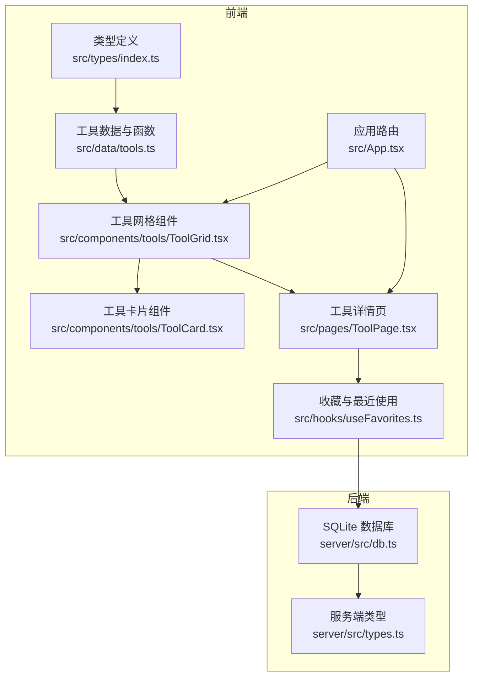
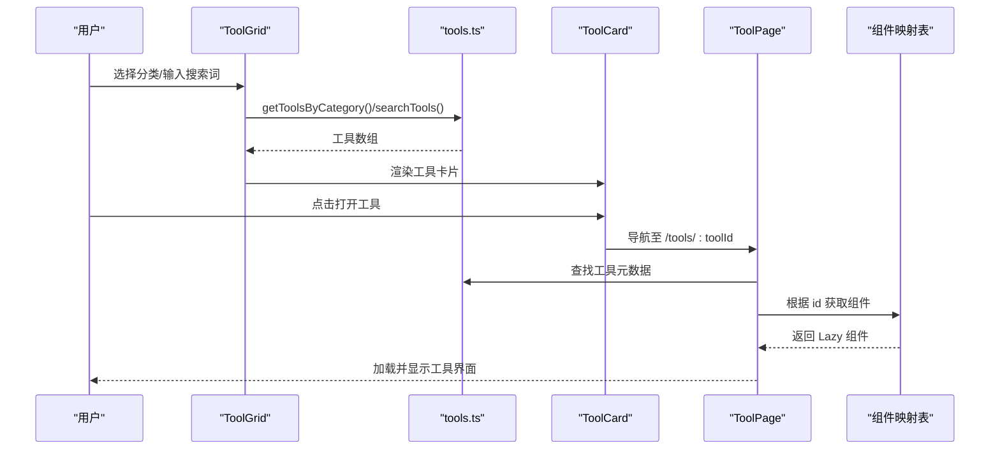
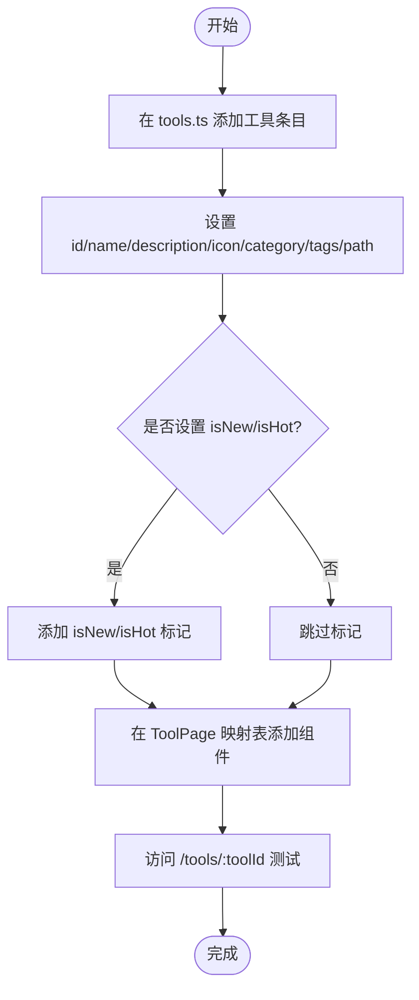
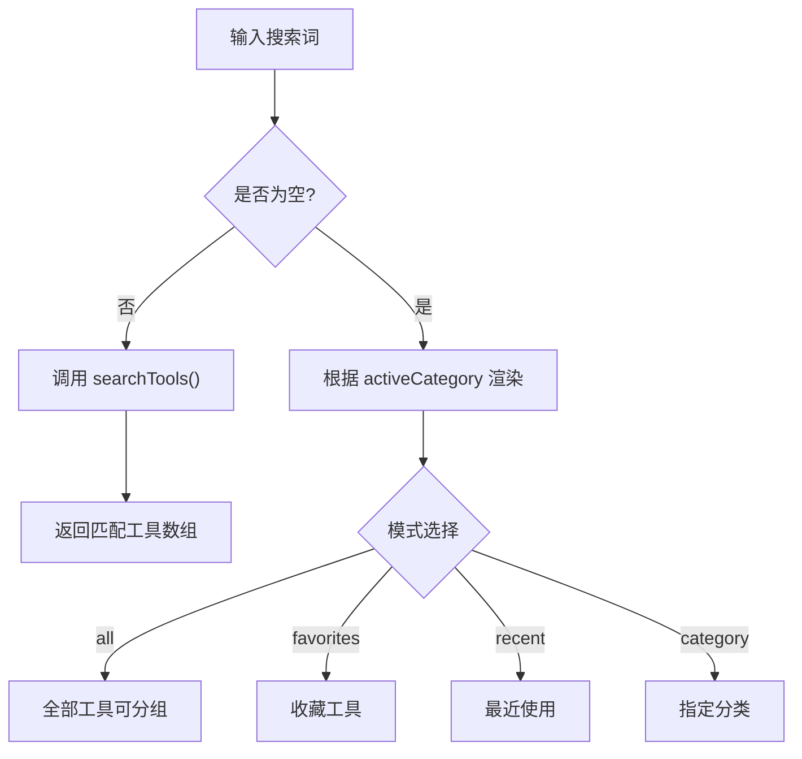
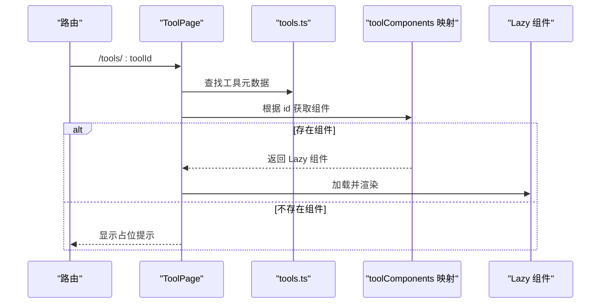
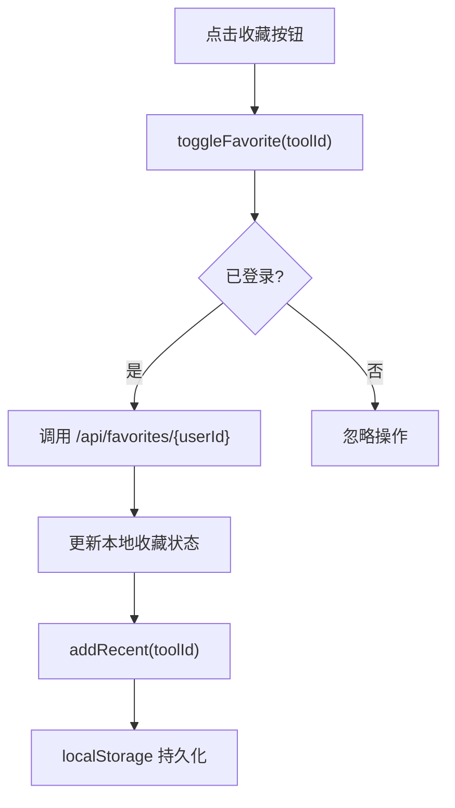
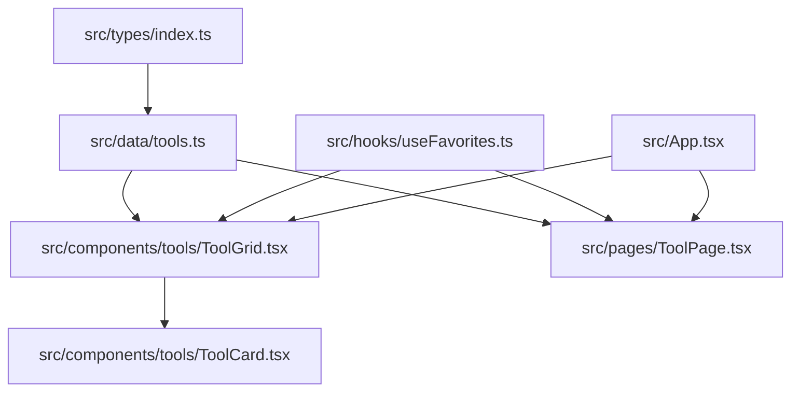

# 工具注册机制

<cite>
**本文引用的文件**
- [src/data/tools.ts](file://src/data/tools.ts)
- [src/types/index.ts](file://src/types/index.ts)
- [src/components/tools/ToolCard.tsx](file://src/components/tools/ToolCard.tsx)
- [src/components/tools/ToolGrid.tsx](file://src/components/tools/ToolGrid.tsx)
- [src/pages/ToolPage.tsx](file://src/pages/ToolPage.tsx)
- [src/hooks/useFavorites.ts](file://src/hooks/useFavorites.ts)
- [src/App.tsx](file://src/App.tsx)
- [src/tools/JsonFormatter.tsx](file://src/tools/JsonFormatter.tsx)
- [src/tools/Base64Tool.tsx](file://src/tools/Base64Tool.tsx)
- [server/src/db.ts](file://server/src/db.ts)
- [server/src/types.ts](file://server/src/types.ts)
</cite>

## 目录
1. [简介](#简介)
2. [项目结构](#项目结构)
3. [核心组件](#核心组件)
4. [架构总览](#架构总览)
5. [详细组件分析](#详细组件分析)
6. [依赖关系分析](#依赖关系分析)
7. [性能考虑](#性能考虑)
8. [故障排除指南](#故障排除指南)
9. [结论](#结论)
10. [附录](#附录)

## 简介
本文件系统性阐述 AnyTools 工具注册机制，涵盖工具元数据结构、注册流程、分类系统、搜索与过滤机制，以及最佳实践与常见错误处理。通过源码级分析，帮助开发者快速理解并扩展工具生态。

## 项目结构
工具注册机制主要分布在以下模块：
- 元数据与类型定义：src/types/index.ts（工具接口与分类类型）
- 工具清单与分类：src/data/tools.ts（工具数组、分类数组、搜索与过滤函数）
- 展示层：src/components/tools/ToolCard.tsx、src/components/tools/ToolGrid.tsx
- 页面层：src/pages/ToolPage.tsx（路由与动态组件映射）
- 收藏与最近使用：src/hooks/useFavorites.ts
- 应用路由：src/App.tsx
- 工具实现示例：src/tools/*.tsx
- 服务端数据库与类型：server/src/db.ts、server/src/types.ts



图表来源
- [src/types/index.ts:1-37](file://src/types/index.ts#L1-L37)
- [src/data/tools.ts:1-316](file://src/data/tools.ts#L1-L316)
- [src/components/tools/ToolCard.tsx:1-66](file://src/components/tools/ToolCard.tsx#L1-L66)
- [src/components/tools/ToolGrid.tsx:1-136](file://src/components/tools/ToolGrid.tsx#L1-L136)
- [src/pages/ToolPage.tsx:1-113](file://src/pages/ToolPage.tsx#L1-L113)
- [src/hooks/useFavorites.ts:1-71](file://src/hooks/useFavorites.ts#L1-L71)
- [src/App.tsx:1-63](file://src/App.tsx#L1-L63)
- [server/src/db.ts:1-126](file://server/src/db.ts#L1-L126)
- [server/src/types.ts:1-46](file://server/src/types.ts#L1-L46)

章节来源
- [src/types/index.ts:1-37](file://src/types/index.ts#L1-L37)
- [src/data/tools.ts:1-316](file://src/data/tools.ts#L1-L316)
- [src/components/tools/ToolCard.tsx:1-66](file://src/components/tools/ToolCard.tsx#L1-L66)
- [src/components/tools/ToolGrid.tsx:1-136](file://src/components/tools/ToolGrid.tsx#L1-L136)
- [src/pages/ToolPage.tsx:1-113](file://src/pages/ToolPage.tsx#L1-L113)
- [src/hooks/useFavorites.ts:1-71](file://src/hooks/useFavorites.ts#L1-L71)
- [src/App.tsx:1-63](file://src/App.tsx#L1-L63)
- [server/src/db.ts:1-126](file://server/src/db.ts#L1-L126)
- [server/src/types.ts:1-46](file://server/src/types.ts#L1-L46)

## 核心组件
- 工具元数据结构：Tool 接口定义了工具的标识、名称、描述、图标、分类、标签、路由路径及状态标记（isNew、isHot）。
- 分类系统：CategoryInfo 描述分类的标识、显示名与图标；ToolCategory 是分类枚举。
- 工具注册入口：tools.ts 提供工具数组、分类数组以及按分类筛选和全文搜索函数。
- 组件展示：ToolGrid 根据当前视图（全部、分类、收藏、最近、搜索）聚合工具并渲染 ToolCard。
- 动态路由与组件映射：ToolPage 依据路由参数查找工具元数据，并通过映射表动态加载对应工具组件。
- 收藏与最近使用：useFavorites 提供收藏状态同步与本地最近使用记录管理。

章节来源
- [src/types/index.ts:3-27](file://src/types/index.ts#L3-L27)
- [src/data/tools.ts:34-41](file://src/data/tools.ts#L34-L41)
- [src/data/tools.ts:43-301](file://src/data/tools.ts#L43-L301)
- [src/components/tools/ToolGrid.tsx:15-50](file://src/components/tools/ToolGrid.tsx#L15-L50)
- [src/pages/ToolPage.tsx:11-38](file://src/pages/ToolPage.tsx#L11-L38)
- [src/hooks/useFavorites.ts:16-70](file://src/hooks/useFavorites.ts#L16-L70)

## 架构总览
工具注册机制采用“声明式元数据 + 运行时动态映射”的设计：
- 元数据集中管理：所有工具在 tools.ts 中以对象数组形式声明，包含分类、标签、路由路径等。
- 分类与搜索：通过 getToolsByCategory 与 searchTools 实现分类筛选与全文检索。
- 展示与交互：ToolGrid 负责根据用户选择与搜索状态渲染工具列表；ToolCard 渲染单个工具卡片并支持收藏与打开。
- 路由与组件：ToolPage 通过路由参数定位工具，再从映射表加载对应工具组件，实现按需加载。
- 状态与持久化：useFavorites 同步远端收藏并维护本地最近使用列表，提升用户体验。



图表来源
- [src/components/tools/ToolGrid.tsx:27-50](file://src/components/tools/ToolGrid.tsx#L27-L50)
- [src/data/tools.ts:303-315](file://src/data/tools.ts#L303-L315)
- [src/components/tools/ToolCard.tsx:14-27](file://src/components/tools/ToolCard.tsx#L14-L27)
- [src/pages/ToolPage.tsx:40-61](file://src/pages/ToolPage.tsx#L40-L61)
- [src/pages/ToolPage.tsx:11-38](file://src/pages/ToolPage.tsx#L11-L38)

## 详细组件分析

### 工具元数据结构与约束
- Tool 接口字段
  - id：工具唯一标识，用于路由参数与组件映射键值。
  - name：工具显示名称。
  - description：工具简要描述。
  - icon：Lucide 图标类型，用于卡片与详情页展示。
  - category：必须属于 ToolCategory 枚举，决定分类归属。
  - tags：字符串数组，用于搜索与过滤。
  - path：工具页面路由路径前缀，便于统一管理。
  - isNew：可选布尔值，用于在卡片上展示“NEW”徽章。
  - isHot：可选布尔值，用于在卡片上展示“HOT”徽章。
- CategoryInfo 结构
  - id：ToolCategory 类型，与 Tool.category 对应。
  - name：分类显示名称。
  - icon：分类对应的 Lucide 图标。
- ToolCategory 枚举
  - development、conversion、text、image、security、network。

```mermaid
classDiagram
class Tool {
+string id
+string name
+string description
+LucideIcon icon
+ToolCategory category
+string[] tags
+string path
+boolean isNew?
+boolean isHot?
}
class CategoryInfo {
+ToolCategory id
+string name
+LucideIcon icon
}
class ToolCategory {
<<enumeration>>
"development"
"conversion"
"text"
"image"
"security"
"network"
}
Tool --> ToolCategory : "使用"
CategoryInfo --> ToolCategory : "标识"
```

图表来源
- [src/types/index.ts:3-27](file://src/types/index.ts#L3-L27)

章节来源
- [src/types/index.ts:3-27](file://src/types/index.ts#L3-L27)

### 工具注册流程
- 在 tools.ts 中新增工具条目
  - 将新工具对象加入 tools 数组，确保 id 唯一且与路由路径一致。
  - 选择合适的 category，确保其存在于 ToolCategory 枚举中。
  - 填写 description 与 tags，提升搜索命中率。
  - 可选设置 isNew 或 isHot，影响卡片徽章展示。
- 组件路径映射
  - 在 ToolPage 的 toolComponents 映射表中添加新的 id 到组件的懒加载导入。
  - 确保导入路径与实际文件位置一致。
- 路由与页面
  - ToolPage 通过 useParams 获取 toolId，匹配 tools.ts 中的工具元数据。
  - 使用 Lazy 组件按需加载对应工具页面。



图表来源
- [src/data/tools.ts:43-301](file://src/data/tools.ts#L43-L301)
- [src/pages/ToolPage.tsx:11-38](file://src/pages/ToolPage.tsx#L11-L38)
- [src/pages/ToolPage.tsx:40-61](file://src/pages/ToolPage.tsx#L40-L61)

章节来源
- [src/data/tools.ts:43-301](file://src/data/tools.ts#L43-L301)
- [src/pages/ToolPage.tsx:11-38](file://src/pages/ToolPage.tsx#L11-L38)
- [src/pages/ToolPage.tsx:40-61](file://src/pages/ToolPage.tsx#L40-L61)

### 工具分类系统
- 分类定义：categories 数组提供分类的 id、名称与图标，与 Tool.category 对应。
- 分类枚举：ToolCategory 限制分类取值范围，保证一致性。
- 分类渲染：ToolGrid 在“全部工具”模式下按分类分组渲染，每个分组标题显示分类图标与名称。


图表来源
- [src/data/tools.ts:34-41](file://src/data/tools.ts#L34-L41)
- [src/components/tools/ToolGrid.tsx:66-91](file://src/components/tools/ToolGrid.tsx#L66-L91)

章节来源
- [src/data/tools.ts:34-41](file://src/data/tools.ts#L34-L41)
- [src/components/tools/ToolGrid.tsx:66-91](file://src/components/tools/ToolGrid.tsx#L66-L91)

### 工具搜索与过滤机制
- getToolsByCategory：按 Tool.category 过滤工具数组，返回指定分类的工具集合。
- searchTools：对 name、description、tags 执行不区分大小写的包含匹配，返回匹配结果集。
- ToolGrid 的搜索逻辑
  - 若存在搜索词：调用 searchTools 并显示“搜索结果”标题与计数。
  - 否则根据 activeCategory 决策：
    - "all"：显示全部工具，支持分组渲染。
    - "favorites"：基于收藏 id 过滤。
    - "recent"：基于最近使用 id 列表映射。
    - 其他：调用 getToolsByCategory。



图表来源
- [src/data/tools.ts:303-315](file://src/data/tools.ts#L303-L315)
- [src/components/tools/ToolGrid.tsx:27-50](file://src/components/tools/ToolGrid.tsx#L27-L50)

章节来源
- [src/data/tools.ts:303-315](file://src/data/tools.ts#L303-L315)
- [src/components/tools/ToolGrid.tsx:27-50](file://src/components/tools/ToolGrid.tsx#L27-L50)

### 动态组件映射与路由
- ToolPage 通过 useParams 获取 toolId，匹配 tools.ts 中的工具元数据。
- toolComponents 映射表将工具 id 映射到对应的懒加载组件，实现按需加载。
- 当找不到工具或组件不存在时，显示友好提示并允许返回首页。



图表来源
- [src/pages/ToolPage.tsx:40-61](file://src/pages/ToolPage.tsx#L40-L61)
- [src/pages/ToolPage.tsx:11-38](file://src/pages/ToolPage.tsx#L11-L38)
- [src/data/tools.ts:43-301](file://src/data/tools.ts#L43-L301)

章节来源
- [src/pages/ToolPage.tsx:40-61](file://src/pages/ToolPage.tsx#L40-L61)
- [src/pages/ToolPage.tsx:11-38](file://src/pages/ToolPage.tsx#L11-L38)

### 收藏与最近使用
- useFavorites
  - 通过 API 获取/更新用户收藏列表。
  - 维护本地最近使用 id 列表，限制长度并持久化到 localStorage。
  - 提供切换收藏、判断是否收藏、添加最近使用等方法。
- ToolCard
  - 支持点击收藏按钮切换收藏状态，传入 onToggleFavorite 回调。
- ToolGrid
  - 将 favorites 与 recentIds 传递给 ToolCard，用于显示收藏状态与徽章。



图表来源
- [src/hooks/useFavorites.ts:34-53](file://src/hooks/useFavorites.ts#L34-L53)
- [src/hooks/useFavorites.ts:60-67](file://src/hooks/useFavorites.ts#L60-L67)
- [src/components/tools/ToolCard.tsx:29-43](file://src/components/tools/ToolCard.tsx#L29-L43)
- [src/components/tools/ToolGrid.tsx:35-44](file://src/components/tools/ToolGrid.tsx#L35-L44)

章节来源
- [src/hooks/useFavorites.ts:16-70](file://src/hooks/useFavorites.ts#L16-L70)
- [src/components/tools/ToolCard.tsx:29-43](file://src/components/tools/ToolCard.tsx#L29-L43)
- [src/components/tools/ToolGrid.tsx:35-44](file://src/components/tools/ToolGrid.tsx#L35-L44)

### 工具实现示例
- JsonFormatter：演示工具内部如何使用 Tool 与 User 类型，如何记录使用日志。
- Base64Tool：演示工具内部状态管理与复制功能。

章节来源
- [src/tools/JsonFormatter.tsx:8-76](file://src/tools/JsonFormatter.tsx#L8-L76)
- [src/tools/Base64Tool.tsx:8-64](file://src/tools/Base64Tool.tsx#L8-L64)

## 依赖关系分析
- 类型依赖
  - Tool、ToolCategory、CategoryInfo 定义于 src/types/index.ts，被 tools.ts、ToolCard、ToolGrid、ToolPage 等广泛使用。
- 数据依赖
  - tools.ts 提供工具数组、分类数组与搜索/过滤函数，ToolGrid 与 ToolPage 直接依赖。
- 组件依赖
  - ToolGrid 依赖 ToolCard 渲染单个工具卡片。
  - ToolPage 依赖工具组件映射表进行动态加载。
- 状态依赖
  - useFavorites 依赖后端 API 与 localStorage，为 ToolGrid 与 ToolCard 提供收藏状态。
- 路由依赖
  - App 路由配置 ToolPage，ToolPage 读取路由参数并渲染对应工具。



图表来源
- [src/types/index.ts:1-37](file://src/types/index.ts#L1-L37)
- [src/data/tools.ts:1-316](file://src/data/tools.ts#L1-L316)
- [src/components/tools/ToolGrid.tsx:1-136](file://src/components/tools/ToolGrid.tsx#L1-L136)
- [src/components/tools/ToolCard.tsx:1-66](file://src/components/tools/ToolCard.tsx#L1-L66)
- [src/pages/ToolPage.tsx:1-113](file://src/pages/ToolPage.tsx#L1-L113)
- [src/hooks/useFavorites.ts:1-71](file://src/hooks/useFavorites.ts#L1-L71)
- [src/App.tsx:1-63](file://src/App.tsx#L1-L63)

章节来源
- [src/types/index.ts:1-37](file://src/types/index.ts#L1-L37)
- [src/data/tools.ts:1-316](file://src/data/tools.ts#L1-L316)
- [src/components/tools/ToolGrid.tsx:1-136](file://src/components/tools/ToolGrid.tsx#L1-L136)
- [src/components/tools/ToolCard.tsx:1-66](file://src/components/tools/ToolCard.tsx#L1-L66)
- [src/pages/ToolPage.tsx:1-113](file://src/pages/ToolPage.tsx#L1-L113)
- [src/hooks/useFavorites.ts:1-71](file://src/hooks/useFavorites.ts#L1-L71)
- [src/App.tsx:1-63](file://src/App.tsx#L1-L63)

## 性能考虑
- 懒加载组件映射：ToolPage 使用 lazy 与 Suspense，避免一次性加载所有工具组件，降低首屏负载。
- 本地存储：最近使用列表使用 localStorage，减少频繁网络请求。
- 过滤与搜索：searchTools 与 getToolsByCategory 均为内存过滤，适合中小规模工具集；若工具数量增长，建议引入索引或服务端搜索。
- 渲染优化：ToolGrid 使用分组渲染与网格布局，合理控制 DOM 数量。

[本节为通用性能建议，无需特定文件引用]

## 故障排除指南
- 工具未显示在列表中
  - 检查 tools.ts 中是否正确添加工具条目，id 是否唯一且与路由一致。
  - 确认 category 是否属于 ToolCategory 枚举。
  - 检查 ToolGrid 的 activeCategory 与搜索状态是否导致被过滤。
- 路由 404 或组件空白
  - 确认 ToolPage 的 toolComponents 映射表中是否存在该 id 的映射。
  - 确认工具组件文件路径与映射键一致。
- 收藏状态不同步
  - 确认 useFavorites 的 userId 是否存在，API 路径是否正确。
  - 检查 localStorage 中最近使用列表是否正常更新。
- 搜索无结果
  - 检查工具的 name、description、tags 是否包含关键词。
  - 确认搜索为不区分大小写匹配。

章节来源
- [src/data/tools.ts:43-301](file://src/data/tools.ts#L43-L301)
- [src/pages/ToolPage.tsx:11-38](file://src/pages/ToolPage.tsx#L11-L38)
- [src/hooks/useFavorites.ts:23-32](file://src/hooks/useFavorites.ts#L23-L32)
- [src/components/tools/ToolGrid.tsx:27-50](file://src/components/tools/ToolGrid.tsx#L27-L50)

## 结论
AnyTools 的工具注册机制通过声明式元数据与运行时动态映射相结合，实现了清晰、可扩展的工具生态。开发者只需在 tools.ts 中声明工具元数据并在映射表中注册组件，即可快速上线新工具。配合分类、搜索与收藏体系，能够有效提升工具发现与使用效率。

[本节为总结性内容，无需特定文件引用]

## 附录

### 最佳实践
- 元数据完整性
  - 为每个工具提供准确的 name、description、tags，提升搜索体验。
  - 选择合适的 category，保持分类一致性。
- 路由与映射
  - 工具 id 与 path、组件映射键保持一致，避免拼写错误。
  - 新增工具时同步更新映射表。
- 徽章使用
  - 合理使用 isNew 与 isHot，避免滥用导致视觉疲劳。
- 性能优化
  - 控制工具数量与复杂度，必要时引入服务端搜索与分页。
  - 复用组件与样式，减少重复渲染。

[本节为通用最佳实践，无需特定文件引用]