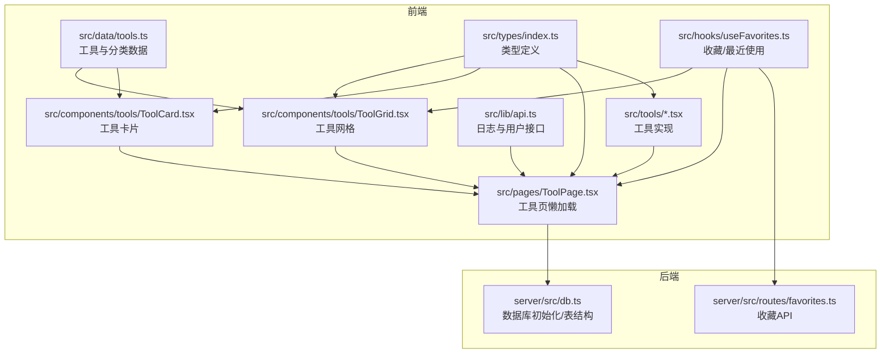
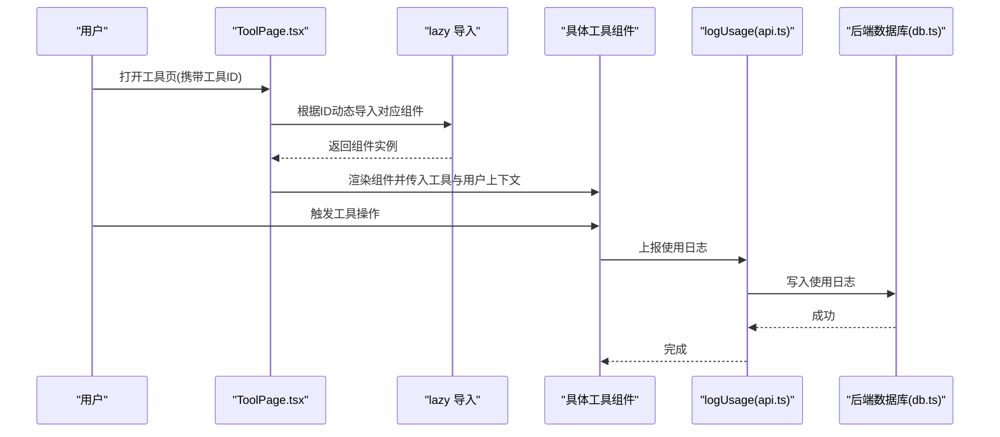
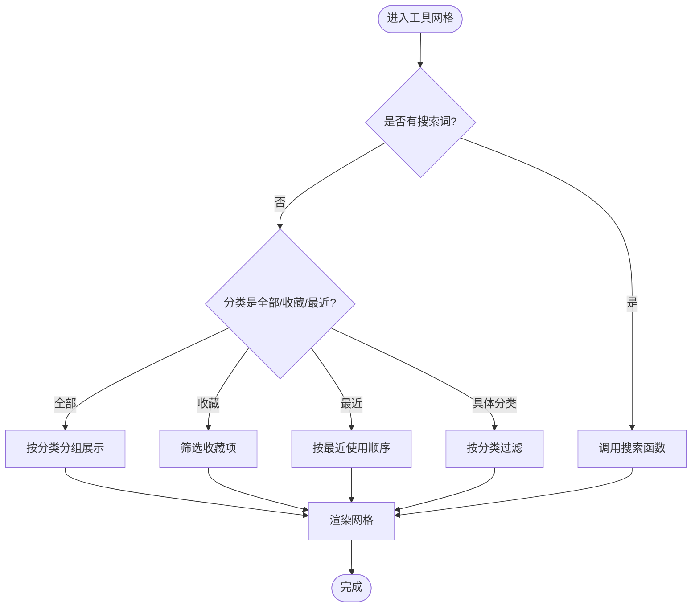
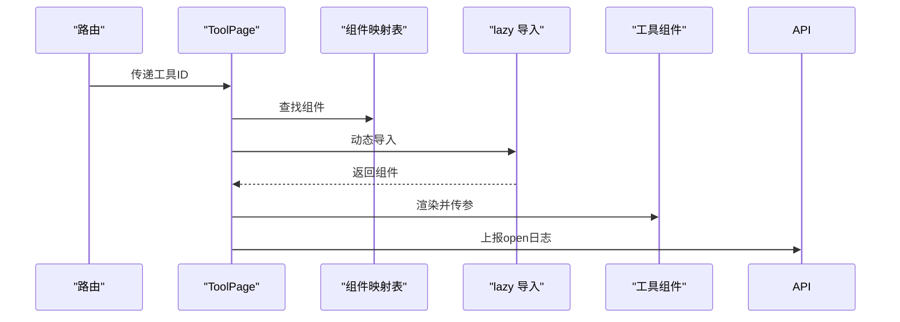
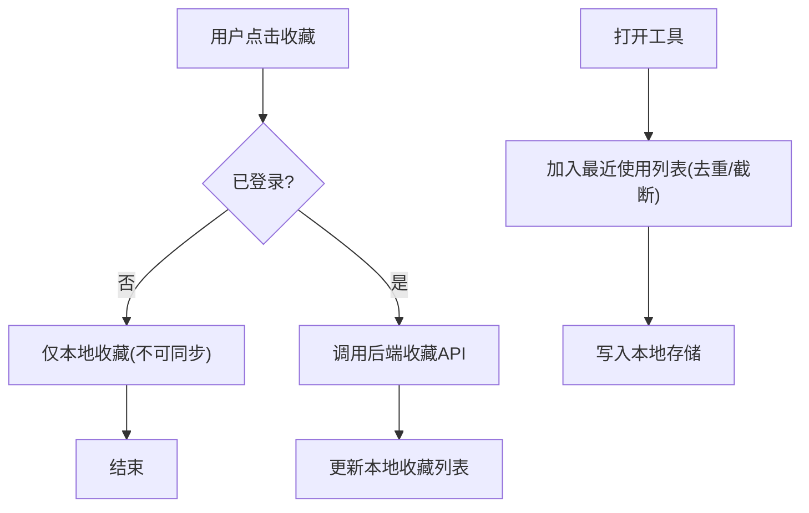
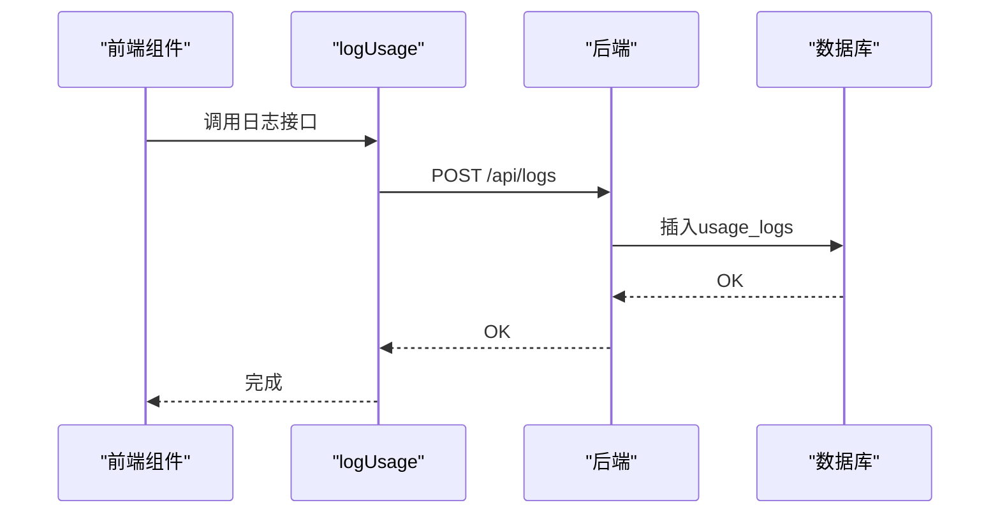
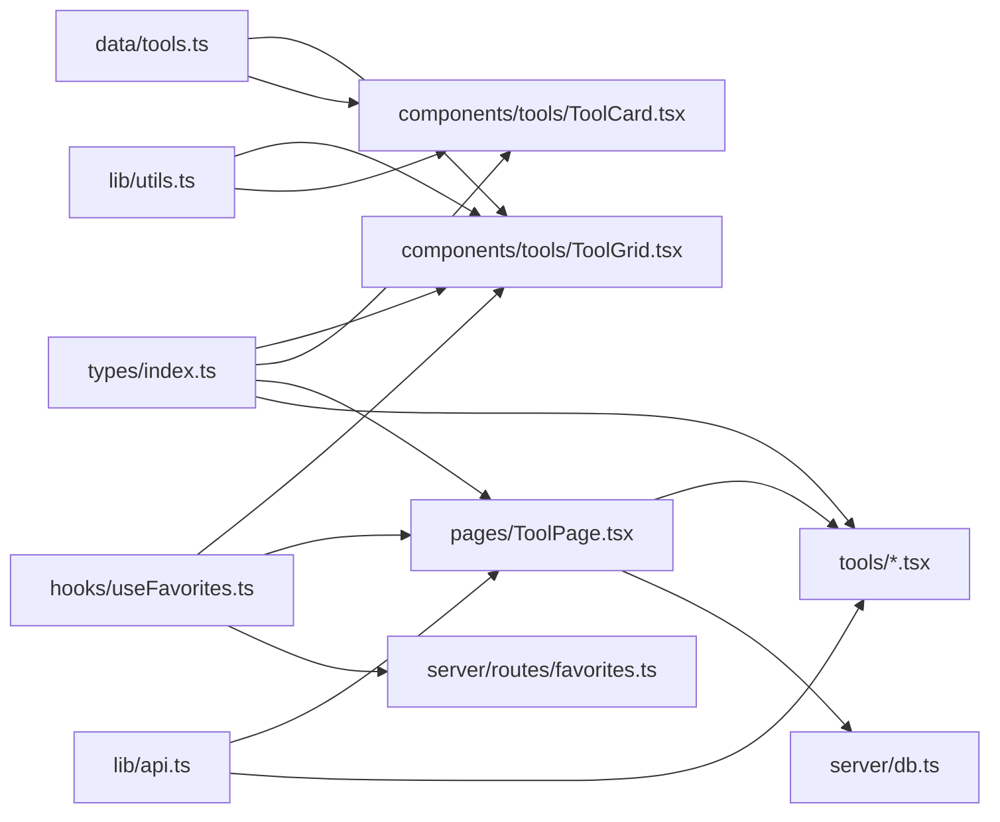

# 工具系统

<cite>
**本文引用的文件**
- [src/data/tools.ts](file://src/data/tools.ts)
- [src/types/index.ts](file://src/types/index.ts)
- [src/components/tools/ToolCard.tsx](file://src/components/tools/ToolCard.tsx)
- [src/components/tools/ToolGrid.tsx](file://src/components/tools/ToolGrid.tsx)
- [src/pages/ToolPage.tsx](file://src/pages/ToolPage.tsx)
- [src/hooks/useFavorites.ts](file://src/hooks/useFavorites.ts)
- [src/lib/api.ts](file://src/lib/api.ts)
- [src/lib/utils.ts](file://src/lib/utils.ts)
- [src/tools/Base64Tool.tsx](file://src/tools/Base64Tool.tsx)
- [src/tools/JsonFormatter.tsx](file://src/tools/JsonFormatter.tsx)
- [src/tools/BarcodeGenerator.tsx](file://src/tools/BarcodeGenerator.tsx)
- [src/tools/PasswordGenerator.tsx](file://src/tools/PasswordGenerator.tsx)
- [server/src/db.ts](file://server/src/db.ts)
- [server/src/routes/favorites.ts](file://server/src/routes/favorites.ts)
- [package.json](file://package.json)
</cite>

## 目录
1. [简介](#简介)
2. [项目结构](#项目结构)
3. [核心组件](#核心组件)
4. [架构总览](#架构总览)
5. [详细组件分析](#详细组件分析)
6. [依赖关系分析](#依赖关系分析)
7. [性能考虑](#性能考虑)
8. [故障排查指南](#故障排查指南)
9. [结论](#结论)
10. [附录：新工具开发流程与规范](#附录新工具开发流程与规范)

## 简介
本文件面向“工具系统”的技术文档，围绕工具注册机制、分类体系、元数据结构、开发规范、懒加载与性能优化策略进行系统化说明，并提供新工具开发的完整流程与参考路径。该系统采用前端路由 + 动态导入的懒加载方式组织工具页面，通过统一的数据源管理工具清单与分类信息，结合收藏与最近使用等用户行为数据，形成完整的工具门户体验。

## 项目结构
- 前端核心目录
  - src/data/tools.ts：集中声明工具清单与分类信息，提供按类目筛选与搜索函数
  - src/types/index.ts：定义工具类型、分类类型与用户类型
  - src/components/tools/*：工具卡片与网格展示组件
  - src/pages/ToolPage.tsx：工具页，负责根据路由参数动态加载对应工具组件
  - src/tools/*.tsx：具体工具实现模块
  - src/hooks/useFavorites.ts：收藏与最近使用状态管理
  - src/lib/api.ts：前端日志上报与用户接口封装
  - src/lib/utils.ts：通用样式合并工具
- 后端服务（server）
  - server/src/db.ts：SQLite 初始化与表结构定义（用户、使用日志、收藏、标签等）
  - server/src/routes/favorites.ts：收藏相关 API（增删查）



图表来源
- [src/data/tools.ts:1-316](file://src/data/tools.ts#L1-L316)
- [src/types/index.ts:1-37](file://src/types/index.ts#L1-L37)
- [src/components/tools/ToolGrid.tsx:1-136](file://src/components/tools/ToolGrid.tsx#L1-L136)
- [src/components/tools/ToolCard.tsx:1-66](file://src/components/tools/ToolCard.tsx#L1-L66)
- [src/pages/ToolPage.tsx:1-113](file://src/pages/ToolPage.tsx#L1-L113)
- [src/hooks/useFavorites.ts:1-71](file://src/hooks/useFavorites.ts#L1-L71)
- [src/lib/api.ts:1-36](file://src/lib/api.ts#L1-L36)
- [server/src/db.ts:1-126](file://server/src/db.ts#L1-L126)
- [server/src/routes/favorites.ts:1-31](file://server/src/routes/favorites.ts#L1-L31)

章节来源
- [src/data/tools.ts:1-316](file://src/data/tools.ts#L1-L316)
- [src/types/index.ts:1-37](file://src/types/index.ts#L1-L37)
- [src/components/tools/ToolGrid.tsx:1-136](file://src/components/tools/ToolGrid.tsx#L1-L136)
- [src/components/tools/ToolCard.tsx:1-66](file://src/components/tools/ToolCard.tsx#L1-L66)
- [src/pages/ToolPage.tsx:1-113](file://src/pages/ToolPage.tsx#L1-L113)
- [src/hooks/useFavorites.ts:1-71](file://src/hooks/useFavorites.ts#L1-L71)
- [src/lib/api.ts:1-36](file://src/lib/api.ts#L1-L36)
- [server/src/db.ts:1-126](file://server/src/db.ts#L1-L126)
- [server/src/routes/favorites.ts:1-31](file://server/src/routes/favorites.ts#L1-L31)

## 核心组件
- 工具元数据模型
  - 工具对象包含：标识、名称、描述、图标、分类、标签、路由路径、是否热门、是否新功能等字段
  - 分类信息包含：分类标识、显示名、图标
- 工具清单与分类
  - 统一在数据层维护，支持按分类过滤与全文检索
- 工具页与懒加载
  - 通过路由参数定位工具，使用动态导入按需加载对应工具组件
- 收藏与最近使用
  - 前端本地存储最近使用列表；收藏通过后端 API 同步

章节来源
- [src/types/index.ts:3-27](file://src/types/index.ts#L3-L27)
- [src/data/tools.ts:34-41](file://src/data/tools.ts#L34-L41)
- [src/data/tools.ts:43-301](file://src/data/tools.ts#L43-L301)
- [src/pages/ToolPage.tsx:11-38](file://src/pages/ToolPage.tsx#L11-L38)
- [src/hooks/useFavorites.ts:16-70](file://src/hooks/useFavorites.ts#L16-L70)

## 架构总览
工具系统从前端数据源出发，通过类型约束保证一致性；工具页根据路由动态选择组件；UI 层以卡片网格展示工具；用户行为（收藏、最近使用、使用日志）由前端与后端协同维护。



图表来源
- [src/pages/ToolPage.tsx:40-112](file://src/pages/ToolPage.tsx#L40-L112)
- [src/lib/api.ts:3-19](file://src/lib/api.ts#L3-L19)
- [server/src/db.ts:26-39](file://server/src/db.ts#L26-L39)

## 详细组件分析

### 工具元数据与分类体系
- 元数据字段
  - id：唯一标识
  - name：显示名称
  - description：简要描述
  - icon：Lucide 图标组件
  - category：分类标识
  - tags：标签数组，用于搜索
  - path：前端路由路径
  - isNew/isHot：展示标记
- 分类体系
  - 图像工具、开发工具、转换工具、文本工具、安全工具、网络工具
- 搜索与筛选
  - 支持按名称、描述、标签模糊匹配
  - 支持按分类过滤

```mermaid
classDiagram
class Tool {
+string id
+string name
+string description
+LucideIcon icon
+ToolCategory category
+string[] tags
+string path
+boolean isNew
+boolean isHot
}
class CategoryInfo {
+ToolCategory id
+string name
+LucideIcon icon
}
class ToolCategory {
<<enumeration>>
"development"
"conversion"
"text"
"image"
"security"
"network"
}
Tool --> CategoryInfo : "关联分类"
Tool --> ToolCategory : "使用分类"
```

图表来源
- [src/types/index.ts:3-27](file://src/types/index.ts#L3-L27)

章节来源
- [src/types/index.ts:3-27](file://src/types/index.ts#L3-L27)
- [src/data/tools.ts:34-41](file://src/data/tools.ts#L34-L41)
- [src/data/tools.ts:303-315](file://src/data/tools.ts#L303-L315)

### 工具网格与卡片组件
- ToolGrid
  - 支持“全部”“收藏”“最近使用”“按分类”“搜索”五种视图
  - 在“全部”且无搜索时按分类分组展示
- ToolCard
  - 展示图标、名称、描述、标签徽章（NEW/HOT）
  - 支持收藏切换与打开详情



图表来源
- [src/components/tools/ToolGrid.tsx:15-109](file://src/components/tools/ToolGrid.tsx#L15-L109)

章节来源
- [src/components/tools/ToolGrid.tsx:1-136](file://src/components/tools/ToolGrid.tsx#L1-L136)
- [src/components/tools/ToolCard.tsx:1-66](file://src/components/tools/ToolCard.tsx#L1-L66)

### 工具页懒加载与组件映射
- 工具页根据路由参数定位工具，从映射表中取出对应组件并动态导入
- 使用 Suspense 提供加载占位
- 打开工具时记录一次“open”日志



图表来源
- [src/pages/ToolPage.tsx:40-112](file://src/pages/ToolPage.tsx#L40-L112)

章节来源
- [src/pages/ToolPage.tsx:11-38](file://src/pages/ToolPage.tsx#L11-L38)
- [src/pages/ToolPage.tsx:40-112](file://src/pages/ToolPage.tsx#L40-L112)

### 收藏与最近使用
- 收藏
  - 前端本地存储最近使用列表
  - 用户登录后通过后端 API 同步收藏
- 最近使用
  - 通过本地存储维护最近访问 ID 列表，限制数量



图表来源
- [src/hooks/useFavorites.ts:16-70](file://src/hooks/useFavorites.ts#L16-L70)
- [server/src/routes/favorites.ts:6-28](file://server/src/routes/favorites.ts#L6-L28)

章节来源
- [src/hooks/useFavorites.ts:16-70](file://src/hooks/useFavorites.ts#L16-L70)
- [server/src/routes/favorites.ts:1-31](file://server/src/routes/favorites.ts#L1-L31)

### 日志与后端集成
- 前端日志
  - 提供 logUsage 接口，上报用户、工具、动作、详情
- 后端数据库
  - 初始化 users、usage_logs、favorites、bin_labels、login_sessions 表
  - 种子数据用于演示



图表来源
- [src/lib/api.ts:3-19](file://src/lib/api.ts#L3-L19)
- [server/src/db.ts:26-39](file://server/src/db.ts#L26-L39)

章节来源
- [src/lib/api.ts:1-36](file://src/lib/api.ts#L1-L36)
- [server/src/db.ts:1-126](file://server/src/db.ts#L1-L126)

### 典型工具实现模式
- 基础模板
  - 输入/输出状态管理
  - 操作按钮与错误处理
  - 复制/下载等交互
  - 调用日志上报
- 示例组件
  - Base64Tool：编码/解码双向转换
  - JsonFormatter：格式化/压缩 JSON
  - BarcodeGenerator：生成条码并下载
  - PasswordGenerator：密码强度与字符集配置

章节来源
- [src/tools/Base64Tool.tsx:1-64](file://src/tools/Base64Tool.tsx#L1-L64)
- [src/tools/JsonFormatter.tsx:1-76](file://src/tools/JsonFormatter.tsx#L1-L76)
- [src/tools/BarcodeGenerator.tsx:1-100](file://src/tools/BarcodeGenerator.tsx#L1-L100)
- [src/tools/PasswordGenerator.tsx:1-84](file://src/tools/PasswordGenerator.tsx#L1-L84)

## 依赖关系分析
- 类型依赖
  - 工具与分类类型由统一类型文件定义，被网格、卡片、工具页与工具组件共同依赖
- 运行时依赖
  - 工具页依赖数据源与懒加载映射
  - UI 组件依赖通用工具函数与 UI 组件库
- 后端依赖
  - 收藏与日志通过 API 调用后端路由



图表来源
- [src/types/index.ts:1-37](file://src/types/index.ts#L1-L37)
- [src/data/tools.ts:1-316](file://src/data/tools.ts#L1-L316)
- [src/components/tools/ToolGrid.tsx:1-136](file://src/components/tools/ToolGrid.tsx#L1-L136)
- [src/components/tools/ToolCard.tsx:1-66](file://src/components/tools/ToolCard.tsx#L1-L66)
- [src/pages/ToolPage.tsx:1-113](file://src/pages/ToolPage.tsx#L1-L113)
- [src/hooks/useFavorites.ts:1-71](file://src/hooks/useFavorites.ts#L1-L71)
- [src/lib/api.ts:1-36](file://src/lib/api.ts#L1-L36)
- [src/lib/utils.ts:1-7](file://src/lib/utils.ts#L1-L7)
- [server/src/db.ts:1-126](file://server/src/db.ts#L1-L126)
- [server/src/routes/favorites.ts:1-31](file://server/src/routes/favorites.ts#L1-L31)

章节来源
- [package.json:11-21](file://package.json#L11-L21)

## 性能考虑
- 懒加载与分割
  - 工具页通过动态导入按需加载组件，减少首屏包体与初始渲染压力
- 渲染优化
  - 工具网格支持分组与空状态，避免不必要的 DOM 结构
  - 卡片组件使用过渡动画但控制延迟，提升滚动流畅度
- 存储与网络
  - 最近使用列表本地持久化，降低重复请求
  - 收藏状态在用户登录后与后端同步，避免频繁网络抖动
- 图标与资源
  - 使用轻量级图标库，避免引入未使用图标

章节来源
- [src/pages/ToolPage.tsx:3-38](file://src/pages/ToolPage.tsx#L3-L38)
- [src/components/tools/ToolGrid.tsx:15-109](file://src/components/tools/ToolGrid.tsx#L15-L109)
- [src/hooks/useFavorites.ts:19-21](file://src/hooks/useFavorites.ts#L19-L21)

## 故障排查指南
- 工具未找到
  - 检查路由参数与工具清单中的 id 是否一致
  - 确认工具页映射表中是否存在对应键值
- 组件不显示或空白
  - 查看动态导入是否成功，确认组件文件存在且导出默认组件
  - 检查 Suspense 占位是否正常显示
- 收藏无法同步
  - 确认用户已登录，后端收藏接口可用
  - 检查本地存储与后端返回的收藏列表是否一致
- 日志未记录
  - 检查前端日志接口是否被调用
  - 检查后端日志接口是否可达，数据库表结构是否正确

章节来源
- [src/pages/ToolPage.tsx:50-61](file://src/pages/ToolPage.tsx#L50-L61)
- [src/pages/ToolPage.tsx:99-101](file://src/pages/ToolPage.tsx#L99-L101)
- [src/hooks/useFavorites.ts:23-32](file://src/hooks/useFavorites.ts#L23-L32)
- [src/lib/api.ts:10-19](file://src/lib/api.ts#L10-L19)
- [server/src/db.ts:26-39](file://server/src/db.ts#L26-L39)

## 结论
该工具系统以清晰的类型定义与集中式数据源为核心，配合懒加载与 UI 组件化设计，实现了良好的扩展性与用户体验。通过分类体系与搜索能力，用户可以高效发现与使用工具；通过收藏与最近使用，系统能够提供个性化入口；通过前后端协作的日志体系，便于后续运营与分析。

## 附录：新工具开发流程与规范

### 一、工具元数据定义
- 在工具清单中新增一条记录，包含以下字段：
  - id：与路由路径一致
  - name：中文名称
  - description：简要描述
  - icon：从图标库选择对应图标组件
  - category：所属分类（开发/转换/文本/图像/安全/网络）
  - tags：关键词数组，便于搜索
  - path：前端路由路径
  - isNew/isHot：可选展示标记

章节来源
- [src/types/index.ts:3-13](file://src/types/index.ts#L3-L13)
- [src/data/tools.ts:43-301](file://src/data/tools.ts#L43-L301)

### 二、工具组件开发
- 组件命名规范：工具名驼峰化，文件名与组件名一致
- 组件职责：
  - 管理输入/输出状态
  - 提供操作按钮与错误提示
  - 支持复制/下载等常用交互
  - 调用日志上报接口记录用户行为
- 参考模板路径：
  - [Base64Tool.tsx:1-64](file://src/tools/Base64Tool.tsx#L1-L64)
  - [JsonFormatter.tsx:1-76](file://src/tools/JsonFormatter.tsx#L1-L76)
  - [BarcodeGenerator.tsx:1-100](file://src/tools/BarcodeGenerator.tsx#L1-L100)
  - [PasswordGenerator.tsx:1-84](file://src/tools/PasswordGenerator.tsx#L1-L84)

章节来源
- [src/tools/Base64Tool.tsx:1-64](file://src/tools/Base64Tool.tsx#L1-L64)
- [src/tools/JsonFormatter.tsx:1-76](file://src/tools/JsonFormatter.tsx#L1-L76)
- [src/tools/BarcodeGenerator.tsx:1-100](file://src/tools/BarcodeGenerator.tsx#L1-L100)
- [src/tools/PasswordGenerator.tsx:1-84](file://src/tools/PasswordGenerator.tsx#L1-L84)

### 三、路由与懒加载接入
- 在工具页的组件映射表中增加新工具的键值对，键为工具 id，值为动态导入路径
- 确保工具页能根据路由参数正确匹配并渲染组件
- 参考路径：
  - [ToolPage.tsx 映射表:11-38](file://src/pages/ToolPage.tsx#L11-L38)

章节来源
- [src/pages/ToolPage.tsx:11-38](file://src/pages/ToolPage.tsx#L11-L38)

### 四、分类体系扩展建议
- 当前分类：开发工具、转换工具、文本工具、图像工具、安全工具、网络工具
- 新增分类时：
  - 在类型定义中扩展枚举
  - 在分类列表中新增一项，包含 id、name、icon
  - 在工具清单中为相关工具设置新分类

章节来源
- [src/types/index.ts:15-27](file://src/types/index.ts#L15-L27)
- [src/data/tools.ts:34-41](file://src/data/tools.ts#L34-L41)

### 五、开发最佳实践
- 状态管理：单一职责，避免过度拆分
- 错误处理：明确错误提示，必要时清空输出
- 性能：避免在渲染中执行重计算，合理使用 useMemo/useCallback
- 可访问性：为交互元素提供键盘支持与语义化标签
- 日志：在关键操作点记录 open/execute 等动作，便于追踪与分析

章节来源
- [src/tools/Base64Tool.tsx:14-25](file://src/tools/Base64Tool.tsx#L14-L25)
- [src/tools/JsonFormatter.tsx:14-36](file://src/tools/JsonFormatter.tsx#L14-L36)
- [src/lib/api.ts:3-19](file://src/lib/api.ts#L3-L19)