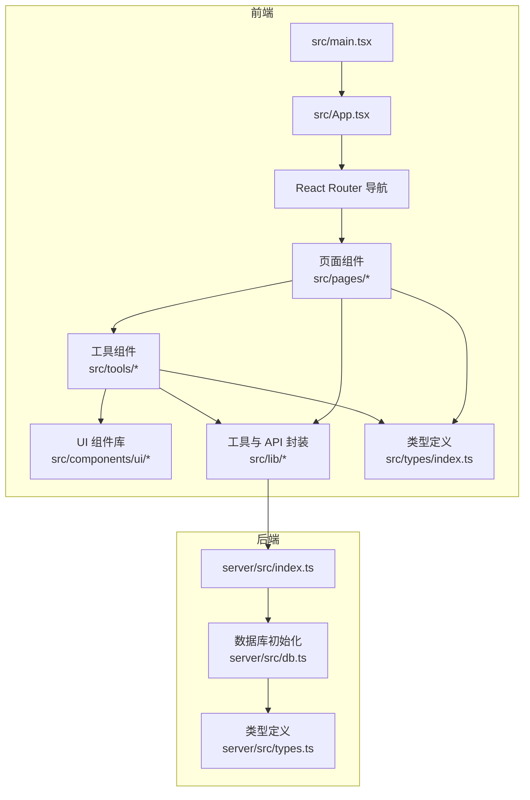
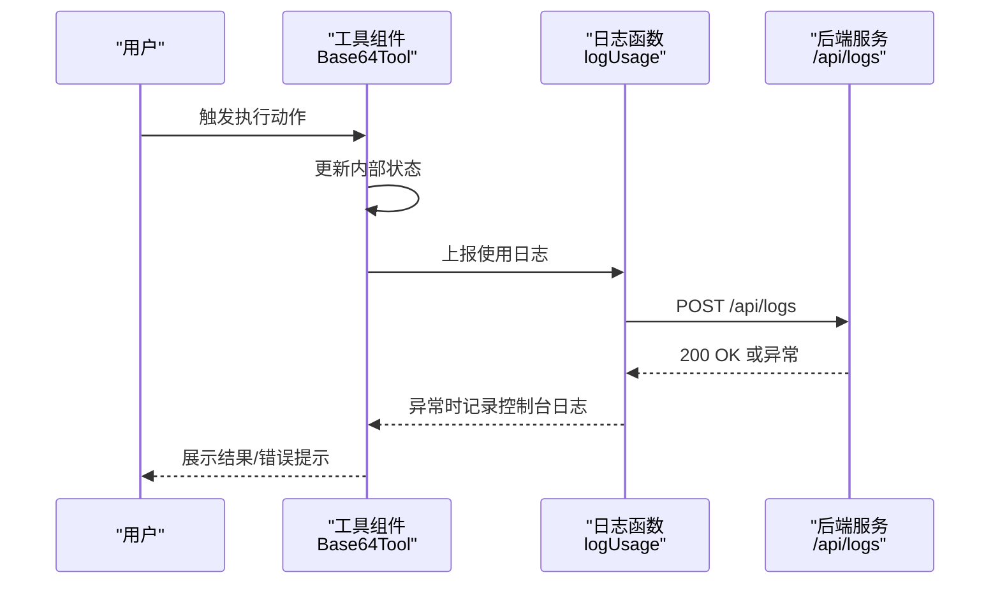
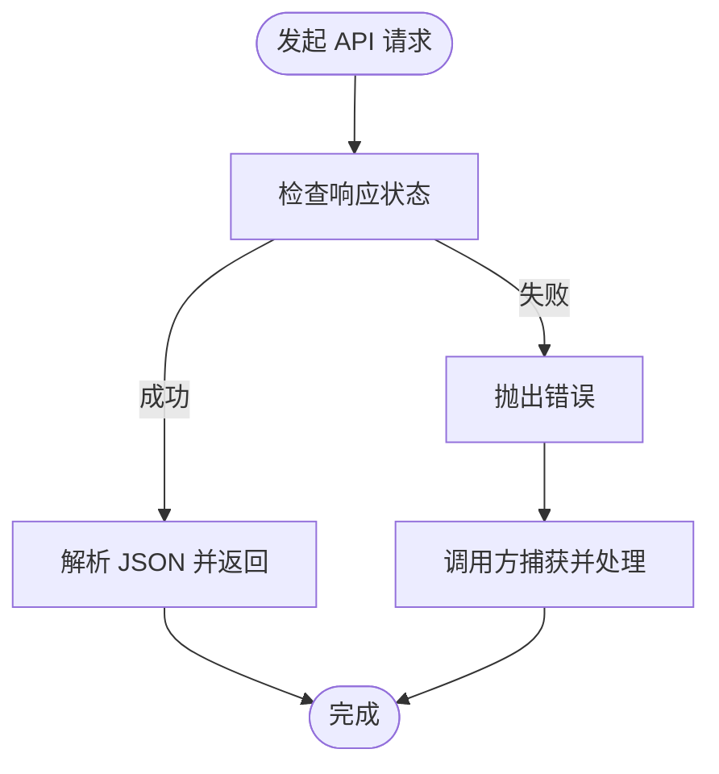
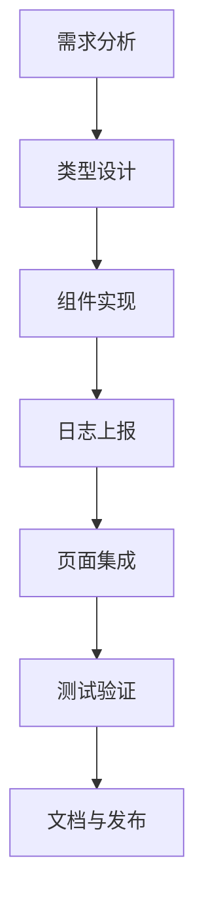
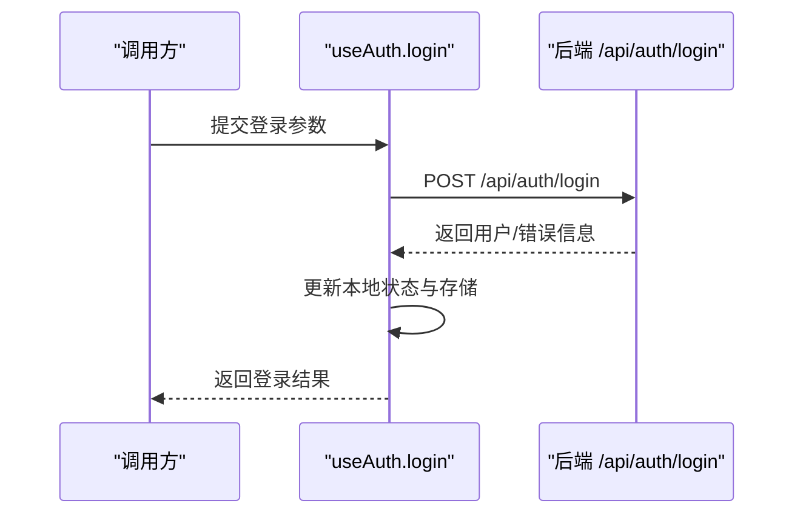
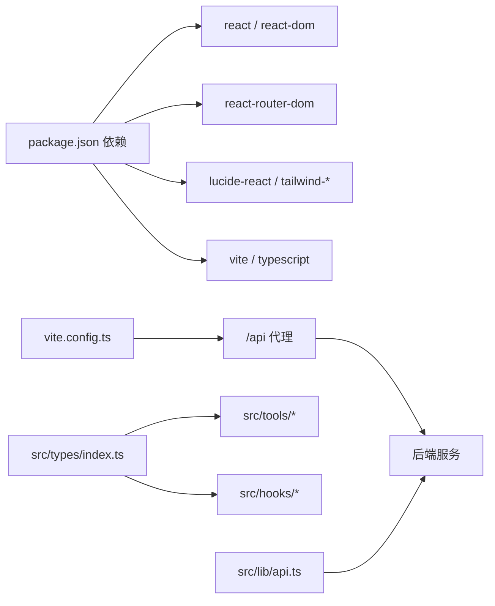

# 开发指南

<cite>
**本文引用的文件**
- [package.json](file://package.json)
- [tsconfig.json](file://tsconfig.json)
- [vite.config.ts](file://vite.config.ts)
- [src/types/index.ts](file://src/types/index.ts)
- [src/lib/api.ts](file://src/lib/api.ts)
- [src/components/ui/button.tsx](file://src/components/ui/button.tsx)
- [src/components/ui/input.tsx](file://src/components/ui/input.tsx)
- [src/tools/Base64Tool.tsx](file://src/tools/Base64Tool.tsx)
- [src/hooks/useAuth.ts](file://src/hooks/useAuth.ts)
- [src/data/tools.ts](file://src/data/tools.ts)
- [src/App.tsx](file://src/App.tsx)
- [src/main.tsx](file://src/main.tsx)
- [server/src/types.ts](file://server/src/types.ts)
- [server/src/db.ts](file://server/src/db.ts)
</cite>

## 目录
1. [简介](#简介)
2. [项目结构](#项目结构)
3. [核心组件](#核心组件)
4. [架构总览](#架构总览)
5. [详细组件分析](#详细组件分析)
6. [依赖关系分析](#依赖关系分析)
7. [性能考虑](#性能考虑)
8. [故障排查指南](#故障排查指南)
9. [结论](#结论)
10. [附录](#附录)

## 简介
本开发指南面向 AnyTools 项目的前端与全栈开发者，系统阐述 TypeScript 编码规范、组件开发规范、API 调用与错误处理模式、UI 组件（基于 shadcn/ui 风格）使用方式、新工具开发流程、测试与调试策略，以及代码审查与质量保证流程。内容以仓库现有实现为依据，结合可复用的设计模式与最佳实践，帮助团队统一风格、提升可维护性与协作效率。

## 项目结构
项目采用前后端分离架构：前端基于 Vite + React + TypeScript，UI 层参考 shadcn/ui 的设计系统；后端为 Node.js + better-sqlite3 的轻量服务，提供认证、日志、收藏、标签等数据能力。



图表来源
- [src/main.tsx:1-14](file://src/main.tsx#L1-L14)
- [src/App.tsx:1-63](file://src/App.tsx#L1-L63)
- [src/lib/api.ts:1-36](file://src/lib/api.ts#L1-L36)
- [server/src/db.ts:1-126](file://server/src/db.ts#L1-L126)

章节来源
- [package.json:1-34](file://package.json#L1-L34)
- [tsconfig.json:1-7](file://tsconfig.json#L1-L7)
- [vite.config.ts:1-21](file://vite.config.ts#L1-L21)

## 核心组件
- 类型系统：统一在前端定义工具、分类、用户等核心类型，确保组件与 API 的契约清晰。
- UI 组件：遵循变体与尺寸的组合设计，通过 class-variance-authority 实现一致的视觉与交互语义。
- 工具组件：每个工具封装独立的状态、交互与日志上报逻辑，便于扩展与维护。
- 钩子与工具：集中处理认证、收藏、主题等横切关注点，降低页面耦合度。
- API 封装：统一前缀与错误处理策略，便于替换与扩展。

章节来源
- [src/types/index.ts:1-37](file://src/types/index.ts#L1-L37)
- [src/components/ui/button.tsx:1-50](file://src/components/ui/button.tsx#L1-L50)
- [src/components/ui/input.tsx:1-25](file://src/components/ui/input.tsx#L1-L25)
- [src/tools/Base64Tool.tsx:1-64](file://src/tools/Base64Tool.tsx#L1-L64)
- [src/hooks/useAuth.ts:1-89](file://src/hooks/useAuth.ts#L1-L89)
- [src/lib/api.ts:1-36](file://src/lib/api.ts#L1-L36)

## 架构总览
前端通过代理访问后端 API，工具组件负责业务交互与日志上报，数据库层提供持久化能力。整体流程强调“声明式 UI + 显式副作用”的模式，便于测试与调试。



图表来源
- [src/tools/Base64Tool.tsx:14-25](file://src/tools/Base64Tool.tsx#L14-L25)
- [src/lib/api.ts:3-19](file://src/lib/api.ts#L3-L19)

## 详细组件分析

### TypeScript 编码规范
- 接口与类型
  - 使用明确的接口与联合类型描述数据结构，如工具、用户、分类等。
  - 对可选字段与可空字段进行显式标注，避免隐式类型风险。
- 类型注解
  - 在函数参数、返回值与复杂对象上添加类型注解，保持签名清晰。
- 错误处理
  - 对外部调用（fetch）进行状态检查与异常捕获，避免静默失败。
  - 对 UI 层错误进行用户可见反馈，同时保留控制台日志以便调试。

章节来源
- [src/types/index.ts:1-37](file://src/types/index.ts#L1-L37)
- [src/lib/api.ts:21-35](file://src/lib/api.ts#L21-L35)
- [src/hooks/useAuth.ts:37-72](file://src/hooks/useAuth.ts#L37-L72)

### 组件开发规范
- 命名约定
  - 组件文件采用帕斯卡命名，如 Base64Tool、Button、Input。
  - UI 组件统一置于 src/components/ui 下，工具组件置于 src/tools 下。
- Props 设计
  - 优先使用接口约束 props，避免使用 any。
  - 对于 UI 组件，支持透传原生属性与变体/尺寸组合。
- 状态管理
  - 工具组件内部状态自洽，必要时通过回调向上层传递。
  - 使用钩子集中处理跨页面共享状态（如认证、收藏、主题）。

章节来源
- [src/tools/Base64Tool.tsx:8-64](file://src/tools/Base64Tool.tsx#L8-L64)
- [src/components/ui/button.tsx:32-50](file://src/components/ui/button.tsx#L32-L50)
- [src/components/ui/input.tsx:4-25](file://src/components/ui/input.tsx#L4-L25)
- [src/hooks/useAuth.ts:20-89](file://src/hooks/useAuth.ts#L20-L89)

### API 调用规范与错误处理模式
- 统一前缀与方法
  - 所有 API 请求以 /api 为前缀，使用标准 HTTP 方法。
- 成功与失败分支
  - 对 res.ok 进行判断，非 2xx 抛出错误，由调用方捕获并展示。
  - 对网络异常进行统一兜底，避免崩溃并提示用户重试。
- 日志与追踪
  - 工具组件在执行后主动上报使用日志，便于审计与统计。



图表来源
- [src/lib/api.ts:21-35](file://src/lib/api.ts#L21-L35)
- [src/hooks/useAuth.ts:37-72](file://src/hooks/useAuth.ts#L37-L72)

章节来源
- [src/lib/api.ts:1-36](file://src/lib/api.ts#L1-L36)
- [src/hooks/useAuth.ts:1-89](file://src/hooks/useAuth.ts#L1-L89)

### UI 组件开发指南（基于 shadcn/ui 风格）
- 变体与尺寸
  - 通过变体（variant）与尺寸（size）组合实现多态按钮样式，支持默认、危险、描边、次级、幽灵、链接与定制变体。
- 类名合并
  - 使用工具函数合并类名，保证默认样式与自定义样式的正确叠加。
- 受控与非受控
  - 输入组件支持受控模式（value/onChange），便于表单集成。
- 可访问性
  - 保持原生语义标签与焦点管理，配合 Tailwind 样式实现无障碍体验。

```mermaid
classDiagram
class Button {
+variant : "default"|"destructive"|"outline"|"secondary"|"ghost"|"link"|"premium"
+size : "default"|"sm"|"lg"|"icon"
+className : string
}
class Input {
+type : string
+className : string
}
Button <.. UI["变体/尺寸组合"]
Input <.. UI["受控输入"]
```

图表来源
- [src/components/ui/button.tsx:5-30](file://src/components/ui/button.tsx#L5-L30)
- [src/components/ui/input.tsx:7-21](file://src/components/ui/input.tsx#L7-L21)

章节来源
- [src/components/ui/button.tsx:1-50](file://src/components/ui/button.tsx#L1-L50)
- [src/components/ui/input.tsx:1-25](file://src/components/ui/input.tsx#L1-L25)

### 新工具开发完整流程
- 需求分析
  - 明确工具功能、输入输出、边界条件与错误场景。
- 类型设计
  - 在类型文件中补充必要的接口与枚举，确保后续组件与 API 共享契约。
- 组件实现
  - 创建工具组件文件，组织状态、交互与 UI 结构；使用 UI 组件库保持一致性。
- 日志与追踪
  - 在关键操作处调用日志函数，记录用户 ID、工具 ID、动作与详情。
- 页面集成
  - 在工具列表中注册新工具，配置路由与分类映射。
- 测试与验证
  - 单元测试覆盖边界与错误路径；端到端验证交互流程。
- 文档与发布
  - 补充使用说明与变更日志，按版本号推进发布。



章节来源
- [src/types/index.ts:1-37](file://src/types/index.ts#L1-L37)
- [src/tools/Base64Tool.tsx:1-64](file://src/tools/Base64Tool.tsx#L1-L64)
- [src/data/tools.ts:43-316](file://src/data/tools.ts#L43-L316)

### 认证与会话管理（useAuth 钩子）
- 登录参数与结果
  - 支持多种登录方式，返回统一的结果结构，便于 UI 分支处理。
- 用户状态持久化
  - 使用本地存储保存用户信息与最近记录，刷新后恢复状态。
- 错误处理
  - 对网络异常与服务端错误分别处理，提供用户可见提示。



图表来源
- [src/hooks/useAuth.ts:37-72](file://src/hooks/useAuth.ts#L37-L72)
- [src/lib/api.ts:27-35](file://src/lib/api.ts#L27-L35)

章节来源
- [src/hooks/useAuth.ts:1-89](file://src/hooks/useAuth.ts#L1-L89)

### 工具目录与搜索（tools.ts）
- 工具与分类
  - 统一维护工具清单与分类信息，支持按类别筛选与关键词搜索。
- 搜索策略
  - 多字段模糊匹配，兼顾性能与准确性。

章节来源
- [src/data/tools.ts:34-316](file://src/data/tools.ts#L34-L316)

### 前端入口与路由（main.tsx 与 App.tsx）
- 应用启动
  - 在根节点挂载路由与应用容器，开启严格模式。
- 路由与页面
  - 基于 React Router 管理页面导航，支持工具页、仪表盘、管理页等。

章节来源
- [src/main.tsx:1-14](file://src/main.tsx#L1-L14)
- [src/App.tsx:1-63](file://src/App.tsx#L1-L63)

## 依赖关系分析
- 前端依赖
  - React 生态与 UI 工具链，TailwindCSS 用于样式，Vite 提供构建与开发服务器。
- 后端依赖
  - better-sqlite3 提供本地数据库能力，配合索引与外键约束保障数据完整性。
- 代理与环境
  - 前端开发服务器通过代理转发 /api 到后端服务，简化联调。



图表来源
- [package.json:11-32](file://package.json#L11-L32)
- [vite.config.ts:13-18](file://vite.config.ts#L13-L18)
- [src/types/index.ts:1-37](file://src/types/index.ts#L1-37)
- [src/lib/api.ts:1-36](file://src/lib/api.ts#L1-L36)

章节来源
- [package.json:1-34](file://package.json#L1-L34)
- [vite.config.ts:1-21](file://vite.config.ts#L1-L21)
- [server/src/db.ts:1-126](file://server/src/db.ts#L1-L126)

## 性能考虑
- 组件渲染
  - 使用 React.memo 与 useMemo/useCallback 优化重复渲染与昂贵计算。
- 网络请求
  - 合并请求、缓存响应、限制并发，避免抖动与重复加载。
- 样式与资源
  - Tailwind 工具类按需使用，避免无用类导致包体膨胀；图片与大文件懒加载。
- 数据库
  - 为高频查询建立索引，合理分页与限制结果集大小。

## 故障排查指南
- 常见问题定位
  - 网络错误：检查代理配置与后端服务是否启动；确认 /api 前缀与 CORS 设置。
  - 类型错误：核对接口字段与实际返回值，补充缺失的类型注解。
  - 状态不一致：检查本地存储读写时机与作用域，避免竞态。
- 调试技巧
  - 使用浏览器开发者工具断点与日志；在工具组件中增加关键步骤的日志输出。
  - 对异步流程绘制时序图，定位失败点与回退路径。
- 错误处理
  - 统一捕获与提示，保留堆栈信息但不暴露敏感细节给用户。

章节来源
- [vite.config.ts:12-19](file://vite.config.ts#L12-L19)
- [src/lib/api.ts:10-19](file://src/lib/api.ts#L10-L19)
- [src/hooks/useAuth.ts:66-72](file://src/hooks/useAuth.ts#L66-L72)

## 结论
本指南总结了 AnyTools 项目的开发范式与最佳实践，涵盖类型系统、组件设计、API 规范、UI 风格、工具扩展流程、测试与调试策略以及质量保证流程。建议在团队内形成统一的代码审查清单与发布流程，持续迭代以提升开发效率与用户体验。

## 附录

### 代码审查清单
- 类型与契约
  - 是否存在未使用的 any；接口字段是否完备且可选字段标注清晰。
- 组件与状态
  - 是否过度渲染；状态是否集中在合适的作用域；是否存在副作用泄漏。
- API 与错误处理
  - 是否对所有外部调用进行状态检查；错误提示是否友好且可追踪。
- UI 与可访问性
  - 是否遵循变体/尺寸约定；是否具备键盘可达性与屏幕阅读器支持。
- 安全与性能
  - 是否存在 XSS/CSRF 风险；是否进行防抖/节流与缓存优化。
- 文档与测试
  - 是否补充使用说明与变更日志；是否覆盖关键路径与异常分支。

### 质量保证流程
- 提交前
  - 本地运行类型检查、构建与单元测试；修复告警与失败用例。
- 代码审查
  - 关注可读性、可维护性与一致性；确保新增依赖最小化。
- 预发布
  - 在预览环境验证核心流程；收集反馈并修复阻塞性问题。
- 发布
  - 固定版本号与变更日志；监控关键指标与错误日志。