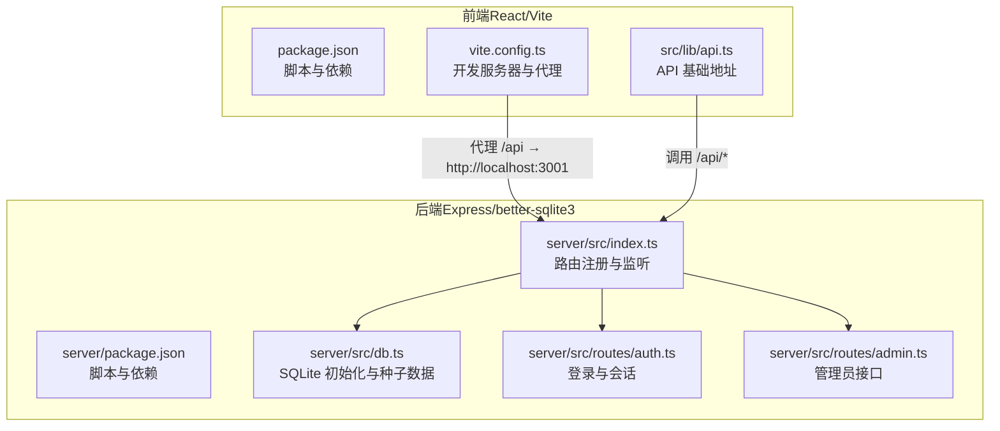
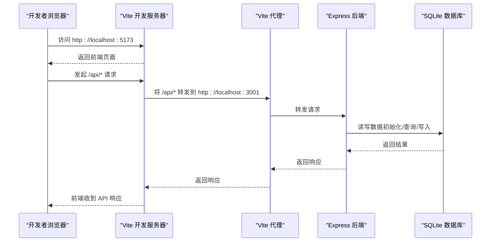

# 快速开始

<cite>
**本文引用的文件**
- [package.json](file://package.json)
- [server/package.json](file://server/package.json)
- [vite.config.ts](file://vite.config.ts)
- [server/src/index.ts](file://server/src/index.ts)
- [server/src/db.ts](file://server/src/db.ts)
- [server/src/routes/auth.ts](file://server/src/routes/auth.ts)
- [server/src/routes/admin.ts](file://server/src/routes/admin.ts)
- [src/lib/api.ts](file://src/lib/api.ts)
- [tailwind.config.ts](file://tailwind.config.ts)
- [tsconfig.json](file://tsconfig.json)
- [src/types/index.ts](file://src/types/index.ts)
- [src/pages/HomePage.tsx](file://src/pages/HomePage.tsx)
- [src/data/tools.ts](file://src/data/tools.ts)
- [部署手册.md](file://部署手册.md)
</cite>

## 目录
1. [简介](#简介)
2. [项目结构](#项目结构)
3. [核心组件](#核心组件)
4. [架构总览](#架构总览)
5. [详细组件分析](#详细组件分析)
6. [依赖关系分析](#依赖关系分析)
7. [性能注意事项](#性能注意事项)
8. [故障排查指南](#故障排查指南)
9. [结论](#结论)
10. [附录](#附录)

## 简介
本指南面向首次接触 AnyTools 的开发者，帮助你在本地快速搭建并运行项目。你将学到：
- 环境要求（Node.js 版本、包管理器）
- 依赖安装步骤
- 前端与后端分别如何启动
- API 代理配置说明
- 数据库初始化流程
- 常见问题（端口冲突、依赖版本兼容性等）的解决方案
- 首次运行后的基本验证步骤与预期结果

## 项目结构
AnyTools 采用前后端分离架构：
- 前端：React + Vite + TypeScript + Tailwind CSS
- 后端：Express + TypeScript + better-sqlite3
- 数据库：SQLite 文件（首次运行自动初始化）

图表来源
- [vite.config.ts:1-21](file://vite.config.ts#L1-L21)
- [server/src/index.ts:1-31](file://server/src/index.ts#L1-L31)
- [server/src/db.ts:1-126](file://server/src/db.ts#L1-L126)
- [src/lib/api.ts:1-36](file://src/lib/api.ts#L1-L36)

章节来源
- [package.json:1-34](file://package.json#L1-L34)
- [server/package.json:1-23](file://server/package.json#L1-L23)
- [vite.config.ts:1-21](file://vite.config.ts#L1-L21)
- [server/src/index.ts:1-31](file://server/src/index.ts#L1-L31)
- [server/src/db.ts:1-126](file://server/src/db.ts#L1-L126)
- [src/lib/api.ts:1-36](file://src/lib/api.ts#L1-L36)

## 核心组件
- 前端开发脚本与依赖：用于启动 Vite 开发服务器、构建生产包、预览。
- 后端开发脚本与依赖：用于启动 TSX 监视模式与直接运行。
- Vite 代理：将 /api 前缀转发到后端服务端口。
- Express 应用：注册认证、日志、网络、收藏、标签与管理员相关路由，并提供健康检查端点。
- better-sqlite3：SQLite 数据库初始化、索引与种子数据插入。

章节来源
- [package.json:6-10](file://package.json#L6-L10)
- [server/package.json:6-9](file://server/package.json#L6-L9)
- [vite.config.ts:12-19](file://vite.config.ts#L12-L19)
- [server/src/index.ts:17-26](file://server/src/index.ts#L17-L26)
- [server/src/db.ts:8-75](file://server/src/db.ts#L8-L75)

## 架构总览
开发阶段的典型交互流程如下：

图表来源
- [vite.config.ts:12-19](file://vite.config.ts#L12-L19)
- [server/src/index.ts:17-26](file://server/src/index.ts#L17-L26)
- [server/src/db.ts:8-75](file://server/src/db.ts#L8-L75)

## 详细组件分析

### 前端启动与代理配置
- 启动方式：根目录执行前端开发脚本，Vite 默认监听本地端口。
- 代理规则：将 /api 前缀的请求转发到后端服务地址。
- API 基础地址：前端统一使用相对路径 /api，便于代理与部署。

章节来源
- [package.json:7](file://package.json#L7)
- [vite.config.ts:12-19](file://vite.config.ts#L12-L19)
- [src/lib/api.ts:1](file://src/lib/api.ts#L1)

### 后端启动与路由
- 启动方式：进入 server 目录，使用开发脚本启动 TSX 监视模式。
- 路由注册：认证、日志、网络、收藏、标签与管理员相关路由均已挂载。
- 健康检查：提供 /api/health 端点返回服务状态。
- 环境变量：支持设置监听端口与 CORS 来源。

章节来源
- [server/package.json:7-8](file://server/package.json#L7-L8)
- [server/src/index.ts:17-26](file://server/src/index.ts#L17-L26)
- [server/src/index.ts:11-12](file://server/src/index.ts#L11-L12)

### 数据库初始化与种子数据
- 初始化逻辑：首次运行会在指定路径创建 SQLite 文件，开启 WAL 模式与外键约束。
- 表结构：用户、使用日志、收藏、二进制标签、登录会话等。
- 种子数据：若用户表为空，自动插入两条默认用户及一定量的使用日志样本。

章节来源
- [server/src/db.ts:8-75](file://server/src/db.ts#L8-L75)
- [server/src/db.ts:78-123](file://server/src/db.ts#L78-L123)

### 认证与登录流程
- 支持三种登录方式：访客、微信绑定、账号密码。
- 登录成功后记录一次登录会话（IP、UA、浏览器、系统等）。
- 提供获取用户列表的接口，供前端展示与选择。

章节来源
- [server/src/routes/auth.ts:36-106](file://server/src/routes/auth.ts#L36-L106)
- [server/src/routes/auth.ts:24-29](file://server/src/routes/auth.ts#L24-L29)

### 管理员接口
- 管理员中间件：通过请求头中的用户标识校验管理员权限。
- 用户管理：增删改查用户。
- 登录会话与使用日志：分页查询与关键词检索。

章节来源
- [server/src/routes/admin.ts:8-14](file://server/src/routes/admin.ts#L8-L14)
- [server/src/routes/admin.ts:19-49](file://server/src/routes/admin.ts#L19-L49)
- [server/src/routes/admin.ts:54-90](file://server/src/routes/admin.ts#L54-L90)

### 前端工具与页面
- 工具分类与清单：前端内置工具清单与分类信息，用于首页展示与导航。
- 页面组件：首页、登录页、工具详情页等，配合布局组件与主题切换。
- 类型定义：工具、分类、用户等核心类型定义。

章节来源
- [src/data/tools.ts:34-316](file://src/data/tools.ts#L34-L316)
- [src/pages/HomePage.tsx:18-139](file://src/pages/HomePage.tsx#L18-L139)
- [src/types/index.ts:3-37](file://src/types/index.ts#L3-L37)

## 依赖关系分析
- 前端依赖：React、React Router、Tailwind CSS、TypeScript、Vite 等。
- 后端依赖：Express、better-sqlite3、CORS、TSX、TypeScript 等。
- 开发脚本：前端 dev/build/preview；后端 dev/start。
- 构建配置：Vite、Tailwind、TypeScript 引用关系。

章节来源
- [package.json:11-32](file://package.json#L11-L32)
- [server/package.json:10-21](file://server/package.json#L10-L21)
- [tsconfig.json:1-7](file://tsconfig.json#L1-L7)
- [tailwind.config.ts:1-86](file://tailwind.config.ts#L1-L86)

## 性能注意事项
- 前端：开发阶段使用 Vite 的热更新与按需编译；生产构建建议启用压缩与分块策略。
- 后端：SQLite 适合小中型负载；高并发场景可考虑引入连接池或迁移至更强大的数据库。
- 代理：开发阶段使用本地代理即可；生产环境通过 Nginx 反向代理到后端。

## 故障排查指南
- 端口冲突
  - 现象：后端启动失败或端口被占用
  - 处理：检查后端监听端口是否被占用，修改端口或释放占用进程
  - 参考：后端监听端口配置与健康检查端点
  章节来源
  - [server/src/index.ts:11](file://server/src/index.ts#L11)
  - [部署手册.md:434-438](file://部署手册.md#L434-L438)

- 依赖版本兼容性
  - 现象：安装或运行时报错
  - 处理：确保使用推荐的 Node.js 版本；优先使用 npm ci 安装依赖
  - 参考：前端与后端 package.json 中的依赖与脚本
  章节来源
  - [package.json:11-32](file://package.json#L11-L32)
  - [server/package.json:10-21](file://server/package.json#L10-L21)

- 前端刷新 404 或 API 无法连接
  - 现象：刷新页面出现 404；控制台报 API 连接失败
  - 处理：确认 Vite 代理配置与 Nginx 反向代理；确认前端 API 基础路径为 /api
  - 参考：Vite 代理配置与部署手册中的 Nginx 配置
  章节来源
  - [vite.config.ts:12-19](file://vite.config.ts#L12-L19)
  - [部署手册.md:413-420](file://部署手册.md#L413-L420)

- CORS 跨域报错
  - 现象：浏览器控制台出现跨域错误
  - 处理：设置后端 CORS 来源为允许的域名或在开发环境使用通配
  - 参考：后端 CORS 配置与环境变量
  章节来源
  - [server/src/index.ts:14](file://server/src/index.ts#L14)
  - [server/src/index.ts:12](file://server/src/index.ts#L12)
  - [部署手册.md:425-428](file://部署手册.md#L425-L428)

- 数据库文件丢失或损坏
  - 现象：应用启动后数据异常或缺失
  - 处理：确认 SQLite 文件存在且可读写；生产环境定期备份
  - 参考：数据库初始化与部署手册中的备份与恢复
  章节来源
  - [server/src/db.ts:6](file://server/src/db.ts#L6)
  - [部署手册.md:421-424](file://部署手册.md#L421-L424)

## 结论
按照本指南完成环境准备、依赖安装与前后端启动后，你将拥有一个可正常访问的本地开发环境。首次运行后，可通过健康检查与用户接口验证服务可用性。遇到问题时，可依据“故障排查指南”逐项定位并解决。

## 附录

### 环境要求与安装步骤
- 环境要求
  - Node.js：建议使用长期支持版本（参考部署手册中的软件依赖验证）
  - 包管理器：npm（推荐使用 npm ci 保证依赖一致性）
- 安装步骤
  - 在项目根目录安装前端依赖
  - 在 server 目录安装后端依赖
- 开发服务器启动
  - 前端：在根目录执行前端开发脚本
  - 后端：在 server 目录执行后端开发脚本
- API 代理
  - Vite 将 /api 前缀代理到后端服务地址
- 数据库初始化
  - 首次运行自动创建 SQLite 文件并初始化表结构与种子数据

章节来源
- [部署手册.md:28-45](file://部署手册.md#L28-L45)
- [package.json:6](file://package.json#L6)
- [server/package.json:7](file://server/package.json#L7)
- [vite.config.ts:12-19](file://vite.config.ts#L12-L19)
- [server/src/db.ts:8-75](file://server/src/db.ts#L8-L75)

### 首次运行后的基本验证
- 健康检查：访问后端健康检查端点，确认返回服务状态
- 用户接口：调用用户列表接口，确认返回用户数据
- 前端页面：访问前端首页，确认页面加载与工具入口正常

章节来源
- [server/src/index.ts:24-26](file://server/src/index.ts#L24-L26)
- [server/src/routes/auth.ts:31-34](file://server/src/routes/auth.ts#L31-L34)
- [部署手册.md:393-407](file://部署手册.md#L393-L407)