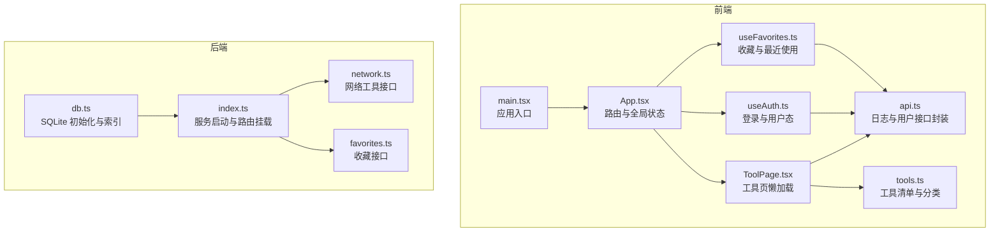
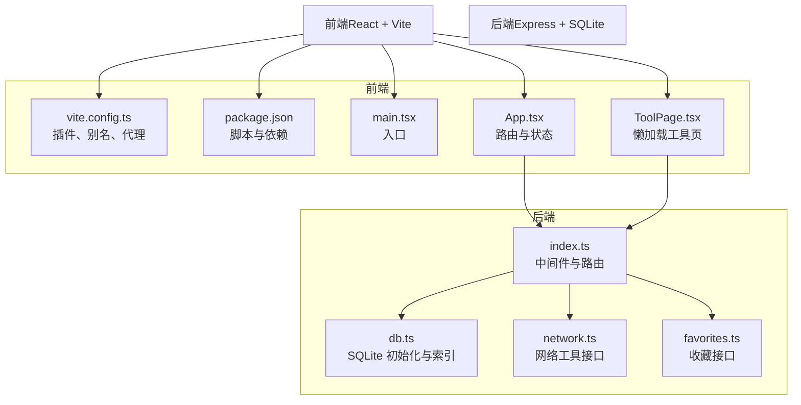
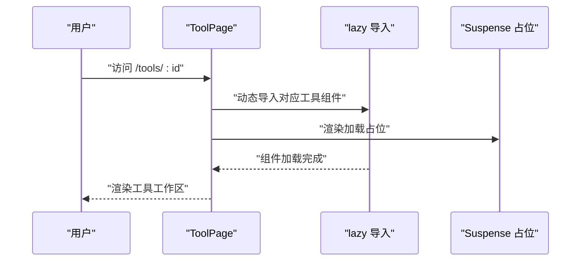
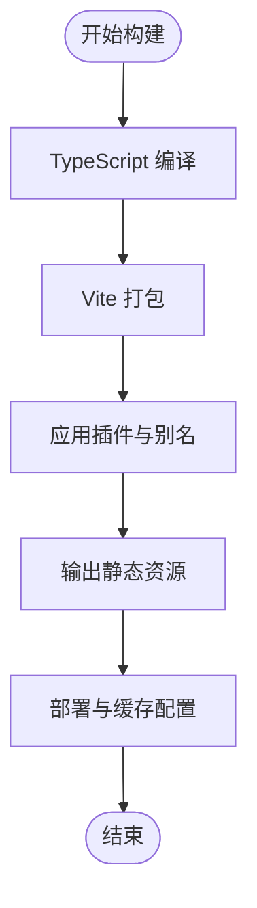
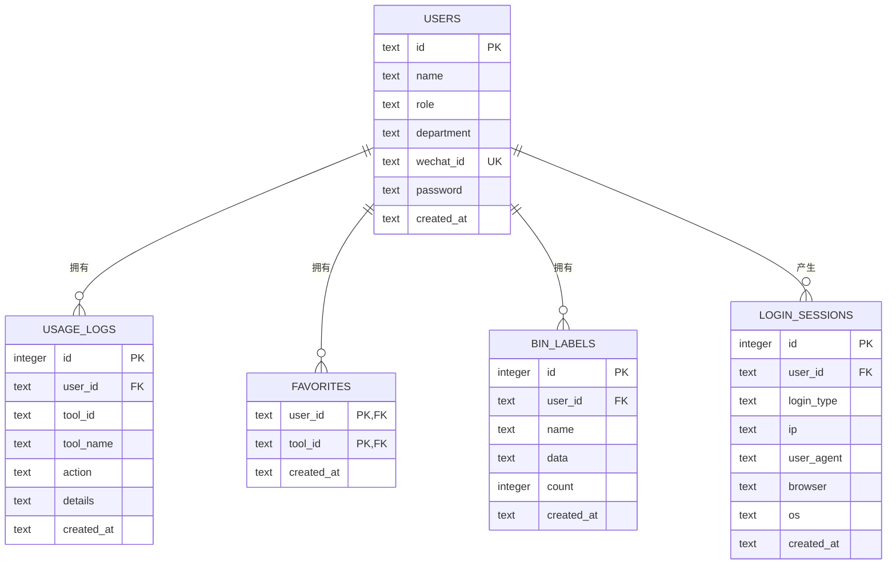
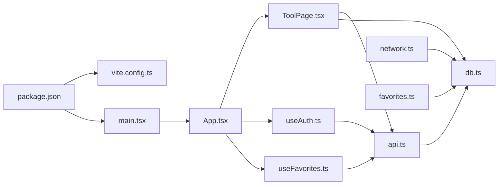

# 性能优化

<cite>
**本文引用的文件**
- [vite.config.ts](file://vite.config.ts)
- [package.json](file://package.json)
- [src/main.tsx](file://src/main.tsx)
- [src/App.tsx](file://src/App.tsx)
- [src/pages/ToolPage.tsx](file://src/pages/ToolPage.tsx)
- [src/hooks/useAuth.ts](file://src/hooks/useAuth.ts)
- [src/hooks/useFavorites.ts](file://src/hooks/useFavorites.ts)
- [src/lib/api.ts](file://src/lib/api.ts)
- [src/data/tools.ts](file://src/data/tools.ts)
- [server/src/index.ts](file://server/src/index.ts)
- [server/src/db.ts](file://server/src/db.ts)
- [server/src/routes/network.ts](file://server/src/routes/network.ts)
- [server/src/routes/favorites.ts](file://server/src/routes/favorites.ts)
</cite>

## 目录
1. [简介](#简介)
2. [项目结构](#项目结构)
3. [核心组件](#核心组件)
4. [架构总览](#架构总览)
5. [详细组件分析](#详细组件分析)
6. [依赖分析](#依赖分析)
7. [性能考量](#性能考量)
8. [故障排查指南](#故障排查指南)
9. [结论](#结论)
10. [附录](#附录)

## 简介
本指南围绕前端与后端的性能优化策略展开，结合当前仓库的实际实现，系统梳理以下主题：代码分割与懒加载（含工具组件按需加载）、缓存策略（浏览器缓存、API 缓存与数据库查询缓存）、构建优化（Vite 配置与生产优化）、内存管理与垃圾回收优化、性能监控与分析工具、数据库查询优化与索引设计、用户体验优化（加载状态与错误边界）。文档以“可操作”为目标，既适合技术读者深入理解，也便于非技术读者快速掌握关键实践。

## 项目结构
项目采用前后端分离架构：
- 前端基于 React + Vite，通过路由懒加载与 Suspense 提升首屏性能；工具页面对具体工具组件进行按需加载。
- 后端基于 Express，提供认证、日志、收藏、网络工具等接口，并使用 SQLite 存储与索引优化。

图表来源
- [src/main.tsx:1-14](file://src/main.tsx#L1-L14)
- [src/App.tsx:1-63](file://src/App.tsx#L1-L63)
- [src/pages/ToolPage.tsx:1-113](file://src/pages/ToolPage.tsx#L1-L113)
- [src/hooks/useAuth.ts:1-89](file://src/hooks/useAuth.ts#L1-L89)
- [src/hooks/useFavorites.ts:1-71](file://src/hooks/useFavorites.ts#L1-L71)
- [src/lib/api.ts:1-36](file://src/lib/api.ts#L1-L36)
- [src/data/tools.ts:1-316](file://src/data/tools.ts#L1-L316)
- [server/src/index.ts:1-31](file://server/src/index.ts#L1-L31)
- [server/src/db.ts:1-126](file://server/src/db.ts#L1-L126)
- [server/src/routes/network.ts:1-109](file://server/src/routes/network.ts#L1-L109)
- [server/src/routes/favorites.ts:1-31](file://server/src/routes/favorites.ts#L1-L31)

章节来源
- [src/main.tsx:1-14](file://src/main.tsx#L1-L14)
- [src/App.tsx:1-63](file://src/App.tsx#L1-L63)
- [server/src/index.ts:1-31](file://server/src/index.ts#L1-L31)

## 核心组件
- 应用入口与路由：应用入口负责挂载路由与根组件；App 统一注入主题、认证与收藏状态，简化子组件依赖。
- 工具页懒加载：ToolPage 对每个工具组件进行动态 import 并包裹 Suspense，仅在访问时加载对应模块，显著降低首屏包体。
- 登录与用户态：useAuth 封装登录流程、错误处理与本地持久化，避免重复请求与无效渲染。
- 收藏与最近使用：useFavorites 从后端拉取收藏列表，同时维护本地最近使用列表，减少重复网络请求。
- 日志与用户接口：api.ts 将日志上报与用户查询抽象为统一函数，便于集中埋点与错误处理。
- 工具清单：tools.ts 提供工具元数据与搜索过滤，支撑首页与仪表盘的高效展示。

章节来源
- [src/main.tsx:1-14](file://src/main.tsx#L1-L14)
- [src/App.tsx:1-63](file://src/App.tsx#L1-L63)
- [src/pages/ToolPage.tsx:1-113](file://src/pages/ToolPage.tsx#L1-L113)
- [src/hooks/useAuth.ts:1-89](file://src/hooks/useAuth.ts#L1-L89)
- [src/hooks/useFavorites.ts:1-71](file://src/hooks/useFavorites.ts#L1-L71)
- [src/lib/api.ts:1-36](file://src/lib/api.ts#L1-L36)
- [src/data/tools.ts:1-316](file://src/data/tools.ts#L1-L316)

## 架构总览
前端通过 Vite 构建，开发时启用 React 插件与路径别名；生产构建由 Vite 执行 TypeScript 编译与打包。后端 Express 提供 REST 接口，SQLite 作为轻量存储，配合索引提升查询性能。

图表来源
- [vite.config.ts:1-21](file://vite.config.ts#L1-L21)
- [package.json:1-34](file://package.json#L1-L34)
- [src/main.tsx:1-14](file://src/main.tsx#L1-L14)
- [src/App.tsx:1-63](file://src/App.tsx#L1-L63)
- [src/pages/ToolPage.tsx:1-113](file://src/pages/ToolPage.tsx#L1-L113)
- [server/src/index.ts:1-31](file://server/src/index.ts#L1-L31)
- [server/src/db.ts:1-126](file://server/src/db.ts#L1-L126)
- [server/src/routes/network.ts:1-109](file://server/src/routes/network.ts#L1-L109)
- [server/src/routes/favorites.ts:1-31](file://server/src/routes/favorites.ts#L1-L31)

## 详细组件分析

### 代码分割与懒加载（工具组件按需加载）
- 实现方式：ToolPage 使用 React.lazy 动态导入具体工具组件，并通过 Suspense 提供加载占位。
- 优势：仅在用户访问工具页时才加载对应组件，显著降低首屏 JS 体积与解析时间。
- 可扩展点：可引入 React.SuspenseList 或分组加载策略，进一步优化多个工具同时加载的体验。

图表来源
- [src/pages/ToolPage.tsx:1-113](file://src/pages/ToolPage.tsx#L1-L113)

章节来源
- [src/pages/ToolPage.tsx:11-38](file://src/pages/ToolPage.tsx#L11-L38)
- [src/pages/ToolPage.tsx:96-108](file://src/pages/ToolPage.tsx#L96-L108)

### 缓存策略
- 浏览器缓存
  - 静态资源：通过 Vite 生产构建默认开启文件指纹与压缩，建议在部署层设置合理的 Cache-Control 与 ETag。
  - HTML：index.html 通常不缓存或短缓存，确保更新及时生效。
- API 缓存
  - 前端：对不频繁变化的数据（如工具清单）可在业务层做内存缓存；对登录用户列表等可考虑短期缓存。
  - 后端：对热点查询（如收藏列表）可增加内存缓存或 Redis 缓存；对第三方接口（如 IP 查询）设置 TTL。
- 数据库查询缓存
  - 当前已建立多处索引（用户微信标识、日志用户/工具/时间、标签用户/时间、会话用户/时间），有助于加速查询。
  - 建议对高频查询（如按用户查询收藏）使用参数化查询与 LIMIT 控制结果集大小。

章节来源
- [src/hooks/useAuth.ts:30-35](file://src/hooks/useAuth.ts#L30-L35)
- [src/hooks/useFavorites.ts:23-32](file://src/hooks/useFavorites.ts#L23-L32)
- [server/src/db.ts:24-75](file://server/src/db.ts#L24-L75)
- [server/src/routes/network.ts:10-25](file://server/src/routes/network.ts#L10-L25)

### 构建优化（Vite 配置与生产优化）
- 插件与别名：已启用 @vitejs/plugin-react，配置路径别名 @ 指向 src，提升导入效率与可读性。
- 代理：开发阶段将 /api 代理到后端服务，避免跨域与调试复杂度。
- 生产构建：脚本先执行 TypeScript 编译再进行 Vite 打包，建议开启压缩与产物分析，识别大体积依赖。

图表来源
- [package.json:6-10](file://package.json#L6-L10)
- [vite.config.ts:1-21](file://vite.config.ts#L1-L21)

章节来源
- [package.json:6-10](file://package.json#L6-L10)
- [vite.config.ts:5-20](file://vite.config.ts#L5-L20)

### 内存管理与垃圾回收优化
- 减少不必要的状态与订阅：useAuth 与 useFavorites 中的副作用仅在必要时触发（如用户变更时拉取收藏）。
- 本地存储：合理使用 localStorage（如用户信息、最近使用），注意清理过期数据，避免占用过多内存。
- 组件卸载：确保长任务与定时器在组件卸载时清理，避免内存泄漏。
- 大对象处理：对大文本/二进制数据（如网络工具返回体）应限制截断长度，避免长时间驻留内存。

章节来源
- [src/hooks/useAuth.ts:30-35](file://src/hooks/useAuth.ts#L30-L35)
- [src/hooks/useFavorites.ts:60-67](file://src/hooks/useFavorites.ts#L60-L67)
- [server/src/routes/network.ts:89-94](file://server/src/routes/network.ts#L89-L94)

### 性能监控与分析工具
- 前端性能指标：使用浏览器开发者工具的 Performance、Memory、Network 面板；关注首次内容绘制（FCP）、最大内容绘制（LCP）、无害交互（INP）等。
- 构建分析：Vite 支持可视化分析插件，定位大体积依赖与重复模块。
- 后端性能：对慢查询与高延迟接口进行追踪，结合数据库 EXPLAIN 分析执行计划。
- 用户行为：通过日志接口（logUsage）收集工具使用情况，辅助优化热门工具的加载策略。

章节来源
- [src/lib/api.ts:3-19](file://src/lib/api.ts#L3-L19)
- [server/src/routes/network.ts:73-102](file://server/src/routes/network.ts#L73-L102)

### 数据库查询优化与索引设计
- 索引现状：用户表（微信标识）、日志表（用户/工具/时间）、标签表（用户/时间）、会话表（用户/时间）均已建立索引。
- 优化建议：
  - 对收藏查询（按用户）使用复合索引与 LIMIT。
  - 对日志查询（按用户/时间范围）使用覆盖索引与分页。
  - 对网络工具接口（IP/DNS/Ping/HTTP）尽量减少第三方调用频率，必要时加缓存与超时控制。

图表来源
- [server/src/db.ts:13-75](file://server/src/db.ts#L13-L75)

章节来源
- [server/src/db.ts:24-75](file://server/src/db.ts#L24-L75)

### 用户体验优化（加载状态与错误边界）
- 加载状态：工具页通过 Suspense 提供统一加载提示；登录页对 loading/error/newAccountInfo 进行明确反馈。
- 错误边界：对网络请求失败与第三方接口异常进行捕获与提示，避免页面崩溃。
- 交互反馈：按钮禁用、骨架屏、占位符等提升感知速度与可用性。

章节来源
- [src/pages/ToolPage.tsx:96-108](file://src/pages/ToolPage.tsx#L96-L108)
- [src/hooks/useAuth.ts:37-72](file://src/hooks/useAuth.ts#L37-L72)
- [src/hooks/useAuth.ts:74-79](file://src/hooks/useAuth.ts#L74-L79)

## 依赖分析
- 前端依赖：React、React Router、TailwindCSS 生态与少量工具库；Vite 与 @vitejs/plugin-react 提供开发与构建能力。
- 后端依赖：Express、CORS、better-sqlite3；路由模块化清晰，职责单一。
- 关键耦合点：前端通过 /api 前缀与后端通信；工具清单与路由 ID 强关联，懒加载组件名与工具 ID 保持一致。

图表来源
- [package.json:1-34](file://package.json#L1-L34)
- [vite.config.ts:1-21](file://vite.config.ts#L1-L21)
- [src/main.tsx:1-14](file://src/main.tsx#L1-L14)
- [src/App.tsx:1-63](file://src/App.tsx#L1-L63)
- [src/pages/ToolPage.tsx:1-113](file://src/pages/ToolPage.tsx#L1-L113)
- [src/hooks/useAuth.ts:1-89](file://src/hooks/useAuth.ts#L1-L89)
- [src/hooks/useFavorites.ts:1-71](file://src/hooks/useFavorites.ts#L1-L71)
- [src/lib/api.ts:1-36](file://src/lib/api.ts#L1-L36)
- [server/src/db.ts:1-126](file://server/src/db.ts#L1-L126)
- [server/src/routes/network.ts:1-109](file://server/src/routes/network.ts#L1-L109)
- [server/src/routes/favorites.ts:1-31](file://server/src/routes/favorites.ts#L1-L31)

章节来源
- [package.json:11-31](file://package.json#L11-L31)
- [server/src/index.ts:1-31](file://server/src/index.ts#L1-L31)

## 性能考量
- 首屏优化
  - 代码分割：工具页懒加载已实现；可进一步拆分通用 UI 组件与业务逻辑。
  - 静态资源：开启压缩与哈希命名，部署层设置强缓存策略。
- 网络优化
  - 前端：对不常变数据做内存缓存；对第三方接口设置超时与重试。
  - 后端：对热点接口加缓存；对长耗时任务异步化。
- 存储优化
  - 索引覆盖常见查询；对大字段（如日志详情）按需裁剪。
- 内存与 GC
  - 控制本地存储容量；避免大对象长期持有；及时清理定时器与订阅。
- 监控与分析
  - 前端：使用 Performance/Memory/Network；Vite 分析插件。
  - 后端：慢查询日志、接口耗时追踪、数据库 EXPLAIN。

## 故障排查指南
- 登录失败
  - 检查 /api/auth/login 的响应与错误信息；确认本地存储是否被清空。
- 收藏异常
  - 检查 /api/favorites 的 GET/POST/DELETE 请求与返回；确认用户 ID 有效。
- 工具页空白
  - 检查工具组件是否存在与懒加载是否成功；确认 Suspense 占位是否正常显示。
- 网络工具失败
  - 检查 /api/network 下各接口参数与第三方服务可用性；关注超时与截断逻辑。
- 数据库查询慢
  - 使用 EXPLAIN 分析执行计划；确认索引是否命中；必要时添加复合索引或改写查询。

章节来源
- [src/hooks/useAuth.ts:42-72](file://src/hooks/useAuth.ts#L42-L72)
- [src/hooks/useFavorites.ts:34-53](file://src/hooks/useFavorites.ts#L34-L53)
- [src/pages/ToolPage.tsx:96-108](file://src/pages/ToolPage.tsx#L96-L108)
- [server/src/routes/network.ts:10-63](file://server/src/routes/network.ts#L10-L63)
- [server/src/routes/favorites.ts:6-28](file://server/src/routes/favorites.ts#L6-L28)
- [server/src/db.ts:24-75](file://server/src/db.ts#L24-L75)

## 结论
本项目已在前端懒加载与后端索引方面打下良好基础。后续可在构建分析、API 缓存、数据库查询优化与监控体系上持续完善，以获得更优的首屏性能、运行时稳定性与可观测性。

## 附录
- 建议的生产部署清单
  - 前端：开启压缩、文件指纹、CDN 与缓存策略；配置健康检查。
  - 后端：连接池与超时配置、慢查询日志、限流与熔断。
- 常用工具
  - 前端：Vite 分析插件、浏览器 Performance/Memory/Network。
  - 后端：EXPLAIN、慢查询日志、APM（如 Prometheus + Grafana）。