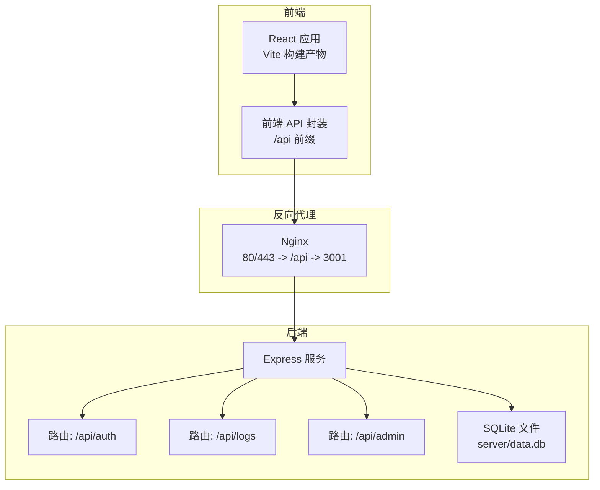
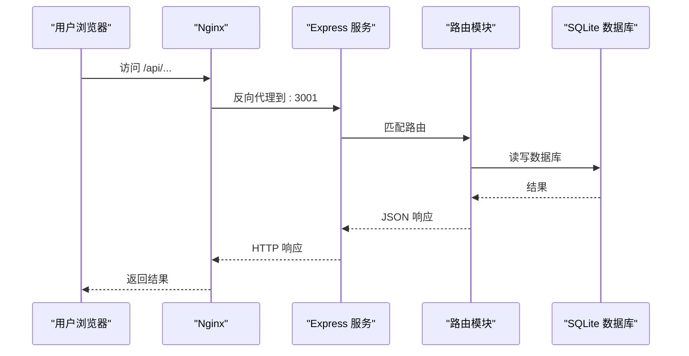
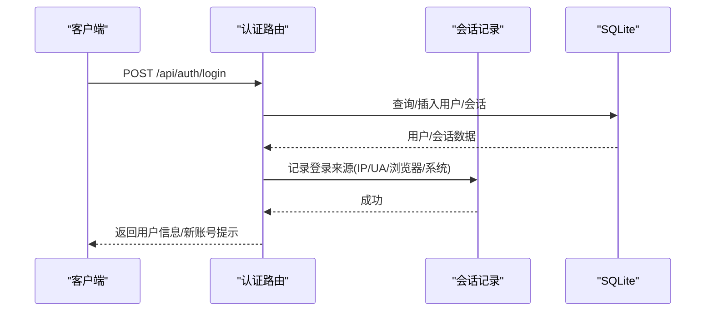
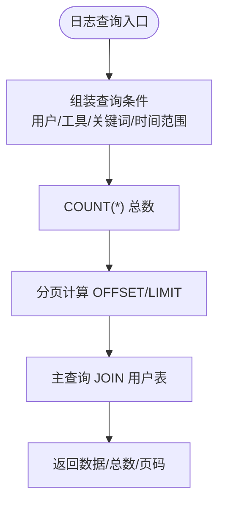
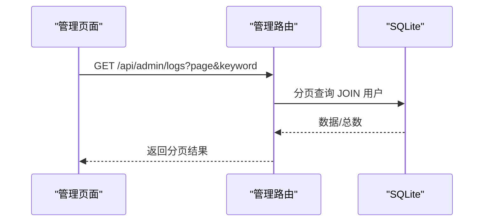
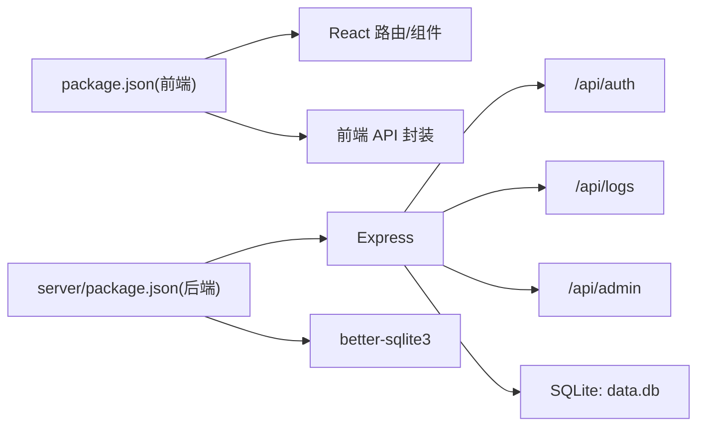
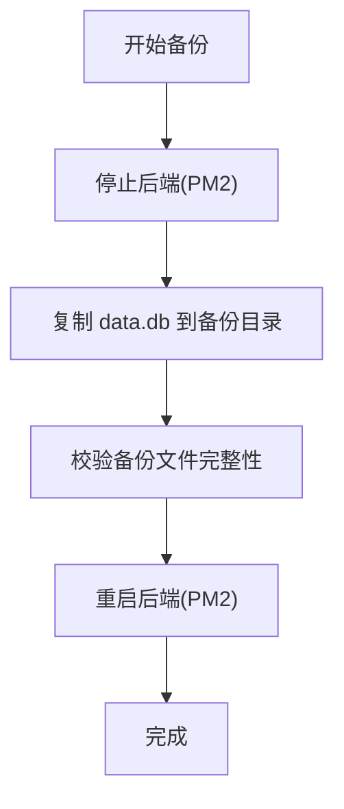

# 故障排除

<cite>
**本文引用的文件**
- [server/src/index.ts](file://server/src/index.ts)
- [server/src/db.ts](file://server/src/db.ts)
- [server/src/route/auth.ts](file://server/src/routes/auth.ts)
- [server/src/route/logs.ts](file://server/src/routes/logs.ts)
- [server/src/route/admin.ts](file://server/src/routes/admin.ts)
- [server/src/types.ts](file://server/src/types.ts)
- [server/package.json](file://server/package.json)
- [src/lib/api.ts](file://src/lib/api.ts)
- [src/hooks/useAuth.ts](file://src/hooks/useAuth.ts)
- [src/pages/LoginPage.tsx](file://src/pages/LoginPage.tsx)
- [src/pages/AdminPage.tsx](file://src/pages/AdminPage.tsx)
- [部署手册.md](file://部署手册.md)
</cite>

## 目录
1. [简介](#简介)
2. [项目结构](#项目结构)
3. [核心组件](#核心组件)
4. [架构总览](#架构总览)
5. [详细组件分析](#详细组件分析)
6. [依赖关系分析](#依赖关系分析)
7. [性能问题诊断](#性能问题诊断)
8. [网络问题诊断](#网络问题诊断)
9. [日志分析方法](#日志分析方法)
10. [系统监控与告警](#系统监控与告警)
11. [备份与恢复流程](#备份与恢复流程)
12. [结论](#结论)

## 简介
本指南面向开发者与运维人员，聚焦于启动失败、数据库连接问题、API 错误、前端/后端/数据库日志分析、性能问题（内存泄漏、慢查询、响应缓慢）、网络问题（跨域、代理配置）以及系统监控与告警、备份与恢复等场景，提供可操作的诊断步骤与排障建议。

## 项目结构
- 前端采用 React + Vite + TypeScript，通过相对路径调用后端 /api。
- 后端采用 Express + better-sqlite3，提供认证、日志、管理等接口，并内置健康检查端点。
- 部署手册定义了 Nginx 反向代理、PM2 运行、日志目录、备份策略与健康检查。

图表来源
- [server/src/index.ts:1-31](file://server/src/index.ts#L1-L31)
- [server/src/db.ts:1-126](file://server/src/db.ts#L1-L126)
- [server/src/routes/auth.ts:1-109](file://server/src/routes/auth.ts#L1-L109)
- [server/src/routes/logs.ts:1-134](file://server/src/routes/logs.ts#L1-L134)
- [server/src/routes/admin.ts:1-93](file://server/src/routes/admin.ts#L1-L93)
- [src/lib/api.ts:1-36](file://src/lib/api.ts#L1-L36)

章节来源
- [server/src/index.ts:1-31](file://server/src/index.ts#L1-L31)
- [server/src/db.ts:1-126](file://server/src/db.ts#L1-L126)
- [src/lib/api.ts:1-36](file://src/lib/api.ts#L1-L36)
- [部署手册.md:117-167](file://部署手册.md#L117-L167)

## 核心组件
- 启动与路由注册：后端在启动时加载 CORS、JSON 中间件与各路由模块，并提供 /api/health 健康检查。
- 数据库：better-sqlite3 打开本地 data.db，启用 WAL 与外键约束，初始化用户、日志、收藏、标签与登录会话表，并在空库时注入示例数据。
- 认证与会话：支持游客、密码、企微三种登录方式，记录登录来源信息（IP、UA、浏览器、系统）。
- 日志与统计：提供使用日志的增删改查、聚合统计与分页查询。
- 管理后台：基于 x-user-id 请求头进行鉴权，提供用户管理、登录会话查看、全站操作日志查看。
- 前端 API：统一通过 /api 前缀发起请求，封装登录、用户列表、使用日志上报等。

章节来源
- [server/src/index.ts:1-31](file://server/src/index.ts#L1-L31)
- [server/src/db.ts:1-126](file://server/src/db.ts#L1-L126)
- [server/src/routes/auth.ts:1-109](file://server/src/routes/auth.ts#L1-L109)
- [server/src/routes/logs.ts:1-134](file://server/src/routes/logs.ts#L1-L134)
- [server/src/routes/admin.ts:1-93](file://server/src/routes/admin.ts#L1-L93)
- [src/lib/api.ts:1-36](file://src/lib/api.ts#L1-L36)

## 架构总览
后端服务通过 Nginx 提供统一入口，静态资源由 Nginx 直接提供，/api 前缀转发至后端。后端内部按模块划分路由，数据库为本地 SQLite 文件。

图表来源
- [server/src/index.ts:17-26](file://server/src/index.ts#L17-L26)
- [server/src/routes/auth.ts:36-106](file://server/src/routes/auth.ts#L36-L106)
- [server/src/routes/logs.ts:8-18](file://server/src/routes/logs.ts#L8-L18)
- [server/src/routes/admin.ts:18-90](file://server/src/routes/admin.ts#L18-L90)
- [server/src/db.ts:8](file://server/src/db.ts#L8)

## 详细组件分析

### 启动与健康检查
- 启动流程：加载 CORS、JSON 中间件，挂载各路由，监听端口并打印日志。
- 健康检查：/api/health 返回服务状态与当前时间，用于探活。
- 常见问题：端口占用、CORS 配置不当、中间件顺序导致的解析异常。

章节来源
- [server/src/index.ts:10-30](file://server/src/index.ts#L10-L30)
- [部署手册.md:391-407](file://部署手册.md#L391-L407)

### 认证与登录
- 支持游客、密码、企微三种登录方式；记录登录来源信息。
- 登录成功后前端缓存用户信息，后续管理接口携带 x-user-id 头进行鉴权。
- 常见问题：参数缺失、用户不存在、密码校验失败、企微绑定异常。

图表来源
- [server/src/routes/auth.ts:36-106](file://server/src/routes/auth.ts#L36-L106)
- [server/src/db.ts:24-29](file://server/src/db.ts#L24-L29)

章节来源
- [server/src/routes/auth.ts:1-109](file://server/src/routes/auth.ts#L1-L109)
- [src/hooks/useAuth.ts:37-72](file://src/hooks/useAuth.ts#L37-L72)
- [src/pages/LoginPage.tsx:30-39](file://src/pages/LoginPage.tsx#L30-L39)

### 日志与统计
- 日志上报：前端通过 /api/logs POST 上报使用日志。
- 日志查询：支持按用户、工具、关键词、时间范围分页查询。
- 统计接口：提供当日/周/月用量、热门工具、趋势、最近日志、活跃用户等。
- 常见问题：必填字段缺失、查询条件非法、索引缺失导致慢查询。

图表来源
- [server/src/routes/logs.ts:21-69](file://server/src/routes/logs.ts#L21-L69)
- [server/src/db.ts:26-75](file://server/src/db.ts#L26-L75)

章节来源
- [server/src/routes/logs.ts:1-134](file://server/src/routes/logs.ts#L1-L134)
- [src/lib/api.ts:3-19](file://src/lib/api.ts#L3-L19)

### 管理后台
- 鉴权：要求请求头 x-user-id 对应用户为 admin。
- 用户管理：增删改查用户，支持分页。
- 登录会话：查看登录来源与设备信息。
- 全站日志：按关键词检索全站使用日志。
- 常见问题：缺少 x-user-id、非管理员访问、分页参数越界。

图表来源
- [src/pages/AdminPage.tsx:92-100](file://src/pages/AdminPage.tsx#L92-L100)
- [server/src/routes/admin.ts:69-90](file://server/src/routes/admin.ts#L69-L90)

章节来源
- [server/src/routes/admin.ts:1-93](file://server/src/routes/admin.ts#L1-L93)
- [src/pages/AdminPage.tsx:1-353](file://src/pages/AdminPage.tsx#L1-L353)

## 依赖关系分析
- 后端依赖：Express、CORS、better-sqlite3。
- 前端依赖：React、React Router、Tailwind 等。
- 关键耦合点：前端 /api 前缀必须与 Nginx 反代一致；后端路由与数据库表结构强相关。

图表来源
- [server/package.json:10-21](file://server/package.json#L10-L21)
- [src/lib/api.ts:1-36](file://src/lib/api.ts#L1-L36)
- [server/src/index.ts:17-22](file://server/src/index.ts#L17-L22)

章节来源
- [server/package.json:1-23](file://server/package.json#L1-L23)
- [package.json:1-34](file://package.json#L1-L34)

## 性能问题诊断
- 内存泄漏
  - 症状：进程内存持续上涨，PM2 报错重启。
  - 排查：检查后端是否持有长生命周期对象、事件未清理、定时器未释放；关注大对象序列化与日志风暴。
  - 建议：启用 PM2 内存阈值重启；对高频日志降级；避免在循环中创建大数组。
- 慢查询
  - 症状：/api/logs、/api/admin/logs 响应缓慢。
  - 排查：确认查询条件是否命中索引；检查是否遗漏索引；避免 SELECT *；优化 LIKE 百分号开头的模糊查询。
  - 建议：为常用过滤字段建立索引；限制分页大小；对趋势/统计类查询增加时间窗口。
- API 响应缓慢
  - 症状：登录、日志上报、管理查询延迟高。
  - 排查：Nginx 超时设置、后端 CPU/IO 压力、数据库锁竞争。
  - 建议：开启后端日志采样；拆分统计查询；合理设置 proxy_read_timeout。

章节来源
- [server/src/routes/logs.ts:21-69](file://server/src/routes/logs.ts#L21-L69)
- [server/src/db.ts:26-75](file://server/src/db.ts#L26-L75)
- [部署手册.md:170-227](file://部署手册.md#L170-L227)

## 网络问题诊断
- 跨域(CORS)错误
  - 症状：浏览器控制台报跨域拒绝。
  - 排查：检查后端 CORS_ORIGIN 是否与前端域名一致；生产环境建议限定具体域名。
  - 建议：后端设置 CORS_ORIGIN 为 https://your-domain.com；前后端保持一致。
- 代理配置错误
  - 症状：前端 404、无法连接到 /api。
  - 排查：确认 Nginx /api location 是否指向 127.0.0.1:3001；确认 try_files 配置；确认 PM2 正常运行。
  - 建议：按部署手册校验 Nginx 配置；使用 curl http://localhost/api/health 验证后端可达。
- 健康检查
  - 建议：部署后执行健康检查端点验证。

章节来源
- [server/src/index.ts:12-14](file://server/src/index.ts#L12-L14)
- [部署手册.md:117-167](file://部署手册.md#L117-L167)
- [部署手册.md:391-407](file://部署手册.md#L391-L407)

## 日志分析方法
- 前端错误日志
  - 来源：浏览器控制台与应用内错误提示。
  - 排查：登录失败错误、网络错误提示、页面空白等。
- 后端服务日志
  - 来源：PM2 日志（/var/log/toolbox/）与后端控制台输出。
  - 排查：启动失败、端口占用、路由错误、数据库异常。
- 数据库日志
  - 来源：SQLite 文件变更与事务日志（WAL 模式）。
  - 排查：锁等待、写放大、磁盘空间不足。
- 日志采集建议
  - 前端：捕获 fetch 异常与登录错误；记录关键操作埋点。
  - 后端：记录请求耗时、错误堆栈、关键 SQL；限制日志级别。

章节来源
- [src/hooks/useAuth.ts:48-68](file://src/hooks/useAuth.ts#L48-L68)
- [src/lib/api.ts:16-18](file://src/lib/api.ts#L16-L18)
- [部署手册.md:185-227](file://部署手册.md#L185-L227)
- [server/src/db.ts:9](file://server/src/db.ts#L9)

## 系统监控与告警
- 进程与资源
  - PM2：监控进程状态、内存、CPU；设置最大内存重启。
  - Nginx：监控连接数、请求状态码、响应时间。
- 健康检查
  - /api/health：可用性探针；结合外部探活工具。
- 告警建议
  - 进程离线、内存超阈、5xx 比例升高、响应时间 P95 超阈、数据库锁等待。

章节来源
- [部署手册.md:185-227](file://部署手册.md#L185-L227)
- [server/src/index.ts:24-26](file://server/src/index.ts#L24-L26)

## 备份与恢复流程
- 备份
  - 建议每日定时备份 data.db；保留最近若干份以便回滚。
- 恢复
  - 停止后端 -> 替换 data.db -> 启动后端。
- 定时任务
  - 使用 crontab 设置定时备份与过期清理。

图表来源
- [部署手册.md:289-329](file://部署手册.md#L289-L329)

章节来源
- [部署手册.md:289-329](file://部署手册.md#L289-L329)

## 结论
通过明确的启动流程、路由职责、数据库结构与部署架构，结合健康检查、日志采集与 PM2 监控，可快速定位启动失败、数据库连接问题、API 错误、跨域与代理配置、性能瓶颈与备份恢复等常见问题。建议在生产环境严格限制 CORS、启用定时备份、设置 PM2 内存阈值与探活，并持续观察关键指标以预防性维护。