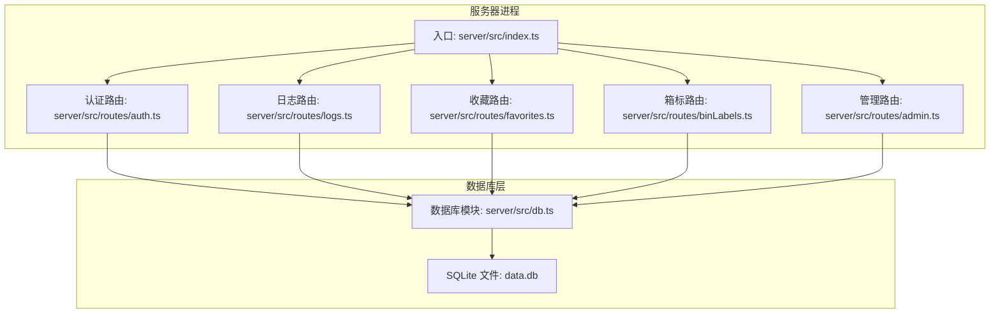
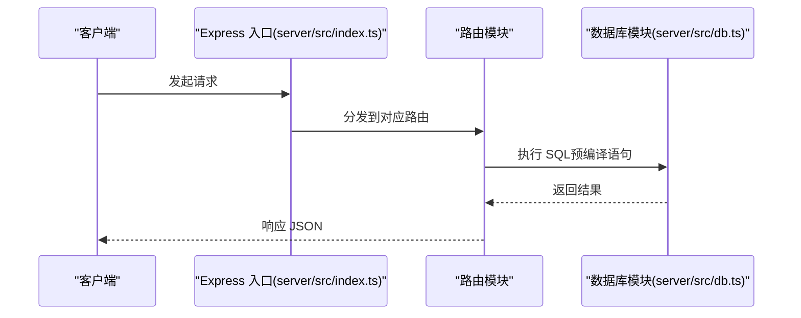
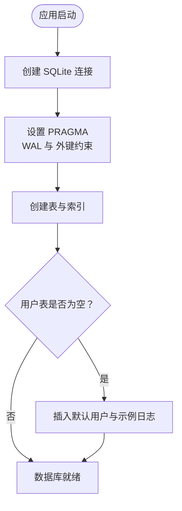
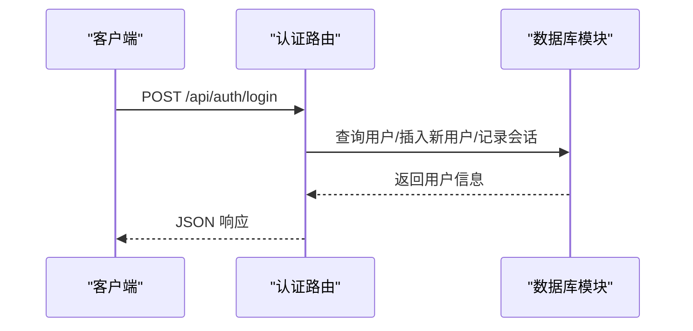
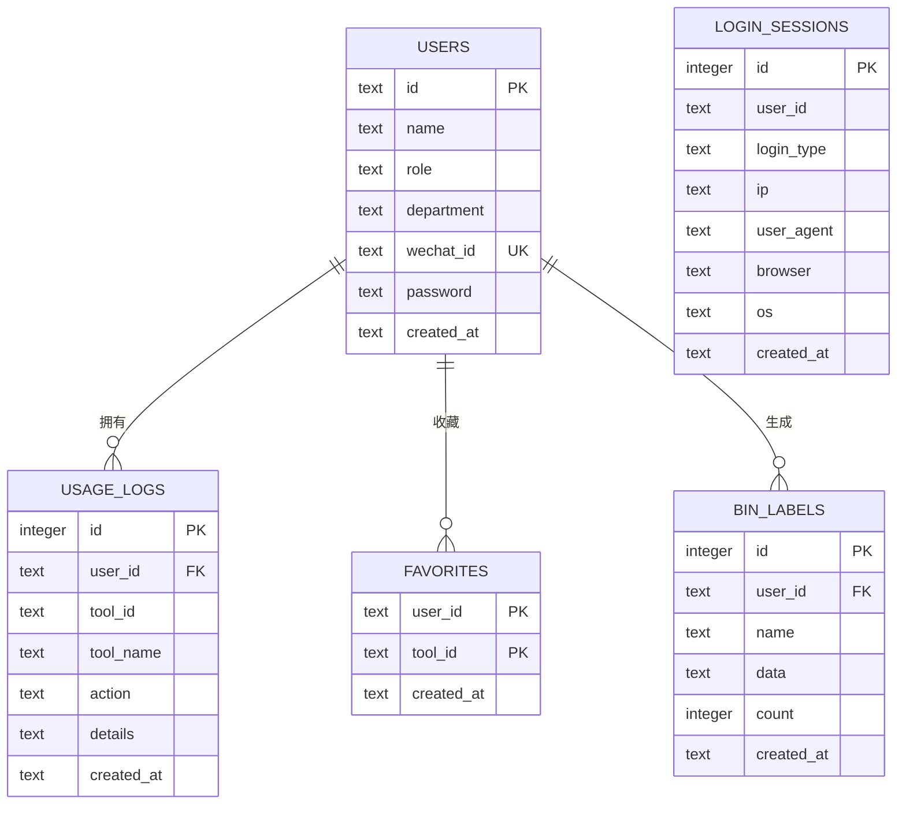
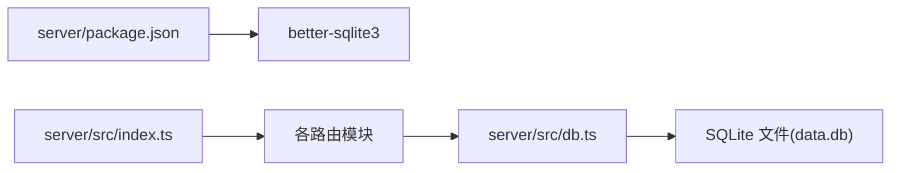

# 数据库架构

<cite>
**本文引用的文件**
- [server/src/db.ts](file://server/src/db.ts)
- [server/src/index.ts](file://server/src/index.ts)
- [server/src/routes/auth.ts](file://server/src/routes/auth.ts)
- [server/src/routes/logs.ts](file://server/src/routes/logs.ts)
- [server/src/routes/favorites.ts](file://server/src/routes/favorites.ts)
- [server/src/routes/binLabels.ts](file://server/src/routes/binLabels.ts)
- [server/src/routes/admin.ts](file://server/src/routes/admin.ts)
- [server/src/types.ts](file://server/src/types.ts)
- [server/package.json](file://server/package.json)
</cite>

## 目录
1. [引言](#引言)
2. [项目结构](#项目结构)
3. [核心组件](#核心组件)
4. [架构总览](#架构总览)
5. [详细组件分析](#详细组件分析)
6. [依赖关系分析](#依赖关系分析)
7. [性能考虑](#性能考虑)
8. [故障排查指南](#故障排查指南)
9. [结论](#结论)
10. [附录](#附录)

## 引言
本文件系统性梳理后端服务的数据库架构与实现，重点围绕 SQLite 的整体设计与配置展开，涵盖数据库连接与初始化、WAL 模式与外键约束的启用原因与影响、PRAGMA 性能参数的作用、数据库文件路径与初始化流程、连接管理与事务处理最佳实践，以及备份与恢复策略与生产部署注意事项。内容基于仓库中的实际实现进行归纳总结，帮助读者快速理解并安全地维护该数据库方案。

## 项目结构
后端采用 Express 提供 API，数据库通过 better-sqlite3 连接本地 SQLite 文件。数据库初始化在应用启动阶段完成，随后各路由模块按需读写数据表。

图表来源
- [server/src/index.ts:1-31](file://server/src/index.ts#L1-L31)
- [server/src/db.ts:1-126](file://server/src/db.ts#L1-L126)

章节来源
- [server/src/index.ts:1-31](file://server/src/index.ts#L1-L31)
- [server/src/db.ts:1-126](file://server/src/db.ts#L1-L126)

## 核心组件
- 数据库模块：负责连接 SQLite、设置 PRAGMA、创建表与索引、初始化种子数据，并导出连接实例供路由使用。
- 路由模块：按业务拆分，分别处理用户登录、使用日志、收藏、箱标记录与管理员功能，所有路由均通过统一的 db 实例访问数据库。
- 类型定义：集中声明数据库实体与查询参数类型，确保前后端交互一致性。

章节来源
- [server/src/db.ts:1-126](file://server/src/db.ts#L1-L126)
- [server/src/routes/auth.ts:1-109](file://server/src/routes/auth.ts#L1-L109)
- [server/src/routes/logs.ts:1-134](file://server/src/routes/logs.ts#L1-L134)
- [server/src/routes/favorites.ts:1-31](file://server/src/routes/favorites.ts#L1-L31)
- [server/src/routes/binLabels.ts:1-65](file://server/src/routes/binLabels.ts#L1-L65)
- [server/src/routes/admin.ts:1-93](file://server/src/routes/admin.ts#L1-L93)
- [server/src/types.ts:1-46](file://server/src/types.ts#L1-L46)

## 架构总览
数据库层采用单实例连接模式，所有路由共享同一连接；通过 PRAGMA 启用 WAL 与外键约束；在首次启动时自动建表、建索引并填充示例数据；路由层通过预编译语句执行读写操作；管理员路由在内部校验权限后再访问数据库。

图表来源
- [server/src/index.ts:17-22](file://server/src/index.ts#L17-L22)
- [server/src/routes/auth.ts:36-106](file://server/src/routes/auth.ts#L36-L106)
- [server/src/db.ts:8-75](file://server/src/db.ts#L8-L75)

## 详细组件分析

### 数据库模块（连接、初始化与 PRAGMA）
- 连接与路径
  - 使用 better-sqlite3 创建连接，数据库文件位于 server/data.db。
  - 通过相对路径拼接定位文件，便于打包与部署。
- PRAGMA 设置
  - 启用 WAL 模式：提升并发读写能力，降低锁竞争。
  - 启用外键约束：保证参照完整性，避免脏数据。
- 表与索引
  - 用户表、使用日志表、收藏表、箱标记录表、登录会话表。
  - 为高频查询字段建立索引，如微信标识、日志用户/工具/时间等。
- 初始化流程
  - 若用户表为空，则插入默认用户与示例日志数据。
  - 示例日志通过事务批量插入，减少提交开销。

图表来源
- [server/src/db.ts:8-126](file://server/src/db.ts#L8-L126)

章节来源
- [server/src/db.ts:6-126](file://server/src/db.ts#L6-L126)

### 路由与数据库交互（认证、日志、收藏、箱标、管理）
- 认证路由
  - 支持访客、微信与密码三种登录方式；登录成功后记录会话信息。
  - 通过预编译语句查询与插入，避免注入风险。
- 日志路由
  - 支持新增日志、分页查询与多条件过滤、统计聚合与趋势分析。
  - 使用 LEFT JOIN 关联用户信息，返回完整上下文。
- 收藏路由
  - 提供查询、添加与删除收藏，使用 INSERT OR IGNORE 避免重复。
- 箱标路由
  - 提供查询、详情、保存与删除，按用户维度隔离数据。
- 管理路由
  - 管理员中间件校验角色；支持用户管理、登录会话查询与全站日志查看。

图表来源
- [server/src/routes/auth.ts:36-106](file://server/src/routes/auth.ts#L36-L106)
- [server/src/db.ts:24-29](file://server/src/db.ts#L24-L29)

章节来源
- [server/src/routes/auth.ts:1-109](file://server/src/routes/auth.ts#L1-L109)
- [server/src/routes/logs.ts:1-134](file://server/src/routes/logs.ts#L1-L134)
- [server/src/routes/favorites.ts:1-31](file://server/src/routes/favorites.ts#L1-L31)
- [server/src/routes/binLabels.ts:1-65](file://server/src/routes/binLabels.ts#L1-L65)
- [server/src/routes/admin.ts:1-93](file://server/src/routes/admin.ts#L1-L93)

### 数据模型与索引设计
- 用户表：主键 id，唯一微信标识，角色与部门字段，带默认时间戳。
- 使用日志表：外键关联用户，复合查询字段丰富，建立多维索引。
- 收藏表：联合主键(user_id, tool_id)，外键约束。
- 箱标记录表：外键关联用户，时间与用户维度索引。
- 登录会话表：记录登录来源与设备信息，便于审计与分析。

图表来源
- [server/src/db.ts:13-75](file://server/src/db.ts#L13-L75)

章节来源
- [server/src/db.ts:13-75](file://server/src/db.ts#L13-L75)

## 依赖关系分析
- 数据库驱动：better-sqlite3，提供高性能同步接口。
- 依赖版本：在 server/package.json 中声明，开发与运行时均使用相同版本。
- 运行入口：index.ts 注册路由并监听端口，不直接耦合数据库逻辑。

图表来源
- [server/package.json:10-13](file://server/package.json#L10-L13)
- [server/src/index.ts:17-22](file://server/src/index.ts#L17-L22)
- [server/src/db.ts:1-126](file://server/src/db.ts#L1-L126)

章节来源
- [server/package.json:1-23](file://server/package.json#L1-L23)
- [server/src/index.ts:1-31](file://server/src/index.ts#L1-L31)
- [server/src/db.ts:1-126](file://server/src/db.ts#L1-L126)

## 性能考虑
- PRAGMA 设置
  - WAL 模式：允许多个读取器与一个写入器并发工作，显著提升高并发场景下的吞吐量，降低锁等待。
  - 外键约束：在插入/更新时强制参照完整性，避免脏数据，但可能带来少量写入开销；建议配合合适的索引平衡查询性能。
- 索引策略
  - 对高频过滤字段（如 wechat_id、user_id、tool_id、created_at）建立索引，可有效降低查询成本。
- 事务批处理
  - 初始化示例数据使用事务，减少多次提交带来的磁盘写入与日志开销。
- 预编译语句
  - 所有路由均使用预编译语句执行 SQL，避免 SQL 注入并复用执行计划，提高稳定性与性能。
- 查询限制
  - 日志查询支持分页与最大页大小限制，防止大查询导致资源耗尽。

章节来源
- [server/src/db.ts:9-11](file://server/src/db.ts#L9-L11)
- [server/src/db.ts:24-75](file://server/src/db.ts#L24-L75)
- [server/src/db.ts:109-122](file://server/src/db.ts#L109-L122)
- [server/src/routes/logs.ts:28-29](file://server/src/routes/logs.ts#L28-L29)
- [server/src/routes/logs.ts:64-66](file://server/src/routes/logs.ts#L64-L66)

## 故障排查指南
- 连接失败
  - 检查 data.db 文件是否存在且可写；确认 server/data.db 路径正确。
  - 确认 better-sqlite3 版本与 Node 环境兼容。
- 外键约束错误
  - 插入或删除时若提示外键约束失败，请检查关联字段是否正确、被引用记录是否存在。
- 查询性能问题
  - 确认相关字段已建立索引；避免在大结果集上进行无索引的 LIKE 或排序。
- 事务未生效
  - 确认使用了事务包装批量写入；检查异常是否提前退出导致回滚。
- 权限不足
  - 管理员接口需要携带正确的用户标识并通过角色校验，否则返回 401/403。

章节来源
- [server/src/db.ts:8-126](file://server/src/db.ts#L8-L126)
- [server/src/routes/admin.ts:8-14](file://server/src/routes/admin.ts#L8-L14)

## 结论
该数据库架构以 SQLite 为核心，借助 better-sqlite3 提供稳定高效的本地存储。通过 WAL 模式与外键约束提升并发与一致性，配合合理的索引与事务策略满足日常业务需求。路由层以预编译语句与分页限制保障安全性与性能。建议在生产中结合备份与监控策略，持续评估性能瓶颈并迭代优化。

## 附录

### 数据库连接与初始化流程
- 连接：创建连接并设置 PRAGMA。
- 初始化：创建表与索引；若用户表为空则填充默认数据。
- 导出：将连接实例导出供路由模块使用。

章节来源
- [server/src/db.ts:8-126](file://server/src/db.ts#L8-L126)

### PRAGMA 配置说明
- WAL 模式：提升并发读写能力，降低锁竞争。
- 外键约束：保证参照完整性，避免脏数据。

章节来源
- [server/src/db.ts:9-11](file://server/src/db.ts#L9-L11)

### 数据库文件路径与部署
- 文件位置：server/data.db。
- 部署建议：确保容器/服务器对该目录具有读写权限；在容器内可通过挂载卷持久化该文件。

章节来源
- [server/src/db.ts:6](file://server/src/db.ts#L6)

### 事务处理最佳实践
- 批量写入使用事务封装，减少提交次数。
- 在路由中对关键写操作使用事务，保证原子性。
- 对于只读查询不开启事务，避免不必要的锁持有。

章节来源
- [server/src/db.ts:109-122](file://server/src/db.ts#L109-L122)

### 备份与恢复策略
- 备份：定期复制 data.db 文件；在应用空闲时段执行备份，或使用数据库层快照（SQLite 支持热备份）。
- 恢复：停止服务后替换 data.db，重启服务验证可用性；对备份进行校验与归档。

[本节为通用运维建议，不直接分析具体文件]

### 生产环境部署注意事项
- 权限与隔离：仅授予最小必要权限；避免将 data.db 暴露在公网。
- 监控与告警：关注磁盘空间、文件锁状态与慢查询。
- 备份策略：制定自动化备份与恢复演练计划。
- 升级与迁移：变更表结构前先备份；使用只增不改的方式推进迁移。

[本节为通用运维建议，不直接分析具体文件]