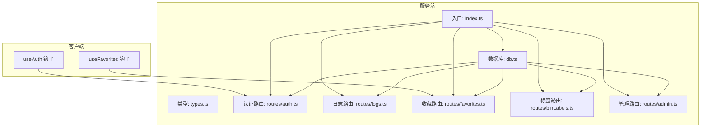
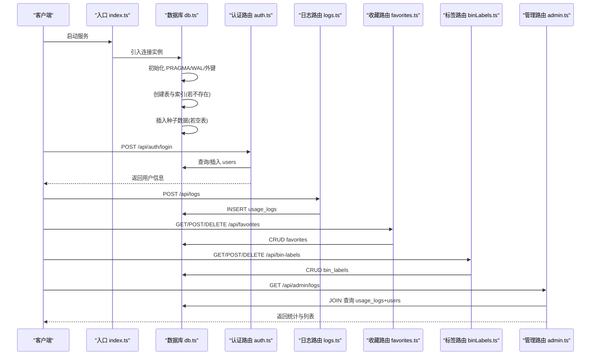
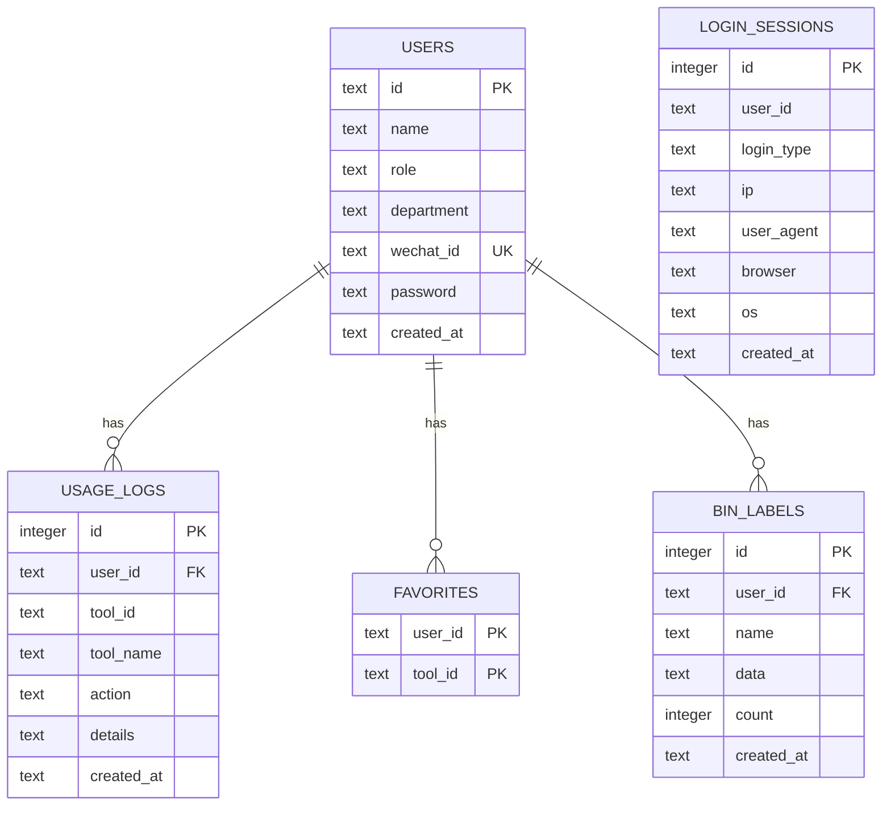

# 数据库设计

<cite>
**本文引用的文件**
- [server/src/db.ts](file://server/src/db.ts)
- [server/src/types.ts](file://server/src/types.ts)
- [server/src/index.ts](file://server/src/index.ts)
- [server/src/routes/auth.ts](file://server/src/routes/auth.ts)
- [server/src/routes/logs.ts](file://server/src/routes/logs.ts)
- [server/src/routes/favorites.ts](file://server/src/routes/favorites.ts)
- [server/src/routes/binLabels.ts](file://server/src/routes/binLabels.ts)
- [server/src/routes/admin.ts](file://server/src/routes/admin.ts)
- [src/hooks/useAuth.ts](file://src/hooks/useAuth.ts)
- [src/hooks/useFavorites.ts](file://src/hooks/useFavorites.ts)
</cite>

## 目录
1. [简介](#简介)
2. [项目结构](#项目结构)
3. [核心组件](#核心组件)
4. [架构总览](#架构总览)
5. [详细组件分析](#详细组件分析)
6. [依赖分析](#依赖分析)
7. [性能考虑](#性能考虑)
8. [故障排查指南](#故障排查指南)
9. [结论](#结论)
10. [附录](#附录)

## 简介
本文件系统性梳理了基于 SQLite 的数据库设计与实现，涵盖表结构、关系设计、索引优化、数据访问模式、ORM 使用方式、查询优化策略、初始化与迁移机制，以及备份与恢复最佳实践。目标是帮助开发者快速理解并维护该数据库层，同时为后续扩展提供清晰的参考。

## 项目结构
数据库层位于服务端目录，采用“单文件初始化 + 路由模块化”的组织方式：
- 初始化与建表：server/src/db.ts
- 类型定义：server/src/types.ts
- 路由聚合：server/src/index.ts
- 功能路由：auth、logs、favorites、binLabels、admin
- 前端集成：src/hooks/*（调用 API）

图表来源
- [server/src/index.ts:1-31](file://server/src/index.ts#L1-L31)
- [server/src/db.ts:1-126](file://server/src/db.ts#L1-L126)

章节来源
- [server/src/index.ts:1-31](file://server/src/index.ts#L1-L31)
- [server/src/db.ts:1-126](file://server/src/db.ts#L1-L126)

## 核心组件
- 数据库连接与初始化：在 db.ts 中创建 SQLite 连接，启用 WAL 模式与外键约束，并一次性执行建表与索引创建。
- 表与索引：users、usage_logs、favorites、bin_labels、login_sessions。
- 类型定义：DbUser、DbUsageLog、LogQuery、StatsQuery、DbLoginSession。
- 路由层：认证、日志、收藏、标签、管理等 API。
- 前端钩子：useAuth、useFavorites 通过 /api/* 接口与后端交互。

章节来源
- [server/src/db.ts:1-126](file://server/src/db.ts#L1-L126)
- [server/src/types.ts:1-46](file://server/src/types.ts#L1-L46)
- [server/src/index.ts:1-31](file://server/src/index.ts#L1-L31)

## 架构总览
数据库层采用“集中初始化 + 多路由共享连接”的模式：
- 单例连接：db.ts 导出全局连接实例，所有路由共享。
- 建表与索引：首次启动时自动创建表与索引；若已存在则跳过。
- 种子数据：当 users 表为空时插入示例用户与使用日志，便于演示。
- 外键约束：启用 foreign_keys 并在相关表上建立外键关系，确保参照完整性。
- 查询优化：针对高频查询字段建立索引，如 users.wechat_id、logs.user_id、logs.tool_id、logs.created_at 等。

图表来源
- [server/src/index.ts:1-31](file://server/src/index.ts#L1-L31)
- [server/src/db.ts:1-126](file://server/src/db.ts#L1-L126)
- [server/src/routes/auth.ts:1-109](file://server/src/routes/auth.ts#L1-L109)
- [server/src/routes/logs.ts:1-134](file://server/src/routes/logs.ts#L1-L134)
- [server/src/routes/favorites.ts:1-31](file://server/src/routes/favorites.ts#L1-L31)
- [server/src/routes/binLabels.ts:1-65](file://server/src/routes/binLabels.ts#L1-L65)
- [server/src/routes/admin.ts:1-93](file://server/src/routes/admin.ts#L1-L93)

## 详细组件分析

### 用户表（users）
- 主键：id（TEXT，主键）
- 字段与约束：
  - name：NOT NULL
  - role：CHECK 在 ('user','admin')
  - department：可空
  - wechat_id：UNIQUE（可空）
  - password：可空
  - created_at：默认当前本地时间
- 索引：idx_users_wechat(wechat_id)，用于按微信 ID 快速查找。
- 典型用途：存储用户身份、角色、绑定信息与创建时间。
- 关系：被 usage_logs、favorites、bin_labels、login_sessions 通过 user_id 外键引用。

章节来源
- [server/src/db.ts:14-22](file://server/src/db.ts#L14-L22)
- [server/src/db.ts:24](file://server/src/db.ts#L24)
- [server/src/types.ts:1-9](file://server/src/types.ts#L1-L9)

### 使用日志表（usage_logs）
- 主键：id（INTEGER，自增）
- 字段与约束：
  - user_id：NOT NULL，外键 references users(id)
  - tool_id、tool_name、action：NOT NULL
  - details：可空
  - created_at：默认当前本地时间
- 索引：idx_logs_user(user_id)、idx_logs_tool(tool_id)、idx_logs_time(created_at)
- 典型用途：记录用户对工具的操作行为（打开/执行等），支持分页、关键词过滤、时间范围筛选与聚合统计。
- 关系：与 users 通过 user_id 关联，形成“用户-操作”关系。

章节来源
- [server/src/db.ts:26-35](file://server/src/db.ts#L26-L35)
- [server/src/db.ts:37-39](file://server/src/db.ts#L37-L39)
- [server/src/types.ts:11-19](file://server/src/types.ts#L11-L19)
- [server/src/routes/logs.ts:20-69](file://server/src/routes/logs.ts#L20-L69)

### 收藏表（favorites）
- 主键：复合主键 (user_id, tool_id)
- 字段与约束：
  - user_id：NOT NULL，外键 references users(id)
  - tool_id：NOT NULL
  - created_at：默认当前本地时间
- 索引：无显式索引，但复合主键会隐含索引；建议按需添加 (user_id) 或 (tool_id) 索引以提升查询/删除性能。
- 典型用途：记录用户收藏的工具 ID 列表，支持去重与时间排序。
- 关系：与 users 通过 user_id 关联。

章节来源
- [server/src/db.ts:41-47](file://server/src/db.ts#L41-L47)
- [server/src/routes/favorites.ts:6-28](file://server/src/routes/favorites.ts#L6-L28)

### 二进制标签记录表（bin_labels）
- 主键：id（INTEGER，自增）
- 字段与约束：
  - user_id：NOT NULL，外键 references users(id)
  - name、data：NOT NULL
  - count：NOT NULL（整数）
  - created_at：默认当前本地时间
- 索引：idx_bin_labels_user(user_id)、idx_bin_labels_time(created_at)
- 典型用途：记录用户生成的标签记录（名称、数据、数量）。
- 关系：与 users 通过 user_id 关联。

章节来源
- [server/src/db.ts:49-57](file://server/src/db.ts#L49-L57)
- [server/src/db.ts:59-60](file://server/src/db.ts#L59-L60)
- [server/src/routes/binLabels.ts:15-62](file://server/src/routes/binLabels.ts#L15-L62)

### 登录会话表（login_sessions）
- 主键：id（INTEGER，自增）
- 字段与约束：
  - user_id：NOT NULL
  - login_type：CHECK 在 ('wechat','password','guest')
  - ip、user_agent、browser、os：可空
  - created_at：默认当前本地时间
- 索引：idx_sessions_user(user_id)、idx_sessions_time(created_at)
- 典型用途：记录用户登录来源与设备信息，供审计与统计使用。
- 关系：与 users 通过 user_id 关联。

章节来源
- [server/src/db.ts:62-71](file://server/src/db.ts#L62-L71)
- [server/src/db.ts:73-74](file://server/src/db.ts#L73-L74)
- [server/src/types.ts:36-45](file://server/src/types.ts#L36-L45)
- [server/src/routes/auth.ts:24-29](file://server/src/routes/auth.ts#L24-L29)

### 类型定义（types.ts）
- DbUser：映射 users 表字段
- DbUsageLog：映射 usage_logs 表字段
- LogQuery：日志查询参数（用户、工具、关键词、日期范围、分页）
- StatsQuery：统计查询参数（用户、周期）
- DbLoginSession：映射 login_sessions 表字段

章节来源
- [server/src/types.ts:1-46](file://server/src/types.ts#L1-L46)

### 数据访问模式与 ORM 使用
- 连接与事务：db.ts 导出全局连接实例，使用 prepare/exec/run/transaction 等方法进行 SQL 执行与事务封装。
- 路由层：各路由通过 db.prepare(...) 构造语句，使用 .run/.get/.all 执行并返回结果。
- 前端集成：前端钩子通过 fetch 调用 /api/* 接口，实现登录、收藏、标签、日志等业务。

章节来源
- [server/src/db.ts:1-126](file://server/src/db.ts#L1-L126)
- [server/src/routes/auth.ts:1-109](file://server/src/routes/auth.ts#L1-L109)
- [server/src/routes/logs.ts:1-134](file://server/src/routes/logs.ts#L1-L134)
- [server/src/routes/favorites.ts:1-31](file://server/src/routes/favorites.ts#L1-L31)
- [server/src/routes/binLabels.ts:1-65](file://server/src/routes/binLabels.ts#L1-L65)
- [src/hooks/useAuth.ts:1-89](file://src/hooks/useAuth.ts#L1-L89)
- [src/hooks/useFavorites.ts:1-71](file://src/hooks/useFavorites.ts#L1-L71)

### 查询优化策略
- 索引覆盖：
  - users.wechat_id：按微信 ID 查询用户
  - usage_logs.user_id、tool_id、created_at：支持按用户、工具、时间过滤与排序
  - bin_labels.user_id、created_at：支持按用户与时间查询
  - login_sessions.user_id、created_at：支持按用户与时间查询
- 分页与限制：日志与会话查询均采用 LIMIT/OFFSET，避免一次性返回大量数据。
- 聚合统计：使用 GROUP BY、COUNT、日期函数进行趋势与排行统计。
- 时间范围：使用 datetime('now','localtime') 与 date(...) 函数处理本地时间与时区偏移。

章节来源
- [server/src/db.ts:24](file://server/src/db.ts#L24)
- [server/src/db.ts:37-39](file://server/src/db.ts#L37-L39)
- [server/src/db.ts:59-60](file://server/src/db.ts#L59-L60)
- [server/src/db.ts:73-74](file://server/src/db.ts#L73-L74)
- [server/src/routes/logs.ts:20-69](file://server/src/routes/logs.ts#L20-L69)
- [server/src/routes/admin.ts:51-90](file://server/src/routes/admin.ts#L51-L90)

### 数据库初始化流程与迁移机制
- 初始化流程：
  - 创建连接并设置 PRAGMA：journal_mode=WAL、foreign_keys=ON
  - 执行建表与索引创建（IF NOT EXISTS）
  - 若 users 表为空，插入示例用户与使用日志
- 迁移机制：
  - 当前未实现版本化的迁移脚本；如需变更表结构，可在 db.ts 中追加 ALTER TABLE 语句并维护兼容逻辑
  - 建议未来引入迁移工具（如 better-sqlite3-migrations）以支持版本演进

章节来源
- [server/src/db.ts:8-126](file://server/src/db.ts#L8-L126)

### 数据备份与恢复最佳实践
- 备份：
  - 使用 SQLite 原生命令备份 data.db 文件
  - 建议在应用停机或 WAL checkpoint 后进行备份，确保一致性
- 恢复：
  - 将备份文件替换为当前 data.db，重启服务
- 安全：
  - 对 data.db 设置最小权限读写
  - 生产环境建议开启只读挂载与定期快照

[本节为通用实践建议，不直接分析具体文件]

## 依赖分析
- 组件耦合：
  - db.ts 是中心依赖，所有路由共享同一连接实例
  - 路由之间相互独立，仅通过 db.ts 间接耦合
- 外键关系：
  - usage_logs.user_id -> users.id
  - favorites.user_id -> users.id
  - bin_labels.user_id -> users.id
- 可能的循环依赖：无（db.ts 不依赖路由，路由仅依赖 db.ts）

图表来源
- [server/src/db.ts:14-71](file://server/src/db.ts#L14-L71)

章节来源
- [server/src/db.ts:14-71](file://server/src/db.ts#L14-L71)

## 性能考虑
- WAL 模式：提高并发读写性能，减少锁竞争
- 外键约束：保证参照完整性，但会带来额外开销；仅在需要时启用
- 索引策略：
  - 高频过滤字段建立索引（如 logs.user_id、logs.tool_id、logs.created_at）
  - 复合主键隐含索引，但对多列查询仍需考虑覆盖索引
- 分页与限制：避免一次性加载大量数据，降低内存压力
- 聚合查询：合理使用 GROUP BY 与日期函数，避免全表扫描

[本节提供通用指导，不直接分析具体文件]

## 故障排查指南
- 连接问题：
  - 确认 data.db 文件存在且可读写
  - 检查 PRAGMA 设置是否生效（journal_mode、foreign_keys）
- 外键冲突：
  - 插入/更新前检查关联用户是否存在
  - 删除用户前清理相关记录（logs、favorites、bin_labels）
- 查询异常：
  - 检查索引是否覆盖查询条件
  - 确认日期格式与本地时间处理一致
- 日志统计：
  - 确认 created_at 字段正确写入与排序
  - 检查聚合查询的 WHERE 条件与 GROUP BY

章节来源
- [server/src/db.ts:8-126](file://server/src/db.ts#L8-L126)
- [server/src/routes/logs.ts:71-131](file://server/src/routes/logs.ts#L71-L131)
- [server/src/routes/admin.ts:67-90](file://server/src/routes/admin.ts#L67-L90)

## 结论
该数据库设计以 SQLite 为核心，采用集中初始化与多路由共享连接的方式，结构清晰、关系明确、索引覆盖关键查询路径。通过 WAL 模式与外键约束保障性能与一致性；通过种子数据与类型定义提升开发效率与可维护性。建议后续引入版本化迁移机制与更完善的备份策略，以支撑生产环境的长期稳定运行。

## 附录
- API 路由概览（与数据库交互的关键点）
  - 认证：登录、游客登录、微信登录、密码登录
  - 日志：新增日志、分页查询、统计分析
  - 收藏：查询、新增、删除
  - 标签：查询、新增、删除
  - 管理：用户管理、登录会话查询、全量日志查询

章节来源
- [server/src/routes/auth.ts:36-106](file://server/src/routes/auth.ts#L36-L106)
- [server/src/routes/logs.ts:7-18](file://server/src/routes/logs.ts#L7-L18)
- [server/src/routes/logs.ts:20-69](file://server/src/routes/logs.ts#L20-L69)
- [server/src/routes/logs.ts:71-131](file://server/src/routes/logs.ts#L71-L131)
- [server/src/routes/favorites.ts:6-28](file://server/src/routes/favorites.ts#L6-L28)
- [server/src/routes/binLabels.ts:15-62](file://server/src/routes/binLabels.ts#L15-L62)
- [server/src/routes/admin.ts:18-49](file://server/src/routes/admin.ts#L18-L49)
- [server/src/routes/admin.ts:51-90](file://server/src/routes/admin.ts#L51-L90)