# 使用日志表设计

<cite>
**本文档引用的文件**
- [server/src/db.ts](file://server/src/db.ts)
- [server/src/routes/logs.ts](file://server/src/routes/logs.ts)
- [server/src/types.ts](file://server/src/types.ts)
- [server/src/routes/admin.ts](file://server/src/routes/admin.ts)
- [src/lib/api.ts](file://src/lib/api.ts)
- [src/pages/ToolDetailPage.tsx](file://src/pages/ToolDetailPage.tsx)
- [src/tools/Base64Tool.tsx](file://src/tools/Base64Tool.tsx)
- [src/tools/HashCalculator.tsx](file://src/tools/HashCalculator.tsx)
- [src/pages/AdminPage.tsx](file://src/pages/AdminPage.tsx)
</cite>

## 目录
1. [简介](#简介)
2. [项目结构](#项目结构)
3. [核心组件](#核心组件)
4. [架构概览](#架构概览)
5. [详细组件分析](#详细组件分析)
6. [依赖关系分析](#依赖关系分析)
7. [性能考虑](#性能考虑)
8. [故障排除指南](#故障排除指南)
9. [结论](#结论)

## 简介

本文档详细分析了 AnyTools 项目中的使用日志表（usage_logs）设计，这是一个基于 SQLite 的轻量级日志记录系统。该系统通过记录用户对各种工具的操作行为，为企业提供用户行为追踪和使用统计分析能力。系统采用前后端分离架构，前端负责触发日志记录，后端负责数据持久化和统计分析。

## 项目结构

AnyTools 项目采用现代化的全栈架构，主要分为以下层次：

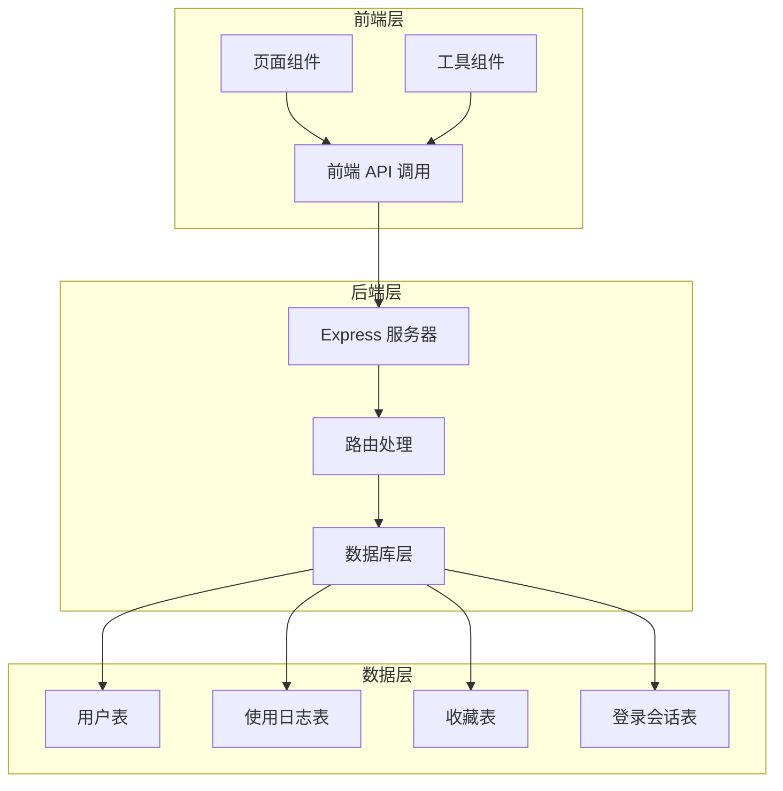

**图表来源**
- [server/src/db.ts:13-75](file://server/src/db.ts#L13-L75)
- [server/src/routes/logs.ts:1-134](file://server/src/routes/logs.ts#L1-L134)

**章节来源**
- [server/src/db.ts:1-126](file://server/src/db.ts#L1-L126)
- [server/src/routes/logs.ts:1-134](file://server/src/routes/logs.ts#L1-L134)

## 核心组件

### 数据库表结构设计

使用日志表（usage_logs）是整个日志系统的核心，采用以下设计原则：

#### 主要字段设计

| 字段名 | 类型 | 约束 | 描述 | 设计原理 |
|--------|------|------|------|----------|
| id | INTEGER | PRIMARY KEY, AUTOINCREMENT | 日志唯一标识符 | 自增主键，确保唯一性 |
| user_id | TEXT | NOT NULL, FOREIGN KEY | 用户标识符 | 外键关联用户表 |
| tool_id | TEXT | NOT NULL | 工具标识符 | 唯一标识具体工具 |
| tool_name | TEXT | NOT NULL | 工具显示名称 | 便于用户界面展示 |
| action | TEXT | NOT NULL | 操作类型 | 标准化操作分类 |
| details | TEXT | NULL | 操作详细信息 | 可选的扩展信息 |
| created_at | TEXT | DEFAULT (datetime('now','localtime')) | 创建时间 | 自动时间戳 |

#### 外键约束设计

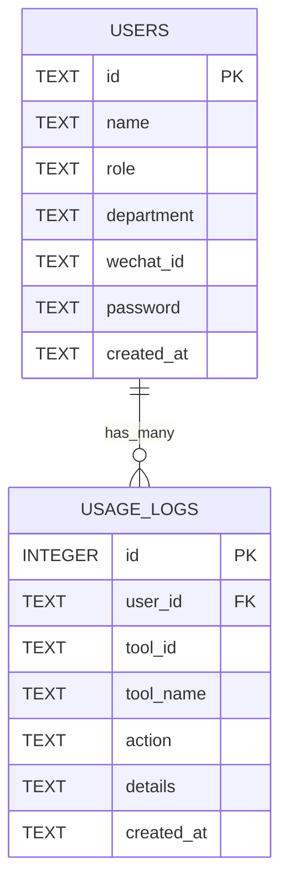

**图表来源**
- [server/src/db.ts:26-35](file://server/src/db.ts#L26-L35)

#### 复合索引策略

系统建立了以下关键索引以优化查询性能：

1. **用户索引** (`idx_logs_user`): 优化按用户过滤的日志查询
2. **工具索引** (`idx_logs_tool`): 优化按工具过滤的日志查询  
3. **时间索引** (`idx_logs_time`): 优化时间范围查询和排序

**章节来源**
- [server/src/db.ts:26-39](file://server/src/db.ts#L26-L39)
- [server/src/types.ts:11-19](file://server/src/types.ts#L11-L19)

## 架构概览

### 整体架构流程

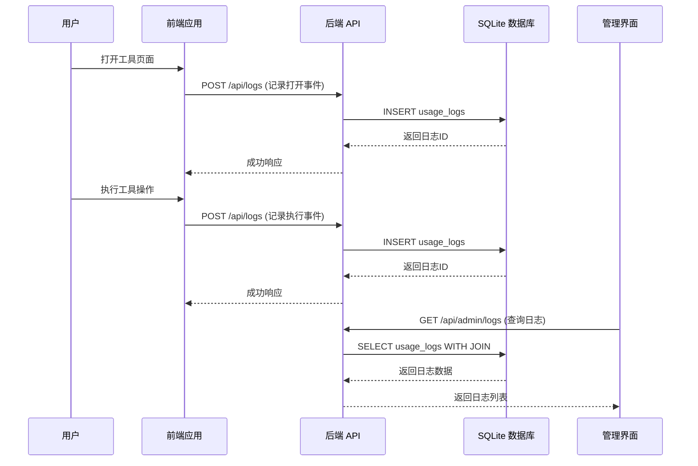

**图表来源**
- [src/lib/api.ts:3-19](file://src/lib/api.ts#L3-L19)
- [server/src/routes/logs.ts:8-18](file://server/src/routes/logs.ts#L8-L18)
- [server/src/routes/admin.ts:69-90](file://server/src/routes/admin.ts#L69-L90)

### 数据流向分析

系统遵循以下数据流向模式：

1. **实时记录**: 用户操作触发前端 API 调用
2. **异步处理**: 后端接收请求并写入数据库
3. **统计分析**: 提供聚合查询接口支持数据分析
4. **审计展示**: 管理员可查看详细的使用记录

**章节来源**
- [src/pages/ToolDetailPage.tsx:62-64](file://src/pages/ToolDetailPage.tsx#L62-L64)
- [src/tools/Base64Tool.tsx:21](file://src/tools/Base64Tool.tsx#L21)
- [src/tools/HashCalculator.tsx:35](file://src/tools/HashCalculator.tsx#L35)

## 详细组件分析

### 前端日志记录组件

#### API 调用封装

前端通过 `logUsage` 函数统一管理日志记录：

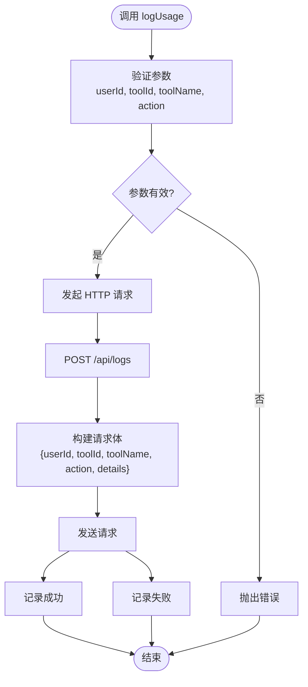

**图表来源**
- [src/lib/api.ts:3-19](file://src/lib/api.ts#L3-L19)

#### 页面级日志记录

工具详情页面在组件挂载时自动记录打开事件：

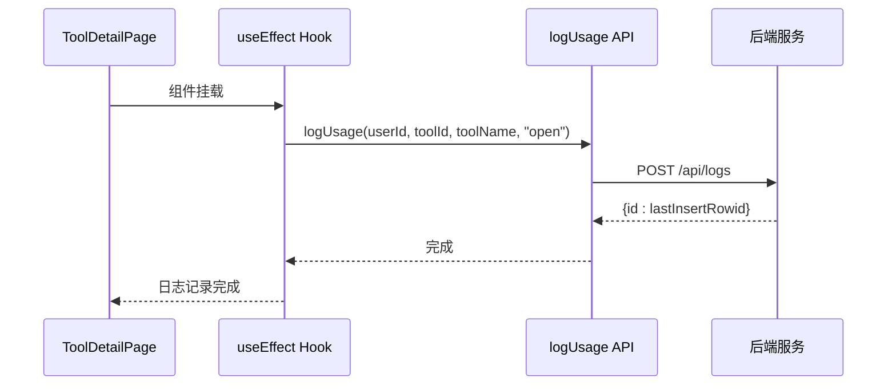

**图表来源**
- [src/pages/ToolDetailPage.tsx:62-64](file://src/pages/ToolDetailPage.tsx#L62-L64)

**章节来源**
- [src/lib/api.ts:1-36](file://src/lib/api.ts#L1-L36)
- [src/pages/ToolDetailPage.tsx:59-65](file://src/pages/ToolDetailPage.tsx#L59-L65)

### 后端日志处理组件

#### 日志创建接口

后端提供专门的路由处理日志创建请求：

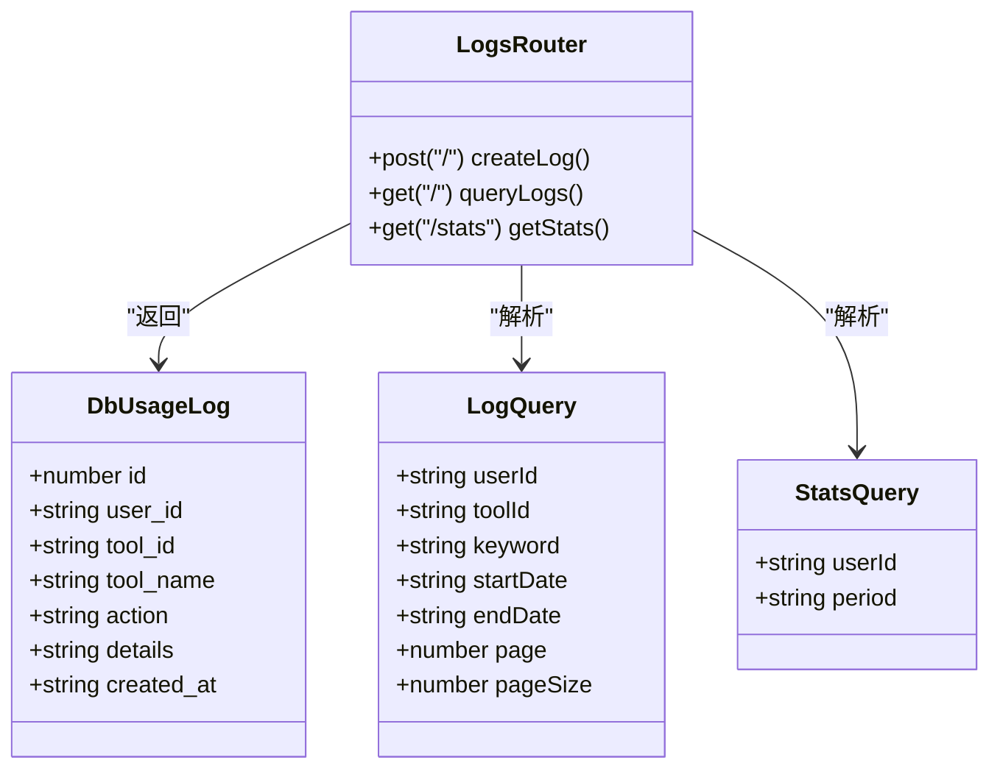

**图表来源**
- [server/src/routes/logs.ts:1-134](file://server/src/routes/logs.ts#L1-L134)
- [server/src/types.ts:11-34](file://server/src/types.ts#L11-L34)

#### 查询过滤机制

系统支持多维度的查询过滤：

| 过滤条件 | SQL 条件 | 用途 | 性能影响 |
|----------|----------|------|----------|
| 用户ID | `l.user_id = ?` | 按用户过滤 | 中等，有索引支持 |
| 工具ID | `l.tool_id = ?` | 按工具过滤 | 中等，有索引支持 |
| 关键词 | `(l.tool_name LIKE ? OR l.action LIKE ? OR l.details LIKE ?)` | 全文搜索 | 较低，无索引 |
| 开始日期 | `l.created_at >= ?` | 时间范围 | 中等，有索引支持 |
| 结束日期 | `l.created_at <= ?` | 时间范围 | 中等，有索引支持 |

**章节来源**
- [server/src/routes/logs.ts:21-69](file://server/src/routes/logs.ts#L21-L69)

### 统计分析组件

#### 聚合统计接口

后端提供丰富的统计分析功能：

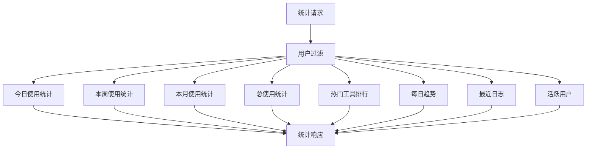

**图表来源**
- [server/src/routes/logs.ts:71-131](file://server/src/routes/logs.ts#L71-L131)

#### 管理员日志查询

管理员界面提供更全面的日志查询功能：

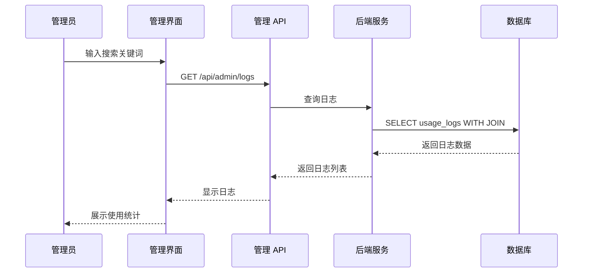

**图表来源**
- [server/src/routes/admin.ts:69-90](file://server/src/routes/admin.ts#L69-L90)
- [src/pages/AdminPage.tsx:92-100](file://src/pages/AdminPage.tsx#L92-L100)

**章节来源**
- [server/src/routes/logs.ts:71-131](file://server/src/routes/logs.ts#L71-L131)
- [server/src/routes/admin.ts:67-92](file://server/src/routes/admin.ts#L67-L92)

## 依赖关系分析

### 技术栈依赖

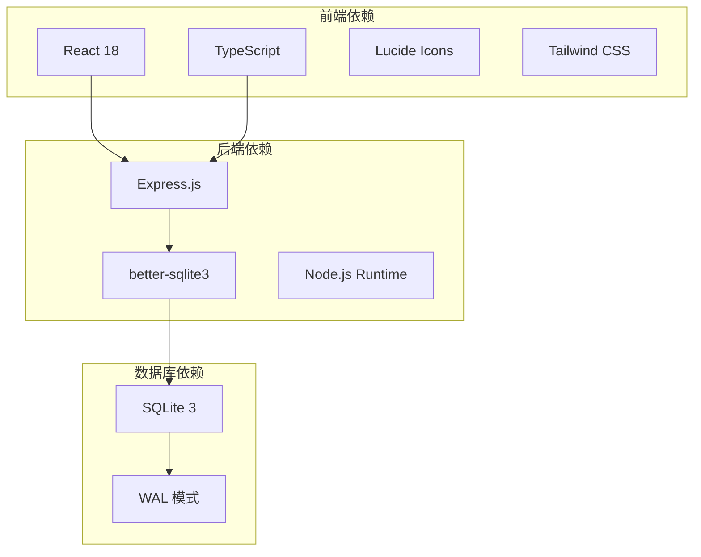

### 组件间依赖关系

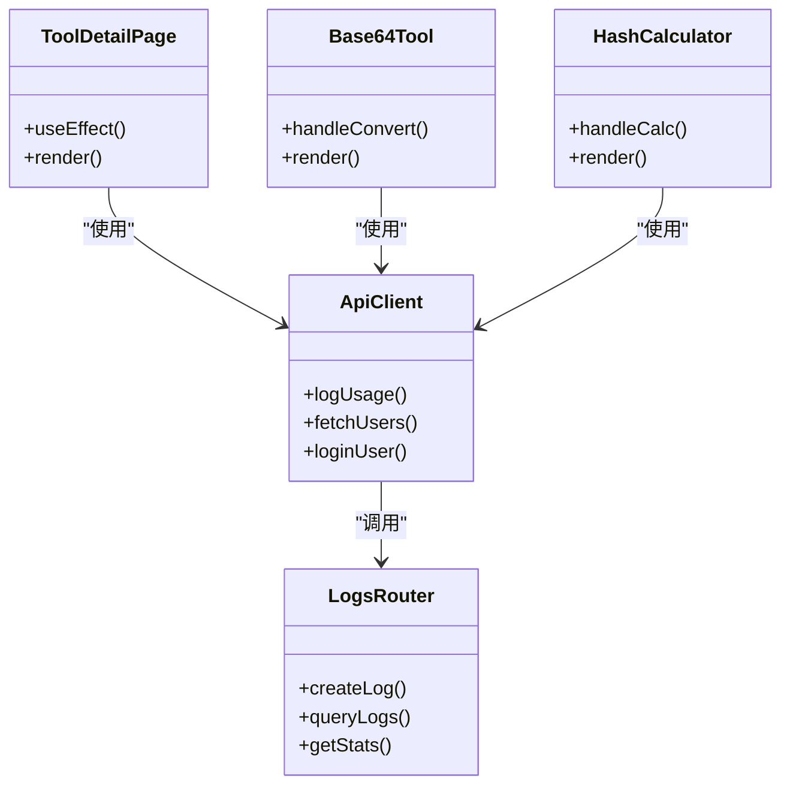

**图表来源**
- [src/pages/ToolDetailPage.tsx:59-65](file://src/pages/ToolDetailPage.tsx#L59-L65)
- [src/tools/Base64Tool.tsx:21](file://src/tools/Base64Tool.tsx#L21)
- [src/tools/HashCalculator.tsx:35](file://src/tools/HashCalculator.tsx#L35)
- [src/lib/api.ts:3-19](file://src/lib/api.ts#L3-L19)

**章节来源**
- [src/pages/ToolDetailPage.tsx:1-136](file://src/pages/ToolDetailPage.tsx#L1-L136)
- [src/tools/Base64Tool.tsx:1-64](file://src/tools/Base64Tool.tsx#L1-L64)
- [src/tools/HashCalculator.tsx:1-69](file://src/tools/HashCalculator.tsx#L1-L69)

## 性能考虑

### 查询性能优化策略

#### 索引优化

系统通过合理的索引设计平衡了查询性能和写入性能：

1. **单列索引** (`idx_logs_user`, `idx_logs_tool`, `idx_logs_time`)
   - 优势：简单高效，维护成本低
   - 适用场景：精确匹配查询
   - 性能特点：B-Tree 索引，查找 O(log n)

2. **复合索引建议**
   ```sql
   -- 建议添加的复合索引
   CREATE INDEX IF NOT EXISTS idx_logs_user_time ON usage_logs(user_id, created_at);
   CREATE INDEX IF NOT EXISTS idx_logs_tool_time ON usage_logs(tool_id, created_at);
   ```

#### 查询优化技巧

1. **分页查询**
   - 使用 LIMIT 和 OFFSET 控制结果集大小
   - 最大分页大小限制为 100 条记录

2. **条件过滤**
   - 动态构建 WHERE 子句，只添加必要的过滤条件
   - 使用参数化查询防止 SQL 注入

3. **连接优化**
   - 使用 LEFT JOIN 获取用户信息
   - 避免不必要的嵌套查询

#### 数据库配置优化

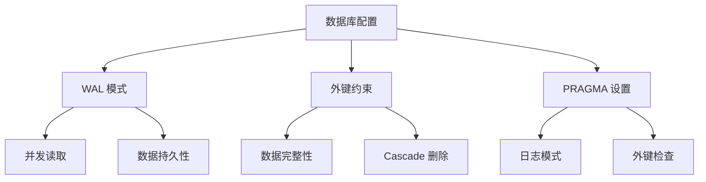

**图表来源**
- [server/src/db.ts:9-10](file://server/src/db.ts#L9-L10)

**章节来源**
- [server/src/db.ts:9-10](file://server/src/db.ts#L9-L10)
- [server/src/routes/logs.ts:28-29](file://server/src/routes/logs.ts#L28-L29)

### 存储策略

#### 数据生命周期管理

系统采用以下存储策略：

1. **数据保留策略**
   - 日志数据长期保存用于统计分析
   - 支持按时间范围查询历史数据

2. **数据清理建议**
   - 可根据业务需求设置数据保留期限
   - 建议定期备份重要统计数据

3. **性能监控**
   - 监控表大小增长趋势
   - 定期分析查询性能指标

## 故障排除指南

### 常见问题诊断

#### 日志记录失败

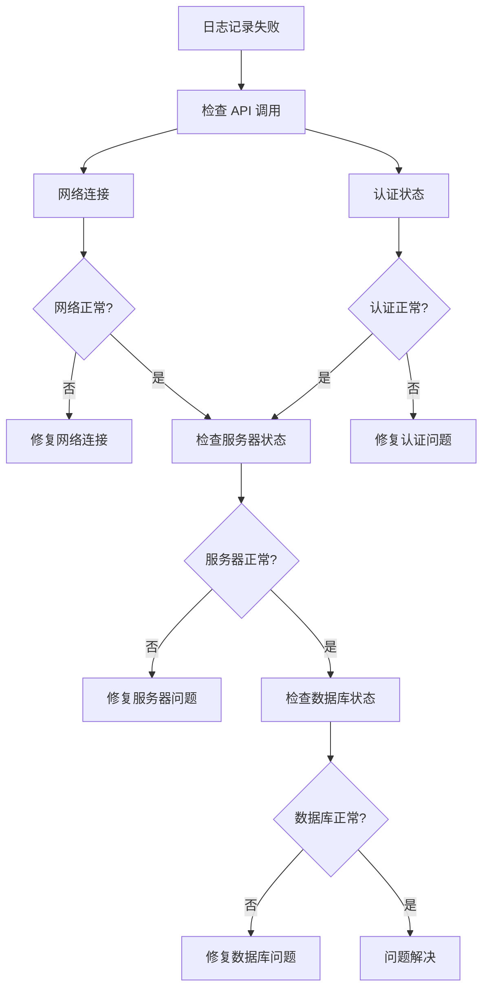

#### 数据查询异常

1. **查询超时**
   - 检查索引是否生效
   - 优化 WHERE 条件组合
   - 调整分页参数

2. **数据不一致**
   - 检查外键约束设置
   - 验证事务处理逻辑
   - 确认数据同步状态

**章节来源**
- [src/lib/api.ts:16-18](file://src/lib/api.ts#L16-L18)
- [server/src/routes/logs.ts:10-12](file://server/src/routes/logs.ts#L10-L12)

### 调试技巧

1. **前端调试**
   - 使用浏览器开发者工具监控网络请求
   - 检查 API 响应状态和数据格式

2. **后端调试**
   - 查看服务器日志输出
   - 使用数据库客户端查询实际数据
   - 监控数据库性能指标

3. **数据库调试**
   - 使用 `.schema` 命令查看表结构
   - 使用 `EXPLAIN QUERY PLAN` 分析查询计划
   - 监控数据库文件大小和增长情况

## 结论

AnyTools 项目的使用日志表设计体现了现代 Web 应用的最佳实践：

### 设计优势

1. **简洁高效**: 表结构设计简洁，满足核心业务需求
2. **性能优化**: 合理的索引策略和查询优化
3. **扩展性强**: 支持多种查询过滤和统计分析
4. **易于维护**: 基于 SQLite 的轻量级解决方案

### 技术亮点

1. **前后端分离**: 清晰的职责分工和接口设计
2. **实时记录**: 用户操作的即时日志记录
3. **统计分析**: 内置的使用统计和趋势分析
4. **审计功能**: 管理员权限下的完整日志审计

### 改进建议

1. **索引优化**: 考虑添加复合索引提升复杂查询性能
2. **数据清理**: 实现自动化的日志数据清理机制
3. **监控告警**: 添加系统性能监控和异常告警
4. **备份策略**: 建立定期的数据备份和恢复机制

该日志系统为 AnyTools 提供了完善的用户行为追踪和使用统计能力，为产品优化和运营决策提供了重要的数据支撑。