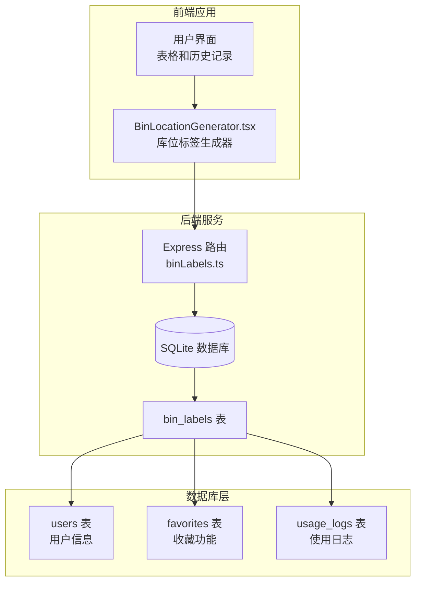
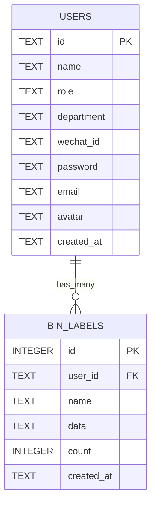
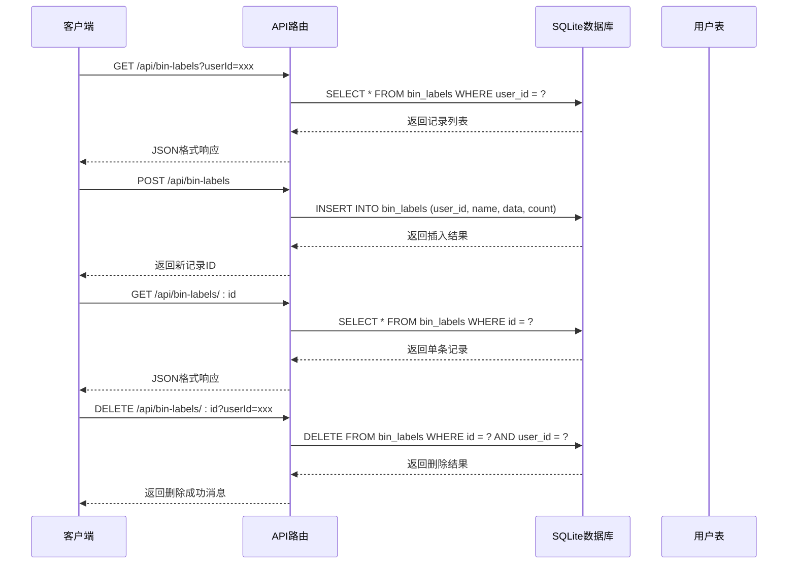
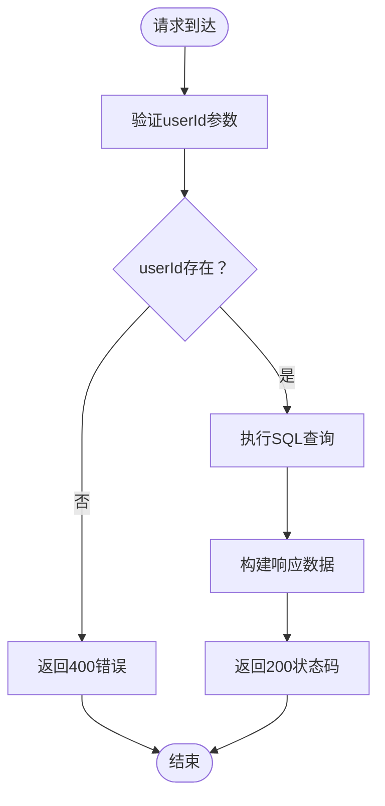
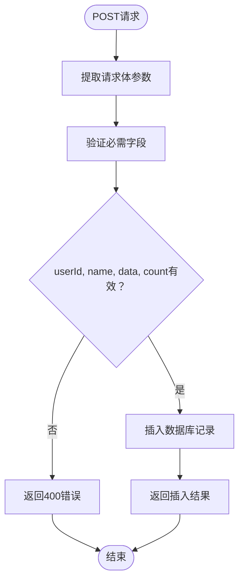
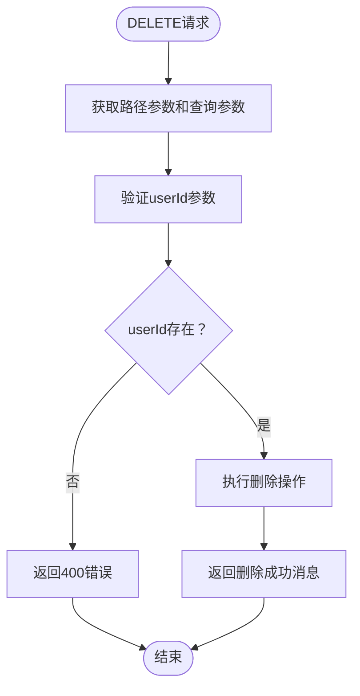
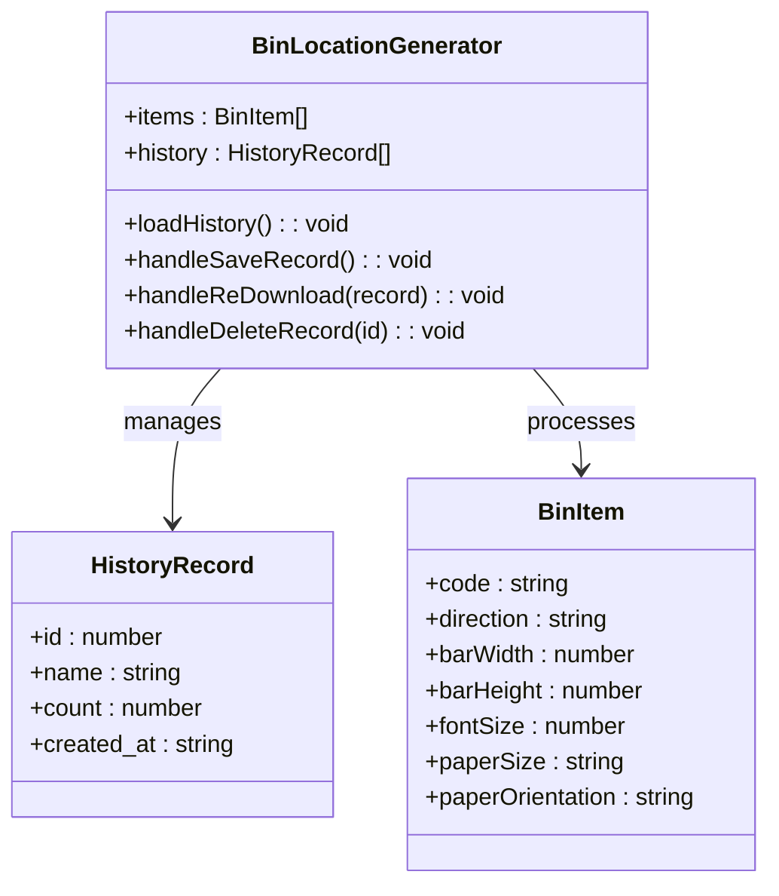
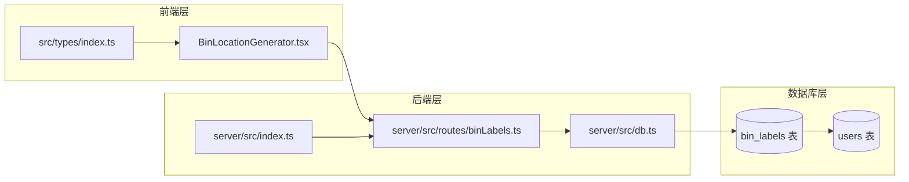

# 库位标签表设计

<cite>
**本文档引用的文件**
- [server/src/db.ts](file://server/src/db.ts)
- [server/src/routes/binLabels.ts](file://server/src/routes/binLabels.ts)
- [server/src/index.ts](file://server/src/index.ts)
- [src/tools/BinLocationGenerator.tsx](file://src/tools/BinLocationGenerator.tsx)
- [src/types/index.ts](file://src/types/index.ts)
</cite>

## 目录
1. [简介](#简介)
2. [项目结构](#项目结构)
3. [核心组件](#核心组件)
4. [架构概览](#架构概览)
5. [详细组件分析](#详细组件分析)
6. [依赖关系分析](#依赖关系分析)
7. [性能考虑](#性能考虑)
8. [故障排除指南](#故障排除指南)
9. [结论](#结论)

## 简介

库位标签表（bin_labels）是 AnyTools 工具箱中的一个重要功能模块，主要用于存储和管理用户生成的库位标签记录。该功能允许用户批量生成库位标签，并将生成的历史记录持久化存储，以便后续查看、重新下载或删除。

库位标签功能的核心应用场景包括：
- 仓库管理系统中的库位标识
- 物流配送中心的货物定位
- 仓储管理系统的标签生成和追踪
- 批量打印库位标签的记录管理

## 项目结构

库位标签功能涉及前后端分离的完整架构，主要由以下组件构成：

**图表来源**
- [server/src/db.ts:51-59](file://server/src/db.ts#L51-L59)
- [server/src/routes/binLabels.ts:1-64](file://server/src/routes/binLabels.ts#L1-L64)
- [src/tools/BinLocationGenerator.tsx:200-604](file://src/tools/BinLocationGenerator.tsx#L200-L604)

**章节来源**
- [server/src/db.ts:1-136](file://server/src/db.ts#L1-L136)
- [server/src/index.ts:1-31](file://server/src/index.ts#L1-L31)

## 核心组件

### 数据模型设计

库位标签表采用简洁而实用的数据模型设计，包含以下关键字段：

| 字段名 | 类型 | 约束 | 描述 | 设计原理 |
|--------|------|------|------|----------|
| id | INTEGER | PRIMARY KEY, AUTOINCREMENT | 记录唯一标识符 | 自增主键确保唯一性 |
| user_id | TEXT | NOT NULL, FOREIGN KEY | 用户标识符 | 外键关联用户表 |
| name | TEXT | NOT NULL | 标签记录名称 | 便于用户识别和分类 |
| data | TEXT | NOT NULL | 标签数据内容 | JSON序列化存储配置 |
| count | INTEGER | NOT NULL | 标签数量 | 记录生成的标签总数 |
| created_at | TEXT | DEFAULT datetime | 创建时间 | 自动时间戳记录 |

### 外键约束设计

**图表来源**
- [server/src/db.ts:14-24](file://server/src/db.ts#L14-L24)
- [server/src/db.ts:51-59](file://server/src/db.ts#L51-L59)

### 索引策略

系统为提升查询性能建立了以下索引：

1. **主键索引**: `PRIMARY KEY (id)` - 自动建立，支持快速主键查找
2. **用户索引**: `idx_bin_labels_user` - 基于 user_id 的索引
3. **时间索引**: `idx_bin_labels_time` - 基于 created_at 的索引

这些索引确保了按用户查询和按时间排序的高效性能。

**章节来源**
- [server/src/db.ts:51-62](file://server/src/db.ts#L51-L62)

## 架构概览

库位标签功能采用RESTful API设计模式，实现了完整的CRUD操作：

**图表来源**
- [server/src/routes/binLabels.ts:15-62](file://server/src/routes/binLabels.ts#L15-L62)
- [server/src/db.ts:51-59](file://server/src/db.ts#L51-L59)

**章节来源**
- [server/src/routes/binLabels.ts:1-64](file://server/src/routes/binLabels.ts#L1-L64)
- [server/src/index.ts](file://server/src/index.ts#L21)

## 详细组件分析

### 后端API实现

#### GET /api/bin-labels - 查询用户历史记录

该接口专门用于查询指定用户的库位标签生成历史：

**图表来源**
- [server/src/routes/binLabels.ts:15-26](file://server/src/routes/binLabels.ts#L15-L26)

#### POST /api/bin-labels - 保存新的生成记录

该接口负责处理用户提交的库位标签生成记录：

**图表来源**
- [server/src/routes/binLabels.ts:39-50](file://server/src/routes/binLabels.ts#L39-L50)

#### DELETE /api/bin-labels/:id - 删除记录

该接口提供安全的记录删除功能：

**图表来源**
- [server/src/routes/binLabels.ts:52-62](file://server/src/routes/binLabels.ts#L52-L62)

### 前端集成实现

#### 历史记录管理

前端组件通过以下方式与后端API交互：

**图表来源**
- [src/tools/BinLocationGenerator.tsx:25-40](file://src/tools/BinLocationGenerator.tsx#L25-L40)
- [src/tools/BinLocationGenerator.tsx:200-228](file://src/tools/BinLocationGenerator.tsx#L200-L228)

#### 数据序列化存储方案

库位标签数据采用JSON序列化的方式存储在数据库中：

1. **序列化过程**: 将BinItem数组转换为JSON字符串
2. **存储格式**: 使用TEXT类型存储完整的JSON数据
3. **反序列化**: 从数据库读取时转换回JavaScript对象

这种设计的优势：
- 灵活的数据结构，无需预定义固定字段
- 支持复杂的数据嵌套和扩展
- 减少数据库表结构变更的需求

**章节来源**
- [src/tools/BinLocationGenerator.tsx:360-379](file://src/tools/BinLocationGenerator.tsx#L360-L379)
- [src/tools/BinLocationGenerator.tsx:381-392](file://src/tools/BinLocationGenerator.tsx#L381-L392)

## 依赖关系分析

### 组件耦合度分析

**图表来源**
- [server/src/routes/binLabels.ts:1-3](file://server/src/routes/binLabels.ts#L1-L3)
- [server/src/db.ts:51-59](file://server/src/db.ts#L51-L59)
- [server/src/index.ts](file://server/src/index.ts#L7)

### 外部依赖

系统依赖的关键外部库：
- **better-sqlite3**: SQLite数据库驱动程序
- **express**: Web应用框架
- **jsPDF**: PDF生成库
- **lucide-react**: 图标库

**章节来源**
- [server/src/db.ts](file://server/src/db.ts#L1)
- [src/tools/BinLocationGenerator.tsx:1-21](file://src/tools/BinLocationGenerator.tsx#L1-L21)

## 性能考虑

### 数据库性能优化

1. **索引策略优化**
   - `idx_bin_labels_user`: 支持按用户快速查询
   - `idx_bin_labels_time`: 支持按时间排序和范围查询

2. **查询优化**
   - 使用参数化查询防止SQL注入
   - 仅选择需要的字段减少网络传输
   - 使用事务处理批量操作

3. **内存管理**
   - 及时清理预览URL资源
   - 控制PDF生成的并发数量

### 前端性能优化

1. **懒加载机制**
   - 按需加载PDF生成库
   - 延迟初始化大组件

2. **缓存策略**
   - 历史记录本地缓存
   - 预览URL缓存管理

3. **用户体验优化**
   - 加载状态指示
   - 错误处理和重试机制

## 故障排除指南

### 常见问题及解决方案

#### 数据库连接问题
- **症状**: API调用失败，返回数据库错误
- **原因**: SQLite文件权限或路径问题
- **解决**: 检查数据库文件存在性和访问权限

#### 外键约束错误
- **症状**: 插入记录时报错，提示外键约束失败
- **原因**: user_id对应的用户不存在
- **解决**: 确保用户先存在于users表中

#### JSON序列化问题
- **症状**: 数据库存储异常或读取失败
- **原因**: JSON数据格式不正确
- **解决**: 在前端进行严格的JSON验证

#### 性能问题
- **症状**: 查询响应缓慢
- **原因**: 缺少必要的索引或查询条件不当
- **解决**: 添加适当的索引，优化查询语句

**章节来源**
- [server/src/db.ts](file://server/src/db.ts#L8)
- [server/src/routes/binLabels.ts](file://server/src/routes/binLabels.ts#L42)

## 结论

库位标签表（bin_labels）设计体现了现代Web应用的最佳实践：

1. **简洁而实用**: 采用最小化的字段设计，满足核心业务需求
2. **安全可靠**: 完善的外键约束和参数验证机制
3. **性能优化**: 合理的索引策略和查询优化
4. **可扩展性**: JSON序列化支持灵活的数据结构扩展
5. **用户体验**: 前后端分离的架构提供了良好的用户体验

该设计为仓库管理和物流配送场景提供了可靠的库位标签管理解决方案，既保证了数据的一致性和完整性，又确保了系统的高性能和可维护性。