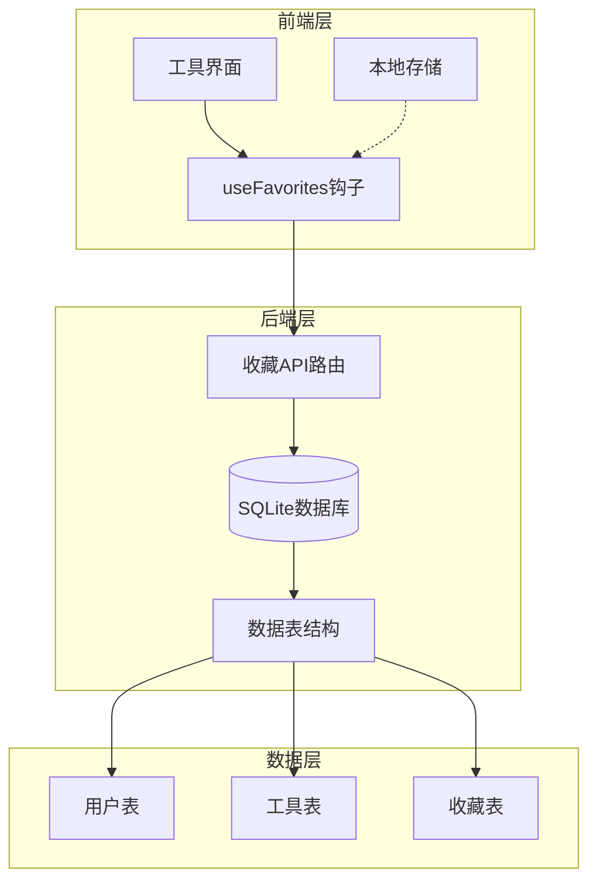
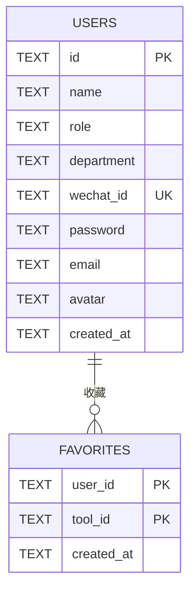
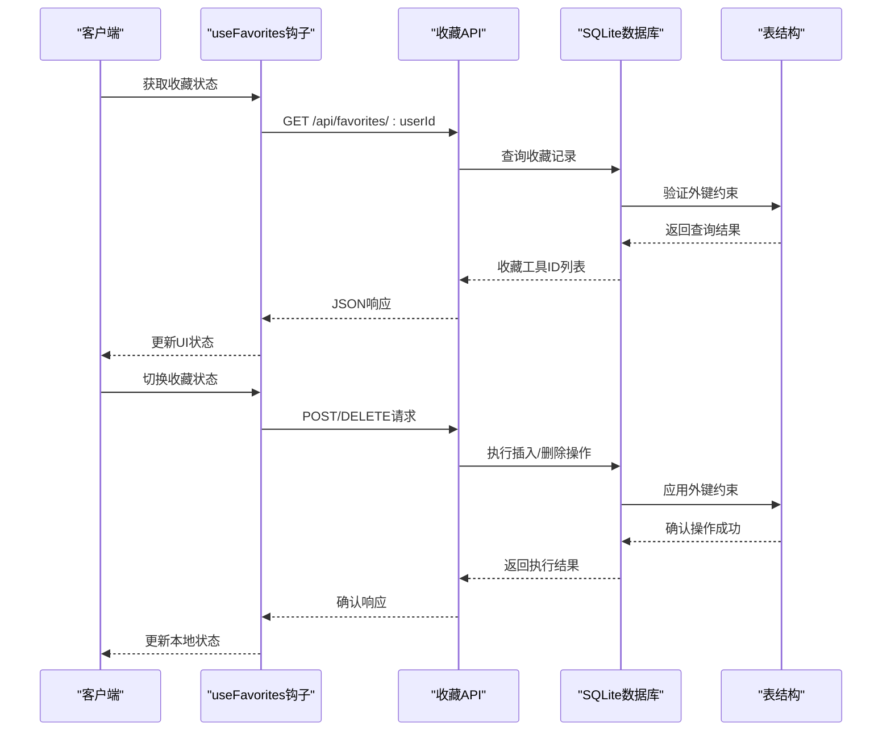
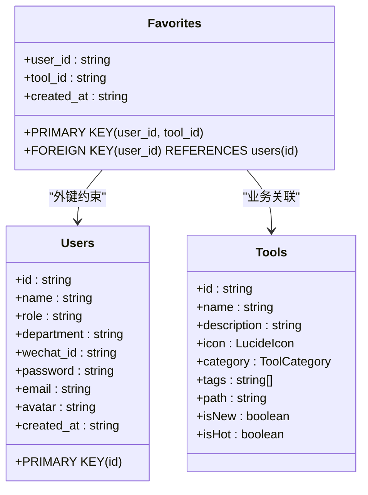
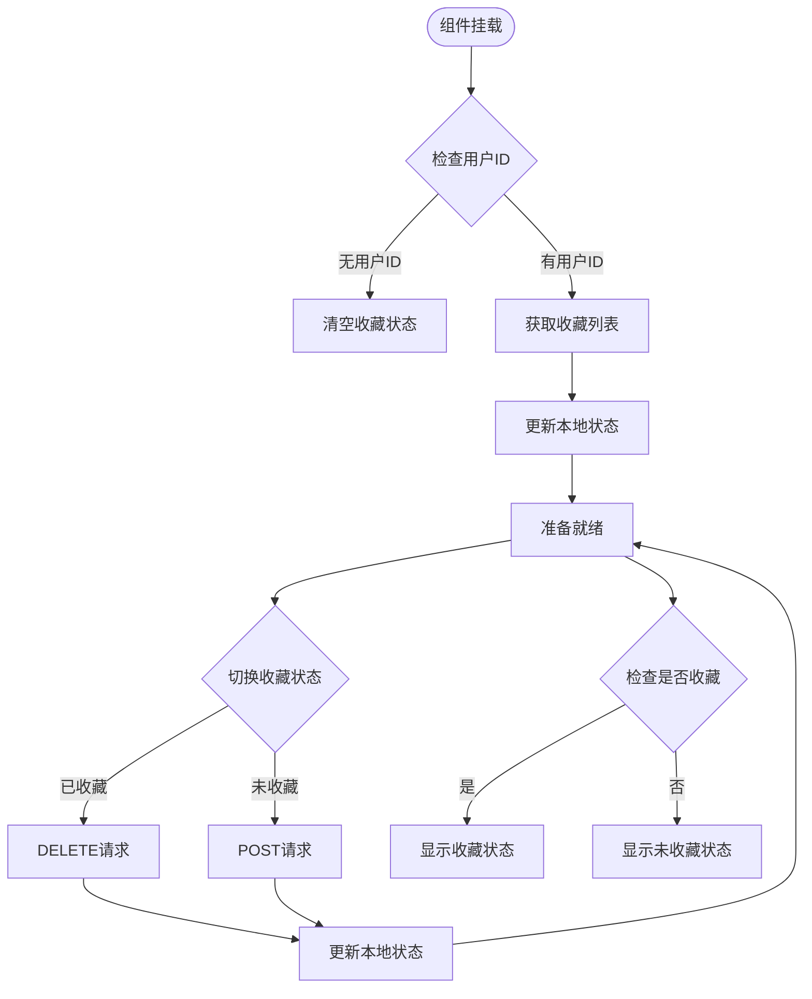
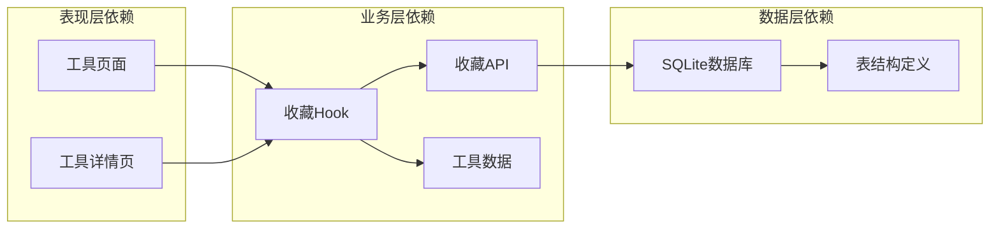
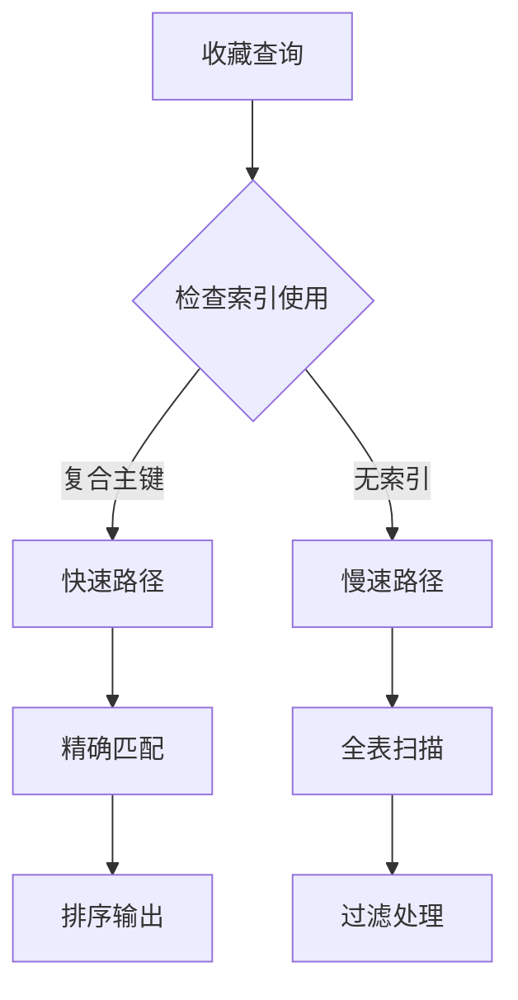

# 收藏表设计

<cite>
**本文档引用的文件**
- [server/src/db.ts](file://server/src/db.ts)
- [server/src/routes/favorites.ts](file://server/src/routes/favorites.ts)
- [src/hooks/useFavorites.ts](file://src/hooks/useFavorites.ts)
- [server/src/index.ts](file://server/src/index.ts)
- [src/data/tools.ts](file://src/data/tools.ts)
- [src/types/index.ts](file://src/types/index.ts)
</cite>

## 目录
1. [简介](#简介)
2. [项目结构](#项目结构)
3. [核心组件](#核心组件)
4. [架构概览](#架构概览)
5. [详细组件分析](#详细组件分析)
6. [依赖分析](#依赖分析)
7. [性能考虑](#性能考虑)
8. [故障排除指南](#故障排除指南)
9. [结论](#结论)

## 简介

本文档详细分析了收藏表（favorites）的设计与实现，重点涵盖以下方面：
- 复合主键设计原理：用户ID与工具ID组成的联合主键确保唯一性
- 收藏关系的业务逻辑：用户对工具的收藏管理机制
- 实现机制与数据一致性保证：基于SQLite的外键约束和事务处理
- 外键约束设计与索引策略：查询性能优化方案
- 收藏数据清理策略：过期数据处理与维护
- 用户偏好分析支持：基于收藏数据的分析能力

## 项目结构

收藏功能涉及前后端协同工作，主要分布在以下模块：

**图表来源**
- [server/src/db.ts:43-49](file://server/src/db.ts#L43-L49)
- [server/src/routes/favorites.ts:1-31](file://server/src/routes/favorites.ts#L1-L31)
- [src/hooks/useFavorites.ts:16-70](file://src/hooks/useFavorites.ts#L16-L70)

**章节来源**
- [server/src/db.ts:1-136](file://server/src/db.ts#L1-L136)
- [server/src/index.ts:1-31](file://server/src/index.ts#L1-L31)

## 核心组件

### 收藏表结构设计

收藏表采用复合主键设计，确保每个用户对特定工具只能收藏一次：

| 字段名 | 类型 | 约束 | 描述 |
|--------|------|------|------|
| user_id | TEXT | NOT NULL, PRIMARY KEY | 用户标识符 |
| tool_id | TEXT | NOT NULL, PRIMARY KEY | 工具标识符 |
| created_at | TEXT | DEFAULT (datetime('now','localtime')) | 收藏创建时间 |

### 外键约束设计

**图表来源**
- [server/src/db.ts:14-24](file://server/src/db.ts#L14-L24)
- [server/src/db.ts:43-49](file://server/src/db.ts#L43-L49)

### 业务逻辑实现

收藏功能提供完整的CRUD操作：
- **查询收藏列表**：按用户ID获取所有收藏的工具ID
- **添加收藏**：使用INSERT OR IGNORE确保重复收藏不产生错误
- **取消收藏**：删除指定的收藏记录

**章节来源**
- [server/src/routes/favorites.ts:6-28](file://server/src/routes/favorites.ts#L6-L28)

## 架构概览

收藏功能采用分层架构设计，确保数据一致性和性能优化：

**图表来源**
- [src/hooks/useFavorites.ts:23-53](file://src/hooks/useFavorites.ts#L23-L53)
- [server/src/routes/favorites.ts:7-28](file://server/src/routes/favorites.ts#L7-L28)

## 详细组件分析

### 数据模型设计

#### 复合主键设计原理

收藏表采用(user_id, tool_id)复合主键，这一设计具有以下优势：

1. **唯一性保证**：防止同一用户重复收藏同一工具
2. **自然的业务语义**：直接映射用户-工具的多对多关系
3. **简化查询逻辑**：通过单一索引即可实现高效的查找

#### 外键约束实现

**图表来源**
- [server/src/db.ts:43-49](file://server/src/db.ts#L43-L49)
- [src/types/index.ts:3-13](file://src/types/index.ts#L3-L13)

#### 查询性能优化

当前实现的查询策略：

1. **主键查询**：`SELECT tool_id FROM favorites WHERE user_id = ?`
   - 使用复合主键进行精确匹配
   - 时间复杂度：O(log n)
   - 适用于高频的收藏状态检查

2. **排序查询**：`ORDER BY created_at DESC`
   - 按收藏时间倒序排列
   - 支持最近收藏的展示需求

**章节来源**
- [server/src/routes/favorites.ts:7-11](file://server/src/routes/favorites.ts#L7-L11)

### 前端集成实现

#### React Hook设计

useFavorites钩子提供完整的收藏状态管理：

**图表来源**
- [src/hooks/useFavorites.ts:23-58](file://src/hooks/useFavorites.ts#L23-L58)

#### 本地存储策略

系统同时使用内存状态和本地存储：
- **内存状态**：React状态管理，响应快速
- **本地存储**：localStorage持久化，支持页面刷新后的状态恢复
- **最近访问**：额外的recentIds存储，支持最近使用历史

**章节来源**
- [src/hooks/useFavorites.ts:1-71](file://src/hooks/useFavorites.ts#L1-L71)

### 后端API实现

#### RESTful接口设计

收藏API提供标准的REST操作：

| 方法 | 路径 | 功能 | 参数 | 响应 |
|------|------|------|------|------|
| GET | `/api/favorites/:userId` | 获取收藏列表 | userId | 工具ID数组 |
| POST | `/api/favorites/:userId` | 添加收藏 | userId, toolId | {ok: true} |
| DELETE | `/api/favorites/:userId/:toolId` | 取消收藏 | userId, toolId | {ok: true} |

#### 数据一致性保证

后端通过以下机制确保数据一致性：

1. **SQLite事务**：自动事务管理，确保操作原子性
2. **外键约束**：强制参照完整性，防止孤儿记录
3. **INSERT OR IGNORE**：避免重复插入错误
4. **参数绑定**：防止SQL注入攻击

**章节来源**
- [server/src/routes/favorites.ts:1-31](file://server/src/routes/favorites.ts#L1-L31)

## 依赖分析

### 组件耦合关系

**图表来源**
- [server/src/db.ts:43-49](file://server/src/db.ts#L43-L49)
- [src/hooks/useFavorites.ts:16-70](file://src/hooks/useFavorites.ts#L16-L70)
- [src/data/tools.ts:43-301](file://src/data/tools.ts#L43-L301)

### 外部依赖

系统依赖的关键外部组件：

1. **better-sqlite3**：高性能SQLite驱动
2. **Express.js**：Web服务器框架
3. **React**：前端UI框架
4. **Lucide React**：图标库

**章节来源**
- [server/src/db.ts:1-10](file://server/src/db.ts#L1-L10)
- [server/src/index.ts:1-8](file://server/src/index.ts#L1-L8)

## 性能考虑

### 查询性能优化

#### 当前优化策略

1. **复合主键索引**：利用(user_id, tool_id)作为主键，提供O(log n)查询性能
2. **外键索引**：users表的主键索引确保参照完整性
3. **WAL模式**：开启写-ahead日志模式提升并发性能

#### 查询路径分析

#### 建议的索引优化

虽然当前设计已经很高效，但可以考虑以下优化：

1. **单字段索引**：为user_id和tool_id分别建立索引
2. **时间索引**：为created_at建立索引支持时间范围查询
3. **复合索引**：针对特定查询模式建立优化索引

### 存储空间优化

1. **数据类型选择**：使用TEXT类型存储字符串标识符
2. **默认值优化**：created_at使用数据库默认值减少存储开销
3. **索引维护**：定期分析数据库统计信息优化查询计划

## 故障排除指南

### 常见问题诊断

#### 收藏功能异常

**症状**：收藏状态无法更新或显示错误

**可能原因**：
1. 用户ID为空或无效
2. 工具ID不存在
3. 数据库连接问题
4. 网络请求失败

**解决方案**：
1. 检查用户认证状态
2. 验证工具ID的有效性
3. 查看数据库连接日志
4. 检查API响应状态码

#### 数据一致性问题

**症状**：出现重复收藏或孤儿记录

**诊断步骤**：
1. 检查外键约束是否启用
2. 验证INSERT OR IGNORE操作
3. 查看事务提交状态
4. 分析并发访问情况

**章节来源**
- [server/src/routes/favorites.ts:14-20](file://server/src/routes/favorites.ts#L14-L20)
- [server/src/db.ts:9-10](file://server/src/db.ts#L9-L10)

### 错误处理机制

系统采用多层次的错误处理：

1. **前端错误处理**：useFavorites钩子中的try-catch块
2. **后端错误处理**：Express中间件的错误捕获
3. **数据库错误处理**：better-sqlite3的异常抛出
4. **网络错误处理**：fetch API的Promise拒绝处理

## 结论

收藏表设计体现了良好的数据库设计原则和现代Web应用架构的最佳实践：

### 设计优势

1. **简洁的数据模型**：复合主键设计简单直观
2. **强一致性的保证**：通过外键约束和事务确保数据完整性
3. **高效的查询性能**：利用SQLite的索引机制提供快速访问
4. **良好的扩展性**：支持未来功能扩展和性能优化

### 技术亮点

1. **前后端协同**：React Hook与后端API的无缝集成
2. **状态管理**：内存状态与本地存储的双重保障
3. **性能优化**：合理的索引策略和查询优化
4. **错误处理**：完善的异常处理和故障恢复机制

### 改进建议

1. **监控指标**：添加收藏功能的使用统计和性能监控
2. **缓存策略**：实现更智能的缓存机制减少数据库访问
3. **批量操作**：支持批量收藏和取消收藏操作
4. **数据分析**：基于收藏数据提供用户行为分析功能

该设计为用户提供流畅的收藏体验，同时为未来的功能扩展和性能优化奠定了坚实的基础。