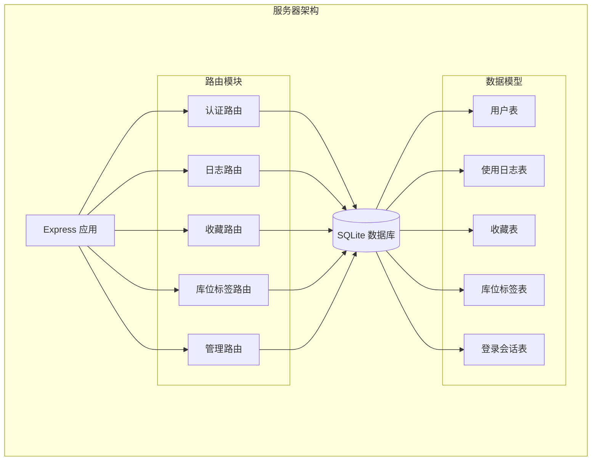
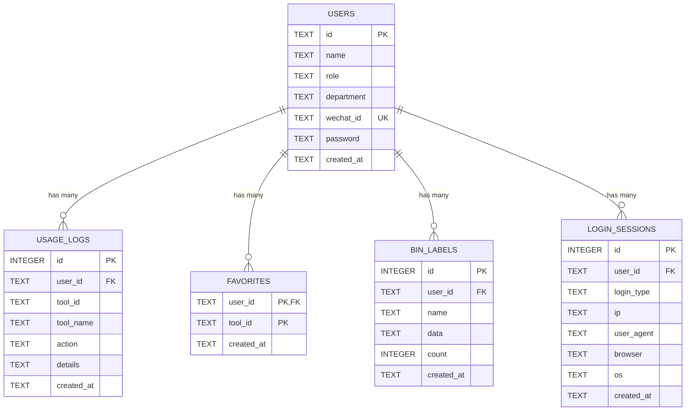
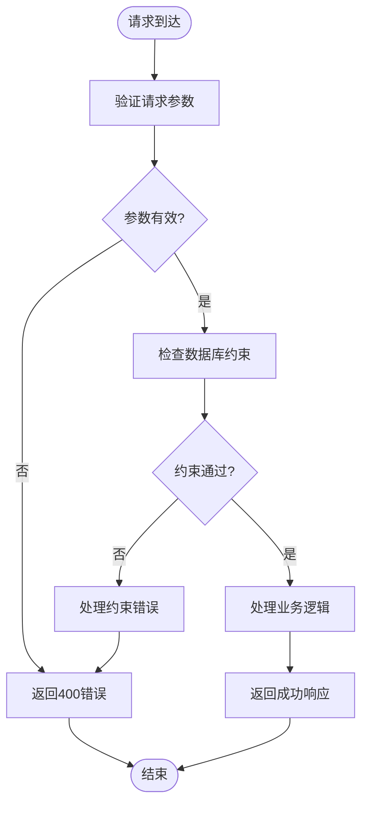
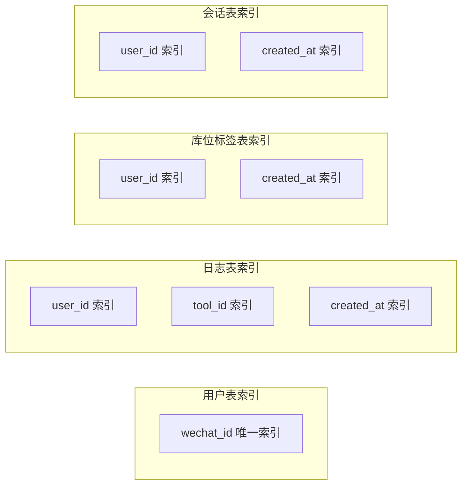
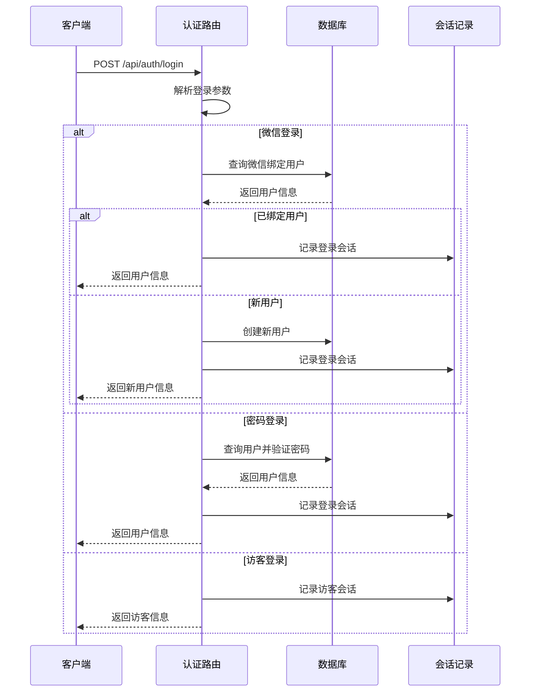
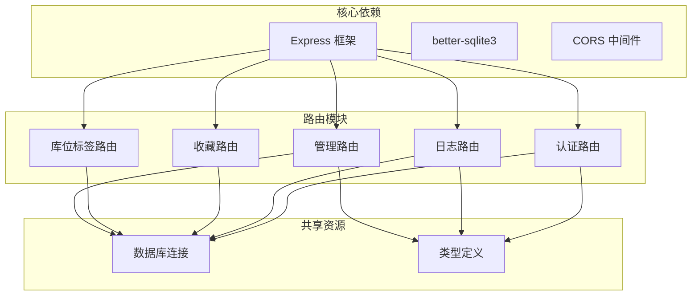

# 数据模型设计

<cite>
**本文档引用的文件**
- [db.ts](file://server/src/db.ts)
- [types.ts](file://server/src/types.ts)
- [auth.ts](file://server/src/routes/auth.ts)
- [binLabels.ts](file://server/src/routes/binLabels.ts)
- [favorites.ts](file://server/src/routes/favorites.ts)
- [logs.ts](file://server/src/routes/logs.ts)
- [admin.ts](file://server/src/routes/admin.ts)
- [index.ts](file://server/src/index.ts)
</cite>

## 目录
1. [简介](#简介)
2. [项目结构](#项目结构)
3. [核心数据表设计](#核心数据表设计)
4. [架构概览](#架构概览)
5. [详细组件分析](#详细组件分析)
6. [依赖关系分析](#依赖关系分析)
7. [性能考虑](#性能考虑)
8. [故障排除指南](#故障排除指南)
9. [结论](#结论)

## 简介

本文件详细说明了 AnyTools 项目的数据库数据模型设计，涵盖用户模型（users）、使用日志模型（usage_logs）、收藏模型（favorites）、库位标签模型（bin_labels）和登录会话模型（login_sessions）的设计原理。文档从数据类型选择、约束条件、业务含义、主外键设计决策、表间关系建立、数据验证规则、默认值设置和索引策略等方面进行全面分析，并提供扩展性设计和未来演进方向建议。

## 项目结构

后端采用 Express.js 框架，使用 better-sqlite3 作为数据库驱动，通过单一 SQLite 数据库文件存储所有业务数据。数据库初始化在应用启动时执行，自动创建所需表结构并进行基本数据填充。

**图表来源**
- [index.ts:1-31](file://server/src/index.ts#L1-L31)
- [db.ts:12-75](file://server/src/db.ts#L12-L75)

**章节来源**
- [index.ts:1-31](file://server/src/index.ts#L1-L31)
- [db.ts:1-126](file://server/src/db.ts#L1-L126)

## 核心数据表设计

### 用户表（users）

用户表是系统的核心实体，存储所有用户的基本信息和认证凭据。

**字段定义与设计决策：**

| 字段名 | 数据类型 | 约束条件 | 默认值 | 业务含义 |
|--------|----------|----------|--------|----------|
| id | TEXT | PRIMARY KEY | 无 | 用户唯一标识符，采用自定义格式（user-数字） |
| name | TEXT | NOT NULL | 无 | 用户姓名，支持中文显示 |
| role | TEXT | NOT NULL, CHECK(role IN ('user', 'admin')) | 无 | 用户角色，限制为用户或管理员 |
| department | TEXT | NULL | 无 | 所属部门信息 |
| wechat_id | TEXT | UNIQUE | 无 | 微信绑定标识，支持微信登录 |
| password | TEXT | NULL | 无 | 登录密码，可为空（支持微信登录） |
| created_at | TEXT | DEFAULT (datetime('now','localtime')) | 当前时间 | 账户创建时间戳 |

**设计要点：**
- 使用 TEXT 类型存储用户ID，便于灵活扩展和国际化
- 角色字段使用 CHECK 约束确保数据完整性
- wechat_id 建立唯一索引，支持快速查找绑定用户
- created_at 字段使用本地时间，默认值确保无需手动设置

**章节来源**
- [db.ts:14-22](file://server/src/db.ts#L14-L22)
- [types.ts:1-9](file://server/src/types.ts#L1-L9)

### 使用日志表（usage_logs）

使用日志表记录用户对工具的使用行为，支持审计和统计分析。

**字段定义与设计决策：**

| 字段名 | 数据类型 | 约束条件 | 默认值 | 业务含义 |
|--------|----------|----------|--------|----------|
| id | INTEGER | PRIMARY KEY, AUTOINCREMENT | 无 | 日志记录自增ID |
| user_id | TEXT | NOT NULL, FOREIGN KEY(users.id) | 无 | 关联用户表 |
| tool_id | TEXT | NOT NULL | 无 | 工具唯一标识符 |
| tool_name | TEXT | NOT NULL | 无 | 工具显示名称 |
| action | TEXT | NOT NULL | 无 | 用户操作类型（open/execute） |
| details | TEXT | NULL | 无 | 操作详情描述 |
| created_at | TEXT | DEFAULT (datetime('now','localtime')) | 当前时间 | 日志产生时间 |

**设计要点：**
- 复合外键约束确保数据一致性
- 支持多种操作类型的灵活记录
- details 字段允许扩展详细信息
- created_at 字段便于时间序列分析

**章节来源**
- [db.ts:26-35](file://server/src/db.ts#L26-L35)
- [types.ts:11-19](file://server/src/types.ts#L11-L19)

### 收藏表（favorites）

收藏表实现用户工具收藏功能，采用复合主键设计。

**字段定义与设计决策：**

| 字段名 | 数据类型 | 约束条件 | 默认值 | 业务含义 |
|--------|----------|----------|--------|----------|
| user_id | TEXT | NOT NULL, PRIMARY KEY, FOREIGN KEY(users.id) | 无 | 用户标识符 |
| tool_id | TEXT | NOT NULL, PRIMARY KEY | 无 | 工具标识符 |
| created_at | TEXT | DEFAULT (datetime('now','localtime')) | 当前时间 | 收藏时间戳 |

**设计要点：**
- 复合主键（user_id, tool_id）确保同一用户不能重复收藏同一工具
- 使用 INSERT OR IGNORE 避免重复插入错误
- created_at 字段支持按时间排序收藏列表

**章节来源**
- [db.ts:41-47](file://server/src/db.ts#L41-L47)
- [favorites.ts:6-28](file://server/src/routes/favorites.ts#L6-L28)

### 库位标签表（bin_labels）

库位标签表用于存储用户生成的库位标签记录。

**字段定义与设计决策：**

| 字段名 | 数据类型 | 约束条件 | 默认值 | 业务含义 |
|--------|----------|----------|--------|----------|
| id | INTEGER | PRIMARY KEY, AUTOINCREMENT | 无 | 记录自增ID |
| user_id | TEXT | NOT NULL, FOREIGN KEY(users.id) | 无 | 关联用户标识符 |
| name | TEXT | NOT NULL | 无 | 标签名称 |
| data | TEXT | NOT NULL | 无 | 标签数据内容（JSON格式） |
| count | INTEGER | NOT NULL | 无 | 生成数量 |
| created_at | TEXT | DEFAULT (datetime('now','localtime')) | 当前时间 | 创建时间 |

**设计要点：**
- data 字段存储 JSON 格式的标签数据，支持复杂结构
- count 字段记录批量生成的数量
- 外键约束确保用户数据完整性

**章节来源**
- [db.ts:49-57](file://server/src/db.ts#L49-L57)
- [binLabels.ts:6-13](file://server/src/routes/binLabels.ts#L6-L13)

### 登录会话表（login_sessions）

登录会话表记录用户的登录行为和设备信息。

**字段定义与设计决策：**

| 字段名 | 数据类型 | 约束条件 | 默认值 | 业务含义 |
|--------|----------|----------|--------|----------|
| id | INTEGER | PRIMARY KEY, AUTOINCREMENT | 无 | 会话记录ID |
| user_id | TEXT | NOT NULL | 无 | 关联用户标识符 |
| login_type | TEXT | NOT NULL, CHECK(login_type IN ('wechat', 'password', 'guest')) | 无 | 登录方式类型 |
| ip | TEXT | NULL | 无 | 客户端IP地址 |
| user_agent | TEXT | NULL | 无 | 浏览器用户代理字符串 |
| browser | TEXT | NULL | 无 | 浏览器类型识别 |
| os | TEXT | NULL | 无 | 操作系统类型识别 |
| created_at | TEXT | DEFAULT (datetime('now','localtime')) | 当前时间 | 会话创建时间 |

**设计要点：**
- login_type 字段使用 CHECK 约束限制登录方式
- 自动解析客户端信息，便于安全审计
- 支持访客模式，无需用户账户即可使用

**章节来源**
- [db.ts:62-71](file://server/src/db.ts#L62-L71)
- [types.ts:36-45](file://server/src/types.ts#L36-L45)

## 架构概览

系统采用基于 SQLite 的轻量级数据库架构，所有表通过外键关系相互关联，形成完整的用户行为追踪体系。

**图表来源**
- [db.ts:14-71](file://server/src/db.ts#L14-L71)

**章节来源**
- [db.ts:12-75](file://server/src/db.ts#L12-L75)

## 详细组件分析

### 数据验证规则

系统在数据库层和应用层双重实施数据验证：

**图表来源**
- [auth.ts:36-106](file://server/src/routes/auth.ts#L36-L106)
- [logs.ts:8-18](file://server/src/routes/logs.ts#L8-L18)
- [binLabels.ts:40-50](file://server/src/routes/binLabels.ts#L40-L50)

**章节来源**
- [auth.ts:36-106](file://server/src/routes/auth.ts#L36-L106)
- [logs.ts:8-18](file://server/src/routes/logs.ts#L8-L18)
- [binLabels.ts:40-50](file://server/src/routes/binLabels.ts#L40-L50)

### 索引策略设计

系统采用多层次索引策略优化查询性能：

**图表来源**
- [db.ts:24](file://server/src/db.ts#L24)
- [db.ts:37-39](file://server/src/db.ts#L37-L39)
- [db.ts:59-60](file://server/src/db.ts#L59-L60)
- [db.ts:73-74](file://server/src/db.ts#L73-L74)

**章节来源**
- [db.ts:24](file://server/src/db.ts#L24)
- [db.ts:37-39](file://server/src/db.ts#L37-L39)
- [db.ts:59-60](file://server/src/db.ts#L59-L60)
- [db.ts:73-74](file://server/src/db.ts#L73-L74)

### 登录流程序列

**图表来源**
- [auth.ts:36-106](file://server/src/routes/auth.ts#L36-L106)
- [db.ts:77-123](file://server/src/db.ts#L77-L123)

**章节来源**
- [auth.ts:36-106](file://server/src/routes/auth.ts#L36-L106)
- [db.ts:77-123](file://server/src/db.ts#L77-L123)

## 依赖关系分析

系统采用模块化设计，各路由模块独立负责特定功能域：

**图表来源**
- [index.ts:1-31](file://server/src/index.ts#L1-L31)
- [db.ts:1-126](file://server/src/db.ts#L1-L126)
- [types.ts:1-46](file://server/src/types.ts#L1-L46)

**章节来源**
- [index.ts:1-31](file://server/src/index.ts#L1-L31)
- [db.ts:1-126](file://server/src/db.ts#L1-L126)
- [types.ts:1-46](file://server/src/types.ts#L1-L46)

## 性能考虑

### 查询优化策略

1. **索引优化**：针对高频查询字段建立索引，包括用户ID、工具ID、创建时间等
2. **分页机制**：日志查询支持分页，最大每页100条记录
3. **条件过滤**：支持多条件组合查询，避免全表扫描
4. **连接优化**：使用 LEFT JOIN 连接用户表获取用户名信息

### 存储优化

1. **数据类型选择**：优先使用 TEXT 存储字符串，INTEGER 存储数值
2. **默认值设置**：大量字段设置默认值，减少空值处理开销
3. **外键约束**：启用外键检查，确保数据一致性
4. **WAL 模式**：使用写前日志模式提升并发性能

## 故障排除指南

### 常见问题及解决方案

**用户登录失败**
- 检查用户名或ID是否存在
- 验证密码是否正确（支持密码字段或用户ID）
- 确认微信ID绑定状态

**收藏操作异常**
- 确保用户ID和工具ID参数完整
- 检查是否已存在相同的收藏记录
- 验证用户权限

**日志查询无结果**
- 检查查询参数范围（开始/结束日期）
- 确认用户ID或工具ID正确性
- 验证关键字匹配条件

**章节来源**
- [auth.ts:84-106](file://server/src/routes/auth.ts#L84-L106)
- [favorites.ts:14-28](file://server/src/routes/favorites.ts#L14-L28)
- [logs.ts:20-69](file://server/src/routes/logs.ts#L20-L69)

## 结论

本数据模型设计充分考虑了系统的业务需求和技术约束，采用 SQLite 作为轻量级数据库解决方案，通过合理的表结构设计、约束设置和索引策略，实现了高效的数据存储和查询。各表之间的外键关系确保了数据的一致性和完整性，同时支持未来的功能扩展。

**主要优势：**
- 设计简洁，易于维护
- 查询性能良好，索引策略合理
- 数据完整性通过外键约束保证
- 支持多种登录方式和用户角色

**改进建议：**
- 可考虑引入数据库迁移机制
- 增加更详细的审计日志
- 考虑添加数据备份和恢复策略
- 评估未来向关系型数据库迁移的可能性