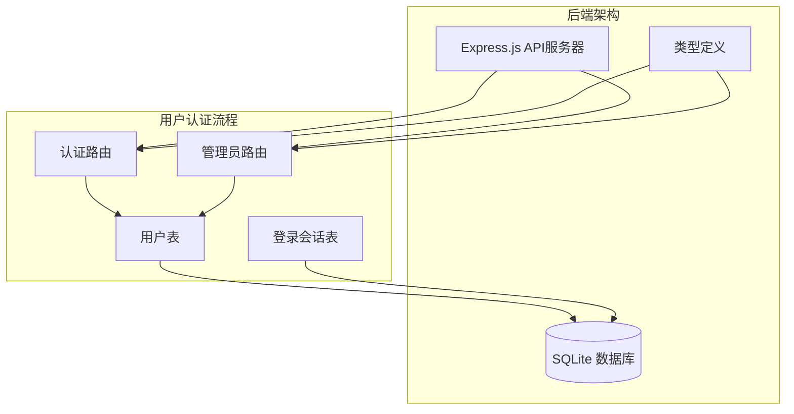
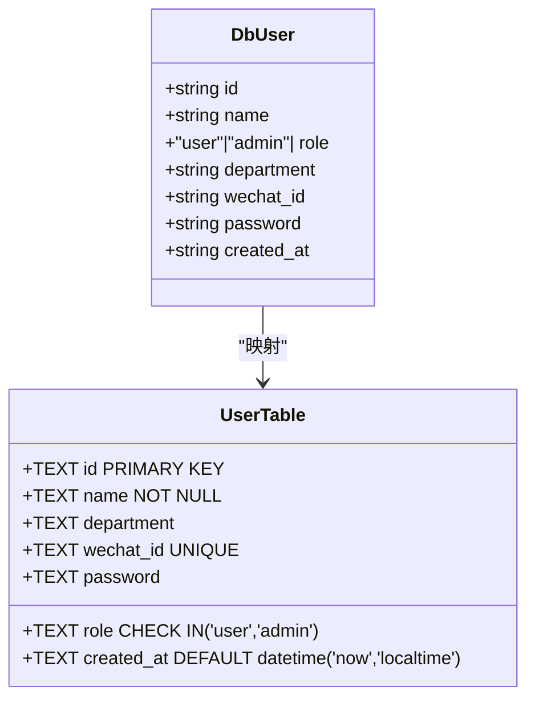
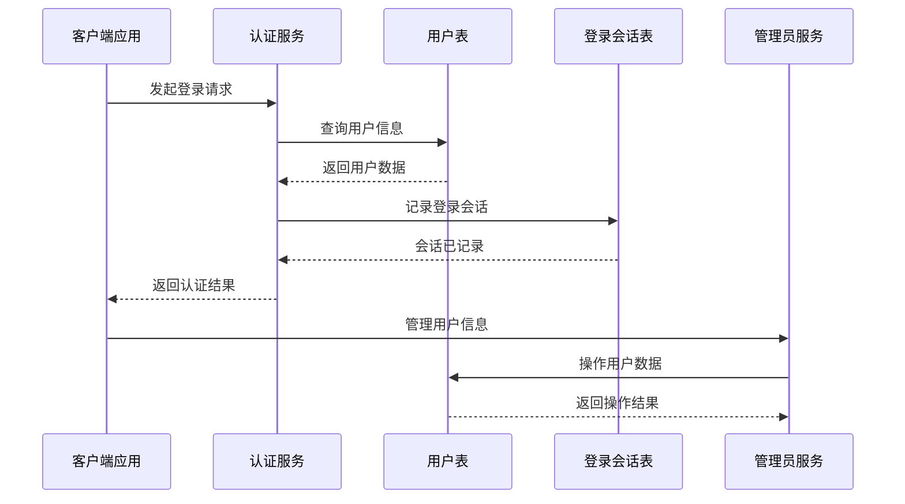
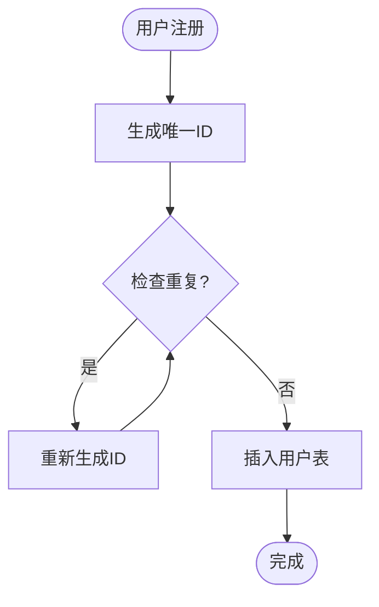
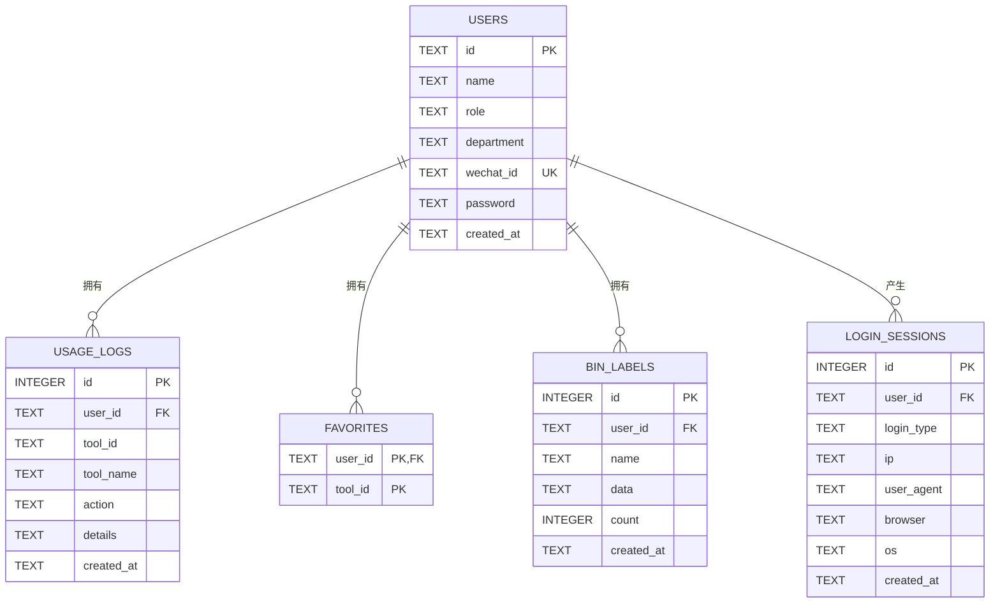
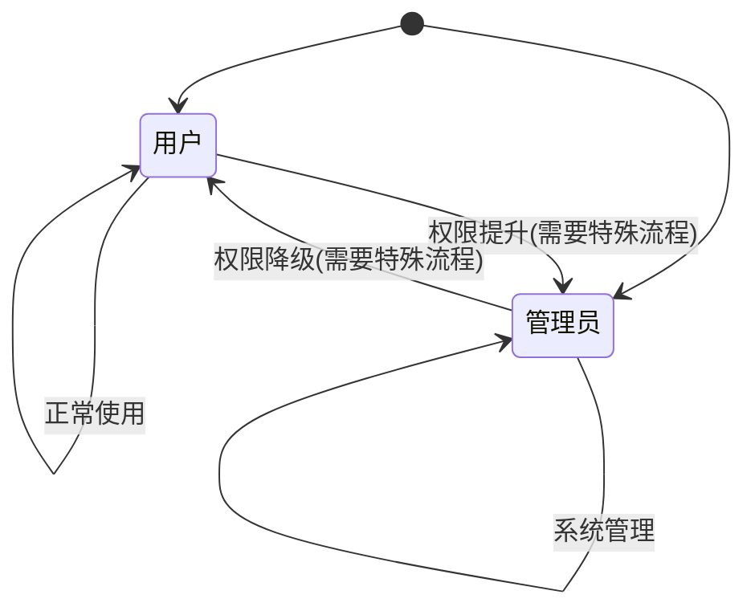
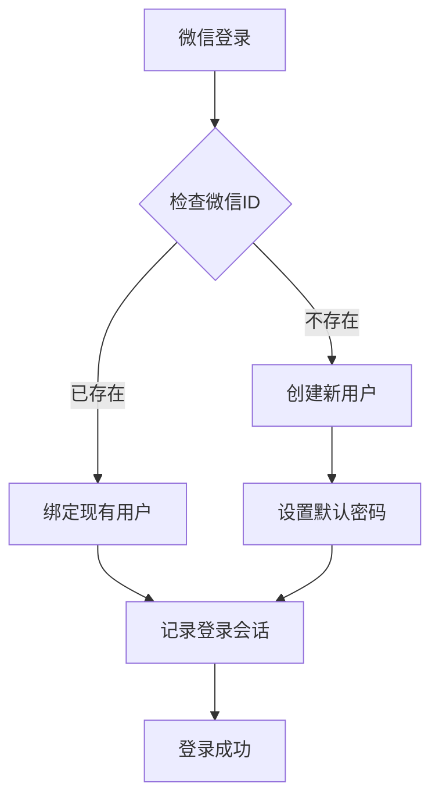
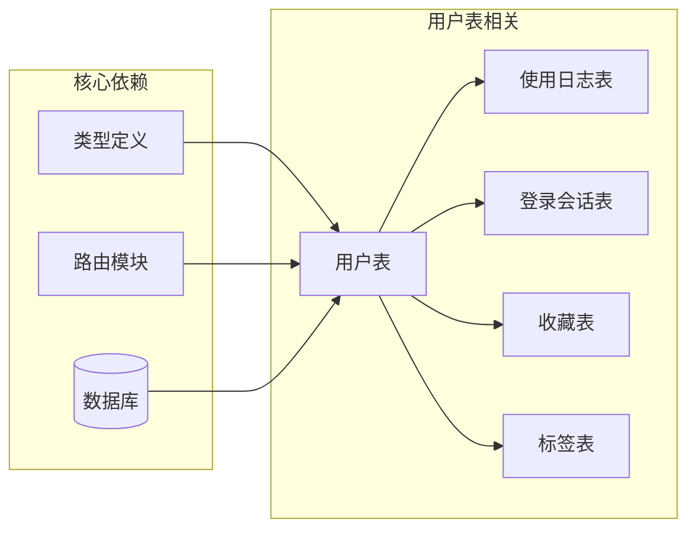

# 用户表设计

<cite>
**本文档中引用的文件**
- [server/src/db.ts](file://server/src/db.ts)
- [server/src/types.ts](file://server/src/types.ts)
- [server/src/routes/auth.ts](file://server/src/routes/auth.ts)
- [server/src/routes/admin.ts](file://server/src/routes/admin.ts)
- [server/src/index.ts](file://server/src/index.ts)
</cite>

## 目录
1. [简介](#简介)
2. [项目结构](#项目结构)
3. [核心组件](#核心组件)
4. [架构概览](#架构概览)
5. [详细组件分析](#详细组件分析)
6. [依赖分析](#依赖分析)
7. [性能考虑](#性能考虑)
8. [故障排除指南](#故障排除指南)
9. [结论](#结论)

## 简介

本文档详细分析了 AnyTools 项目中的用户表（users）数据模型设计。该系统采用 SQLite 作为数据库存储，通过 Express.js 提供 RESTful API 接口。用户表是整个系统的核心数据结构，支持多种登录方式（微信授权、密码登录、访客模式），并集成了完整的用户管理功能。

## 项目结构

AnyTools 项目采用前后端分离架构，后端使用 TypeScript 和 Express.js 构建，数据库采用 SQLite。用户表设计遵循现代数据库设计原则，确保数据完整性、一致性和可扩展性。

**图表来源**
- [server/src/index.ts:1-31](file://server/src/index.ts#L1-L31)
- [server/src/db.ts:12-75](file://server/src/db.ts#L12-L75)

**章节来源**
- [server/src/index.ts:1-31](file://server/src/index.ts#L1-L31)
- [server/src/db.ts:1-126](file://server/src/db.ts#L1-L126)

## 核心组件

用户表（users）是系统的核心数据结构，包含以下关键组件：

### 数据模型定义

用户表采用强类型设计，通过 TypeScript 接口确保类型安全：

**图表来源**
- [server/src/types.ts:1-9](file://server/src/types.ts#L1-L9)
- [server/src/db.ts:14-22](file://server/src/db.ts#L14-L22)

### 字段设计原理

每个字段都经过精心设计以满足业务需求和性能要求：

| 字段名 | 类型 | 约束 | 设计考虑 |
|--------|------|------|----------|
| id | TEXT | PRIMARY KEY | 唯一标识符，便于外部集成 |
| name | TEXT | NOT NULL | 用户显示名称，必填字段 |
| role | TEXT | CHECK IN ('user','admin') | 角色枚举，控制访问权限 |
| department | TEXT | 可选 | 部门信息，支持组织管理 |
| wechat_id | TEXT | UNIQUE | 微信标识符，支持微信登录 |
| password | TEXT | 可选 | 密码字段，支持传统登录 |
| created_at | TEXT | DEFAULT datetime('now','localtime') | 自动记录创建时间 |

**章节来源**
- [server/src/types.ts:1-9](file://server/src/types.ts#L1-L9)
- [server/src/db.ts:14-22](file://server/src/db.ts#L14-L22)

## 架构概览

用户表在整个系统架构中扮演着核心角色，连接认证、授权和审计功能。

**图表来源**
- [server/src/routes/auth.ts:36-106](file://server/src/routes/auth.ts#L36-L106)
- [server/src/routes/admin.ts:18-49](file://server/src/routes/admin.ts#L18-L49)

## 详细组件分析

### 主键设计

用户表采用自定义字符串 ID 作为主键，而非自增整数。这种设计具有以下优势：

1. **外部集成友好**：便于与外部系统（如企业微信）集成
2. **分布式友好**：避免分布式环境下的 ID 冲突问题
3. **业务语义明确**：ID 可以包含业务含义（如 user-001）

**图表来源**
- [server/src/routes/auth.ts:66-73](file://server/src/routes/auth.ts#L66-L73)

### 外键引用关系

用户表与其他表存在清晰的外键关系：

**图表来源**
- [server/src/db.ts:26-75](file://server/src/db.ts#L26-L75)

### 索引策略

系统采用多层次索引策略优化查询性能：

| 索引名称 | 表名 | 列 | 类型 | 用途 |
|----------|------|----|------|------|
| idx_users_wechat | users | wechat_id | UNIQUE | 快速微信登录查找 |
| idx_logs_user | usage_logs | user_id | 普通 | 用户历史查询 |
| idx_logs_tool | usage_logs | tool_id | 普通 | 工具使用统计 |
| idx_logs_time | usage_logs | created_at | 普通 | 时间范围查询 |
| idx_bin_labels_user | bin_labels | user_id | 普通 | 用户标签查询 |
| idx_bin_labels_time | bin_labels | created_at | 普通 | 时间排序 |
| idx_sessions_user | login_sessions | user_id | 普通 | 用户会话查询 |
| idx_sessions_time | login_sessions | created_at | 普通 | 会话审计 |

**章节来源**
- [server/src/db.ts:24](file://server/src/db.ts#L24)
- [server/src/db.ts:37-38](file://server/src/db.ts#L37-L38)
- [server/src/db.ts:59-60](file://server/src/db.ts#L59-L60)
- [server/src/db.ts:73-74](file://server/src/db.ts#L73-L74)

### 用户角色枚举设计

角色字段采用严格的枚举约束，确保系统安全性：

**图表来源**
- [server/src/db.ts:17](file://server/src/db.ts#L17)
- [server/src/types.ts:4](file://server/src/types.ts#L4)

角色设计考虑：
- **最小权限原则**：普通用户仅能访问基本功能
- **权限隔离**：管理员权限严格限制在管理接口
- **审计追踪**：所有权限变更都有记录

### 微信ID唯一性设计

微信ID采用 UNIQUE 约束，确保微信账号与系统用户的唯一对应关系：

**图表来源**
- [server/src/routes/auth.ts:54-82](file://server/src/routes/auth.ts#L54-L82)

微信ID设计的业务意义：
- **身份唯一性**：防止同一微信账号重复注册
- **数据一致性**：确保用户身份的准确性
- **业务简化**：减少用户身份验证的复杂度

### 数据验证规则

系统在多个层面实施数据验证：

1. **数据库层约束**：
   - NOT NULL 约束确保关键字段完整性
   - CHECK 约束限制枚举值范围
   - UNIQUE 约束保证数据唯一性

2. **应用层验证**：
   - API 参数验证
   - 用户输入过滤
   - 业务逻辑校验

3. **类型系统约束**：
   - TypeScript 接口确保编译时类型安全
   - 严格的类型定义防止运行时错误

**章节来源**
- [server/src/db.ts:16-21](file://server/src/db.ts#L16-L21)
- [server/src/routes/admin.ts:26-33](file://server/src/routes/admin.ts#L26-L33)

### 默认值设置

系统采用智能默认值策略：

| 字段 | 默认值 | 设置原因 |
|------|--------|----------|
| created_at | datetime('now','localtime') | 自动记录创建时间，无需手动设置 |
| role | 'user' | 新用户默认普通权限，符合最小权限原则 |
| department | 空字符串 | 可选字段，允许延迟填充 |
| password | null | 支持多种登录方式，不强制密码 |

### 安全考虑

系统在多个层面实施安全措施：

1. **密码处理**：
   - 当前实现使用明文存储（开发环境）
   - 生产环境建议使用哈希算法加密存储

2. **会话管理**：
   - 自动记录登录信息（IP、浏览器、操作系统）
   - 支持访客模式，便于匿名访问

3. **权限控制**：
   - 管理员接口需要特殊权限
   - 所有敏感操作都有审计日志

4. **数据保护**：
   - SQLite WAL 模式提高并发性能
   - 外键约束确保数据完整性

**章节来源**
- [server/src/routes/auth.ts:24-29](file://server/src/routes/auth.ts#L24-L29)
- [server/src/routes/admin.ts:7-14](file://server/src/routes/admin.ts#L7-L14)

## 依赖分析

用户表与其他组件的依赖关系如下：

**图表来源**
- [server/src/types.ts:1-9](file://server/src/types.ts#L1-L9)
- [server/src/routes/auth.ts:1-5](file://server/src/routes/auth.ts#L1-L5)
- [server/src/routes/admin.ts:1-5](file://server/src/routes/admin.ts#L1-L5)

**章节来源**
- [server/src/types.ts:1-46](file://server/src/types.ts#L1-L46)
- [server/src/routes/auth.ts:1-109](file://server/src/routes/auth.ts#L1-L109)
- [server/src/routes/admin.ts:1-93](file://server/src/routes/admin.ts#L1-L93)

## 性能考虑

### 查询优化

1. **索引策略**：
   - 在 wechat_id 上建立唯一索引，优化微信登录性能
   - 在 user_id 上建立索引，支持用户相关查询
   - 在 created_at 上建立索引，支持时间范围查询

2. **查询模式优化**：
   - 使用 LIMIT 和 OFFSET 实现分页查询
   - 支持关键词搜索的模糊匹配
   - 提供聚合查询支持

### 存储优化

1. **数据类型选择**：
   - 使用 TEXT 类型存储 ID，便于扩展
   - 采用 DEFAULT 值减少存储开销
   - 合理使用 NULL 值表示可选字段

2. **事务处理**：
   - 使用事务批量插入示例数据
   - 支持 ACID 特性确保数据一致性

## 故障排除指南

### 常见问题及解决方案

1. **微信登录失败**：
   - 检查 wechat_id 是否唯一
   - 验证用户是否存在
   - 确认数据库连接正常

2. **用户创建失败**：
   - 检查必填字段是否完整
   - 验证角色枚举值
   - 确认 ID 是否重复

3. **权限访问被拒绝**：
   - 检查用户角色
   - 验证管理员权限
   - 确认请求头中的用户ID

### 调试建议

1. **启用详细日志**：
   - 记录数据库操作
   - 跟踪用户认证过程
   - 监控异常情况

2. **性能监控**：
   - 监控查询执行时间
   - 分析索引使用情况
   - 评估数据库负载

**章节来源**
- [server/src/routes/auth.ts:54-106](file://server/src/routes/auth.ts#L54-L106)
- [server/src/routes/admin.ts:18-49](file://server/src/routes/admin.ts#L18-L49)

## 结论

用户表设计体现了现代 Web 应用的最佳实践，具有以下特点：

1. **设计合理**：字段设计符合业务需求，约束条件完善
2. **性能优秀**：合理的索引策略和查询优化
3. **安全可靠**：多层安全防护和权限控制
4. **易于扩展**：模块化设计支持功能扩展
5. **维护友好**：清晰的代码结构和完善的注释

### 未来演进方向

1. **增强安全**：
   - 实现密码哈希存储
   - 添加双因素认证
   - 引入更细粒度的权限控制

2. **性能优化**：
   - 实现缓存机制
   - 优化大数据量场景
   - 支持读写分离

3. **功能扩展**：
   - 支持多租户模式
   - 添加用户画像功能
   - 实现用户行为分析

4. **技术升级**：
   - 迁移到更强大的数据库
   - 实现微服务架构
   - 添加 GraphQL 支持

该用户表设计为 AnyTools 系统提供了坚实的数据基础，能够支持当前业务需求并为未来发展奠定良好基础。