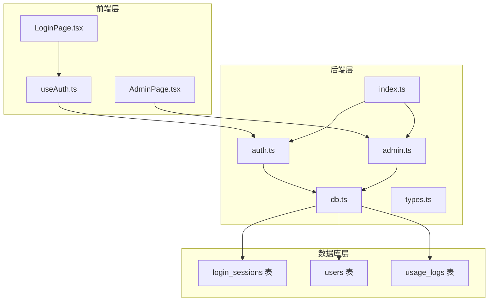
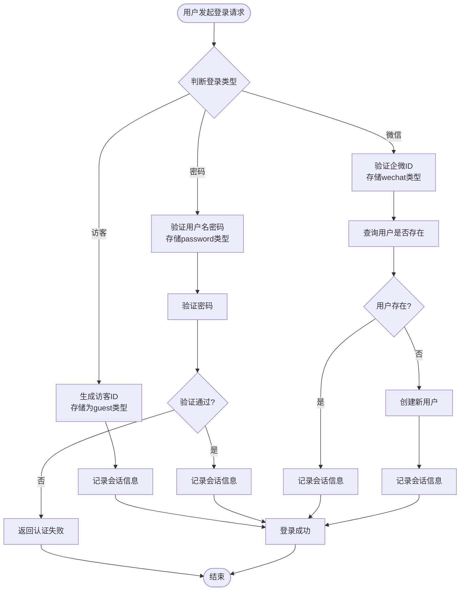
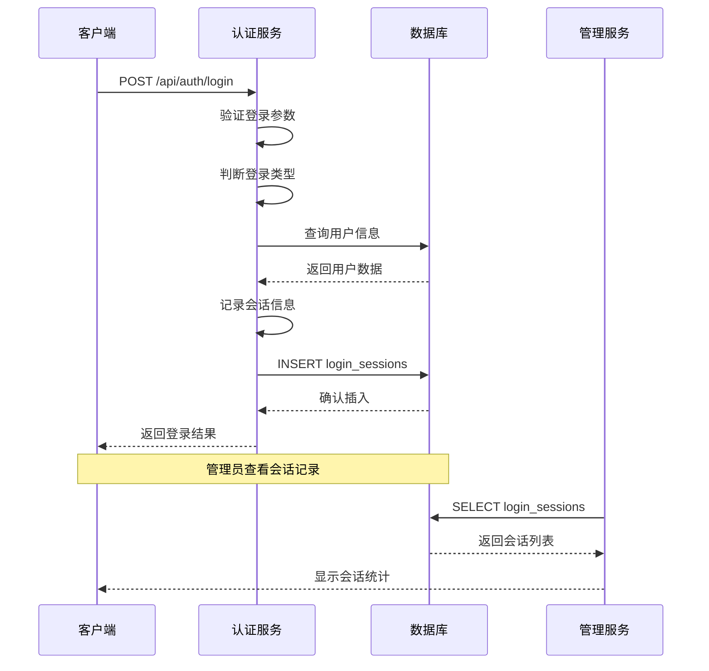
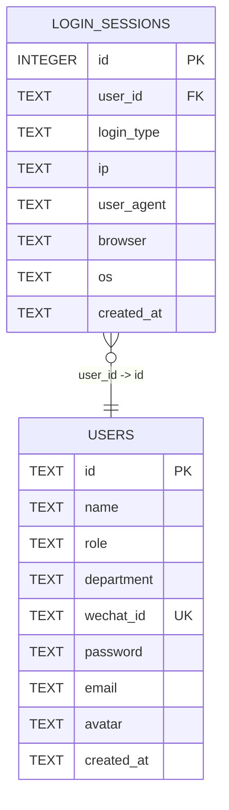
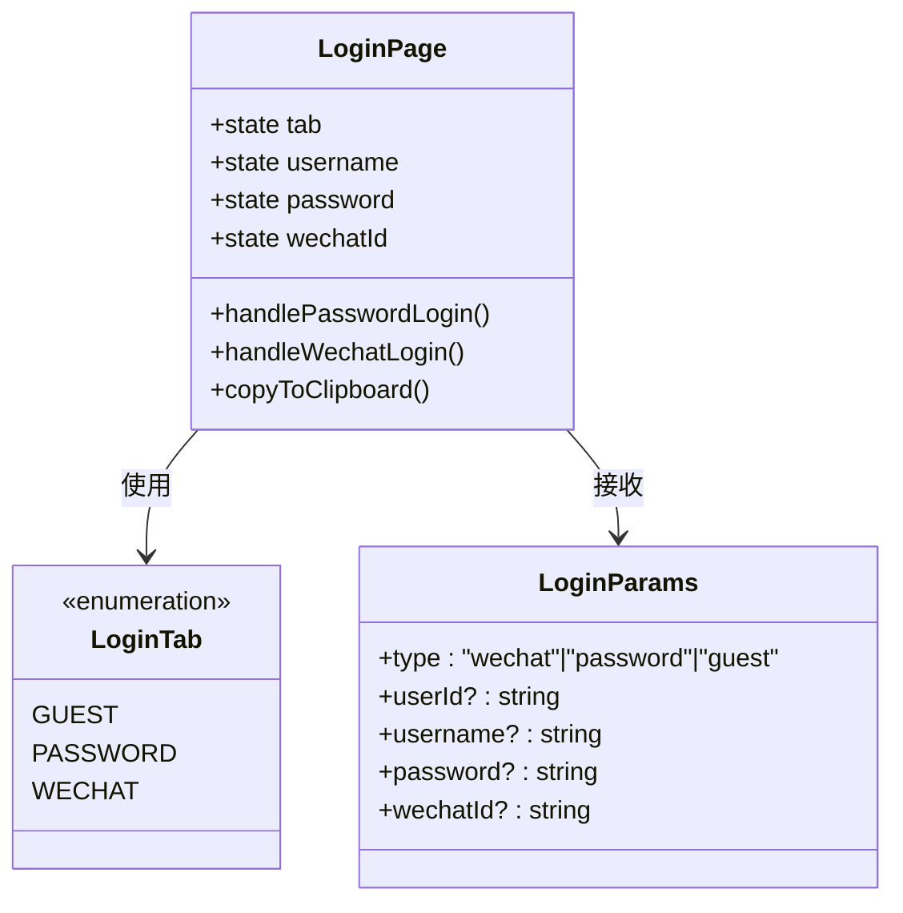
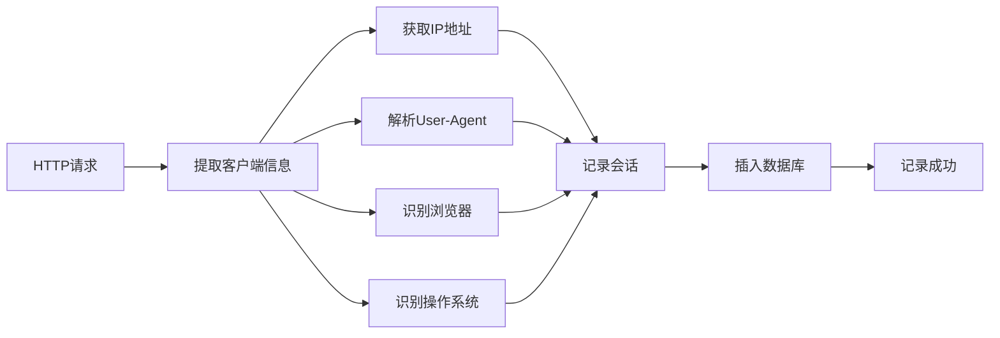
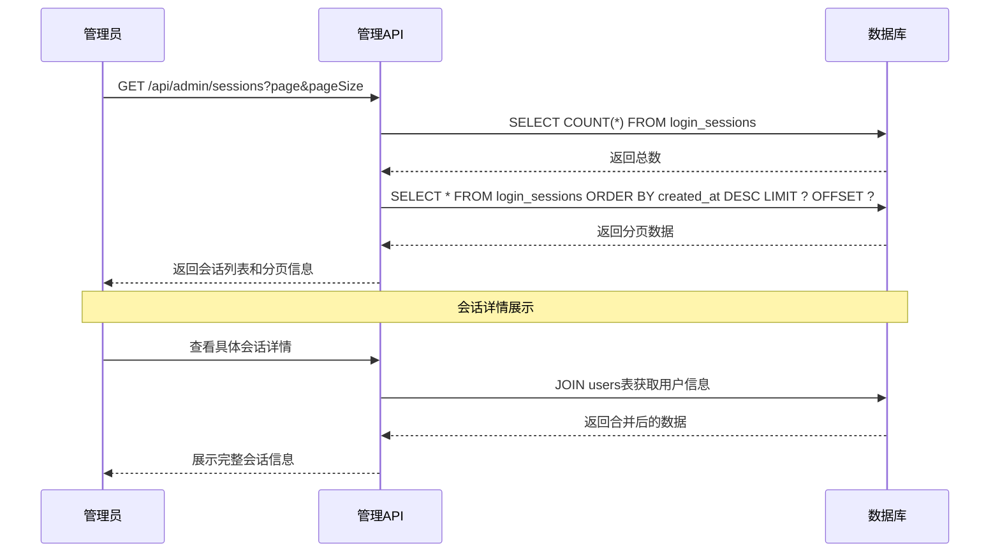
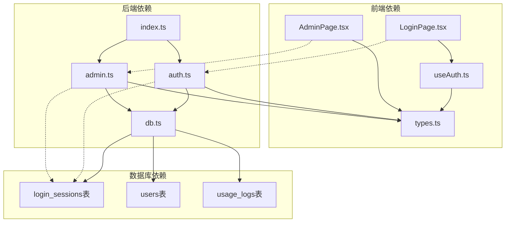

# 登录会话表设计

<cite>
**本文档引用的文件**
- [server/src/db.ts](file://server/src/db.ts)
- [server/src/types.ts](file://server/src/types.ts)
- [server/src/routes/auth.ts](file://server/src/routes/auth.ts)
- [server/src/routes/admin.ts](file://server/src/routes/admin.ts)
- [src/pages/LoginPage.tsx](file://src/pages/LoginPage.tsx)
- [src/hooks/useAuth.ts](file://src/hooks/useAuth.ts)
- [src/pages/AdminPage.tsx](file://src/pages/AdminPage.tsx)
- [server/src/index.ts](file://server/src/index.ts)
</cite>

## 目录
1. [简介](#简介)
2. [项目结构](#项目结构)
3. [核心组件](#核心组件)
4. [架构概览](#架构概览)
5. [详细组件分析](#详细组件分析)
6. [依赖关系分析](#依赖关系分析)
7. [性能考虑](#性能考虑)
8. [故障排除指南](#故障排除指南)
9. [结论](#结论)

## 简介

本文档详细描述了登录会话表（login_sessions）的数据模型设计，包括会话ID、用户ID、登录类型、IP地址、用户代理、浏览器、操作系统等字段的设计原理。文档解释了不同登录方式（微信、密码、访客）的技术实现和数据存储策略，阐述了会话管理的安全考虑和审计需求，并提供了会话数据的清理策略和安全防护措施。

## 项目结构

该项目采用前后端分离的架构设计，主要分为以下模块：

**图表来源**
- [server/src/index.ts:1-31](file://server/src/index.ts#L1-L31)
- [server/src/db.ts:64-77](file://server/src/db.ts#L64-L77)

**章节来源**
- [server/src/index.ts:1-31](file://server/src/index.ts#L1-L31)
- [server/src/db.ts:13-77](file://server/src/db.ts#L13-L77)

## 核心组件

### 数据模型定义

登录会话表的设计遵循以下核心原则：

| 字段名 | 类型 | 约束 | 描述 | 设计考虑 |
|--------|------|------|------|----------|
| id | INTEGER | PRIMARY KEY, AUTOINCREMENT | 会话记录唯一标识符 | 自增主键，确保唯一性 |
| user_id | TEXT | NOT NULL, FOREIGN KEY | 关联用户表的外键 | 引用用户表，建立会话与用户的关联 |
| login_type | TEXT | NOT NULL, CHECK | 登录方式类型 | 枚举约束，限制合法值范围 |
| ip | TEXT | NULL | 客户端IP地址 | 存储真实IP，支持NULL值 |
| user_agent | TEXT | NULL | 用户代理字符串 | 完整的UA信息，便于分析 |
| browser | TEXT | NULL | 浏览器类型 | 简化的浏览器识别结果 |
| os | TEXT | NULL | 操作系统类型 | 简化的操作系统识别结果 |
| created_at | TEXT | DEFAULT (datetime('now','localtime')) | 创建时间戳 | 自动记录会话创建时间 |

**章节来源**
- [server/src/db.ts:64-77](file://server/src/db.ts#L64-L77)
- [server/src/types.ts:38-47](file://server/src/types.ts#L38-L47)

### 登录类型枚举设计

系统支持三种登录方式，每种都有特定的数据存储策略：

**图表来源**
- [server/src/routes/auth.ts:165-230](file://server/src/routes/auth.ts#L165-L230)

**章节来源**
- [server/src/routes/auth.ts:165-230](file://server/src/routes/auth.ts#L165-L230)

## 架构概览

系统采用三层架构设计，实现了完整的会话管理流程：

**图表来源**
- [server/src/routes/auth.ts:24-29](file://server/src/routes/auth.ts#L24-L29)
- [server/src/routes/admin.ts:53-65](file://server/src/routes/admin.ts#L53-L65)

**章节来源**
- [server/src/routes/auth.ts:24-29](file://server/src/routes/auth.ts#L24-L29)
- [server/src/routes/admin.ts:53-65](file://server/src/routes/admin.ts#L53-L65)

## 详细组件分析

### 数据库表结构设计

登录会话表采用了优化的索引策略来支持高效的查询：

**图表来源**
- [server/src/db.ts:64-77](file://server/src/db.ts#L64-L77)
- [server/src/db.ts:14-24](file://server/src/db.ts#L14-L24)

#### 索引策略分析

系统为登录会话表建立了两个关键索引：

1. **用户索引** (`idx_sessions_user`): 优化按用户查询的性能
2. **时间索引** (`idx_sessions_time`): 优化按时间排序和分页查询的性能

这些索引设计支持常见的查询模式：
- 获取特定用户的登录历史
- 按时间倒序查看最新登录记录
- 分页浏览大量会话数据

**章节来源**
- [server/src/db.ts:75-76](file://server/src/db.ts#L75-L76)

### 前端登录界面设计

前端登录页面提供了三种登录方式的直观界面：

**图表来源**
- [src/pages/LoginPage.tsx:22-56](file://src/pages/LoginPage.tsx#L22-L56)
- [src/hooks/useAuth.ts:6-18](file://src/hooks/useAuth.ts#L6-L18)

#### 登录方式实现

每种登录方式都有特定的处理逻辑：

**访客登录** (`type: "guest"`):
- 生成临时访客ID
- 直接创建访客用户
- 记录访客类型的会话

**密码登录** (`type: "password"`):
- 验证用户名和密码
- 支持用户名或用户ID登录
- 密码验证支持明文匹配

**微信登录** (`type: "wechat"`):
- 验证企微ID
- 如果用户不存在则自动创建
- 绑定企微ID到用户账户

**章节来源**
- [src/pages/LoginPage.tsx:161-238](file://src/pages/LoginPage.tsx#L161-L238)
- [server/src/routes/auth.ts:174-229](file://server/src/routes/auth.ts#L174-L229)

### 后端会话记录机制

会话记录通过统一的函数实现，确保所有登录方式的一致性：

**图表来源**
- [server/src/routes/auth.ts:7-22](file://server/src/routes/auth.ts#L7-L22)
- [server/src/routes/auth.ts:24-29](file://server/src/routes/auth.ts#L24-L29)

#### 客户端信息提取策略

系统采用多层IP地址检测机制：
1. 优先使用 `x-forwarded-for` 头部（代理服务器）
2. 回退到 `socket.remoteAddress`（直接连接）
3. 最终回退到空字符串

用户代理解析支持主流浏览器和操作系统：
- 浏览器：Chrome、Firefox、Safari、Edge
- 操作系统：Windows、macOS、Linux

**章节来源**
- [server/src/routes/auth.ts:7-22](file://server/src/routes/auth.ts#L7-L22)

### 管理员会话监控

管理员界面提供了完整的会话监控功能：

**图表来源**
- [server/src/routes/admin.ts:53-65](file://server/src/routes/admin.ts#L53-L65)
- [src/pages/AdminPage.tsx:246-289](file://src/pages/AdminPage.tsx#L246-L289)

**章节来源**
- [server/src/routes/admin.ts:53-65](file://server/src/routes/admin.ts#L53-L65)
- [src/pages/AdminPage.tsx:246-289](file://src/pages/AdminPage.tsx#L246-L289)

## 依赖关系分析

系统各组件之间的依赖关系如下：

**图表来源**
- [server/src/index.ts:3-8](file://server/src/index.ts#L3-L8)
- [server/src/db.ts:64-77](file://server/src/db.ts#L64-L77)

**章节来源**
- [server/src/index.ts:3-8](file://server/src/index.ts#L3-L8)
- [server/src/db.ts:64-77](file://server/src/db.ts#L64-L77)

## 性能考虑

### 查询优化策略

1. **索引优化**
   - 在 `user_id` 上建立索引，支持快速按用户查询
   - 在 `created_at` 上建立索引，支持时间排序和分页

2. **分页查询**
   - 管理员接口支持分页，限制每页最大记录数为100条
   - 使用 `LIMIT` 和 `OFFSET` 实现高效分页

3. **连接查询优化**
   - 使用 `LEFT JOIN` 获取会话用户信息
   - 避免不必要的列选择，只查询需要的字段

### 存储优化

1. **数据类型选择**
   - 使用 `TEXT` 存储所有字符串数据，确保兼容性
   - 使用 `INTEGER` 存储自增ID，节省存储空间

2. **默认值策略**
   - 所有可为空字段都允许NULL值
   - 时间戳使用数据库默认值，减少应用层处理

## 故障排除指南

### 常见问题及解决方案

**会话记录缺失**
- 检查 `getClientInfo` 函数是否正确提取客户端信息
- 验证数据库连接是否正常
- 确认 `recordSession` 调用是否被执行

**登录类型显示异常**
- 检查登录参数中的 `type` 字段
- 验证数据库中 `login_type` 的枚举值
- 确认前端标签映射是否正确

**管理员界面数据不显示**
- 检查 `/api/admin/sessions` 接口的分页参数
- 验证数据库中是否有会话记录
- 确认用户权限验证是否通过

**章节来源**
- [server/src/routes/auth.ts:24-29](file://server/src/routes/auth.ts#L24-L29)
- [server/src/routes/admin.ts:53-65](file://server/src/routes/admin.ts#L53-L65)

### 调试建议

1. **启用详细日志**
   - 在 `getClientInfo` 函数中添加调试输出
   - 监控数据库执行的SQL语句

2. **测试边界条件**
   - 测试空IP地址的情况
   - 验证未知浏览器和操作系统的处理
   - 测试大量会话数据的查询性能

3. **监控数据库状态**
   - 定期检查索引使用情况
   - 监控表大小和查询性能指标

## 结论

登录会话表设计体现了现代Web应用对用户行为追踪和安全管理的需求。通过合理的数据模型设计、完善的索引策略和清晰的业务逻辑实现，系统能够有效地支持多种登录方式、提供完整的审计功能，并具备良好的扩展性和维护性。

该设计的主要优势包括：
- **完整性**: 支持三种登录方式，覆盖主要用户场景
- **可追溯性**: 详细的客户端信息记录，便于安全审计
- **可扩展性**: 模块化设计，易于添加新的登录方式
- **性能优化**: 合理的索引策略和查询优化
- **安全性**: 完善的错误处理和数据验证机制

未来可以考虑的改进方向：
- 添加会话过期机制
- 增强安全审计功能
- 实现会话数据的定期清理策略
- 添加更细粒度的权限控制