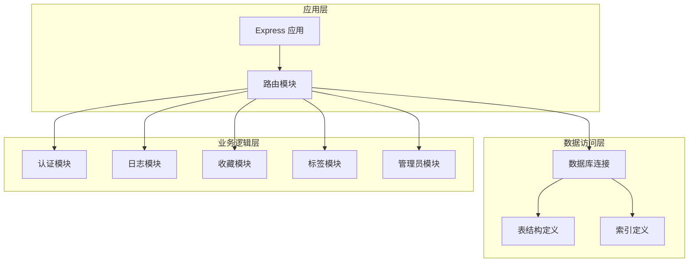
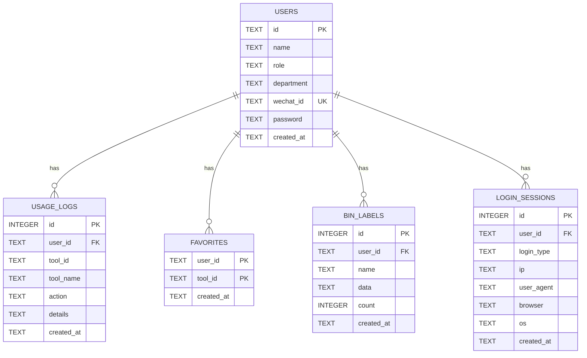
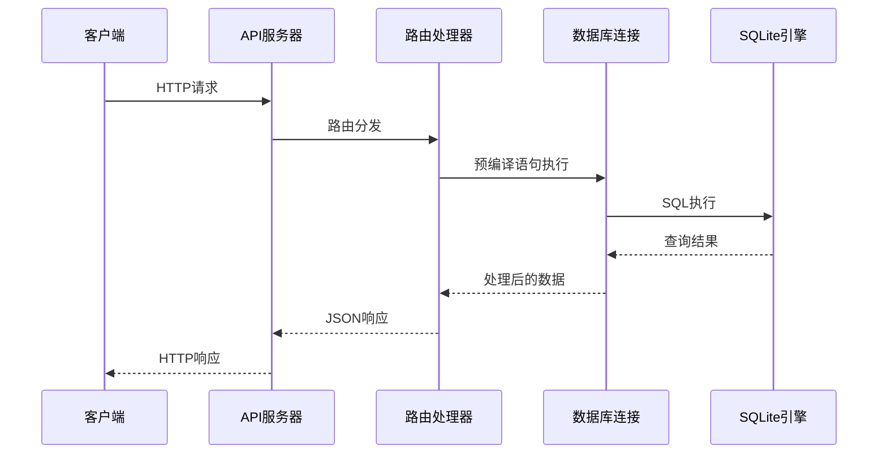
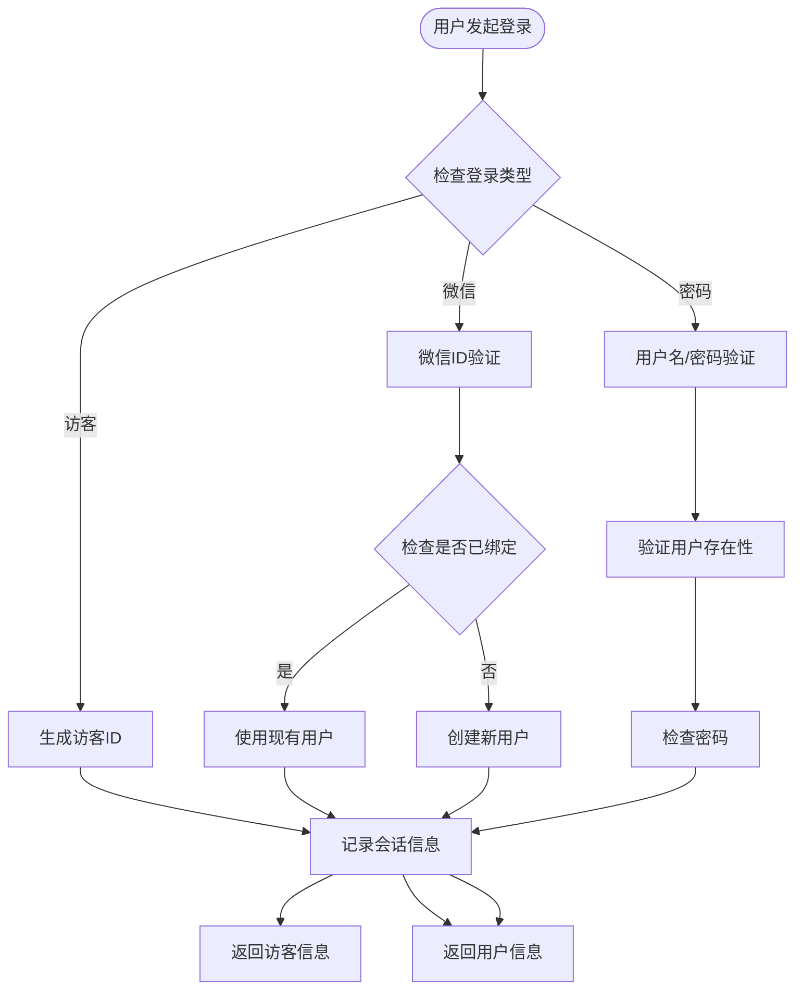
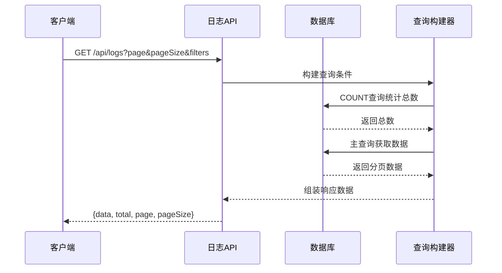
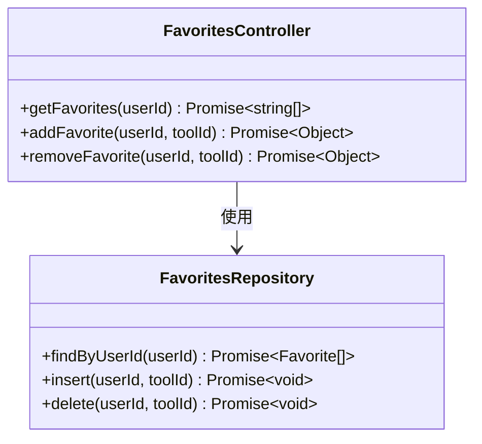
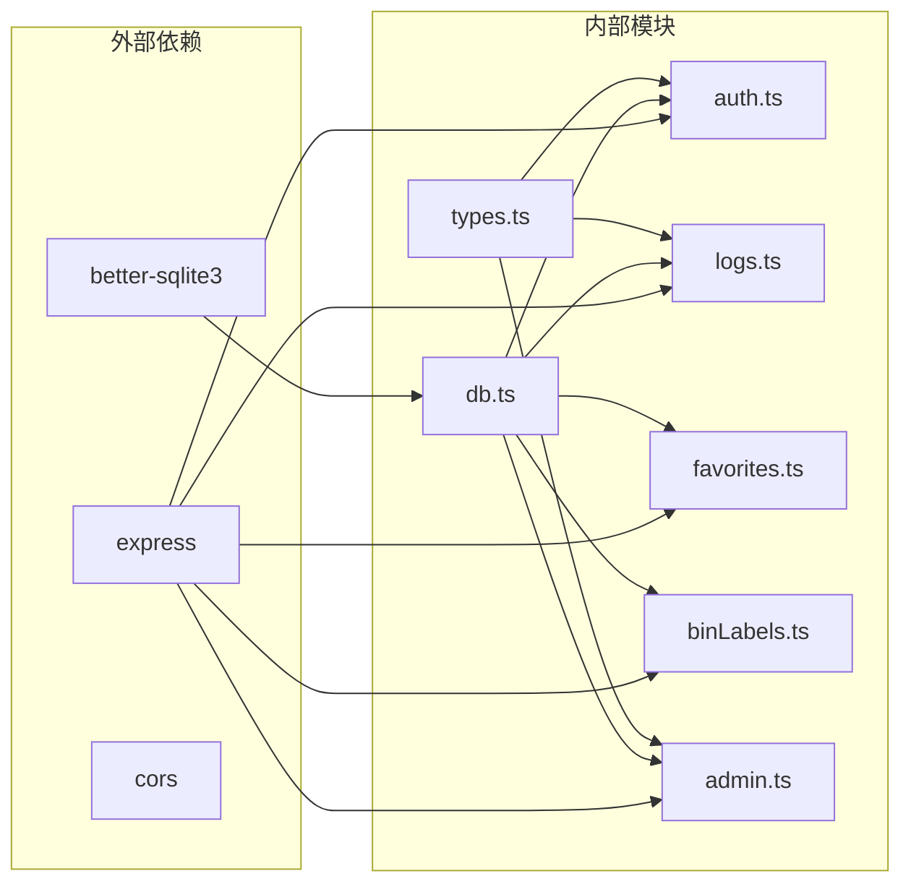
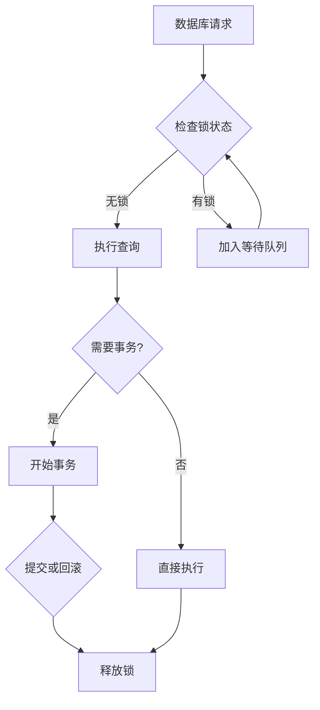
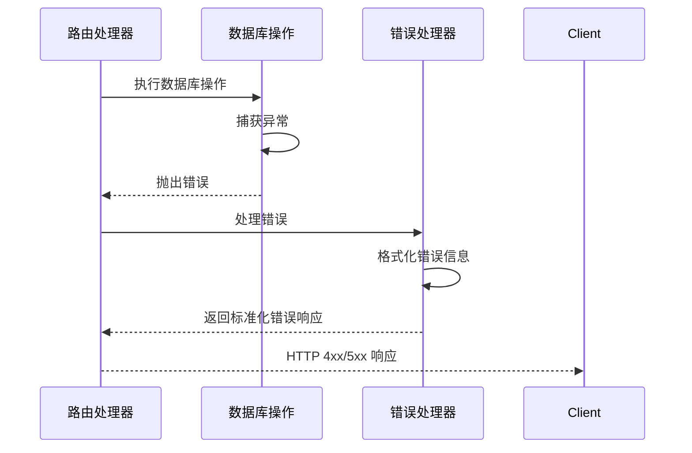

# 数据访问模式

<cite>
**本文档引用的文件**
- [db.ts](file://server/src/db.ts)
- [index.ts](file://server/src/index.ts)
- [auth.ts](file://server/src/routes/auth.ts)
- [logs.ts](file://server/src/routes/logs.ts)
- [favorites.ts](file://server/src/routes/favorites.ts)
- [binLabels.ts](file://server/src/routes/binLabels.ts)
- [admin.ts](file://server/src/routes/admin.ts)
- [types.ts](file://server/src/types.ts)
- [package.json](file://server/package.json)
</cite>

## 目录
1. [简介](#简介)
2. [项目结构](#项目结构)
3. [核心组件](#核心组件)
4. [架构概览](#架构概览)
5. [详细组件分析](#详细组件分析)
6. [依赖关系分析](#依赖关系分析)
7. [性能考虑](#性能考虑)
8. [故障排除指南](#故障排除指南)
9. [结论](#结论)

## 简介

本项目采用 SQLite 作为主要数据存储，通过 Express.js 提供 RESTful API 接口。数据访问层基于 better-sqlite3 库实现，采用预编译语句防止 SQL 注入攻击，并通过事务处理确保数据一致性。系统实现了完整的用户管理、日志记录、收藏功能和二进制标签管理等业务功能。

## 项目结构

后端服务采用模块化架构，主要分为以下几个层次：

**图表来源**
- [index.ts:1-31](file://server/src/index.ts#L1-L31)
- [db.ts:1-126](file://server/src/db.ts#L1-L126)

**章节来源**
- [index.ts:1-31](file://server/src/index.ts#L1-L31)
- [package.json:1-23](file://server/package.json#L1-L23)

## 核心组件

### 数据库连接与配置

系统使用 better-sqlite3 作为 SQLite 的 Node.js 绑定，提供了高性能的本地数据库解决方案。数据库配置包括：

- **WAL 模式**：启用写-ahead 日志模式，提高并发读取性能
- **外键约束**：启用外键检查，确保数据完整性
- **路径管理**：动态计算数据库文件路径，支持模块化部署

### 表结构设计

系统包含以下核心表：

**图表来源**
- [db.ts:13-75](file://server/src/db.ts#L13-L75)

### 索引策略

系统为关键查询字段建立了专门的索引：

- **users 表**：wechat_id 唯一索引，用于快速用户查找
- **usage_logs 表**：user_id、tool_id、created_at 复合索引，支持多维度查询
- **bin_labels 表**：user_id、created_at 索引，优化用户历史记录查询
- **login_sessions 表**：user_id、created_at 索引，支持会话管理查询

**章节来源**
- [db.ts:24](file://server/src/db.ts#L24)
- [db.ts:37-39](file://server/src/db.ts#L37-L39)
- [db.ts:59-60](file://server/src/db.ts#L59-L60)
- [db.ts:73-74](file://server/src/db.ts#L73-L74)

## 架构概览

系统采用分层架构，数据访问层通过预编译语句实现安全的数据库操作：

**图表来源**
- [index.ts:17-22](file://server/src/index.ts#L17-L22)
- [auth.ts:36-106](file://server/src/routes/auth.ts#L36-L106)
- [db.ts:8](file://server/src/db.ts#L8)

## 详细组件分析

### 认证与会话管理

认证模块实现了多种登录方式，包括微信登录、密码登录和访客登录：

**图表来源**
- [auth.ts:36-106](file://server/src/routes/auth.ts#L36-L106)
- [auth.ts:24-29](file://server/src/routes/auth.ts#L24-L29)

#### 预编译语句使用

认证模块中所有用户输入都通过预编译语句处理：

- 用户查询：`SELECT id, name, role, department, wechat_id FROM users WHERE wechat_id = ?`
- 用户创建：`INSERT INTO users (id, name, role, department, wechat_id, password) VALUES (?, ?, 'user', '待设置', ?, ?)`
- 会话记录：`INSERT INTO login_sessions (user_id, login_type, ip, user_agent, browser, os) VALUES (?, ?, ?, ?, ?, ?)`

**章节来源**
- [auth.ts:36-106](file://server/src/routes/auth.ts#L36-L106)

### 日志记录与统计

日志模块提供了完整的使用日志记录和统计分析功能：

#### 分页查询实现

**图表来源**
- [logs.ts:21-69](file://server/src/routes/logs.ts#L21-L69)

#### 聚合查询策略

系统实现了多种聚合查询模式：

- **时间范围统计**：按日、周、月统计使用次数
- **热门工具排行**：统计使用频率最高的工具
- **用户活跃度**：分析用户使用行为模式
- **趋势分析**：14天使用趋势可视化

**章节来源**
- [logs.ts:72-131](file://server/src/routes/logs.ts#L72-L131)

### 收藏功能

收藏模块实现了用户工具收藏的增删查功能：

**图表来源**
- [favorites.ts:6-31](file://server/src/routes/favorites.ts#L6-L31)

**章节来源**
- [favorites.ts:6-31](file://server/src/routes/favorites.ts#L6-L31)

### 二进制标签管理

标签模块提供了用户生成记录的完整生命周期管理：

- **查询接口**：支持按用户过滤的历史记录查询
- **详情接口**：获取单条记录的完整信息
- **创建接口**：保存新的生成记录
- **删除接口**：安全删除用户自己的记录

**章节来源**
- [binLabels.ts:15-65](file://server/src/routes/binLabels.ts#L15-L65)

### 管理员功能

管理员模块提供了系统管理功能，包含：

- **用户管理**：CRUD 操作和权限控制
- **会话监控**：查看所有用户登录会话
- **全量日志**：管理员视角的日志查询

**章节来源**
- [admin.ts:7-93](file://server/src/routes/admin.ts#L7-L93)

## 依赖关系分析

系统的核心依赖关系如下：

**图表来源**
- [package.json:10-21](file://server/package.json#L10-L21)
- [db.ts:1](file://server/src/db.ts#L1)
- [auth.ts:1](file://server/src/routes/auth.ts#L1)

**章节来源**
- [package.json:10-21](file://server/package.json#L10-L21)

## 性能考虑

### 连接池管理

由于使用 SQLite 作为本地数据库，系统采用单连接模式而非连接池。SQLite 在单进程内使用单连接时性能最佳，避免了连接池管理的复杂性。

### 查询优化策略

1. **索引优化**
   - 为高频查询字段建立适当索引
   - 使用复合索引支持多条件查询
   - 定期分析查询计划优化索引策略

2. **查询缓存**
   - 对静态数据和不频繁变更的数据进行内存缓存
   - 实现 LRU 缓存策略减少重复查询

3. **批量操作**
   - 使用事务批量插入大量数据
   - 合并相似查询减少数据库往返

### 并发控制

**图表来源**
- [db.ts:109-122](file://server/src/db.ts#L109-L122)

## 故障排除指南

### 常见问题及解决方案

1. **数据库连接问题**
   - 检查数据库文件路径和权限
   - 验证 SQLite 文件完整性
   - 确认 WAL 模式配置正确

2. **查询性能问题**
   - 分析慢查询日志
   - 检查索引使用情况
   - 优化 WHERE 条件和排序字段

3. **事务失败处理**
   - 实现自动重试机制
   - 提供详细的错误回滚信息
   - 监控事务超时情况

### 错误处理模式

系统采用统一的错误处理模式：

**图表来源**
- [admin.ts:28-34](file://server/src/routes/admin.ts#L28-L34)

**章节来源**
- [admin.ts:28-34](file://server/src/routes/admin.ts#L28-L34)

## 结论

本项目展示了在 Node.js 环境下使用 SQLite 进行高效数据访问的最佳实践。通过预编译语句、事务处理、索引优化和合理的架构设计，系统实现了安全、可靠且高性能的数据访问层。

关键优势包括：
- **安全性**：全面的 SQL 注入防护
- **性能**：针对 SQLite 特性的优化策略
- **可维护性**：清晰的模块化架构和类型安全
- **扩展性**：支持未来功能扩展和性能优化

建议后续改进方向：
- 实现连接池以支持更高并发
- 添加查询缓存机制
- 建立更完善的监控和日志系统
- 考虑数据备份和恢复策略