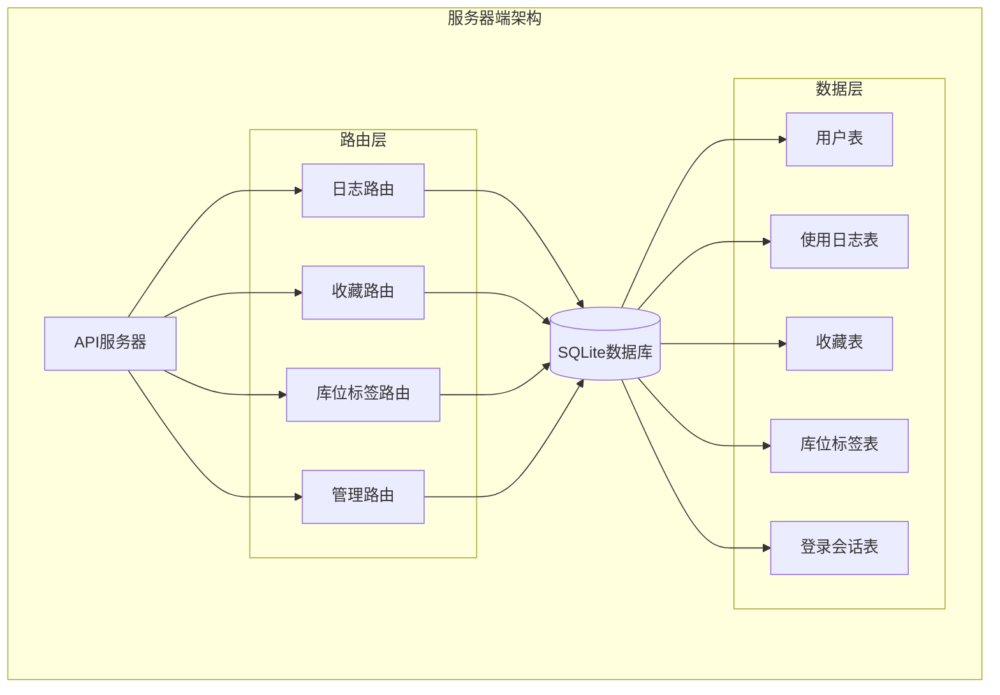
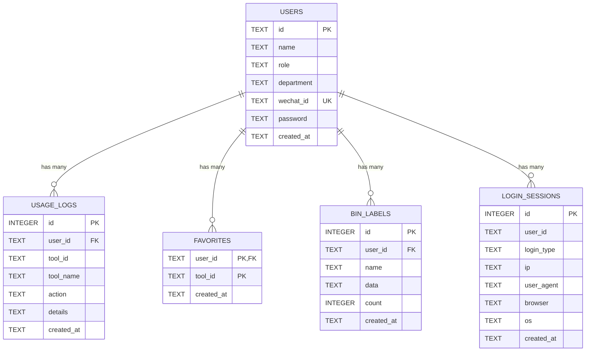
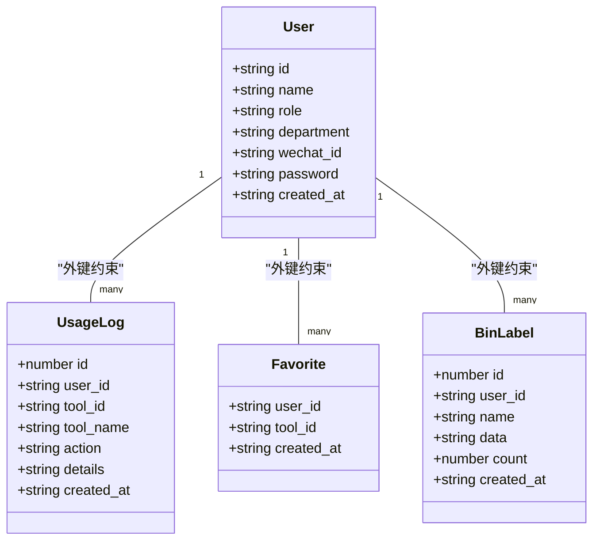
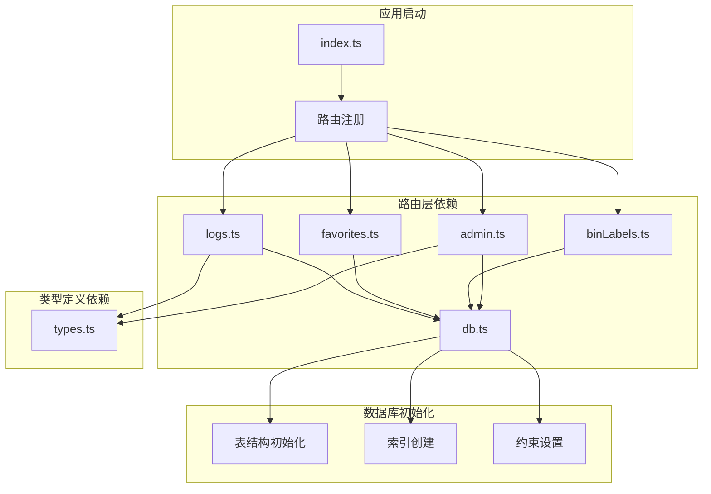

# 表关系设计

<cite>
**本文档引用的文件**
- [db.ts](file://server/src/db.ts)
- [types.ts](file://server/src/types.ts)
- [logs.ts](file://server/src/routes/logs.ts)
- [favorites.ts](file://server/src/routes/favorites.ts)
- [binLabels.ts](file://server/src/routes/binLabels.ts)
- [admin.ts](file://server/src/routes/admin.ts)
- [index.ts](file://server/src/index.ts)
</cite>

## 目录
1. [简介](#简介)
2. [项目结构](#项目结构)
3. [核心组件](#核心组件)
4. [架构概览](#架构概览)
5. [详细组件分析](#详细组件分析)
6. [依赖分析](#依赖分析)
7. [性能考虑](#性能考虑)
8. [故障排除指南](#故障排除指南)
9. [结论](#结论)

## 简介

本文件详细阐述了AnyTools项目的数据库表关系设计，重点分析用户表与其他相关表之间的关联关系和约束设计。该系统采用SQLite作为数据库引擎，通过外键约束确保数据完整性，并通过合理的索引策略优化查询性能。

## 项目结构

该项目采用前后端分离的架构设计，后端使用Express.js框架，数据库操作通过better-sqlite3库实现。数据库初始化和表结构定义集中在单一文件中，便于维护和版本控制。

**图表来源**
- [index.ts:17-22](file://server/src/index.ts#L17-L22)
- [db.ts:13-75](file://server/src/db.ts#L13-L75)

**章节来源**
- [index.ts:1-31](file://server/src/index.ts#L1-L31)
- [db.ts:1-126](file://server/src/db.ts#L1-L126)

## 核心组件

系统的核心数据模型由五个主要表组成，每个表都有明确的职责和约束：

### 用户表 (users)
- **主键**: id (TEXT, PRIMARY KEY)
- **唯一约束**: wechat_id (UNIQUE)
- **检查约束**: role IN ('user', 'admin')
- **默认值**: created_at (datetime('now', 'localtime'))

### 使用日志表 (usage_logs)
- **主键**: id (INTEGER, PRIMARY KEY AUTOINCREMENT)
- **外键**: user_id -> users(id)
- **索引**: idx_logs_user, idx_logs_tool, idx_logs_time

### 收藏表 (favorites)
- **复合主键**: (user_id, tool_id)
- **外键**: user_id -> users(id)
- **唯一性**: 每个用户只能收藏同一工具一次

### 库位标签表 (bin_labels)
- **主键**: id (INTEGER, PRIMARY KEY AUTOINCREMENT)
- **外键**: user_id -> users(id)
- **索引**: idx_bin_labels_user, idx_bin_labels_time

### 登录会话表 (login_sessions)
- **主键**: id (INTEGER, PRIMARY KEY AUTOINCREMENT)
- **检查约束**: login_type IN ('wechat', 'password', 'guest')

**章节来源**
- [db.ts:14-71](file://server/src/db.ts#L14-L71)
- [types.ts:1-46](file://server/src/types.ts#L1-L46)

## 架构概览

系统采用三层架构模式：表现层（前端）、业务逻辑层（路由处理）、数据访问层（数据库操作）。所有表关系都通过外键约束强制执行，确保数据的一致性和完整性。

**图表来源**
- [db.ts:14-71](file://server/src/db.ts#L14-L71)

## 详细组件分析

### 外键约束设计

系统中的外键约束设计体现了清晰的层次关系：

#### 用户表与使用日志表的关系
- **关系类型**: 一对多 (1:N)
- **约束作用**: 确保所有日志记录都必须关联到有效的用户
- **查询支持**: 通过LEFT JOIN实现用户信息的关联查询

#### 用户表与收藏表的关系  
- **关系类型**: 一对一 (1:1) 通过复合主键实现
- **约束作用**: 防止重复收藏同一工具
- **查询特点**: 使用复合主键进行精确匹配

#### 用户表与库位标签表的关系
- **关系类型**: 一对多 (1:N)
- **约束作用**: 确保标签记录归属有效用户
- **查询优化**: 通过用户ID索引支持快速检索

**图表来源**
- [db.ts:14-71](file://server/src/db.ts#L14-L71)
- [types.ts:1-46](file://server/src/types.ts#L1-L46)

**章节来源**
- [db.ts:34](file://server/src/db.ts#L34)
- [db.ts:46](file://server/src/db.ts#L46)
- [db.ts:56](file://server/src/db.ts#L56)

### 级联删除和更新行为

系统通过PRAGMA语句启用外键约束：
- **外键检查**: `PRAGMA foreign_keys = ON`
- **行为特性**: SQLite默认不启用外键约束，需要显式开启

由于代码中未指定ON DELETE或ON UPDATE子句，默认行为遵循SQLite的外键约束规则：
- **删除行为**: 删除父表记录时，如果存在子表引用，删除会被拒绝
- **更新行为**: 更新父表主键时，如果存在子表引用，更新会被拒绝

**章节来源**
- [db.ts:10](file://server/src/db.ts#L10)

### 复合主键应用

收藏表采用了复合主键设计，这是实现唯一性约束的关键：

#### 设计原理
- **复合主键**: (user_id, tool_id)
- **唯一性保证**: 每个用户只能收藏同一工具一次
- **查询效率**: 复合索引支持高效的查找和排序操作

#### 实际应用
- **添加收藏**: 使用 `INSERT OR IGNORE` 避免重复插入
- **移除收藏**: 使用双条件删除确保精确匹配
- **查询收藏**: 使用用户ID快速获取所有收藏记录

**章节来源**
- [db.ts:45](file://server/src/db.ts#L45)
- [favorites.ts:19](file://server/src/routes/favorites.ts#L19)
- [favorites.ts:26](file://server/src/routes/favorites.ts#L26)

### 索引策略分析

系统为关键查询字段建立了专门的索引：

#### 用户表索引
- **idx_users_wechat**: 基于微信ID的唯一索引，支持快速身份验证

#### 使用日志表索引
- **idx_logs_user**: 用户维度查询优化
- **idx_logs_tool**: 工具维度查询优化  
- **idx_logs_time**: 时间范围查询优化

#### 库位标签表索引
- **idx_bin_labels_user**: 用户维度查询优化
- **idx_bin_labels_time**: 时间维度查询优化

#### 登录会话表索引
- **idx_sessions_user**: 用户会话查询优化
- **idx_sessions_time**: 时间维度查询优化

**章节来源**
- [db.ts:24](file://server/src/db.ts#L24)
- [db.ts:37-39](file://server/src/db.ts#L37-L39)
- [db.ts:59-60](file://server/src/db.ts#L59-L60)
- [db.ts:73-74](file://server/src/db.ts#L73-L74)

### 数据一致性保证机制

系统通过多种机制确保数据一致性：

#### 完整性约束
- **主键约束**: 确保每条记录的唯一性
- **外键约束**: 强制参照完整性
- **检查约束**: 限制枚举值的有效性
- **唯一约束**: 防止重复值的出现

#### 事务处理
- **批量插入**: 使用事务确保种子数据的原子性
- **并发控制**: WAL模式提高并发性能

#### 错误处理
- **参数验证**: 路由层进行输入参数验证
- **异常捕获**: 数据库操作的错误处理
- **状态码返回**: 标准化的错误响应格式

**章节来源**
- [db.ts:19](file://server/src/db.ts#L19)
- [db.ts:17](file://server/src/db.ts#L17)
- [db.ts:65](file://server/src/db.ts#L65)
- [logs.ts:10](file://server/src/routes/logs.ts#L10)
- [binLabels.ts:42](file://server/src/routes/binLabels.ts#L42)

## 依赖分析

系统中各组件之间的依赖关系清晰明确：

**图表来源**
- [index.ts:17-22](file://server/src/index.ts#L17-L22)
- [db.ts:13-75](file://server/src/db.ts#L13-L75)

### 组件耦合度分析

- **低耦合**: 路由层与数据库层通过统一接口交互
- **高内聚**: 每个路由模块专注于特定业务功能
- **可扩展性**: 新增表结构只需修改数据库初始化文件

**章节来源**
- [index.ts:1-31](file://server/src/index.ts#L1-L31)
- [db.ts:1-126](file://server/src/db.ts#L1-L126)

## 性能考虑

### 查询优化策略

#### 索引使用模式
- **单列索引**: 支持精确匹配查询
- **复合索引**: 支持多条件组合查询
- **覆盖索引**: 减少表扫描次数

#### 查询执行计划
- **JOIN优化**: 使用适当的连接顺序
- **LIMIT优化**: 控制结果集大小
- **OFFSET优化**: 分页查询的性能考虑

### 存储优化

#### 数据类型选择
- **TEXT vs INTEGER**: 根据实际需求选择合适的数据类型
- **DEFAULT值**: 减少存储开销和查询复杂度
- **NULL值处理**: 合理使用NULL值表示缺失数据

#### 索引维护
- **定期分析**: 保持统计信息的准确性
- **索引重建**: 在大量数据变更后重建索引
- **冗余索引**: 避免不必要的索引开销

## 故障排除指南

### 常见问题及解决方案

#### 外键约束错误
**症状**: 插入或更新操作失败
**原因**: 违反外键约束规则
**解决**: 确保父表记录存在且ID值正确

#### 唯一约束冲突
**症状**: 插入重复记录时报错
**原因**: 违反唯一性约束
**解决**: 使用 `INSERT OR IGNORE` 或先检查再插入

#### 索引失效
**症状**: 查询性能下降
**原因**: 索引未被正确使用
**解决**: 检查查询条件是否匹配索引列

### 调试技巧

#### 数据库调试
- 使用 `.exec()` 执行SQL语句
- 通过 `EXPLAIN QUERY PLAN` 分析执行计划
- 监控慢查询日志

#### 应用层调试
- 添加详细的日志记录
- 使用try-catch捕获异常
- 实现健康检查端点

**章节来源**
- [db.ts:78-123](file://server/src/db.ts#L78-L123)
- [logs.ts:20-69](file://server/src/routes/logs.ts#L20-L69)

## 结论

该数据库表关系设计体现了良好的软件工程实践：

### 设计优势
- **清晰的层次结构**: 明确的表关系和职责分工
- **完整的约束体系**: 多层次的数据完整性保障
- **优化的查询性能**: 合理的索引策略和查询设计
- **可维护性**: 集中的数据库初始化和配置

### 改进建议
- **级联操作**: 可考虑添加ON DELETE CASCADE以简化数据清理
- **审计日志**: 增加更详细的变更追踪机制
- **性能监控**: 实现数据库性能指标的监控和告警

该设计为AnyTools项目提供了坚实的数据基础，支持系统的日常运营和未来发展需求。