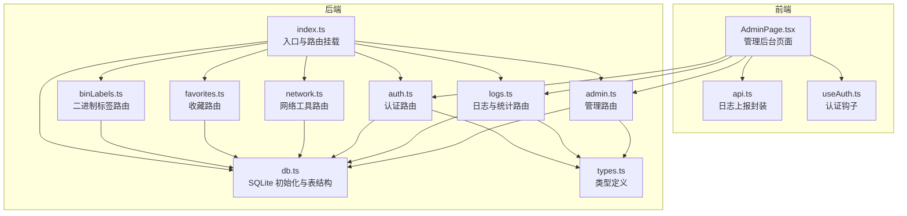
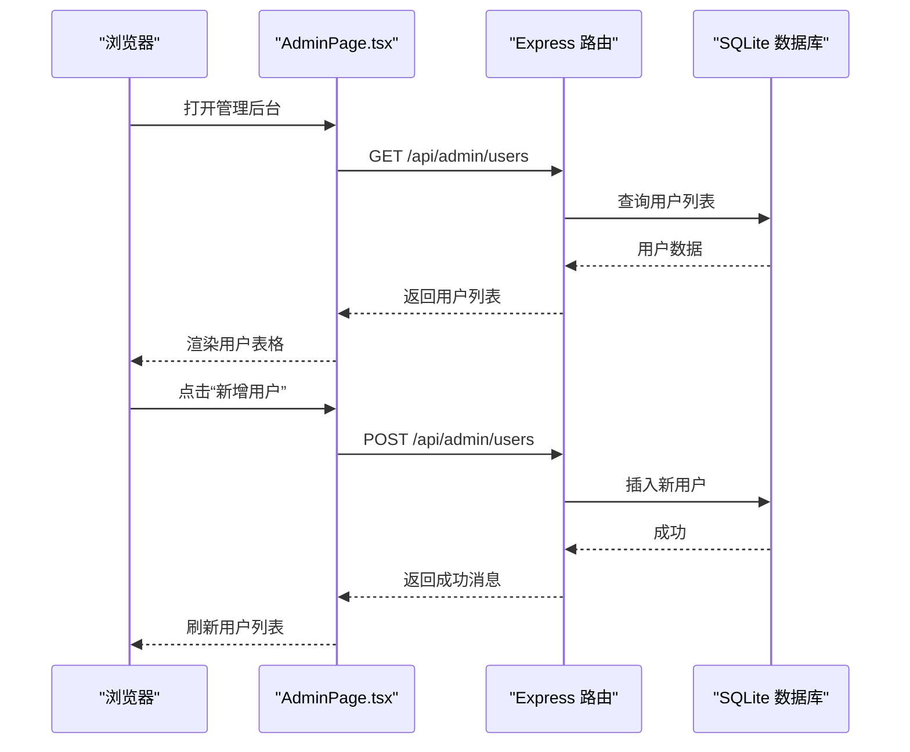
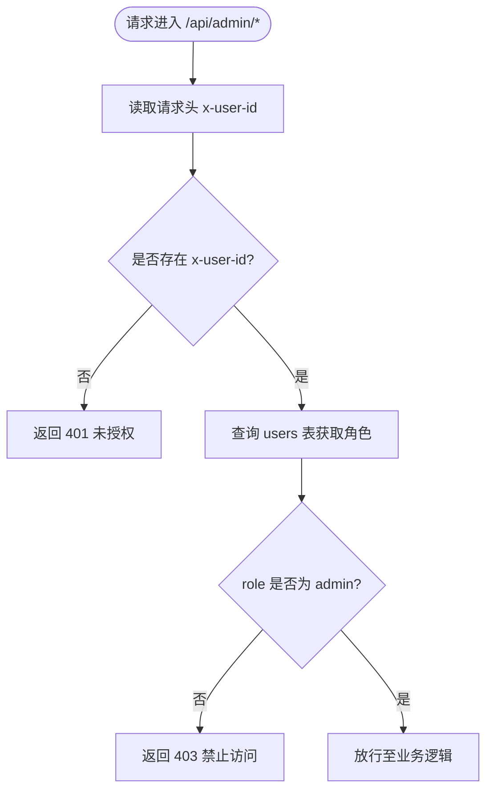
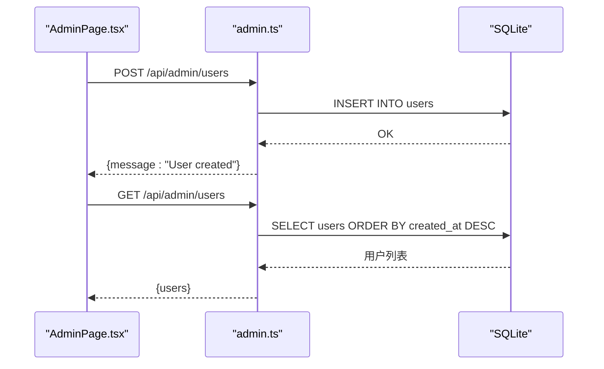
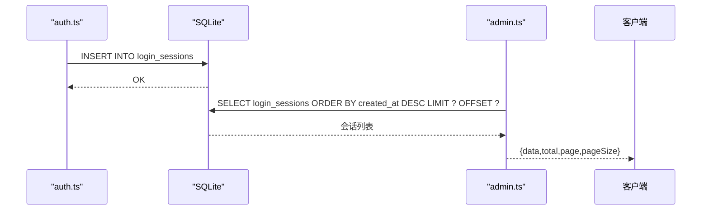
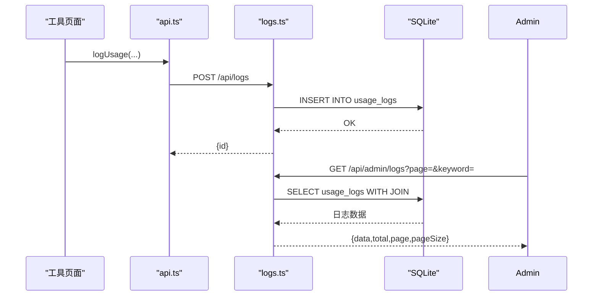
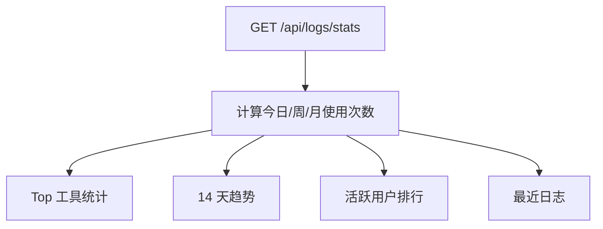
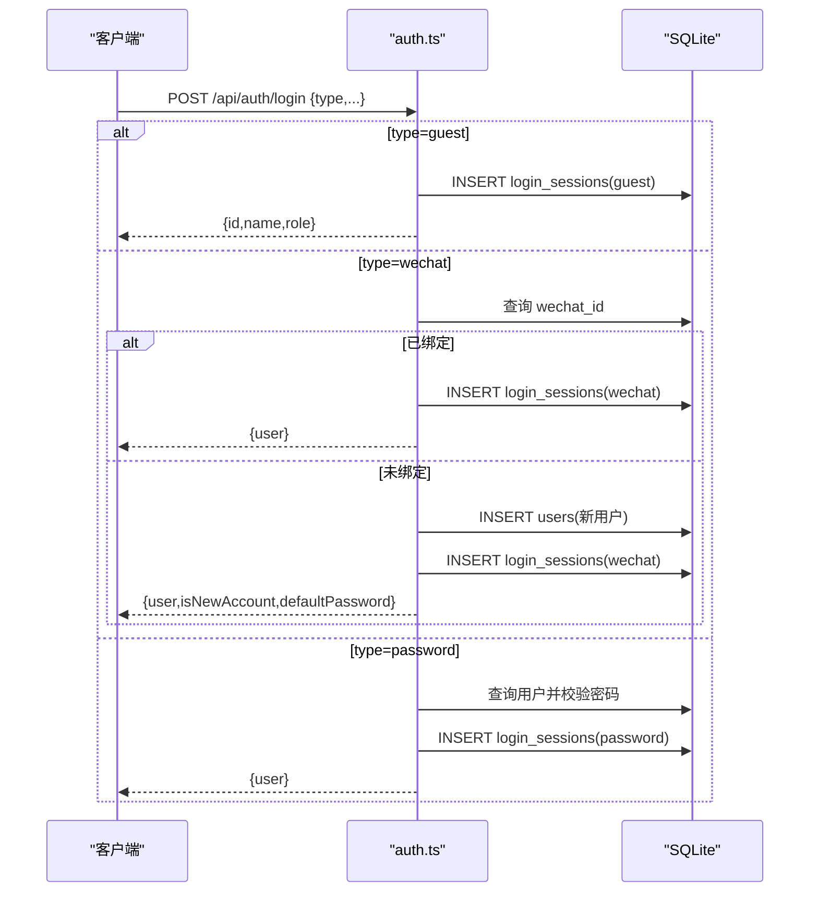
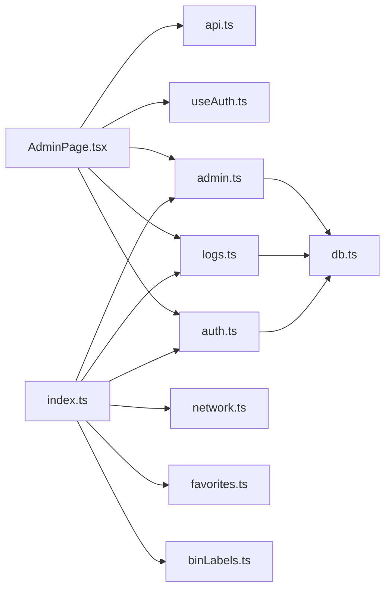
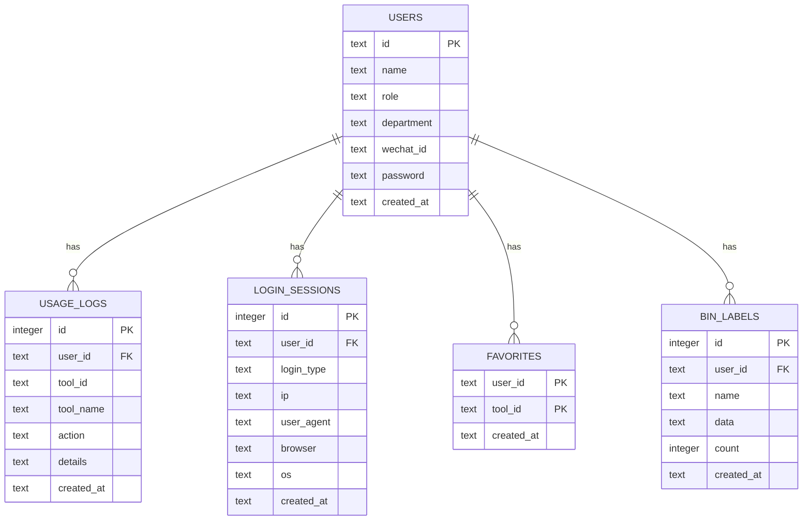

# 管理后台

<cite>
**本文引用的文件**
- [server/src/routes/admin.ts](file://server/src/routes/admin.ts)
- [src/pages/AdminPage.tsx](file://src/pages/AdminPage.tsx)
- [server/src/db.ts](file://server/src/db.ts)
- [server/src/types.ts](file://server/src/types.ts)
- [server/src/index.ts](file://server/src/index.ts)
- [server/src/routes/auth.ts](file://server/src/routes/auth.ts)
- [server/src/routes/logs.ts](file://server/src/routes/logs.ts)
- [src/lib/api.ts](file://src/lib/api.ts)
- [src/hooks/useAuth.ts](file://src/hooks/useAuth.ts)
- [src/types/index.ts](file://src/types/index.ts)
- [server/src/routes/network.ts](file://server/src/routes/network.ts)
- [server/src/routes/favorites.ts](file://server/src/routes/favorites.ts)
- [server/src/routes/binLabels.ts](file://server/src/routes/binLabels.ts)
</cite>

## 目录
1. [简介](#简介)
2. [项目结构](#项目结构)
3. [核心组件](#核心组件)
4. [架构总览](#架构总览)
5. [详细组件分析](#详细组件分析)
6. [依赖关系分析](#依赖关系分析)
7. [性能考量](#性能考量)
8. [故障排查指南](#故障排查指南)
9. [结论](#结论)
10. [附录](#附录)

## 简介
本文件面向管理后台功能，系统性说明管理员权限体系与后台管理界面的设计与实现，涵盖：
- 用户管理：用户列表查看、新增、删除等
- 登录记录管理：登录历史查看、异常登录检测（基于登录会话表）
- 操作审计：使用日志记录与查询、聚合统计
- 系统监控：用户活跃度统计、工具使用频率分析
- 安全与权限控制：基于角色的访问控制、请求头校验、数据库约束

## 项目结构
前端采用 React + Vite，后端采用 Express + better-sqlite3；管理后台位于前端页面 AdminPage.tsx，后端路由由 admin.ts 提供，数据库初始化与表结构定义在 db.ts 中。

图表来源
- [server/src/index.ts:1-31](file://server/src/index.ts#L1-L31)
- [server/src/routes/admin.ts:1-93](file://server/src/routes/admin.ts#L1-L93)
- [server/src/routes/auth.ts:1-109](file://server/src/routes/auth.ts#L1-L109)
- [server/src/routes/logs.ts:1-134](file://server/src/routes/logs.ts#L1-L134)
- [server/src/routes/network.ts:1-109](file://server/src/routes/network.ts#L1-L109)
- [server/src/routes/favorites.ts:1-31](file://server/src/routes/favorites.ts#L1-L31)
- [server/src/routes/binLabels.ts:1-65](file://server/src/routes/binLabels.ts#L1-L65)
- [server/src/db.ts:1-126](file://server/src/db.ts#L1-L126)
- [server/src/types.ts:1-46](file://server/src/types.ts#L1-L46)
- [src/pages/AdminPage.tsx:1-353](file://src/pages/AdminPage.tsx#L1-L353)
- [src/lib/api.ts:1-36](file://src/lib/api.ts#L1-L36)
- [src/hooks/useAuth.ts:1-89](file://src/hooks/useAuth.ts#L1-L89)

章节来源
- [server/src/index.ts:1-31](file://server/src/index.ts#L1-L31)
- [server/src/db.ts:1-126](file://server/src/db.ts#L1-L126)

## 核心组件
- 管理后台页面 AdminPage.tsx：提供用户管理、登录记录、操作记录三大标签页，支持分页、搜索、新增用户、删除用户等交互。
- 管理路由 admin.ts：提供用户 CRUD、登录会话查询、使用日志查询等接口，并通过中间件校验管理员身份。
- 认证路由 auth.ts：处理多种登录方式（微信、密码、访客），并记录登录会话信息。
- 日志与统计 logs.ts：提供使用日志写入、查询、聚合统计（活跃用户、Top 工具、趋势）。
- 数据库 db.ts：初始化 SQLite 表结构（users、usage_logs、login_sessions、favorites、bin_labels），并内置种子数据。
- 类型定义 types.ts：统一前后端数据模型，确保接口契约一致。
- 前端认证钩子 useAuth.ts：封装登录、登出、用户状态持久化与权限判断。
- 前端日志上报 api.ts：封装日志上报接口调用。

章节来源
- [src/pages/AdminPage.tsx:55-106](file://src/pages/AdminPage.tsx#L55-L106)
- [server/src/routes/admin.ts:7-14](file://server/src/routes/admin.ts#L7-L14)
- [server/src/routes/admin.ts:18-49](file://server/src/routes/admin.ts#L18-L49)
- [server/src/routes/admin.ts:53-65](file://server/src/routes/admin.ts#L53-L65)
- [server/src/routes/admin.ts:69-90](file://server/src/routes/admin.ts#L69-L90)
- [server/src/routes/auth.ts:36-106](file://server/src/routes/auth.ts#L36-L106)
- [server/src/routes/logs.ts:7-69](file://server/src/routes/logs.ts#L7-L69)
- [server/src/routes/logs.ts:71-131](file://server/src/routes/logs.ts#L71-L131)
- [server/src/db.ts:12-75](file://server/src/db.ts#L12-L75)
- [server/src/types.ts:1-46](file://server/src/types.ts#L1-L46)
- [src/hooks/useAuth.ts:20-89](file://src/hooks/useAuth.ts#L20-L89)
- [src/lib/api.ts:3-19](file://src/lib/api.ts#L3-L19)

## 架构总览
管理后台采用前后端分离架构：
- 前端负责 UI 展示与用户交互，通过 fetch 调用后端 /api/* 接口。
- 后端通过 Express 提供 RESTful 接口，admin 路由作为管理入口，requireAdmin 中间件强制要求管理员身份。
- 数据存储使用 better-sqlite3，表结构覆盖用户、登录会话、使用日志、收藏、二进制标签等。
- 权限控制基于用户角色（role），管理员可访问管理路由，普通用户仅能访问通用接口。

图表来源
- [src/pages/AdminPage.tsx:75-120](file://src/pages/AdminPage.tsx#L75-L120)
- [server/src/routes/admin.ts:18-34](file://server/src/routes/admin.ts#L18-L34)
- [server/src/db.ts:12-22](file://server/src/db.ts#L12-L22)

## 详细组件分析

### 管理员权限系统与安全控制
- 角色字段：users 表包含 role 字段，取值为 "user" 或 "admin"。
- 管理员中间件：admin 路由中 requireAdmin 从请求头 x-user-id 获取当前用户 ID，查询数据库确认角色是否为 "admin"，否则返回 403。
- 请求头校验：前端在调用管理接口时统一携带 x-user-id，确保后端可识别调用者身份。
- 数据库约束：外键约束保证日志与会话关联到有效用户；索引优化查询性能。

图表来源
- [server/src/routes/admin.ts:7-14](file://server/src/routes/admin.ts#L7-L14)

章节来源
- [server/src/routes/admin.ts:7-14](file://server/src/routes/admin.ts#L7-L14)
- [server/src/db.ts:12-22](file://server/src/db.ts#L12-L22)

### 用户管理功能
- 用户列表查看：GET /api/admin/users 返回所有用户的基本信息，按创建时间倒序。
- 新增用户：POST /api/admin/users 支持指定 id、name、role、department、wechat_id、password，若未提供 password 则回退为 id。
- 更新用户：PUT /api/admin/users/:id 支持修改 name、role、department。
- 删除用户：DELETE /api/admin/users/:id 删除指定用户。
- 前端交互：AdminPage.tsx 提供新增表单与删除确认，调用对应接口并刷新列表。

图表来源
- [src/pages/AdminPage.tsx:108-120](file://src/pages/AdminPage.tsx#L108-L120)
- [server/src/routes/admin.ts:24-34](file://server/src/routes/admin.ts#L24-L34)
- [server/src/routes/admin.ts:18-22](file://server/src/routes/admin.ts#L18-L22)

章节来源
- [server/src/routes/admin.ts:18-49](file://server/src/routes/admin.ts#L18-L49)
- [src/pages/AdminPage.tsx:177-243](file://src/pages/AdminPage.tsx#L177-L243)

### 登录记录管理
- 登录会话表：login_sessions 记录每次登录的用户、登录类型（wechat/password/guest）、IP、User-Agent、浏览器、操作系统、时间等。
- 查询接口：GET /api/admin/sessions 支持分页查询，返回会话列表及总数。
- 异常登录检测思路：可通过筛选特定时间段内来自不同 IP、浏览器/系统组合的登录，结合用户角色进行风险评估（具体策略可在前端或后端扩展）。

图表来源
- [server/src/routes/auth.ts:24-29](file://server/src/routes/auth.ts#L24-L29)
- [server/src/routes/admin.ts:53-65](file://server/src/routes/admin.ts#L53-L65)
- [server/src/db.ts:62-75](file://server/src/db.ts#L62-L75)

章节来源
- [server/src/routes/admin.ts:53-65](file://server/src/routes/admin.ts#L53-L65)
- [server/src/routes/auth.ts:24-29](file://server/src/routes/auth.ts#L24-L29)
- [server/src/db.ts:62-75](file://server/src/db.ts#L62-L75)

### 操作审计与日志查询
- 使用日志表：usage_logs 记录用户使用工具的行为，包含 user_id、tool_id、tool_name、action、details、created_at。
- 写入接口：POST /api/logs 将使用行为写入日志。
- 查询接口：GET /api/logs 支持按用户、工具、关键词、时间范围过滤，分页返回。
- 聚合统计：GET /api/logs/stats 提供今日/周/月使用次数、Top 工具、14 天趋势、最近日志、活跃用户等。

图表来源
- [src/lib/api.ts:3-19](file://src/lib/api.ts#L3-L19)
- [server/src/routes/logs.ts:7-69](file://server/src/routes/logs.ts#L7-L69)
- [server/src/routes/admin.ts:69-90](file://server/src/routes/admin.ts#L69-L90)
- [server/src/db.ts:26-39](file://server/src/db.ts#L26-L39)

章节来源
- [server/src/routes/logs.ts:7-69](file://server/src/routes/logs.ts#L7-L69)
- [server/src/routes/logs.ts:71-131](file://server/src/routes/logs.ts#L71-L131)
- [src/lib/api.ts:3-19](file://src/lib/api.ts#L3-L19)

### 系统监控与统计
- 用户活跃度：/api/logs/stats 返回活跃用户排行（按使用次数降序）。
- 工具使用频率：Top 工具统计，便于识别热门工具。
- 时间趋势：14 天每日使用量趋势，辅助观察使用模式变化。
- 最近日志：用于快速定位近期异常或高频操作。

图表来源
- [server/src/routes/logs.ts:71-131](file://server/src/routes/logs.ts#L71-L131)

章节来源
- [server/src/routes/logs.ts:71-131](file://server/src/routes/logs.ts#L71-L131)

### 认证流程与登录会话记录
- 支持三种登录方式：访客、微信、密码。
- 访客登录：生成临时 guest-* ID，记录 guest 登录会话。
- 微信登录：若 wechat_id 已绑定用户则直接登录，否则自动创建普通用户并记录会话。
- 密码登录：根据 name/id 查找用户，校验 password 或回退为 id。
- 登录会话记录：记录 IP、浏览器、操作系统等信息，便于后续异常检测。

图表来源
- [server/src/routes/auth.ts:36-106](file://server/src/routes/auth.ts#L36-L106)
- [server/src/db.ts:12-22](file://server/src/db.ts#L12-L22)

章节来源
- [server/src/routes/auth.ts:36-106](file://server/src/routes/auth.ts#L36-L106)

## 依赖关系分析
- 组件耦合：AdminPage.tsx 依赖 api.ts 进行日志上报，依赖 useAuth.ts 进行认证状态管理；管理路由 admin.ts 依赖 db.ts 进行数据存取；日志路由 logs.ts 依赖 db.ts；认证路由 auth.ts 依赖 db.ts。
- 外部依赖：Express、better-sqlite3、CORS、Lucide 图标库、React 生态。
- 可能的循环依赖：当前文件组织避免了循环导入；如需扩展，建议保持单一方向的数据流。

图表来源
- [src/pages/AdminPage.tsx:1-353](file://src/pages/AdminPage.tsx#L1-L353)
- [src/lib/api.ts:1-36](file://src/lib/api.ts#L1-L36)
- [src/hooks/useAuth.ts:1-89](file://src/hooks/useAuth.ts#L1-L89)
- [server/src/routes/admin.ts:1-93](file://server/src/routes/admin.ts#L1-L93)
- [server/src/routes/logs.ts:1-134](file://server/src/routes/logs.ts#L1-L134)
- [server/src/routes/auth.ts:1-109](file://server/src/routes/auth.ts#L1-L109)
- [server/src/index.ts:1-31](file://server/src/index.ts#L1-L31)
- [server/src/db.ts:1-126](file://server/src/db.ts#L1-L126)

章节来源
- [server/src/index.ts:1-31](file://server/src/index.ts#L1-L31)

## 性能考量
- 分页与限制：管理接口默认每页 20 条，最大 100 条，避免一次性返回大量数据。
- 索引优化：users、usage_logs、login_sessions 等表建立必要索引，提升查询效率。
- SQL 查询：使用参数化查询防止注入，避免全表扫描。
- 建议：对高并发场景可引入连接池、缓存热点数据、对日志表定期归档清理。

## 故障排查指南
- 401 未授权：检查请求头是否包含正确的 x-user-id。
- 403 禁止访问：确认当前用户角色为 "admin"。
- 数据库异常：检查 db.ts 初始化是否成功，表结构是否完整。
- 日志写入失败：确认 /api/logs POST 请求可达，前端 api.ts 的错误处理是否捕获异常。
- 登录失败：核对用户名/密码或微信 ID 是否正确，检查 auth.ts 的登录分支逻辑。

章节来源
- [server/src/routes/admin.ts:7-14](file://server/src/routes/admin.ts#L7-L14)
- [server/src/db.ts:12-75](file://server/src/db.ts#L12-L75)
- [src/lib/api.ts:10-19](file://src/lib/api.ts#L10-L19)
- [server/src/routes/auth.ts:36-106](file://server/src/routes/auth.ts#L36-L106)

## 结论
管理后台以角色为基础的权限控制为核心，结合登录会话与使用日志实现了完整的审计能力，并通过聚合统计提供了系统监控视角。前端 AdminPage.tsx 提供直观的管理界面，后端 admin.ts、auth.ts、logs.ts 路由清晰分工，db.ts 保障数据一致性与性能。建议在生产环境中进一步完善异常登录检测、日志归档与缓存策略，持续优化用户体验与系统稳定性。

## 附录
- 数据模型（简化）
  - users：id、name、role、department、wechat_id、password、created_at
  - usage_logs：id、user_id、tool_id、tool_name、action、details、created_at
  - login_sessions：id、user_id、login_type、ip、user_agent、browser、os、created_at
  - favorites：user_id、tool_id、created_at
  - bin_labels：id、user_id、name、data、count、created_at

图表来源
- [server/src/db.ts:12-75](file://server/src/db.ts#L12-L75)