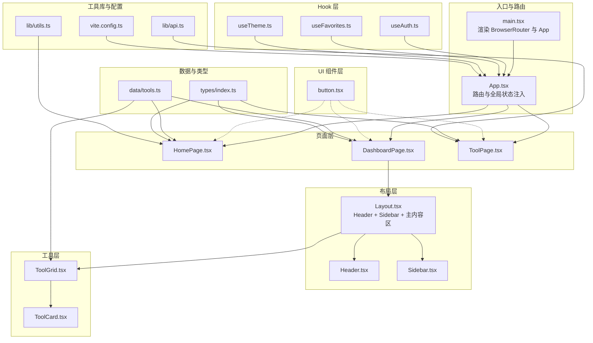
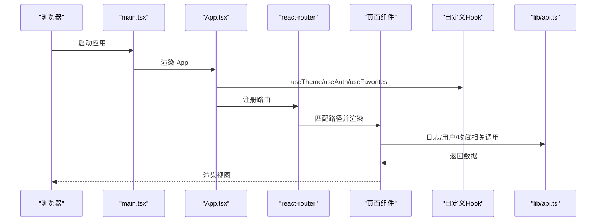
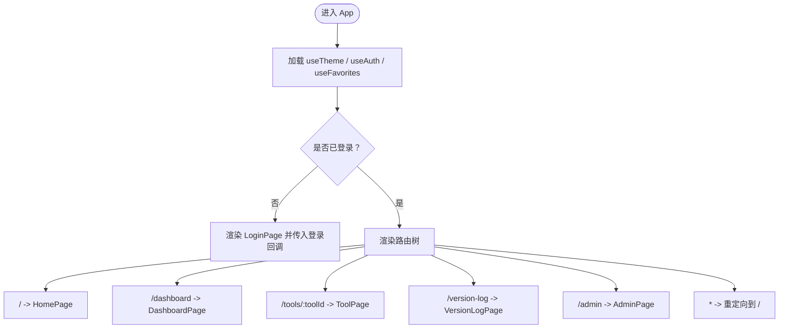
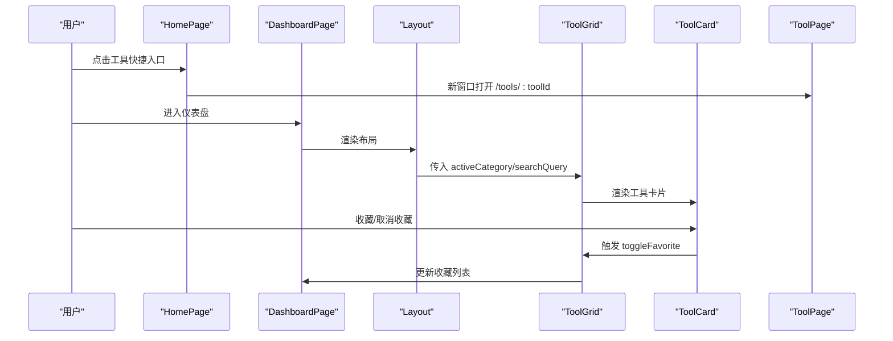
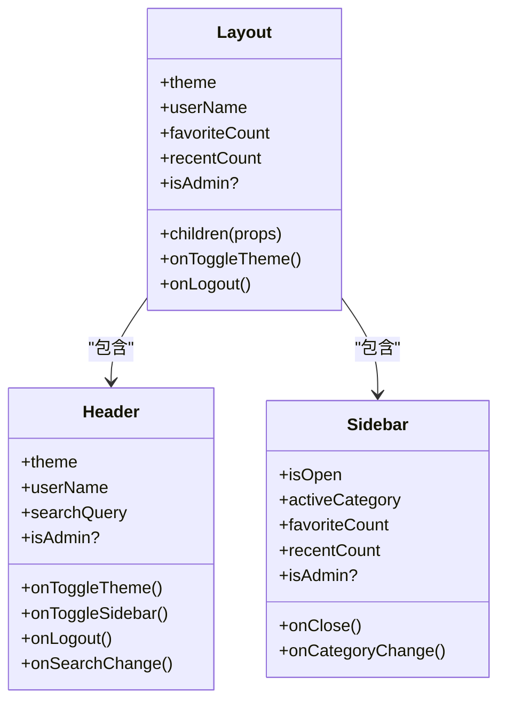
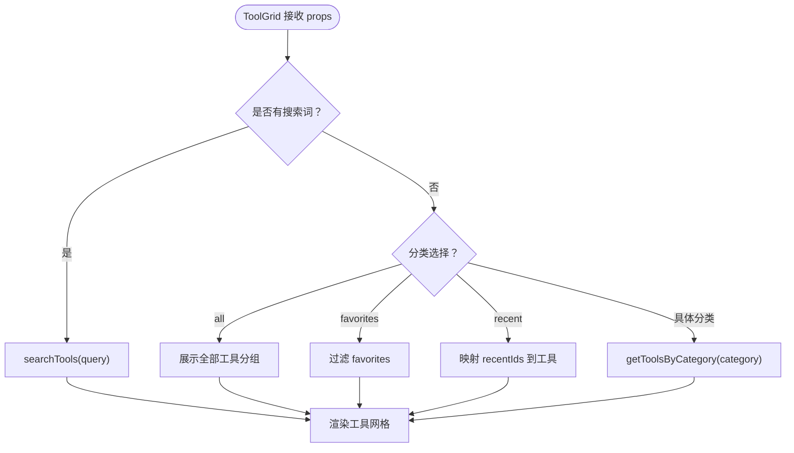
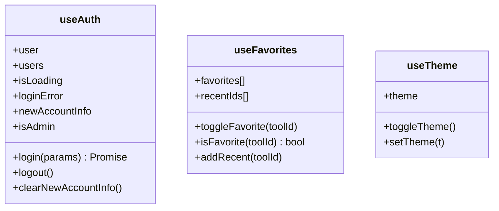
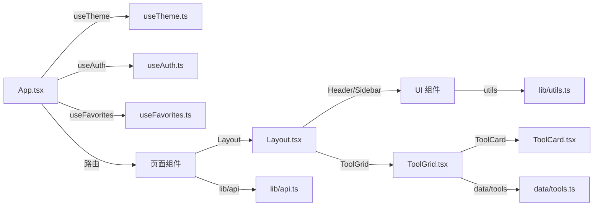

# 前端架构

<cite>
**本文引用的文件**
- [src/App.tsx](file://src/App.tsx)
- [src/main.tsx](file://src/main.tsx)
- [src/hooks/useAuth.ts](file://src/hooks/useAuth.ts)
- [src/hooks/useFavorites.ts](file://src/hooks/useFavorites.ts)
- [src/hooks/useTheme.ts](file://src/hooks/useTheme.ts)
- [src/pages/HomePage.tsx](file://src/pages/HomePage.tsx)
- [src/pages/DashboardPage.tsx](file://src/pages/DashboardPage.tsx)
- [src/pages/ToolPage.tsx](file://src/pages/ToolPage.tsx)
- [src/components/layout/Layout.tsx](file://src/components/layout/Layout.tsx)
- [src/components/layout/Header.tsx](file://src/components/layout/Header.tsx)
- [src/components/layout/Sidebar.tsx](file://src/components/layout/Sidebar.tsx)
- [src/components/tools/ToolGrid.tsx](file://src/components/tools/ToolGrid.tsx)
- [src/components/tools/ToolCard.tsx](file://src/components/tools/ToolCard.tsx)
- [src/components/ui/button.tsx](file://src/components/ui/button.tsx)
- [src/lib/api.ts](file://src/lib/api.ts)
- [src/lib/utils.ts](file://src/lib/utils.ts)
- [src/data/tools.ts](file://src/data/tools.ts)
- [src/types/index.ts](file://src/types/index.ts)
- [vite.config.ts](file://vite.config.ts)
- [package.json](file://package.json)
</cite>

## 目录
1. [引言](#引言)
2. [项目结构](#项目结构)
3. [核心组件](#核心组件)
4. [架构总览](#架构总览)
5. [组件详解](#组件详解)
6. [依赖关系分析](#依赖关系分析)
7. [性能考量](#性能考量)
8. [故障排查指南](#故障排查指南)
9. [结论](#结论)
10. [附录](#附录)

## 引言
本文件面向 AnyTools 前端架构，系统性阐述基于 React 的应用设计：组件层次、路由体系、状态管理、自定义 Hook 设计模式、主题与用户状态管理、收藏与最近使用策略，以及前端性能优化（代码分割、懒加载、缓存）。文档同时提供多类可视化图示，帮助不同背景读者快速理解系统。

## 项目结构
前端采用按功能域分层组织：页面层、布局层、工具层、UI 组件层、数据与类型层、自定义 Hook 层、工具库与配置层。入口通过 main.tsx 渲染 BrowserRouter 包裹的 App，App 负责路由与全局状态注入；页面组件负责业务视图，布局组件承载导航与筛选，工具组件负责具体工具的展示与交互，UI 组件提供通用样式变体，数据与类型层提供工具清单与类型定义，Hook 层封装跨组件共享的状态逻辑，工具库提供 API 封装，Vite 提供构建与代理。

图表来源
- [src/main.tsx:1-14](file://src/main.tsx#L1-L14)
- [src/App.tsx:1-63](file://src/App.tsx#L1-L63)
- [src/pages/HomePage.tsx:1-212](file://src/pages/HomePage.tsx#L1-L212)
- [src/pages/DashboardPage.tsx:1-50](file://src/pages/DashboardPage.tsx#L1-L50)
- [src/pages/ToolPage.tsx:1-113](file://src/pages/ToolPage.tsx#L1-L113)
- [src/components/layout/Layout.tsx:1-70](file://src/components/layout/Layout.tsx#L1-L70)
- [src/components/layout/Header.tsx](file://src/components/layout/Header.tsx)
- [src/components/layout/Sidebar.tsx](file://src/components/layout/Sidebar.tsx)
- [src/components/tools/ToolGrid.tsx:1-136](file://src/components/tools/ToolGrid.tsx#L1-L136)
- [src/components/tools/ToolCard.tsx](file://src/components/tools/ToolCard.tsx)
- [src/components/ui/button.tsx:1-50](file://src/components/ui/button.tsx#L1-L50)
- [src/data/tools.ts:1-316](file://src/data/tools.ts#L1-L316)
- [src/types/index.ts:1-37](file://src/types/index.ts#L1-L37)
- [src/hooks/useAuth.ts:1-89](file://src/hooks/useAuth.ts#L1-L89)
- [src/hooks/useFavorites.ts:1-71](file://src/hooks/useFavorites.ts#L1-L71)
- [src/hooks/useTheme.ts:1-32](file://src/hooks/useTheme.ts#L1-L32)
- [src/lib/api.ts:1-36](file://src/lib/api.ts#L1-L36)
- [src/lib/utils.ts:1-7](file://src/lib/utils.ts#L1-L7)
- [vite.config.ts:1-21](file://vite.config.ts#L1-L21)

章节来源
- [src/main.tsx:1-14](file://src/main.tsx#L1-L14)
- [vite.config.ts:1-21](file://vite.config.ts#L1-L21)

## 核心组件
- App.tsx：应用根组件，集中注入主题、用户认证与收藏状态，根据用户状态决定渲染登录页或路由树，并向各页面传递回调与状态。
- 页面组件：HomePage、DashboardPage、ToolPage 分别承担门户首页、仪表盘、工具详情页的职责。
- 布局组件：Layout 作为容器，统一承载 Header、Sidebar 与主内容区，向下透传分类筛选与搜索条件。
- 工具组件：ToolGrid 负责根据分类/收藏/最近/搜索动态渲染工具网格；ToolCard 承载单个工具项的展示与交互。
- UI 组件：button.tsx 提供语义化与尺寸变体，统一风格。
- 自定义 Hook：useAuth、useFavorites、useTheme 将跨组件状态逻辑抽象为可复用能力。

章节来源
- [src/App.tsx:12-63](file://src/App.tsx#L12-L63)
- [src/pages/HomePage.tsx:18-139](file://src/pages/HomePage.tsx#L18-L139)
- [src/pages/DashboardPage.tsx:16-49](file://src/pages/DashboardPage.tsx#L16-L49)
- [src/pages/ToolPage.tsx:40-113](file://src/pages/ToolPage.tsx#L40-L113)
- [src/components/layout/Layout.tsx:20-69](file://src/components/layout/Layout.tsx#L20-L69)
- [src/components/tools/ToolGrid.tsx:15-109](file://src/components/tools/ToolGrid.tsx#L15-L109)
- [src/components/ui/button.tsx:1-50](file://src/components/ui/button.tsx#L1-L50)

## 架构总览
应用采用“路由驱动 + 全局状态注入”的架构：BrowserRouter 在根节点包裹，App 负责读取并同步主题、用户与收藏状态，再根据用户状态渲染路由树。页面层通过布局层统一导航与筛选，工具层根据状态动态渲染。API 通过 lib/api.ts 进行封装，Vite 通过代理将 /api 请求转发至后端服务。

图表来源
- [src/main.tsx:7-13](file://src/main.tsx#L7-L13)
- [src/App.tsx:12-63](file://src/App.tsx#L12-L63)
- [src/lib/api.ts:3-19](file://src/lib/api.ts#L3-L19)

## 组件详解

### App.tsx：根组件与路由编排
- 职责：协调主题、用户与收藏状态，根据用户状态决定渲染登录页或路由树；向页面传递回调与状态。
- 关键点：
  - 使用 useTheme 获取 theme 与 toggleTheme。
  - 使用 useAuth 获取 user、login、logout、isAdmin 等。
  - 使用 useFavorites 获取 favorites、recentIds 与 toggleFavorite/addRecent。
  - 登录态判断：若未登录或存在新账号提示，则渲染 LoginPage；否则渲染路由树。
  - 路由树：/、/dashboard、/tools/:toolId、/version-log、/admin，* 回退到首页。

图表来源
- [src/App.tsx:12-63](file://src/App.tsx#L12-L63)

章节来源
- [src/App.tsx:12-63](file://src/App.tsx#L12-L63)

### 页面组件：Home、Dashboard、Tool
- HomePage：门户首页，包含 Header、装饰元素与工具快捷入口，点击快捷入口在新窗口打开工具详情页。
- DashboardPage：仪表盘，通过 Layout 容器承载侧边栏与工具网格，向下透传分类筛选与搜索条件。
- ToolPage：工具详情页，根据路由参数动态导入对应工具组件，支持懒加载与加载占位，记录使用日志。

图表来源
- [src/pages/HomePage.tsx:18-139](file://src/pages/HomePage.tsx#L18-L139)
- [src/pages/DashboardPage.tsx:16-49](file://src/pages/DashboardPage.tsx#L16-L49)
- [src/components/layout/Layout.tsx:20-69](file://src/components/layout/Layout.tsx#L20-L69)
- [src/components/tools/ToolGrid.tsx:15-109](file://src/components/tools/ToolGrid.tsx#L15-L109)
- [src/pages/ToolPage.tsx:40-113](file://src/pages/ToolPage.tsx#L40-L113)

章节来源
- [src/pages/HomePage.tsx:18-139](file://src/pages/HomePage.tsx#L18-L139)
- [src/pages/DashboardPage.tsx:16-49](file://src/pages/DashboardPage.tsx#L16-L49)
- [src/pages/ToolPage.tsx:40-113](file://src/pages/ToolPage.tsx#L40-L113)

### 布局与导航：Layout、Header、Sidebar
- Layout：统一承载 Header、Sidebar 与主内容区，内部维护 sidebarOpen、activeCategory、searchQuery，并通过 children 渲染插槽。
- Header：接收主题切换、搜索框与登出回调。
- Sidebar：接收分类切换与计数，控制侧边栏开关。

图表来源
- [src/components/layout/Layout.tsx:20-69](file://src/components/layout/Layout.tsx#L20-L69)
- [src/components/layout/Header.tsx](file://src/components/layout/Header.tsx)
- [src/components/layout/Sidebar.tsx](file://src/components/layout/Sidebar.tsx)

章节来源
- [src/components/layout/Layout.tsx:20-69](file://src/components/layout/Layout.tsx#L20-L69)

### 工具网格与卡片：ToolGrid、ToolCard
- ToolGrid：根据 activeCategory、searchQuery、favorites、recentIds 动态筛选与分组展示工具；支持“全部工具”分组显示、“收藏”“最近使用”专用视图。
- ToolCard：单个工具卡片，展示图标、名称、标签与收藏按钮，支持打开工具详情页。

图表来源
- [src/components/tools/ToolGrid.tsx:15-109](file://src/components/tools/ToolGrid.tsx#L15-L109)
- [src/data/tools.ts:303-316](file://src/data/tools.ts#L303-L316)

章节来源
- [src/components/tools/ToolGrid.tsx:15-109](file://src/components/tools/ToolGrid.tsx#L15-L109)
- [src/data/tools.ts:303-316](file://src/data/tools.ts#L303-L316)

### UI 组件：Button 变体
- Button：基于 class-variance-authority 提供多种语义与尺寸变体，结合 cn 工具进行类名合并，保证一致的视觉与交互体验。

章节来源
- [src/components/ui/button.tsx:1-50](file://src/components/ui/button.tsx#L1-L50)
- [src/lib/utils.ts:4-6](file://src/lib/utils.ts#L4-L6)

### 自定义 Hook：useAuth、useFavorites、useTheme
- useAuth：封装用户登录、登出、用户列表拉取与本地持久化；暴露 isLoading、loginError、newAccountInfo 等状态与回调。
- useFavorites：根据 userId 拉取/更新收藏列表，维护最近使用列表（localStorage），提供 toggleFavorite/isFavorite/addRecent。
- useTheme：根据 localStorage 或系统偏好设置初始化主题，提供 toggleTheme/setTheme 与本地持久化。

图表来源
- [src/hooks/useAuth.ts:20-88](file://src/hooks/useAuth.ts#L20-L88)
- [src/hooks/useFavorites.ts:16-70](file://src/hooks/useFavorites.ts#L16-L70)
- [src/hooks/useTheme.ts:5-31](file://src/hooks/useTheme.ts#L5-L31)

章节来源
- [src/hooks/useAuth.ts:20-88](file://src/hooks/useAuth.ts#L20-L88)
- [src/hooks/useFavorites.ts:16-70](file://src/hooks/useFavorites.ts#L16-L70)
- [src/hooks/useTheme.ts:5-31](file://src/hooks/useTheme.ts#L5-L31)

### 类型与数据：types、data/tools
- types/index.ts：定义 Tool、Category、User 等核心类型，确保组件间契约清晰。
- data/tools.ts：提供 categories、tools 列表与检索/分组辅助方法，被页面与工具网格消费。

章节来源
- [src/types/index.ts:3-37](file://src/types/index.ts#L3-L37)
- [src/data/tools.ts:34-316](file://src/data/tools.ts#L34-L316)

### 工具库与工具页面：lib/api、pages/ToolPage
- lib/api.ts：封装日志上报、用户列表与登录接口，统一错误处理。
- pages/ToolPage：根据路由参数动态导入工具组件，支持 Suspense 占位与日志上报。

章节来源
- [src/lib/api.ts:3-19](file://src/lib/api.ts#L3-L19)
- [src/pages/ToolPage.tsx:40-113](file://src/pages/ToolPage.tsx#L40-L113)

## 依赖关系分析
- 组件耦合：页面组件依赖布局组件与工具组件；工具组件依赖数据与类型；UI 组件被广泛复用。
- 状态耦合：App 作为状态注入中心，向下传递给页面与布局；useAuth/useFavorites/useTheme 为跨组件共享状态提供单一事实来源。
- 外部依赖：react-router-dom 负责路由；lucide-react 提供图标；TailwindCSS 提供样式；Vite 提供构建与代理。

图表来源
- [src/App.tsx:12-63](file://src/App.tsx#L12-L63)
- [src/hooks/useTheme.ts:5-31](file://src/hooks/useTheme.ts#L5-L31)
- [src/hooks/useAuth.ts:20-88](file://src/hooks/useAuth.ts#L20-L88)
- [src/hooks/useFavorites.ts:16-70](file://src/hooks/useFavorites.ts#L16-L70)
- [src/components/layout/Layout.tsx:20-69](file://src/components/layout/Layout.tsx#L20-L69)
- [src/components/tools/ToolGrid.tsx:15-109](file://src/components/tools/ToolGrid.tsx#L15-L109)
- [src/data/tools.ts:34-316](file://src/data/tools.ts#L34-L316)
- [src/lib/api.ts:3-19](file://src/lib/api.ts#L3-L19)
- [src/lib/utils.ts:4-6](file://src/lib/utils.ts#L4-L6)

章节来源
- [src/App.tsx:12-63](file://src/App.tsx#L12-L63)
- [package.json:11-32](file://package.json#L11-L32)

## 性能考量
- 代码分割与懒加载
  - ToolPage 对每个工具组件使用动态导入与 Suspense 占位，减少首屏包体，提升首次渲染性能。
  - 适合进一步扩展：对页面级组件也可采用 React.lazy + Suspense 进一步拆分。
- 缓存策略
  - useAuth：登录态与用户列表持久化到 localStorage，避免重复登录与重复拉取。
  - useFavorites：最近使用列表持久化到 localStorage，限制最大长度，兼顾体验与存储开销。
  - useTheme：主题偏好持久化到 localStorage，并在 DOM 上设置类名，避免闪烁。
- 构建与代理
  - Vite 代理 /api 到后端服务，开发期避免 CORS 与跨域问题，提升联调效率。
- UI 与样式
  - 使用 TailwindCSS 与 cn 工具合并类名，减少冗余样式与运行时计算。

章节来源
- [src/pages/ToolPage.tsx:40-113](file://src/pages/ToolPage.tsx#L40-L113)
- [src/hooks/useAuth.ts:21-24](file://src/hooks/useAuth.ts#L21-L24)
- [src/hooks/useFavorites.ts:19-21](file://src/hooks/useFavorites.ts#L19-L21)
- [src/hooks/useTheme.ts:6-13](file://src/hooks/useTheme.ts#L6-L13)
- [vite.config.ts:13-19](file://vite.config.ts#L13-L19)
- [src/lib/utils.ts:4-6](file://src/lib/utils.ts#L4-L6)

## 故障排查指南
- 登录失败
  - 现象：登录接口返回错误或网络异常。
  - 排查：检查 useAuth 中 login 的错误分支与 finally 分支，确认 API 响应结构与网络代理配置。
- 收藏/最近使用异常
  - 现象：收藏状态不更新或最近使用列表为空。
  - 排查：确认 userId 是否存在；检查 useFavorites 的 API 调用与 localStorage 键值；核对工具 ID 一致性。
- 主题切换无效
  - 现象：切换主题后未生效。
  - 排查：确认 useTheme 的 DOM 类名切换逻辑与 localStorage 写入；检查 Tailwind 主题类名是否正确。
- 工具页面空白或加载缓慢
  - 现象：工具组件加载失败或长时间无响应。
  - 排查：确认 ToolPage 的动态导入映射是否存在；检查 Suspense 占位与网络状况；核对工具组件导出是否正确。
- 路由跳转异常
  - 现象：* 回退未生效或路径不匹配。
  - 排查：确认 App 路由树与通配符配置；检查 BrowserRouter 包裹层级。

章节来源
- [src/hooks/useAuth.ts:37-72](file://src/hooks/useAuth.ts#L37-L72)
- [src/hooks/useFavorites.ts:34-53](file://src/hooks/useFavorites.ts#L34-L53)
- [src/hooks/useTheme.ts:15-20](file://src/hooks/useTheme.ts#L15-L20)
- [src/pages/ToolPage.tsx:40-113](file://src/pages/ToolPage.tsx#L40-L113)
- [src/App.tsx:57-58](file://src/App.tsx#L57-L58)

## 结论
AnyTools 前端以 App 为核心，通过自定义 Hook 抽象状态逻辑，配合布局与工具网格实现清晰的职责划分；路由驱动页面渲染，结合懒加载与缓存策略显著提升性能与用户体验。整体架构具备良好的可扩展性与可维护性，便于后续新增页面、工具与功能模块。

## 附录
- 开发与构建
  - dev：vite 启动本地服务
  - build：TypeScript 编译与 Vite 构建
  - preview：预览构建产物
- 代理配置
  - /api 代理到 http://localhost:3001，便于前后端联调

章节来源
- [package.json:6-10](file://package.json#L6-L10)
- [vite.config.ts:13-19](file://vite.config.ts#L13-L19)