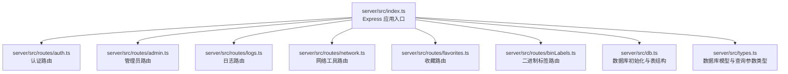
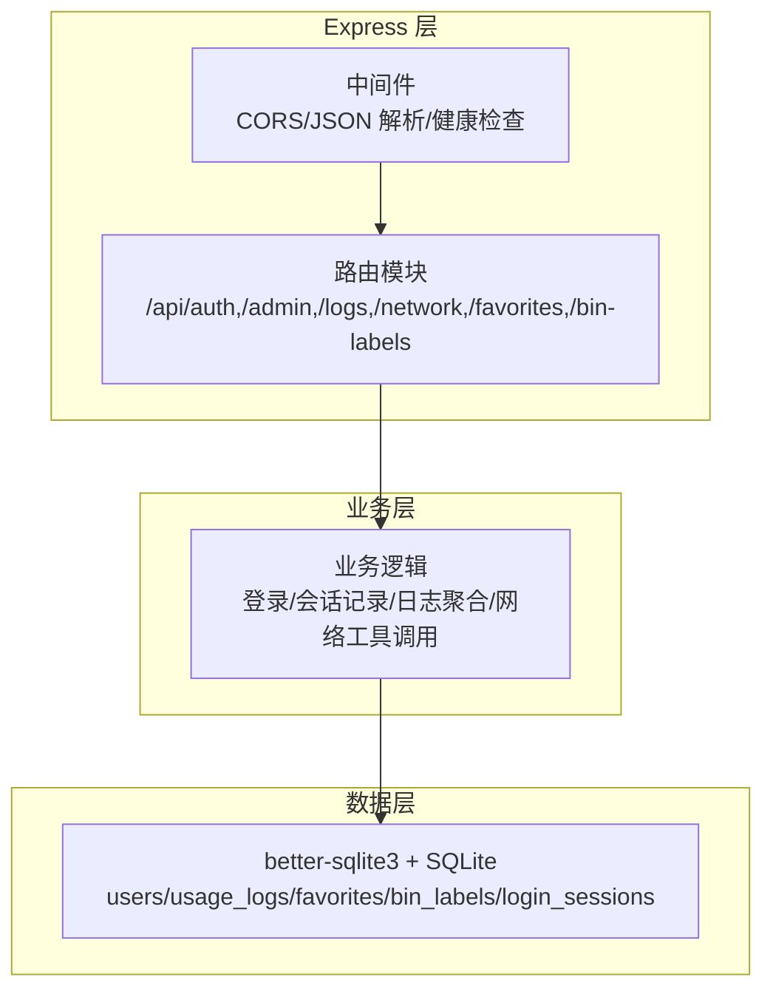
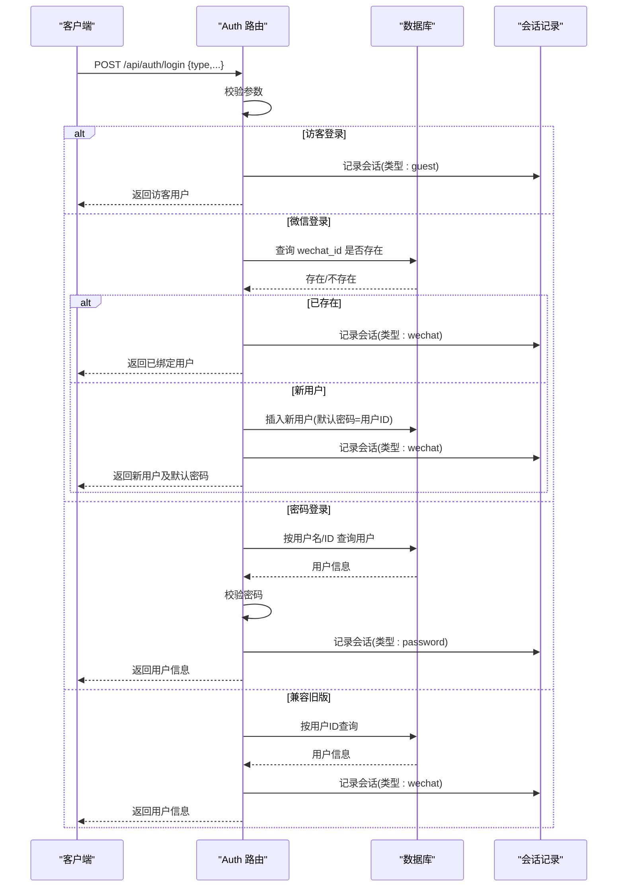
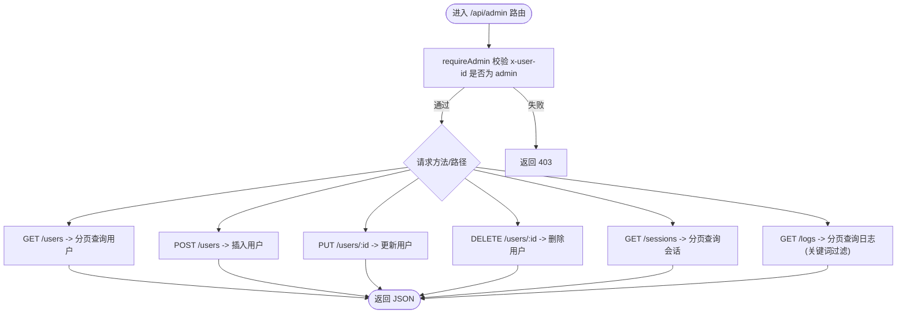
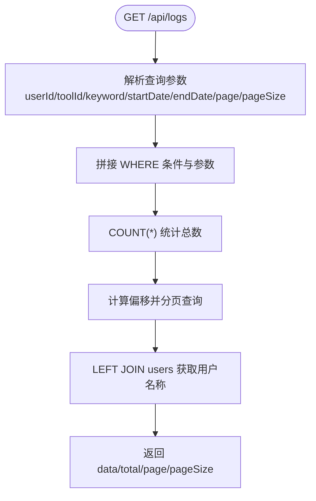
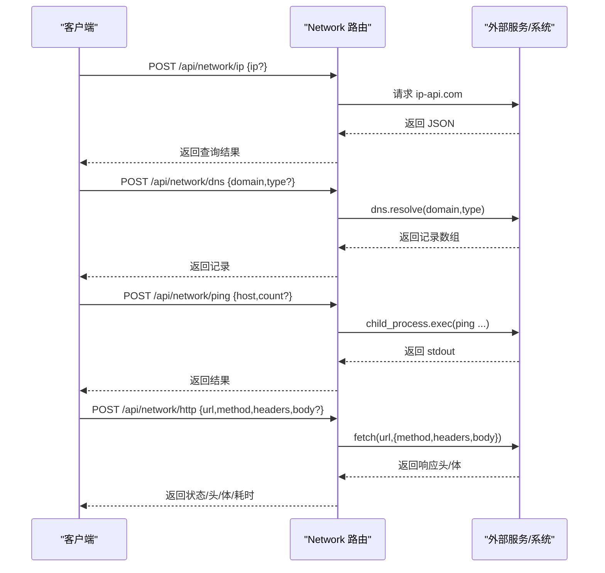
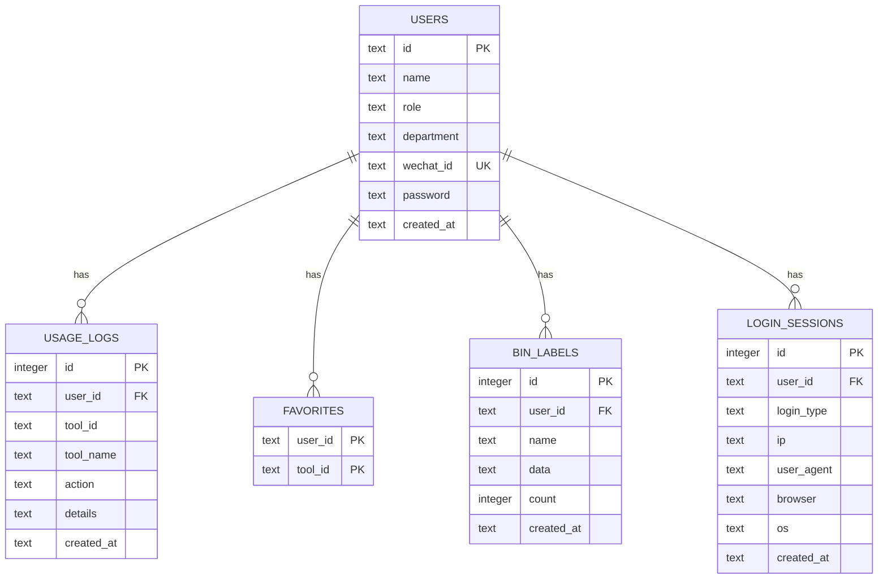
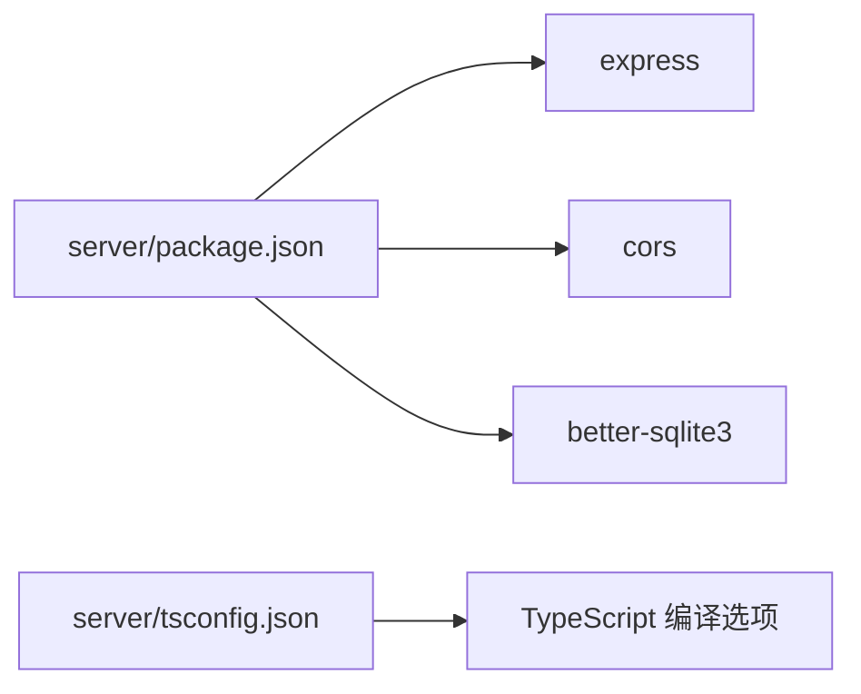

# 后端架构

<cite>
**本文引用的文件**
- [server/src/index.ts](file://server/src/index.ts)
- [server/src/db.ts](file://server/src/db.ts)
- [server/src/types.ts](file://server/src/types.ts)
- [server/src/routes/auth.ts](file://server/src/routes/auth.ts)
- [server/src/routes/admin.ts](file://server/src/routes/admin.ts)
- [server/src/routes/logs.ts](file://server/src/routes/logs.ts)
- [server/src/routes/network.ts](file://server/src/routes/network.ts)
- [server/src/routes/favorites.ts](file://server/src/routes/favorites.ts)
- [server/src/routes/binLabels.ts](file://server/src/routes/binLabels.ts)
- [server/package.json](file://server/package.json)
- [server/tsconfig.json](file://server/tsconfig.json)
- [部署手册.md](file://部署手册.md)
</cite>

## 目录
1. [简介](#简介)
2. [项目结构](#项目结构)
3. [核心组件](#核心组件)
4. [架构总览](#架构总览)
5. [详细组件分析](#详细组件分析)
6. [依赖关系分析](#依赖关系分析)
7. [性能考量](#性能考量)
8. [故障排查指南](#故障排查指南)
9. [结论](#结论)
10. [附录](#附录)

## 简介
本文件系统性梳理 AnyTools 后端架构，围绕基于 Express.js 的服务器设计、MVC 分层与模块化组织、RESTful API 设计、数据库连接与数据访问层、中间件体系（认证、权限、错误处理）、以及安全策略（CORS、输入校验、数据保护）展开。后端采用 better-sqlite3 作为本地 SQLite 数据库驱动，结合 TypeScript 提升类型安全与可维护性，并通过 Nginx 反向代理提供生产级部署能力。

## 项目结构
后端位于 server/ 目录，采用“入口文件 + 路由模块 + 数据库与类型定义”的分层组织：
- 入口与中间件：server/src/index.ts
- 路由模块：server/src/routes/*
- 数据库与表初始化：server/src/db.ts
- 类型定义：server/src/types.ts
- 构建与运行配置：server/package.json、server/tsconfig.json

图表来源
- [server/src/index.ts:1-31](file://server/src/index.ts#L1-L31)
- [server/src/db.ts:1-126](file://server/src/db.ts#L1-L126)
- [server/src/types.ts:1-46](file://server/src/types.ts#L1-L46)
- [server/src/routes/auth.ts:1-109](file://server/src/routes/auth.ts#L1-L109)
- [server/src/routes/admin.ts:1-93](file://server/src/routes/admin.ts#L1-L93)
- [server/src/routes/logs.ts:1-134](file://server/src/routes/logs.ts#L1-L134)
- [server/src/routes/network.ts:1-109](file://server/src/routes/network.ts#L1-L109)
- [server/src/routes/favorites.ts:1-31](file://server/src/routes/favorites.ts#L1-L31)
- [server/src/routes/binLabels.ts:1-65](file://server/src/routes/binLabels.ts#L1-L65)

章节来源
- [server/src/index.ts:1-31](file://server/src/index.ts#L1-L31)
- [server/src/db.ts:1-126](file://server/src/db.ts#L1-L126)
- [server/src/types.ts:1-46](file://server/src/types.ts#L1-L46)

## 核心组件
- Express 应用与中间件
  - CORS 配置：支持动态 CORS_ORIGIN 环境变量，默认允许任意来源。
  - JSON 解析：限制请求体大小为 5MB，避免过大负载。
  - 健康检查：提供 /api/health 接口返回服务状态与时钟。
- 路由层
  - 认证路由：支持访客登录、微信绑定登录、账号密码登录等多模式。
  - 管理员路由：用户管理、登录会话查询、全站使用日志查询。
  - 日志路由：使用日志记录、查询与统计分析。
  - 网络工具路由：IP 查询、DNS 解析、Ping 测试、HTTP 代理。
  - 收藏路由：用户收藏工具的增删查。
  - 二进制标签路由：用户标签生成记录的查询、新增、删除。
- 数据库层
  - better-sqlite3：WAL 模式、外键约束开启，保证一致性与并发性。
  - 表结构：users、usage_logs、favorites、bin_labels、login_sessions。
  - 种子数据：首次启动自动插入默认用户与示例日志。
- 类型系统
  - DbUser、DbUsageLog、DbLoginSession、LogQuery、StatsQuery 等接口定义，统一前后端交互契约。

章节来源
- [server/src/index.ts:10-26](file://server/src/index.ts#L10-L26)
- [server/src/routes/auth.ts:36-106](file://server/src/routes/auth.ts#L36-L106)
- [server/src/routes/admin.ts:18-90](file://server/src/routes/admin.ts#L18-L90)
- [server/src/routes/logs.ts:8-131](file://server/src/routes/logs.ts#L8-L131)
- [server/src/routes/network.ts:11-106](file://server/src/routes/network.ts#L11-L106)
- [server/src/routes/favorites.ts:7-28](file://server/src/routes/favorites.ts#L7-L28)
- [server/src/routes/binLabels.ts:16-62](file://server/src/routes/binLabels.ts#L16-L62)
- [server/src/db.ts:13-75](file://server/src/db.ts#L13-L75)
- [server/src/db.ts:78-123](file://server/src/db.ts#L78-L123)
- [server/src/types.ts:1-46](file://server/src/types.ts#L1-L46)

## 架构总览
后端采用典型的 MVC 分层与模块化组织：
- Model：better-sqlite3 + SQLite 文件数据库，表结构与种子数据在 db.ts 初始化。
- View：无传统视图层，统一以 JSON 响应。
- Controller：Express 路由模块，负责请求解析、业务逻辑与数据库交互。
- Middleware：CORS、JSON 解析、鉴权中间件（管理员路由内嵌）。

图表来源
- [server/src/index.ts:14-26](file://server/src/index.ts#L14-L26)
- [server/src/routes/auth.ts:1-109](file://server/src/routes/auth.ts#L1-L109)
- [server/src/routes/admin.ts:1-93](file://server/src/routes/admin.ts#L1-L93)
- [server/src/routes/logs.ts:1-134](file://server/src/routes/logs.ts#L1-L134)
- [server/src/routes/network.ts:1-109](file://server/src/routes/network.ts#L1-L109)
- [server/src/routes/favorites.ts:1-31](file://server/src/routes/favorites.ts#L1-L31)
- [server/src/routes/binLabels.ts:1-65](file://server/src/routes/binLabels.ts#L1-L65)
- [server/src/db.ts:1-126](file://server/src/db.ts#L1-L126)

## 详细组件分析

### Express 入口与中间件
- CORS：通过环境变量 CORS_ORIGIN 控制来源，默认允许任意来源，生产建议限定为具体域名。
- JSON 解析：限制 5MB，防止大体积请求导致内存压力。
- 健康检查：/api/health 返回服务状态与时钟，便于探活。
- 路由挂载：按模块划分，统一前缀 /api/{module}。

章节来源
- [server/src/index.ts:10-26](file://server/src/index.ts#L10-L26)
- [部署手册.md:231-249](file://部署手册.md#L231-L249)

### 认证路由（/api/auth）
- 功能职责
  - 用户列表查询：返回用户基本信息。
  - 登录：支持访客、微信绑定、账号密码三种模式；记录登录会话（IP、UA、浏览器、OS）。
- 请求处理流程
  - 参数校验：type 字段决定登录模式；不同模式对必填字段有差异。
  - 微信登录：若 wechatId 已绑定则直接登录；否则自动创建普通用户并返回默认密码。
  - 密码登录：按用户名或用户ID查找用户，校验密码（优先使用 password 字段，否则回退到用户ID）。
  - 访客登录：生成临时访客ID并记录会话。
  - 会话记录：统一调用记录函数，写入 login_sessions 表。
- 错误处理
  - 缺少必要参数返回 400。
  - 用户不存在返回 404。
  - 密码错误返回 401。
  - 其他异常返回 400 或 500 并携带错误信息。

图表来源
- [server/src/routes/auth.ts:36-106](file://server/src/routes/auth.ts#L36-L106)
- [server/src/db.ts:62-75](file://server/src/db.ts#L62-L75)

章节来源
- [server/src/routes/auth.ts:31-106](file://server/src/routes/auth.ts#L31-L106)

### 管理员路由（/api/admin）
- 权限控制
  - requireAdmin 中间件：从请求头 x-user-id 获取用户ID，查询数据库判断是否为 admin，非管理员返回 403。
- 用户管理
  - GET /users：分页返回用户列表。
  - POST /users：创建用户（id、name、role 必填，department、wechat_id、password 可选，默认 password 回退为用户ID）。
  - PUT /users/:id：更新用户信息。
  - DELETE /users/:id：删除用户。
- 登录会话与使用日志
  - GET /sessions：分页查询登录会话，关联用户名称。
  - GET /logs：分页查询使用日志，支持关键词过滤，关联用户名称与角色。

图表来源
- [server/src/routes/admin.ts:7-14](file://server/src/routes/admin.ts#L7-L14)
- [server/src/routes/admin.ts:18-90](file://server/src/routes/admin.ts#L18-L90)

章节来源
- [server/src/routes/admin.ts:7-14](file://server/src/routes/admin.ts#L7-L14)
- [server/src/routes/admin.ts:18-90](file://server/src/routes/admin.ts#L18-L90)

### 日志路由（/api/logs）
- 功能职责
  - POST /：创建一条使用日志。
  - GET /：分页查询使用日志，支持用户ID、工具ID、关键词、起止时间过滤。
  - GET /stats：聚合统计（当日/周/月使用次数、总次数、Top 工具、14 天趋势、最近日志、活跃用户）。
- 查询优化
  - 使用条件拼接与参数化查询，避免 SQL 注入。
  - 对常用查询建立索引（users、usage_logs、login_sessions、bin_labels）。

图表来源
- [server/src/routes/logs.ts:21-69](file://server/src/routes/logs.ts#L21-L69)

章节来源
- [server/src/routes/logs.ts:8-131](file://server/src/routes/logs.ts#L8-L131)

### 网络工具路由（/api/network）
- 功能职责
  - POST /ip：调用 ip-api.com 查询 IP 信息，返回国家、地区、ISP 等。
  - POST /dns：解析域名记录（默认 A 记录），支持指定记录类型。
  - POST /ping：跨平台执行 ping（Windows/Linux），限制最大次数与超时。
  - POST /http：轻量 HTTP 代理，支持 GET/POST/PUT/PATCH，自动截断过长响应体。
- 错误处理
  - 参数缺失返回 400。
  - 外部服务异常或系统命令失败返回 400，并包含标准错误信息。

图表来源
- [server/src/routes/network.ts:11-106](file://server/src/routes/network.ts#L11-L106)

章节来源
- [server/src/routes/network.ts:11-106](file://server/src/routes/network.ts#L11-L106)

### 收藏路由（/api/favorites）
- 功能职责
  - GET /:userId：返回用户收藏的工具ID列表。
  - POST /:userId：新增收藏（去重）。
  - DELETE /:userId/:toolId：删除收藏。
- 数据一致性
  - favorites 表主键为 (user_id, tool_id)，天然去重。

章节来源
- [server/src/routes/favorites.ts:7-28](file://server/src/routes/favorites.ts#L7-L28)

### 二进制标签路由（/api/bin-labels）
- 功能职责
  - GET /?userId=xxx：查询当前用户的标签生成记录。
  - GET /:id：查询单条记录详情。
  - POST /：保存新的生成记录。
  - DELETE /:id?userId=xxx：删除记录。
- 数据完整性
  - 删除时要求同时提供 userId，避免误删他人记录。

章节来源
- [server/src/routes/binLabels.ts:16-62](file://server/src/routes/binLabels.ts#L16-L62)

### 数据库连接与数据访问层
- better-sqlite3 使用
  - WAL 模式：提升并发读写性能。
  - 外键约束：开启 foreign_keys，保证引用完整性。
- 表结构与索引
  - users：主键 id，唯一 wechat_id，角色校验。
  - usage_logs：外键 user_id，多字段索引加速查询。
  - favorites：复合主键，避免重复收藏。
  - bin_labels：外键 user_id，索引加速查询。
  - login_sessions：记录登录来源与设备信息。
- 种子数据
  - 首次启动自动插入默认用户与示例日志，便于演示与测试。

图表来源
- [server/src/db.ts:13-75](file://server/src/db.ts#L13-L75)
- [server/src/types.ts:1-46](file://server/src/types.ts#L1-L46)

章节来源
- [server/src/db.ts:1-126](file://server/src/db.ts#L1-L126)

### 类型系统与契约
- DbUser、DbUsageLog、DbLoginSession：数据库实体映射。
- LogQuery、StatsQuery：查询参数与统计参数接口，约束分页与筛选范围。
- 统一返回结构：各路由返回 JSON，遵循一致的字段命名与数据类型约定。

章节来源
- [server/src/types.ts:1-46](file://server/src/types.ts#L1-L46)

## 依赖关系分析
- 运行时依赖
  - Express：Web 框架。
  - better-sqlite3：高性能 SQLite 驱动。
  - cors：跨域支持。
- 开发依赖
  - TypeScript、tsx、@types/*：类型与开发体验保障。
- 构建与运行
  - dev/start 脚本：开发热重载与生产启动。
  - tsconfig：ESNext 模块与严格类型检查。

图表来源
- [server/package.json:10-21](file://server/package.json#L10-L21)
- [server/tsconfig.json:2-11](file://server/tsconfig.json#L2-L11)

章节来源
- [server/package.json:1-23](file://server/package.json#L1-L23)
- [server/tsconfig.json:1-14](file://server/tsconfig.json#L1-L14)

## 性能考量
- 数据库层面
  - WAL 模式与外键开启，兼顾一致性与并发。
  - 为高频查询字段建立索引（users.wechat_id、logs.user_id/tool_id/time、sessions.user_id/time、bin_labels.user_id/time）。
- 网络工具
  - HTTP 代理对二进制与超长响应体进行截断，避免内存膨胀。
  - Ping 最大次数限制与超时控制，防止阻塞。
- 服务层面
  - JSON 请求体大小限制，降低内存占用。
  - 分页查询与参数化 SQL，减少数据库压力。

章节来源
- [server/src/db.ts:9-10](file://server/src/db.ts#L9-L10)
- [server/src/db.ts:24-25](file://server/src/db.ts#L24-L25)
- [server/src/db.ts:37-39](file://server/src/db.ts#L37-L39)
- [server/src/db.ts:59-60](file://server/src/db.ts#L59-L60)
- [server/src/db.ts:73-74](file://server/src/db.ts#L73-L74)
- [server/src/routes/network.ts:54-62](file://server/src/routes/network.ts#L54-L62)
- [server/src/routes/network.ts:89-94](file://server/src/routes/network.ts#L89-L94)
- [server/src/index.ts:15](file://server/src/index.ts#L15)

## 故障排查指南
- CORS 跨域
  - 症状：浏览器报跨域错误。
  - 排查：确认 CORS_ORIGIN 设置为具体域名；生产环境严禁使用通配符。
- 健康检查
  - 症状：探活失败。
  - 排查：访问 /api/health，确认返回 JSON；检查后端进程状态与端口占用。
- 数据库文件
  - 症状：数据库文件丢失或权限不足。
  - 排查：确认 data.db 存在与可读写；生产环境定期备份。
- 管理员权限
  - 症状：访问 /api/admin 返回 403。
  - 排查：确认请求头 x-user-id 对应用户角色为 admin。
- 网络工具
  - 症状：DNS/Ping/HTTP 失败。
  - 排查：检查外部服务可用性、系统命令权限与超时设置。

章节来源
- [部署手册.md:411-438](file://部署手册.md#L411-L438)
- [server/src/routes/admin.ts:8-14](file://server/src/routes/admin.ts#L8-L14)
- [server/src/routes/network.ts:48-62](file://server/src/routes/network.ts#L48-L62)

## 结论
AnyTools 后端以 Express 为核心，配合 better-sqlite3 实现轻量、高性能的本地数据库方案；通过模块化的路由设计与严格的类型系统，实现了清晰的职责分离与良好的可维护性。生产部署建议完善 CORS 配置、强化权限校验、加强日志与监控，并定期备份数据库，确保系统稳定与数据安全。

## 附录
- 环境变量
  - PORT：后端监听端口，默认 3001。
  - CORS_ORIGIN：允许的跨域来源，默认允许任意来源。
  - NODE_ENV：设为 production 以提升性能。
- 健康检查
  - /api/health：返回服务状态与时钟。
- 部署要点
  - Nginx 反向代理 /api/ 到后端 3001 端口。
  - PM2 管理后端进程，设置开机自启与日志目录。

章节来源
- [部署手册.md:231-249](file://部署手册.md#L231-L249)
- [server/src/index.ts:24-26](file://server/src/index.ts#L24-L26)
- [部署手册.md:117-167](file://部署手册.md#L117-L167)
- [部署手册.md:170-227](file://部署手册.md#L170-L227)