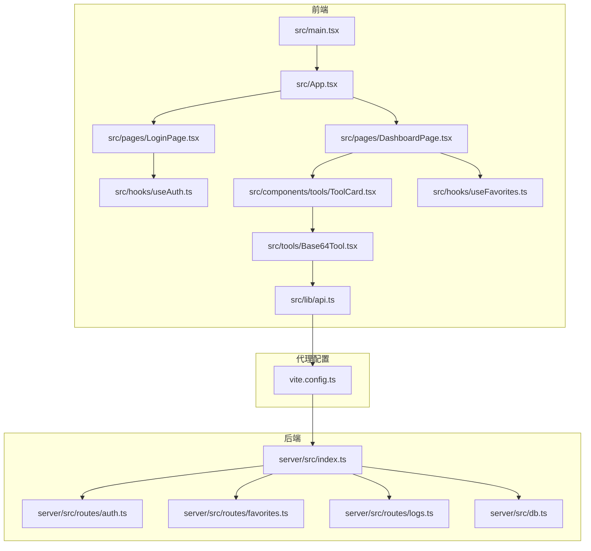
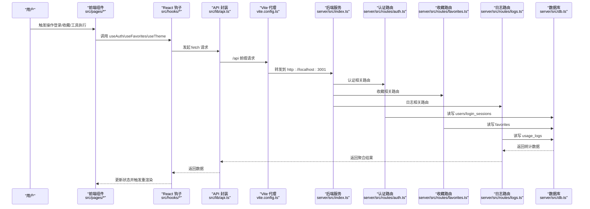
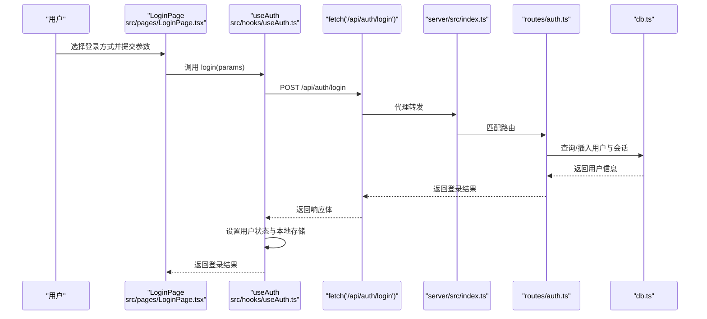
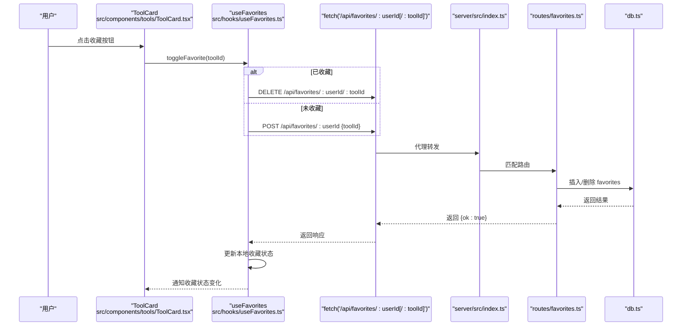
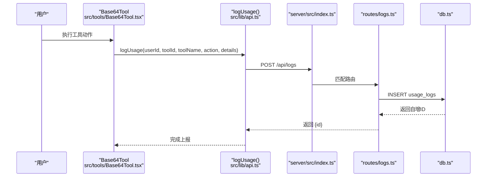
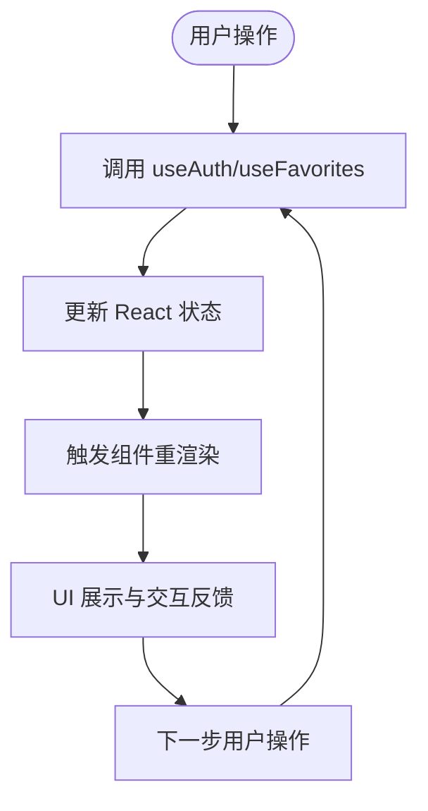
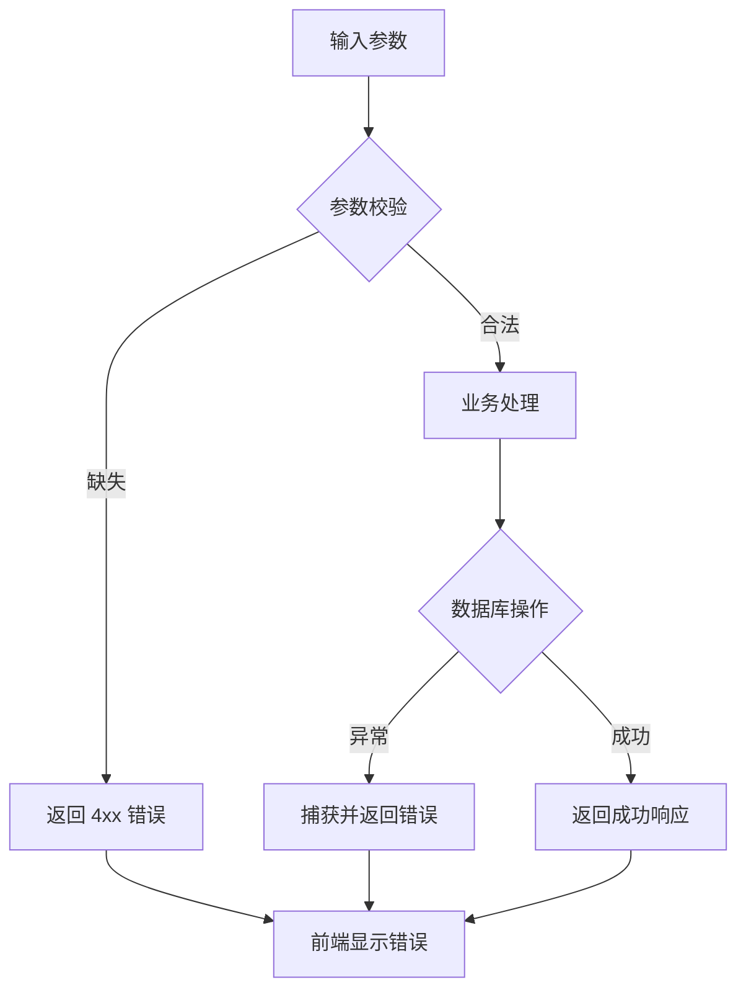
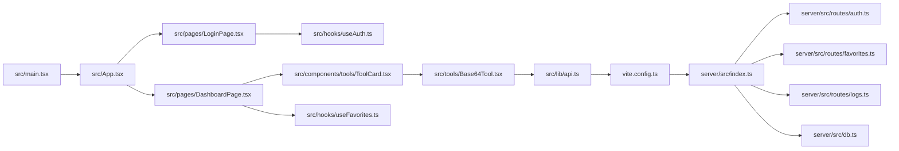

# 数据流设计

<cite>
**本文引用的文件**
- [src/lib/api.ts](file://src/lib/api.ts)
- [src/hooks/useAuth.ts](file://src/hooks/useAuth.ts)
- [src/hooks/useFavorites.ts](file://src/hooks/useFavorites.ts)
- [src/App.tsx](file://src/App.tsx)
- [src/pages/LoginPage.tsx](file://src/pages/LoginPage.tsx)
- [src/pages/DashboardPage.tsx](file://src/pages/DashboardPage.tsx)
- [src/components/tools/ToolCard.tsx](file://src/components/tools/ToolCard.tsx)
- [src/tools/Base64Tool.tsx](file://src/tools/Base64Tool.tsx)
- [src/main.tsx](file://src/main.tsx)
- [src/types/index.ts](file://src/types/index.ts)
- [server/src/index.ts](file://server/src/index.ts)
- [server/src/routes/auth.ts](file://server/src/routes/auth.ts)
- [server/src/routes/favorites.ts](file://server/src/routes/favorites.ts)
- [server/src/routes/logs.ts](file://server/src/routes/logs.ts)
- [server/src/db.ts](file://server/src/db.ts)
- [vite.config.ts](file://vite.config.ts)
</cite>

## 目录
1. [引言](#引言)
2. [项目结构](#项目结构)
3. [核心组件](#核心组件)
4. [架构总览](#架构总览)
5. [详细组件分析](#详细组件分析)
6. [依赖关系分析](#依赖关系分析)
7. [性能考量](#性能考量)
8. [故障排查指南](#故障排查指南)
9. [结论](#结论)
10. [附录](#附录)

## 引言
本文件围绕 AnyTools 的数据流设计进行系统性说明，覆盖从前端用户交互到后端数据处理，再到数据库存储的完整路径；解释 API 通信机制（含代理与请求/响应处理）、状态管理的数据流向（从用户操作到全局状态更新再到 UI 重新渲染）、认证状态的数据流转（登录验证、用户信息持久化与权限检查）、收藏功能的数据流（本地存储与服务器同步）、以及数据验证与错误处理机制。文中提供多幅基于真实源码映射的流程图与时序图，并在各节末尾标注“章节来源”，便于追溯。

## 项目结构
项目采用前后端分离架构：前端基于 React + Vite，通过代理将 /api 路由转发至后端服务；后端基于 Express + better-sqlite3，提供认证、日志统计、收藏等功能接口，并维护本地 SQLite 数据库。

**图表来源**
- [src/main.tsx:1-14](file://src/main.tsx#L1-L14)
- [src/App.tsx:1-63](file://src/App.tsx#L1-L63)
- [src/pages/LoginPage.tsx:1-250](file://src/pages/LoginPage.tsx#L1-L250)
- [src/pages/DashboardPage.tsx:1-50](file://src/pages/DashboardPage.tsx#L1-L50)
- [src/components/tools/ToolCard.tsx:1-66](file://src/components/tools/ToolCard.tsx#L1-L66)
- [src/tools/Base64Tool.tsx:1-64](file://src/tools/Base64Tool.tsx#L1-L64)
- [src/lib/api.ts:1-36](file://src/lib/api.ts#L1-L36)
- [src/hooks/useAuth.ts:1-89](file://src/hooks/useAuth.ts#L1-L89)
- [src/hooks/useFavorites.ts:1-71](file://src/hooks/useFavorites.ts#L1-L71)
- [vite.config.ts:1-21](file://vite.config.ts#L1-L21)
- [server/src/index.ts:1-31](file://server/src/index.ts#L1-L31)
- [server/src/routes/auth.ts:1-109](file://server/src/routes/auth.ts#L1-L109)
- [server/src/routes/favorites.ts:1-31](file://server/src/routes/favorites.ts#L1-L31)
- [server/src/routes/logs.ts:1-134](file://server/src/routes/logs.ts#L1-L134)
- [server/src/db.ts:1-126](file://server/src/db.ts#L1-L126)

**章节来源**
- [src/main.tsx:1-14](file://src/main.tsx#L1-L14)
- [vite.config.ts:1-21](file://vite.config.ts#L1-L21)
- [server/src/index.ts:1-31](file://server/src/index.ts#L1-L31)

## 核心组件
- 前端状态与数据层
  - 认证钩子：负责登录、登出、用户信息持久化与新账号提示。
  - 收藏钩子：负责用户收藏列表与最近使用列表的本地与远端同步。
  - API 封装：统一的日志上报与用户查询等接口封装。
- 后端路由与数据层
  - 认证路由：支持游客、企微与账号密码三种登录方式，记录会话信息。
  - 收藏路由：提供收藏增删查接口。
  - 日志路由：提供使用日志写入、查询与聚合统计。
  - 数据库：SQLite 表结构与初始化种子数据。

**章节来源**
- [src/hooks/useAuth.ts:1-89](file://src/hooks/useAuth.ts#L1-L89)
- [src/hooks/useFavorites.ts:1-71](file://src/hooks/useFavorites.ts#L1-L71)
- [src/lib/api.ts:1-36](file://src/lib/api.ts#L1-L36)
- [server/src/routes/auth.ts:1-109](file://server/src/routes/auth.ts#L1-L109)
- [server/src/routes/favorites.ts:1-31](file://server/src/routes/favorites.ts#L1-L31)
- [server/src/routes/logs.ts:1-134](file://server/src/routes/logs.ts#L1-L134)
- [server/src/db.ts:1-126](file://server/src/db.ts#L1-L126)

## 架构总览
前端通过 Vite 代理将 /api 请求转发到后端服务，后端路由根据资源路径分发到对应控制器，控制器读写 SQLite 数据库。前端状态通过 React Hooks 管理，UI 组件在用户交互时触发状态更新与副作用调用，最终驱动视图渲染。

**图表来源**
- [src/lib/api.ts:1-36](file://src/lib/api.ts#L1-L36)
- [src/hooks/useAuth.ts:1-89](file://src/hooks/useAuth.ts#L1-L89)
- [src/hooks/useFavorites.ts:1-71](file://src/hooks/useFavorites.ts#L1-L71)
- [vite.config.ts:13-18](file://vite.config.ts#L13-L18)
- [server/src/index.ts:17-22](file://server/src/index.ts#L17-L22)
- [server/src/routes/auth.ts:36-106](file://server/src/routes/auth.ts#L36-L106)
- [server/src/routes/favorites.ts:7-28](file://server/src/routes/favorites.ts#L7-L28)
- [server/src/routes/logs.ts:8-69](file://server/src/routes/logs.ts#L8-L69)
- [server/src/db.ts:13-75](file://server/src/db.ts#L13-L75)

## 详细组件分析

### 认证与登录数据流
- 用户在登录页选择登录方式（游客、账号密码、企微），提交参数给 useAuth.login。
- useAuth.login 调用后端 /api/auth/login，解析响应并持久化用户信息到本地存储。
- 登录成功后，应用路由切换到首页或仪表盘，同时提供管理员权限判断。

**图表来源**
- [src/pages/LoginPage.tsx:30-40](file://src/pages/LoginPage.tsx#L30-L40)
- [src/hooks/useAuth.ts:37-72](file://src/hooks/useAuth.ts#L37-L72)
- [server/src/routes/auth.ts:36-106](file://server/src/routes/auth.ts#L36-L106)
- [server/src/db.ts:13-75](file://server/src/db.ts#L13-L75)

**章节来源**
- [src/pages/LoginPage.tsx:1-250](file://src/pages/LoginPage.tsx#L1-L250)
- [src/hooks/useAuth.ts:1-89](file://src/hooks/useAuth.ts#L1-L89)
- [server/src/routes/auth.ts:1-109](file://server/src/routes/auth.ts#L1-L109)

### 收藏与最近使用数据流
- useFavorites 在用户 ID 变化时拉取远端收藏列表，本地维护收藏与最近使用数组。
- 用户点击收藏按钮时，toggleFavorite 根据当前状态调用收藏增删接口，并同步更新本地状态。
- 最近使用通过 addRecent 写入本地存储，上限固定。

**图表来源**
- [src/components/tools/ToolCard.tsx:29-43](file://src/components/tools/ToolCard.tsx#L29-L43)
- [src/hooks/useFavorites.ts:34-53](file://src/hooks/useFavorites.ts#L34-L53)
- [server/src/routes/favorites.ts:7-28](file://server/src/routes/favorites.ts#L7-L28)
- [server/src/db.ts:41-47](file://server/src/db.ts#L41-L47)

**章节来源**
- [src/hooks/useFavorites.ts:1-71](file://src/hooks/useFavorites.ts#L1-L71)
- [src/components/tools/ToolCard.tsx:1-66](file://src/components/tools/ToolCard.tsx#L1-L66)
- [server/src/routes/favorites.ts:1-31](file://server/src/routes/favorites.ts#L1-L31)

### 使用日志与工具执行数据流
- 工具组件在执行动作时调用 logUsage 上报使用日志，包含用户 ID、工具 ID、名称、动作与详情。
- 后端接收日志并写入数据库，前端可调用日志查询与统计接口用于管理后台展示。

**图表来源**
- [src/tools/Base64Tool.tsx:14-25](file://src/tools/Base64Tool.tsx#L14-L25)
- [src/lib/api.ts:3-19](file://src/lib/api.ts#L3-L19)
- [server/src/routes/logs.ts:8-18](file://server/src/routes/logs.ts#L8-L18)
- [server/src/db.ts:26-35](file://server/src/db.ts#L26-L35)

**章节来源**
- [src/lib/api.ts:1-36](file://src/lib/api.ts#L1-L36)
- [src/tools/Base64Tool.tsx:1-64](file://src/tools/Base64Tool.tsx#L1-L64)
- [server/src/routes/logs.ts:1-134](file://server/src/routes/logs.ts#L1-L134)

### 状态管理与 UI 渲染数据流
- App 组合 useAuth 与 useFavorites，向子组件注入用户、收藏、最近使用、登录/登出回调等。
- LoginPage 根据 useAuth 的状态决定显示内容与错误提示。
- DashboardPage 与 ToolCard 依据收藏与最近使用状态控制 UI 展示与交互。

**图表来源**
- [src/App.tsx:14-19](file://src/App.tsx#L14-L19)
- [src/pages/LoginPage.tsx:155-159](file://src/pages/LoginPage.tsx#L155-L159)
- [src/pages/DashboardPage.tsx:37-46](file://src/pages/DashboardPage.tsx#L37-L46)
- [src/components/tools/ToolCard.tsx:29-43](file://src/components/tools/ToolCard.tsx#L29-L43)

**章节来源**
- [src/App.tsx:1-63](file://src/App.tsx#L1-L63)
- [src/pages/LoginPage.tsx:1-250](file://src/pages/LoginPage.tsx#L1-L250)
- [src/pages/DashboardPage.tsx:1-50](file://src/pages/DashboardPage.tsx#L1-L50)
- [src/components/tools/ToolCard.tsx:1-66](file://src/components/tools/ToolCard.tsx#L1-L66)

### 数据验证与错误处理
- 前端
  - 登录页对必填字段进行校验并在错误时显示提示。
  - useAuth.login 捕获异常并设置错误状态，避免 UI 卡死。
  - useFavorites 对空用户 ID 进行保护，不发起无效请求。
- 后端
  - 认证路由对缺失参数返回 400/401/404 并携带错误信息。
  - 收藏路由对缺失 toolId 返回 400。
  - 日志路由对缺失必要字段返回 400。
  - 数据库约束保证外键一致性与唯一性。

**图表来源**
- [server/src/routes/auth.ts:54-105](file://server/src/routes/auth.ts#L54-L105)
- [server/src/routes/favorites.ts:17](file://server/src/routes/favorites.ts#L17)
- [server/src/routes/logs.ts:10-12](file://server/src/routes/logs.ts#L10-L12)
- [src/hooks/useAuth.ts:66-71](file://src/hooks/useAuth.ts#L66-L71)
- [src/hooks/useFavorites.ts:24-27](file://src/hooks/useFavorites.ts#L24-L27)

**章节来源**
- [src/pages/LoginPage.tsx:155-159](file://src/pages/LoginPage.tsx#L155-L159)
- [src/hooks/useAuth.ts:1-89](file://src/hooks/useAuth.ts#L1-L89)
- [server/src/routes/auth.ts:1-109](file://server/src/routes/auth.ts#L1-L109)
- [server/src/routes/favorites.ts:1-31](file://server/src/routes/favorites.ts#L1-L31)
- [server/src/routes/logs.ts:1-134](file://server/src/routes/logs.ts#L1-L134)

## 依赖关系分析
- 前端依赖
  - 路由与入口：BrowserRouter、App、页面组件。
  - 状态钩子：useAuth、useFavorites。
  - 工具组件：Base64Tool 等。
  - API 封装：logUsage、用户查询等。
  - 类型定义：Tool、User 等。
- 代理与后端
  - Vite 代理将 /api 转发到后端服务。
  - 后端路由注册与中间件（CORS、JSON 解析）。
  - 数据库表结构与索引。

**图表来源**
- [src/main.tsx:1-14](file://src/main.tsx#L1-L14)
- [src/App.tsx:1-63](file://src/App.tsx#L1-L63)
- [src/pages/LoginPage.tsx:1-250](file://src/pages/LoginPage.tsx#L1-L250)
- [src/pages/DashboardPage.tsx:1-50](file://src/pages/DashboardPage.tsx#L1-L50)
- [src/components/tools/ToolCard.tsx:1-66](file://src/components/tools/ToolCard.tsx#L1-L66)
- [src/tools/Base64Tool.tsx:1-64](file://src/tools/Base64Tool.tsx#L1-L64)
- [src/lib/api.ts:1-36](file://src/lib/api.ts#L1-L36)
- [src/hooks/useAuth.ts:1-89](file://src/hooks/useAuth.ts#L1-L89)
- [src/hooks/useFavorites.ts:1-71](file://src/hooks/useFavorites.ts#L1-L71)
- [vite.config.ts:13-18](file://vite.config.ts#L13-L18)
- [server/src/index.ts:17-22](file://server/src/index.ts#L17-L22)
- [server/src/routes/auth.ts:1-109](file://server/src/routes/auth.ts#L1-L109)
- [server/src/routes/favorites.ts:1-31](file://server/src/routes/favorites.ts#L1-L31)
- [server/src/routes/logs.ts:1-134](file://server/src/routes/logs.ts#L1-L134)
- [server/src/db.ts:1-126](file://server/src/db.ts#L1-L126)

**章节来源**
- [src/types/index.ts:1-37](file://src/types/index.ts#L1-L37)
- [vite.config.ts:1-21](file://vite.config.ts#L1-L21)
- [server/src/index.ts:1-31](file://server/src/index.ts#L1-L31)

## 性能考量
- 前端
  - 使用 useCallback 优化回调函数引用，减少子组件重渲染。
  - 本地存储（localStorage）缓存最近使用列表，降低重复请求。
- 后端
  - SQLite WAL 模式与外键开启提升并发与一致性。
  - 为常用查询列建立索引（用户、日志、收藏、会话）。
  - 日志查询支持分页与条件过滤，限制每页最大条数。
- 代理
  - Vite 代理简化开发环境跨域问题，生产环境建议由网关或反向代理统一处理。

[本节为通用指导，无需具体文件分析]

## 故障排查指南
- 登录失败
  - 检查后端认证路由参数校验与错误返回。
  - 查看前端 useAuth 是否正确设置错误状态。
- 收藏异常
  - 确认 userId 是否存在；后端收藏路由对缺失参数返回 400。
  - 检查数据库 favorites 表约束与外键。
- 日志未入库
  - 核对前端 logUsage 参数完整性；后端日志路由对缺失字段返回 400。
  - 检查数据库 usage_logs 表结构与默认值。
- 代理不通
  - 确认 Vite 代理目标地址与端口；后端服务是否启动。

**章节来源**
- [src/hooks/useAuth.ts:48-51](file://src/hooks/useAuth.ts#L48-L51)
- [server/src/routes/auth.ts:55-105](file://server/src/routes/auth.ts#L55-L105)
- [server/src/routes/favorites.ts:17](file://server/src/routes/favorites.ts#L17)
- [server/src/routes/logs.ts:10-12](file://server/src/routes/logs.ts#L10-L12)
- [vite.config.ts:13-18](file://vite.config.ts#L13-L18)

## 结论
AnyTools 的数据流设计遵循清晰的前后端职责划分：前端负责用户交互与状态管理，后端负责业务逻辑与数据持久化，代理层实现开发期跨域与路由转发。通过统一的 API 封装、完善的参数校验与错误处理、以及本地存储与远端同步的收藏机制，系统在可用性与一致性之间取得平衡。建议在生产环境中进一步完善鉴权令牌、HTTPS 与限流策略，并对热门接口增加缓存与异步批处理能力。

[本节为总结性内容，无需具体文件分析]

## 附录
- 关键类型定义参考：Tool、User 等。
- 数据库表结构参考：users、usage_logs、favorites、login_sessions。

**章节来源**
- [src/types/index.ts:1-37](file://src/types/index.ts#L1-L37)
- [server/src/db.ts:13-75](file://server/src/db.ts#L13-L75)